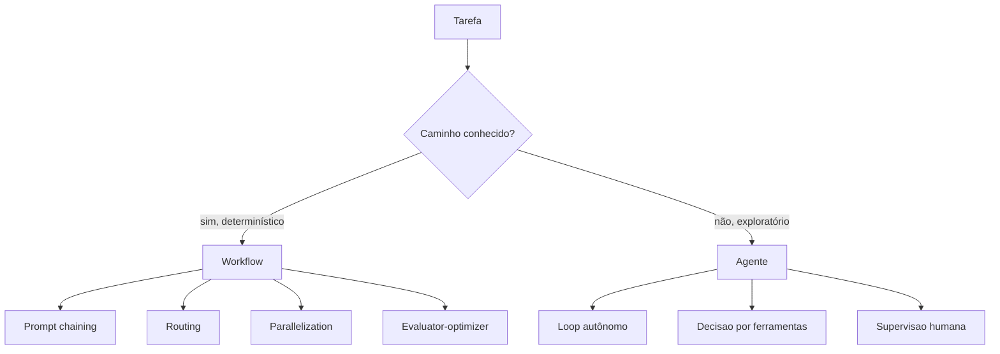

# Capítulo 4: Workflows vs agentes: a regra de ouro da arquitetura de IA

## 1. Introdução

O Capítulo 3 fechou a Parte I com o harness como assinatura — a cidade ao redor do agente. Agora você inicia a Parte II, o zoneamento dos trilhos: a arquitetura de sistemas. E começa pela decisão arquitetural mais importante de qualquer sistema com IA: usar um workflow determinístico ou um agente autônomo. Esta é a pergunta que define custo, previsibilidade, auditabilidade e manutenibilidade de tudo o que vem depois — e a maioria dos times erra escolhendo por entusiasmo em vez de critério. Você vai aprender a regra de ouro que a prática consolidou, os padrões de workflow mais comuns, e o método para decidir com evidência — inclusive na direção oposta à intuição, quando o workflow vence o agente.

## 2. Explica

A distinção entre workflows e agentes tem uma definição formal que orienta toda a arquitetura de IA em produção: workflows são sistemas nos quais os LLMs e as ferramentas são orquestrados por caminhos de código predefinidos; agentes são sistemas nos quais os LLMs orquestram dinamicamente seu próprio processo de resolução de tarefas, decidindo as ferramentas a chamar e os passos a seguir [1]. A referência da Anthropic — o texto canônico da distinção — formula a regra de ouro com precisão: encontre a solução mais simples possível e só aumente a complexidade quando necessário; em particular, use workflows quando você precisar de previsibilidade e consistência em tarefas bem definidas, e use agentes quando precisar de flexibilidade e modelagem de decisão em escala [1].

Note como essa definição inverte a intuição popular. O senso comum de 2025 era "agente é o futuro, workflow é o passado" — mas a prática de produção demonstrou o contrário: a maioria das aplicações de IA em escala usa workflows, porque a previsibilidade e a auditabilidade valem mais do que a flexibilidade em processos de negócio críticos. O agente puro — o loop autônomo que decide tudo — é a exceção, reservada para tarefas exploratórias onde o caminho não pode ser antecipado. A consequência prática para o engenheiro acima da média: saber escolher workflow onde workflow resolve — e defender essa escolha contra a pressão de "colocar um agente em tudo" — é uma das competências mais valiosas do portfólio de arquitetura [2]. A mesma lógica aparece na análise comparativa das plataformas de orquestração de 2026: LangGraph, CrewAI e os ecossistemas convergentes competem justamente pela capacidade de expressar tanto workflows rígidos quanto agentes flexíveis, porque a indústria aprendeu que os dois são necessários — em partes diferentes do mesmo sistema [3].

## 3. Ilustra

Pense no sistema ferroviário sob o ponto de vista do maquinista acima da média. Existem dois tipos de trecho de linha. O primeiro é o trecho de linha fixa: a ligação diária entre duas cidades, com horários definidos, paradas conhecidas e regras claras — ninguém delega a um "maquinista inteligente" a decisão de parar ou não na estação intermediária: o sistema é desenhado para ser previsível, e qualquer desvio é tratado como incidente. O segundo é o trecho de exploração: a linha nova em território desconhecido, onde ninguém sabe ainda onde estão os obstáculos — aqui o maquinista autônomo tem valor, porque precisa decidir no momento, observando o terreno e adaptando a rota. O engenheiro de vias acima da média sabe que não existe "trem inteligente" universal: existe trecho de linha fixa (workflow) e trecho de exploração (agente), e a competência está em classificar o trecho antes de escolher a locomotiva. Como Engenheiro(a) de Software, seu erro mais caro é tratar uma linha fixa — pagamento, triagem, aprovação — como território de exploração, e pagar por autonomia onde a previsibilidade era o requisito.



O diagrama condensa a regra de ouro em uma pergunta: o caminho é conhecido? Se sim, workflow — com seus padrões (chaining, routing, parallelization, evaluator-optimizer); se não, agente — com seu loop autônomo e supervisão nos pontos certos. A classificação é o ato de arquitetura: ela acontece antes de qualquer código, e define o custo e a confiabilidade de todo o sistema. Esse vocabulário — o caminho conhecido versus o território de exploração — vai reaparecer em cada capítulo da Parte II, porque é a lente que distingue onde a arquitetura impõe estrutura e onde ela habilita flexibilidade.

## 4. Técnica

### Padrões de workflow: o repertório do arquiteto

A primeira entrega técnica é o repertório: os padrões de workflow que a prática consolidou e que você vai aplicar na maioria dos casos [1]. O prompt chaining decompõe uma tarefa em passos sequenciais, cada um alimentando o seguinte — ideal para transformações multiestágio. O routing classifica a entrada e despacha para o caminho especializado — ideal para tarefas de tipos diferentes com um classificador barato na frente. A parallelization executa subtarefas independentes em paralelo, com agregação final — ideal para dividir um problema em partes que não dependem entre si. O evaluator-optimizer gera uma resposta, avalia contra critérios e gera novamente quando necessário — ideal para iteração de qualidade com uma única ferramenta. O código abaixo implementa o routing, o padrão mais comum de eficiência em produção, com um classificador determinístico na frente:

```python
"""Routing: classifica a entrada e despacha para o workflow especializado."""
from dataclasses import dataclass
from typing import Callable


@dataclass
class Rota:
    nome: str
    criterio: Callable[[str], bool]
    executor: Callable[[str], str]


class Roteador:
    """Despacha cada entrada para a primeira rota cujo criterio satisfaz."""

    def __init__(self, rotas: list):
        self.rotas = rotas
        self.fallback = lambda entrada: f"Sem rota especializada: {entrada}"

    def despachar(self, entrada: str) -> str:
        for rota in self.rotas:
            if rota.criterio(entrada):
                return rota.executor(entrada)
        return self.fallback(entrada)


def classificador_pagamento(texto: str) -> str:
    """Exemplo de roteamento: cada categoria chama um fluxo especifico."""
    rotas = [
        Rota("reembolso", lambda t: "reembolso" in t.lower(),
             lambda t: f"Fluxo de reembolso: {t}"),
        Rota("fraude", lambda t: "fraude" in t.lower(),
             lambda t: f"Fluxo de fraude: {t}"),
        Rota("duvida", lambda t: "?" in t,
             lambda t: f"Fluxo de duvida: {t}"),
    ]
    return Roteador(rotas).despachar(texto)


if __name__ == "__main__":
    for ticket in ["Quero reembolso do pagamento", "Isso parece fraude", "Como funciona?"]:
        print(classificador_pagamento(ticket))
```

O código compila e roda, e demonstra o princípio do routing: o custo da classificação é baixo (regras simples), e o ganho é alto (cada categoria segue um workflow dedicado, mais previsível e mais barato do que um agente genérico tentando resolver tudo). A regra de ouro aplicada: caminhos conhecidos, workflow [1]. Esse padrão é o cavalo de batalha da arquitetura de IA em produção — e é exatamente o tipo de decisão que as entrevistas de system design de 2026 avaliam, quando pedem consciência de custo por requisição e escolha de modelo menor para tarefas simples [2].

### O loop de agente com supervisão: quando a autonomia compensa

A segunda entrega é o outro lado da moeda: o loop de agente mínimo, com a disciplina que o torna seguro — iteração limitada, supervisão nos pontos de decisão e registro de cada passo. O código abaixo implementa um agente ReAct simplificado (raciocina, age, observa) com teto de iterações — a disciplina de harness aplicada ao agente [1][4]:

```python
"""Loop de agente ReAct com teto de iteracoes e registro de passos."""
import json
from dataclasses import dataclass, field


@dataclass
class Passo:
    raciocinio: str
    acao: str
    observacao: str


@dataclass
class AgenteMinimo:
    ferramentas: dict
    max_iteracoes: int = 5
    historico: list = field(default_factory=list)

    def raciocinar(self, tarefa: str) -> dict:
        """Simula o raciocinio do LLM: escolhe a ferramenta e o argumento."""
        # Em producao, isto e uma chamada real ao modelo.
        for nome in self.ferramentas:
            if nome in tarefa:
                return {"ferramenta": nome, "argumento": tarefa}
        return {"ferramenta": "responder", "argumento": tarefa}

    def executar(self, tarefa: str) -> str:
        """Roda o loop ReAct com teto de iteracoes e trilha de auditoria."""
        estado = tarefa
        for _ in range(self.max_iteracoes):
            decisao = self.raciocinar(estado)
            if decisao["ferramenta"] == "responder":
                self.historico.append(Passo("concluir", "responder", decisao["argumento"]))
                return decisao["argumento"]
            observacao = self.ferramentas[decisao["ferramenta"]](decisao["argumento"])
            self.historico.append(Passo(
                f"usar {decisao['ferramenta']}", decisao["argumento"], observacao
            ))
            estado = f"{estado} -> {observacao}"
        raise RuntimeError("Maximo de iteracoes excedido: agente preso em loop")


if __name__ == "__main__":
    ferramentas = {
        "buscar_catalogo": lambda q: f"catalogo[{q}]",
        "calcular_preco": lambda p: "preco_calculado",
    }
    agente = AgenteMinimo(ferramentas)
    resultado = agente.executar("buscar_catalogo notebook")
    print("Resultado:", resultado)
    print("Trilha:", json.dumps([p.__dict__ for p in agente.historico], ensure_ascii=False))
```

O loop tem as três características que tornam agentes seguros em produção: teto de iterações (impede loop infinito e custo incontrolável), trilha de auditoria (cada passo registrado, o sensor do harness aplicado ao agente) e supervisão posicionada (o humano revisa os pontos de decisão, não cada linha). O agente compensa exatamente onde o workflow não chega: tarefas exploratórias com caminho desconhecido [1]. A disciplina de sistemas distribuídos — da qual o Capítulo 5 trata — garante que esse loop sobreviva a falhas: retries, estado persistido e recuperação, porque em produção o modelo falha, a API cai e o rate limit chega [5].

## 5. Aplica

Você é o arquiteto de um sistema de suporte que está sendo "agentificado". O CEO leu um artigo sobre agentes e quer que todo o fluxo de suporte seja autônomo — "o agente resolve tudo". Você sabe que o fluxo de reembolso tem regras rígidas, conformidade e trilha de auditoria obrigatória; o fluxo de dúvidas técnicas é aberto e exploratório. Seu instinto errado seria obedecer e colocar um agente em tudo — o resultado previsível é reembolso com erro de regra (incidente de conformidade) e custo de tokens multiplicado por dez em tarefas que uma árvore de decisão resolvia. O diagnóstico liga à regra de ouro: caminho conhecido é workflow — a classificação (routing) na frente, os fluxos especializados atrás; só o trecho exploratório (dúvida técnica complexa) recebe o agente. A correção, na prática, é a arquitetura híbrida: roteador na entrada, workflows para os fluxos de conformidade, agente com teto de iterações e supervisão para o trecho aberto — e uma apresentação ao CEO com o custo por requisição de cada opção, porque a consciência de custo é o argumento que o orçamento entende [2]. A empresa ganha a autonomia no lugar certo e a previsibilidade onde ela é lei — e você ganha a reputação de arquiteto que decide por critério, não por moda [1].

As armadilhas comuns, sintetizadas, são três. Primeira: "agentificar" processos com caminho conhecido — o custo e o risco de conformidade disparam sem ganho de qualidade [1]. Segunda: usar workflow onde a tarefa é genuinamente exploratória — o workflow engessa o agente e ele entrega resultados piores que a autonomia supervisionada. Terceira: escolher agente por status — "meu sistema tem agentes" é uma métrica de vaidade; a métrica real é previsibilidade por custo, e o repertório de workflows é o que mantém essa razão saudável [2]. A métrica de sucesso da arquitetura é dupla: o custo por requisição resolvida (deve cair com o routing) e a taxa de desvios de processo em fluxos críticos (deve permanecer zero). O Capítulo 5 aprofunda o requisito que todo esse desenho exige em produção: a execução durável — o estado que sobrevive a falhas.

A escolha entre workflow e agente tem camadas de profundidade que a literatura recente ajuda a calibrar, e cada uma delas fortalece o seu critério de decisão. A primeira é a camada do protocolo: a análise da IBM sobre padrões de arquitetura MCP mostra que a decisão workflow-versus-agente não termina na topologia — ela continua na forma como os componentes se conectam, e o MCP oferece o padrão de desacoplamento que permite trocar um workflow rígido por um agente, ou vice-versa, sem reescrever as integrações [6]. A segunda é a camada do conhecimento: a distinção entre MCP (transporte), RAG (conhecimento) e agentes (orquestração) — documentada pela InfraNodus — reforça que o workflow alimenta-se do conhecimento recuperado, e a qualidade da recuperação define o teto de qualidade do workflow, independentemente da topologia [7]. A terceira é a camada de orquestração: a análise comparativa de 2026 mostra que as plataformas evoluíram para expressar ambos os modos com observabilidade nativa — a decisão workflow-versus-agente hoje é configurável, não binária, e o arquiteto que entende os trade-offs desenha sistemas híbridos com o melhor dos dois [3]. A quarta é a camada de durabilidade: a disciplina de sistemas distribuídos documentada pela Temporal aplica-se aos dois modos — workflows e agentes precisam de retries stateful e recuperação de falhas, e a diferença prática entre eles diminui quando ambos são tratados como fluxos duráveis [5]. A quinta é a camada de mercado: as entrevistas de system design de 2026 avaliam exatamente essa maturidade — o candidato que explica quando usar workflow, quando usar agente e quanto cada um custa por requisição é o que a rubrica classifica como sênior [2]; e a mesma consciência de custo aparece no playbook de preparação de 2026, que lista o design sensível a IA e a análise de custos como as duas competências mais cobradas [8]. A síntese é direta: a regra de ouro não é um slogan — é o primeiro teste de arquitetura que o mercado aplica, e o portfólio que demonstra uma arquitetura híbrida bem desenhada é a prova que abre as portas das entrevistas [9].

A regra de ouro entre workflow e agente ganha profundidade quando conectada ao harness e ao mercado. A hierarquia das disciplinas situa a decisão no lugar certo: o prompt decide na mensagem, o contexto na sessão e o harness no sistema — e a escolha entre workflow e agente é uma decisão de sistema, não de prompt [10]. O harness de longa duração documentado pela Anthropic mostra que a decisão se sustenta na arquitetura: workflows e agentes convivem em sessões prolongadas, com planejador, gerador e avaliador em papéis distintos e supervisão nos pontos certos [11]. O AIDD formaliza o papel do arquiteto nessa decisão: o desenvolvedor é o parceiro deliberado que escolhe a topologia e responde pelo resultado [12]. O portfólio documenta a decisão na prática: os projetos que demonstram a arquitetura híbrida — workflow no caminho conhecido, agente no exploratório — são os que capturam a atenção do mercado [13], e o histórico iterativo prova que a decisão foi construída, não decorada [14]. A presença digital multiplica a evidência: o artigo que narra a decisão e o trade-off transforma o projeto em autoridade [15], e o stack de IA moderno — RAG, MCP, agentes e harnesses — é o vocabulário que o mercado de 2026 reconhece [16]. Os dados de mercado confirmam a direção: as vagas de AI Engineer pedem exatamente a capacidade de escolher a arquitetura com consciência de custo [17][18]. E o projeto de ponta a ponta — da arquitetura à operação — é a prova que a entrevista explora, com as métricas que a rubrica de 2026 avalia [19].

A regra de ouro ganha a sua forma final na disciplina emergente: o harness engineering documentado pela OpenAI é onde a decisão entre workflow e agente deixa de ser artesanal e vira rotina industrial — a arquitetura, não o prompt, é o contrato [20].


### Aprofundamento: a decisão de topologia em detalhe

A regra de ouro da arquitetura de IA — use o caminho mais simples que resolve o problema — ganha precisão quando decomposta nas perguntas que o engenheiro deve responder antes de escolher entre workflow e agente [1]. A primeira pergunta é a da previsibilidade: o caminho é conhecido e as saídas são estruturadas? Então o workflow determinístico — com passos explícitos e validação em cada nó — é a escolha certa, e a Anthropic documenta os padrões de orquestração com exemplos de produção [2]. A segunda pergunta é a da escala de ferramentas: as plataformas de orquestração de 2026 oferecem graus de autonomia que vão do workflow rígido ao agente totalmente autônomo, e a escolha errada é a causa mais comum de custo e latência fora de controle [3]. A terceira pergunta é a da governança: a disciplina de harness engineering define que a decisão de topologia não é um detalhe de implementação, mas uma decisão de sistema que o harness deve impor [4]. A execução durável atravessa as duas topologias: a Temporal mostra que workflows e agentes precisam igualmente de retry, checkpoint e idempotência, e a diferença está apenas no grau de autonomia do loop [5]. O protocolo MCP entra como o facilitador de ambas: o contrato de ferramentas permite trocar a topologia sem reescrever as integrações [6]. A delimitação entre MCP, RAG e agentes organiza a conversa: o transporte, o conhecimento e a orquestração são camadas distintas, e confundi-las é o erro de arquitetura mais comum em projetos de IA [7]. A preparação para entrevistas de system design em 2026 inclui praticar exatamente essa decisão: os playbooks mais recentes pedem que o candidato explique quando usar workflow e quando usar agente, com justificativa de custo e latência [8]. O portfólio documenta a decisão na prática: os guias de construção de portfólio mostram que o projeto que narra a escolha da topologia — e as alternativas descartadas — é o que captura a atenção do recrutador [9]. A hierarquia das disciplinas situa a decisão no lugar certo: o prompt decide na mensagem, o contexto na sessão e o harness no sistema — e a escolha entre workflow e agente é uma decisão de sistema, não de prompt [10]. O harness de longa duração da Anthropic mostra que as duas topologias convivem: em sessões prolongadas, o planejador escolhe a rota, o gerador executa o passo e o avaliador decide se o resultado passa — um híbrido natural [11]. O manifesto do AIDD formaliza o papel do arquiteto nessa decisão: o desenvolvedor é o parceiro deliberado que escolhe a topologia e responde pelo resultado [12]. O portfólio de evidências materializa a decisão: os 3 a 5 projetos que sustentam a narrativa devem incluir pelo menos um sistema híbrido, com a decisão documentada [13]. O guia do Zencoder mostra como apresentar essa decisão: problema, trade-offs, alternativa escolhida e resultado medido — a narrativa que prova senioridade [14]. O repositório público — o GitHub — fornece o histórico iterativo: o commit log mostra a decisão sendo construída, não decorada, e isso é evidência que nenhuma entrevista consegue falsificar [15]. Os projetos de machine learning de ponta a ponta listados pela Udacity incluem exatamente o tipo de arquitetura híbrida que exercita a regra de ouro: pipeline determinístico com agente de decisão no ponto de maior incerteza [16]. O mercado de trabalho de 2026 confirma a direção: as vagas de AI Engineer pedem explicitamente a capacidade de escolher a arquitetura com consciência de custo, e a análise do Pragmatic Engineer documenta a mudança de perfil [17]. As análises de mercado de talento de IA mostram que a habilidade de arquitetura — não a de digitação — é o filtro das vagas senior [18]. A projeção de longo prazo do desenvolvimento de software coloca a decisão de topologia como a competência central do engenheiro da década [19]. E o harness engineering da OpenAI encerra a discussão: a disciplina industrial da orquestração de agentes transforma a regra de ouro de princípio em rotina — e o engenheiro que a domina é o que o mercado procura [20].


A decisão de topologia encerra com um exercício recomendado: reconstrua o sistema de um produto real — um helpdesk, uma análise de documentos, um orquestrador de campanhas — e documente onde o caminho é conhecido e onde é exploratório [2]. Esse exercício treina a rubrica que a entrevista de 2026 aplica [8], alimenta o portfólio com uma decisão real [9] e mostra ao recrutador a diferença entre quem decorou padrões e quem desenha com justificativa [14]. A regra de ouro não é uma frase: é um método de trabalho que o engenheiro acima da média exercita a cada novo sistema [1].
## 6. Conclusão

Você dominou a decisão arquitetural mais importante de sistemas com IA: a regra de ouro que separa workflows de agentes pelo critério do caminho conhecido. Os três pontos principais são: a maioria das aplicações em escala usa workflows, porque previsibilidade e auditabilidade valem mais que flexibilidade em processos críticos; o repertório de padrões de workflow — chaining, routing, parallelization, evaluator-optimizer — é o cavalo de batalha do arquiteto; e o agente puro é a exceção disciplinada, com teto de iterações, trilha e supervisão. O desafio desta semana: classifique os fluxos de um sistema que você conhece — quantos são workflow e quantos são genuinamente agente? No próximo capítulo, você aprende o que sustenta o agente em produção: a execução durável e a resiliência do estado.

## 7. Referências Bibliográficas
[1] ANTHROPIC. *Building effective agents*. 2024. Disponível em: https://www.anthropic.com/engineering/building-effective-agents. Acesso em: 06 ago. 2026.
[2] EXPONENT. *System design interview prep & questions (2026 guide)*. 2026. Disponível em: https://www.tryexponent.com/blog/system-design-interview-guide. Acesso em: 06 ago. 2026.
[3] DIGITAL APPLIED. *AI workflow orchestration platforms: 2026 comparison*. 2026. Disponível em: https://www.digitalapplied.com/blog/ai-workflow-orchestration-platforms-comparison. Acesso em: 06 ago. 2026.
[4] BÖCKELER, Birgitta; FOWLER, Martin. *Harness engineering: the discipline of building effective software agents*. Thoughtworks/Martin Fowler, 2026. Disponível em: https://martinfowler.com/articles/harness-engineering.html. Acesso em: 06 ago. 2026.
[5] MARTIN, Kevin Paul (TEMPORAL). *From AI hype to durable reality: why agentic flows need distributed-systems discipline*. 2025. Disponível em: https://temporal.io/blog/from-ai-hype-to-durable-reality-why-agentic-flows-need-distributed-systems. Acesso em: 06 ago. 2026.
[6] CHOWDHURY, Supal; SAHA, Subrata; ABDEL SAMAD, Haitham (IBM DEVELOPER). *Model Context Protocol architecture patterns for multi-agent AI systems*. 2026. Disponível em: https://developer.ibm.com/articles/mcp-architecture-patterns-ai-systems/. Acesso em: 06 ago. 2026.
[7] INFRANODUS ENGINEERING. *MCP vs RAG vs AI agents: differences and how they work together*. 2026. Disponível em: https://infranodus.com/docs/mcp-vs-rag-vs-ai-agents. Acesso em: 06 ago. 2026.
[8] SHIVALI. *The 2026 system design prep playbook: what to study, practice, and expect*. 2026. Disponível em: https://medium.com/@shivali0087/the-2026-system-design-prep-playbook-what-to-study-practice-and-expect-b3068bd2e67e. Acesso em: 06 ago. 2026.
[9] DATAEXPERT.IO. *Ultimate guide to AI engineering portfolios*. 2026. Disponível em: https://www.dataexpert.io/blog/ultimate-guide-ai-engineering-portfolios. Acesso em: 06 ago. 2026.
[10] ATLAN RESEARCH. *Harness engineering vs prompt engineering*. 2026. Disponível em: https://atlan.com/know/harness-engineering-vs-prompt-engineering/. Acesso em: 06 ago. 2026.
[11] RAJASEKARAN, Prithvi (ANTHROPIC ENGINEERING). *Harness design for long-running agentic applications*. 2026. Disponível em: https://www.anthropic.com/engineering/harness-design-long-running-apps. Acesso em: 06 ago. 2026.
[12] AI-DRIVEN DEVELOPMENT MANIFESTO. *Manifesto for AI-Driven Development*. 2026. Disponível em: https://www.ai-driven-development.org/. Acesso em: 06 ago. 2026.
[13] JACKSON, Natalia (HYPERSKILL). *Building a developer portfolio in 2026: what actually gets attention*. 2026. Disponível em: https://hyperskill.org/blog/post/building-a-developer-portfolio-in-2026-what-actually-gets-attention. Acesso em: 06 ago. 2026.
[14] ZENCODER. *How to create a software engineer portfolio in 2026*. 2026. Disponível em: https://zencoder.ai/blog/how-to-create-software-engineer-portfolio. Acesso em: 06 ago. 2026.
[15] BOUCHARD, Louis-François. *Start AI engineering*. GitHub, 2026. Disponível em: https://github.com/louisfb01/start-ai-engineering. Acesso em: 06 ago. 2026.
[16] UDACITY. *20 machine learning projects that will boost your portfolio*. 2025/2026. Disponível em: https://www.udacity.com/blog/20-machine-learning-projects-that-will-boost-your-portfolio/. Acesso em: 06 ago. 2026.
[17] OROSZ, Gergely; SALMON, Jessica (THE PRAGMATIC ENGINEER). *The job market in 2026 (part 2)*. 2026. Disponível em: https://newsletter.pragmaticengineer.com/p/the-job-market-in-2026-part-2. Acesso em: 06 ago. 2026.
[18] NEXUS IT GROUP. *AI engineering jobs: 2026 talent market analysis*. 2026. Disponível em: https://nexusitgroup.com/ai-engineering-jobs/. Acesso em: 06 ago. 2026.
[19] OSMANI, Addy. *The next two years of software engineering*. 2026. Disponível em: https://addyosmani.com/blog/next-two-years/. Acesso em: 06 ago. 2026.
[20] LOPOPOLO, Ryan (OPENAI). *Harness engineering at OpenAI*. 2026. Disponível em: https://openai.com/index/harness-engineering/. Acesso em: 06 ago. 2026.