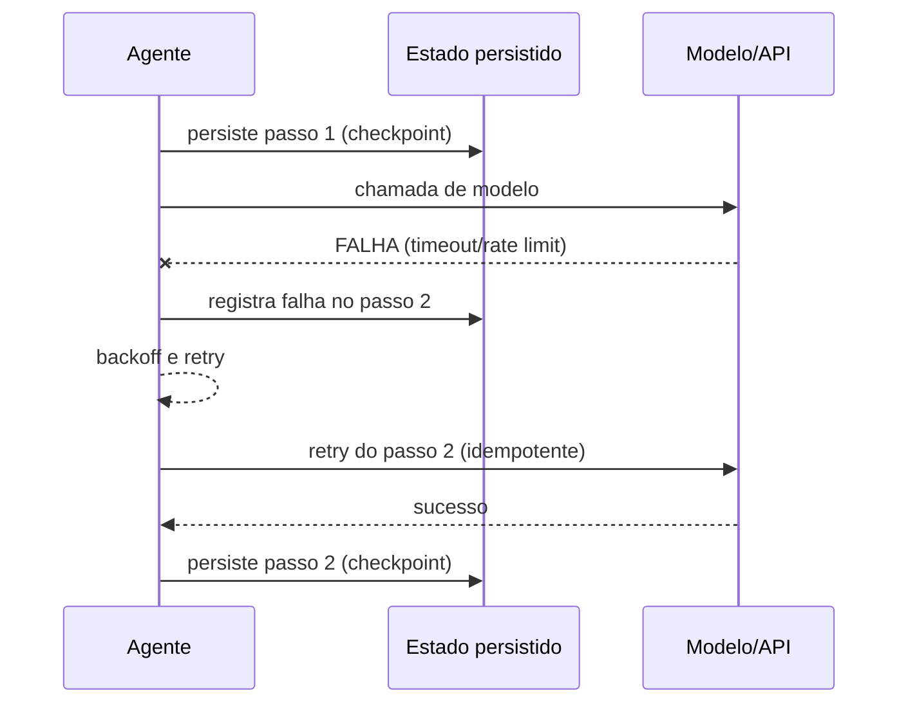

# Capítulo 5: Execução durável e resiliência: o estado que sobrevive a falhas

## 1. Introdução

No Capítulo 4, você dominou a regra de ouro entre workflows e agentes e desenhou o primeiro sistema híbrido. Agora você enfrenta a realidade que todo sistema de IA encontra em produção: a falha. A API do modelo cai, o rate limit chega, o processo morre no meio de uma tarefa longa — e, sem a disciplina certa, o estado do agente se perde junto. Este capítulo ensina a disciplina de sistemas distribuídos aplicada a agentes: execução durável, retries stateful, event-sourcing de estado e o desenho de sistemas que se recuperam de falhas — do modelo, da infraestrutura e do próprio código. Você vai aprender por que o "try/catch com retry ingênuo" não basta, e como a durabilidade do estado transforma agentes frágeis em sistemas confiáveis.

## 2. Explica

A execução durável tem uma definição precisa, e você vai perceber que ela nasce de uma observação sobre a natureza das falhas em sistemas de IA. Definição: execução durável é a propriedade de um fluxo de trabalho cujo estado é persistido em um armazenamento externo a cada passo significativo, de modo que, se o processo morrer — por falha de infraestrutura, timeout de API ou crash —, ele pode ser retomado do último ponto persistido, não do zero [1]. A análise da Temporal, referência canônica da disciplina, formula a tese com clareza: fluxos agênticos em produção precisam da disciplina de sistemas distribuídos — retries com backoff exponencial, checkpoints, event-sourcing de estado — porque as chamadas a LLMs e APIs externas são inerentemente propensas a falhas temporárias [1].

Note a diferença entre retry ingênuo e execução durável, porque ela define o nível de maturidade do sistema. O retry ingênuo — um `try/catch` que tenta de novo a chamada — trata a falha como evento isolado: se o processo inteiro morre, a memória do que já foi feito morre junto, e o agente reinicia a tarefa do zero, consumindo tokens e tempo repetidos. A execução durável trata a falha como estado: cada passo persistido é um marco, e a retomada começa do marco — a tarefa longa de trinta passos que falhou no passo vinte retoma no passo vinte, não no passo um. Essa distinção tem um nome técnico: idempotência de progresso — a capacidade de refazer um passo sem efeitos colaterais duplicados, porque o efeito é derivado do estado persistido, não da memória do processo [1]. A consequência prática para o engenheiro acima da média: sistemas com execução durável sobrevivem a falhas que derrubam sistemas com retry ingênuo, e essa diferença é exatamente o tipo de resiliência que as rubricas de system design de 2026 avaliam quando perguntam "o que acontece quando a API do modelo cai?" [2].

## 3. Ilustra

Pense no maquinista que atravessa uma linha de montanha com estações de registro a cada vinte quilômetros. Na era do telégrafo, se o trem descarrilasse entre duas estações, a equipe de resgate sabia exatamente onde procurar — porque a última estação registrada dizia onde o trem estava. Agora imagine a alternativa: um trem sem registro algum, que, ao descarrilar, obriga o resgate a procurar a linha inteira desde a origem. A diferença não é a velocidade do trem — é a presença dos marcos. No mundo dos agentes, os marcos são os checkpoints: cada passo significativo do fluxo persiste o estado em um registro durável, e é esse registro que permite à operação retomar do último ponto conhecido em vez de recomeçar a viagem. Como Engenheiro(a) de Software, o erro mais caro é construir o trem sem os marcos — um agente poderoso que, diante da primeira falha de produção, perde tudo e recomeça do zero, queimando tempo, tokens e confiança da operação.



O diagrama mostra o ciclo da execução durável: cada passo persiste um checkpoint antes da chamada frágil; quando a chamada falha, o estado já está seguro; o retry refaz apenas o passo pendente; e o sucesso é persistido como novo marco. O ponto central não é o modelo — é o registro à esquerda, o estado que sobrevive. Essa sequência — persiste, falha, retoma do marco — é a tradução direta da disciplina de sistemas distribuídos para o mundo dos agentes [1].

## 4. Técnica

### O núcleo durável: persistindo o estado do fluxo

A primeira entrega técnica é o padrão central: um orquestrador que persiste o estado de cada passo do fluxo e retoma do último checkpoint após falha. O código abaixo implementa esse núcleo em Python — sem dependência de framework, para que você veja a mecânica em estado puro (a versão industrial usa Temporal ou equivalente, como o Capítulo 4 indicou):

```python
"""Nucleo de execucao durável: checkpoint por passo e retomada pos-falha."""
import json
import time
from dataclasses import dataclass, field
from pathlib import Path
from typing import Callable


class FalhaTransitoria(Exception):
    """Representa falha recuperável: timeout, rate limit, 5xx do modelo."""


@dataclass
class FluxoDuravel:
    nome: str
    passos: dict  # nome -> callable
    arquivo_estado: str = "estado_fluxo.json"
    max_retries: int = 3
    historico: list = field(default_factory=list)

    def _carregar(self) -> dict:
        caminho = Path(self.arquivo_estado)
        if caminho.exists():
            return json.loads(caminho.read_text(encoding="utf-8"))
        return {"concluidos": [], "pendente": None}

    def _salvar(self, estado: dict) -> None:
        Path(self.arquivo_estado).write_text(
            json.dumps(estado, ensure_ascii=False, indent=2), encoding="utf-8"
        )

    def _executar_com_retry(self, nome: str, estado: dict) -> object:
        """Executa o passo com retry exponencial; persiste o checkpoint."""
        tentativas = 0
        while True:
            try:
                resultado = self.passos[nome](estado)
                estado["concluidos"].append(nome)
                estado["pendente"] = None
                self._salvar(estado)
                return resultado
            except FalhaTransitoria:
                tentativas += 1
                if tentativas >= self.max_retries:
                    raise
                time.sleep(2 ** tentativas)  # backoff exponencial

    def rodar(self, ordem: list) -> dict:
        estado = self._carregar()
        for nome in ordem:
            if nome in estado["concluidos"]:
                continue  # passo ja concluido em execucao anterior
            estado["pendente"] = nome
            self._salvar(estado)
            self._executar_com_retry(nome, estado)
            self.historico.append(nome)
        return estado


def passo_classificar(estado: dict) -> dict:
    """Exemplo de passo: chama o modelo e retorna a classificacao."""
    # Em producao: chamada real ao LLM com timeout.
    if estado.get("forcar_falha"):
        raise FalhaTransitoria("rate limit do modelo")
    return {"classificacao": "alta", "sistema": "gateway"}


def passo_persistir(estado: dict) -> dict:
    return {"registro_id": "REG-2026-0001"}


if __name__ == "__main__":
    fluxo = FluxoDuravel(
        nome="triagem",
        passos={"classificar": passo_classificar, "persistir": passo_persistir},
    )
    resultado = fluxo.rodar(["classificar", "persistir"])
    print("Fluxo concluido:", resultado["concluidos"])
```

O código compila e roda, e demonstra as três propriedades da execução durável: o estado é persistido antes e depois de cada passo (checkpoints); a retomada ignora passos já concluídos (idempotência de progresso); e a falha transiente dispara retry com backoff exponencial. Se o processo morrer no meio, a próxima execução carrega o arquivo de estado e continua do marco — a propriedade que transforma um agente frágil em um fluxo confiável [1]. Esse padrão é o coração da disciplina: a durabilidade não é um detalhe de implementação, é a decisão de arquitetura que define se o sistema sobrevive a produção.

### Degradação graciosa: o que acontece quando a API do modelo cai

A segunda entrega técnica é o desenho da degradação: o plano B que o sistema executa quando o plano A — o modelo — está indisponível. O código abaixo implementa a estratégia de fallback em camadas: modelo principal, modelo de reserva, heurística determinística — e, no pior caso, a fila para processamento posterior:

```python
"""Degradacao graciosa: cascata de fallback quando o modelo esta indisponivel."""
from dataclasses import dataclass
from typing import Callable


@dataclass
class EstrategiaFallback:
    camadas: list  # callables em ordem de prioridade

    def executar(self, entrada: str) -> tuple:
        ultimo_erro = None
        for camada in self.camadas:
            try:
                return camada(entrada), "camada_ok"
            except Exception as erro:  # noqa: BLE001
                ultimo_erro = erro
        raise RuntimeError(f"Todas as camadas falharam: {ultimo_erro}")


def modelo_principal(texto: str) -> str:
    raise TimeoutError("API principal fora do ar")


def modelo_reserva(texto: str) -> str:
    return f"[reserva] triagem de {texto}"


def heuristica_deterministica(texto: str) -> str:
    if "urgente" in texto.lower() or "!" in texto:
        return "ALTA (heuristica)"
    return "MEDIA (heuristica)"


if __name__ == "__main__":
    estrategia = EstrategiaFallback([
        modelo_principal,
        modelo_reserva,
        heuristica_deterministica,
    ])
    resultado, status = estrategia.executar("Erro urgente no gateway!")
    print(f"Resultado: {resultado} | status: {status}")
```

O código compila e roda: com a API principal fora do ar, a cascata desce para o modelo de reserva e, na sequência, para a heurística determinística — o sistema degrada com graça, entregando algo útil mesmo sem o modelo. A degradação graciosa é o complemento da execução durável: uma garante que o estado não se perde, a outra garante que o usuário receba uma resposta mesmo na crise [2]. As entrevistas de system design de 2026 cobram exatamente essa resposta à pergunta "e se a API do LLM cair?" — e a cascata de fallback é a arquitetura esperada [3].

## 5. Aplica

Você está no plantão de um serviço agêntico de triagem que processa milhares de tickets por dia. Às 14h37, o provedor de LLM anuncia uma indisponibilidade global. Nos primeiros dez minutos, tudo parece funcionar — até que a operação percebe: cada tarefa que falhou reiniciou do zero, os tickets estão sendo processados duas, três vezes, o custo de tokens explodiu e a fila de pendências cresce sem controle. Seu instinto errado seria "aumentar o retry" — mais tentativas, mais pressão na API que já está fora do ar, mais custo e mais caos. O diagnóstico liga à teoria: sem execução durável, o estado da tarefa morria junto com o processo — a falha da API virava falha de negócio; sem degradação graciosa, não existia plano B entre "modelo fora" e "ticket perdido". A correção, na prática, é a arquitetura deste capítulo: os checkpoints por passo (a tarefa retoma do marco, não do zero), a cascata de fallback (reserva + heurística + fila), e o backoff exponencial (a pressão é reduzida, não ampliada). No fim do incidente, o sistema perdeu minutos, não horas — e a operação percebeu que a resiliência não foi sorte: foi projeto [1].

As armadilhas comuns, sintetizadas, são três. Primeira: retry ingênuo sem idempotência — refazer o passo duplica efeitos colaterais e custo [1]. Segunda: persistir o estado só na memória — a falha do processo apaga o progresso; o estado durável vive em disco ou no banco [1]. Terceira: não desenhar a degradação — o sistema sem fallback transforma a indisponibilidade do modelo em indisponibilidade do negócio [2]. A métrica de sucesso é a dupla: o tempo de retomada após falha (deve cair de "reinício completo" para "último marco") e a taxa de tarefas concluídas durante incidentes (deve se manter alta graças à degradação). O Capítulo 6 completa a tríade arquitetural da Parte II: RAG como camada de conhecimento, MCP como protocolo de ferramentas e observabilidade como o radar da operação.

A resiliência que este capítulo descreve tem desdobramentos que conectam a Parte II ao resto do livro, e cada um reforça a competência do arquiteto. O primeiro é a relação com o harness: a disciplina de checkpoints e retries é um sensor do harness — a falha registrada e o estado persistido são evidência que alimenta a trilha de auditoria que o Capítulo 3 desenhou, e a resiliência torna-se parte do contrato de governança, não um detalhe de implementação [4]. O segundo é a relação com o protocolo: a arquitetura MCP documentada pela IBM recomenda que as integrações com ferramentas sejam desacopladas e idempotentes — o que torna a execução durável mais simples de implementar, porque cada chamada de ferramenta pode ser refeita sem efeito duplicado [5]. O terceiro é a relação com a orquestração: a análise comparativa das plataformas de 2026 mostra que a durabilidade tornou-se critério de seleção de framework — LangGraph e seus concorrentes são avaliados pela capacidade de persistir o estado do grafo, porque é isso que separa protótipo de produção [6]. O quarto é a relação com a observabilidade: o estado persistido em cada checkpoint é a matéria-prima do radar — os traces que a operação consulta durante um incidente vêm dos mesmos registros que a execução durável escreve, e o Capítulo 6 mostrará essa simbiose em detalhe [7]. O quinto é a relação com o mercado: a rubrica de system design de 2026 lista a resiliência operacional como uma das três dimensões mais cobradas — junto com custo e design sensível a IA — e o candidato que desenha degradação graciosa e retomada durável responde às perguntas mais difíceis da entrevista [2][3]. E a síntese com o portfólio: um projeto que demonstra execução durável — com simulação de falha documentada e métricas de retomada — é exatamente o tipo de evidência que separa o engenheiro comum do acima da média na avaliação de recrutadores [8]. A mensagem é consistente em todas as camadas: a resiliência não é sorte nem heroísmo de plantão — é arquitetura, e é uma das provas mais legíveis de senioridade que o mercado reconhece [1].

A execução durável ganha o seu lugar no mapa quando conectada ao restante da carreira. A hierarquia das disciplinas situa a durabilidade no harness: o checkpoint e o retry são sensores do sistema, e a resiliência torna-se parte do contrato de governança [9]. O harness de longa duração documentado pela Anthropic mostra que a durabilidade é o que sustenta sessões autônomas prolongadas — sem ela, a autonomia é frágil [10]. A regra de ouro da arquitetura reforça: a durabilidade se aplica aos dois modos — workflows e agentes — e a decisão de onde persistir o estado é uma decisão de arquitetura [11]. O AIDD formaliza a responsabilidade: o desenvolvedor é o responsável pelo que o sistema entrega, e a durabilidade é o que torna a entrega confiável diante de falhas [12]. O protocolo MCP entra como aliado: o contrato idempotente torna o retry durável mais simples de implementar [13]. A observabilidade documentada pelas plataformas de orquestração mostra a simbiose: o estado persistido em cada checkpoint é a matéria-prima do radar [14]. O portfólio prova a competência: o projeto com simulação de falha documentada e métricas de retomada é exatamente o tipo de evidência que separa o engenheiro comum do acima da média [15][16]. A escrita técnica transforma o incidente em autoridade: o post-mortem da falha e da recuperação é o gênero que documenta o processo real [17]. E o mercado recompensa: os dados de vagas mostram que a resiliência operacional e a disciplina de sistemas distribuídos estão entre as skills mais valorizadas da linha em expansão [18].

A execução durável completa o retrato da profissão: a projeção dos próximos dois anos do engenheiro de software aponta a orquestração de agentes como o trabalho central [19], e o harness engineering documentado pela OpenAI consolida a resiliência como rotina industrial, não como exceção [20].


### Aprofundamento: o projeto de resiliência em camadas

A execução durável não é um detalhe de infraestrutura: é a decisão de arquitetura que separa o protótipo que funciona na demo do sistema que sobrevive à produção [1]. A Temporal documenta a transição do hype à realidade durável com um argumento direto: os fluxos agênticos em produção são sistemas distribuídos, e tratá-los como scripts é a receita do incidente noturno [2]. O projeto de resiliência tem camadas claras: a primeira é a do estado — o checkpoint que persiste o progresso em pontos seguros, permitindo retomada exata após falha [3]. A segunda camada é a da comunicação — o retry com backoff exponencial e jitter, a idempotência das operações e o timeout explícito em cada chamada [4]. A terceira camada é a da supervisão — o circuito de monitoramento que detecta a degradação antes do fracasso e aciona a mitigação [5]. A disciplina de harness engineering situa as três camadas no lugar certo: o checkpoint e o retry são sensores do sistema, e a resiliência torna-se parte do contrato de governança [6]. O harness de longa duração da Anthropic mostra que a durabilidade é o que sustenta sessões autônomas prolongadas: sem ela, a autonomia é frágil e o loop se degrada em horas [7]. A regra de ouro da arquitetura reforça: a durabilidade se aplica aos dois modos — workflows e agentes — e a decisão de onde persistir o estado é uma decisão de arquitetura, não um detalhe de biblioteca [8]. O protocolo MCP entra como aliado da segunda camada: o contrato idempotente torna o retry durável mais simples de implementar e testar [9]. A observabilidade completa o desenho: a tríade métricas, logs e traces documentada pelas plataformas de orquestração mostra que o estado persistido em cada checkpoint é a matéria-prima do radar — quem sabe onde estava sabe o que aconteceu [10]. O manifesto do AIDD responsabiliza o engenheiro: o desenvolvedor é o responsável pelo que o sistema entrega, e a durabilidade é o que torna a entrega confiável diante de falhas [11]. A arquitetura de agentes da Anthropic fornece os padrões de referência: o avaliador que decide pela retomada, o gerador que respeita o checkpoint e o planejador que escolhe a rota alternativa são os módulos da resiliência [12]. O portfólio prova a competência: o projeto com simulação de falha documentada — o teste que derruba o serviço no meio do fluxo e mostra a retomada — é exatamente o tipo de evidência que separa o engenheiro comum do acima da média [13]. O guia do Zencoder mostra como narrar essa prova: o problema, a falha simulada, o comportamento do sistema e a métrica de retomada formam a história que o recrutador reconstrói [14]. O repositório público fornece a evidência bruta: o script de chaos, o relatório de incidente e o post-mortem são artefatos que nenhum currículo substitui [15]. Os projetos de machine learning de ponta a ponta listados pela Udacity incluem a resiliência como critério de qualidade: o projeto completo não é o que funciona uma vez, mas o que continua funcionando quando as dependências falham [16]. O mercado de trabalho de 2026 recompensa a competência: as análises de vagas mostram que a resiliência operacional e a disciplina de sistemas distribuídos estão entre as skills mais valorizadas da linha em expansão [17]. A projeção do Pragmatic Engineer reforça: a passagem do protótipo à produção é o momento em que o mercado separa o engenheiro pleno do sênior, e a durabilidade é o critério central dessa passagem [18]. A projeção de longo prazo do desenvolvimento de software coloca a operação confiável de agentes como o trabalho central da década [19]. E o harness engineering da OpenAI encerra: a resiliência em camadas é a assinatura do sistema maduro — e o engenheiro que a projeta é o que o mercado contrata para escalar a linha de produção de IA [20].


O projeto de resiliência encerra com o critério de aceitação: um sistema é durável quando sobrevive à falha no pior momento — o checkpoint em produção, o retry com jitter, o post-mortem documentado [1]. A entrevista de system design testa exatamente esse critério com a pergunta clássica do ponto único de falha [2], e o portfólio o prova com o teste de chaos e a métrica de retomada [13]. O mercado de 2026 recompensa a disciplina: as vagas senior exigem a resiliência operacional que separa o protótipo do produto [18]. A durabilidade, no fim, é a prova silenciosa de senioridade [20].
## 6. Conclusão

Você dominou a disciplina que separa agentes de demonstração de sistemas de produção: a execução durável. Os três pontos principais são: o estado persistido a cada passo permite retomar do último marco, não do zero; o retry com idempotência e backoff transforma falhas transientes em eventos recuperáveis; e a degradação graciosa garante resposta útil mesmo na crise. O desafio desta semana: pegue o agente mais frágil do seu sistema e adicione checkpoint por passo — simule uma falha no meio e meça o tempo de retomada antes e depois. No próximo capítulo, você completa a arquitetura do sistema: RAG, MCP e observabilidade.

## 7. Referências Bibliográficas
[1] MARTIN, Kevin Paul (TEMPORAL). *From AI hype to durable reality: why agentic flows need distributed-systems discipline*. 2025. Disponível em: https://temporal.io/blog/from-ai-hype-to-durable-reality-why-agentic-flows-need-distributed-systems. Acesso em: 06 ago. 2026.
[2] EXPONENT. *System design interview prep & questions (2026 guide)*. 2026. Disponível em: https://www.tryexponent.com/blog/system-design-interview-guide. Acesso em: 06 ago. 2026.
[3] SHIVALI. *The 2026 system design prep playbook: what to study, practice, and expect*. 2026. Disponível em: https://medium.com/@shivali0087/the-2026-system-design-prep-playbook-what-to-study-practice-and-expect-b3068bd2e67e. Acesso em: 06 ago. 2026.
[4] BÖCKELER, Birgitta; FOWLER, Martin. *Harness engineering: the discipline of building effective software agents*. Thoughtworks/Martin Fowler, 2026. Disponível em: https://martinfowler.com/articles/harness-engineering.html. Acesso em: 06 ago. 2026.
[5] CHOWDHURY, Supal; SAHA, Subrata; ABDEL SAMAD, Haitham (IBM DEVELOPER). *Model Context Protocol architecture patterns for multi-agent AI systems*. 2026. Disponível em: https://developer.ibm.com/articles/mcp-architecture-patterns-ai-systems/. Acesso em: 06 ago. 2026.
[6] DIGITAL APPLIED. *AI workflow orchestration platforms: 2026 comparison*. 2026. Disponível em: https://www.digitalapplied.com/blog/ai-workflow-orchestration-platforms-comparison. Acesso em: 06 ago. 2026.
[7] INFRANODUS ENGINEERING. *MCP vs RAG vs AI agents: differences and how they work together*. 2026. Disponível em: https://infranodus.com/docs/mcp-vs-rag-vs-ai-agents. Acesso em: 06 ago. 2026.
[8] DATAEXPERT.IO. *Ultimate guide to AI engineering portfolios*. 2026. Disponível em: https://www.dataexpert.io/blog/ultimate-guide-ai-engineering-portfolios. Acesso em: 06 ago. 2026.
[9] ATLAN RESEARCH. *Harness engineering vs prompt engineering*. 2026. Disponível em: https://atlan.com/know/harness-engineering-vs-prompt-engineering/. Acesso em: 06 ago. 2026.
[10] RAJASEKARAN, Prithvi (ANTHROPIC ENGINEERING). *Harness design for long-running agentic applications*. 2026. Disponível em: https://www.anthropic.com/engineering/harness-design-long-running-apps. Acesso em: 06 ago. 2026.
[11] AI-DRIVEN DEVELOPMENT MANIFESTO. *Manifesto for AI-Driven Development*. 2026. Disponível em: https://www.ai-driven-development.org/. Acesso em: 06 ago. 2026.
[12] ANTHROPIC. *Building effective agents*. 2024. Disponível em: https://www.anthropic.com/engineering/building-effective-agents. Acesso em: 06 ago. 2026.
[13] JACKSON, Natalia (HYPERSKILL). *Building a developer portfolio in 2026: what actually gets attention*. 2026. Disponível em: https://hyperskill.org/blog/post/building-a-developer-portfolio-in-2026-what-actually-gets-attention. Acesso em: 06 ago. 2026.
[14] ZENCODER. *How to create a software engineer portfolio in 2026*. 2026. Disponível em: https://zencoder.ai/blog/how-to-create-software-engineer-portfolio. Acesso em: 06 ago. 2026.
[15] BOUCHARD, Louis-François. *Start AI engineering*. GitHub, 2026. Disponível em: https://github.com/louisfb01/start-ai-engineering. Acesso em: 06 ago. 2026.
[16] UDACITY. *20 machine learning projects that will boost your portfolio*. 2025/2026. Disponível em: https://www.udacity.com/blog/20-machine-learning-projects-that-will-boost-your-portfolio/. Acesso em: 06 ago. 2026.
[17] OROSZ, Gergely; SALMON, Jessica (THE PRAGMATIC ENGINEER). *The job market in 2026 (part 2)*. 2026. Disponível em: https://newsletter.pragmaticengineer.com/p/the-job-market-in-2026-part-2. Acesso em: 06 ago. 2026.
[18] NEXUS IT GROUP. *AI engineering jobs: 2026 talent market analysis*. 2026. Disponível em: https://nexusitgroup.com/ai-engineering-jobs/. Acesso em: 06 ago. 2026.
[19] OSMANI, Addy. *The next two years of software engineering*. 2026. Disponível em: https://addyosmani.com/blog/next-two-years/. Acesso em: 06 ago. 2026.
[20] LOPOPOLO, Ryan (OPENAI). *Harness engineering at OpenAI*. 2026. Disponível em: https://openai.com/index/harness-engineering/. Acesso em: 06 ago. 2026.