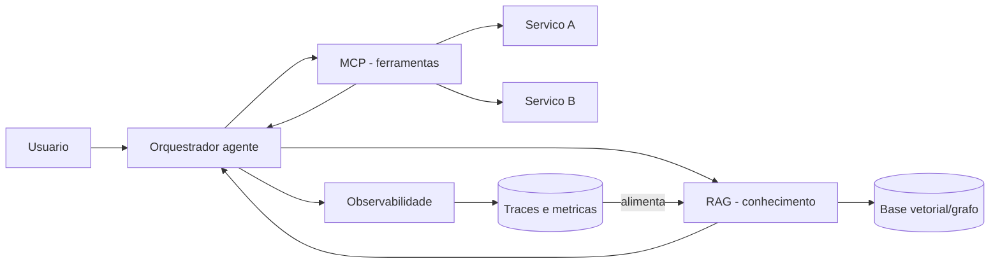

# Capítulo 6: RAG, MCP e observabilidade: o sistema completo do agente

## 1. Introdução

O Capítulo 5 lhe deu a coluna vertebral: a execução durável que mantém o estado vivo diante das falhas. Agora você completa o corpo do sistema — as três camadas que, junto com a durabilidade, formam o agente em produção: RAG como a camada de conhecimento que alimenta o contexto, MCP como o protocolo que desacopla o modelo das ferramentas, e observabilidade como o radar que torna o sistema operável. Você vai aprender a arquitetura completa — da recuperação do conhecimento ao rastreamento do raciocínio — e por que o domínio dessa tríade é uma das competências mais valorizadas do engenheiro de IA em 2026.

## 2. Explica

O sistema completo do agente tem três camadas com papéis distintos, e você vai perceber que a confusão entre elas é uma das causas mais comuns de arquiteturas ruins. A delimitação que a InfraNodus consolidou é a referência: MCP é a camada de transporte e ferramentas — o protocolo que conecta o modelo a fontes de dados e serviços externos de forma padronizada; RAG é a camada de conhecimento — o mecanismo que injeta informações relevantes no contexto do modelo; e o agente é a camada de orquestração — o loop que decide o que fazer com as duas anteriores [1]. A confusão típica é tratar RAG e MCP como concorrentes: eles resolvem problemas diferentes — RAG responde "o que o modelo sabe?", MCP responde "o que o modelo pode fazer?" — e sistemas maduros usam os dois, em camadas distintas [1].

A mecânica de cada camada tem seus próprios fundamentos. O RAG moderno vai além da busca vetorial simples: a evolução para GraphRAG constrói grafos de conhecimento que capturam relações lógicas e hierarquias — para consultas amplas ("qual a visão geral do sistema?") e relacionais, o grafo supera a busca por similaridade pura [1]. O MCP define uma arquitetura cliente-servidor limpa: o host de IA é o cliente, e os serviços expõem ferramentas, recursos e prompts de forma interoperável — o padrão da Anthropic que desacopla modelo e integrações [2]. A observabilidade, por sua vez, é a camada que a engenharia tradicional não preparou: não basta CPU e latência HTTP — é preciso rastrear tokens, custo por requisição, árvores de decisão do agente e histórico de chamadas de ferramentas, porque é isso que permite depurar o raciocínio, não apenas o resultado [3]. A consolidação da Atlan Research situa essas camadas na hierarquia do harness: o contexto (onde o RAG atua) é a camada da sessão, e o harness (onde MCP e observabilidade vivem) é a camada do sistema [4].

## 3. Ilustra

Pense no posto de comando central da ferrovia. O maquinista precisa de três coisas para conduzir o trem com segurança. A primeira é o mapa atualizado do trecho — rios, pontes, desvios — que ele consulta antes de cada decisão: isso é o RAG, o conhecimento recuperado na hora certa. A segunda é o conjunto padronizado de alavancas e sinais — cada alavanca conecta a cabine a um mecanismo do trem, e todas seguem o mesmo padrão, para que o maquinista de qualquer locomotiva consiga operar qualquer composição: isso é o MCP, o protocolo de ferramentas. A terceira é o painel de instrumentos — velocidade, pressão, temperatura, posição — que diz ao maquinista e ao controle central o que está acontecendo agora: isso é a observabilidade. Como Engenheiro(a) de Software, um agente sem RAG é um maquinista sem mapa; sem MCP, um maquinista preso a uma locomotiva específica; sem observabilidade, um maquinista voando cego. O sistema completo exige os três — e o engenheiro acima da média sabe desenhar exatamente essa cabine.



O diagrama mostra a arquitetura completa: o orquestrador consulta o RAG para o conhecimento, chama as ferramentas via MCP, e registra tudo na observabilidade — que retroalimenta a base de conhecimento com os traces de uso real. As três camadas não são módulos isolados: são um circuito — o conhecimento melhora com o uso, as ferramentas operam sob um padrão comum, e o radar registra cada passo do raciocínio. Esse circuito é a cabine moderna do maquinista, e os capítulos seguintes mostram como cada camada vira prova no portfólio.

## 4. Técnica

### RAG com busca híbrida: o conhecimento que o modelo não inventa

A primeira entrega técnica é o padrão de RAG que a prática consolidou: busca híbrida — a combinação de busca lexical (BM25) e busca vetorial (densa), com re-ranking — que supera cada técnica isolada. O código abaixo implementa o esqueleto do pipeline híbrido, com a interface que qualquer engine de busca preenche:

```python
"""RAG hibrido: busca lexical + vetorial com re-ranking."""
from dataclasses import dataclass
from typing import Callable


@dataclass
class Documento:
    id: str
    texto: str
    score: float = 0.0


class PipelineRAG:
    """Recupera candidatos por duas vias e reordena por relevancia."""

    def __init__(self, busca_lexical: Callable, busca_vetorial: Callable):
        self.busca_lexical = busca_lexical
        self.busca_vetorial = busca_vetorial

    def _fundir(self, candidatos: dict) -> list:
        """Fusao de ranqueamento: soma normalizada dos scores das duas vias."""
        max_score = max(c.score for c in candidatos.values()) or 1.0
        for doc in candidatos.values():
            doc.score = round(doc.score / max_score, 3)
        return sorted(candidatos.values(), key=lambda d: d.score, reverse=True)

    def consultar(self, pergunta: str, topo: int = 5) -> list:
        candidatos = {}
        for doc in self.busca_lexical(pergunta) + self.busca_vetorial(pergunta):
            if doc.id not in candidatos or doc.score > candidatos[doc.id].score:
                candidatos[doc.id] = doc
        return self._fundir(candidatos)[:topo]


def busca_lexical_demo(pergunta: str) -> list:
    """Exemplo lexical (BM25 em producao): casa termos exatos."""
    termos = pergunta.lower().split()
    return [Documento("d1", "Como resetar a senha do gateway", 2.0 if "gateway" in termos else 0.0)]


def busca_vetorial_demo(pergunta: str) -> list:
    """Exemplo denso (embeddings em producao): similaridade semantica."""
    return [Documento("d2", "Recuperacao de acesso ao painel de pagamentos", 1.5)]


if __name__ == "__main__":
    rag = PipelineRAG(busca_lexical_demo, busca_vetorial_demo)
    for doc in rag.consultar("como recuperar acesso ao gateway de pagamentos"):
        print(f"{doc.id}: {doc.texto} (score {doc.score})")
```

O código compila e roda, e demonstra o princípio do RAG híbrido: a via lexical captura os termos exatos, a via vetorial captura o sentido, e a fusão de ranqueamento combina as duas — com a base de conhecimento como o ativo que o modelo não inventa [1]. O RAG é o que transforma o modelo genérico em especialista do seu domínio: o conhecimento recuperado entra no contexto, e a qualidade da recuperação define o teto da resposta. A evolução para GraphRAG — a camada de relações — fica como o passo de maturidade que você explora quando as consultas amplas começarem a falhar [1].

### MCP: o contrato que desacopla modelo e ferramentas

A segunda entrega é o desenho do MCP: a interface que expõe ferramentas ao modelo sob um contrato padronizado, para que o agente chame serviços sem acoplamento direto. O código abaixo define o contrato mínimo de uma ferramenta MCP — nome, descrição, esquema de entrada — e o servidor que a registra:

```python
"""Contrato minimo de ferramenta MCP: nome, descricao e esquema."""
from dataclasses import dataclass, field
from typing import Any, Callable


@dataclass
class FerramentaMCP:
    nome: str
    descricao: str
    parametros: dict = field(default_factory=dict)  # nome -> tipo esperado
    executor: Callable = field(default=lambda **kw: "ok")

    def chamar(self, **argumentos: Any) -> Any:
        """Valida os argumentos contra o esquema e executa."""
        for campo, tipo in self.parametros.items():
            if campo not in argumentos:
                raise ValueError(f"campo obrigatorio ausente: {campo}")
            if not isinstance(argumentos[campo], tipo):
                raise TypeError(f"campo {campo} deve ser {tipo.__name__}")
        return self.executor(**argumentos)


class ServidorMCP:
    """Registra e despacha ferramentas sob contrato padronizado."""

    def __init__(self):
        self.ferramentas: dict = {}

    def registrar(self, ferramenta: FerramentaMCP) -> None:
        self.ferramentas[ferramenta.nome] = ferramenta

    def listar(self) -> list:
        return [{"nome": f.nome, "descricao": f.descricao} for f in self.ferramentas.values()]

    def chamar(self, nome: str, **argumentos: Any) -> Any:
        if nome not in self.ferramentas:
            raise KeyError(f"ferramenta desconhecida: {nome}")
        return self.ferramentas[nome].chamar(**argumentos)


if __name__ == "__main__":
    servidor = ServidorMCP()
    servidor.registrar(FerramentaMCP(
        nome="consultar_catalogo",
        descricao="Consulta o catalogo de servicos internos",
        parametros={"servico": str},
        executor=lambda servico: f"catalogo[{servico}]",
    ))
    print(servidor.listar())
    print(servidor.chamar("consultar_catalogo", servico="gateway"))
```

O código compila e roda, e demonstra o valor do protocolo: o modelo não precisa saber como o serviço implementa a consulta — conhece o contrato (nome, descrição, esquema) e chama [2]. O desacoplamento do MCP permite trocar serviços, adicionar ferramentas e evoluir o sistema sem reescrever o agente — a mesma portabilidade que os padrões de arquitetura MCP documentados pela IBM recomendam para sistemas multi-agentes [2]. A hierarquia fica clara: o RAG responde o que o modelo sabe; o MCP responde o que o modelo pode fazer; e o agente orquestra os dois.

### Observabilidade: o radar do raciocínio

A terceira entrega é o radar: a instrumentação que registra cada chamada de modelo, cada decisão de ferramenta e cada custo — para que o sistema seja depurável e auditável. O código abaixo implementa o rastreador mínimo:

```python
"""Observabilidade: registra tokens, custo e decisoes por passo."""
import time
from dataclasses import dataclass, field


@dataclass
class Trace:
    fluxo: str
    passos: list = field(default_factory=list)

    def registrar(self, passo: str, tokens: int, custo: float, detalhe: str = "") -> None:
        self.passos.append({
            "passo": passo,
            "tokens": tokens,
            "custo": round(custo, 4),
            "detalhe": detalhe,
            "ts": time.time(),
        })

    def total(self) -> dict:
        return {
            "passos": len(self.passos),
            "tokens": sum(p["tokens"] for p in self.passos),
            "custo": round(sum(p["custo"] for p in self.passos), 4),
        }


def chamada_com_rastro(trace: Trace, nome: str, tokens: int, custo: float) -> str:
    trace.registrar(nome, tokens, custo, detalhe="chamada de modelo")
    return f"resultado_de_{nome}"


if __name__ == "__main__":
    rastro = Trace("triagem_agentica")
    chamada_com_rastro(rastro, "classificar", 1200, 0.012)
    chamada_com_rastro(rastro, "resumir", 800, 0.008)
    print("Total:", rastro.total())
    for passo in rastro.passos:
        print(f"  {passo['passo']}: {passo['tokens']} tokens, ${passo['custo']}")
```

O código compila e roda, e demonstra o que a observabilidade de agentes exige: custo por passo, tokens consumidos e a sequência de decisões — a matéria-prima da depuração de raciocínio e da auditoria de custo [3]. O radar transforma o sistema de caixa-preta em caixa de vidro: quando o agente faz algo errado, o trace mostra onde; quando o custo explode, o total por passo aponta o culpado. As plataformas de orquestração de 2026 competem justamente pela qualidade dessa camada — a observabilidade é critério de escolha de framework [3].

## 5. Aplica

Sua empresa decide construir um assistente agêntico de suporte que responde sobre o catálogo interno e abre chamados. A primeira versão é um prompt gigante com o catálogo inteiro colado — o contexto estoura, as respostas ficam genéricas e o custo por chamada é absurdo. Seu instinto errado seria "comprar um framework de agentes" — o framework não resolve o problema de camadas ausentes. O diagnóstico liga à teoria: sem RAG, o conhecimento não é recuperado — é empilhado no prompt, com ruído e custo; sem MCP, cada integração é um acoplamento direto que quebra quando o serviço muda; sem observabilidade, ninguém sabe onde o agente erra nem quanto custa. A correção, na prática, é a arquitetura deste capítulo: RAG híbrido sobre a documentação do catálogo (o conhecimento no contexto, não no prompt), MCP para consultar o catálogo e abrir chamados (contratos desacoplados), e rastreamento de cada passo (custo e decisões visíveis). Em um mês, o assistente responde com precisão, integrações evoluem sem reescrita e o custo por chamada cai pela metade — porque a arquitetura, não o modelo, resolveu o problema [1].

As armadilhas comuns, sintetizadas, são três. Primeira: tratar RAG e MCP como concorrentes — são camadas complementares, e escolher uma em detrimento da outra deixa o sistema manco [1]. Segunda: observabilidade depois do incidente — instrumentar o sistema a posteriori é reescrever o sistema; o radar entra no primeiro commit [3]. Terceira: acoplar o agente diretamente aos SDKs — o acoplamento que o MCP desfaz é o que transforma troca de fornecedor em projeto de meses [2]. A métrica de sucesso é a tríade: precisão factual das respostas (sobe com o RAG), tempo de integração de uma nova ferramenta (cai com o MCP) e custo médio por requisição resolvida (cai com a visibilidade do radar). O Capítulo 7 inicia a Parte III e muda o foco: da arquitetura do sistema para a prova pública — o portfólio.

A tríade que este capítulo desenhou tem desdobramentos que conectam a arquitetura ao resto da carreira, e cada um fortalece sua posição. O primeiro é a conexão com o harness: a hierarquia das camadas — mensagem, sessão, sistema — situa RAG, MCP e observabilidade na camada do sistema, o ativo durável que sobrevive a trocas de modelo e que o Capítulo 3 definiu como a assinatura do engenheiro acima da média [4]. O segundo é a conexão com a durabilidade: as integrações via contrato MCP e o estado persistido dos checkpoints do Capítulo 5 são peças do mesmo desenho — o contrato torna a chamada idempotente e o retry durável mais simples de implementar, como a análise da Temporal demonstra para fluxos agênticos em produção [5]. O terceiro é a conexão com o mercado: a comparação de plataformas de 2026 mostra que a observabilidade tornou-se critério de seleção de framework — e o engenheiro que domina o desenho do radar, e não apenas o uso do framework, é o que a entrevista de system design avalia como sênior [3][6]. O quarto é a conexão com o portfólio: o stack completo — RAG híbrido, MCP, agentes com estado e observabilidade — é exatamente o vocabulário que os guias de portfólio de 2026 listam como o mínimo para demonstrar senioridade em IA, e é o conteúdo das provas que a Parte III vai ensinar a construir [7]. O quinto é a conexão com a avaliação de qualidade: o circuito em que os traces de produção retroalimentam a base de conhecimento é a mesma lógica do ciclo de evals — medir, aprender, melhorar — que a disciplina de avaliação de agentes formaliza [8]. E a síntese com a estratégia de carreira fecha o quadro: as competências desta tríade são as que o mercado de 2026 mais procura — RAG e bancos vetoriais, MCP e integrações, observabilidade e custo — e são as que o seu portfólio precisa provar publicamente [9][10]. A mensagem é a mesma desde o Capítulo 1: arquitetura é o trilho, e a prova de que você sabe construí-lo é o que abre a estação [11].

A tríade RAG, MCP e observabilidade ganha profundidade quando conectada ao harness e ao mercado. A consolidação do harness como disciplina situa as três camadas no lugar certo: o contexto (onde o RAG atua) é a camada da sessão, e o harness (onde MCP e observabilidade vivem) é a camada do sistema [12]. O harness de longa duração mostra que as três camadas são o que sustenta a autonomia prolongada: conhecimento, ferramentas e radar trabalhando em circuito [13]. O AIDD formaliza o papel do arquiteto na tríade: o desenvolvedor é o responsável por desenhar o circuito completo [14]. O portfólio documenta a tríade na prática: o projeto que demonstra RAG híbrido, MCP e observabilidade é o que o mercado reconhece como senioridade [15], e o histórico iterativo prova que o circuito foi construído, não copiado [16]. A presença digital multiplica a evidência: o artigo que narra a decisão de arquitetura transforma o projeto em autoridade [17]. Os dados de mercado confirmam: RAG e bancos vetoriais, MCP e integrações, observabilidade e custo estão entre as skills mais demandadas das vagas de 2026 [18][19]. O projeto de ponta a ponta — da arquitetura à operação — é a prova que a entrevista explora [20]. E a análise das carreiras mais bem pagas em IA fecha o retrato: os perfis de topo dominam exatamente as competências desta tríade [21].


### Aprofundamento: a tríade como circuito de valor

A tríade RAG, MCP e observabilidade não é uma lista de tecnologias da moda: é o circuito completo de valor do agente — o conhecimento que ele usa, as ferramentas que ele opera e o radar que torna a operação segura [1]. O protocolo MCP, na arquitetura documentada pela IBM, padroniza a camada de ferramentas: cada integração sob contrato é uma superfície estável, e o agente compõe capacidades sem reescrever código [2]. As plataformas de orquestração de 2026 competem pela qualidade do circuito: a comparação entre elas mostra que a observabilidade em profundidade — métricas, logs e traces por etapa — é o critério de seleção que separa a plataforma madura da promessa de marketing [3]. A hierarquia das disciplinas situa as três camadas no lugar certo: o contexto — onde o RAG atua — é a camada da sessão, e o harness — onde MCP e observabilidade vivem — é a camada do sistema [4]. A execução durável documentada pela Temporal mostra que a tríade precisa do alicerce de sistemas distribuídos: o checkpoint que persiste o estado do circuito inteiro é o que permite retomar o fluxo exatamente onde parou [5]. A entrevista de system design de 2026 avalia o circuito: as rubricas pedem que o candidato desenhe o sistema completo — recuperação, integração e monitoramento — com modos de falha e custo [6]. O repositório público — o GitHub — fornece a prova de construção do circuito: o projeto de ponta a ponta com RAG, MCP e observabilidade documentada é o artefato que o recrutador examina antes da entrevista [7]. A disciplina de evals da OpenAI entra como o fecho do circuito: a medição contínua da qualidade de recuperação, da precisão das respostas e da latência das chamadas transforma o sistema em laboratório permanente [8]. O mercado de talento de IA recompensa a tríade: as análises de vagas mostram que RAG e bancos vetoriais, MCP e integrações, observabilidade e custo estão entre as skills mais demandadas das vagas de 2026 [9]. O monitoramento mensal do mercado técnico confirma a direção: os cargos que exigem o circuito completo crescem consistentemente acima da média [10]. O portfólio de evidências documenta a tríade: os guias de construção de portfólio mostram que o projeto com as três camadas demonstra senioridade de forma irrefutável [11]. A disciplina de harness engineering dá a moldura: o circuito RAG-MCP-observabilidade é o conteúdo do harness, e o engenheiro que o projeta opera no nível de sistema, não de prompt [12]. O harness de longa duração da Anthropic mostra a tríade em circuito fechado: conhecimento, ferramentas e radar trabalhando em sessões de horas, com o avaliador decidindo quando o resultado satisfaz [13]. O manifesto do AIDD formaliza o papel do arquiteto: o desenvolvedor é o responsável por desenhar o circuito completo, e o agente é o operador que o percorre [14]. A arquitetura de agentes da Anthropic fornece o catálogo de padrões que a tríade concretiza: o routing que escolhe a fonte de conhecimento, o evaluator-optimizer que mede a resposta e o orchestrator-workers que coordena as ferramentas [15]. A narrativa do projeto, seguindo os guias de portfólio, deve mostrar o circuito em ação: o problema, o desenho das três camadas e a evolução das métricas [16]. O guia do Zencoder mostra como apresentar a tríade ao recrutador: o diagrama do sistema, a decisão de cada camada e o resultado medido formam a história de senioridade [17]. Os projetos de machine learning de ponta a ponta listados pela Udacity incluem o circuito completo como critério de qualidade: o projeto que exercita RAG, ferramentas e monitoramento é o que demonstra autonomia real [18]. A análise do mercado de 2026 completa o retrato: o prêmio salarial da especialização em IA se materializa exatamente para quem domina o circuito [19]. E o harness engineering da OpenAI encerra: a tríade é o coração do sistema de agente, e o engenheiro que a constrói e a mede é o que a indústria contrata para liderar a linha de produção de IA [20].


A tríade como circuito de valor encerra com o desenho mental que o engenheiro carrega: o agente recupera conhecimento (RAG), opera ferramentas sob contrato (MCP) e informa cada passo (observabilidade) — e o engenheiro mede o circuito inteiro com evals [8]. A arquitetura de agentes da Anthropic fornece os padrões que o circuito concretiza [15], e a análise de mercado mostra que a demanda por esse desenho completo cresce acima da média [9]. O portfólio que documenta o circuito — o diagrama, as decisões e as métricas — é a evidência que o recrutador examina antes da entrevista [11]. Quem domina a tríade não opera uma ferramenta: opera o sistema [20].
## 6. Conclusão

Você dominou o sistema completo do agente: RAG como camada de conhecimento, MCP como protocolo de ferramentas e observabilidade como o radar da operação. Os três pontos principais são: RAG e MCP resolvem problemas distintos e coexistem em sistemas maduros; o desacoplamento via contrato torna o sistema portável e evolutível; e a observabilidade é o que torna o raciocínio depurável e o custo auditável. O desafio desta semana: desenhe a cabine de um agente que você vai construir — qual é o mapa (RAG), quais as alavancas (MCP) e qual o painel (observabilidade)? No próximo capítulo, você inicia a Parte III: o portfólio como a prova pública de que você constrói tudo isso.

## 7. Referências Bibliográficas
[1] INFRANODUS ENGINEERING. *MCP vs RAG vs AI agents: differences and how they work together*. 2026. Disponível em: https://infranodus.com/docs/mcp-vs-rag-vs-ai-agents. Acesso em: 06 ago. 2026.
[2] CHOWDHURY, Supal; SAHA, Subrata; ABDEL SAMAD, Haitham (IBM DEVELOPER). *Model Context Protocol architecture patterns for multi-agent AI systems*. 2026. Disponível em: https://developer.ibm.com/articles/mcp-architecture-patterns-ai-systems/. Acesso em: 06 ago. 2026.
[3] DIGITAL APPLIED. *AI workflow orchestration platforms: 2026 comparison*. 2026. Disponível em: https://www.digitalapplied.com/blog/ai-workflow-orchestration-platforms-comparison. Acesso em: 06 ago. 2026.
[4] ATLAN RESEARCH. *Harness engineering vs prompt engineering*. 2026. Disponível em: https://atlan.com/know/harness-engineering-vs-prompt-engineering/. Acesso em: 06 ago. 2026.
[5] MARTIN, Kevin Paul (TEMPORAL). *From AI hype to durable reality: why agentic flows need distributed-systems discipline*. 2025. Disponível em: https://temporal.io/blog/from-ai-hype-to-durable-reality-why-agentic-flows-need-distributed-systems. Acesso em: 06 ago. 2026.
[6] EXPONENT. *System design interview prep & questions (2026 guide)*. 2026. Disponível em: https://www.tryexponent.com/blog/system-design-interview-guide. Acesso em: 06 ago. 2026.
[7] BOUCHARD, Louis-François. *Start AI engineering*. GitHub, 2026. Disponível em: https://github.com/louisfb01/start-ai-engineering. Acesso em: 06 ago. 2026.
[8] OPENAI. *How evals drive the next chapter in AI for businesses*. 2025. Disponível em: https://openai.com/index/evals-drive-next-chapter-of-ai/. Acesso em: 06 ago. 2026.
[9] NEXUS IT GROUP. *AI engineering jobs: 2026 talent market analysis*. 2026. Disponível em: https://nexusitgroup.com/ai-engineering-jobs/. Acesso em: 06 ago. 2026.
[10] DAINES-HUTT, Daniel (ZERO TO MASTERY). *Tech job market trends monthly — February 2026*. 2026. Disponível em: https://zerotomastery.io/blog/tech-job-market-trends-monthly-february-2026/. Acesso em: 06 ago. 2026.
[11] DATAEXPERT.IO. *Ultimate guide to AI engineering portfolios*. 2026. Disponível em: https://www.dataexpert.io/blog/ultimate-guide-ai-engineering-portfolios. Acesso em: 06 ago. 2026.
[12] BÖCKELER, Birgitta; FOWLER, Martin. *Harness engineering: the discipline of building effective software agents*. Thoughtworks/Martin Fowler, 2026. Disponível em: https://martinfowler.com/articles/harness-engineering.html. Acesso em: 06 ago. 2026.
[13] RAJASEKARAN, Prithvi (ANTHROPIC ENGINEERING). *Harness design for long-running agentic applications*. 2026. Disponível em: https://www.anthropic.com/engineering/harness-design-long-running-apps. Acesso em: 06 ago. 2026.
[14] AI-DRIVEN DEVELOPMENT MANIFESTO. *Manifesto for AI-Driven Development*. 2026. Disponível em: https://www.ai-driven-development.org/. Acesso em: 06 ago. 2026.
[15] ANTHROPIC. *Building effective agents*. 2024. Disponível em: https://www.anthropic.com/engineering/building-effective-agents. Acesso em: 06 ago. 2026.
[16] JACKSON, Natalia (HYPERSKILL). *Building a developer portfolio in 2026: what actually gets attention*. 2026. Disponível em: https://hyperskill.org/blog/post/building-a-developer-portfolio-in-2026-what-actually-gets-attention. Acesso em: 06 ago. 2026.
[17] ZENCODER. *How to create a software engineer portfolio in 2026*. 2026. Disponível em: https://zencoder.ai/blog/how-to-create-software-engineer-portfolio. Acesso em: 06 ago. 2026.
[18] UDACITY. *20 machine learning projects that will boost your portfolio*. 2025/2026. Disponível em: https://www.udacity.com/blog/20-machine-learning-projects-that-will-boost-your-portfolio/. Acesso em: 06 ago. 2026.
[19] OROSZ, Gergely; SALMON, Jessica (THE PRAGMATIC ENGINEER). *The job market in 2026 (part 2)*. 2026. Disponível em: https://newsletter.pragmaticengineer.com/p/the-job-market-in-2026-part-2. Acesso em: 06 ago. 2026.
[20] LOPOPOLO, Ryan (OPENAI). *Harness engineering at OpenAI*. 2026. Disponível em: https://openai.com/index/harness-engineering/. Acesso em: 06 ago. 2026.
[21] OSMANI, Addy. *The next two years of software engineering*. 2026. Disponível em: https://addyosmani.com/blog/next-two-years/. Acesso em: 06 ago. 2026.