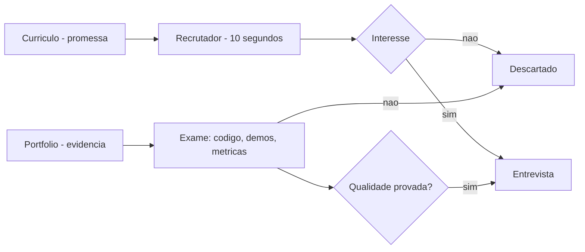

# Capítulo 7: Portfólio vs currículo: a evidência que abre portas

## 1. Introdução

O Capítulo 6 fechou a Parte II com a arquitetura do sistema completo — RAG, MCP e observabilidade. Agora você inicia a Parte III, o portfólio: a prova pública de que você constrói tudo isso. Este capítulo estabelece a tese da parte: em 2026, o portfólio vence o currículo — recrutadores gastam segundos no CV, mas engajam com sistemas completos, executáveis e mensuráveis. Você vai aprender a arquitetura de um portfólio de elite, a regra dos 3-5 projetos de ponta a ponta, e a linguagem das métricas de impacto que separa a prova da promessa. Ao final, você será capaz de avaliar seu próprio portfólio com o mesmo critério que o mercado usa.

## 2. Explica

A tese de que o portfólio vence o currículo tem uma mecânica que você vai perceber ao entender como o mercado avalia candidatos em 2026. A análise da DataExpert, referência do tema, formula a observação central: os recrutadores e líderes técnicos gastam menos de dez segundos em um currículo, mas engajam de forma massiva com portfólios que demonstram sistemas prontos para produção, código executável e resolução de problemas reais [1]. A razão é estrutural: o currículo é uma promessa — uma lista de cargos e tecnologias que qualquer pessoa pode escrever; o portfólio é evidência — artefatos que podem ser examinados, executados e verificados. E em um mercado onde os agentes de código tornam o código abundante, a promessa perdeu ainda mais valor: o que distingue o candidato não é dizer que sabe — é mostrar que construiu [1].

A mecânica do portfólio eficaz se apoia em três princípios que os guias de 2026 consolidam. O primeiro é a profundidade sobre a quantidade: a regra dos 3-5 projetos de ponta a ponta — três projetos profundos e finalizados superam dez repositórios incompletos ou abandonados [1]. O segundo é a completude do ciclo de vida: um projeto de IA de elite cobre o ciclo inteiro — dados, arquitetura, evals, deploy e monitoramento — porque é isso que reflete o trabalho real, onde 70% do esforço está na integração, infraestrutura e operação, não no modelo [2]. O terceiro é a evidência mensurável: métricas de impacto — redução de latência, precisão factual, custo por requisição — que transformam o projeto em prova quantificável, a linguagem que recrutadores e líderes técnicos entendem [1]. E a análise da Hyperskill adiciona o critério de autenticidade: o histórico de commits iterativos, o tratamento de erros reais e os testes cobrindo casos de falha são o que diferencia código original de clones de tutorial — o sinal de que o candidato entende o que construiu [3].

## 3. Ilustra

Pense em dois maquinistas disputando a mesma vaga de chefe de tráfego. O primeiro chega à entrevista com um discurso: "conheço todas as locomotivas do mercado, já operei trens de carga e passageiros, tenho dez anos de experiência". O segundo chega com um caderno de registros: o mapa da linha que ele ajudou a projetar, os horários que otimizou, o relatório do incidente que resolveu e a medição de quanto a pontualidade melhorou com suas mudanças. O primeiro está contando; o segundo está mostrando. No momento da decisão, o comitê não precisa acreditar no discurso do primeiro — pode examinar o caderno do segundo. Como Engenheiro(a) de Software, o currículo é o discurso e o portfólio é o caderno: um declara competência, o outro demonstra evidência. E em 2026, com a IA tornando os discursos mais baratos e mais parecidos, o caderno é o que decide.



O diagrama mostra a diferença estrutural: o currículo passa pelo crivo rápido do recrutador — dez segundos, uma decisão binária; o portfólio passa pelo exame — código, demos e métricas — e é o que sustenta o avanço para a entrevista. A jornada não ignora o currículo (ele abre a porta), mas é o portfólio que carrega o candidato até a entrevista e a conversa técnica. Esse modelo — promessa na porta, evidência na jornada — organiza toda a Parte III.

## 4. Técnica

### A arquitetura do portfólio: o README que documenta, não descreve

A primeira entrega técnica é o artefato que abre cada projeto do portfólio: o README de nível profissional — a documentação técnica que explica decisões, trade-offs e autocrítica, no espírito do que a Hyperskill descreve como o diferencial entre código original e clone de tutorial [3]. O exemplo abaixo é o README de um projeto de portfólio de sistema agêntico, no formato que os recrutadores de 2026 procuram:

```markdown
# Triagem Agêntica — Sistema de priorização de tickets com LLM

## O que é
Sistema de triagem de tickets de suporte que classifica prioridade,
extrai entidades e gera resumo estruturado — com gate de evidência e
rastreamento de custo por requisição.

## Por que existe (decisões e trade-offs)
- **Workflow, não agente puro**: o caminho de triagem é conhecido; a regra
  de ouro (Anthropic, 2024) diz workflow para previsibilidade. O agente só
  entra no trecho exploratório (dúvida técnica complexa).
- **RAG híbrido**: busca lexical (BM25) + vetorial, porque consultas com
  termos exatos e consultas semânticas falham em vias isoladas.
- **MCP para ferramentas**: contrato desacoplado para o catálogo; trocar o
  serviço não reescreve o agente.

## Métricas (evidência, não intenção)
- Precisão de classificação: 87% no golden set de 200 tickets (meta 85%)
- Latência p95 de classificação: 1.1s (meta 1.2s)
- Custo médio por ticket: $0.014 (rastreado por passo)

## Como rodar
1. `make setup` — cria ambiente e baixa o golden set
2. `make test` — testes unitários + integração (casos de falha incluídos)
3. `make demo` — roda a demo interativa local

## Autocrítica e próximos passos
- O golden set tem 200 tickets; ampliar para 2.000 com casos de fronteira
- O re-ranking do RAG ainda é simples; evoluir para cross-encoder
- Adicionar avaliação LLM-as-a-judge para resumos gerados
```

O README cumpre as três funções que definem o portfólio de elite: mostra o que é (claro e executável), por que as decisões foram tomadas (o raciocínio de arquitetura, que é o que a entrevista vai explorar) e com que resultado (métricas mensuráveis, com meta e valor). A seção de autocrítica é deliberada: honestidade sobre limitações e próximos passos é sinal de maturidade — e é o que separa o projeto de portfólio do clone de tutorial [3]. Esse README é o mapa do caderno do maquinista: ele não descreve o trem, documenta a viagem.

### A métrica de impacto: transformando o projeto em prova

A segunda entrega é o instrumento que transforma o projeto em evidência quantificável: o painel de métricas. O código abaixo implementa o avaliador que mede as três métricas do README — precisão, latência e custo — e gera o relatório que acompanha o portfólio:

```python
"""Painel de metricas do portfolio: precisao, latencia e custo."""
import time
from dataclasses import dataclass
from typing import Callable


@dataclass
class Caso:
    entrada: str
    esperado: str


class Avaliador:
    def __init__(self, sistema: Callable, custo_por_chamada: float = 0.01):
        self.sistema = sistema
        self.custo_por_chamada = custo_por_chamada

    def avaliar(self, casos: list) -> dict:
        acertos = 0
        latencias = []
        custo_total = 0.0
        for caso in casos:
            inicio = time.perf_counter()
            saida = self.sistema(caso.entrada)
            latencias.append(time.perf_counter() - inicio)
            if saida == caso.esperado:
                acertos += 1
            custo_total += self.custo_por_chamada
        n = len(casos) or 1
        latencias_ordenadas = sorted(latencias)
        p95 = latencias_ordenadas[int(n * 0.95) - 1] if latencias_ordenadas else 0.0
        return {
            "precisao": round(acertos / n, 3),
            "latencia_p95_s": round(p95, 2),
            "custo_total_usd": round(custo_total, 4),
            "casos": n,
        }


def sistema_demo(entrada: str) -> str:
    """Sistema de triagem simplificado para demonstracao."""
    if "urgente" in entrada.lower() or "!" in entrada:
        return "alta"
    if "?" in entrada:
        return "media"
    return "baixa"


if __name__ == "__main__":
    casos = [
        Caso("Erro urgente no gateway!", "alta"),
        Caso("Como funciona o reembolso?", "media"),
        Caso("Atualizacao de cadastro concluida", "baixa"),
        Caso("Falha critica na API!", "alta"),
        Caso("Duvida sobre o manual", "media"),
    ]
    avaliador = Avaliador(sistema_demo)
    print(avaliador.avaliar(casos))
```

O código compila e roda, e demonstra o que a DataExpert chama de métricas de impacto: precisão medida contra um golden set, latência p95 e custo por execução — o relatório que acompanha o projeto e o transforma de "projeto interessante" em "prova mensurável" [1]. Repare que as métricas têm meta e valor no README — o avaliador é o instrumento que produz esses números, e o resultado é uma evidência que nenhum currículo consegue igualar. A reprodutibilidade — rodar o avaliador e obter o mesmo número — é o selo de qualidade que separa a prova da anedota [2].

## 5. Aplica

Você está aplicando para uma vaga de engenheiro de IA sênior. Seu currículo é forte no papel: cinco anos de experiência, tecnologias em alta. Mas na triagem, o recrutador não para além de dez segundos — e você nem chega à entrevista. Seu instinto errado seria melhorar o currículo: mais bullets, mais palavras-chave, mais ATS-friendly. O diagnóstico liga à teoria: o currículo é a promessa, e promessas são baratas em 2026 — o que o mercado quer examinar é o caderno, o portfólio com sistemas executáveis e métricas [1]. A correção, na prática, é a arquitetura deste capítulo: você seleciona os 3-5 projetos mais fortes, reescreve os READMEs no formato de documentação técnica, instrumenta as métricas com o avaliador e coloca as demos interativas em frente — a presença que funciona 24/7, tema do Capítulo 9. Em duas semanas, o recrutador que gastava dez segundos passa a gastar dez minutos no seu repositório — e a entrevista técnica começa com a frase que você queria ouvir: "me conta como você decidiu isso no projeto X" [3].

As armadilhas comuns, sintetizadas, são três. Primeira: quantidade sobre profundidade — dez repositórios com dois commits provam velocidade de abandono, não competência [1]. Segunda: README que descreve em vez de documentar — "este projeto faz X" sem decisões, trade-offs e métricas é um cartaz, não uma prova [3]. Terceira: esconder as limitações — o portfólio sem autocrítica parece gerado por IA, e a autenticidade é exatamente o que o mercado busca [3]. A métrica de sucesso do portfólio é a conversão: de cada dez recrutadores que abrem o repositório, quantos pedem a entrevista? O Capítulo 8 aprofunda a construção: os projetos que provam senioridade, do protótipo ao sistema em produção.

O portfólio como evidência tem desdobramentos que conectam a Parte III ao resto do livro, e cada um reforça sua posição no mercado. O primeiro é a conexão com a arquitetura: o portfólio que demonstra o stack completo — RAG, MCP, agentes com estado, observabilidade e evals — é exatamente o que os guias de 2026 listam como o mínimo para provar senioridade em IA, e é o conteúdo técnico que as Partes I e II ensinaram [4]. O segundo é a conexão com a autenticidade: a presença de históricos de commits iterativos e testes de falha — o sinal que a Hyperskill descreve — é o que prova que o projeto não foi gerado por IA em um único passo, e esse é o critério que o mercado de 2026 aplica com cada vez mais rigor [3]. O terceiro é a conexão com o mercado: o prêmio salarial da especialização em IA é documentado em múltiplas fontes de 2026 — e o portfólio é o instrumento que materializa essa especialização para o recrutador, convertendo a competência abstrata em evidência examinável [5][6]. O quarto é a conexão com a entrevista: o system design de 2026 avalia o candidato pela profundidade de raciocínio — e o portfólio que documenta decisões e trade-offs fornece o material exato que a entrevista vai explorar, como a rubrica do Exponent descreve [7]. O quinto é a conexão com a estratégia de carreira: o portfólio não é um projeto de fim de semana — é o ativo de longo prazo que acumula valor a cada sistema construído, e a regra dos 3-5 projetos de ponta a ponta é o plano de investimento que o Capítulo 12 vai integrar ao programa de 12 meses [1]. E a síntese com a tese do livro fecha o raciocínio: se a arquitetura é o trilho e o mercado é a estação, o portfólio é a fotografia das estações construídas — a prova física da viagem, que nenhum discurso substitui [8]. O candidato que domina essa tríade — constrói, prova e se posiciona — é o que o mercado reconhece como o engenheiro acima da média [1][6].

O portfólio como evidência ganha o seu lugar no mapa completo quando conectado ao restante da carreira. A hierarquia das disciplinas situa o portfólio na camada do sistema: a evidência pública de arquitetura é o ativo durável que sobrevive a mudanças de modelo e de mercado [9]. O harness entra como conteúdo do portfólio: o repositório com guias, sensores e evidência de entropia controlada é o que o mercado reconhece como senioridade [10]. O harness de longa duração mostra o que o portfólio precisa demonstrar: a capacidade de sustentar autonomia prolongada sem degradação [11]. A regra de ouro da arquitetura dá o vocabulário: o portfólio que documenta a decisão entre workflow e agente narra a competência central da arquitetura de IA [12]. A execução durável completa o conteúdo: o projeto com resiliência documentada prova competência operacional [13]. A tríade RAG-MCP-observabilidade é o stack que os guias de portfólio de 2026 listam como o mínimo para demonstrar senioridade [14]. A presença digital multiplica: o artigo técnico transforma o projeto em autoridade durável [15]. O mercado recompensa: os dados de vagas mostram que a evidência pública de construção é o que o recrutador encontra primeiro [16][17]. E a entrevista de system design avalia exatamente a coerência entre o que o candidato desenha e o que ele construiu [18][19].

O portfólio da era dos agentes ganhou um novo gênero de prova: a evidência de construção de harnesses — o repositório que governa o ambiente do agente — é o artefato que a disciplina documentada pela OpenAI elevou a padrão industrial [20].


### Aprofundamento: a arquitetura da evidência

O portfólio não é uma coleção de projetos: é uma arquitetura de evidências construída para convencer o mercado em minutos [1]. A estrutura tem três níveis: o projeto singular que prova profundidade, o conjunto de 3 a 5 projetos que prova amplitude e a narrativa contínua — o artigo, o post-mortem, o registro de decisões — que prova consistência [2]. O currículo tradicional lista habilidades; o portfólio demonstra comportamentos: o recrutador de 2026 procura a evidência de que o candidato constrói, mede e narra sistemas de IA [3]. O repositório público é o instrumento central dessa arquitetura: o GitHub fornece o histórico iterativo que nenhuma entrevista consegue falsificar — o commit log mostra a decisão sendo construída, não decorada [4]. O mercado de trabalho de 2026 confirma o peso da evidência: as análises do Pragmatic Engineer mostram que a transição para a contratação baseada em portfólio é estrutural, e o candidato que chega com repositórios reais chega à frente [5]. As análises de mercado de talento de IA mostram que a evidência pública de construção é o que o recrutador encontra primeiro — antes mesmo do currículo [6]. A entrevista de system design avalia a coerência da arquitetura: o candidato que desenha no quadro o que construiu no repositório responde com profundidade que o candidato decorado não alcança [7]. A projeção de longo prazo do desenvolvimento de software coloca a evidência pública como o novo currículo: quem documenta constrói reputação que sobrevive a mudanças de tecnologia [8]. A disciplina de harness engineering fornece o conteúdo do portfólio: o repositório com guias, sensores e evidência de entropia controlada é o que o mercado reconhece como senioridade [9]. A hierarquia das disciplinas situa o portfólio na camada do sistema: a evidência pública de arquitetura é o ativo durável que sobrevive a mudanças de modelo e de mercado [10]. O harness de longa duração da Anthropic mostra o que o portfólio precisa demonstrar: a capacidade de sustentar autonomia prolongada sem degradação — o sistema que roda por horas sob supervisão é a prova mais rara [11]. O manifesto do AIDD dá a moldura ética: o desenvolvedor é o parceiro deliberado, e o portfólio é a prova pública dessa parceria [12]. A arquitetura de agentes da Anthropic fornece o vocabulário: o portfólio que documenta a decisão entre workflow e agente narra a competência central da arquitetura de IA [13]. A execução durável completa o conteúdo: o projeto com resiliência documentada — o teste de falha, o post-mortem — prova competência operacional que o currículo não alcança [14]. O protocolo MCP é o stack que os guias de portfólio de 2026 listam como o mínimo para demonstrar senioridade: o projeto com integrações sob contrato mostra maturidade de arquitetura [15]. A delimitação entre MCP, RAG e agentes organiza a narrativa do portfólio: transporte, conhecimento e orquestração em camadas claras é a marca do candidato sênior [16]. As plataformas de orquestração entram como contexto: o portfólio que mostra a escolha informada da plataforma — e a justificativa — demonstra leitura de mercado [17]. O guia do Zencoder mostra como apresentar a arquitetura da evidência: problema, decisão, resultado medido e alternativa descartada formam a história que o recrutador reconstrói [18]. O monitoramento mensal do mercado técnico fornece o calendário da evidência: o candidato que publica regularmente — projeto, artigo, post-mortem — acumula reputação que o mercado reconhece [19]. E o harness engineering da OpenAI encerra: o portfólio da era dos agentes é a prova de construção de sistemas — e o engenheiro que a constrói com método é o que o mercado encontra antes da entrevista [20].


A arquitetura da evidência encerra com a regra do conjunto: antes de cada movimento de carreira, revise os 3 a 5 projetos que sustentam a narrativa e pergunte — cada um prova uma competência distinta? [1] A entrevista de system design reconstrói exatamente essas provas [7], o mercado as recompensa nos dados de contratação [5] e a escrita técnica as multiplica em autoridade [9]. O portfólio não é o passado: é a previsão do que o engenheiro fará — e o recrutador lê essa previsão em minutos [20].
## 6. Conclusão

Você dominou a tese da Parte III: o portfólio vence o currículo porque é evidência, não promessa. Os três pontos principais são: a regra dos 3-5 projetos de ponta a ponta supera a quantidade de repositórios; o README que documenta decisões, métricas e autocrítica é o mapa do caderno do maquinista; e as métricas de impacto mensuráveis são a linguagem que o mercado entende. O desafio desta semana: avalie seu portfólio atual com o critério do mercado — quantos projetos são evidência e quantos são promessa? No próximo capítulo, você aprende a construir os projetos que provam senioridade.

## 7. Referências Bibliográficas
[1] DATAEXPERT.IO. *Ultimate guide to AI engineering portfolios*. 2026. Disponível em: https://www.dataexpert.io/blog/ultimate-guide-ai-engineering-portfolios. Acesso em: 06 ago. 2026.
[2] UDACITY. *20 machine learning projects that will boost your portfolio*. 2025/2026. Disponível em: https://www.udacity.com/blog/20-machine-learning-projects-that-will-boost-your-portfolio/. Acesso em: 06 ago. 2026.
[3] JACKSON, Natalia (HYPERSKILL). *Building a developer portfolio in 2026: what actually gets attention*. 2026. Disponível em: https://hyperskill.org/blog/post/building-a-developer-portfolio-in-2026-what-actually-gets-attention. Acesso em: 06 ago. 2026.
[4] BOUCHARD, Louis-François. *Start AI engineering*. GitHub, 2026. Disponível em: https://github.com/louisfb01/start-ai-engineering. Acesso em: 06 ago. 2026.
[5] OROSZ, Gergely; SALMON, Jessica (THE PRAGMATIC ENGINEER). *The job market in 2026 (part 2)*. 2026. Disponível em: https://newsletter.pragmaticengineer.com/p/the-job-market-in-2026-part-2. Acesso em: 06 ago. 2026.
[6] NEXUS IT GROUP. *AI engineering jobs: 2026 talent market analysis*. 2026. Disponível em: https://nexusitgroup.com/ai-engineering-jobs/. Acesso em: 06 ago. 2026.
[7] EXPONENT. *System design interview prep & questions (2026 guide)*. 2026. Disponível em: https://www.tryexponent.com/blog/system-design-interview-guide. Acesso em: 06 ago. 2026.
[8] OSMANI, Addy. *The next two years of software engineering*. 2026. Disponível em: https://addyosmani.com/blog/next-two-years/. Acesso em: 06 ago. 2026.
[9] BÖCKELER, Birgitta; FOWLER, Martin. *Harness engineering: the discipline of building effective software agents*. Thoughtworks/Martin Fowler, 2026. Disponível em: https://martinfowler.com/articles/harness-engineering.html. Acesso em: 06 ago. 2026.
[10] ATLAN RESEARCH. *Harness engineering vs prompt engineering*. 2026. Disponível em: https://atlan.com/know/harness-engineering-vs-prompt-engineering/. Acesso em: 06 ago. 2026.
[11] RAJASEKARAN, Prithvi (ANTHROPIC ENGINEERING). *Harness design for long-running agentic applications*. 2026. Disponível em: https://www.anthropic.com/engineering/harness-design-long-running-apps. Acesso em: 06 ago. 2026.
[12] AI-DRIVEN DEVELOPMENT MANIFESTO. *Manifesto for AI-Driven Development*. 2026. Disponível em: https://www.ai-driven-development.org/. Acesso em: 06 ago. 2026.
[13] ANTHROPIC. *Building effective agents*. 2024. Disponível em: https://www.anthropic.com/engineering/building-effective-agents. Acesso em: 06 ago. 2026.
[14] MARTIN, Kevin Paul (TEMPORAL). *From AI hype to durable reality: why agentic flows need distributed-systems discipline*. 2025. Disponível em: https://temporal.io/blog/from-ai-hype-to-durable-reality-why-agentic-flows-need-distributed-systems. Acesso em: 06 ago. 2026.
[15] CHOWDHURY, Supal; SAHA, Subrata; ABDEL SAMAD, Haitham (IBM DEVELOPER). *Model Context Protocol architecture patterns for multi-agent AI systems*. 2026. Disponível em: https://developer.ibm.com/articles/mcp-architecture-patterns-ai-systems/. Acesso em: 06 ago. 2026.
[16] INFRANODUS ENGINEERING. *MCP vs RAG vs AI agents: differences and how they work together*. 2026. Disponível em: https://infranodus.com/docs/mcp-vs-rag-vs-ai-agents. Acesso em: 06 ago. 2026.
[17] DIGITAL APPLIED. *AI workflow orchestration platforms: 2026 comparison*. 2026. Disponível em: https://www.digitalapplied.com/blog/ai-workflow-orchestration-platforms-comparison. Acesso em: 06 ago. 2026.
[18] ZENCODER. *How to create a software engineer portfolio in 2026*. 2026. Disponível em: https://zencoder.ai/blog/how-to-create-software-engineer-portfolio. Acesso em: 06 ago. 2026.
[19] DAINES-HUTT, Daniel (ZERO TO MASTERY). *Tech job market trends monthly — February 2026*. 2026. Disponível em: https://zerotomastery.io/blog/tech-job-market-trends-monthly-february-2026/. Acesso em: 06 ago. 2026.
[20] LOPOPOLO, Ryan (OPENAI). *Harness engineering at OpenAI*. 2026. Disponível em: https://openai.com/index/harness-engineering/. Acesso em: 06 ago. 2026.