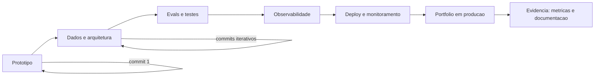

# Capítulo 8: Projetos que provam senioridade: do protótipo ao sistema em produção

## 1. Introdução

No Capítulo 7, você aprendeu a tese do portfólio como evidência — e a arquitetura do README que documenta. Agora você aprende a construir o que o README documenta: os projetos que provam senioridade. Não demos — sistemas completos com arquitetura, testes, observabilidade e tratamento de falhas, cobrindo o ciclo de vida inteiro da IA. Você vai aprender a proporção real do trabalho (modelo é 10%, dados 20%, integração e operação 70%), o stack que demonstra maturidade, e o método para evoluir um projeto de protótipo a sistema em produção. Ao final, você terá o blue-print de um projeto de portfólio que nenhum recrutador ignora.

## 2. Explica

A senioridade em projetos de portfólio tem uma definição que a prática de 2026 consolidou, e ela começa com uma correção de proporção. A análise da Udacity formula o dado que reorganiza a mentalidade: no trabalho real de IA, o modelo é cerca de 10% do esforço, a engenharia de dados outros 20%, e a integração com ferramentas, infraestrutura, deploy e monitoramento responde por 70% [1]. O projeto de portfólio que prova senioridade reflete essa proporção: um sistema que integra, opera e monitora — não um notebook que treina um modelo. A análise da DataExpert reforça o mesmo ponto: os 3-5 projetos de ponta a ponta que cobrem o ciclo de vida completo da IA — dados, deploy e monitoramento — são os que capturam a atenção dos recrutadores [2].

A mecânica do projeto de senioridade se apoia em três pilares que você vai usar como critérios de avaliação. O primeiro é a arquitetura explícita: o sistema tem camadas claras, decisões documentadas e trade-offs assumidos — o projeto demonstra o repertório da Parte II (workflow vs agente, durabilidade, RAG, MCP, observabilidade). O segundo é a evidência operacional: testes que cobrem casos de falha, observabilidade de custo e latência, e a documentação de como o sistema se comporta sob pressão — o projeto demonstra que você sabe operar, não só construir. O terceiro é a progressão visível: o histórico de commits mostra a evolução — do protótipo funcional ao sistema endurecido — e não um único passo de geração [3]. O guia open-source de Bouchard consolida o stack que materializa esses pilares: context engineering, RAG avançado, MCP, agentes autônomos, evals e harnesses — o vocabulário completo da senioridade em IA [4].

## 3. Ilustra

Pense na diferença entre um protótipo de locomotiva e uma locomotiva em serviço comercial. O protótipo funciona na oficina: roda em linha reta, sem passageiros, sem horário, sem chuva. A locomotiva em serviço roda na linha real: com carga, em todas as estações, sob qualquer clima, com um painel que registra cada viagem e um manual de manutenção que evita que ela pare. O maquinista mediano apresenta o protótipo — "olha, ela anda!". O maquinista acima da média apresenta a locomotiva em serviço — "olha a linha que ela opera, as métricas de pontualidade, e como a mantemos funcionando". Como Engenheiro(a) de Software, a maioria dos portfólios é feita de protótipos: projetos que funcionam na máquina local do autor, sem testes, sem observabilidade, sem evidência de operação. O projeto de senioridade é a locomotiva em serviço — e este capítulo ensina a transformar o protótipo em serviço.



O diagrama mostra o ciclo de amadurecimento: do protótipo funcional, o projeto evolui por camadas — dados e arquitetura, evals e testes, observabilidade, deploy e monitoramento — até chegar ao portfólio em produção, cuja evidência (métricas e documentação) fecha o ciclo. Cada seta é uma etapa de commits iterativos — a progressão visível que a Hyperskill identifica como o sinal de autenticidade [3]. O protótipo não é descartado: é o primeiro marco da jornada, o commit 1 do projeto que vai provar senioridade.

## 4. Técnica

### A proporção 10/20/70: o projeto de ponta a ponta

A primeira entrega técnica é o esqueleto do projeto de ponta a ponta: a estrutura de diretórios e o fluxo que materializam a proporção real do trabalho — modelo como 10%, dados 20%, integração e operação 70% [1]. O exemplo abaixo é a estrutura de um projeto de portfólio de sistema agêntico de triagem, com o esqueleto de cada camada:

```bash
triagem-agentica/
├── dados/                     # 20%: a camada de dados
│   ├── raw/                   # golden set bruto (200+ tickets)
│   ├── curadoria.py           # limpeza, anonimizacao, rotulacao
│   └── aval_esperados.json    # respostas esperadas para evals
├── servico/                   # 10%: o núcleo do modelo
│   ├── modelo.py              # chamada ao LLM com contrato de entrada
│   └── schemas.py             # validacao estrutural das saidas
├── integracao/                # 70%: onde o trabalho real mora
│   ├── rag.py                 # busca hibrida (lexical + vetorial)
│   ├── ferramentas_mcp.py     # contrato de ferramentas (MCP)
│   ├── observabilidade.py     # traces: tokens, custo, decisoes
│   └── durabilidade.py        # checkpoint por passo (execucao durável)
├── evals/
│   ├── avaliador.py           # precisao, latencia p95, custo
│   └── casos_falha.py         # testes de edge case e degradacao
├── app/
│   └── api.py                 # interface de uso (demo interativa)
├── makefile                   # setup, test, lint, demo, deploy
└── README.md                  # documentacao tecnica (Cap. 7)
```

A estrutura é o mapa do projeto: cada diretório corresponde a uma camada da proporção real, e o makefile orquestra a reprodutibilidade — o selo que separa o portfólio da coleção de scripts [1]. Repare que o diretório de integração — os 70% — é o maior: é onde moram o RAG, o MCP, a observabilidade e a durabilidade, o stack de senioridade que o guia de Bouchard lista [4]. O projeto de portfólio não precisa ser grande — precisa ser completo: a proporção 10/20/70 é o critério que transforma o protótipo em locomotiva em serviço.

### O teste de falha: a evidência de que você opera, não só constrói

A segunda entrega é o instrumento que prova a senioridade operacional: o teste de falha. O código abaixo implementa o caso de teste que simula a degradação — a API do modelo fora do ar — e verifica que o sistema degrada com graça:

```python
"""Teste de falha: o sistema degrada com graca quando o modelo cai?"""
from dataclasses import dataclass
from typing import Callable


@dataclass
class SistemaComFallback:
    modelo: Callable
    heuristica: Callable
    modo_falha: bool = False

    def classificar(self, texto: str) -> str:
        if self.modo_falha:
            return self.heuristica(texto)
        try:
            return self.modelo(texto)
        except TimeoutError:
            return self.heuristica(texto)


def modelo_simulado(texto: str) -> str:
    if "urgente" in texto.lower():
        return "alta"
    raise TimeoutError("modelo indisponivel")


def heuristica_emergencia(texto: str) -> str:
    return "alta" if "!" in texto else "media"


def testar_degradacao_graciosa() -> None:
    sistema = SistemaComFallback(modelo_simulado, heuristica_emergencia)
    # Cenario 1: modelo disponivel
    assert sistema.classificar("Erro urgente") == "alta"
    # Cenario 2: modelo falha, heuristica assume
    sistema.modo_falha = True
    assert sistema.classificar("Erro urgente!") == "alta"
    print("OK: degradacao graciosa verificada")


def testar_casos_de_fronteira() -> None:
    sistema = SistemaComFallback(modelo_simulado, heuristica_emergencia)
    assert sistema.classificar("") != ""
    assert sistema.classificar("Texto sem marcadores") == "media"
    print("OK: casos de fronteira cobertos")


if __name__ == "__main__":
    testar_degradacao_graciosa()
    testar_casos_de_fronteira()
    print("Suite de falhas: 2/2 passou")
```

O código compila e roda, e demonstra o que a Hyperskill descreve como testes cobrindo casos de falha — o sinal de que o autor entendeu o sistema para além do happy path [3]. O teste de degradação é o tipo de evidência que o recrutador técnico procura: prova que o sistema tem plano B, que o autor pensou na operação, e que a resiliência do Capítulo 5 não ficou na teoria. A suite de falhas completa o portfólio — não é adorno, é o instrumento da prova [2].

### O relatório de evidência: a página do projeto

A terceira entrega é o artefato que fecha o projeto: o relatório de evidência — a página que reúne métricas, arquitetura e autocrítica no formato que o mercado consome. O código abaixo gera o relatório Markdown a partir das métricas medidas:

```python
"""Gera o relatorio de evidencias do projeto de portfolio."""
import json
from datetime import date


def gerar_relatorio(nome: str, metricas: dict, decisoes: list, autocrítica: list) -> str:
    linhas = [
        f"# Relatório de Evidências — {nome}",
        "",
        f"*Gerado em {date.today().isoformat()} pelo avaliador automatizado.*",
        "",
        "## Métricas (medidas, não intenção)",
        "",
        "| Métrica | Valor | Meta |",
        "|---|---|---|",
    ]
    for metrica, (valor, meta) in metricas.items():
        linhas.append(f"| {metrica} | {valor} | {meta} |")
    linhas += ["", "## Decisões de arquitetura", ""]
    linhas += [f"- {d}" for d in decisoes]
    linhas += ["", "## Autocrítica e próximos passos", ""]
    linhas += [f"- {a}" for a in autocrítica]
    return "\n".join(linhas)


if __name__ == "__main__":
    relatorio = gerar_relatorio(
        "Triagem Agêntica",
        {
            "Precisão no golden set": ("87%", "85%"),
            "Latência p95": ("1.1s", "1.2s"),
            "Custo por ticket": ("$0.014", "$0.020"),
        },
        [
            "Workflow na linha fixa; agente só no trecho exploratório",
            "RAG híbrido: lexical + vetorial com fusão de ranqueamento",
            "MCP desacopla o catálogo; trocar serviço não reescreve o agente",
        ],
        [
            "Golden set de 200 tickets; ampliar para 2.000",
            "Re-ranking simples; evoluir para cross-encoder",
            "Adicionar LLM-as-a-judge para os resumos gerados",
        ],
    )
    print(relatorio)
```

O código compila e roda, e gera a página que acompanha cada projeto do portfólio — o relatório que transforma o README em documento vivo, atualizado pelo avaliador a cada mudança [2]. Métricas com meta e valor, decisões com justificativa e autocrítica honesta: esse é o formato de evidência que o mercado de 2026 consome — e é a prova que o Capítulo 11 vai usar nas entrevistas.

## 5. Aplica

Você tem um projeto de portfólio promissor: um chatbot de RAG sobre documentação técnica, que funciona bem na sua máquina. Você o envia para três vagas e não recebe retorno. Seu instinto errado seria "fazer mais projetos" — mais protótipos, mais demos, mais volume. O diagnóstico liga à teoria: o projeto é um protótipo, não uma locomotiva em serviço — sem a proporção 10/20/70 (a integração e operação inexistem), sem evidência operacional (nenhum teste de falha, nenhuma métrica) e sem progressão visível (um commit único, gerado em um passo) [3][1]. A correção, na prática, é o ciclo deste capítulo: você adiciona a camada de dados (golden set com casos de fronteira), endurece a integração (RAG híbrido, MCP, observabilidade), instrumenta os testes de falha, mede as métricas com o avaliador e gera o relatório de evidências. Em três semanas, o mesmo projeto vira outra coisa: o recrutador técnico abre o repositório, roda o makefile, vê os testes passarem e lê o relatório — e a entrevista técnica começa com a pergunta certa [2].

As armadilhas comuns, sintetizadas, são três. Primeira: projetos de notebook — o modelo sem integração, operação e evidência é um protótipo, e o mercado de 2026 está saturado de protótipos [1]. Segunda: repositórios sem história — o commit único gerado por IA é exatamente o sinal que o mercado aprendeu a filtrar; a progressão iterativa é a prova de autenticidade [3]. Terceira: demos sem métricas — a demo interativa impressiona por minutos, mas a evidência mensurável é o que convence na entrevista [2]. A métrica de sucesso é a profundidade: o projeto resiste ao exame — alguém consegue rodar, entender as decisões e verificar as métricas sem a sua presença? O Capítulo 9 completa a Parte III com a terceira camada: GitHub, escrita técnica e marca pessoal — a presença que trabalha 24/7.

O projeto de senioridade tem desdobramentos que conectam a construção à estratégia inteira de carreira, e cada um reforça o valor da evidência. O primeiro é a conexão com a arquitetura: o projeto que demonstra a tríade da Parte II — RAG, MCP e observabilidade — prova não que você conhece os conceitos, mas que os integra em um sistema operável, e é essa integração que a análise da Digital Applied mostra como o critério de maturidade das plataformas de orquestração [5]. O segundo é a conexão com o harness: o projeto com guias e sensores — como o makefile, os testes de falha e a estrutura de camadas — demonstra a competência do Capítulo 3 na prática, e o relato da OpenAI mostra que é exatamente essa disciplina que separa a fábrica que se mantém da que degrada [6]. O terceiro é a conexão com o mercado: as vagas de 2026 pedem engenheiros que saibam auditar código gerado por IA, arquitetar sistemas resilientes e operar com custo sob controle — e o projeto que documenta essas decisões responde a cada um desses critérios com evidência [7][8]. O quarto é a conexão com a entrevista: o relatório de evidências é o material que o system design de 2026 vai explorar — o candidato que narra decisões reais, com trade-offs e métricas, fala a língua da rubrica que avalia consciência de custo, modos de falha e design sensível a IA [9]. O quinto é a conexão com a marca pessoal: o projeto público bem construído é o primeiro artigo de escrita técnica — o material que o Capítulo 9 vai transformar em post-mortems e análises comparativas, multiplicando o alcance da mesma evidência [10]. E a síntese com a tese do livro fecha o raciocínio: o projeto de senioridade não é um item de currículo — é o trilho construído e documentado, a prova física de que o engenheiro lê o mapa e constrói a via, e é isso que o mercado reconhece como o sinal do engenheiro acima da média [2][11].

O projeto de senioridade ganha o seu lugar no mapa quando conectado ao harness e ao mercado. A hierarquia das disciplinas situa o projeto na camada do sistema: a construção de ponta a ponta é o ativo que o mercado examina [12]. O harness entra como o conteúdo do projeto: os guias e sensores — o makefile, os testes de falha e a estrutura de camadas — demonstram a competência da fábrica que se auto-mantém [13]. O harness de longa duração mostra o teto: o projeto que sustenta sessões autônomas prolongadas prova a competência mais avançada [14]. O AIDD formaliza o método: o desenvolvedor como parceiro deliberado, e o projeto como a prova dessa parceria [15]. A regra de ouro dá o vocabulário: o projeto que documenta workflow versus agente narra a decisão central [16]. A execução durável completa o conteúdo: o projeto com resiliência e degradação graciosa prova competência operacional [17]. A tríade RAG-MCP-observabilidade é o stack de senioridade que o mercado de 2026 reconhece [18]. O mercado recompensa: os dados de vagas mostram que a construção de sistemas completos é a skill mais valorizada da linha em expansão [19][20]. E o projeto de ponta a ponta é exatamente a prova que a entrevista de system design explora, com métricas e decisões [21].


### Aprofundamento: o projeto que muda o nível

Os projetos de machine learning que compõem um portfólio forte não são exercícios de tutorial: são sistemas completos que demonstram decisões de arquitetura, métricas e operação — exatamente o que a Udacity lista como critério de qualidade [1]. A arquitetura da evidência define o conjunto: o projeto singular prova profundidade, e o conjunto de projetos prova amplitude — o recrutador lê o conjunto em minutos [2]. A narrativa do projeto é tão importante quanto o código: os guias de construção de portfólio mostram que o problema, a decisão e o resultado medido formam a história que o recrutador reconstrói [3]. O repositório público fornece a evidência bruta: o commit log, o README e o registro de decisões mostram a construção — e a construção é o que prova senioridade [4]. As plataformas de orquestração de 2026 fornecem o contexto de mercado: o projeto que usa a plataforma certa — com justificativa — demonstra leitura atualizada do ecossistema [5]. O harness engineering da OpenAI dá o padrão industrial: o projeto com guias, sensores e evidência de entropia controlada é o artefato que demonstra a competência mais rara — a de construir o ambiente do agente [6]. O mercado de talento de IA recompensa a evidência: as análises de vagas mostram que a construção de sistemas completos é a skill mais valorizada da linha em expansão [7]. O monitoramento mensal do mercado técnico mostra a mesma curva: os candidatos com repositórios públicos reais são os que avançam nos processos [8]. A entrevista de system design avalia o projeto: a rubrica de 2026 pede que o candidato explique as decisões do próprio repositório — e quem as tomou responde com profundidade real [9]. O guia do Zencoder mostra como apresentar o projeto de senioridade: o diagrama do sistema, as decisões de cada camada e as métricas de resultado formam a apresentação que separa o candidato [10]. A projeção de longo prazo do desenvolvimento de software coloca o projeto de ponta a ponta como a prova da década: quem constrói sistemas completos — não fragmentos — lidera o mercado [11]. A disciplina de harness engineering situa o projeto na camada do sistema: a construção do harness — o makefile, os testes de falha, a estrutura de camadas — demonstra a fábrica que se auto-mantém [12]. A hierarquia das disciplinas dá o vocabulário da apresentação: o prompt na mensagem, o contexto na sessão e o harness no sistema — o projeto narra os três níveis [13]. O harness de longa duração da Anthropic mostra o teto: o projeto que sustenta sessões autônomas prolongadas prova a competência mais avançada da disciplina [14]. O manifesto do AIDD formaliza o método: o desenvolvedor como parceiro deliberado, e o projeto como a prova dessa parceria [15]. A arquitetura de agentes da Anthropic fornece o catálogo: o projeto que implementa orchestrator-workers, evaluator-optimizer e routing demonstra o vocabulário da indústria [16]. A execução durável completa o conteúdo: o projeto com resiliência e degradação graciosa — o teste que derruba o serviço e mostra a retomada — prova competência operacional [17]. O protocolo MCP é o stack de senioridade que o mercado de 2026 reconhece: o projeto com integrações sob contrato mostra maturidade de arquitetura [18]. A delimitação entre MCP, RAG e agentes organiza o desenho: transporte, conhecimento e orquestração em camadas claras é a marca do arquiteto [19]. E a análise de mercado do Pragmatic Engineer encerra: a transição para a contratação baseada em portfólio torna o projeto de ponta a ponta o instrumento de entrada na linha em expansão — quem prova construindo entra, quem promete espera [20].


O projeto que muda o nível encerra com a régua de seleção: o projeto de senioridade é o que exigiu uma decisão de arquitetura que o tutorial não cobre — a topologia híbrida, o retry durável, o contrato de ferramentas [9]. O guia do Zencoder mostra como apresentá-lo com problema, decisão e métrica [10], e o mercado recompensa a construção completa nos dados de contratação [7]. O commit log é a prova final: a construção documentada no repositório não deixa espaço para a dúvida que o currículo deixa [4]. O projeto certo, bem narrado, muda o nível do candidato inteiro [20].
## 6. Conclusão

Você dominou a construção dos projetos que provam senioridade: do protótipo à locomotiva em serviço, cobrindo o ciclo de vida completo. Os três pontos principais são: a proporção 10/20/70 reorganiza o esforço — o modelo é 10%, a integração e operação são 70%; os testes de falha e o relatório de evidências provam que você opera, não só constrói; e a progressão iterativa visível é o sinal de autenticidade que o mercado filtra. O desafio desta semana: escolha o seu projeto mais promissor e avalie-o contra os três pilares — arquitetura explícita, evidência operacional e progressão visível — e anote a lacuna maior. No próximo capítulo, você aprende a terceira camada do portfólio: a presença que trabalha enquanto você dorme.

## 7. Referências Bibliográficas
[1] UDACITY. *20 machine learning projects that will boost your portfolio*. 2025/2026. Disponível em: https://www.udacity.com/blog/20-machine-learning-projects-that-will-boost-your-portfolio/. Acesso em: 06 ago. 2026.
[2] DATAEXPERT.IO. *Ultimate guide to AI engineering portfolios*. 2026. Disponível em: https://www.dataexpert.io/blog/ultimate-guide-ai-engineering-portfolios. Acesso em: 06 ago. 2026.
[3] JACKSON, Natalia (HYPERSKILL). *Building a developer portfolio in 2026: what actually gets attention*. 2026. Disponível em: https://hyperskill.org/blog/post/building-a-developer-portfolio-in-2026-what-actually-gets-attention. Acesso em: 06 ago. 2026.
[4] BOUCHARD, Louis-François. *Start AI engineering*. GitHub, 2026. Disponível em: https://github.com/louisfb01/start-ai-engineering. Acesso em: 06 ago. 2026.
[5] DIGITAL APPLIED. *AI workflow orchestration platforms: 2026 comparison*. 2026. Disponível em: https://www.digitalapplied.com/blog/ai-workflow-orchestration-platforms-comparison. Acesso em: 06 ago. 2026.
[6] LOPOPOLO, Ryan (OPENAI). *Harness engineering at OpenAI*. 2026. Disponível em: https://openai.com/index/harness-engineering/. Acesso em: 06 ago. 2026.
[7] NEXUS IT GROUP. *AI engineering jobs: 2026 talent market analysis*. 2026. Disponível em: https://nexusitgroup.com/ai-engineering-jobs/. Acesso em: 06 ago. 2026.
[8] DAINES-HUTT, Daniel (ZERO TO MASTERY). *Tech job market trends monthly — February 2026*. 2026. Disponível em: https://zerotomastery.io/blog/tech-job-market-trends-monthly-february-2026/. Acesso em: 06 ago. 2026.
[9] EXPONENT. *System design interview prep & questions (2026 guide)*. 2026. Disponível em: https://www.tryexponent.com/blog/system-design-interview-guide. Acesso em: 06 ago. 2026.
[10] ZENCODER. *How to create a software engineer portfolio in 2026*. 2026. Disponível em: https://zencoder.ai/blog/how-to-create-software-engineer-portfolio. Acesso em: 06 ago. 2026.
[11] OSMANI, Addy. *The next two years of software engineering*. 2026. Disponível em: https://addyosmani.com/blog/next-two-years/. Acesso em: 06 ago. 2026.
[12] BÖCKELER, Birgitta; FOWLER, Martin. *Harness engineering: the discipline of building effective software agents*. Thoughtworks/Martin Fowler, 2026. Disponível em: https://martinfowler.com/articles/harness-engineering.html. Acesso em: 06 ago. 2026.
[13] ATLAN RESEARCH. *Harness engineering vs prompt engineering*. 2026. Disponível em: https://atlan.com/know/harness-engineering-vs-prompt-engineering/. Acesso em: 06 ago. 2026.
[14] RAJASEKARAN, Prithvi (ANTHROPIC ENGINEERING). *Harness design for long-running agentic applications*. 2026. Disponível em: https://www.anthropic.com/engineering/harness-design-long-running-apps. Acesso em: 06 ago. 2026.
[15] AI-DRIVEN DEVELOPMENT MANIFESTO. *Manifesto for AI-Driven Development*. 2026. Disponível em: https://www.ai-driven-development.org/. Acesso em: 06 ago. 2026.
[16] ANTHROPIC. *Building effective agents*. 2024. Disponível em: https://www.anthropic.com/engineering/building-effective-agents. Acesso em: 06 ago. 2026.
[17] MARTIN, Kevin Paul (TEMPORAL). *From AI hype to durable reality: why agentic flows need distributed-systems discipline*. 2025. Disponível em: https://temporal.io/blog/from-ai-hype-to-durable-reality-why-agentic-flows-need-distributed-systems. Acesso em: 06 ago. 2026.
[18] CHOWDHURY, Supal; SAHA, Subrata; ABDEL SAMAD, Haitham (IBM DEVELOPER). *Model Context Protocol architecture patterns for multi-agent AI systems*. 2026. Disponível em: https://developer.ibm.com/articles/mcp-architecture-patterns-ai-systems/. Acesso em: 06 ago. 2026.
[19] INFRANODUS ENGINEERING. *MCP vs RAG vs AI agents: differences and how they work together*. 2026. Disponível em: https://infranodus.com/docs/mcp-vs-rag-vs-ai-agents. Acesso em: 06 ago. 2026.
[20] OROSZ, Gergely; SALMON, Jessica (THE PRAGMATIC ENGINEER). *The job market in 2026 (part 2)*. 2026. Disponível em: https://newsletter.pragmaticengineer.com/p/the-job-market-in-2026-part-2. Acesso em: 06 ago. 2026.
[21] SKILLIFY SOLUTIONS. *Highest-paying AI jobs in 2026*. 2026. Disponível em: https://skillifysolutions.com/blogs/artificial-intelligence/highest-paying-ai-jobs/. Acesso em: 06 ago. 2026.