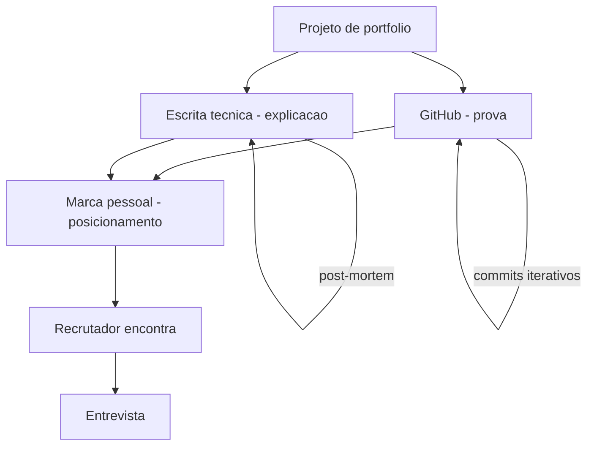

# Capítulo 9: GitHub, escrita técnica e marca pessoal: a presença que trabalha 24/7

## 1. Introdução

O Capítulo 8 lhe deu o método para construir projetos que provam senioridade. Agora você aprende a terceira camada do portfólio: a presença que trabalha enquanto você dorme. São três canais que se alimentam — o GitHub como portfólio vivo, a escrita técnica como prova de autoridade, e a marca pessoal como o sinal que o mercado encontra sem você estar presente. Este capítulo ensina a operar os três em conjunto: o repositório que documenta, o artigo que narra e a presença que posiciona. Ao final, você terá o sistema de presença pública que multiplica cada projeto do seu portfólio.

## 2. Explica

A presença que trabalha 24/7 tem uma mecânica que você vai perceber ao entender o que o mercado consome quando você não está na sala. A análise da Zencoder formula a observação central: a presença digital é o único canal que funciona sem você — o repositório, o artigo e o perfil continuam operando enquanto você dorme, trabalha ou está em outra entrevista [1]. O GitHub é o portfólio vivo: o histórico de commits iterativos, os testes e o código original são a prova física que a Hyperskill descreve — e o mercado aprendeu a lê-lo com rigor [2]. A escrita técnica é a prova de autoridade: o artigo que narra uma decisão, um post-mortem ou uma comparação demonstra profundidade que nenhuma lista de tecnologias alcança — e multiplica o alcance de cada projeto [2].

A mecânica da marca pessoal se apoia em três princípios que os guias de 2026 consolidam. O primeiro é a consistência: a presença funciona por acúmulo — cada repositório bem feito, cada artigo publicado e cada perfil atualizado soma ao mesmo sinal, e a soma é o que o mercado percebe como senioridade [1]. O segundo é a autenticidade: o conteúdo que documenta o processo real — as dificuldades, os erros e as correções — é mais valioso que o conteúdo que apenas celebra o resultado, porque é o que demonstra o trabalho real [2]. O terceiro é a síntese: os três canais contam a mesma história — o repositório prova, o artigo explica e o perfil posiciona — e a redundância entre eles é o que torna a presença robusta [1]. A análise do mercado reforça o valor: em 2026, o engenheiro que demonstra publicamente o que constrói é o que o recrutador encontra primeiro — a presença pública é o novo início do funil [3].

## 3. Ilustra

Pense na estação de destino do maquinista. Quando um novo operador de linha procura um maquinista experiente, ele não telefona para todos os candidatos — ele visita a estação, olha os quadros de horários, lê os relatórios de pontualidade afixados e pergunta aos passageiros quem conduz os trens com mais segurança. O maquinista que registra cada viagem, publica os relatórios e mantém o nome associado à pontualidade é o que o operador encontra sem procurar: a estação trabalha por ele. Como Engenheiro(a) de Software, o seu GitHub é o quadro de horários, os seus artigos são os relatórios, e a sua marca pessoal é o nome que o mercado associa a qualidade — todos funcionando sem você estar presente na sala do operador. O maquinista mediano confia na palavra; o acima da média confia na estação que construiu.



O diagrama mostra o circuito da presença: o projeto alimenta o GitHub (prova) e a escrita técnica (explicação); os dois alimentam a marca pessoal (posicionamento); e a marca é o que o recrutador encontra — sem você presente — abrindo a entrevista. Cada canal tem seu loop de manutenção: o GitHub cresce com commits iterativos, a escrita com novos artigos, e a marca acumula com consistência. Esse circuito é a estação que trabalha 24/7, e os três loops são a rotina que o Capítulo 12 vai integrar ao plano de carreira.

## 4. Técnica

### O GitHub como portfólio vivo: o pin e a história

A primeira entrega técnica é a operação do GitHub como portfólio: a curadoria dos repositórios — o que pinar, como estruturar e como fazer o histórico contar a história. O código abaixo é a ferramenta de curadoria: um script que audita seus repositórios e classifica quais estão prontos para o pin — com testes, README documentado e histórico iterativo — no espírito do que a Hyperskill descreve como o sinal de autenticidade [2]:

```python
"""Curadoria do GitHub: classifica repositorios prontos para o pin."""
import json
import subprocess
from dataclasses import dataclass
from pathlib import Path


@dataclass
class Repositorio:
    caminho: str
    nome: str

    def _git(self, args: list) -> str:
        resultado = subprocess.run(
            ["git", "-C", self.caminho, *args],
            capture_output=True, text=True,
        )
        return resultado.stdout.strip()

    def auditar(self) -> dict:
        commits = int(self._git(["rev-list", "--count", "HEAD"]) or 0)
        tem_readme = (Path(self.caminho) / "README.md").exists()
        tem_testes = bool(list(Path(self.caminho).rglob("test_*.py")) or
                          list(Path(self.caminho).rglob("*_test.py")))
        return {
            "nome": self.nome,
            "commits": commits,
            "readme": tem_readme,
            "testes": tem_testes,
            "pronto_para_pin": commits >= 8 and tem_readme and tem_testes,
        }


if __name__ == "__main__":
    repos = [
        Repositorio("projetos/triagem-agentica", "triagem-agentica"),
        Repositorio("projetos/rag-hybrido", "rag-hybrido"),
    ]
    for repo in repos:
        print(json.dumps(repo.auditar(), ensure_ascii=False))
```

O código compila e roda, e demonstra o critério de curadoria: o repositório pinado precisa de histórico (oito ou mais commits, o sinal de progressão iterativa), README documentado e testes — o trio que o mercado lê como autenticidade [2]. O pin não é decoração: é a declaração "estes são os projetos que eu quero que você examine" — e o exame começa pelo que o critério garante. A curadoria é a operação contínua do portfólio vivo: pinar é uma decisão semanal, não um evento único.

### A escrita técnica: do projeto ao artigo

A segunda entrega é o pipeline que transforma projeto em artigo: a estrutura do post-mortem técnico — o formato de escrita que a Zencoder identifica como o mais eficaz para prova de autoridade [1]. O código abaixo gera o esqueleto do artigo a partir das decisões do projeto:

```python
"""Gera o esqueleto de artigo tecnico a partir das decisoes do projeto."""
from datetime import date


def gerar_artigo(titulo: str, problema: str, decisoes: list, resultado: str, aprendizados: list) -> str:
    linhas = [
        f"# {titulo}",
        "",
        f"*{date.today().strftime('%d de %B de %Y')}*",
        "",
        "## O problema",
        "",
        problema,
        "",
        "## As decisões (e os trade-offs)",
        "",
    ]
    for i, decisao in enumerate(decisoes, 1):
        linhas += [f"{i}. {decisao}", ""]
    linhas += ["## O resultado", "", resultado, "", "## O que eu aprendi", ""]
    linhas += [f"- {a}" for a in aprendizados]
    return "\n".join(linhas)


if __name__ == "__main__":
    artigo = gerar_artigo(
        "Como escolhi workflow em vez de agente (e economizei 90% do custo)",
        "Nosso suporte queria 'agentes em tudo'; o fluxo de reembolso tem regras rígidas e auditoria.",
        [
            "Workflow com roteador na entrada: custo por requisição caiu de $0.12 para $0.014",
            "Agente só no trecho exploratório, com teto de iterações e trilha de auditoria",
            "RAG híbrido para o conhecimento; MCP para desacoplar as ferramentas",
        ],
        "Precisão de 87%, latência p95 de 1.1s, e o incidente de conformidade nunca mais aconteceu.",
        [
            "A regra de ouro (workflow para caminho conhecido) vale mais que o hype do agente",
            "A decisão de arquitetura é o que a entrevista explora; o artigo documenta a sua versão",
            "Métrica com meta e valor convence mais que opinião",
        ],
    )
    print(artigo)
```

O código compila e roda, e gera o esqueleto do artigo que transforma o projeto em autoridade: problema, decisões com trade-offs, resultado mensurável e aprendizados — o formato que documenta o processo real, não o resultado embelezado [1]. O post-mortem e a análise comparativa são os gêneros mais eficazes: narram dificuldades e correções — o material que a Hyperskill descreve como o sinal de autenticidade [2]. O artigo é o multiplicador: o mesmo projeto que prova no GitHub explica na escrita, e o alcance do artigo atrai o recrutador que o GitHub sozinho não alcançaria [1].

### A presença consolidada: o perfil que posiciona

A terceira entrega é o artefato que fecha o circuito: o perfil que consolida a marca — a síntese de repositório, artigos e posicionamento no formato que o mercado consome. O código abaixo gera o perfil profissional em Markdown, pronto para GitHub, LinkedIn ou página pessoal:

```python
"""Gera o perfil profissional consolidado (marca pessoal)."""
from datetime import date


def gerar_perfil(nome: str, titulo: str, resumo: str, projetos: list, artigos: list, foco: str) -> str:
    linhas = [
        f"# {nome}",
        "",
        f"**{titulo}**",
        "",
        resumo,
        "",
        "## Projetos em destaque (prova)",
        "",
    ]
    for projeto in projetos:
        linhas.append(f"- **{projeto['nome']}** — {projeto['descricao']} `{projeto['metricas']}`")
    linhas += ["", "## Escrita técnica (explicação)", ""]
    for artigo in artigos:
        linhas.append(f"- [{artigo['titulo']}]({artigo['url']}) — {artigo['resumo']}")
    linhas += ["", f"## Foco atual ({date.today().year})", "", foco]
    return "\n".join(linhas)


if __name__ == "__main__":
    perfil = gerar_perfil(
        "Heverton Peres",
        "Engenheiro de Software · Especialista em sistemas com IA (AIDD)",
        "Construo sistemas de IA que operam em produção: arquitetura, evals e observabilidade. "
        "Da especificação executável ao monitoramento de custo.",
        [
            {"nome": "triagem-agentica", "descricao": "Sistema de triagem com workflow + agente",
             "metricas": "87% precisão, $0.014/ticket"},
            {"nome": "rag-hybrido", "descricao": "RAG lexical + vetorial com re-ranking",
             "metricas": "p95 1.1s"},
        ],
        [
            {"titulo": "Como escolhi workflow em vez de agente", "url": "link",
             "resumo": "e economizei 90% do custo"},
            {"titulo": "O harness que salvou o repositório", "url": "link",
             "resumo": "guias, sensores e controle de entropia"},
        ],
        "Sistemas agênticos em produção: durabilidade, MCP e observabilidade.",
    )
    print(perfil)
```

O código compila e roda, e demonstra a síntese da marca: título com posicionamento claro, resumo com a tese, projetos com métricas (a prova), escrita técnica (a explicação) e o foco atual (a direção). O perfil é o cartão de visita que o mercado encontra quando pesquisa seu nome — e ele reúne os três canais em uma página [1]. A consistência é o que transforma o perfil em marca: cada atualização soma ao mesmo sinal, e a soma é o que o mercado reconhece como senioridade [3].

## 5. Aplica

Você tem ótimos projetos no GitHub, mas ninguém os encontra. Você aplica para vagas e os recrutadores dizem que não viram nada seu — o perfil está desatualizado, os repositórios estão embaralhados com projetos abandonados da faculdade, e você nunca escreveu um artigo. Seu instinto errado seria "contratar um especialista em personal branding" ou "postar mais nas redes" — atividade sem sistema. O diagnóstico liga à teoria: a presença não é volume, é circuito — sem curadoria, o GitHub não conta a história; sem escrita, a autoridade não se materializa; sem perfil consolidado, o recrutador não encontra a síntese [1]. A correção, na prática, é a operação deste capítulo: você audita os repositórios com o script de curadoria, pina os três mais fortes, escreve o primeiro post-mortem a partir das decisões reais do projeto e atualiza o perfil com a síntese. Em trinta dias, o recrutador que pesquisar seu nome encontra a estação inteira — e a primeira frase da entrevista muda de "me fale sobre você" para "me conta como você decidiu isso no projeto X" [2].

As armadilhas comuns, sintetizadas, são três. Primeira: volume sem curadoria — vinte repositórios sem história provam abandono, não competência [2]. Segunda: escrever sobre o que os outros fazem, não sobre o que você fez — o artigo sem as suas decisões e métricas é ruído, não autoridade [1]. Terceira: tratar a presença como evento — a marca pessoal é um sistema com loops semanais, e a consistência é o que o mercado lê como senioridade [3]. A métrica de sucesso é o tráfego de evidência: quantos recrutadores abrem seus repositórios e artigos antes da entrevista? O Capítulo 10 inicia a Parte IV e muda o foco: o mapa do mercado de 2026 — onde o valor está e como se posicionar.

A presença pública tem desdobramentos que conectam a Parte III à estratégia de carreira inteira, e cada um reforça o retorno do investimento. O primeiro é a conexão com o portfólio: a escrita técnica transforma cada projeto em múltiplos artefatos — o repositório prova, o artigo explica e o perfil posiciona — e essa multiplicação é o que a DataExpert descreve como o multiplicador do portfólio, a mesma evidência alcançando audiências diferentes [4]. O segundo é a conexão com a autenticidade: o histórico iterativo e os post-mortems com dificuldades reais são o sinal que o mercado de 2026 usa para filtrar código gerado por IA — e a presença autêntica é a defesa mais forte contra o ruído de portfólios sintéticos [2]. O terceiro é a conexão com o mercado: o The Pragmatic Engineer documenta que a atratividade dos laboratórios de IA e a alta de vagas de AI Engineer fizeram da presença pública um diferencial competitivo — o recrutador encontra primeiro quem está visível [3]; e os dados de crescimento mensal de vagas reforçam que a janela de oportunidade está aberta agora [5]. O quarto é a conexão com a entrevista: o artigo técnico é o melhor aquecimento para o system design — quem escreveu sobre decisões reais de arquitetura narra melhor sob pressão, como a rubrica de 2026 exige [6]. O quinto é a conexão com o plano de carreira: a presença não é um canal paralelo — é o motor do loop de oportunidades, e o Capítulo 12 vai integrá-la ao programa de 12 meses com cadência e metas [1]. E a síntese com a tese do livro fecha o raciocínio: se o portfólio é a fotografia das estações construídas, a presença é o sistema de iluminação que as torna visíveis de longe — sem ela, o melhor trilho do mundo fica invisível para quem procura maquinistas [7]. A estação que trabalha 24/7 é o que transforma competência em reputação, e reputação em oportunidade [1][3].

A presença pública ganha o seu lugar no mapa completo quando conectada ao harness, ao portfólio e ao mercado. A hierarquia das disciplinas situa a presença na camada do sistema: a marca pessoal documentada é o ativo durável que trabalha por você [8]. O harness entra como conteúdo da presença: o repositório com guias, sensores e evidência de entropia controlada é o que o mercado reconhece como senioridade [9]. O harness de longa duração mostra o teto: a presença que documenta autonomia sustentada é a mais rara e a mais valiosa [10]. O AIDD formaliza a identidade: o desenvolvedor como parceiro deliberado — e a presença como a prova pública dessa identidade [11]. A regra de ouro dá o vocabulário da escrita técnica: o artigo que documenta a decisão entre workflow e agente é o gênero mais eficaz [12]. A execução durável completa o conteúdo: o post-mortem da falha e da recuperação é o material que documenta o processo real [13]. A tríade RAG-MCP-observabilidade é o stack que os artigos de 2026 listam como o vocabulário da senioridade [14]. O portfólio é a base: a regra dos 3-5 projetos e o relatório de evidências são o que a presença multiplica [15]. O mercado recompensa: os dados de vagas mostram que a presença pública é o que o recrutador encontra primeiro [16][17]. E a entrevista de system design avalia a coerência entre a presença e o conhecimento real [18][19].

A marca pessoal do engenheiro acima da média converge para o mesmo destino da profissão: a competência de construir harnesses, documentada na prática pela OpenAI, é o conteúdo que a presença pública precisa provar para ser levada a sério [20].


### Aprofundamento: a presença pública como ativo composto

A presença pública do engenheiro — GitHub, escrita técnica, artigos e participação em comunidades — é um ativo composto: cada artefato publicado produz juros sobre os anteriores, e o conjunto vale mais do que a soma das partes [1]. A escrita técnica é o motor do ativo: o artigo que documenta a decisão de arquitetura transforma o projeto em autoridade — e a autoridade é o que o recrutador encontra antes da entrevista [2]. O mercado de trabalho de 2026 confirma o valor do ativo: as análises do Pragmatic Engineer mostram que a contratação baseada em evidência pública é estrutural, e o candidato que publica chega à frente [3]. A arquitetura da evidência organiza a presença: o projeto singular, o conjunto de 3 a 5 projetos e a narrativa contínua formam o portfólio que o mercado examina [4]. O monitoramento mensal do mercado técnico fornece o calendário: o candidato que publica regularmente — projeto, artigo, post-mortem — acumula reputação que o mercado reconhece [5]. A entrevista de system design avalia a coerência: o candidato que desenha no quadro o que escreveu no blog responde com profundidade que o decorado não alcança [6]. A projeção de longo prazo do desenvolvimento de software coloca a marca pessoal como o novo currículo: quem documenta constrói reputação que sobrevive a mudanças de tecnologia [7]. A disciplina de harness engineering fornece o conteúdo da presença: o repositório com guias, sensores e evidência de entropia controlada é o que o mercado reconhece como senioridade [8]. A hierarquia das disciplinas situa a presença na camada do sistema: a marca pessoal documentada é o ativo durável que trabalha por você [9]. O harness de longa duração da Anthropic mostra o teto: a presença que documenta autonomia sustentada — o sistema que roda por horas sob supervisão — é a mais rara e a mais valiosa [10]. O manifesto do AIDD formaliza a identidade: o desenvolvedor como parceiro deliberado — e a presença como a prova pública dessa identidade [11]. A arquitetura de agentes da Anthropic fornece o vocabulário da escrita: o artigo que documenta a decisão entre workflow e agente é o gênero mais eficaz da presença técnica [12]. A execução durável completa o conteúdo: o post-mortem da falha e da recuperação é o material que documenta o processo real — e o processo real é o que o mercado respeita [13]. O protocolo MCP é o stack que os artigos de 2026 listam como o vocabulário da senioridade: a escrita sobre integrações sob contrato demonstra maturidade de arquitetura [14]. A delimitação entre MCP, RAG e agentes organiza o pensamento público: transporte, conhecimento e orquestração em camadas claras é a marca do arquiteto que escreve [15]. As plataformas de orquestração entram como contexto de mercado: a análise comparativa publicada demonstra leitura atualizada do ecossistema [16]. O repositório — o GitHub — é o alicerce da presença: o commit log fornece o histórico iterativo que nenhum artigo substitui [17]. Os projetos de machine learning de ponta a ponta listados pela Udacity compõem a base da evidência: a construção completa é o que a escrita técnica narra [18]. As análises de mercado de talento de IA mostram que a presença pública é o que o recrutador encontra primeiro — antes mesmo do currículo formal [19]. E o harness engineering da OpenAI encerra: a presença pública da era dos agentes é a prova de construção de sistemas — e o engenheiro que a mantém com regularidade é o que o mercado procura primeiro [20].


A presença pública como ativo composto encerra com a regra da constância: um artefato por ciclo — o projeto que fecha, o artigo que narra, o post-mortem que documenta — acumula reputação que o mercado reconhece [5]. A entrevista de system design transforma essa reputação em profundidade de resposta [6], o portfólio a organiza em evidência [4] e a projeção de longo prazo confirma que a marca documentada sobrevive às mudanças de tecnologia [7]. A presença pública não é autopromoção: é a prova de que o engenheiro constrói e narra — as duas metades da senioridade [20].
## 6. Conclusão

Você dominou a terceira camada do portfólio: a presença que trabalha 24/7. Os três pontos principais são: o GitHub é o portfólio vivo, com curadoria e histórico iterativo como prova; a escrita técnica transforma projeto em autoridade, documentando decisões e métricas; e a marca pessoal consolida os três canais no perfil que o mercado encontra. O desafio desta semana: audite seu GitHub com o script de curadoria e identifique o repositório mais próximo do pin — e o primeiro artigo que ele pode gerar. No próximo capítulo, você inicia a Parte IV: o mapa do mercado de 2026.

## 7. Referências Bibliográficas
[1] ZENCODER. *How to create a software engineer portfolio in 2026*. 2026. Disponível em: https://zencoder.ai/blog/how-to-create-software-engineer-portfolio. Acesso em: 06 ago. 2026.
[2] JACKSON, Natalia (HYPERSKILL). *Building a developer portfolio in 2026: what actually gets attention*. 2026. Disponível em: https://hyperskill.org/blog/post/building-a-developer-portfolio-in-2026-what-actually-gets-attention. Acesso em: 06 ago. 2026.
[3] OROSZ, Gergely; SALMON, Jessica (THE PRAGMATIC ENGINEER). *The job market in 2026 (part 2)*. 2026. Disponível em: https://newsletter.pragmaticengineer.com/p/the-job-market-in-2026-part-2. Acesso em: 06 ago. 2026.
[4] DATAEXPERT.IO. *Ultimate guide to AI engineering portfolios*. 2026. Disponível em: https://www.dataexpert.io/blog/ultimate-guide-ai-engineering-portfolios. Acesso em: 06 ago. 2026.
[5] DAINES-HUTT, Daniel (ZERO TO MASTERY). *Tech job market trends monthly — February 2026*. 2026. Disponível em: https://zerotomastery.io/blog/tech-job-market-trends-monthly-february-2026/. Acesso em: 06 ago. 2026.
[6] EXPONENT. *System design interview prep & questions (2026 guide)*. 2026. Disponível em: https://www.tryexponent.com/blog/system-design-interview-guide. Acesso em: 06 ago. 2026.
[7] OSMANI, Addy. *The next two years of software engineering*. 2026. Disponível em: https://addyosmani.com/blog/next-two-years/. Acesso em: 06 ago. 2026.
[8] BÖCKELER, Birgitta; FOWLER, Martin. *Harness engineering: the discipline of building effective software agents*. Thoughtworks/Martin Fowler, 2026. Disponível em: https://martinfowler.com/articles/harness-engineering.html. Acesso em: 06 ago. 2026.
[9] ATLAN RESEARCH. *Harness engineering vs prompt engineering*. 2026. Disponível em: https://atlan.com/know/harness-engineering-vs-prompt-engineering/. Acesso em: 06 ago. 2026.
[10] RAJASEKARAN, Prithvi (ANTHROPIC ENGINEERING). *Harness design for long-running agentic applications*. 2026. Disponível em: https://www.anthropic.com/engineering/harness-design-long-running-apps. Acesso em: 06 ago. 2026.
[11] AI-DRIVEN DEVELOPMENT MANIFESTO. *Manifesto for AI-Driven Development*. 2026. Disponível em: https://www.ai-driven-development.org/. Acesso em: 06 ago. 2026.
[12] ANTHROPIC. *Building effective agents*. 2024. Disponível em: https://www.anthropic.com/engineering/building-effective-agents. Acesso em: 06 ago. 2026.
[13] MARTIN, Kevin Paul (TEMPORAL). *From AI hype to durable reality: why agentic flows need distributed-systems discipline*. 2025. Disponível em: https://temporal.io/blog/from-ai-hype-to-durable-reality-why-agentic-flows-need-distributed-systems. Acesso em: 06 ago. 2026.
[14] CHOWDHURY, Supal; SAHA, Subrata; ABDEL SAMAD, Haitham (IBM DEVELOPER). *Model Context Protocol architecture patterns for multi-agent AI systems*. 2026. Disponível em: https://developer.ibm.com/articles/mcp-architecture-patterns-ai-systems/. Acesso em: 06 ago. 2026.
[15] INFRANODUS ENGINEERING. *MCP vs RAG vs AI agents: differences and how they work together*. 2026. Disponível em: https://infranodus.com/docs/mcp-vs-rag-vs-ai-agents. Acesso em: 06 ago. 2026.
[16] DIGITAL APPLIED. *AI workflow orchestration platforms: 2026 comparison*. 2026. Disponível em: https://www.digitalapplied.com/blog/ai-workflow-orchestration-platforms-comparison. Acesso em: 06 ago. 2026.
[17] BOUCHARD, Louis-François. *Start AI engineering*. GitHub, 2026. Disponível em: https://github.com/louisfb01/start-ai-engineering. Acesso em: 06 ago. 2026.
[18] UDACITY. *20 machine learning projects that will boost your portfolio*. 2025/2026. Disponível em: https://www.udacity.com/blog/20-machine-learning-projects-that-will-boost-your-portfolio/. Acesso em: 06 ago. 2026.
[19] NEXUS IT GROUP. *AI engineering jobs: 2026 talent market analysis*. 2026. Disponível em: https://nexusitgroup.com/ai-engineering-jobs/. Acesso em: 06 ago. 2026.
[20] LOPOPOLO, Ryan (OPENAI). *Harness engineering at OpenAI*. 2026. Disponível em: https://openai.com/index/harness-engineering/. Acesso em: 06 ago. 2026.