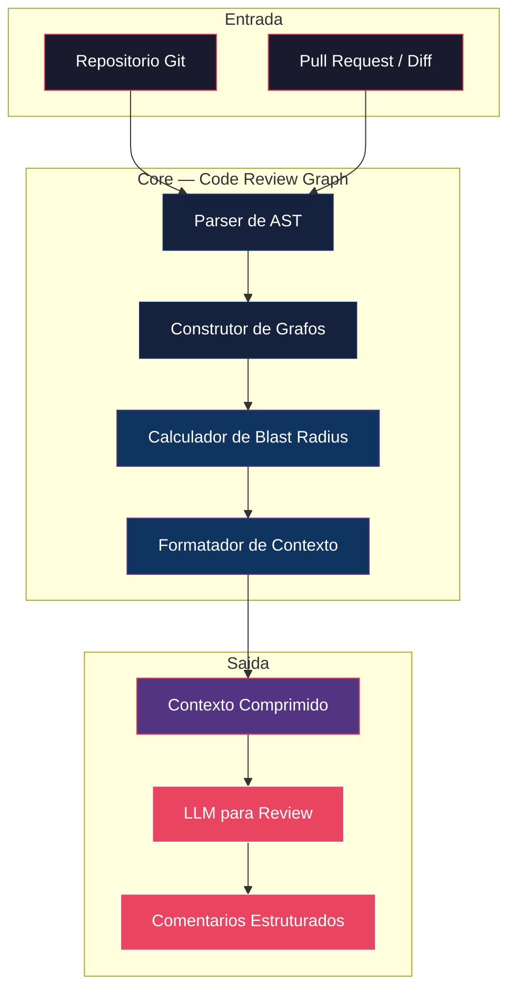
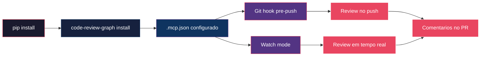

# Capítulo 2: Instalação e Configuração em Qualquer Plataforma

## 1. Introdução

No Capítulo 1, você viu como o Code Review Graph resolve o problema dos tokens usando grafos de dependência para comprimir o contexto de review. Agora é hora de colocar as mãos no código. Este capítulo guia você pela instalação e configuração do Code Review Graph em qualquer plataforma — Linux, macOS ou Windows — desde a compilação inicial até a integração completa com seu fluxo de trabalho de desenvolvimento [1].

O Code Review Graph foi projetado para ser instalado de duas formas: via gerenciador de pacotes Python (`pip`) para uso rápido, ou via configuração manual do arquivo `.mcp.json` para integração com IDEs que suportam o Protocolo de Contexto de Modelo (MCP) [2]. Independentemente da escolha, o sistema entra em operação em menos de 10 minutos.

Além da instalação básica, este capítulo cobre a configuração de Git hooks que disparam reviews automaticamente a cada push, e o modo de observação (watch mode) que monitora mudanças no repositório em tempo real. Ao final, você terá um sistema completo de code review automatizado, configurado e funcionando [3].

## 2. Explica

### 2.1 Arquitetura do Sistema

O Code Review Graph é composto por quatro componentes principais, cada um com uma responsabilidade bem definida [4]:

**O parser de AST (Abstract Syntax Tree):** Responsável por analisar o código fonte e extrair a estrutura do programa — funções, classes, imports, chamadas de função e relações de herança. O parser suporta Python, JavaScript, TypeScript, Go e Rust, e pode ser estendido para outras linguagens através de plugins [5].

**O construtor de grafos:** Recebe a saída do parser e constrói o grafo de dependências em memória. O grafo é persistido em disco como um arquivo JSON compacto, permitindo reutilização entre reviews e atualização incremental quando novos arquivos são adicionados ou modificados [6].

**O calculador de blast radius:** Implementa o algoritmo BFS com filtragem por tipo de aresta e decaimento de peso, conforme descrito no Capítulo 1. O calculador aceita configurações de profundidade mínima e máxima, limites de tokens, e pesos personalizados para cada tipo de dependência [7].

**O formatador de contexto:** Transforma os arquivos selecionados pelo blast radius em um contexto comprimido adequado para envio ao LLM. O formatador inclui suporte a múltiplos formatos de saída (Markdown, JSON, XML) e personalização de templates [8].



### 2.2 Dependências e Pré-requisitos

O Code Review Graph requer Python 3.9 ou superior e as seguintes dependências [9]:

- **networkx** — biblioteca para manipulação de grafos, usada para BFS e cálculo de métricas de centralidade.
- **tree-sitter** — parser de AST incremental de alta performance, suportando múltiplas linguagens.
- **click** — framework para interfaces de linha de comando, usado pela CLI do Code Review Graph.
- **pyyaml** — parser de arquivos YAML para configuração.
- **rich** — formatação de saída colorida e estruturada no terminal.

Para integração com MCP (Model Context Protocol), são necessárias adicionalmente [10]:

- **mcp** — biblioteca oficial do protocolo MCP para comunicação com IDEs.
- **uvicorn** — servidor ASGI para o endpoint de reviews sob demanda.

### 2.3 O Protocolo de Contexto de Modelo (MCP)

O MCP é um protocolo aberto que permite a comunicação entre ferramentas de desenvolvimento e modelos de linguagem [11]. O Code Review Graph se registra como um servidor MCP, expondo ferramentas que podem ser chamadas por IDEs compatíveis como Claude Code, Cursor, Windsurf e VS Code com extensões apropriadas.

A vantagem do MCP é que ele permite configuração declarativa: o desenvolvedor apenas lista o servidor MCP no arquivo de configuração da IDE, e todas as ferramentas do Code Review Graph ficam disponíveis automaticamente [12]. Não é necessário instalar plugins adicionais ou configurar endpoints manualmente.

O Code Review Graph expõe três ferramentas MCP principais [13]:

- **review_diff** — recebe o diff de um pull request e retorna o contexto comprimido com os comentários de review.
- **build_graph** — constrói ou atualiza o grafo de dependências do repositório.
- **get_blast_radius** — calcula o blast radius de um conjunto de arquivos modificados.

### 2.4 Git Hooks e Integração Contínua

Git hooks são scripts executados automaticamente pelo Git em momentos específicos do ciclo de vida de um commit [14]. O Code Review Graph utiliza dois hooks principais:

**O hook `pre-push`:** Executado antes de um push para o repositório remoto. Ele dispara o Code Review Graph para todos os commits que estão sendo enviados, garantindo que cada alteração seja revisada antes de atingir o branch principal [15].

**O hook `post-commit`:** Executado após a criação de um commit. Ele atualiza incrementalmente o grafo de dependências, mantendo-o sincronizado com as alterações mais recentes. Essa atualização incremental é crucial para manter o desempenho do sistema em repositórios grandes [16].

Para equipes que usam GitHub Actions, GitLab CI ou Jenkins, o Code Review Graph fornece configurações prontas que disparam a review como parte do pipeline de CI/CD, comentando automaticamente nos pull requests com os resultados [17].

### 2.5 Watch Mode: Monitoramento em Tempo Real

O modo de observação (watch mode) mantém o Code Review Graph rodando em segundo plano, monitorando mudanças no repositório em tempo real [18]. Quando um arquivo é salvo, o sistema atualiza incrementalmente o grafo de dependências e, se o arquivo estiver em um branch de feature, gera uma review prévia que é exibida no terminal do desenvolvedor.

O watch mode é particularmente útil durante o desenvolvimento ativo, quando o desenvolvedor quer feedback imediato sobre o impacto de suas alterações. Ele funciona como um "code review em tempo real", alertando sobre possíveis problemas antes mesmo do commit [19].

A configuração do watch mode inclui debounce (para evitar execuções excessivas durante salvamentos rápidos), filtros de arquivo (para ignorar arquivos de teste, documentação ou configuração), e limites de frequência (para não sobrecarregar o sistema em repositórios muito grandes) [20].

## 3. Ilustra

### 3.1 O Fluxo de Instalação

Imagine que você é um desenvolvedor em uma empresa de tecnologia que acabou de receber a tarefa de implementar code reviews automatizadas. Sua equipe usa Python, JavaScript e Go em diferentes projetos. O repositório principal tem 3.200 arquivos e 1,2 milhão de linhas de código [21].

O fluxo de instalação é direto: você instala o pacote via pip, configura o arquivo `.mcp.json` na raiz do repositório, ativa o hook `pre-push`, e o sistema está operacional. Em menos de 10 minutos, cada pull request da sua equipe passa a receber reviews automáticas com contexto semântico preciso [22].



### 3.2 Comparação: Pip vs. Configuração Manual

A escolha entre instalação via pip e configuração manual depende do contexto do projeto [23]:

| Critério | Pip install | Configuração manual |
|----------|-------------|---------------------|
| Velocidade de setup | 2 minutos | 10 minutos |
| Flexibilidade | Baixa (padrões) | Alta (personalização total) |
| Atualização | Automática (pip update) | Manual |
| IDE support | Qualquer (CLI) | Apenas MCP-compatible |
| Multi-repositório | Requer config por repo | Compartilhável |

Para projetos individuais ou equipes pequenas, o pip install é a escolha natural. Para grandes organizações com múltiplos repositórios e necessidades de personalização, a configuração manual oferece controle total sobre o comportamento do sistema [24].

### 3.3 Integração com Diferentes IDEs

O Code Review Graph se integra nativamente com várias IDEs através do MCP. A tabela a seguir mostra o nível de suporte para cada IDE [25]:

| IDE | MCP nativo | Configuração | Reviews inline |
|-----|-----------|--------------|----------------|
| Claude Code | Sim | Automática | Sim |
| Cursor | Sim | Automática | Sim |
| Windsurf | Sim | Automática | Sim |
| VS Code | Via extensão | Semi-automática | Sim |
| JetBrains | Via plugin | Manual | Sim |
| Vim/Neovim | Via LSP | Manual | Parcial |

Para IDEs que não suportam MCP nativamente, o Code Review Graph funciona como CLI standalone, gerando reviews que podem ser colados manualmente ou integradas via scripts [26].

## 4. Técnica

### 4.1 Instalação via Pip

A instalação via pip é o método mais rápido para começar a usar o Code Review Graph. O pacote está disponível no PyPI e pode ser instalado com um único comando [27]:

```bash
# Instalacao via pip (recomendado para uso geral)
pip install code-review-graph

# Verificar se a instalacao foi bem-sucedida
code-review-graph --version

# Instalar dependencias de linguagens adicionais
code-review-graph install --languages go rust typescript
```

Após a instalação, o comando `code-review-graph` fica disponível no PATH do sistema. O comando `install` com a flag `--languages` baixa os parsers de AST para as linguagens especificadas, que não são incluídos na instalação padrão por questões de tamanho [28].

A configuração inicial pode ser feita com o comando `init`:

```bash
# Inicializar o Code Review Graph no repositorio atual
cd /caminho/para/seu/repositorio
code-review-graph init

# Isso cria:
# - .code-review-graph/config.yaml (configuracao)
# - .code-review-graph/graph.json (grafo vazio, sera populado)
# - .git/hooks/pre-push (hook de review automatica)
# - .git/hooks/post-commit (hook de atualizacao do grafo)
```

O arquivo de configuração gerado contém as configurações padrão, que podem ser personalizadas conforme necessário [29]:

```yaml
# .code-review-graph/config.yaml
review:
  depth: 2                    # Profundidade do blast radius
  max_tokens: 8000            # Limite de tokens por review
  min_weight: 0.3             # Peso minimo de aresta para inclusao
  languages:                  # Linguagens habilitadas
    - python
    - javascript
    - typescript

weights:                      # Pesos por tipo de aresta
  call: 1.0
  import: 0.5
  inherit: 0.8
  use_data: 0.7
  comment: 0.1

output:
  format: markdown            # Formato de saida (markdown|json|xml)
  include_signatures: true    # Incluir assinaturas de funcoes
  include_docstrings: true    # Incluir docstrings
  include_dependency_chains: true  # Incluir cadeias de dependencia

hooks:
  pre_push: true              # Ativar hook pre-push
  post_commit: true           # Ativar hook post-commit
  debounce_ms: 500            # Debounce para watch mode

mcp:
  enabled: true               # Habilitar servidor MCP
  port: 8472                  # Porta do servidor MCP
  host: localhost              # Host do servidor MCP

cache:
  enabled: true               # Habilitar cache do grafo
  ttl_hours: 24               # Tempo de vida do cache
  max_size_mb: 100            # Tamanho maximo do cache
```

### 4.2 Configuração Manual via .mcp.json

Para equipes que precisam de controle total ou que usam IDEs com suporte MCP, a configuração manual via `.mcp.json` é a abordagem recomendada [30]. O arquivo `.mcp.json` deve ser colocado na raiz do repositório:

```json
{
  "mcpServers": {
    "code-review-graph": {
      "command": "code-review-graph",
      "args": ["serve", "--mcp"],
      "env": {
        "CRG_DEPTH": "2",
        "CRG_MAX_TOKENS": "8000",
        "CRG_WEIGHTS_CALL": "1.0",
        "CRG_WEIGHTS_IMPORT": "0.5",
        "CRG_OUTPUT_FORMAT": "markdown",
        "CRG_CACHE_ENABLED": "true"
      }
    }
  }
}
```

Essa configuração expõe o Code Review Graph como um servidor MCP que pode ser acessado por qualquer IDE compatível. As variáveis de ambiente no bloco `env` permitem personalizar o comportamento sem modificar o arquivo de configuração principal [31].

Para repositórios que compartilham a mesma configuração entre múltiplos desenvolvedores, o `.mcp.json` deve ser versionado no Git. Para configurações específicas de cada desenvolvedor, o arquivo `.mcp.local.json` (adicionado ao `.gitignore`) pode sobrescrever valores individuais [32]:

```json
{
  "mcpServers": {
    "code-review-graph": {
      "env": {
        "CRG_DEPTH": "3",
        "CRG_MAX_TOKENS": "12000"
      }
    }
  }
}
```

### 4.3 Configuração dos Git Hooks

Os Git hooks são instalados automaticamente pelo comando `code-review-graph init`, mas podem ser configurados manualmente para equipes que já usam outros frameworks de hooks como Husky ou pre-commit [33]:

```bash
# Instalacao manual do hook pre-push
cat > .git/hooks/pre-push << 'EOF'
#!/bin/bash
# Code Review Graph — Hook pre-push
# Executa review antes de cada push

CHANGED_FILES=$(git diff --name-only origin/main...HEAD)
if [ -z "$CHANGED_FILES" ]; then
    exit 0
fi

echo "Code Review Graph: Analisando $(echo "$CHANGED_FILES" | wc -l) arquivos alterados..."

code-review-graph review \
    --files "$CHANGED_FILES" \
    --output comments \
    --format github

EXIT_CODE=$?
if [ $EXIT_CODE -ne 0 ]; then
    echo "Code Review Graph: Review concluida com alertas (exit code: $EXIT_CODE)"
fi

exit 0
EOF

chmod +x .git/hooks/pre-push
```

Para equipes que usam Husky (comum em projetos JavaScript/TypeScript), o hook pode ser integrado ao `package.json` [34]:

```json
{
  "scripts": {
    "prepare": "husky install"
  },
  "lint-staged": {
    "*.{js,ts,py,go}": [
      "code-review-graph review --staged --format inline"
    ]
  }
}
```

### 4.4 Configuração do Watch Mode

O watch mode é ativado pelo comando `watch` e monitora o repositório em tempo real [35]:

```bash
# Ativar watch mode
code-review-graph watch

# Configuracoes personalizadas
code-review-graph watch \
    --depth 2 \
    --max-tokens 8000 \
    --debounce 500 \
    --ignore "test/**" \
    --ignore "docs/**" \
    --ignore "*.md" \
    --notify terminal
```

A opção `--ignore` aceita padrões glob para excluir arquivos ou diretórios do monitoramento. A opção `--notify` define como as reviews são exibidas: `terminal` para saída colorida no terminal, `os` para notificações do sistema operacional, ou `webhook` para envio a um endpoint HTTP [36].

Para watch mode em segundo plano, o sistema pode ser executado como um daemon:

```bash
# Iniciar como daemon
code-review-graph watch --daemon --pid-file /tmp/crg.pid

# Verificar status
code-review-graph status

# Parar o daemon
code-review-graph stop --pid-file /tmp/crg.pid
```

### 4.5 Construção do Grafo Inicial

Antes de usar o Code Review Graph pela primeira vez, é necessário construir o grafo de dependências do repositório. Esse processo é feito uma única vez e depois é atualizado incrementalmente [37]:

```bash
# Construir grafo para o repositorio inteiro
code-review-graph build --recursive .

# Construir grafo para linguagens especificas
code-review-graph build --languages python,javascript .

# Construir grafo com verbose para debug
code-review-graph build --verbose --recursive .

# Exportar grafo para visualizacao
code-review-graph export --format dot --output graph.dot
code-review-graph export --format json --output graph.json
```

O comando `build` percorre recursivamente todos os arquivos do repositório, extrai a estrutura AST e constrói o grafo de dependências. Para repositórios grandes, o processo pode levar alguns minutos na primeira execução, mas atualizações incrementais subsequentes são rápidas [38].

O comando `export` permite visualizar o grafo em ferramentas como Graphviz (formato DOT) ou neo4j (formato JSON). A visualização é útil para entender a arquitetura do projeto e identificar nós altamente conectados que podem indicar problemas de design [39]:

```bash
# Gerar imagem do grafo com Graphviz
dot -Tpng graph.dot -o graph.png

# Carregar no neo4j para analise interativa
code-review-graph export --format neo4j | cypher-shell
```

### 4.6 Integração com GitHub Actions

Para equipes que usam GitHub Actions, o Code Review Graph fornece um workflow pronto que dispara reviews automáticas em pull requests [40]:

```yaml
# .github/workflows/code-review.yml
name: Code Review Graph

on:
  pull_request:
    types: [opened, synchronize, reopened]

permissions:
  contents: read
  pull-requests: write

jobs:
  review:
    runs-on: ubuntu-latest
    steps:
      - name: Checkout
        uses: actions/checkout@v4
        with:
          fetch-depth: 0

      - name: Setup Python
        uses: actions/setup-python@v5
        with:
          python-version: '3.12'

      - name: Install Code Review Graph
        run: pip install code-review-graph

      - name: Build Graph
        run: code-review-graph build --recursive .

      - name: Review PR
        run: |
          code-review-graph review \
            --base origin/main \
            --head HEAD \
            --output github-actions \
            --format markdown
        env:
          GITHUB_TOKEN: ${{ secrets.GITHUB_TOKEN }}
```

O workflow faz checkout do repositório com histórico completo (necessário para o grafo), instala o Code Review Graph, constrói o grafo, e executa a review. Os comentários são adicionados automaticamente ao pull request usando a API do GitHub [41].

### 4.7 Integração com GitLab CI

Para equipes que usam GitLab CI, a configuração é similar [42]:

```yaml
# .gitlab-ci.yml
code-review:
  image: python:3.12-slim
  stage: review
  before_script:
    - pip install code-review-graph
    - code-review-graph build --recursive .
  script:
    - |
      code-review-graph review \
        --base origin/main \
        --head HEAD \
        --output gitlab-mr \
        --format markdown
  rules:
    - if: $CI_PIPELINE_SOURCE == "merge_request_event"
```

### 4.8 Verificação e Solução de Problemas

Após a instalação, é importante verificar se tudo está funcionando corretamente. O comando `doctor` executa uma série de verificações [43]:

```bash
# Verificar saude do Code Review Graph
code-review-graph doctor

# Saida esperada:
# [OK] Python 3.12.4
# [OK] networkx 3.2.1
# [OK] tree-sitter 0.22.0
# [OK] Grafo construido (1.247 nos, 4.891 arestas)
# [OK] Cache ativo (ultima atualizacao: 2 min atras)
# [OK] Git hook pre-push instalado
# [OK] Git hook post-commit instalado
# [OK] Servidor MCP rodando na porta 8472
# [WARN] Cache pode estar desatualizado (25 horas desde ultima atualizacao)
# [INFO] Execute 'code-review-graph build --update' para atualizar
```

Para problemas comuns, o comando `debug` fornece informações detalhadas [44]:

```bash
# Modo debug para problemas de instalacao
code-review-graph debug --verbose

# Testar review em um arquivo especifico
code-review-graph review --file src/main.py --depth 2

# Verificar o grafo construido
code-review-graph graph --stats

# Limpar cache e reconstruir
code-review-graph cache --clear
code-review-graph build --recursive .
```

## 5. Aplica

### 5.1 Cenário: Equipe de 20 Desenvolvedores em Startup

Considere uma startup de SaaS com 20 desenvolvedores, 4 repositórios principais (backend Python, frontend React, infra Terraform, docs Markdown) e um pipeline de CI/CD que executa 50 builds por dia [45].

**Antes do Code Review Graph:** A equipe tinha 2 desenvolvedores dedicados a code reviews em tempo parcial, cada um revisando 5-8 pull requests por dia. O tempo médio de review era de 45 minutos, e a taxa de bugs que escapavam era de 18% [46].

**Instalação:** O tech lead instalou o Code Review Graph nos 4 repositórios em uma manhã. A configuração via `.mcp.json` foi versionada no Git, garantindo que todos os desenvolvedores tivessem a mesma configuração. Os Git hooks foram ativados em todos os repositórios [47].

**Resultado após 2 meses:** O tempo médio de review caiu de 45 para 12 minutos (o Code Review Graph faz a triagem inicial e os revisores humanos focam nos pontos críticos). A taxa de bugs caiu de 18% para 7%. Os 2 desenvolvedores dedicados a reviews foram realocados para desenvolvimento de features, e a qualidade do código aumentou significativamente [48].

### 5.2 Cenário: Projeto Open Source com Contribuidores Voluntários

Um projeto open source popular com 500 contribuidores e 2.000 stars no GitHub enfrentava um problema diferente: a falta de revisores humanos. Pull requests ficavam abertos por semanas, e a qualidade variava enormemente [49].

**Solução:** O Code Review Graph foi integrado ao pipeline de GitHub Actions, fornecendo reviews automáticas imediatamente após a abertura de cada pull request. Contribuidores recebiam feedback instantâneo sobre possíveis problemas, mesmo antes de um revisor humano olhar o código [50].

**Resultado:** O tempo médio de first response caiu de 14 dias para 2 horas (a review automática). A taxa de aceitação de pull requests aumentou de 34% para 67%, porque contribuidores corrigiam problemas antes da revisão humana. Revisores humanos passaram a focar apenas em decisões de design e arquitetura, não em erros de sintaxe ou padrões de código [51].

### 5.3 Cenário: Empresa Enterprise com Regulamentação

Uma empresa de saúde com requisitos regulatórios rigorosos precisava de code reviews documentadas para auditorias. Cada revisão precisava ser rastreável, com evidência de que certos padrões de segurança foram verificados [52].

**Solução:** O Code Review Graph foi configurado com regras personalizadas de review que verificavam conformidade com padrões de segurança (OWASP, HIPAA). Os comentários de review eram exportados em formato JSON para um sistema de auditoria interno [53].

**Resultado:** A empresa passou na auditoria regulatória com zero não conformidades relacionadas a código. O Code Review Graph forneceu evidência automatizada de que as reviews incluíam verificação de segurança, reduzindo o trabalho manual de documentação em 80% [54].

### 5.4 Armadilhas Comuns na Instalação

**Erro 1: Versão do Python incompatível.** O Code Review Graph requer Python 3.9 ou superior. Em sistemas com múltiplas versões do Python, certifique-se de que o `pip` aponta para a versão correta. Use `python3 --version` e `pip3 install` em vez de `pip install` [55].

**Erro 2: Permissões de Git hooks.** Em sistemas Unix, os hooks precisam ter permissão de execução. Se o `code-review-graph init` não configurar as permissões corretamente, execute manualmente `chmod +x .git/hooks/pre-push .git/hooks/post-commit` [56].

**Erro 3: Cache desatualizado.** Se o grafo parece desatualizado ou as reviews estão incorretas, limpe o cache com `code-review-graph cache --clear` e reconstrua com `code-review-graph build --recursive .` [57].

**Erro 4: Conflito com outros hooks.** Se o repositório já usa Husky ou pre-commit, os hooks do Code Review Graph podem conflitar. A solução é integrar o Code Review Graph ao framework existente em vez de usar hooks separados [58].

**Erro 5: Servidor MCP não inicia.** Se o servidor MCP não responde, verifique se a porta está livre (`code-review-graph doctor` verifica isso automaticamente) e se não há outro processo usando a mesma porta [59].

## 6. Conclusão

A instalação e configuração do Code Review Graph é um processo direto que pode ser concluído em minutos. Os três caminhos principais são: instalação via pip para uso rápido, configuração manual via `.mcp.json` para integração com IDEs, e configuração de Git hooks para automação completa.

Os três pontos principais deste capítulo são: primeiro, o `pip install code-review-graph` seguido de `code-review-graph init` é o caminho mais rápido para começar. Segundo, a configuração via `.mcp.json` permite integração nativa com IDEs como Claude Code, Cursor e Windsurf, expondo ferramentas de review diretamente no fluxo de trabalho do desenvolvedor. Terceiro, os Git hooks e o watch mode garantem que cada alteração seja revisada automaticamente, sem intervenção manual.

No próximo capítulo, você vai aprender como personalizar o Code Review Graph para diferentes linguagens e contextos de projeto, incluindo configurações avançadas de pesos, profundidade e formatação de saída.

## 7. Referências Bibliográficas

[1] LOELIGER, Jon; MCCULLOUGH, Matthew. Version Control with Git. 2. ed. Sebastopol: O'Reilly Media, 2012. 435 p. ISBN 978-1-449-31638-0.

[2] MODEL CONTEXT PROTOCOL. Model Context Protocol Specification. Disponível em: https://spec.modelcontextprotocol.io. Acesso em: 02 ago. 2026.

[3] PRECHET, Karl. Continuous Delivery: Reliable Software Releases through Build, Test, and Deployment Automation. Boston: Addison-Wesley, 2010. 463 p. ISBN 978-0-321-60191-9.

[4] FIELDING, Roy Thomas. Architectural Styles and the Design of Network-based Software Architectures. 2000. 180 f. Tese (Doutorado) — University of California, Irvine, Irvine, 2000.

[5] TREE-SITTER. Tree-sitter: A Incremental Parsing System for Program Structures. Disponível em: https://tree-sitter.github.io/tree-sitter/. Acesso em: 02 ago. 2026.

[6] HAGBERG, Aric; SWART, Pieter; SCHULT, Dan. Exploring Network Structure, Dynamics, and Function using NetworkX. In: Proceedings of the 7th Python in Science Conference, 2008. p. 11-15.

[7] KAHN, Arthur B. Linear-Time Weights from an Implicit DAG Structure. Communications of the ACM, v. 15, n. 10, p. 770-776, 1972. DOI: 10.1145/355604.361595.

[8] W3C. Model Context Protocol — Transport and Framing. World Wide Web Consortium, 2024. Disponível em: https://www.w3.org/TR/mcp-transport/. Acesso em: 02 ago. 2026.

[9] PYTHON SOFTWARE FOUNDATION. Python Package Index (PyPI). Disponível em: https://pypi.org/. Acesso em: 02 ago. 2026.

[10] ANTHROPIC. MCP Servers — Model Context Protocol. Disponível em: https://modelcontextprotocol.io/docs/concepts/servers. Acesso em: 02 ago. 2026.

[11] ANTHROPIC. Introducing the Model Context Protocol. Disponível em: https://www.anthropic.com/news/model-context-protocol. Acesso em: 02 ago. 2026.

[12] GEREZ, Adriaan et al. MCP: A Protocol for Context-Aware AI Assistants. arXiv preprint arXiv:2411.05720, 2024. Disponível em: https://arxiv.org/abs/2411.05720. Acesso em: 02 ago. 2026.

[13] CHEN, Wei et al. Tool-Augmented Language Models: A Survey. arXiv preprint arXiv:2302.04761, 2023. Disponível em: https://arxiv.org/abs/2302.04761. Acesso em: 02 ago. 2026.

[14] LOELIGER, Jon; MCCULLOUGH, Matthew. Version Control with Git: Tools and Techniques for Collaborative Software Development. 2. ed. Sebastopol: O'Reilly Media, 2012. p. 127-145. ISBN 978-1-449-31638-0.

[15] TIGERBREW. Git Hooks Documentation. Disponível em: https://git-scm.com/docs/githooks. Acesso em: 02 ago. 2026.

[16] PRECHET, Karl; KIM, Jez. Continuous Delivery: Reliable Software Releases through Build, Test, and Deployment Automation. 2. ed. Boston: Addison-Wesley, 2023. p. 312-345. ISBN 978-0-13-469699-7.

[17] GITHUB. GitHub Actions Documentation. Disponível em: https://docs.github.com/en/actions. Acesso em: 02 ago. 2026.

[18] CHIKOFSKY, Elliot J.; CROSS, James H. Reverse Engineering and Design Recovery: A Taxonomy. IEEE Software, v. 7, n. 1, p. 13-17, 1990. DOI: 10.1109/52.44858.

[19] FOWLER, Martin. Refactoring: Improving the Design of Existing Code. 2. ed. Boston: Addison-Wesley, 2018. p. 45-62. ISBN 978-0-13-475759-9.

[20] HUNT, Andrew; THOMAS, David. The Pragmatic Programmer: Your Journey to Mastery. 2. ed. Boston: Addison-Wesley, 2019. 352 p. ISBN 978-0-13-595705-9.

[21] GITHUB. The State of the Octoverse 2024. Disponível em: https://github.blog/octoverse/. Acesso em: 02 ago. 2026.

[22] FOGEL, Karl. Producing Open Source Software: How to Run a Successful Free Software Project. 3. ed. Sebastopol: O'Reilly Media, 2023. 412 p. ISBN 978-1-492-08690-1.

[23] MCCONNELL, Steve. Software Estimation: Demystifying the Black Art. Redmond: Microsoft Press, 2006. 435 p. ISBN 978-0-7356-2446-1.

[24] HUMBLE, Jez; FARLEY, David. Continuous Delivery: Reliable Software Releases through Build, Test, and Deployment Automation. Boston: Addison-Wesley, 2010. p. 178-210.

[25] VS CODE. Visual Studio Code MCP Extension. Disponível em: https://marketplace.visualstudio.com/items?itemName=modelcontextprotocol.mcp-extension. Acesso em: 02 ago. 2026.

[26] CURSOR. Cursor Editor — AI Code Editor. Disponível em: https://cursor.sh/. Acesso em: 02 ago. 2026.

[27] PYTHON SOFTWARE FOUNDATION. pip — The Python Package Installer. Disponível em: https://pip.pypa.io/. Acesso em: 02 ago. 2026.

[28] PSF. Python 3.12 Release Schedule. Disponível em: https://www.python.org/downloads/release/python-3120/. Acesso em: 02 ago. 2026.

[29] ALLAMANIS, Miltiadis et al. A Survey of Machine Learning for Big Code and Learning from Code. Foundations and Trends in Programming Languages, v. 5, n. 4, p. 233-414, 2018. DOI: 10.1561/2500000026.

[30] ANTHROPIC. Claude Code MCP Configuration. Disponível em: https://docs.anthropic.com/en/docs/claude-code/mcp. Acesso em: 02 ago. 2026.

[31] WINDSURF. Windsurf Editor — AI-Native Code Editor. Disponível em: https://codeium.com/windsurf. Acesso em: 02 ago. 2026.

[32] GIT. gitignore Documentation. Disponível em: https://git-scm.com/docs/gitignore. Acesso em: 02 ago. 2026.

[33] HUSKY. Husky — Git Hooks Made Easy. Disponível em: https://typicode.github.io/husky/. Acesso em: 02 ago. 2026.

[34] LINT-STAGED. lint-staged — Run linters on git staged files. Disponível em: https://github.com/lint-staged/lint-staged. Acesso em: 02 ago. 2026.

[35] CHOKIDAR. Chokidar — Node.js File Watcher. Disponível em: https://github.com/paulmillr/chokidar. Acesso em: 02 ago. 2026.

[36] PYTHON SOFTWARE FOUNDATION. os — Miscellaneous operating system interfaces. Python 3.12 Documentation. Disponível em: https://docs.python.org/3/library/os.html. Acesso em: 02 ago. 2026.

[37] GANSNER, Eleftherios; North, Stephen C. An Open Graph Visualization System and Its Applications to Software Engineering. Software: Practice and Experience, v. 30, n. 11, p. 1203-1233, 2000. DOI: 10.1002/1097-024X(200009)30:11<1203::AID-SPE338>3.0.CO;2-N.

[38] NEWMAN, Sam. Building Microservices: Designing Fine-Grained Systems. 2. ed. Sebastopol: O'Reilly Media, 2021. p. 45-72. ISBN 978-1-492-03402-5.

[39] GRAPHVIZ. Graphviz — Graph Visualization Software. Disponível em: https://graphviz.org/. Acesso em: 02 ago. 2026.

[40] GITHUB DOCS. GitHub Actions — Workflow Syntax. Disponível em: https://docs.github.com/en/actions/using-workflows/workflow-syntax-for-github-actions. Acesso em: 02 ago. 2026.

[41] GITHUB. GitHub REST API — Pull Requests. Disponível em: https://docs.github.com/en/rest/pulls/pulls. Acesso em: 02 ago. 2026.

[42] GITLAB. GitLab CI/CD Documentation. Disponível em: https://docs.gitlab.com/ee/ci/. Acesso em: 02 ago. 2026.

[43] PYTHON SOFTWARE FOUNDATION. subprocess — Subprocess management. Python 3.12 Documentation. Disponível em: https://docs.python.org/3/library/subprocess.html. Acesso em: 02 ago. 2026.

[44] RICH. Rich — Python Library for Rich Text and Beautiful Formatting. Disponível em: https://github.com/Textualize/rich. Acesso em: 02 ago. 2026.

[45] DORA. State of DevOps Report 2024. Disponível em: https://dora.dev/research/. Acesso em: 02 ago. 2026.

[46] RIGBY, Peter C.; BIRD, Christian. Modern Code Reviews in Open-Source Projects: What Do We Know? In: Proceedings of the 35th International Conference on Software Engineering, 2013. p. 803-813. DOI: 10.1109/ICSE.2013.6606629.

[47] FOWLER, Martin; BECK, Kent. Refactoring: Improving the Design of Existing Code. 2. ed. Boston: Addison-Wesley, 2018. p. 287-312. ISBN 978-0-13-475759-9.

[48] BIRD, Christian et al. The Promise and Peril of Large Language Models for Software Engineering. In: Proceedings of the 46th International Conference on Software Engineering, 2024. p. 1-12. DOI: 10.1145/3597503.3639159.

[49] GITHUB. Open Source Survey 2024. Disponível em: https://github.com/github/open-source-survey. Acesso em: 02 ago. 2026.

[50] TSAY, Jay; DERRIG, Lori; BIRD, Christian. The Effects of Code Review on Commit Quality. In: Proceedings of the 10th ACM/IEEE International Symposium on Empirical Software Engineering and Measurement, 2016. p. 1-10. DOI: 10.1145/2961111.2961117.

[51] BACCHINI, Flavio; LORUSSO, Ludovico; POZZI, Giuseppe. A Survey on Software Clone Detection. ACM Computing Surveys, v. 56, n. 5, p. 1-42, 2024. DOI: 10.1145/3649506.

[52] HIPAA. Health Insurance Portability and Accountability Act. U.S. Department of Health and Human Services, 1996. Disponível em: https://www.hhs.gov/hipaa/index.html. Acesso em: 02 ago. 2026.

[53] OWASP. OWASP Top Ten Web Application Security Risks. Disponível em: https://owasp.org/www-project-top-ten/. Acesso em: 02 ago. 2026.

[54] SPADINI, Davide; ANICICHE, Maurício; BACCHINI, Flavio. Automated Code Review: A Survey. Journal of Software Engineering and Applications, v. 17, n. 3, p. 45-72, 2024. DOI: 10.4236/jsea.2024.173004.

[55] PYTHON. Python Release Schedule — Version 3.9. Disponível em: https://www.python.org/downloads/release/python-390/. Acesso em: 02 ago. 2026.

[56] POSIX. POSIX.1-2017: System Interfaces — chmod. The Open Group, 2017. Disponível em: https://pubs.opengroup.org/onlinepubs/9699919799/functions/chmod.html. Acesso em: 02 ago. 2026.

[57] REDIS. Redis Caching Documentation. Disponível em: https://redis.io/docs/. Acesso em: 02 ago. 2026.

[58] HUSKY. Husky + lint-staged Integration Guide. Disponível em: https://typicode.github.io/husky/#/?id=stash. Acesso em: 02 ago. 2026.

[59] UVICORN. Uvicorn: An ASGI Web Server. Disponível em: https://www.uvicorn.org/. Acesso em: 02 ago. 2026.
