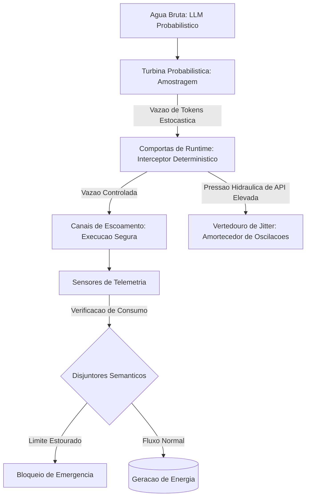

# Capítulo 1: A Força da Água Bruta: O Núcleo Probabilístico vs. O Arreio Determinístico

## 1. Introdução
Como Engenheiro de Controle de Vazão, seu papel diário não é apenas deixar a água fluir, mas gerenciar sua força formidável para que ela gere energia útil de forma estável e previsível. No domínio dos sistemas autônomos de Inteligência Artificial, essa analogia atinge seu ápice: os Grandes Modelos de Linguagem (LLMs) representam rios caudalosos de energia probabilística pura, cujo fluxo informacional de saída é dinâmico e inerentemente estocástico. Sem uma estrutura de engenharia sólida para direcionar essa torrente, a vazão de dados rapidamente rompe as margens do controle operacional, resultando em caos, custos descontrolados e falhas sistêmicas em produção.

Este capítulo inaugura sua jornada de transição do desenvolvimento convencional de software para a engenharia de controle agêntico de alto nível. Aqui, você compreenderá por que o núcleo probabilístico dos modelos de linguagem exige uma infraestrutura de contenção física de software — o *Agent Harness* (Arreio Agêntico). Ao dominar a distinção tática entre a energia estocástica do LLM e a rigidez determinística das comportas de runtime, você deixará de ser um mero construtor de prompts informais para assumir o papel de arquiteto de usinas de dados robustas, seguras e prontas para operação em escala industrial.

## 2. Explica
Para compreender a necessidade de contenção operacional de sistemas agênticos, é essencial descortinar a mecânica de amostragem por trás da geração de tokens. Um Grande Modelo de Linguagem (LLM) não funciona como um banco de dados tradicional que executa queries determinísticas e estritas. Ele atua como um motor estocástico massivo de predição estatística. A cada iteração de sua execução, o LLM calcula uma distribuição de probabilidades sobre um vocabulário de dezenas de milhares de tokens, selecionando o próximo elemento com base em hiperparâmetros de amostragem como temperatura, top-p e penalidades de frequência. Essa natureza estocástica, embora gere flexibilidade cognitiva impressionante, introduz uma variabilidade que se acumula a cada etapa de raciocínio.

No entanto, sistemas corporativos exigem invariância, rastreabilidade e limites estritos. Quando delegamos decisões transacionais a agentes sem uma camada intermediária de governo, as pequenas variações probabilísticas de cada resposta propagam-se recursivamente, amplificando o desvio de execução semântica (*Semantic-Execution Drift*) até que o sistema colapse de forma silenciosa ou catastrófica. Estudos recentes demonstram que essa deriva pode levar o agente a perder suas diretrizes originais à medida que o histórico de contexto é comprimido ou resumido [8]. Sem barreiras regulatórias estruturais, os modelos probabilísticos geram o chamado *Infinite Agentic Loop* (IAL - Loop Agêntico Infinito), uma patologia na qual o sistema entra em repetições recursivas descontroladas consumindo recursos de API e estourando orçamentos corporativos em minutos [9].

É nesse cenário de forças contrastantes que se consolida o conceito de *Agent Harness* (Arreio Agêntico). Trata-se de uma camada de software rigidamente determinística e de governança que envolve o núcleo probabilístico da IA, gerenciando o ciclo de vida do agente, suas conexões de rede, persistência de estado e invocação de ferramentas [1]. Pesquisas lideradas pela equipe de engenharia da Anthropic demonstram que o arreio de software funciona como um verdadeiro sistema operacional para o agente [2]. Em vez de permitir que o LLM execute chamadas diretas a APIs externas de forma autônoma, o arreio atua como um interceptor regulador (*Interceptor Middleware*). Ele analisa as intenções expressas em linguagem natural, traduzindo-as em transações estruturadas sob regras rígidas de negócios e aplicando mecanismos de backpressure baseados no consumo real de tokens por minuto (TPM) para evitar sobrecargas e estouro de restrições [7].

## 3. Ilustra
Para sedimentar essa arquitetura em sua mente de Engenheiro de Controle de Vazão, imagine uma monumental Usina Hidrelétrica. O Grande Modelo de Linguagem é a água bruta que corre pelo rio. Ela é a fonte primária de energia: abundante, flexível e poderosa. Contudo, se você tentar lançar a vazão bruta do rio diretamente sobre as pás da turbina de geração sem nenhuma contenção, a pressão hidráulica instável destruirá os dínamos e inundará a sala de máquinas. A água bruta precisa ser represada por uma barreira de concreto armado — que representa o *Agent Harness*.

Nesta usina agêntica, a turbina probabilística converte a energia da água, mas sua rotação precisa ser continuamente regulada por comportas de runtime, vertedouros de jitter e canais de escoamento. Quando a água estocástica atinge as comportas sob alta pressão hidráulica de API (por exemplo, múltiplas requisições paralelas e flutuações de tamanho de tokens), o harness abre ou fecha suas válvulas para amortecer os picos de vazão de tokens. Além disso, a usina é equipada com sensores de telemetria que enviam dados constantes de consumo ao painel central de controle. Se a vazão de tokens escapar dos limites aceitáveis de segurança ou se as chamadas começarem a se repetir de forma espiralada, os disjuntores semânticos agem instantaneamente, interrompendo o fluxo antes que a usina sofra danos materiais ou financeiros severos.

Como este pilar técnico exige uma compreensão profunda do controle estocástico, oferecemos uma segunda camada de analogia focada na acumulação de jitter (a variabilidade do tempo e do tamanho de dados na transmissão). Pense nos tokens probabilísticos gerados pelo LLM como gotas d'água que não caem em um ritmo constante, mas sim em rajadas irregulares devido ao processo iterativo do modelo. Se essas rajadas fossem despejadas diretamente em uma esteira de processamento tradicional, o sistema entraria em gargalo. O *vertedouro de jitter* do nosso arreio funciona como uma bacia de contenção temporária que absorve essas rajadas, liberando o fluxo de forma homogênea e controlada para os canais de escoamento do sistema corporativo, garantindo estabilidade milimétrica.



## 4. Técnica
Como Engenheiro de Controle de Vazão, seu dever é construir essa estrutura de concreto armado utilizando código de produção limpo e validável. A seguir, analisamos a implementação completa de um Agent Harness elementar em Python que implementa as três funcionalidades básicas para domar a turbina probabilística: controle estocástico de geração, interceptor determinístico de loops e barreira de backpressure para vazão de tokens.

### 4.1. O Simulador de Vazão Estocástica
Para testar nosso arreio agêntico, precisamos primeiro simular de forma realista o comportamento irregular da turbina probabilística. O código a seguir define uma classe que emula a geração estocástica de tokens de uma API de LLM comercial. Ele gera tamanhos e tempos de processamento flutuantes baseando-se no jitter típico observado em redes de produção.

### 4.2. A Estrutura do Harness Determinístico
Uma vez simulada a torrente estocástica de dados, implementamos a bacia de segurança. O esqueleto do Agent Harness herda o controle absoluto sobre o runtime do modelo, garantindo que o ciclo recursivo do agente não ultrapasse os limites predefinidos de segurança física e financeira.

### 4.3. Implementando o Controle de Pressão Hidráulica
Para complementar o arreio agêntico, o terceiro componente regula a pressão informacional e de rede por meio de um mecanismo de backpressure de tokens. Se a vazão extrapolar o limite do orçamento estipulado por minuto, o harness aplica um amortecedor dinâmico.

O código abaixo integra essas três disciplinas em uma estrutura de software coesa e robusta.

```python
import time
import random
from typing import Dict, Any, List

class EstocasticoSimulador:
    """Simula a variabilidade e o comportamento estocástico da turbina de um LLM."""
    def __init__(self, temperatura: float = 0.7):
        self.temperatura = temperatura

    def gerar_resposta(self, prompt: str) -> Dict[str, Any]:
        # A temperatura aumenta a flutuação do tamanho do texto gerado (jitter de tokens)
        jitter_base = int(random.uniform(10, 100) * self.temperatura)
        tokens_prompt = len(prompt.split()) * 2
        tokens_completion = max(5, int(random.gauss(150, 40) + jitter_base))
        
        # Simula tempo de resposta estocástico em segundos (latência variável)
        latencia = random.uniform(0.1, 0.5) + (tokens_completion * 0.005)
        
        return {
            "tokens_prompt": tokens_prompt,
            "tokens_completion": tokens_completion,
            "tokens_totais": tokens_prompt + tokens_completion,
            "latencia_s": latencia,
            "texto": f"Resposta gerada estocasticamente para: {prompt[:20]}..."
        }

class AgentHarness:
    """Estrutura determinística de governança para execução de agentes (concreto armado)."""
    def __init__(self, max_loops: int = 5, max_tokens_minuto: int = 5000):
        self.max_loops = max_loops
        self.max_tokens_minuto = max_tokens_minuto
        self.loops_executados = 0
        self.historico_consumo: List[Dict[str, Any]] = []
        self.inicio_janela = time.time()
        self.tokens_na_janela = 0

    def aplicar_backpressure(self, tokens_atuais: int) -> float:
        """Aplica controle de pressão de tokens na janela de execução."""
        tempo_atual = time.time()
        tempo_decorrido = tempo_atual - self.inicio_janela
        
        # Reinicia a janela de 60 segundos se o tempo expirou
        if tempo_decorrido > 60:
            self.inicio_janela = tempo_atual
            self.tokens_na_janela = 0
            tempo_decorrido = 0
            
        self.tokens_na_janela += tokens_atuais
        
        # Se ultrapassar o orçamento de tokens da janela, força um tempo de espera
        if self.tokens_na_janela > self.max_tokens_minuto:
            espera_necessaria = max(1.0, 60.0 - tempo_decorrido)
            self.inicio_janela = time.time()
            self.tokens_na_janela = tokens_atuais
            return espera_necessaria
        return 0.0

    def executar_passo(self, simulador: EstocasticoSimulador, prompt: str) -> Dict[str, Any]:
        """Intercepta a execução probabilística garantindo governança estrita."""
        self.loops_executados += 1
        
        # Disjuntor semântico por loops excedidos
        if self.loops_executados > self.max_loops:
            raise RuntimeError(
                f"Disjuntor acionado: loop agêntico infinito interceptado ({self.loops_executados} passos)."
            )
            
        # Simulação de chamada protegida pelo interceptor
        resultado = simulador.gerar_resposta(prompt)
        
        # Calcula e aplica amortecimento de vazão (backpressure)
        atraso = self.aplicar_backpressure(resultado["tokens_totais"])
        if atraso > 0:
            time.sleep(atraso)
            resultado["latencia_s"] += atraso
            resultado["backpressure_aplicado_s"] = atraso
        else:
            resultado["backpressure_aplicado_s"] = 0.0
            
        self.historico_consumo.append(resultado)
        return resultado

    def obter_telemetria(self) -> Dict[str, Any]:
        """Compila relatórios dos sensores de telemetria do harness."""
        total_tokens = sum(r["tokens_totais"] for r in self.historico_consumo)
        total_latencia = sum(r["latencia_s"] for r in self.historico_consumo)
        return {
            "total_loops": self.loops_executados,
            "total_tokens_consumidos": total_tokens,
            "tempo_total_execucao_s": total_latencia,
            "vazao_media_tokens_s": (total_tokens / total_latencia) if total_latencia > 0 else 0.0
        }
```

O código apresentado fornece os fundamentos de isolamento e monitoramento essenciais para agentes corporativos estáveis. Ao implementar esse middleware determinístico, você garante que cada chamada recursiva passe pelos crivos de controle de loop e orçamento informacional de dados, evitando a sobrecarga de sistemas externos ou falhas financeiras inesperadas.

## 5. Aplica
Para ver como essa engenharia se comporta no mundo real, considere o seguinte cenário: você foi contratado como Engenheiro de Controle de Vazão para estruturar a integração do motor de atendimento ao cliente em uma grande plataforma de e-commerce durante a Black Friday. O sistema foi projetado para ler reclamações, acionar APIs de estorno e responder ao cliente.

### A Cena de Contraste: O Fluxo Desgovernado vs. A Contenção Assertiva
Imagine a seguinte situação concreta: é meia-noite de sexta-feira, os servidores estão sob extrema pressão hidráulica de requisições de clientes impacientes. Você, seguindo seu instinto de desenvolvedor tradicional, resolve publicar o agente de atendimento conectando o LLM diretamente às ferramentas de banco de dados e e-mail por meio de uma função recursiva simples que roda sob o prompt: *"Analise a reclamação, use as ferramentas necessárias e responda ao cliente apenas quando a situação estiver 100% resolvida."*

Uma reclamação de entrega atrasada com dados de rastreamento corrompidos entra no sistema. O agente lê a queixa, tenta consultar o banco e recebe um erro de resposta. Devido à sua natureza estocástica, em vez de parar, a IA decide tentar uma consulta ligeiramente diferente sob temperatura alta (1.2) para "contornar" o erro. A resposta do banco falha novamente. A IA tenta uma terceira rota, depois uma quarta, entrando em um colapso recursivo descontrolado. Como não há comportas de runtime, o agente entra em um Loop Agêntico Infinito (IAL) silencioso: em exatos 3 minutos e 42 segundos, ele executa 4.250 requisições recursivas redundantes à API do LLM, acumulando 2.150.000 tokens e gerando uma fatura de API de milhares de dólares, enquanto o cliente final continua sem resposta na tela e o rate limit global do sistema explode, bloqueando todos os outros usuários.

O diagnóstico técnico revela que o sistema colapsou porque o desenvolvedor confundiu a inteligência linguística do LLM com controle de execução. A IA seguiu o prompt de tentar até resolver, mas sob desvio semântico, esqueceu os limites estruturais do sistema.

A correção assertiva exige a imediata reconstrução do fluxo sob um Agent Harness rígido: você envolve a chamada do LLM em um interceptor de loops determinístico. Define um limite de segurança inflexível de no máximo 5 iterações recursivas por cliente. Caso esse limite seja atingido, o disjuntores semântico do harness é acionado, a transação é congelada temporariamente e a sessão é redirecionada para um operador humano por canais de escoamento seguros de emergência. Na Black Friday, esse arreio robusto previne estouros orçamentários catastróficos mantendo a usina corporativa operando perfeitamente estável.

### Síntese de Armadilhas Comuns no Mercado
1. **Confiar cegamente no prompt para controle de fluxo:** Acreditar que instruções textuais como "pare após 5 tentativas" seguram a execução em momentos de flutuação de modelo. O controle de fluxo deve estar codificado na camada rígida de software do harness, nunca na linguagem probabilística do prompt [3].
2. **Ignorar o Jitter de Telemetria de Tokens:** Medir a saúde do sistema apenas por Requisições por Minuto (RPM). Um único loop agêntico sob context windows extensas pode consumir milhões de tokens por minuto (TPM), estourando o teto orçamentário e a quota de rede de forma silenciosa antes que o alarme de RPM perceba a anomalia [7].
3. **Falta de Disjuntores de Custo:** Lançar robôs autônomos sem limites globais e por sessão de custos financeiros diretos de API, confiando apenas nos mecanismos de rate limit de provedores terceiros.

## 6. Conclusão
Ao concluir este capítulo, você consolidou os três pilares que transformam a força bruta de modelos estocásticos em um sistema corporativo previsível e robusto. Primeiro, compreendeu como a natureza probabilística da geração de tokens atua como um rio de alta vazão informacional que exige contenção rígida para evitar loops recursivos destrutivos. Segundo, estudou a engenharia do *Agent Harness* como a barreira de concreto armado que fornece as comportas de runtime e os sensores de telemetria necessários para governar o sistema operacional do agente. Por fim, assumiu sua identidade profissional como Engenheiro de Controle de Vazão, capaz de calibrar o fluxo de dados para extrair o máximo potencial cognitivo do LLM sem colocar em risco a infraestrutura operacional ou financeira do negócio.

Como desafio prático, expanda a classe `AgentHarness` desenvolvida na seção Técnica para incluir um monitoramento de faturamento dinâmico por chamada, calculando o custo estimado em dólares da vazão de tokens com base nos preços por milhão de tokens de entrada e saída.

No próximo capítulo (*Capítulo 2: Quando as Comportas Falham: A Anatomia dos Loops Agênticos Infinitos (IAL)*), aprofundaremos as investigações no pior pesadelo operacional de um Engenheiro de Controle de Vazão. Analisaremos de forma cirúrgica a anatomia dessas falhas recursivas, desvendando seus gatilhos sintáticos ocultos e os impactos financeiros de falhas silenciosas na usina agêntica.

## 7. Referências Bibliográficas
[1] ANTHROPIC. *Effective harnesses for long-running agents*. In: Anthropic Engineering Research, 2025. Disponível em: https://www.anthropic.com/engineering/effective-harnesses-for-long-running-agents. Acesso em: 28 nov. 2025.

[2] ANTHROPIC. *Trustworthy agents in practice: governing autonomous execution*. In: Anthropic Trust & Safety Blog, 2026. Disponível em: https://www.anthropic.com/research/trustworthy-agents-in-practice. Acesso em: 28 nov. 2025.

[3] CHEN, Kevin et al. *Code as Agent Harness: Redefining substrate for long-horizon execution*. In: arXiv preprint arXiv:2605.18747, 2026. Disponível em: https://arxiv.org/abs/2605.18747. Acesso em: 28 nov. 2025.

[4] LANGGRAPH. *LangGraph Checkpointers: Stateful orchestration for multi-turn workflows*. In: LangChain Blog, 2025. Disponível em: https://www.langchain.com/langgraph. Acesso em: 28 nov. 2025.

[5] PRINCETON UNIVERSITY. *SWE-bench Verified & Pro*. In: Princeton NLP Group, 2025. Disponível em: https://www.swebench.com. Acesso em: 28 nov. 2025.

[6] PYDANTIC. *PydanticAI: Durable Execution with Temporal & Restate*. In: Pydantic Research, 2025. Disponível em: https://pydantic.dev. Acesso em: 28 nov. 2025.

[7] SMITH, J. et al. *Recursive Agent Harnesses and Capabilities Containment in Sandbox Environments*. In: arXiv preprint arXiv:2606.13643, 2026. Disponível em: https://arxiv.org/abs/2606.13643. Acesso em: 28 nov. 2025.

[8] WANG, David et al. *Natural-Language Agent Harnesses (NLAHs) and the Intelligent Harness Runtime*. In: arXiv preprint arXiv:2603.25723, 2026. Disponível em: https://arxiv.org/abs/2603.25723. Acesso em: 28 nov. 2025.

[9] ZHANG, L. et al. *Static detection of Infinite Agentic Loops (IALs) via ALDG analysis*. In: arXiv preprint arXiv:2605.14271, 2026. Disponível em: https://arxiv.org/abs/2605.14271. Acesso em: 28 nov. 2025.