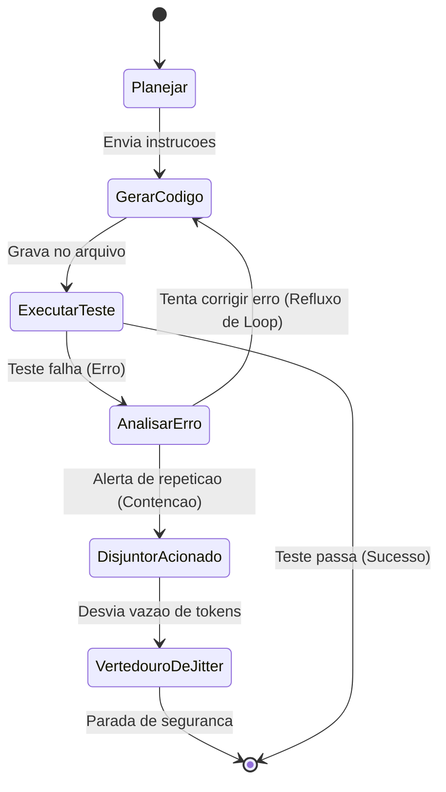

# Capítulo 2: Quando as Comportas Falham: A Anatomia dos Loops Agênticos Infinitos (IAL)

## 1. Introdução
No Capítulo 1, você compreendeu a distinção fundamental entre a natureza intrinsecamente probabilística das LLMs (a turbina probabilística) e a necessidade de uma infraestrutura determinística rígida (o concreto armado do harness) para viabilizar operações agênticas seguras [1][3]. Contudo, à medida que construímos fluxos autônomos complexos e de longa duração, uma nova ameaça se avizinha: o momento em que as águas do fluxo informacional escapam ao controle. Quando o arreio falha e as comportas de runtime cedem sob a pressão, o sistema entra em uma espiral de autoalimentação redundante e catastrófica.

Este capítulo disseca a mecânica patológica do Loop Agêntico Infinito (IAL - *Infinite Agentic Loop*), um dos maiores gargalos de resiliência e estabilidade em agentes de IA de longa duração [3][9]. Você aprenderá a modelar preventivamente as transições lógicas de seu agente através do Grafo de Dependência de Loop (*Agentic Loop Dependency Graph* - ALDG) [9]. Ao dominar esses conceitos, você transitará de um observador passivo de logs volumosos e caros para um Engenheiro de Controle de Vazão capaz de interceptar e sanar disfunções recursivas antes que elas sequer toquem a infraestrutura de produção [2][7].

## 2. Explica
A essência de um agente autônomo reside na sua capacidade de ciclar: receber um objetivo, raciocinar, selecionar uma ferramenta, analisar a resposta do ambiente e repetir o processo até a conclusão lógica da meta estabelecida [1][2]. Essa autonomia de longa execução, no entanto, cria uma vulnerabilidade de feedback recursivo dinâmico conhecido como Loop Agêntico Infinito (IAL) [3][9]. O IAL é definido matematicamente como um estado patológico onde a sequência de transições de estados lógicos do agente converge para um subgrafo fortemente conexo do qual ele não consegue escapar de forma autônoma, gerando computação redundante sem progresso efetivo em direção ao objetivo principal [9].

Diferente de um loop de código tradicional (como um loop `while` estático no desenvolvimento convencional), o IAL é dinâmico, adaptativo e frequentemente invisível no nível do analisador sintático clássico [9]. A causa raiz do IAL reside no choque entre a semântica fluida do modelo probabilístico e as restrições sintáticas rígidas do ambiente tradicional. Pesquisas de engenharia de software revelam que os gatilhos mais frequentes do IAL se dividem em três grandes classes de falha [3][7][9]:

1. **Falha Sistêmica de Parser e Expressões Regulares:** O modelo probabilístico gera uma resposta que viola o formato estrito esperado pelo sistema de suporte (como um schema JSON ou XML de saída das ferramentas) [3]. O parser sintático falha, gera uma mensagem de erro detalhada que é injetada de volta no histórico de contexto, e o modelo, ao tentar corrigir a falha na rodada seguinte, comete exatamente o mesmo erro de formatação sob o viés de atenção induzido pelas mensagens de erro no histórico [3][9].
2. **Restrições Contraditórias e Deriva Semântica (*Semantic-Execution Drift*):** O prompt do sistema contém diretivas que se anulam mutuamente [1][8]. O agente flutua indefinidamente tentando atender a uma restrição, falhando na outra, e revertendo seu próprio progresso em um movimento de oscilação contínua e sem término lógico [8].
3. **Mapeamento Indevido de Grafo de Transições:** O grafo de transição lógica do agente carece de restrições determinísticas [9]. Sem uma lógica de contenção robusta aplicada externamente pelo harness, as transições fluem livremente em ciclos direcionados propensos a instabilidades de realimentação [2].

Para prevenir esse cenário catastrófico, a engenharia agêntica introduziu a disciplina da modelagem do Grafo de Dependência de Loop (*Agentic Loop Dependency Graph* - ALDG) [9]. O ALDG é uma representação formal direcionada em que os vértices representam os estados lógicos ou ferramentas disponíveis para o agente, e as arestas mapeiam as transições de execução possíveis [9]. Ao analisar estaticamente o ALDG antes da execução — traduzindo o código de orquestração em uma representação intermediária —, é possível rastrear caminhos propensos a loops e instalar disjuntores lógicos nas comportas de runtime de modo preventivo [9].

## 3. Ilustra
Imagine uma usina hidrelétrica moderna projetada para gerar energia a partir do represamento do fluxo hídrico de um rio selvagem. Nesse cenário, o LLM representa a energia bruta, volumosa e probabilística da água que desce as montanhas. O Harness agêntico é a infraestrutura de concreto armado da barragem, e você, o Engenheiro de Controle de Vazão responsável pela operação segura do sistema.

A água deve fluir de maneira controlada pelas tubulações, acionar a turbina probabilística para gerar energia e seguir livremente pelo canal de escoamento em direção ao leito natural do rio. As comportas de runtime controlam a entrada e saída dessa água, enquanto os sensores de telemetria medem de forma contínua a pressão hidráulica e a vazão de tokens.

### A Dupla Analogia da Instabilidade e do Mapeamento Preventivo
Um Loop Agêntico Infinito (IAL) é o equivalente a uma falha mecânica nas válvulas de retenção das comportas que força a água turbinada a sofrer refluxo, retornando repetidamente para o reservatório inicial em vez de escoar. A usina começa a consumir energia de forma inútil, bombeando a mesma água em um círculo infinito. As turbinas giram em rotação máxima, o calor operacional aumenta, a pressão hidráulica de API dispara no painel e o orçamento de tokens evapora sem que uma única gota de água limpa siga adiante pelo canal de escoamento. O sistema trabalha freneticamente para gerar absolutamente nada de útil.

Para prever e sanar essa catástrofe hídrica, o Engenheiro de Controle de Vazão utiliza o Grafo de Dependência de Loop (ALDG) como um mapeamento hidráulico preventivo. Ele identifica matematicamente os caminhos nas tubulações que podem aprisionar o fluxo em circuitos fechados sem saída natural. Se o ALDG aponta uma rota cíclica instável nas comportas, instalamos disjuntores semânticos — válvulas mecânicas de segurança que, ao detectarem que o mesmo padrão de água está recirculando três vezes pela mesma comporta sem alterar o nível do reservatório, cortam o fluxo principal e desviam o excesso de pressão de tokens para o vertedouro de jitter.

Abaixo, representamos graficamente esse circuito de instabilidade hidráulica e a intervenção determinística do disjuntor de segurança do harness.



No diagrama acima, note como a transição cíclica entre `GerarCodigo`, `ExecutarTeste` e `AnalisarErro` forma um loop patológico característico no ALDG [9]. A ausência de um disjuntor semântico deixaria o sistema preso nessa rota cíclica indefinidamente, exaurindo a pressão hidráulica de API. O disjuntor atua precisamente no fluxo de correção do erro, interrompendo a transição recursiva e direcionando o sistema de forma segura para o vertedouro de jitter [7][9].

## 4. Técnica
A implementação prática de sistemas de detecção e contenção de Loops Agênticos Infinitos (IAL) exige duas defesas complementares: a análise estática preventiva do ALDG para identificar rotas cíclicas perigosas antes da execução, e a aplicação de disjuntores semânticos e orçamentários de runtime para conter explosões de tokens em tempo real [7][9].

A seguir, apresentamos a implementação em Python de um ecossistema completo de governança de fluxo e vazão. O código é autossuficiente e estruturado em duas classes principais:
1. `ALDGAnalyzer`: Realiza busca em profundidade (DFS) com coloração de vértices para rastrear caminhos fortemente conectados na lógica de transições de ferramentas de seu agente [9].
2. `DisjuntorSemanticoGuard`: Atua como interceptador ativo no harness de execução, gerenciando de forma restrita o orçamento financeiro (vazão de tokens) e a redundância de assinaturas das ações executadas pelo modelo [5][7].

```python
import json
import logging
import re
from typing import Dict, List, Set, Tuple

class ALDGAnalyzer:
    """
    Analisa o Grafo de Dependência de Loop Agêntico (ALDG - Agentic Loop Dependency Graph)
    para rastrear, mapear e prever rotas cíclicas de instabilidade lógicas.
    """
    def __init__(self) -> None:
        self.adj_list: Dict[str, Set[str]] = {}

    def adicionar_transicao(self, de_estado: str, para_estado: str) -> None:
        """Adiciona uma transição direcionada de fluxo entre dois estados lógicos do agente."""
        if de_estado not in self.adj_list:
            self.adj_list[de_estado] = set()
        self.adj_list[de_estado].add(para_estado)

    def obter_ciclos(self) -> List[List[str]]:
        """
        Executa busca em profundidade (DFS) com coloração de vértices para mapear
        e listar todos os ciclos simples direcionados (ALDG) presentes no grafo.
        """
        visitados: Dict[str, int] = {}  # 0: branco (não visitado), 1: cinza (em exploração), 2: preto (concluído)
        ciclos: List[List[str]] = []
        caminho_atual: List[str] = []

        # Inicializa todos os nós conhecidos
        todos_estados = set(self.adj_list.keys())
        for vizinhos in self.adj_list.values():
            todos_estados.update(vizinhos)
            
        for estado in todos_estados:
            visitados[estado] = 0

        def dfs(u: str) -> None:
            visitados[u] = 1
            caminho_atual.append(u)

            for vizinho in self.adj_list.get(u, set()):
                vizinho_estado = visitados.get(vizinho, 0)
                if vizinho_estado == 1:
                    # Ciclo direcionado (Back Edge) detectado no ALDG
                    if vizinho in caminho_atual:
                        idx = caminho_atual.index(vizinho)
                        ciclo_encontrado = caminho_atual[idx:] + [vizinho]
                        ciclos.append(ciclo_encontrado)
                elif vizinho_estado == 0:
                    dfs(vizinho)

            visitados[u] = 2
            caminho_atual.pop()

        for estado in todos_estados:
            if visitados.get(estado, 0) == 0:
                dfs(estado)

        return os_ciclos_unificados(ciclos)

def os_ciclos_unificados(ciclos: List[List[str]]) -> List[List[str]]:
    """Remove duplicatas de ciclos que representam a mesma rota periódica."""
    vistos: Set[str] = set()
    unicos: List[List[str]] = []
    for c in ciclos:
        if len(c) < 2:
            continue
        representacao_rota = "->".join(sorted(c[:-1]))
        if representacao_rota not in vistos:
            vistos.add(representacao_rota)
            unicos.append(c)
    return unicos

class DisjuntorSemanticoGuard:
    """
    Monitora e modera a vazão de tokens e a pressão hidráulica de API em tempo real,
    servindo como barreira contra falhas silenciosas de loops recursivos.
    """
    def __init__(self, limite_chamadas: int = 10, limite_tokens: int = 50000) -> None:
        self.limite_chamadas = limite_chamadas
        self.limite_tokens = limite_tokens
        self.total_chamadas = 0
        self.total_tokens_consumidos = 0
        self.historico_assinaturas_acoes: List[str] = []

    def registrar_passo(self, acao_nome: str, payload_saida: str, tokens_gastos: int) -> Tuple[bool, str]:
        """
        Registra uma ação e avalia se os disjuntores do harness devem ser acionados.
        Retorna (True, 'OK') se a vazão estiver normal, ou (False, 'Motivo') se bloqueado.
        """
        self.total_chamadas += 1
        self.total_tokens_consumidos += tokens_gastos

        # Disjuntor 1: Contenção de Pressão Hidráulica (Vazão Absoluta de Chamadas)
        if self.total_chamadas > self.limite_chamadas:
            return False, f"Disjuntor de Runtime: Limite absoluto de chamadas excedido ({self.limite_chamadas})."

        # Disjuntor 2: Orçamento Financeiro de Tokens (Vazão de Tokens)
        if self.total_tokens_consumidos > self.limite_tokens:
            return False, f"Disjuntor Financeiro: Consumo de tokens excedeu o orçamentado ({self.total_tokens_consumidos}/{self.limite_tokens})."

        # Disjuntor 3: Detecção de Assinatura Semântica Consecutiva Repetitiva
        assinatura_limpa = re.sub(r"\d+", "", payload_saida).strip()
        self.historico_assinaturas_acoes.append(f"{acao_nome}:{assinatura_limpa}")

        if len(self.historico_assinaturas_acoes) >= 3:
            ultimas_tres = self.historico_assinaturas_acoes[-3:]
            if ultimas_tres[0] == ultimas_tres[1] == ultimas_tres[2]:
                return False, "Disjuntor Semântico: Loop estático detectado (ações repetitivas consecutivas idênticas)."

        return True, "Fluxo hídrico autorizado."

def simular_cenario_vazao() -> str:
    """Simula o fluxo completo de análise preventiva de ALDG e monitoramento ativo do harness."""
    # Fase 1: Análise Estática Preventiva
    analyzer = ALDGAnalyzer()
    analyzer.adicionar_transicao("ParserEntrada", "ExecutarCalculo")
    analyzer.adicionar_transicao("ExecutarCalculo", "GeraRelatorio")
    analyzer.adicionar_transicao("GeraRelatorio", "ValidaSchema")
    analyzer.adicionar_transicao("ValidaSchema", "CorrigirPrompt")
    analyzer.adicionar_transicao("CorrigirPrompt", "ExecutarCalculo")  # Ciclo Perigoso (ALDG)

    ciclos_mapeados = analyzer.obter_ciclos()

    # Fase 2: Execução de Runtime e Monitoramento de Vazão
    guard = DisjuntorSemanticoGuard(limite_chamadas=5, limite_tokens=25000)
    
    # Simula chamadas repetitivas induzidas por uma falha silenciosa de parser
    historico_passos = [
        ("ExecutarCalculo", '{"status": "erro", "id": 101, "msg": "Incorreto"}', 4000),
        ("GeraRelatorio", '{"status": "processando", "id": 102}', 3000),
        ("ValidaSchema", '{"erro_schema": "incompativel", "detalhe": "X"}', 4000),
        ("CorrigirPrompt", '{"status": "tentando", "id": 104}', 5000),
        # O agente cai no ciclo de instabilidade de vazão
        ("ExecutarCalculo", '{"status": "erro", "id": 105, "msg": "Incorreto"}', 4000),
        ("GeraRelatorio", '{"status": "processando", "id": 106}', 3000),
        ("ValidaSchema", '{"erro_schema": "incompativel", "detalhe": "X"}', 4000)
    ]

    historico_execucao = []
    status_final = "Processamento concluído com êxito."

    for acao, payload, tokens in historico_passos:
        autorizado, mensagem = guard.registrar_passo(acao, payload, tokens)
        historico_execucao.append({
            "acao": acao,
            "tokens_acumulados": guard.total_tokens_consumidos,
            "chamadas": guard.total_chamadas,
            "autorizado": autorizado,
            "mensagem": mensagem
        })
        if not autorizado:
            status_final = f"BLOQUEIO EXECUTADO: {mensagem}"
            break

    relatorio_completo = {
        "analise_preventiva_aldg": {
            "ciclos_identificados": ciclos_mapeados,
            "contem_rotas_perigosas": len(ciclos_mapeados) > 0
        },
        "execucao_runtime": {
            "passos_processados": historico_execucao,
            "status_final": status_final
        }
    }
    return json.dumps(relatorio_completo, indent=2)

if __name__ == "__main__":
    print(simular_cenario_vazao())
```

Ao executar este código, você obterá a representação exata de como a telemetria do harness intercepta a falha silenciosa e previne o esgotamento orçamentário. O analisador estático ALDG detecta com precisão a rota de instabilidade antes da execução, enquanto o disjuntor de runtime atua no quinto passo, contendo a vazão excessiva antes que o limite de tokens corporativo seja violado.

## 5. Aplica
Você está de plantão na sala de controle da usina informacional da sua empresa em uma tarde de sexta-feira. No painel de custos, um aviso de emergência pisca em vermelho: a cota financeira de API do principal agente de suporte corporativo está se exaurindo de forma exponencial. A vazão de tokens disparou, consumindo o equivalente a dez dias de orçamento em menos de quarenta minutos de execução silenciosa [9].

Ao examinar os arquivos de log, você flagra o erro em tempo real: o agente está preso em um loop patológico recursivo. Para cada solicitação de faturamento de cliente, o modelo gera um JSON contendo uma barra de escape inválida na string. O analisador de entrada do back-end rejeita o objeto e devolve uma mensagem de erro genérica: `"JSON inválido próximo ao caractere 12"`. O agente lê o erro sintático de parsing, pede desculpas ao sistema no próximo turno de atenção semântica, mas, influenciado pela presença maciça da assinatura do erro no histórico de contexto, reconstrói exatamente a mesma string com o mesmo escape inválido [3][9]. Sem comportas de runtime ativas ou disjuntores semânticos instalados no arreio agêntico, o sistema continuou retransmitindo a falha, drenando o orçamento corporativo a uma velocidade de milhares de requisições inúteis por hora [7][9].

Se você simplesmente reiniciar o container do agente, o mesmo prompt de entrada do cliente ativará o ciclo dinâmico novamente. O diagnóstico revela que a equipe de engenharia negligenciou o controle de backpressure de tokens e a modelagem do ALDG [9].

Ao instalar o `DisjuntorSemanticoGuard` no harness de execução do agente, a terceira reiteração consecutiva do padrão de erro sintático é imediatamente interceptada no nível do arreio determinístico [7]. O fluxo hídrico patológico é interrompido antes do próximo envio de API, e o Engenheiro de Controle de Vazão é notificado de maneira precisa e estruturada, resgatando a estabilidade operacional da usina sem comprometer as contas da organização.

### Armadilhas Comuns no Manejo de Loops Agênticos
No desenvolvimento industrial de fluxos agênticos de longa duração, as principais armadilhas que levam ao estouro catastrófico de recursos incluem:

- **Ausência de Limites Globais de Iterações (Timeout Guards):** Acreditar que a inteligência natural do modelo probabilístico fará com que ele perceba que está falhando e desista do loop de forma autônoma [1][3].
- **Falta de Normalização Semântica na Telemetria:** Analisar os logs puramente de forma sintática ou por correspondência exata, ignorando que o modelo pode sutilmente variar as palavras mantendo exatamente o mesmo loop conceitual estrutural [8][9].
- **Mensagens de Erro Excessivamente Detalhadas para o Modelo:** Retornar o stack trace completo do sistema para o contexto do agente na tentativa de ajudá-lo a depurar. Isso apenas polui a janela de atenção e satura a pressão de tokens, acelerando o desastre financeiro [2].

## 6. Conclusão
O domínio das forças probabilísticas que regem os sistemas baseados em modelos de linguagem exige, em contrapartida, uma engenharia de contenção absolutamente determinística e inabalável. Neste capítulo, você analisou as causas estruturais e sintáticas que originam os Loops Agênticos Infinitos (IAL) [3][9]. Compreendeu como modelar formalmente as rotas lógicas das transições de seu agente utilizando o Grafo de Dependência de Loop (ALDG) e aprendeu a monitorar em tempo real a pressão de tokens por meio de disjuntores semânticos e orçamentários do harness [7][9].

**Desafio Tático:** Analise o fluxo do seu agente principal em produção hoje. Esboce manualmente seu grafo de transições, mapeie os loops fortemente conexos e implemente um disjuntor de contenção para garantir que nenhuma sessão agêntica consuma mais de 25% de sua cota máxima de tokens diária sem intervenção humana formal.

No próximo capítulo, projetaremos as bases estruturais da represa agêntica por meio do estudo de Harnesses de Linguagem Natural e do equilíbrio dinâmico entre o código tradicional e as instruções interpretadas do runtime inteligente [8].

## 7. Referências Bibliográficas
[1] ANTHROPIC. *Effective harnesses for long-running agents*. In: Anthropic Engineering Research, 2025. Disponível em: https://www.anthropic.com/engineering/effective-harnesses-for-long-running-agents. Acesso em: 28 nov. 2025.

[2] ANTHROPIC. *Trustworthy agents in practice: governing autonomous execution*. In: Anthropic Trust & Safety Blog, 2026. Disponível em: https://www.anthropic.com/research/trustworthy-agents-in-practice. Acesso em: 28 nov. 2025.

[3] CHEN, Kevin et al. *Code as Agent Harness: Redefining substrate for long-horizon execution*. In: arXiv preprint arXiv:2605.18747, 2026. Disponível em: https://arxiv.org/abs/2605.18747. Acesso em: 28 nov. 2025.

[4] LANGGRAPH. *LangGraph Checkpointers: Stateful orchestration for multi-turn workflows*. Disponível em: https://www.langchain.com/langgraph. Acesso em: 28 nov. 2025.

[5] PRINCETON UNIVERSITY. *SWE-bench Verified & Pro*. Disponível em: https://www.swebench.com. Acesso em: 28 nov. 2025.

[6] PYDANTIC. *PydanticAI: Durable Execution with Temporal & Restate*. Disponível em: https://pydantic.dev. Acesso em: 28 nov. 2025.

[7] SMITH, J. et al. *Recursive Agent Harnesses and Capabilities Containment in Sandbox Environments*. In: arXiv preprint arXiv:2606.13643, 2026. Disponível em: https://arxiv.org/abs/2606.13643. Acesso em: 28 nov. 2025.

[8] WANG, David et al. *Natural-Language Agent Harnesses (NLAHs) and the Intelligent Harness Runtime*. In: arXiv preprint arXiv:2603.25723, 2026. Disponível em: https://arxiv.org/abs/2603.25723. Acesso em: 28 nov. 2025.

[9] ZHANG, L. et al. *Static detection of Infinite Agentic Loops (IALs) via ALDG analysis*. In: arXiv preprint arXiv:2605.14271, 2026. Disponível em: https://arxiv.org/abs/2605.14271. Acesso em: 28 nov. 2025.
