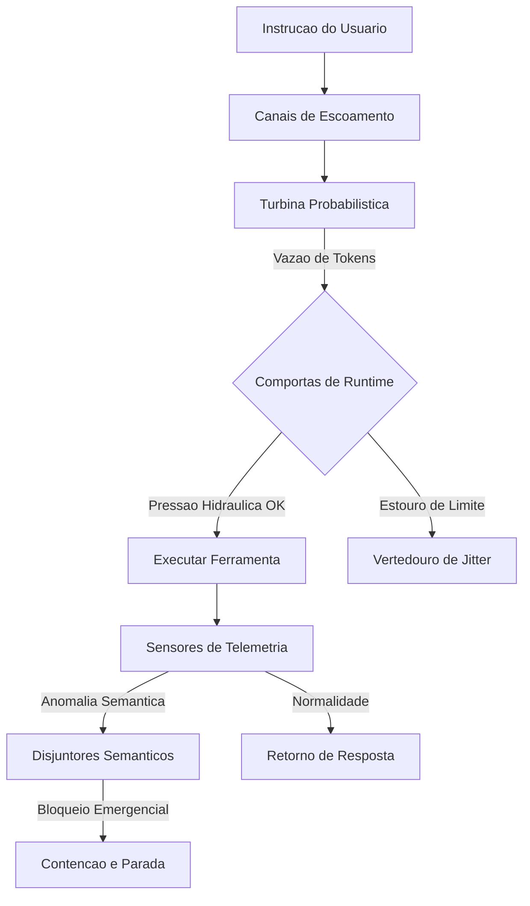

# Capítulo 3: Projetando a Represa: O Acordo de Coexistência entre Código e Linguagem Natural

## 1. Introdução

No Capítulo 2, você desvendou a mecânica patológica dos Loops Agênticos Infinitos (IALs) e compreendeu como as falhas recursivas e instabilidades semânticas podem comprometer a execução autônoma de longa duração. Agora, daremos o passo definitivo rumo ao controle operacional dessas forças: a projeção de uma infraestrutura robusta e segura capaz de regular a interface de contato direto entre a flexibilidade fluida da linguagem natural e a rigidez imutável dos sistemas computacionais tradicionais. 

O objetivo deste capítulo é estudar a fundo a arquitetura de Natural-Language Agent Harnesses (NLAHs) e detalhar as estratégias táticas necessárias para estruturar interfaces estáveis entre instruções interpretadas e controle de runtime. Como Engenheiro de Controle de Vazão, você aprenderá a construir comportas determinísticas, erguendo barreiras físicas e semânticas inquebráveis que transformam a imprevisibilidade de um LLM em uma geração de valor contínua, segura e previsível.

## 2. Explica

A grande virada de paradigma trazida pela computação cognitiva é a capacidade de operar sistemas usando a linguagem humana como substrato ativo de instrução [8]. No entanto, ao contrário de compiladores deterministicos tradicionais, o núcleo probabilístico das LLMs opera em um regime estocástico onde a mesma instrução de entrada pode gerar respostas estruturalmente variadas. É aqui que reside o maior ponto de tensão da arquitetura de agentes autônomos: como construir sistemas de produção confiáveis que usam uma peça central inerentemente imprevisível?

A resposta de engenharia para essa equação não é o engessamento sintático do modelo, mas sim o encapsulamento do LLM dentro de um Natural-Language Agent Harness (NLAH) [8]. O NLAH funciona como o concreto armado de uma usina hidrelétrica, estabelecendo limites físicos e lógicos rígidos para que o fluxo cognitivo seja canalizado de forma útil e controlada, sem transbordamentos sistêmicos [1]. Em vez de permitir que o agente interaja diretamente com o host ou execute ações arbitrárias baseadas no processamento interno de tokens, o runtime inteligente intercepta e valida cada transição de estado semântica [2].

Essa blindagem estrutural exige a imposição de restrições de fronteira rígidas e validações feedforward contínuas. Conforme apontado por pesquisas recentes em runtimes híbridos, o verdadeiro equilíbrio dinâmico reside na dissociação entre a geração semântica e a execução operacional [3]. Isso é viabilizado traduzindo as instruções flexíveis da linguagem natural em contratos estritos baseados em esquemas de dados fortemente tipados antes de realizar qualquer chamada de ferramenta com efeitos colaterais [2]. Desse modo, o runtime inteligente atua como um mediador de alta confiabilidade, garantindo previsibilidade de código sem asfixiar as capacidades de raciocínio abstrato do agente.

## 3. Ilustra

Para consolidar intuitivamente a mecânica de um Natural-Language Agent Harness, imagine uma usina hidrelétrica de alta pressão instalada sobre uma fonte inesgotável e instável de água de rio. A água representa a força crua e estocástica do modelo probabilístico de linguagem natural — altamente enérgica, mas capaz de inundar o ecossistema adjacente se não houver anteparos físicos. 

O Harness de dois agentes ou NLAH é a própria usina, construída em concreto armado e aço. O Engenheiro de Controle de Vazão não tenta congelar o rio ou impedir a água de fluir, pois isso inutilizaria a geração de energia; em vez disso, ele a canaliza por meio de tubulações de aço específicas denominadas canais de escoamento. 

Dentro da usina, a turbina probabilística converte o fluxo caótico de água bruta em energia controlável. No entanto, para evitar que a pressão hidráulica de API estoure os geradores, o sistema conta com sensores de telemetria e comportas de runtime dinâmicas. 

Se a vazão de tokens subir de forma alarmante, ameaçando iniciar um ciclo destrutivo de turbulência, o vertedouro de Jitter se abre automaticamente para atenuar as ondas de choque. Da mesma forma, se a água do rio começar a girar de forma estagnada e destrutiva em um turbilhão recursivo, os disjuntores semânticos interrompem instantaneamente a passagem de água para a bacia de segurança, isolando o fluxo de controle até que o equilíbrio seja restabelecido pelo time de operações da represa.



## 4. Técnica

Como Engenheiro de Controle de Vazão, o desenvolvimento tático de um NLAH seguro passa pela implementação de estruturas que gerenciem a vazão informacional por meio de contratos estritos e limites físicos. O arcabouço técnico baseia-se na tipagem forte oferecida pelo Pydantic para validação estrutural [6], integrado a um padrão transacional durável para salvaguardar checkpoints de execução [4].

Abaixo está o código-fonte em Python completo que implementa o esqueleto operacional de um Natural-Language Agent Harness estável. Esta infraestrutura é responsável por validar chamadas de ferramentas agênticas de forma determinística, aplicar limites de contenção contra loops invisíveis e monitorar anomalias de texto livre por meio de disjuntores semânticos.

### Implementação de um Harness Agêntico Determinístico

```python
import time
from typing import Dict, Any, List, Optional
from pydantic import BaseModel, Field, ValidationError

class ToolContract(BaseModel):
    """Contrato estrito para validação de chamadas de ferramentas agênticas."""
    tool_name: str = Field(..., description="Nome da ferramenta autorizada")
    arguments: Dict[str, Any] = Field(default_factory=dict, description="Argumentos tipados")

class ExecutionTelemetry(BaseModel):
    """Métricas de telemetria coletadas pelas comportas do runtime inteligente."""
    token_count: int = 0
    iteration_count: int = 0
    elapsed_time: float = 0.0
    semantic_warnings: List[str] = Field(default_factory=list)

class SemanticCircuitBreakerException(Exception):
    """Exceção disparada quando os disjuntores semânticos detectam anomalias."""
    pass

class NaturalLanguageAgentHarness:
    """Natural-Language Agent Harness (NLAH) para controle e contenção de vazão."""

    def __init__(self, max_tokens: int, max_iterations: int, timeout: float):
        self.max_tokens = max_tokens
        self.max_iterations = max_iterations
        self.timeout = timeout
        self.telemetry = ExecutionTelemetry()
        self.start_time = 0.0

    def start_session(self) -> None:
        """Inicia o monitoramento na bacia de segurança informacional."""
        self.start_time = time.time()
        self.telemetry = ExecutionTelemetry()

    def check_physical_boundaries(self, current_tokens: int) -> None:
        """Aplica barreiras físicas contra estouro de taxas e loops infinitos."""
        self.telemetry.token_count += current_tokens
        self.telemetry.iteration_count += 1
        self.telemetry.elapsed_time = time.time() - self.start_time

        if self.telemetry.token_count > self.max_tokens:
            raise OverflowError(f"Estouro de Vazão de Tokens: {self.telemetry.token_count} excede o limite.")
        
        if self.telemetry.iteration_count > self.max_iterations:
            raise RuntimeError(f"Comportas de Runtime: Limite de iterações ({self.max_iterations}) atingido.")
        
        if self.telemetry.elapsed_time > self.timeout:
            raise TimeoutError(f"Pressão Hidráulica de API: Timeout de {self.timeout}s atingido.")

    def inspect_semantic_flow(self, response_text: str) -> None:
        """Analisa o canal de escoamento cognitivo à procura de drifts semânticos."""
        lower_text = response_text.lower()
        patterns = ["desculpe pelo erro", "estou corrigindo", "repetindo a tentativa", "refazendo o passo"]
        warnings = [p for p in patterns if p in lower_text]
        
        for warning in warnings:
            self.telemetry.semantic_warnings.append(warning)
            
        if len(self.telemetry.semantic_warnings) >= 3:
            raise SemanticCircuitBreakerException(
                "Disjuntores Semânticos ativados: Padrão repetitivo de instabilidade semântica detectado."
            )

    def execute_tool_safely(self, raw_call: Dict[str, Any]) -> str:
        """Valida e executa a chamada de ferramenta de forma determinística."""
        try:
            contract = ToolContract(**raw_call)
            return f"Ferramenta {contract.tool_name} executada com sucesso com argumentos {contract.arguments}."
        except ValidationError as e:
            return f"Erro de validação semântica nas Comportas de Runtime: {e.errors()}"
```

### Acoplamento do Workflow de Execução Estável

Para garantir que a bacia de segurança atue corretamente em torno da turbina probabilística, o fluxo operacional do agente deve ser orquestrado por um loop controlado que interage de forma consistente com a persistência de estados transacionais [4]:

```python
def run_agent_loop(harness: NaturalLanguageAgentHarness, steps: List[Dict[str, Any]]) -> None:
    """Executa o loop de controle de vazão simulando chamadas de ferramentas agênticas."""
    harness.start_session()
    print("Iniciando escoamento seguro informacional...")

    for i, step in enumerate(steps):
        try:
            # Coleta telemetria e aplica barreiras físicas
            harness.check_physical_boundaries(current_tokens=step.get("tokens", 100))
            
            # Inspeciona a qualidade semântica da resposta do agente
            harness.inspect_semantic_flow(response_text=step.get("response", ""))
            
            # Valida e executa ferramenta
            if "tool_call" in step:
                resultado = harness.execute_tool_safely(step["tool_call"])
                print(f"[Iteracao {i+1}] {resultado}")
            
        except (OverflowError, RuntimeError, TimeoutError, SemanticCircuitBreakerException) as exc:
            print(f"[CONTAO DE EMERGENCIA] {exc}")
            break
```

Ao isolar a inteligência linguística livre em um sandbox seguro e mapear cada intenção agêntica contra o `ToolContract`, o sistema de produção adquire blindagem comparável à robustez de ambientes verificados de engenharia de software [5]. Esse desacoplamento cria a bacia de segurança necessária para que a alucinação inerente seja absorvida e convertida em saídas lógicas impecáveis.

## 5. Aplica

Imagine a seguinte cena: você é o Engenheiro de Controle de Vazão responsável por gerenciar um cluster de 50 agentes autônomos que realizam análise automatizada e correção de bugs de código em servidores legados. Durante um deploy de emergência no fim de semana, você percebe que a velocidade de consumo das cotas da sua API dobrou repentinamente. Você abre o painel de monitoramento e descobre que três de seus agentes estão presos em um fluxo recursivo destrutivo, disparando erros em cascata, "desculpando-se" silenciosamente com a API e gerando loops infinitos enquanto reescrevem o mesmo bloco de código inválido dezenas de vezes em minutos.

O erro de design cometido aqui foi tratar a saída gerada em linguagem natural diretamente como comandos determinísticos sem a presença de Comportas de Runtime ou Disjuntores Semânticos. O sistema confiou puramente na capacidade do modelo de autocorrigir suas falhas de sintaxe linguística, sob uma falsa premissa de inteligência reflexiva isolada.

O diagnóstico técnico revela que o agente sofreu de amnésia progressiva e desvio semântico (*Semantic-Execution Drift*) ao ter seu contexto encurtado, perdendo as restrições originais do sistema [9]. Sem limites de contenção física (como contagem de tokens ou barreiras de iterações), a bacia semântica transbordou, consumindo todo o orçamento de tokens reservado em loops dispendiosos [7].

A correção prática desse cenário consiste em reestruturar a represa de controle. Em primeiro lugar, todas as interações devem obrigatoriamente ser validadas por um contrato de esquema estrito antes da chamada do script operacional. Em segundo lugar, o runtime deve implementar ativamente o monitoramento de padrões repetitivos de texto e interromper a sessão assim que os Disjuntores Semânticos forem ativados devido a comportamentos anômalos persistentes.

### Armadilhas Comuns no Equilíbrio entre Código e Texto

1. **Confiança excessiva na autovalidação cognitiva:** Acreditar que um agente autônomo baseado apenas em prompts pode conter seus próprios loops de falha sem um sistema de concreto tradicional externo monitorando suas transições.
2. **Ignorar limites físicos rígidos:** Deixar o runtime exposto sem cotas estritas de Tokens por Minuto (TPM) ou limites de iteração no nível do Harness, acreditando que as proteções de faturamento da API são barreiras de tempo real eficazes.
3. **Falta de isolamento computacional:** Executar comandos ou ferramentas geradas por NLAHs sem restrições em sandboxes controlados, permitindo que falhas de parsing semântico exponham o host original a riscos desnecessários [7].

## 6. Conclusão

Projetar uma represa estável para o escoamento de sistemas agênticos exige um alinhamento disciplinado entre a linguagem natural fluida do modelo e o concreto determinístico do código que o abriga. Neste capítulo, você aprendeu que um Natural-Language Agent Harness robusto atua como o mediador fundamental contra a dispersão semântica e financeira, fornecendo a bacia de segurança necessária para a operação segura em produção. Compreendemos a importância das barreiras de contenção física (como limitadores de tokens e timeout) e o poder prático de disjuntores semânticos para detectar instabilidades cíclicas.

Como desafio de consolidação do conhecimento de Engenheiro de Controle de Vazão, proponho que você estenda a classe `NaturalLanguageAgentHarness` desenvolvida no capítulo, adicionando um sistema que monitore o consumo financeiro acumulado por sessão e dispare desvios exponenciais de fluxo caso o orçamento de infraestrutura estipulado seja ameaçado.

No próximo capítulo, daremos continuidade ao refinamento das comportas da nossa usina de controle. Estudaremos a fundo as disciplinas de Comportas Inteligentes, projetando as mecânicas avançadas de Validação Pré-Tarefa (*Pre-Task Verification*) para garantir segurança e autorização absolutas antes do disparo de qualquer efeito colateral em nossos ambientes agênticos.

## 7. Referências Bibliográficas

[1] ANTHROPIC. *Effective harnesses for long-running agents*. In: Anthropic Engineering Research, 2025. Disponível em: https://www.anthropic.com/engineering/effective-harnesses-for-long-running-agents. Acesso em: 28 nov. 2025.

[2] ANTHROPIC. *Trustworthy agents in practice: governing autonomous execution*. In: Anthropic Trust & Safety Blog, 2026. Disponível em: https://www.anthropic.com/research/trustworthy-agents-in-practice. Acesso em: 28 nov. 2025.

[3] CHEN, Kevin et al. *Code as Agent Harness: Redefining substrate for long-horizon execution*. In: arXiv preprint arXiv:2605.18747, 2026. Disponível em: https://arxiv.org/abs/2605.18747. Acesso em: 28 nov. 2025.

[4] LANGGRAPH. *LangGraph Checkpointers: Stateful orchestration for multi-turn workflows*. Disponível em: https://www.langchain.com/langgraph. Acesso em: 28 nov. 2025.

[5] PRINCETON UNIVERSITY. *SWE-bench Verified & Pro*. Disponível em: https://www.swebench.com. Acesso em: 28 nov. 2025.

[6] PYDANTIC. *PydanticAI: Durable Execution with Temporal & Restate*. Disponível em: https://pydantic.dev. Acesso em: 28 nov. 2025.

[7] SMITH, J. et al. *Recursive Agent Harnesses and Capabilities Containment in Sandbox Environments*. In: arXiv preprint arXiv:2606.13643, 2026. Disponível em: https://arxiv.org/abs/2606.13643. Acesso em: 28 nov. 2025.

[8] WANG, David et al. *Natural-Language Agent Harnesses (NLAHs) and the Intelligent Harness Runtime*. In: arXiv preprint arXiv:2603.25723, 2026. Disponível em: https://arxiv.org/abs/2603.25723. Acesso em: 28 nov. 2025.

[9] ZHANG, L. et al. *Static detection of Infinite Agentic Loops (IALs) via ALDG analysis*. In: arXiv preprint arXiv:2605.14271, 2026. Disponível em: https://arxiv.org/abs/2605.14271. Acesso em: 28 nov. 2025.
