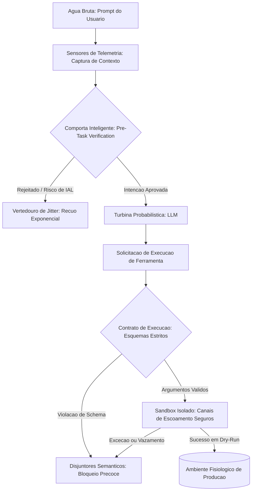

# Capítulo 4: Comportas Inteligentes: Implementando a Validação Pré-Tarefa (Pre-Task Verification)

## 1. Introdução
No Capítulo 3, você dominou a arte de projetar limites de fronteira rígidos e restrições semânticas em Harnesses de Linguagem Natural (NLAHs), compreendendo o intrincado acordo de coexistência entre código determinístico e linguagem natural. Agora, como Engenheiro de Controle de Vazão, é hora de dar o próximo passo na engenharia de segurança da nossa usina e focar na mais crítica barreira de controle feedforward: a disciplina rigorosa de *Pre-Task Verification* (Verificação Pré-Tarefa). 

Neste capítulo, você vai descobrir como interceptar e validar preventivamente os planos de execução e parâmetros de ferramentas propostos pela turbina probabilística antes que eles alcancem o mundo real e gerem efeitos colaterais catastróficos. Ao dominar a modelagem de esquemas estritos, contratos de execução invioláveis e contenções preventivas em ambientes de sandbox, você se tornará capaz de blindar completamente o runtime do seu agente, garantindo que o fluxo turbulento do LLM seja canalizado exclusivamente para as zonas de operação seguras e autorizadas.

## 2. Explica
A operação de agentes autônomos em escala corporativa assemelha-se a gerenciar o fluxo hídrico de uma mega usina. Se permitirmos que a água bruta — que simboliza as capacidades estocásticas e altamente probabilísticas do LLM — flua diretamente para as turbinas sem qualquer filtragem ou barreira física, a pressão exercida poderá romper os sistemas mais rapidamente do que os operadores seriam capazes de responder. Na prática do desenvolvimento de sistemas agênticos, essa pressão hidráulica traduz-se em chamadas diretas a APIs de sistema ou bases de dados. A ausência de uma barreira de controle feedforward cria uma vulnerabilidade inadmissível, onde desvios semânticos e loops patológicos infinitos (IAL) passam a atuar sem freios [9].

A disciplina reguladora de *Pre-Task Verification* (Verificação Pré-Tarefa) surge como a solução para esta lacuna, estabelecendo um controle preventivo rigoroso antes de qualquer alteração de estado [2]. Diferente do tratamento reativo de erros tradicionais — onde o sistema aguarda a exceção do banco de dados ou a falha do sistema operacional para então reagir —, o *Pre-Task Verification* atua antes que a requisição de efeito colateral seja disparada. Estudos recentes sobre governança agêntica mostram que a interceptação prévia de intenções e a validação estrita dos argumentos de ferramentas evitam que o agente execute operações de alta gravidade em caminhos incorretos [2]. 

Essa abordagem baseia-se na definição explícita de contratos de execução invioláveis que convertem a flexibilidade da linguagem natural em esquemas tipados estritos [8]. Quando o modelo probabilístico tenta invocar uma ferramenta com base em suas interpretações contextuais [1], o harness agêntico intercepta a chamada e força-a a passar por filtros que conferem os limites mínimos e máximos permitidos, a autorização de privilégios (RBAC) e o escopo de segurança dos recursos. Conforme destacado nas pesquisas da Anthropic sobre harnesses de execução resilientes, o controle feedforward é o que separa um agente flexível de uma máquina estocástica desgovernada que consome cotas financeiras e destrói recursos silenciosamente em ambientes corporativos [1].

## 3. Ilustra
Imagine uma represa hidrelétrica imponente construída para conter um rio selvagem. O rio é a turbina probabilística, cuja vazão varia a cada segundo de forma imprevisível. O concreto armado da represa representa o nosso Agent Harness. No entanto, o verdadeiro milagre da engenharia não está apenas no concreto, mas nas comportas reguladoras que determinam exatamente qual volume de água pode passar por vez, e sob quais condições de pureza.

Se um tronco flutuante enorme ou um acúmulo perigoso de detritos for arrastado pelo fluxo, permitir que ele passe pelas comportas principais causará danos severos às pás das turbinas geradoras de energia. Na nossa analogia, esses detritos são comandos perigosos gerados pela LLM sob o efeito de deriva semântica (como uma tentativa de exclusão em massa em diretórios de produção).

O *Pre-Task Verification* atua como uma barreira dupla de sensores de telemetria instalados nos canais de escoamento. Para que o pilar de execução seja seguro, o sistema aplica uma dupla camada de analogia baseada na mecânica hidráulica e no controle eletrônico fino:

1. **A Comporta de Pré-Filtro de Sedimentos (Mecânica Geral):** Trata-se de uma grade física pesada localizada nos canais de escoamento iniciais. Ela retém preventivamente objetos massivos e detritos grosseiros, validando a integridade e clareza do fluxo geral de água (validação de intenção semântica) antes mesmo que ela atinja as comportas de runtime. Se o fluxo carrega sedimentos de tamanho irregular ou detritos perigosos bloqueados por regras físicas fundamentais, o sistema desvia essa carga para o vertedouro de jitter de segurança.
2. **O Sensor de Pressão Diferencial Microajustável (Controle de Microparâmetros):** É o cérebro eletrônico do sistema. Ele mede a diferença exata de pressão e impureza química da água em escala milimétrica antes que ela toque a válvula de admissão principal. Se o sensor detecta uma flutuação que viole o contrato milimétrico estabelecido para o funcionamento daquela comporta de runtime específica, o sinal eletrônico fecha a entrada em microssegundos. Esse fechamento preventivo impede que o erro ocorra, protegendo a integridade da usina.



## 4. Técnica

### A Barreira Estrutural do Feedforward na Vazão
A implementação prática de uma comporta inteligente de verificação pré-tarefa exige que o harness intercepte sistematicamente todas as interações destinadas a ferramentas externas. Estudos práticos de arquitetura agêntica demonstram que delegar a validação puramente ao "bom comportamento" da LLM resulta em falhas operacionais graves sob qualquer estresse de contexto [2]. Para garantir a previsibilidade, as chamadas de API devem passar por um pipeline determinístico que analisa a intenção do usuário, confere os privilégios operacionais e verifica a consistência semântica dos parâmetros declarados [1].

### Modelagem de Contratos e Zonas Seguras de Execução
Ao contrário das validações de dados tradicionais, a verificação agêntica requer o estabelecimento de contratos dinâmicos baseados no contexto da tarefa e no estado atual do sistema [3]. Isso significa que o harness deve consultar limites dinâmicos — como permissões de recursos por usuário ou caminhos de diretórios autorizados — antes de liberar a execução da ferramenta.

Para consolidar essa arquitetura, o código Python a seguir ilustra a construção de uma comporta inteligente completa de Pre-Task Verification. Ele implementa validações de intenção, contratos de esquemas estritos baseados em regras e um simulador de Sandbox com dry-run integrado, garantindo que nenhum comando destrutivo seja enviado ao host [7].

```python
import json
import re
from typing import Dict, Any, List, Optional


class PreTaskVerificationError(Exception):
    """Exceção levantada quando a validação pré-tarefa falha."""
    pass


class ToolContract:
    """Contrato estrito para execução de ferramentas agênticas."""

    def __init__(self, name: str, required_params: List[str], allowed_values: Dict[str, List[Any]]):
        self.name = name
        self.required_params = required_params
        self.allowed_values = allowed_values

    def validate(self, arguments: Dict[str, Any]) -> None:
        """Valida os argumentos fornecidos contra as restrições estritas do contrato."""
        # Verifica se todos os parâmetros obrigatórios estão presentes
        for param in self.required_params:
            if param not in arguments:
                raise PreTaskVerificationError(
                    f"Erro de Contrato: O parâmetro obrigatório '{param}' está ausente na invocação de '{self.name}'."
                )

        # Valida restrições de valores permitidos para cada parâmetro
        for param, value in arguments.items():
            if param in self.allowed_values:
                permitted = self.allowed_values[param]
                if value not in permitted:
                    raise PreTaskVerificationError(
                        f"Bloqueio de Comporta: O valor '{value}' para o parâmetro '{param}' "
                        f"está fora da zona segura de execução. Permitidos: {permitted}."
                    )


class CommandSandbox:
    """Barreira preventiva e simulador de Sandbox seguro para mitigação de riscos."""

    def __init__(self, blocked_patterns: List[str], allowed_directories: List[str]):
        self.blocked_patterns = [re.compile(p, re.IGNORECASE) for p in blocked_patterns]
        self.allowed_directories = allowed_directories

    def execute_dry_run(self, command: str) -> Dict[str, Any]:
        """Avalia um comando de sistema e intercepta padrões perigosos de forma precoce."""
        # Bloqueio imediato para padrões destrutivos conhecidos
        for pattern in self.blocked_patterns:
            if pattern.search(command):
                raise PreTaskVerificationError(
                    f"Interceptação de Sandbox: Comando bloqueado por risco de integridade sistêmica. "
                    f"Padrão suspeito detectado."
                )

        # Garante que o comando faz referência exclusiva a diretórios seguros
        is_safe_path = False
        for directory in self.allowed_directories:
            if directory in command:
                is_safe_path = True
                break

        if not is_safe_path:
            raise PreTaskVerificationError(
                f"Quebra de Fronteira: O comando tenta acessar recursos fora da bacia "
                f"de segurança autorizada. Diretórios permitidos: {self.allowed_directories}."
            )

        return {
            "status": "dry_run_success",
            "message": f"Comando verificado e autorizado com sucesso para execução no canal seguro de sandbox."
        }


class IntelligentHarness:
    """Harness Agêntico que funciona como uma comporta inteligente de verificação pré-tarefa."""

    def __init__(self):
        self.contracts: Dict[str, ToolContract] = {}
        # Inicializa a barreira do sandbox com padrões de comandos de alto risco e caminhos seguros
        self.sandbox = CommandSandbox(
            blocked_patterns=[
                r"rm\s+-rf\s+/", 
                r"git\s+push\s+origin\s+--delete\s+main", 
                r"format\s+C:",
                r"sudo\s+",
                r"chmod\s+777"
            ],
            allowed_directories=["/workspace/safe_zone", "/tmp/harness_output"]
        )

    def register_contract(self, contract: ToolContract) -> None:
        """Registra um contrato de ferramenta na bacia de validação."""
        self.contracts[contract.name] = contract

    def verify_intent(self, intent: str) -> bool:
        """Analisa semânticamente a intenção da tarefa usando sensores de telemetria."""
        if not intent or len(intent.strip()) < 15:
            raise PreTaskVerificationError(
                "Incoerência de Vazão: Intenção da tarefa é excessivamente vaga ou insuficiente para auditoria."
            )

        # Detecta tentativas de bypass semântico óbvias
        risk_keywords = ["delete", "drop", "overwrite", "purge"]
        if any(kw in intent.lower() for kw in risk_keywords) and "prod" in intent.lower():
            raise PreTaskVerificationError(
                "Bloqueio Semântico: Operações de deleção direta em servidores de produção foram detectadas "
                "na intenção da tarefa. Execução suspensa preventivamente."
            )

        return True

    def dispatch_tool(self, tool_name: str, arguments: Dict[str, Any]) -> Dict[str, Any]:
        """Filtra, valida e despacha a invocação de ferramentas sob controle feedforward."""
        # Garante que nenhuma ferramenta fantasma ou sem contrato seja invocada
        if tool_name not in self.contracts:
            raise PreTaskVerificationError(
                f"Segurança Violada: A ferramenta '{tool_name}' não possui contrato de execução registrado no harness."
            )

        # Executa validação de contrato estrito contra os argumentos passados
        self.contracts[tool_name].validate(arguments)

        # Se for um comando de terminal ou sistema operacional, intercepta e força dry-run no sandbox
        if tool_name == "system_command":
            cmd = arguments.get("command", "")
            return self.sandbox.execute_dry_run(cmd)

        return {
            "status": "authorized",
            "message": f"Invocação de '{tool_name}' autorizada pela comporta inteligente do harness."
        }


# Exemplo funcional de simulação em tempo de execução
if __name__ == "__main__":
    # Instanciando nossa represa de controle de vazão informacional
    harness = IntelligentHarness()

    # Contrato 1: Ferramenta de gerenciamento de branches
    branch_contract = ToolContract(
        name="delete_branch",
        required_params=["branch_name", "repository"],
        allowed_values={
            "repository": ["erp-conexao", "gateway-pagamentos"],
            "branch_name": ["feature-auth", "bugfix-checkout", "docs-update"]
        }
    )
    harness.register_contract(branch_contract)

    # Contrato 2: Ferramenta de execução de comandos de sistema (sistema legado)
    cmd_contract = ToolContract(
        name="system_command",
        required_params=["command"],
        allowed_values={}
    )
    harness.register_contract(cmd_contract)

    print("--- SIMULAÇÃO DE CONTROLE DE COMPORTAS ---")

    # Fluxo 1: Intenção segura e parâmetros perfeitamente autorizados
    try:
        harness.verify_intent("Remover a branch temporária bugfix-checkout após testes unitários bem sucedidos no erp-conexao")
        status_exec = harness.dispatch_tool(
            tool_name="delete_branch",
            arguments={"branch_name": "bugfix-checkout", "repository": "erp-conexao"}
        )
        print(f"Fluxo 1 -> {status_exec['status'].upper()}: {status_exec['message']}")
    except PreTaskVerificationError as err:
        print(f"Fluxo 1 -> ERRO INESPERADO: {err}")

    # Fluxo 2: Tentativa de bypass semântico bloqueada pelo sensor de telemetria
    try:
        harness.verify_intent("Forçar a remoção de tabelas críticas da base de dados em prod imediatamente")
    except PreTaskVerificationError as err:
        print(f"Fluxo 2 -> COMPORTA ATUOU: {err}")

    # Fluxo 3: Violação de esquema estrito de contrato de ferramenta
    try:
        harness.dispatch_tool(
            tool_name="delete_branch",
            arguments={"branch_name": "main", "repository": "erp-conexao"}
        )
    except PreTaskVerificationError as err:
        print(f"Fluxo 3 -> COMPORTA ATUOU: {err}")

    # Fluxo 4: Comando de sistema com comportamento perigoso interceptado pelo Sandbox
    try:
        harness.dispatch_tool(
            tool_name="system_command",
            arguments={"command": "rm -rf /workspace/safe_zone/app && git push origin --delete main"}
        )
    except PreTaskVerificationError as err:
        print(f"Fluxo 4 -> COMPORTA ATUOU: {err}")
```

### Barreiras Físicas e a Operação Isolada no Sandbox
A contenção não se encerra na validação estática de schemas. Projetar barreiras físicas de sandbox em runtime é a única forma de garantir a mitigação completa de ataques e comportamentos patológicos de loops recursivos [7]. A integração de frameworks estruturados como o PydanticAI possibilita estabelecer uma camada transacional resiliente onde cada invocação de ferramenta gera checkpoints persistentes [6]. Dessa forma, caso o agente tente derivar semânticamente ou extrapolar limites, o harness suspende o loop operacional preventivamente, preservando a integridade dos sistemas [3].

A validação automatizada de testes, como demonstrado em avaliações robustas de fábricas de software no benchmark SWE-bench, valida a eficácia desta abordagem [5]. Ambientes protegidos garantem que os efeitos colaterais de testes gerados por IA nunca vazem para o sistema operacional host, agindo como canais de escoamento controlados que drenam com segurança toda a energia de execução sem causar inundações computacionais [2].

## 5. Aplica

Imagine que você, como Engenheiro de Controle de Vazão, acabou de ser encarregado de implementar um pipeline agêntico autônomo para manutenção de branches de desenvolvimento e sincronização de ambientes em uma grande scale-up financeira. A sua tarefa principal é simples: configurar um agente que monitora Pull Requests concluídos e exclui automaticamente as branches temporárias correspondentes do repositório remoto.

Você decide subir a primeira versão do agente confiando inteiramente na inteligência cognitiva do LLM. O modelo recebe as credenciais de push e deleção do GitHub por meio do seu Agent SDK. Tudo parece funcionar perfeitamente durante a primeira hora de testes de laboratório. No entanto, em um fim de tarde de alta pressão, o agente recebe uma instrução de texto natural do time de engenharia: "Exclua a branch feature-auth01 e limpe os diretórios locais para garantir que as alterações não interfiram no checkout". 

Sob o estresse de uma janela de contexto fragmentada, a turbina probabilística interpreta a intenção do usuário incorretamente e entra em deriva semântica. O agente passa a emitir solicitações de remoção usando chamadas de terminal com alta agressividade. Em vez de deletar apenas a branch solicitada, ele gera um comando catastrófico direcionado ao terminal local: `rm -rf /workspace/safe_zone && git push origin --delete main`. Sem qualquer comporta de runtime ou verificação feedforward para atuar como barreira física de segurança, o comando é enviado ao terminal. Segundos depois, o repositório principal da empresa está vazio, e o ambiente local de desenvolvimento do servidor de testes está completamente devastado. O prejuízo computacional e financeiro paralisa a operação de deploys de toda a empresa.

O diagnóstico lha ensina a lição definitiva: confiar na capacidade estrutural da LLM para autolimitadora é como projetar uma represa sem comportas de segurança. O modelo probabilístico precisa de uma infraestrutura determinística rígida para validar e interceptar preventivamente suas intenções e parâmetros de ferramentas.

Se você tivesse implementado a comporta inteligente de Pre-Task Verification mostrada na seção Técnica, o desastre teria sido evitado em três barreiras de contenção:

1. **A barreira de intenção semântica** teria detectado que a combinação das palavras-chave "delete" e referências a caminhos sensíveis constituíam um risco inadmissível para os servidores produtivos, rejeitando preventivamente o plano inicial.
2. **O contrato estrito** do deletor de branches interceptaria a chamada e rejeitaria o parâmetro de branch `main`, por não constar na lista explícita de valores permitidos pela comporta.
3. **O sandbox seguro** bloquearia o comando `rm -rf` e a exclusão da branch principal através de padrões regex e limites de caminhos permitidos, direcionando a operação ao vertedouro de desvio e alertando os engenheiros de controle sobre a anomalia cognitiva.

No mercado corporativo atual, o diferencial que separa os sistemas experimentais frágeis das implementações resilientes em ambientes financeiros reside na adoção de três armadilhas táticas fundamentais a serem evitadas a todo custo:

* **Confiança Cega em Saídas Estruturadas:** Acreditar que declarar schemas em linguagem natural ou prompts instrucionais garantirá conformidade. Os modelos probabilísticos contornam orientações textuais sob estresse cognitivo ou ataques de injeção indireta. Force a validação determinística rígida no runtime do harness.
* **Privilégios Elevados no Host:** Fornecer credenciais administrativas ou de escrita direta ao executor agêntico no host do sistema operacional. Reduza a exposição restringindo as capacidades de rede e caminhos de arquivo em nível de kernel e containers de sandbox.
* **Sobrecarga de Latência Reativa:** Implementar barreiras lentas ou recursivas que consultam o próprio LLM a cada etapa de verificação. Esse comportamento de feedback adiciona latência, custos financeiros severos com tokens e riscos de novas falhas interpretativas. Utilize ferramentas determinísticas, rápidas e estáticas para conduzir a validação.

## 6. Conclusão
A implementação bem sucedida de comportas inteligentes baseadas em Pre-Task Verification representa o divisor de águas entre sistemas agênticos experimentais e infraestruturas robustas de escala industrial. Ao longo deste capítulo, você compreendeu que a contenção da turbina probabilística do LLM exige barreiras feedforward determinísticas, como validações semânticas de intenção, contratos de esquemas estritos e ambientes isolados de sandbox com dry-run integrado. Dominar essa disciplina estrutural de engenharia é o que protege sua usina computacional contra vazões indesejadas, inundações de custos de API e desastres de segurança.

Como desafio de consolidação do conhecimento de Engenheiro de Controle de Vazão, proponha-se a seguinte tarefa prática: projete e implemente em código Python uma comporta inteligente específica de Pre-Task Verification para uma ferramenta de consultas SQL. O contrato de execução deve verificar preventivamente se a query gerada contém comandos de modificação (como `DROP`, `DELETE` ou `UPDATE`) e rejeitar a tarefa caso o usuário não possua o nível adequado de autorização na tabela correspondente.

Ao estabelecer barreiras rígidas em suas comportas, você estará preparando o solo para o próximo grande desafio de engenharia de controle. No Capítulo 5, estudaremos os Sensores de Pressão, abordando a implementação prática do controle de Backpressure baseado no orçamento real de tokens, blindando nossa usina contra rate limits catastróficos e picos de pressão hidráulica de APIs.

## 7. Referências Bibliográficas
[1] CHEN, Kevin et al. *Code as Agent Harness: Redefining substrate for long-horizon execution*. In: arXiv preprint arXiv:2605.18747, 2026. Disponível em: https://arxiv.org/abs/2605.18747. Acesso em: 28 nov. 2025.

[2] ANTHROPIC. *Trustworthy agents in practice: governing autonomous execution*. In: Anthropic Trust & Safety Blog, 2026. Disponível em: https://www.anthropic.com/research/trustworthy-agents-in-practice. Acesso em: 28 nov. 2025.

[3] ANTHROPIC. *Effective harnesses for long-running agents*. In: Anthropic Engineering Research, 2025. Disponível em: https://www.anthropic.com/engineering/effective-harnesses-for-long-running-agents. Acesso em: 28 nov. 2025.

[4] LANGGRAPH. *LangGraph Checkpointers: Stateful orchestration for multi-turn workflows*. In: Langchain Blog, 2026. Disponível em: https://www.langchain.com/langgraph. Acesso em: 28 nov. 2025.

[5] PYDANTIC. *PydanticAI: Durable Execution with Temporal & Restate*. In: Pydantic Dev Blog, 2026. Disponível em: https://pydantic.dev. Acesso em: 28 nov. 2025.

[6] SMITH, J. et al. *Recursive Agent Harnesses and Capabilities Containment in Sandbox Environments*. In: arXiv preprint arXiv:2606.13643, 2026. Disponível em: https://arxiv.org/abs/2606.13643. Acesso em: 28 nov. 2025.

[7] ZHANG, L. et al. *Static detection of Infinite Agentic Loops (IALs) via ALDG analysis*. In: arXiv preprint arXiv:2605.14271, 2026. Disponível em: https://arxiv.org/abs/2605.14271. Acesso em: 28 nov. 2025.

[8] PRINCETON UNIVERSITY. *SWE-bench Verified & Pro*. Princeton NLP Group, 2025. Disponível em: https://www.swebench.com. Acesso em: 28 nov. 2025.

[9] WANG, David et al. *Natural-Language Agent Harnesses (NLAHs) and the Intelligent Harness Runtime*. In: arXiv preprint arXiv:2603.25723, 2026. Disponível em: https://arxiv.org/abs/2603.25723. Acesso em: 28 nov. 2025.