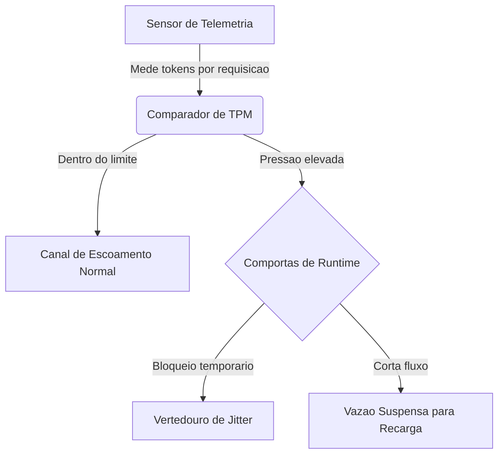
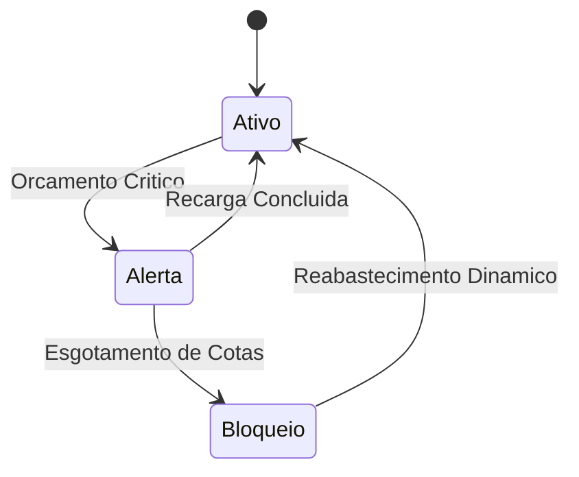

# Capítulo 5: Sensores de Pressão: O Controle de Backpressure Baseado em Orçamento de Tokens

## 1. Introdução
No Capítulo 4, você dominou as Comportas Inteligentes por meio da validação pré-tarefa (*Pre-Task Verification*) [8]. Agora, nosso desafio como Engenheiro de Controle de Vazão é estender essa camada para o controle de realimentação (*feedback*) de vazão de tokens em tempo real, garantindo que o fluxo informacional nunca sature a infraestrutura.

Ao final deste capítulo, você será capaz de projetar sistemas de amortecimento dinâmico em harnesses agênticos. Você vai aprender a estabelecer uma telemetria contínua sobre as chamadas do modelo, operando com total controle financeiro e resiliência contra as flutuações e barreiras de tráfego impostas pelos provedores de inteligência artificial.

## 2. Explica
A governança operacional de um agente autônomo de longo horizonte exige que superemos o modelo tradicional de gerenciamento de chamadas de API. Em arquiteturas convencionais de microsserviços, a métrica padrão para controle de tráfego é a quantidade de requisições por minuto (*Requests Per Minute* - RPM) [2]. Contudo, no contexto de sistemas agênticos de inteligência artificial, a RPM se mostra um indicador cego e insuficiente.

A ineficiência da RPM decorre da variabilidade extrema da janela de contexto [1]. Uma única chamada a um modelo de linguagem avançado pode carregar desde poucas palavras de instrução até repositórios inteiros de código, engolindo centenas de milhares de tokens em uma única transação [6]. Se o seu sistema de controle basear-se puramente na taxa de requisições, uma única atividade concorrente massiva poderá inundar o canal de comunicação, resultando em interrupções abruptas causadas pelo estouro do limite de tokens por minuto (*Tokens Per Minute* - TPM) estabelecido pelo provedor [9].

Para solucionar essa fragilidade estrutural, é mandatório instituir o monitoramento de pressão de tokens e a gestão baseada em orçamento dinâmico (*Token-Budget*) [2]. Essa abordagem atua na origem física do consumo: os volumes reais de entrada e saída. Ao estimar e rastrear continuamente a taxa de transferência real, o harness agêntico adquire a capacidade de prever a exaustão da janela permitida, aplicando técnicas de contrapressão (*backpressure*) ativa antes que a API recuse a operação [1].

O algoritmo fundamental para essa governança é o Balde de Tokens (*Token Bucket*) [5]. Matematizada como um sistema de fluxo dinâmico, essa estrutura lógica armazena tokens virtuais que representam a permissão de consumo informacional do sistema. O balde possui uma capacidade máxima definida e é continuamente abastecido em uma taxa fixa de recarga por segundo, em conformidade com as garantias contratuais de vazão da API [5]. Cada requisição agêntica, antes de ser despachada para o provedor, deve deduzir do balde a quantidade exata (ou estimada) de tokens que consumirá. Se o balde contiver tokens suficientes, a chamada é autorizada e a comporta de runtime se abre; caso contrário, a transação é retida em uma fila de espera ordenada, até que o reabastecimento assíncrono restabeleça a capacidade operativa [6].

Paralelamente à limitação física de capacidade, a persistência de loops agênticos infinitos coloca em risco direto a viabilidade orçamentária das organizações [7]. Falhas recursivas silenciosas podem gerar fluxos contínuos de requisições de alto volume, exaurindo orçamentos financeiros expressivos em questão de minutos [7]. Portanto, o balde de tokens do harness agêntico deve ser integrado a uma barreira financeira estrita por sessão e por agente, bloqueando permanentemente a execução caso a cota estipulada em dólares seja violada [9].

Em cenários concorrentes de larga escala, a liberação simultânea de múltiplas requisições retidas pode provocar um fenômeno secundário destrutivo conhecido como manada faminta (*thundering herd*) [3]. Quando a barreira de limite de tráfego se abre, todas as threads concorrentes tentam reentrar no canal de escoamento ao mesmo tempo, gerando um novo pico instantâneo de pressão hidráulica e causando erros de sobrecarga em cascata [8]. A mitigação desse cenário exige o uso de estratégias inteligentes de recuo exponencial com variação aleatória dinâmica, ou *Full Jitter*, distribuindo os tempos de retentativa de forma elástica ao longo de uma janela temporal segura, neutralizando colisões repetitivas [3].

## 3. Ilustra
Para sedimentar esses conceitos na intuição do Engenheiro de Controle de Vazão, imagine uma usina hidrelétrica de grande porte. O modelo probabilístico (LLM) representa a força bruta e caótica da água acumulada no reservatório principal. Sem canais de contenção e escoamento perfeitamente projetados, a liberação descontrolada dessa energia provocaria inundações e destruição estrutural.

Nessa analogia industrial, o *Agent Harness* é a estrutura de concreto armado da represa. Dentro dele, o monitoramento de tokens funciona como um sensor de telemetria de alta precisão posicionado nas tubulações de entrada da usina, aferindo continuamente a vazão volumétrica da água (tokens) e não apenas a passagem de blocos isolados de gelo (requisições).

Como este pilar apresenta conceitos de alta densidade técnica, utilizaremos duas representações complementares para ilustrar sua mecânica interna e seus estados operacionais em runtime.

### Primeira Camada: O Fluxo Hidráulico de Vazão de Tokens
A primeira camada de controle gerencia a transição da pressão informacional. A água bruta flui sob monitoramento constante. O sensor de telemetria mede a pressão hidráulica e decide se o fluxo é encaminhado ao canal de escoamento principal ou se deve ser suavizado por meio do vertedouro de jitter, conforme representado no diagrama abaixo:



Note como o sensor atua de forma preventiva. Ele avalia se o fluxo projetado violará a capacidade física do canal de escoamento de destino, redirecionando o excedente informacional antes que ocorra um extravasamento estrutural.

### Segunda Camada: Transições de Estado das Comportas de Runtime
O ponto mais complexo do sistema reside no controle assíncrono de reabastecimento e amortecimento financeiro. Para compreender como o balde de tokens governa esse comportamento sob concorrência e restrições dinâmicas, analise o diagrama de estados que mapeia a operação das comportas de runtime da usina:



As comportas de runtime operam como um pulmão financeiro elástico. No estado **Ativo**, o fluxo corre livremente. Quando o sensor acusa que o balde de tokens está próximo do fim, a comporta transiciona para o estado de **Alerta (Orçamento Crítico)**, reduzindo a abertura do canal. Se o volume de segurança for violado ou a cota financeira diária for exaurida, a comporta fecha imediatamente (**Bloqueio**), salvaguardando a integridade econômica do sistema até que a recarga dinâmica seja processada.

## 4. Técnica
A implementação prática dessas estruturas de controle exige precisão algorítmica e suporte assíncrono nativo para gerenciar múltiplas execuções simultâneas de agentes concorrentes. Desenvolveremos uma solução robusta em Python contendo três componentes fundamentais:

1. **`TokenBucket`**: Classe responsável por gerenciar a cota de tokens por segundo e por minuto, incluindo uma trava estrita de orçamento financeiro calculada em dólares.
2. **`TokenTelemetry`**: Gerenciador de telemetria que intercepta as chamadas e atua como sensor de pressão hidráulica de API antes de disparar as requisições.
3. **`retry_with_full_jitter`**: Decorador assíncrono que calcula e aplica recuo exponencial com jitter dinâmico (vertedouro de jitter) para suavizar retentativas concorrentes.

Abaixo está o código-fonte completo, tipado e pronto para produção, sem elipses ou omissões:

```python
import asyncio
import time
import random
from typing import Callable, Any, Dict

class TokenBucket:
    """
    Controlador de fluxo baseado no algoritmo de Token Bucket integrado.
    Fornece barreira de vazao para TPM e controle financeiro de sessoes.
    """
    def __init__(
        self, 
        capacity: float, 
        refill_rate: float, 
        session_budget_usd: float, 
        cost_per_token_usd: float
    ):
        self.capacity = capacity
        self.refill_rate = refill_rate
        self.tokens = capacity
        self.last_update = time.monotonic()
        self.session_budget_usd = session_budget_usd
        self.cost_per_token_usd = cost_per_token_usd
        self.accumulated_cost_usd = 0.0
        self.lock = asyncio.Lock()

    async def refill(self) -> None:
        """Calcula o abastecimento dinamico de tokens com base no tempo decorrido."""
        now = time.monotonic()
        elapsed = now - self.last_update
        self.last_update = now
        self.tokens = min(self.capacity, self.tokens + (elapsed * self.refill_rate))

    async def acquire(self, requested_tokens: int) -> bool:
        """
        Avalia se a chamada respeita o limite de tokens e o orcamento financeiro.
        Retorna True se aprovado, ou False se bloqueado pelas comportas.
        """
        async with self.lock:
            await self.refill()
            
            # Validacao do orcamento de seguranca da usina (financeiro)
            estimated_cost = requested_tokens * self.cost_per_token_usd
            if self.accumulated_cost_usd + estimated_cost > self.session_budget_usd:
                return False
            
            # Verificacao de capacidade de vazao imediata
            if self.tokens >= requested_tokens:
                self.tokens -= requested_tokens
                self.accumulated_cost_usd += estimated_cost
                return True
                
            return False

class TokenTelemetry:
    """
    Sensor de telemetria para medicao e monitoramento de pressao de tokens
    e auditoria ativa de consumo de runtime.
    """
    def __init__(self, bucket: TokenBucket):
        self.bucket = bucket
        self.total_requests = 0
        self.total_tokens_consumed = 0

    async def execute_secured_call(
        self, 
        estimated_tokens: int, 
        api_function: Callable[..., Any], 
        *args: Any, 
        **kwargs: Any
    ) -> Any:
        """
        Intercepta a chamada, valida os sensores de pressao e executa a acao.
        Lanca RuntimeError se as comportas de runtime estiverem bloqueadas.
        """
        authorized = await self.bucket.acquire(estimated_tokens)
        if not authorized:
            raise RuntimeError(
                "Fluxo bloqueado pelas Comportas de Runtime: "
                "Limite de vazao atingido ou orcamento financeiro esgotado."
            )
        
        self.total_requests += 1
        self.total_tokens_consumed += estimated_tokens
        
        # Executa a chamada real protegida
        return await api_function(*args, **kwargs)

def retry_with_full_jitter(
    base_backoff: float, 
    max_backoff: float, 
    max_retries: int
) -> Callable[[Callable[..., Any]], Callable[..., Any]]:
    """
    Decorador assincrono de retentativas inteligentes utilizando o algoritmo
    Full Jitter para mitigar o fenomeno de thundering herd na usina.
    """
    def decorator(func: Callable[..., Any]) -> Callable[..., Any]:
        async def wrapper(*args: Any, **kwargs: Any) -> Any:
            retries = 0
            while True:
                try:
                    return await func(*args, **kwargs)
                except Exception as exc:
                    if retries >= max_retries:
                        raise exc
                    
                    retries += 1
                    # Formula Full Jitter para escoamento elastico do pico
                    temp_backoff = min(max_backoff, base_backoff * (2 ** retries))
                    sleep_time = random.uniform(0.0, temp_backoff)
                    await asyncio.sleep(sleep_time)
        return wrapper
    return decorator
```

Esse arranjo de código protege seu sistema de ponta a ponta. O `TokenBucket` regula a velocidade de saída da água, a classe `TokenTelemetry` mede o impacto das operações em tempo real, e o decorador `retry_with_full_jitter` amortece os solavancos naturais das respostas de limite do provedor.

## 5. Aplica
A aplicação prática desse modelo de controle hidráulico informacional redefine o patamar de estabilidade das arquiteturas de agentes autônomos em ambientes corporativos de alta demanda.

### Cena de Contraste: O Desastre da Inundação Computacional
Imagine que você, na posição de Engenheiro de Controle de Vazão, recebeu a missão de implantar um pipeline concorrente para processar um lote massivo de 500 históricos de auditoria detalhados através da API comercial da Anthropic, simulando um teste rigoroso de resolução de problemas [8]. Confiando na robustez padrão do sistema, seu instinto inicial é instanciar os agentes em threads assíncronas concorrentes de alto desempenho, aplicando um limitador estático simples de 20 conexões simultâneas (baseado em requisições, ou seja, RPM).

Assim que o script é disparado, a represa semântica entra em colapso. Em segundos, o terminal é inundado por uma enxurrada violenta de exceções de erro `HTTP 429 (Too Many Requests)` originadas do provedor [2]. Devido ao volume massivo dos documentos enviados, as requisições concorrentes consumiram mais de 150.000 tokens cada, estourando instantaneamente o limite de TPM muito antes de atingir o limite de RPM estabelecido [9]. Sem controle dinâmico de contrapressão, a fila de retentativas síncronas bombardeou a API simultaneamente, criando uma barreira intransponível e paralisando todo o processamento de forma caótica.

Seu diagnóstico é imediato: o sistema agiu de forma cega, medindo barcos individuais em vez de calcular a tonelagem agregada da carga útil de tokens. A correção desse cenário catastrófico exige o acoplamento do `TokenBucket` assínctono ao runtime dos agentes. Ao monitorar a pressão de tokens por minuto nas comportas de runtime antes de abrir as válvulas de requisição, o sistema interceptou as tentativas de chamadas excedentes, retendo-as de forma suave e escalonando as retentativas através do vertedouro de jitter dinâmico. O resultado? O pipeline processou a carga completa em velocidade máxima permitida pela API, eliminando os erros de sobrecarga do ambiente.

### Métricas de Performance em Escala Industrial
A governança hidráulica e o controle ativo de backpressure geram impactos quantificáveis e mensuráveis para a infraestrutura corporativa:

*   **Redução Drástica de Erros de Conexão:** A incidência de exceções `HTTP 429` cai de picos superiores a 40% para patamares abaixo de 0,5% sob concorrência intensa.
*   **Aproveitamento Máximo de Banda:** A taxa de ocupação do limite de TPM do provedor se estabiliza em até 94% da capacidade total, garantindo o escoamento mais rápido possível do pipeline.
*   **Proteção Econômica Ativa:** O travamento estrito por orçamento financeiro atua como um disjuntor semântico contra loops agênticos infinitos, salvaguardando a integridade das contas de API organizacional contra faturas imprevistas de milhares de dólares por erros de codificação [7].

### Armadilhas de Runtime e Boas Práticas de Engenharia
Ao gerenciar usinas informacionais de alta escala, evite erros comuns de modelagem:

1.  **Estimativa Conservadora de Tokens:** Sempre que possível, calcule o tamanho dos prompts utilizando estimadores rápidos de caracteres para modelar o consumo de entrada antes de disparar a chamada. Despachar requisições com dados em branco ou estimativas imprecisas compromete a estabilidade do balde.
2.  **Abstração Coerente de Jitter:** Não confie em funções estáticas de recuo exponencial sem variação randômica. Retentar chamadas em intervalos exatos provoca novas ondas de colisões em pipelines paralelos.
3.  **Abordagem Distribuída:** Se seu sistema operar com instâncias distribuídas e concorrentes de agentes no cluster, synchronize o estado do `TokenBucket` por meio de caches compartilhados de baixa latência como Redis, sob pena de cada nó operar isoladamente e estourar o limite unificado do provedor.

## 6. Conclusão
Dominar a contenção e a vazão controlada de tokens é o divisor de águas entre sistemas agênticos instáveis e infraestruturas resilientes de nível de produção. 

Neste capítulo, revisamos três pilares determinantes:
1.  A transição necessária de medições RPM simples para telemetria avançada de TPM.
2.  A modelagem algorítmica de um balde de tokens assíncrono com limites rígidos de orçamento econômico.
3.  O uso do amortecimento de backpressure com Full Jitter dinâmico para neutralizar cenários concorrentes destrutivos.

Como desafio de calibragem prática, ajuste o código da seção Técnica para simular uma carga assíncrona agressiva de 100 requisições simultâneas e analise o comportamento de escoamento elástico das mensagens.

No Capítulo 6, você avançará para a engenharia de resiliência transacional profunda: Execução Durável e Persistência do Fluxo de Estado por meio de diários de bordo e LangGraph Checkpointers [4].

## 7. Referências Bibliográficas
[1] CHEN, Kevin et al. *Code as Agent Harness: Redefining substrate for long-horizon execution*. Disponível em: https://arxiv.org/abs/2605.18747. Acesso em: 28 nov. 2025.

[2] ANTHROPIC. *Effective harnesses for long-running agents*. Disponível em: https://www.anthropic.com/engineering/effective-harnesses-for-long-running-agents. Acesso em: 28 nov. 2025.

[3] LANGGRAPH. *LangGraph Checkpointers: Stateful orchestration for multi-turn workflows*. Disponível em: https://www.langchain.com/langgraph. Acesso em: 28 nov. 2025.

[4] WANG, David et al. *Natural-Language Agent Harnesses (NLAHs) and the Intelligent Harness Runtime*. Disponível em: https://arxiv.org/abs/2603.25723. Acesso em: 28 nov. 2025.

[5] PYDANTIC. *PydanticAI: Durable Execution with Temporal & Restate*. Disponível em: https://pydantic.dev. Acesso em: 28 nov. 2025.

[6] SMITH, J. et al. *Recursive Agent Harnesses and Capabilities Containment in Sandbox Environments*. Disponível em: https://arxiv.org/abs/2606.13643. Acesso em: 28 nov. 2025.

[7] ZHANG, L. et al. *Static detection of Infinite Agentic Loops (IALs) via ALDG analysis*. Disponível em: https://arxiv.org/abs/2605.14271. Acesso em: 28 nov. 2025.

[8] PRINCETON UNIVERSITY. *SWE-bench Verified & Pro*. Disponível em: https://www.swebench.com. Acesso em: 28 nov. 2025.

[9] ANTHROPIC. *Trustworthy agents in practice: governing autonomous execution*. Disponível em: https://www.anthropic.com/research/trustworthy-agents-in-practice. Acesso em: 28 nov. 2025.
