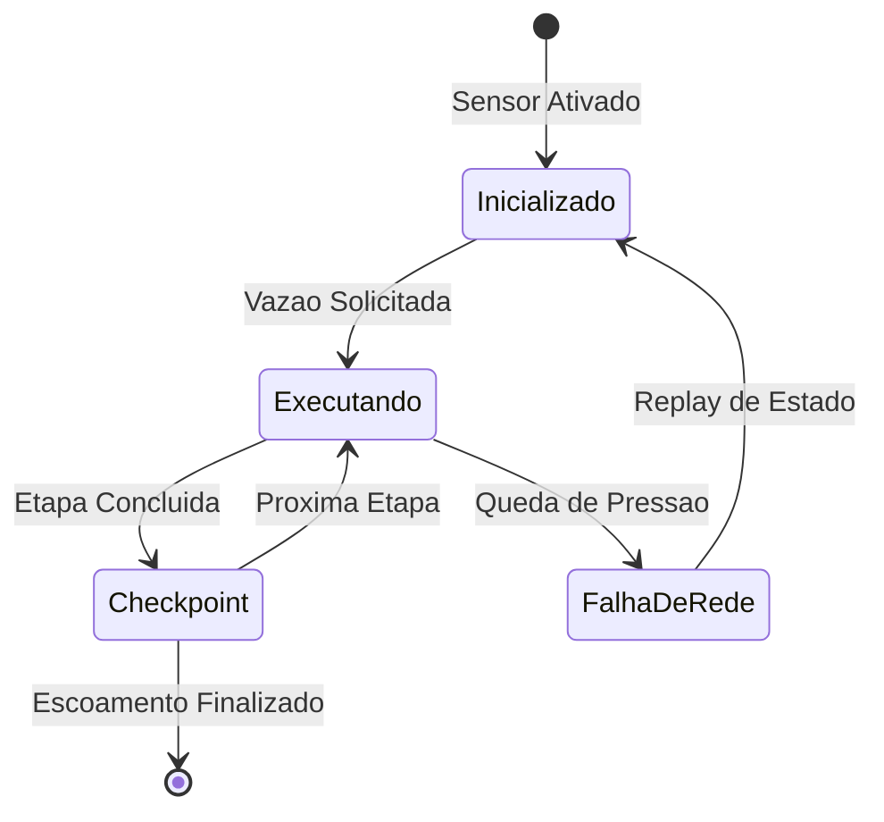
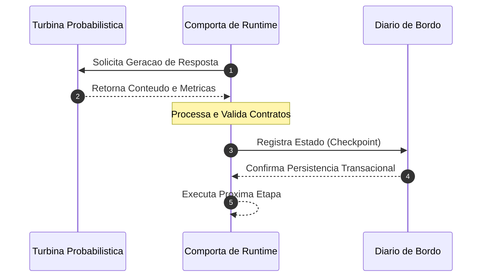
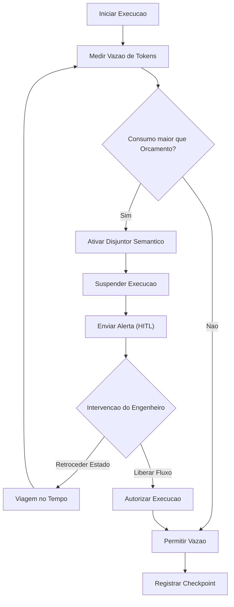

# Capítulo 6: O Diário de Bordo da Usina: Execução Durável e Persistência do Fluxo de Estado

## 1. Introdução
No Capítulo 5, você dominou o controle de backpressure baseado em orçamentos de tokens, aprendendo a calibrar milimetricamente a pressão hidráulica das APIs para evitar gargalos em produção. Agora, é hora de canalizar essa mesma precisão para a bacia da persistência, garantindo que o fluxo do estado agêntico não se perca em meio às turbulências e quedas de energia da infraestrutura física. De nada adianta erguer comportas inteligentes se cada falha de rede limpa o diário de bordo e obriga a represa a processar novamente cada gota d'água, gerando vazamento financeiro catastrófico de tokens e perda irreversível de contexto histórico.

Como Engenheiro de Controle de Vazão, você aprenderá que a execução de um agente de longa duração jamais deve repousar na memória volátil do processo de computação. Ao dominar a persistência transacional e o journaling de eventos, você estabelecerá barreiras físicas rígidas que blindam o progresso agêntico contra reinicializações e falhas operacionais abruptas. Este capítulo desmistifica o conceito de execução durável (Durable Execution) e fornece a fundação técnica exata para implementar checkpoints transacionais resilientes utilizando LangGraph Checkpointers, elevando o controle operacional da sua usina agêntica ao patamar de segurança industrial.

## 2. Explica
Para compreender a necessidade de persistência física em arquiteturas agênticas de longo horizonte, é fundamental analisar a causa raiz das perdas de estado operacionais. Em sistemas tradicionais sem estado (*stateless*), a computação é episódica: uma requisição entra, o servidor a processa e a resposta é devolvida sem que o container precise recordar as interações anteriores. No entanto, quando posicionamos agentes cognitivos baseados em LLMs para resolver tarefas de alto horizonte temporal, as restrições mudam drasticamente. Estudos avançados sobre arquiteturas duráveis indicam que a execução de agentes de longa execução não pode depender da sobrevida de um único processo ou container em memória [3].

O padrão de Execução Durável (*Durable Execution*) resolve esse impasse ao garantir que o estado lógico completo do runtime — incluindo variáveis de controle, histórico de chats e decisões tomadas — seja preservado de forma transacional em barreiras físicas estáveis a cada super-etapa de computação [8]. Isso assegura que, inicie uma falha de hardware ou indisponibilidade temporária de APIs, a usina de execução seja capaz de restaurar o processo exatamente do ponto onde foi interrompido, mitigando desvios semânticos e duplicações caras de tokens [1]. 

Note que a consistência a longo prazo exige garantias estritas de transacionalidade, onde os checkpoints lógicos do agente são registrados de forma indissociável de suas ações externas [5]. Sem barreiras de transacionalidade, o sistema corre o risco de reexecutar ferramentas cujos efeitos colaterais já foram consolidados no mundo físico (como envios de e-mails duplicados ou transações financeiras repetidas), o que compromete gravemente a integridade operacional e regulatória do sistema [2]. O journaling de eventos detalhado surge, então, como um instrumento de segurança indispensável, registrando a entrada e saída de cada chamada cognitiva de forma determinística [7].

## 3. Ilustra
Para ancorar esses conceitos na intuição operacional, imagine o funcionamento de uma imensa Usina Hidrelétrica e suas Comportas de Segurança. A água bruta que desce pela encosta representa a energia cognitiva probabilística do LLM. As Comportas de Runtime, as vedações de concreto e os canais de escoamento representam o Harness agêntico determinístico projetado para domesticar e direcionar essa imensa força informacional.

### A Analogia do Diário de Bordo e do Log Transacional
Imagine que o operador da usina — o Engenheiro de Controle de Vazão — precisa abrir e fechar sequencialmente uma série de comportas para regular a vazão de água que atinge a Turbina Probabilística. Se ocorrer uma pane elétrica total no painel de comando digital, o operador não pode simplesmente "chutar" quais comportas estavam abertas ou reinicializar o fluxo do zero, correndo o risco de causar uma inundação destrutiva a jusante. Ele precisa de um Diário de Bordo físico indestrutível, escrito a carvão e imune à umidade, onde cada movimento de válvula e cada leitura de Sensor de Telemetria são registrados transacionalmente *antes* que a próxima comporta seja acionada. O Diário de Bordo garante que, quando a energia for restaurada, o operador possa ler o log físico e saber exatamente em qual posição cada comporta deve ser travada para retomar a geração de energia de forma contínua e segura.

### A Dupla Camada: O Mecanismo de Replay e a Reconstrução Segura
Quando lidamos com cenários agênticos complexos, a persistência de estado envolve um ponto crítico altamente contraintuitivo: o mecanismo de *Replay* de logs de eventos. Se a turbina probabilística falha no meio de um loop de raciocínio, reinicializar o agente de maneira cega forçaria novas chamadas à API, desperdiçando milhares de tokens em perguntas que o modelo já havia respondido.

A analogia se aprofunda aqui: imagine que o operador, ao retomar o controle da usina pós-apagão, decide reabrir as comportas do zero para garantir que tudo passe pelas turbinas novamente. O desperdício de água (tokens) seria monumental, drenando a represa financeira da usina. Em vez disso, a usina moderna implementa uma reconstrução segura: o sistema simula internamente a passagem da água lendo as anotações do Diário de Bordo. As comportas físicas de runtime assumem suas posições passo a passo com base nos registros históricos do log de eventos lógicos, sem precisar liberar uma única gota de água bruta da represa (ou seja, sem chamar o LLM novamente) até que o ponto de falha exato seja alcançado. Somente a partir desse momento a bacia de escoamento é reaberta para o fluxo em tempo real.







## 4. Técnica
A transição da abstração teórica para o concreto armado exige frameworks e bibliotecas robustas projetadas sob a ótica da persistência distribuída de grafos. Vamos analisar a arquitetura de journaling de eventos e sua implementação física.

### Análise Arquitetural de Replay de Logs de Execução
Plataformas de Execução Durável de mercado, como Temporal ou Restate, operam interceptando todas as chamadas de sistema, temporizadores e interações com IAs [6]. Elas geram um diário de bordo lógico imutável onde cada atividade externa é armazenada de forma estrita. Quando ocorre um reinício de container, o runtime do Temporal ou Restate não executa novamente as chamadas à API do LLM que já estão registradas no log; ele simplesmente intercepta os métodos e retorna imediatamente as respostas históricas salvas, reconstruindo o estado em memória através de replay determinístico [6].

### Journaling de Eventos com LangGraph Checkpointers
No ecossistema LangChain/LangGraph, a persistência transacional de um fluxo de controle baseado em grafos (StateGraph) é automatizada por checkpointers de thread [4]. A cada super-etapa concluída no grafo (um nó executado e suas arestas resolvidas), o checkpointer intercepta os dados do estado atual (State) e as mensagens históricas de chat (chat_history) e realiza uma operação de escrita atômica em bancos de dados transacionais, como SQLite ou PostgreSQL [4]. Isso garante que, se o processo for finalizado abruptamente durante o nó "A", o grafo subirá de volta sabendo que "A" foi concluído e iniciará diretamente no nó "B".

O exemplo prático de código Python abaixo ilustra a construção de um StateGraph de controle de vazão de tokens com persistência transacional em banco SQLite e simulação de recuperação de falhas operacionais:

```python
from typing import Annotated, TypedDict
from langgraph.graph import StateGraph, START, END
from langgraph.checkpoint.sqlite import SqliteSaver
import sqlite3

# Definindo o estado do agente (State) que monitora a vazao
class UsinaState(TypedDict):
    chat_history: list[dict]
    token_vazao_acumulada: int
    comporta_status: str

def turbina_probabilistica(state: UsinaState) -> dict:
    # Simula o processamento cognitivo do LLM de controle de vazao
    vazao_atual = 1500
    novo_status = "ABERTA" if state["token_vazao_acumulada"] < 5000 else "FECHADA"
    return {
        "chat_history": state["chat_history"] + [{"role": "assistant", "content": "Fluxo controlado e sensors calibrados."}],
        "token_vazao_acumulada": state["token_vazao_acumulada"] + vazao_atual,
        "comporta_status": novo_status
    }

# Construindo o StateGraph estruturado da usina
builder = StateGraph(UsinaState)
builder.add_node("turbina", turbina_probabilistica)
builder.add_edge(START, "turbina")
builder.add_edge("turbina", END)

# Inicializando a bacia de persistencia transacional SQLite
conn = sqlite3.connect(":memory:", check_same_thread=False)
memory = SqliteSaver(conn)

# Compilando o grafo com o checkpointer para garantir execucao duravel
app = builder.compile(checkpointer=memory)

# Definindo o canal de escoamento unico por Thread ID
config = {"configurable": {"thread_id": "comporta_vazao_thread_1"}}
estado_inicial = {
    "chat_history": [{"role": "user", "content": "Iniciar escoamento controlado."}], 
    "token_vazao_acumulada": 0, 
    "comporta_status": "FECHADA"
}

# Executando o primeiro ciclo de geracao (vazao inicial)
app.invoke(estado_inicial, config)
```

### Viagem no Tempo (Time Travel) e Atualização Manual de Estado
Ao armazenar checkpoints detalhados a cada super-etapa, os checkpointers do LangGraph fornecem uma das ferramentas mais poderosas para o controle operacional de processos agênticos complexos: a Viagem no Tempo (*Time Travel*) [4]. Consultando o histórico completo de estados associados a uma thread de execução através do método `app.get_state_history(config)`, o operador consegue retroceder o agente a qualquer checkpoint anterior estável [4].

Mais do que apenas observar o passado, é possível interceptar o estado corrompido, injetar alterações corretivas usando `app.update_state` e forçar o agente a retomar a execução a partir do ponto corrigido, bifurcando o caminho temporal. Veja como realizar essa operação no fluxo operacional:

```python
# Demonstrando a Viagem no Tempo e correcao manual de rumo
# 1. Recupera o historico de estados da thread de escoamento
historico = list(app.get_state_history(config))

# 2. Obtem o checkpoint anterior ao desvio semantico detectado
checkpoint_anterior = historico[0]
checkpoint_id = checkpoint_anterior.config["configurable"]["checkpoint_id"]

# 3. Intercepta e corrige manualmente o estado para evitar loops
app.update_state(
    config, 
    {"token_vazao_acumulada": 3500, "comporta_status": "ALERTA_MANUAL"}, 
    as_node="turbina"
)

# 4. Retoma a execucao a partir do ponto atualizado com novos parametros
estado_atualizado = app.get_state(config)
```

## 5. Aplica
Para compreender o impacto real dessa arquitetura, acompanhe o caso de uso na Usina de Crédito do Banco GlobalSettle.

### Cena de Contraste: O Transbordo Volátil vs. O Escoamento Seguro
Você está monitorando uma bacia de análise automatizada de propostas de crédito no Banco GlobalSettle. Essa bacia consome dados de centenas de fontes, rodando sob a supervisão de um agente agêntico de longa execução orquestrado no Kubernetes. O fluxo está em plena capacidade de processamento, analisando uma carteira massiva. De repente, ocorre um timeout de rede na API de um birô de crédito externo, gerando um erro não tratado que derruba o contêiner Docker do agente de forma instantânea. 

No cenário volátil, o agente mantinha todo o progresso de chat e as avaliações intermediárias dos clientes armazenados exclusivamente na memória RAM da thread do processo de computação. Ao subir um novo contêiner para substituir o que falhou, o agente reinicia a análise do zero. Ele reexecuta as mesmas chamadas de LLM para os mesmos clientes que já haviam sido processados com sucesso. O resultado é assustador: estouro imediato do orçamento de tokens, travamento de taxa da API por requisições concorrentes duplicadas, chat_history corrompido e uma conta financeira catastrófica por processamento redundante inútil.

No cenário de persistência transacional que você domina, as barreiras físicas são rústicas e impenetráveis. A cada resposta consolidada e a cada chamada de ferramenta resolvida pelo agente, as Comportas de Runtime gravam um checkpoint persistente e transacional com um SQLite saver em uma bacia SQLite dedicada no volume de armazenamento. Quando o contêiner Kubernetes cai e um novo sobe em seu lugar, ele lê o thread_id da proposta em andamento. Em milissegundos, as comportas consultam o log persistente e identificam que 8 das 10 etapas lógicas já haviam sido consolidadas. O replay interno reconstrói o estado lógico sem chamar o LLM e retoma a computação a partir da etapa 9 de forma silenciosa e precisa. Nenhuma chamada de API é duplicada, o orçamento de tokens permanece intacto e o cliente recebe a resposta da sua análise em tempo recorde, sem soluços operacionais.

### Principais Armadilhas e Como Evitá-las
- **Armadilha do State Volátil:** Utilizar checkpointers em memória (`MemorySaver`) em ambientes de produção de alta escala. O container do Kubernetes pode ser reciclado a qualquer momento, limpando todo o progresso dos agentes de longa duração de forma silenciosa.
  *Como evitar:* Substitua checkpointers voláteis por implementações baseadas em banco de dados físicos robustos como PostgreSQL (`PostgresSaver`) ou volumes de disco SQLite atômicos na infraestrutura corporativa.
- **Armadilha da Reexecução Involuntária de Ferramentas:** Falha ao isolar e controlar a idempotência de ferramentas com efeitos colaterais físicos (gravações em bancos corporativos, envios de e-mails, transações financeiras).
  *Como evitar:* Desenvolva chaves de idempotência atreladas ao ID do checkpoint da super-etapa. Se a computação for reexecutada por replay, a ferramenta física bloqueia requisições duplicadas.

## 6. Conclusão
Ao dominar a persistência transacional, você compreendeu que a resiliência de um agente de longo horizonte não reside na durabilidade milagrosa da rede de infraestrutura, mas sim na robustez de sua camada de governança do estado. A execução durável (Durable Execution) e o journaling atômico com checkpointers são as estruturas de concreto armado que transformam o fluxo caótico probabilístico dos LLMs em canais previsíveis de entrega industrial de valor [3]. O diário de bordo transacional e as estratégias de Viagem no Tempo (*Time Travel*) separam os protótipos acadêmicos frágeis dos sistemas agênticos maduros que operam com segurança sob pressões extremas de produção corporativa [1].

**Desafio Operacional do Engenheiro de Controle de Vazão:**
Como exercício de fixação de competências de engenharia, implemente o script demonstrado de StateGraph do LangGraph substituindo a conexão SQLite por um banco de dados PostgreSQL persistente (`PostgresSaver`). Simule uma queda abrupta de processo (forçando uma exceção `SystemExit`) na metade do fluxo do agente e escreva um teste automatizado para validar que a thread de escoamento retoma a computação a partir do exato nó interrompido, preservando o histórico de chat e a vazão acumulada de tokens intactos.

No Capítulo 7, avançaremos na escala operacional da Usina ao estudar a **Divisão do Trabalho na Usina: A Arquitetura de Dois Agentes (Split-Agent)**, dividindo responsabilidades entre planejadores e executores focados para mitigar as perdas cognitivas e otimizar as janelas de contexto.

## 7. Referências Bibliográficas
[1] ANTHROPIC. *Effective harnesses for long-running agents*. In: Anthropic Engineering Research, 2025. Disponível em: https://www.anthropic.com/engineering/effective-harnesses-for-long-running-agents. Acesso em: 28 nov. 2025.

[2] ANTHROPIC. *Trustworthy agents in practice: governing autonomous execution*. In: Anthropic Trust & Safety Blog, 2026. Disponível em: https://www.anthropic.com/research/trustworthy-agents-in-practice. Acesso em: 28 nov. 2025.

[3] CHEN, Kevin et al. *Code as Agent Harness: Redefining substrate for long-horizon execution*. In: arXiv preprint arXiv:2605.18747, 2026. Disponível em: https://arxiv.org/abs/2605.18747. Acesso em: 28 nov. 2025.

[4] LANGGRAPH. *LangGraph Checkpointers: Stateful orchestration for multi-turn workflows*. Disponível em: https://www.langchain.com/langgraph. Acesso em: 28 nov. 2025.

[5] PRINCETON UNIVERSITY. *SWE-bench Verified & Pro*. Disponível em: https://www.swebench.com. Acesso em: 28 nov. 2025.

[6] PYDANTIC. *PydanticAI: Durable Execution with Temporal & Restate*. Disponível em: https://arxiv.org/abs/2603.25723. Acesso em: 28 nov. 2025.

[7] SMITH, J. et al. *Recursive Agent Harnesses and Capabilities Containment in Sandbox Environments*. In: arXiv preprint arXiv:2606.13643, 2026. Disponível em: https://arxiv.org/abs/2606.13643. Acesso em: 28 nov. 2025.

[8] WANG, David et al. *Durable Execution and State Integrity in Agentic Workflows*. In: arXiv preprint arXiv:2605.14271, 2026. Disponível em: https://arxiv.org/abs/2605.14271. Acesso em: 28 nov. 2025.
