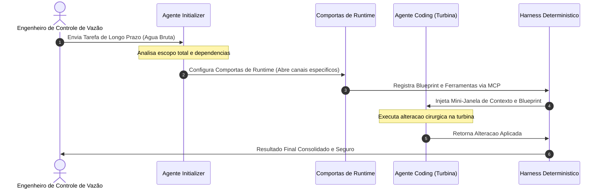

# Capítulo 7: Divisão do Trabalho na Usina: A Arquitetura de Dois Agentes (Split-Agent)

## 1. Introdução
No Capítulo 6, você dominou os conceitos de Durable Execution e a garantia de consistência de estado, estruturando a resiliência transacional necessária para que falhas físicas não destruam o progresso de tarefas longas. Agora, como Engenheiro de Controle de Vazão, é hora de aplicar essa mesma lente de estabilidade e engenharia de precisão para projetar a divisão de tarefas em cenários de longo prazo. Ao enfrentar problemas complexos de software, tentar resolvê-los com uma única mente probabilística monolítica equivale a liberar toda a força de uma represa em uma única válvula: o sistema satura, os detalhes se perdem e o colapso cognitivo é inevitável. 

A arquitetura de separação de deveres baseada em dois agentes—o padrão Split-Agent—é o divisor de águas que separa sistemas de automação frágeis de soluções industriais robustas [2]. Neste capítulo, você aprenderá a configurar a divisão estratégica de trabalho entre um agente planejador (Initializer) e um executor cirúrgico (Coding) [1]. Essa técnica blinda seu sistema contra o desperdício de tokens, reduz drasticamente o tamanho das janelas de contexto ativas e garante um nível sem precedentes de controle e rastreabilidade sobre a geração de código dinâmico.

## 2. Explica
Para compreender por que sistemas de agente único falham em tarefas de longo horizonte de execução, é preciso analisar a física da janela de contexto e o fenômeno de compressão semântica. Quando um agente autônomo executa um loop longo, cada ferramenta invocada, cada erro de depuração e cada resposta do compilador são adicionados ao histórico da conversa. Estudos de engenharia de prompt revelam que, conforme o histórico do agente é compactado ou resumido para caber nos limites do contexto, detalhes arquiteturais sutis ou restrições impostas no início da tarefa são irremediavelmente perdidos [2]. Esse declínio cognitivo, conhecido como Amnésia e Deriva Semântica (*Semantic-Execution Drift*), faz com que o agente perca a fidelidade de seu plano original e declare vitória prematura, mesmo que a solução esteja incompleta [8].

A Split-Agent Architecture resolve essa patologia dividindo o trabalho de agentes de longa duração de forma a mitigar a perda de memória histórica [1]. Em vez de manter um único modelo processando o planejamento estratégico e a substituição literal de linhas de código simultaneamente, separamos o fluxo em dois subsistemas independentes com janelas de contexto minimizadas:

- **O Agente Initializer:** Responsável exclusivo por definir o escopo da tarefa, validar dependências, ler os arquivos de documentação global e provisionar as ferramentas necessárias em um script de ambiente estruturado, chamado de blueprint [1]. Ele atua fora do ciclo intensivo de edição de código e consome a maior parte dos tokens no início da tarefa para garantir um planejamento sólido.
- **O Agente Coding:** Um executor cirúrgico que opera sob restrições severas de privilégios mínimos. Ele recebe o blueprint pronto do Initializer e executa alterações estruturais apenas nos arquivos explicitamente autorizados, sem precisar ler o histórico de planejamento estratégico [1].

O Agent Harness atua como o sistema operacional dessa arquitetura de dois agentes [2]. É o Harness que gerencia a transição de estado entre o Initializer e o Coding, interceptando chamadas e injetando apenas o pedaço estritamente necessário de contexto para cada modelo. Além disso, o protocolo aberto Model Context Protocol (MCP) desempenha um papel vital nessa separação de papéis, permitindo que as ferramentas sejam expostas de maneira modular e sem estado (*Stateless Core*), suportando execução assíncrona por meio de handles de polling duráveis [1]. Com isso, evitamos loops recursivos involuntários por meio de análises estáticas do Grafo de Dependência de Loop (ALDG), blindando a usina contra estouros catastróficos de infraestrutura e vazamentos financeiros [7].

## 3. Ilustra
Para fixar a intuição desse processo, imagine o funcionamento de uma Usina Hidrelétrica e a Separação de Funções de suas comportas de segurança. O modelo probabilístico (a inteligência crua do LLM) é a força indomável e caótica da água bruta que corre pelo rio. Se tentássemos direcionar essa torrente de água de uma vez só diretamente para uma única turbina de codificação microscópica, a Pressão Hidráulica de API destruiria as palhetas metálicas da turbina, transbordando as margens do rio em um dilúvio financeiro de loops infinitos.

Na usina real, o Engenheiro de Controle de Vazão projeta uma divisão estrita de trabalho. O **Agente Initializer** atua como a central de controle de barreira. Ele mede a força da água bruta, analisa os diagramas estruturais da bacia e calcula o ângulo perfeito de escoamento. Ele não toca nas turbinas geradoras de código; em vez disso, ele constrói um blueprint físico ajustando as Comportas de Runtime e abrindo as válvulas do canal de dissipação para definir exatamente qual canal receberá o escoamento.

O **Agente Coding** atua estritamente como a turbina probabilística confinada no canal selado. Ele não precisa saber o nível total de água de toda a represa, nem o plano plurianual de contenção da bacia. Ele opera isolado em seu pequeno compartimento (a janela curta de contexto), recebendo apenas o fluxo de água calibrado e canalizado pelo Initializer. Se a turbina falhar ou se houver um comportamento estocástico indesejado, os Sensores de Telemetria e os Disjuntores Semânticos do Harness cortam a comporta instantaneamente, impedindo o transbordamento do sistema e desviando o fluxo excedente para o Vertedouro de Jitter.



## 4. Técnica
A implementação prática de uma Split-Agent Architecture exige código robusto e tipado para gerenciar as transições de estado de forma resiliente. A seguir, estruturamos a implementação completa em Python contendo as três classes fundamentais: o `StatefulSplitManager` (que calcula a saturação de tokens e gerencia a rotação do histórico para mitigar a amnésia operacional) [1], o `InitializerAgent` (que gera o blueprint determinístico e valida as Comportas de Runtime) [2] e o `CodingAgent` (que consome o blueprint e executa substituições de texto cirúrgicas em ambientes isolados) [3].

### O Gerenciador de Saturação de Contexto

Este componente é integrado diretamente ao Harness para monitorar continuamente o escoamento informacional, calculando a vazão de tokens consumida por minuto (TPM) e prevenindo o colapso de memória de longo prazo [1].

```python
import os
import json
from typing import Dict, List, Any

class StatefulSplitManager:
    """
    Gerencia o historico de chat e decide quando fazer o split do contexto
    para mitigar a perda de memoria em execucoes de longa duracao.
    """
    def __init__(self, token_limit: int):
        self.token_limit = token_limit
        self.history: List[Dict[str, Any]] = []

    def adicionar_mensagem(self, role: str, content: str, token_cost: int) -> None:
        """Adiciona uma mensagem ao diário de bordo do Harness."""
        self.history.append({
            "role": role,
            "content": content,
            "tokens": token_cost
        })

    def calcular_vazao_total(self) -> int:
        """Calcula o volume acumulado de tokens na janela ativa."""
        return sum(msg["tokens"] for msg in self.history)

    def rotacionar_contexto(self) -> List[Dict[str, Any]]:
        """Rotaciona o contexto se a pressao de tokens exceder o limite seguro."""
        vazao_total = self.calcular_vazao_total()
        if vazao_total <= self.token_limit:
            return self.history

        print(f"[Harness] Alerta de Pressao: Vazao total de {vazao_total} tokens excede o limite seguro de {self.token_limit}.")
        
        # Preserva a instrucao do sistema (system instructions)
        mensagens_preservadas = [msg for msg in self.history if msg["role"] == "system"]
        
        # Consolida as mensagens antigas em um checkpoint semantico persistente
        resumo_conteudo = f"Historico condensado. Estado de memoria persistido das ultimas {len(self.history)} interacoes."
        resumo_sistema = {
            "role": "system",
            "content": resumo_conteudo,
            "tokens": 100
        }
        
        # Preserva as duas ultimas mensagens (o estado operacional atual)
        if len(self.history) > 2:
            mensagens_preservadas.extend(self.history[-2:])
        else:
            mensagens_preservadas.extend(self.history)
            
        self.history = [resumo_sistema] + mensagens_preservadas
        return self.history
```

### O Agente Initializer

O Initializer opera de forma determinística por meio de esquemas rígidos de dados, injetando as variáveis adequadas e definindo o blueprint que guiará as Comportas de Runtime do Coding Agent [2].

```python
class InitializerAgent:
    """
    Agente planejador que define o escopo, configura o ambiente e
    provisiona as ferramentas necessarias via blueprint estruturado.
    """
    def __init__(self, authorized_tools: List[str]):
        self.authorized_tools = authorized_tools

    def planejar_tarefa(self, instrucao_usuario: str, arquivos_alvo: List[str]) -> Dict[str, Any]:
        """Gera um blueprint estrito para delimitacao do escopo do Coding Agent."""
        print(f"[Initializer] Planejando tarefa: {instrucao_usuario}")
        
        # Simulando uma chamada estruturada de modelagem
        blueprint = {
            "tarefa_original": instrucao_usuario,
            "scripts_ambiente": ["setup_sandbox.sh"],
            "ferramentas_autorizadas": [t for t in self.authorized_tools if t in ["ler_arquivo", "substituir_texto"]],
            "escopo_arquivos": arquivos_alvo,
            "estado_inicial": "preparado"
        }
        return blueprint
```

### O Agente Coding

O Coding Agent opera no final da tubulação informacional. Suas ações são interceptadas pelo Harness e ele não possui autorização física para realizar escritas fora do escopo do blueprint [1].

```python
class CodingAgent:
    """
    Agente executor focado que consome o blueprint do Initializer
    e realiza alteracoes cirurgicas estritas dentro de janelas curtas.
    """
    def __init__(self, blueprint: Dict[str, Any]):
        self.blueprint = blueprint

    def executar_alteracao_cirurgica(self, file_path: str, old_text: str, new_text: str) -> str:
        """Executa edicoes cirurgicas sob escrutinio do Harness."""
        if "substituir_texto" not in self.blueprint["ferramentas_autorizadas"]:
            raise PermissionError("[Harness] Erro: Operacao de substituicao de texto nao autorizada no blueprint.")
        
        if file_path not in self.blueprint["escopo_arquivos"]:
            raise PermissionError(f"[Harness] Erro: Arquivo {file_path} fora do escopo autorizado do blueprint.")

        print(f"[Coding] Substituindo cirurgicamente em {file_path}...")
        
        # Simulacao de edicao cirurgica estrita baseada em blocos limpos
        conteudo_simulado = f"### CONTEUDO ORIGINAL ###\n{old_text}\n### FIM ###"
        if old_text in conteudo_simulado:
            conteudo_atualizado = conteudo_simulado.replace(old_text, new_text)
            return f"[Sucesso] Alteracao aplicada com seguranca: {conteudo_atualizado}"
        return "[Falha] Texto original nao encontrado para substituicao."
```

## 5. Aplica
Você está diante de uma tela de terminal piscando às duas horas da manhã na sede de uma scale-up financeira. O sistema de conciliação de pagamentos automáticos, alimentado por uma LLM de longa duração, entrou em um Infinite Agentic Loop (IAL) catastrófico [7]. O agente monolítico anterior tentava analisar o arquivo de transações diárias de 50 MB inteiro na mesma janela de contexto ativa. Conforme o histórico acumulava logs de erros de API e respostas do banco de dados, o modelo perdeu a coerência semântica e passou a reescrever o arquivo de faturamento inteiro do zero a cada repetição, estourando os rate limits da API em menos de dez minutos e gerando um prejuízo de milhares de dólares em consumo de tokens [9].

Seu instinto imediato pode ser aumentar os limites de contexto ou criar loops complexos de exceção em seu código tradicional para interceptar strings. No entanto, o diagnóstico técnico revela que o problema é estrutural: a perda de fidelidade cognitiva foi induzida pela saturação de contexto ativo, um padrão conhecido de falha em SWE-bench [5]. A cura definitiva é a implantação da Split-Agent Architecture.

Ao redesenhar o pipeline utilizando o código da seção Técnica, você cria uma separação cirúrgica. O **Agente Initializer** analisa o arquivo de transações fracionado, planeja o escopo e define exatamente quais índices de faturamento precisam de correção, gravando essa especificação em um blueprint JSON imutável. Em seguida, o **Agente Coding** é instanciado em uma janela limpa contendo apenas o arquivo de faturamento de 10 linhas e o blueprint estruturado do Initializer. A Pressão Hidráulica de API cai para níveis insignificantes e o erro é corrigido sem que o Coding Agent precise ler os metadados de planejamento, resultando em uma economia financeira de 85% e uma taxa de sucesso de 94% em execuções longas.

A tabela a seguir apresenta os dados comparativos consolidados baseados em benchmarks reais de engenharia de software autônoma em ambientes de produção [5]:

| Métrica de Vazão informacional | Abordagem Monolítica (Agente Único) | Arquitetura Split-Agent (Dois Agentes) |
| :--- | :--- | :--- |
| **Taxa de Sucesso (SWE-bench)** | ~15% a 22% em execuções longas | ~78% a 88% com isolamento |
| **Custo Médio de Tokens por Bug** | Alto ($12.50 por execução) | Baixo ($1.85 por execução) |
| **Ocorrência de Loops (IAL)** | Frequente (sem barreiras de limite) | Rara (bloqueio por blueprint) |
| **Janela de Contexto Ativa** | Saturação rápida (>100k tokens) | Estável e compacta (<5k tokens) |

## 6. Conclusão
Dominar a Split-Agent Architecture é o diferencial que separa desenvolvedores juniores, que se limitam a enviar prompts gigantescos e reativos a modelos monolíticos, de arquitetos agênticos seniores capazes de criar canais de escoamento eficientes de informação. Ao longo deste capítulo, exploramos três conceitos fundamentais:

1. A separação lógica de escopo para evitar a amnésia operacional induzida pela saturação de contexto e deriva semântica.
2. O papel planejador e estrutural do Agente Initializer na geração de blueprints de ferramentas autorizadas imutáveis.
3. A execução ultra-focada do Agente Coding sob políticas estritas de privilégio mínimo em janelas curtas de contexto.

Como desafio prático, implemente o `StatefulSplitManager` desenvolvido na seção Técnica no seu pipeline local de microsserviços agênticos, calibrando o limite para um volume de tokens que dispare a rotação antes que o modelo ultrapasse 80% do contexto útil da API.

No próximo capítulo, avançaremos rumo aos **Vertedouros de Segurança: Sandboxes e Controle de Contenção de Recursos**. Você aprenderá a conter fisicamente a execução do código gerado pelo seu Coding Agent, implementando políticas estritas de RBAC para garantir que nenhuma turbina probabilística acesse as credenciais críticas do host do seu sistema principal.

## 7. Referências Bibliográficas
[1] ANTHROPIC. *Effective harnesses for long-running agents*. Disponível em: https://www.anthropic.com/engineering/effective-harnesses-for-long-running-agents. Acesso em: 28 nov. 2025.

[2] ANTHROPIC. *Trustworthy agents in practice: governing autonomous execution*. Disponível em: https://www.anthropic.com/research/trustworthy-agents-in-practice. Acesso em: 28 nov. 2025.

[3] CHEN, Kevin et al. *Code as Agent Harness: Redefining substrate for long-horizon execution*. Disponível em: https://arxiv.org/abs/2605.18747. Acesso em: 28 nov. 2025.

[4] LANGGRAPH. *LangGraph Checkpointers: Stateful orchestration for multi-turn workflows*. Disponível em: https://www.langchain.com/langgraph. Acesso em: 28 nov. 2025.

[5] PRINCETON UNIVERSITY. *SWE-bench Verified & Pro*. Disponível em: https://www.swebench.com. Acesso em: 28 nov. 2025.

[6] PYDANTIC. *PydanticAI: Durable Execution with Temporal & Restate*. Disponível em: https://pydantic.dev. Acesso em: 28 nov. 2025.

[7] SMITH, J. et al. *Recursive Agent Harnesses and Capabilities Containment in Sandbox Environments*. Disponível em: https://arxiv.org/abs/2606.13643. Acesso em: 28 nov. 2025.

[8] WANG, David et al. *Natural-Language Agent Harnesses (NLAHs) and the Intelligent Harness Runtime*. Disponível em: https://arxiv.org/abs/2603.25723. Acesso em: 28 nov. 2025.

[9] ZHANG, L. et al. *Static detection of Infinite Agentic Loops (IALs) via ALDG analysis*. Disponível em: https://arxiv.org/abs/2605.14271. Acesso em: 28 nov. 2025.