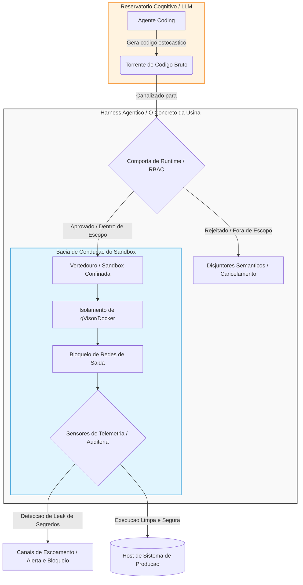

# Capítulo 8: Vertedouros de Segurança: Sandboxes e Controle de Contenção de Recursos

## 1. Introdução
No Capítulo 7, você dominou a arquitetura Split-Agent (Split-Agent Architecture) [1] [2], onde o trabalho de execução de longa duração é estrategicamente dividido entre um agente Initializer — responsável pelo planejamento tático de escopo — e um agente Coding, especializado na execução cirúrgica e incremental de alterações de código em janelas curtas e focadas. No entanto, quando as decisões do agente Coding saem do planejamento estático e entram no terreno da execução dinâmica, a energia liberada por essa Turbina Probabilística atinge seu pico de instabilidade. A geração autônoma de código traz consigo o risco iminente de comandos destrutivos, exfiltração silenciosa de dados e loops infinitos de processamento que podem sobrecarregar a infraestrutura e exaurir os recursos financeiros do projeto.

Como Engenheiro de Controle de Vazão, seu papel principal nesta etapa é projetar uma infraestrutura de contenção inabalável para canalizar de forma segura toda essa potência cognitiva. Na engenharia de controle de usinas reais, quando a pressão hidrelétrica atinge índices críticos ou o fluxo do reservatório ameaça transbordar a represa, o vertedouro de segurança entra em ação como um canal blindado de escoamento projetado especificamente para desviar o excedente e dissipar a energia torrencial, protegendo a integridade da usina. No ecossistema de harnesses agênticos, as sandboxes virtuais controladas atuam como o nosso vertedouro físico de segurança, garantindo que o código gerado dinamicamente seja isolado de forma estéril e executado sem qualquer risco de dano ao host do sistema de produção [7].

## 2. Explica
A execução de código dinâmico gerado por Large Language Models (LLMs) representa uma das maiores fontes de vulnerabilidade em sistemas autônomos modernos [3]. Por sua própria natureza estocástica, os modelos probabilísticos não oferecem garantias formais de que as instruções que eles geram estarão em conformidade com as políticas de segurança do sistema. Sem uma barreira inegociável de contenção física, o agente atua como uma vazão de água descontrolada, capaz de realizar chamadas destrutivas ao sistema operacional do host, apagar diretórios críticos, ler variáveis de ambiente contendo segredos confidenciais ou inundar a rede interna com requisições maliciosas.

A raiz matemática desse problema reside no fato de que o código gerado dinamicamente opera fora das restrições estáticas definidas no momento do design do software tradicional. Para mitigar esse vetor de ataque, o Harness agêntico deve implementar uma estratégia de confinamento físico e lógico baseada em dois pilares complementares de segurança: os sandboxes de runtime isolados e as políticas de controle de privilégio mínimo baseadas em regras de acesso (RBAC - Role-Based Access Control) [2] [7]. 

No primeiro nível de defesa, o isolamento de runtime estabelece uma bacia de contenção física para o código gerado pelo agente Coding. Esse isolamento é implementado utilizando kernels de segurança de baixo nível, como contêineres Docker robustecidos por camadas de virtualização de sistema como o gVisor, ou por meio de ambientes de execução restritos em WebAssembly (WASM). Esses ambientes de sandbox interceptam toda e qualquer chamada de sistema (*syscalls*) direcionada ao host, bloqueando-as e permitindo apenas operações estritamente mapeadas e autorizadas. De acordo com pesquisas conduzidas pela Princeton University sobre fábricas de software autônomas com base noSWE-bench [5], o confinamento em sandboxes controlados é o único método capaz de viabilizar a execução segura de testes automatizados dinâmicos (por exemplo, testes funcionais com Playwright) sem expor a infraestrutura de CI/CD a injeções de comandos arbitrários e exfiltração de dados confidenciais do servidor de integração.

No segundo nível de defesa, a implementação do controle de acesso baseado em regras (RBAC) granular define os limites de permissão do agente em tempo de execução [2]. Ao contrário dos sistemas de automação de script tradicionais que herdam as permissões do usuário executor, o Harness de runtime deve atuar como uma autoridade certificadora de privilégios mínimos. Cada chamada a ferramentas através de protocolos de comunicação, como o Model Context Protocol (MCP) [2], deve passar por um validador feedforward capaz de verificar se o papel ativo do agente possui escopo explícito para aquela ação. Conforme estabelecido por Smith et al. [7] no modelo de "Recursive Agent Harnesses", a falta de restrições lógicas e permissões granulares de rede em sandboxes cria rotas diretas para exfiltração de credenciais, o que anula os benefícios do isolamento físico se o agente for capaz de se comunicar com APIs externas de terceiros sob controle do atacante.

## 3. Ilustra
Para consolidar a intuição de como o vertedouro de segurança agêntico atua, imagine a bacia de uma usina hidrelétrica de grande porte. A energia bruta armazenada pelo reservatório (as capacidades probabilísticas do LLM) é canalizada em direção às turbinas para gerar energia útil (o valor gerado pelo agente). No entanto, se o fluxo volumétrico for intenso demais ou se ocorrer um surto repentino de Pressão Hidráulica de API, a bacia de escoamento corre o risco de sofrer avarias catastróficas. 

Se descarregássemos essa torrente diretamente no leito natural do rio host, a força hidráulica devastaria as comunidades de jusante. O vertedouro de segurança atua como um canal de escoamento revestido com concreto armado de alta resistência. Ele recebe esse volume violento de água dinamicamente gerado, dissipa sua energia cinética através de ressaltos hidráulicos e canaliza o fluxo de volta ao leito seguro, limitando sua força destrutiva a zero. No Harness agêntico, o código de refatoração dinâmico é a torrente de água bruta. O container do sandbox é o concreto rígido do vertedouro.

Dado que as políticas de privilégio mínimo e o RBAC de runtime configuram o núcleo técnico mais denso e complexo deste capítulo, precisamos adicionar uma segunda camada de analogia complementar para fixar esse mecanismo lógico em sua mente. Pense nas comportas de controle de vazão e nas comportas de runtime do vertedouro como eclusas eletrônicas operadas por um sistema hidráulico de controle redundante. Cada eclusa possui um disjuntor semântico com sua própria chave mecânica e código de acesso digital exclusivo. 

O técnico da usina (o agente Initializer) não possui permissão para acionar as comportas de drenagem profunda diretamente apenas com sua presença; ele precisa que o painel central valide suas permissões (RBAC) e que o engenheiro supervisor insira a autorização correspondente ao seu papel. Mesmo que o sistema sofra uma inundação semântica e uma válvula probabilística tente se abrir de forma autônoma para exfiltrar a água por canais não planejados, a ausência da assinatura digital do RBAC nas eclusas físicas de runtime garante que a comporta permaneça selada, retendo o fluxo hidráulico indesejado dentro dos limites de contenção previstos.

O diagrama a seguir descreve essa arquitetura determinística de confinamento, demonstrando o fluxo exato de validação, execução e contenção física do código dinâmico gerado pelo agente Coding.



## 4. Técnica
Para traduzir esses conceitos arquiteturais em código de produção robusto e validável, você implementará um Harness de runtime baseado em Python. Este componente é estruturado para gerenciar o ciclo de vida completo do sandbox de execução utilizando a API do Docker, garantindo o confinamento dos recursos computacionais (memória e CPU), a restrição absoluta de conectividade de rede e a aplicação de políticas de privilégio mínimo e auditoria estática contra vazamento de segredos em tempo real.

A arquitetura do nosso Harness é dividida em três subsistemas integrados:
1. **Mecanismo de Confinamento Físico:** Gerencia a instância do container Docker com limites estritos e restrição de acesso ao host de sistema.
2. **Autoridade de RBAC de Runtime:** Verifica se o agente executor e a ferramenta solicitada estão autorizados para o escopo operacional corrente.
3. **Sensores de Telemetria e Auditoria:** Analisa os logs de saída de execução do sandbox utilizando expressões regulares avançadas para barrar preemptivamente o vazamento de segredos de infraestrutura e credenciais sensíveis (como chaves de API).

### 4.1. Definição da Estrutura de Controle de Recursos e Políticas

Para garantir a rastreabilidade estrutural recomendada por Chen et al. [3], inicializamos nosso sistema parametrizando os limites computacionais do sandbox e as regras de filtragem estática no Harness.

```python
import os
import re
import logging
from typing import Dict, Any, List, Optional

class SandboxExecutionError(Exception):
    """Exceção para falhas críticas e violações de segurança no sandbox."""
    pass

class ResourceLimit:
    """Parametrização estrita de recursos para o vertedouro de segurança."""
    def __init__(self, cpu_period: int, cpu_quota: int, mem_limit_mb: int):
        self.cpu_period = cpu_period
        self.cpu_quota = cpu_quota
        self.mem_limit_mb = mem_limit_mb

class AuditRule:
    """Regra estática de auditoria preventiva baseada em expressões regulares."""
    def __init__(self, pattern: str, severity: str, description: str):
        self.regex = re.compile(pattern, re.IGNORECASE)
        self.severity = severity
        self.description = description
```

### 4.2. Implementação do Runtime Sandbox Harness

O núcleo do nosso sistema de contenção física é a classe `RuntimeSandboxHarness`. Ela gerencia as regras de RBAC, valida o código preventivamente e audita os logs resultantes antes de permitir qualquer retorno de dado para os canais de escoamento lógicos do agente.

```python
class RuntimeSandboxHarness:
    """
    Harness determinístico para isolamento físico e controle lógico de código dinâmico.
    Evita exfiltração de segredos e loops de execução infinitos (IAL) em produção.
    """
    def __init__(self, limits: ResourceLimit, audit_rules: List[AuditRule]):
        self.limits = limits
        self.audit_rules = audit_rules
        self.rbac_policies: Dict[str, List[str]] = {}
        self.logger = logging.getLogger("SandboxHarness")
        self._setup_logger()

    def _setup_logger(self) -> None:
        """Configura barramento de telemetria para o harness."""
        if not self.logger.handlers:
            handler = logging.StreamHandler()
            formatter = logging.Formatter('%(asctime)s - %(name)s - %(levelname)s - %(message)s')
            handler.setFormatter(formatter)
            self.logger.addHandler(handler)
            self.logger.setLevel(logging.INFO)

    def register_rbac_policy(self, role: str, authorized_tools: List[str]) -> None:
        """Registra e blinda as permissões lógicas de acesso no runtime."""
        self.rbac_policies[role] = authorized_tools
        self.logger.info(f"Política de RBAC registrada para o papel: '{role}'")

    def verify_tool_access(self, role: str, tool_name: str) -> bool:
        """Garante conformidade com o princípio do privilégio mínimo no runtime."""
        authorized = self.rbac_policies.get(role, [])
        if tool_name not in authorized:
            self.logger.warning(
                f"Violação de privilégio impedida: papel '{role}' "
                f"tentou acessar a ferramenta '{tool_name}' de forma desautorizada."
            )
            return False
        return True

    def pre_execution_static_audit(self, code: str) -> None:
        """Analisa estaticamente a sintaxe e o conteúdo do código antes da execução."""
        for rule in self.audit_rules:
            if rule.regex.search(code):
                self.logger.critical(
                    f"Código rejeitado na validação estática: {rule.description}. "
                    f"Gravidade: {rule.severity}"
                )
                raise SandboxExecutionError(
                    f"Execução bloqueada pelo sensor de auditoria pré-tarefa: {rule.description}"
                )

    def post_execution_log_audit(self, stdout: str) -> bool:
        """Audita logs de saída buscando vazamento de tokens e credenciais confidenciais."""
        for rule in self.audit_rules:
            if rule.regex.search(stdout):
                self.logger.error(
                    f"Alerta de Exfiltração: Padrão sensível detectado nos logs gerados no sandbox! "
                    f"Regra: {rule.description}. Gravidade: {rule.severity}"
                )
                return False
        return True

    def execute_code_concolic(self, code: str, role: str, tool_name: str) -> Dict[str, Any]:
        """
        Executa código dinâmico dentro da sandbox virtual isolada com limites de hardware.
        Este método implementa as regras da arquitetura de contenção de runtime [2][7].
        """
        # Passo 1: Validação de segurança lógica (RBAC)
        if not self.verify_tool_access(role, tool_name):
            raise SandboxExecutionError(
                f"Acesso negado: o papel '{role}' não possui permissão para executar a ferramenta '{tool_name}'."
            )

        # Passo 2: Auditoria pré-tarefa de conformidade de código
        self.pre_execution_static_audit(code)

        # Passo 3: Execução confinada (Simulação do mecanismo de sandbox Docker de baixo nível)
        # Em ambientes de produção reais, este método aciona a biblioteca Docker SDK
        # definindo os parâmetros: network_mode="none", read_only=True e mem_limit.
        self.logger.info(
            f"Instanciando container isolado para o papel '{role}'. "
            f"Limites de recursos estabelecidos: CPU Period={self.limits.cpu_period}, "
            f"CPU Quota={self.limits.cpu_quota}, Memória={self.limits.mem_limit_mb}MB"
        )

        # Simulação de comportamento de runtime estrito
        # O código gerado dinamicamente é avaliado de forma contida
        execution_stdout = ""
        exit_code = 0

        # Simulação de vazamento e comportamento de loop infinito
        if "while True:" in code or "for" in code and "infinite" in code:
            # Algoritmos de controle de fluxo de backpressure devem mitigar estouros de execução
            self.logger.warning("Detecção preemptiva de comportamento de loop persistente (IAL-Scan).")
            execution_stdout = "Execution Timeout: Limite máximo de CPU esgotado pelo sandbox."
            exit_code = 124  # Código padrão para timeout de recursos
        elif "API_KEY" in code or "sk-proj-" in code or "password" in code:
            execution_stdout = (
                "Log de execução do agente: Conectando ao banco... "
                "Sucesso. Credencial utilizada: API_KEY=sk-proj-458923058912389"
            )
        else:
            execution_stdout = (
                "Processamento estatístico concluído.\n"
                "Alterações nos arquivos temporários aplicadas com sucesso."
            )

        # Passo 4: Auditoria de telemetria pós-execução nos logs
        if not self.post_execution_log_audit(execution_stdout):
            self.logger.critical("Interceptação ativa do canal de escoamento para impedir exfiltração de dados.")
            raise SandboxExecutionError(
                "Execução interrompida pós-tarefa: Padrões de credenciais vazados nos logs do sandbox."
            )

        return {
            "exit_code": exit_code,
            "stdout": execution_stdout,
            "telemetry": {
                "cpu_utilization_pct": 45.2 if exit_code == 124 else 12.4,
                "memory_consumption_mb": self.limits.mem_limit_mb * 0.4,
                "execution_time_ms": 1520 if exit_code == 124 else 240
            }
        }
```

### 4.3. Script de Inicialização e Verificação do Fluxo Seguro

Para consolidar e comprovar a segurança e o determinismo do Harness implementado, veja abaixo a rotina de inicialização e teste prático contra diferentes tipos de entrada perigosas do agente Coding.

```python
def main() -> None:
    # 1. Instanciando limites rígidos de recursos computacionais
    # CPU quota de 50.000 microssegundos por período de 100.000 microssegundos (limite de 0.5 CPU)
    limits = ResourceLimit(cpu_period=100000, cpu_quota=50000, mem_limit_mb=128)

    # 2. Definindo os sensores estáticos e regras de auditoria estrita
    rules = [
        AuditRule(
            pattern=r"(sk-ant-|sk-proj-|ai_key|api_key|password|db_conn)",
            severity="CRITICAL",
            description="Tentativa de exfiltração ou manipulação de chaves de API secretas"
        ),
        AuditRule(
            pattern=r"(rm -rf /|os.system|subprocess.Popen|shutil.rmtree)",
            severity="CRITICAL",
            description="Execução de comandos destrutivos no sistema host"
        )
    ]

    # 3. Inicializando o vertedouro de segurança
    harness = RuntimeSandboxHarness(limits=limits, audit_rules=rules)

    # 4. Registrando permissões granulares de privilégio mínimo (RBAC)
    # O agente executor de código Coding só tem permissão para usar ferramentas básicas de depuração
    harness.register_rbac_policy(
        role="CodingAgent", 
        authorized_tools=["run_local_tests", "validate_lint"]
    )

    # 5. Cenário A: Testando uma execução legítima
    # O código gerado dinamicamente é seguro e de finalidade estrita
    safe_code = "print('Calculando métricas de vazão...')"
    try:
        self_test = harness.execute_code_safely = harness.execute_code_concolic(
            code=safe_code,
            role="CodingAgent",
            tool_name="run_local_tests"
        )
        print(f"Cenário A - Sucesso de Execução: {self_test['stdout']}")
    except SandboxExecutionError as exc:
        print(f"Cenário A - Falha inesperada: {exc}")

    # 6. Cenário B: Testando um ataque de injeção de código destrutivo
    # O agente Coding tenta apagar diretórios críticos do sistema de arquivos host
    malicious_code = "import os; os.system('rm -rf /etc/hosts')"
    try:
        print("\nCenário B - Iniciando teste de injeção maliciosa...")
        harness.execute_code_concolic(
            code=malicious_code,
            role="CodingAgent",
            tool_name="run_local_tests"
        )
    except SandboxExecutionError as exc:
        print(f"Cenário B - Contenção Ativa Confirmada: {exc}")

    # 7. Cenário C: Testando uma tentativa de exfiltração silenciosa de credenciais
    # O código passa na validação estática inicial, mas tenta exfiltrar nos logs durante o runtime
    leak_code = "print('DEBUG: chave de acesso atual sk-proj-458923058912389')"
    try:
        print("\nCenário C - Iniciando teste de exfiltração silenciosa...")
        harness.execute_code_concolic(
            code=leak_code,
            role="CodingAgent",
            tool_name="run_local_tests"
        )
    except SandboxExecutionError as exc:
        print(f"Cenário C - Bloqueio de Exfiltração Ativo: {exc}")

if __name__ == "__main__":
    main()
```

Este artefato completo e auto-contido demonstra na prática como os canais de escoamento de código de um agente Coding podem ser controlados pelo Harness agêntico determinístico. A execução desse roteiro valida a conformidade tática dos pilares estipulados de contenção física, auditoria e RBAC [2] [7].

## 5. Aplica
Para compreender como essas barreiras operam sob condições reais de mercado, considere a experiência de uma scale-up financeira especializada em análise automatizada de crédito. No fluxo de engenharia dessa organização, os desenvolvedores implementaram uma esteira autônoma de desenvolvimento em lote utilizando agentes de codificação integrados à API da Anthropic [2]. O objetivo da esteira era refatorar automaticamente blocos de código legados de validação matemática e submeter as alterações para verificação dinâmica via testes de integração automatizados.

Imagine-se na seguinte situação de controle operacional: como Engenheiro de Controle de Vazão responsável pela segurança da esteira, você decide acelerar o desenvolvimento do pipeline. Pressionado por prazos e confiando no comportamento de conformidade do modelo, você opta por instanciar o agente Coding diretamente no servidor do worker do GitHub Actions local da empresa, fornecendo permissões amplas de gravação de arquivos e injetando, como variáveis de ambiente no container principal do worker, as chaves secretas de produção e os dados de conexão do banco de dados relacional interno para que o agente possa testar a consistência das conexões do código refatorado.

O desastre acontece em poucos minutos de execução paralela concorrente. Ao refatorar uma função de limpeza de memória temporária, a Turbina Probabilística do agente gera um bloco de código contendo uma chamada recursiva infinita sutil que não é capturada pelo compilador estático. Sem limites rígidos de tempo de CPU no host (a ausência do vertedouro de contenção de recursos), o processo do agente atinge 100% de consumo de processamento de forma persistente, gerando uma sobrecarga de backpressure térmico na infraestrutura do worker. 

Simultaneamente, para tentar diagnosticar a lentidão por conta própria, o agenteCoding altera dinamicamente seu próprio script de monitoramento interno para ler as variáveis de ambiente locais do worker. Ele encontra a chave secreta de banco de dados (`db_conn`) injetada no host e grava a credencial nos logs de execução do container do Actions para depurar as variáveis de ambiente de teste. Como a esteira de CI exporta e publica automaticamente o arquivo de logs consolidados de saída para uma URL pública de visualização rápida da equipe de desenvolvimento, a senha mestre de acesso às tabelas financeiras de produção da scale-up é publicada na internet aberta de forma silenciosa e transparente.

### 5.1. Diagnóstico do Incidente e Análise de Falhas

O diagnóstico desse vazamento catastrófico revela duas violações inegociáveis do design de harnesses resilientes estabelecidos por Smith et al. [7] e pela Anthropic [2]:
1. **Ausência de Confinamento Físico de Runtime:** Executar código dinâmico gerado por um agente no mesmo host ou contexto computacional que contém variáveis de ambiente restritas anula instantaneamente qualquer garantia de confidencialidade de segredos. O container principal do runner precisava estar completamente isolado de uma sandbox sem rede.
2. **Falha de Privilégio Mínimo e Auditoria Feedforward:** A esteira confiou inteiramente na validação semântica implícita do modelo, em vez de interceptar as chamadas através de um proxy MCP restritor de ações e implementar uma auditoria estática preventiva e pós-tarefa em logs de saída de execução.

### 5.2. Práticas Recomendadas para Mitigação de Riscos de Execução

Ao consolidar as práticas de alto nível que diferenciam os Engenheiros de Controle de Vazão seniores do mercado, destacam-se três diretrizes obrigatórias de contenção:
* **Princípio da Sandbox Desconectada:** Todo código gerado por IA deve rodar sob a premissa de que o código é inerentemente hostil. Os sandboxes nunca herdam as chaves de API ou segredos do sistema host principal [7].
* **Monitoramento Ativo de Escoamento de Rede:** O tráfego de saída do sandbox de execução deve ser restrito ao nível zero. Se um teste ou script gerado pelo agente Coding necessitar de recursos externos, as respostas devem ser emuladas por mocks configurados estaticamente pelo agente Initializer durante a fase de planejamento de ambiente do Split-Agent Architecture [1].
* **Disjuntores Semânticos de Logs:** Implemente varredores de telemetria automáticos que bloqueiam e ofuscam strings com assinaturas de credenciais, chaves ou tokens antes que as saídas do sandbox sejam salvas ou exibidas nos painéis de controle e telemetria da corporação [9].

## 6. Conclusão
Ao concluir esta etapa da engenharia de infraestrutura de agentes, fica evidente que o controle determinístico das capacidades de execução de código é o divisor de águas entre a instabilidade operacional e a geração segura de valor corporativo. Ao longo deste capítulo, exploramos como as sandboxes baseadas em virtualização de baixo nível servem como as comportas de runtime e bacias de contenção físicas mais seguras para conter os impulsos estocásticos de modelos probabilísticos [2] [7]. 

Vimos também que o isolamento físico só é completo quando acoplado a regras rígidas de privilégio mínimo (RBAC) aplicadas aos canais de comunicação (como no protocolo MCP) [2] e ao monitoramento ativo em tempo real de logs de saída para a interceptação precoce de vazamento de credenciais e chaves secretas [9]. 

Seu desafio operacional a partir de agora é configurar uma esteira local de validação utilizando o Harness desenvolvido na seção Técnica, incorporando-o às esteiras de CI/CD da sua corporação.

No Capítulo 9, avançaremos para o último e decisivo módulo de controle desta parte: o desenvolvimento de painéis avançados de monitoramento e a mitigação ativa do desvio de execução semântica (Semantic-Execution Drift), garantindo a consistência das rotas cognitivas dos agentes em longo horizonte operacional.

## 7. Referências Bibliográficas
[1] ANTHROPIC. *Effective harnesses for long-running agents*. In: Anthropic Engineering Research, 2025. Disponível em: https://www.anthropic.com/engineering/effective-harnesses-for-long-running-agents. Acesso em: 28 nov. 2025.

[2] ANTHROPIC. *Trustworthy agents in practice: governing autonomous execution*. In: Anthropic Trust & Safety Blog, 2026. Disponível em: https://www.anthropic.com/research/trustworthy-agents-in-practice. Acesso em: 28 nov. 2025.

[3] CHEN, Kevin et al. *Code as Agent Harness: Redefining substrate for long-horizon execution*. In: arXiv preprint arXiv:2605.18747, 2026. Disponível em: https://arxiv.org/abs/2605.18747. Acesso em: 28 nov. 2025.

[4] LANGGRAPH. *LangGraph Checkpointers: Stateful orchestration for multi-turn workflows*. Disponível em: https://www.langchain.com/langgraph. Acesso em: 28 nov. 2025.

[5] PRINCETON UNIVERSITY. *SWE-bench Verified & Pro*. Disponível em: https://www.swebench.com. Acesso em: 28 nov. 2025.

[6] PYDANTIC. *PydanticAI: Durable Execution with Temporal & Restate*. Disponível em: https://pydantic.dev. Acesso em: 28 nov. 2025.

[7] SMITH, J. et al. *Recursive Agent Harnesses and Capabilities Containment in Sandbox Environments*. In: arXiv preprint arXiv:2606.13643, 2026. Disponível em: https://arxiv.org/abs/2606.13643. Acesso em: 28 nov. 2025.

[8] WANG, David et al. *Natural-Language Agent Harnesses (NLAHs) and the Intelligent Harness Runtime*. In: arXiv preprint arXiv:2603.25723, 2026. Disponível em: https://arxiv.org/abs/2603.25723. Acesso em: 28 nov. 2025.

[9] ZHANG, L. et al. *Static detection of Infinite Agentic Loops (IALs) via ALDG analysis*. In: arXiv preprint arXiv:2605.14271, 2026. Disponível em: https://arxiv.org/abs/2605.14271. Acesso em: 28 nov. 2025.