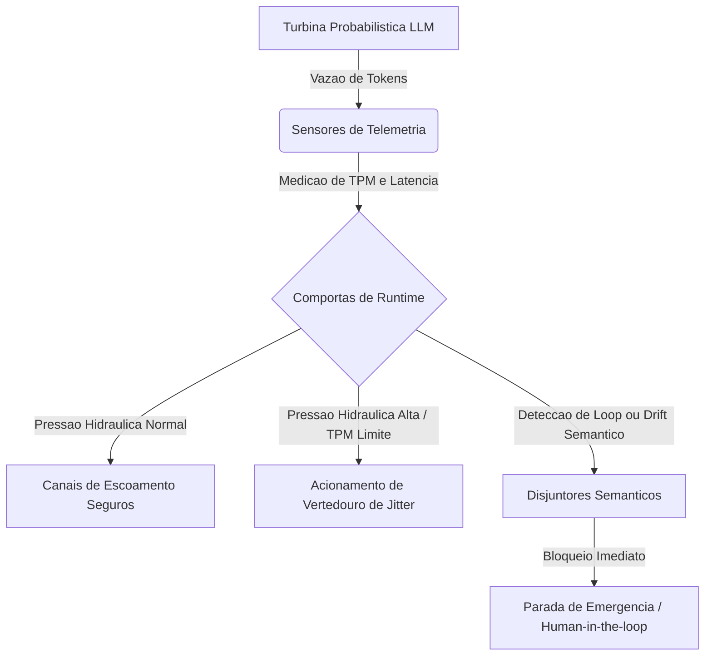

# Capítulo 9: O Painel de Controle: Monitoramento e Prevenção do Desvio de Execução Semântica

## 1. Introdução
No Capítulo 8, você dominou o isolamento físico e a contenção de recursos em sandboxes virtuais sob políticas de RBAC rígido. Como Engenheiro de Controle de Vazão, agora você precisa aplicar essa mesma mentalidade de blindagem para proteger o fluxo de informações no nível semântico. Controlar as fronteiras físicas de execução de código do agente é inútil se o fluxo de raciocínio da inteligência se dissipar em um mar de redundância ou se desviar sutilmente do rumo de projeto originalmente estipulado.

Neste capítulo, estudaremos a telemetria avançada necessária para conter a deriva semântica de longa execução e a amnésia induzida pela compressão cega de histórico de contexto. Você dominará a implementação de ferramentas analíticas proativas que traduzem o código de harnesses lógicos em representações formais para interromper preventivamente anomalias de execução, loops redundantes e vazamentos operacionais. Ao final desta leitura, você saberá projetar painéis corporativos de telemetria de alta fidelidade que garantem a segurança econômica e a estabilidade cognitiva de agentes em escala industrial.

## 2. Explica
Para sustentar interações de horizonte longo, os frameworks agênticos recorrem sistematicamente ao resumo ou compressão automática do histórico de conversas para preservar a janela de contexto disponível do modelo de linguagem. Contudo, essa compactação agressiva impõe uma séria consequência técnica: a amnésia operacional induzida [1]. Conforme o histórico operacional é condensado para caber nos limites geométricos do contexto, restrições arquiteturais sutis, regras de design e diretrizes lógicas impostas de forma estrita no início do fluxo se perdem [2]. O resultado é o fenômeno denominado *Semantic-Execution Drift* (desvio de execução semântica), no qual o agente perde a ancoragem dos objetivos originais do projeto, passando a atuar de forma errática ou declarando vitória prematuramente sem de fato validar os critérios de aceitação [2].

Esse declínio cognitivo gradual frequentemente cria o cenário ideal para o desencadeamento de um *Infinite Agentic Loop* (IAL - Loop Agêntico Infinito), uma patologia operacional dinâmica de falhas recursivas que consome de forma massiva a cota de APIs em questão de minutos [3]. Sem barreiras reguladoras semânticas de contenção, um agente que entra em um loop infinito consome orçamentos computacionais corporativos inteiros antes que os sistemas tradicionais de billing e limites financeiros da API identifiquem a anomalia operacional [4]. É aqui que reside o grande diferencial do Engenheiro de Controle de Vazão: em vez de reagir tardiamente a relatórios de faturamento estourados, o profissional projeta disjuntores lógicos e monitora ativamente as transições semânticas do agente em tempo de execução.

Para prever e bloquear a recursão semântica antes que ocorram prejuízos, a engenharia de controle moderna emprega o *IAL-Scan* [3]. Essa abordagem de análise estática funciona traduzindo o código de orquestração do harness e o grafo de ações em uma representação intermediária independente (*Agent Intermediate Representation* - Agent IR). A partir dessa representação, o IAL-Scan reconstrói o Grafo de Dependência de Loop do Agente (*Agent Loop Dependency Graph* - ALDG) [3]. Ao analisar estaticamente o ALDG, o sistema detecta de forma determinística caminhos de transição cíclicos redundantes e aciona defesas preventivas baseadas em regras semânticas estritas antes que a execução física atinja a turbina probabilística.

Isso é integrado à arquitetura de telemetria contínua por meio do acompanhamento em tempo real da vazão de tokens por minuto (TPM), diferentemente do monitoramento simples de requisições por minuto (RPM) [4]. Em sistemas autônomos robustos de execução durável, cada checkpointing transacional ou persistência de estado adiciona latência ao fluxo operacional [9]. Portanto, o painel de telemetria corporativa deve rastrear de forma unificada as métricas de performance financeira, a acurácia de intenções semânticas e o overhead de latência sistêmica, estabelecendo a camada definitiva de governança e auditoria de inteligência artificial necessária em escala enterprise [5].

## 3. Ilustra
Considere a dinâmica de funcionamento de uma grande usina hidrelétrica. O LLM probabilístico representa a água bruta, a força indomável e o volume do rio em movimento constante. O Harness agêntico atua como a estrutura de concreto armado, comportas e canais de escoamento que medem, direcionam e canalizam essa força para gerar energia segura. 

Se você operar essa usina às escuras, sem instrumentos, a pressão hidráulica pode estourar as tubulações sem que você perceba. A compressão cega de contexto equivale a uma equipe de operadores que resume as leituras de pressão históricas para economizar espaço de papel no diário de bordo. Imagine que, no início do dia, o diário registrou: "Comporta 3 aberta em 15 centímetros por risco de fissura estrutural na fenda esquerda do vertedouro". Ao resumir o diário para economizar espaço, o operador do turno seguinte escreve apenas: "Comporta 3 aberta". Sem conhecer a restrição fina de projeto originalmente estipulada, a comporta é manipulada de forma inadequada durante um pico de fluxo. Essa perda progressiva de restrições sutis é a essência do *Semantic-Execution Drift* causado pela amnésia operacional de resumos de contexto agressivos.

Para evitar desastres estruturais e de faturamento na usina, o Engenheiro de Controle de Vazão projeta sensores de telemetria integrados a disjuntores semânticos e canais de escoamento, conforme modelado no fluxo de controle a seguir:



O analisador de IAL-Scan atua como um sistema de varredura ultrassônica estática nas tubulações da represa. Ele estuda o encanamento (Agent IR) para projetar o mapa tridimensional de escoamento (ALDG). Se o analisador estático detectar que a água corre o risco de entrar em um redemoinho eterno e circular (IAL) que desgasta o concreto sem gerar energia, ele aciona preventivamente os disjuntores lógicos para isolar a seção de fluxo instável.

## 4. Técnica
Para operacionalizar essa estratégia de defesa de forma assertiva, o harness de controle deve atuar coletando telemetria em tempo real e aplicando validações estáticas das transições de estados e de intents do agente. Na arquitetura de telemetria agêntica, cada passo executado pelo agente passa por uma camada de interceptação inteligente, comparável aos mecanismos de instrumentação do Claude Agent SDK [3].

Relembrando o conceito consolidado de isolamento e privilégio mínimo (RBAC) herdado do Capítulo 8, é fundamental assegurar que o próprio harness de telemetria opere em uma zona isolada e protegida. Esse isolamento em sandboxes virtuais controlados impede que falhas lógicas do agente corrompam ou falsifiquem as métricas de monitoramento e de auditoria registradas pelo sistema de persistência durável [4].

Abaixo, apresentamos a implementação estruturada de um analisador estático baseado em Grafo de Dependência de Loop do Agente (ALDG) e um interceptor de telemetria em Python. O sistema é projetado de forma completa e autocontida, sem lacunas e pronto para integração determinística:

```python
import time
from typing import List, Dict, Any, Tuple

class StateTransition:
    def __init__(self, from_state: str, to_state: str, tool_used: str, output_hash: str):
        self.from_state = from_state
        self.to_state = to_state
        self.tool_used = tool_used
        self.output_hash = output_hash

class ALDGAnalyzer:
    """Analisador estático do Grafo de Dependência de Loop de Agentes (ALDG)."""
    def __init__(self, max_cycle_depth: int = 3, threshold_ratio: float = 0.8):
        self.max_cycle_depth = max_cycle_depth
        self.threshold_ratio = threshold_ratio

    def build_aldg(self, history: List[StateTransition]) -> List[Tuple[str, str]]:
        """Constrói as arestas do Grafo de Dependência de Loop."""
        edges = []
        for i in range(len(history) - 1):
            edge = (history[i].tool_used, history[i+1].tool_used)
            if edge not in edges:
                edges.append(edge)
        return edges

    def detect_infinite_loops(self, history: List[StateTransition]) -> bool:
        """Detecta ciclos de execução repetitivos (Loops Agênticos Infinitos - IAL)."""
        if len(history) < self.max_cycle_depth:
            return False
        
        # Mapeia repetições de transições compostas por ferramenta e hash de resultado
        signature_counts: Dict[Tuple[str, str], int] = {}
        for trans in history:
            sig = (trans.tool_used, trans.output_hash)
            signature_counts[sig] = signature_counts.get(sig, 0) + 1

        # Aciona disjuntor caso a recorrência idêntica ultrapasse o limite seguro
        for sig, count in signature_counts.items():
            if count >= self.max_cycle_depth:
                return True
        return False

class DisjuntorSemantico:
    """Disjuntor semântico reativo que monitora pressão de vazão de tokens."""
    def __init__(self, max_tokens_per_minute: int = 100000):
        self.max_tokens_per_minute = max_tokens_per_minute
        self.current_tpm = 0
        self.is_tripped = False

    def check_pressure(self, tpm_reading: int) -> bool:
        """Verifica se a pressão hidráulica de tokens por minuto estourou o limite."""
        self.current_tpm = tpm_reading
        if self.current_tpm > self.max_tokens_per_minute:
            self.is_tripped = True
            return True
        return False

class TelemetryHarness:
    """Harness central de monitoramento, telemetria e governança agêntica."""
    def __init__(self, analyzer: ALDGAnalyzer, disjuntor: DisjuntorSemantico):
        self.analyzer = analyzer
        self.disjuntor = disjuntor
        self.execution_history: List[StateTransition] = []
        self.latency_log: List[float] = []

    def log_event(self, transition: StateTransition, tpm_reading: int) -> Dict[str, Any]:
        """Instrumenta a execução, logs transacionais e valida o desvio de fluxo."""
        start_time = time.perf_counter()
        
        # Se o disjuntor semântico já estiver disparado, bloqueia novas execuções
        if self.disjuntor.is_tripped:
            return {
                "status": "HALTED", 
                "reason": "Execução suspensa. Disjuntor semântico desarmado por instabilidade ou sobrecarga."
            }

        self.execution_history.append(transition)
        
        # Análise estática do grafo em tempo real (Simulação IAL-Scan)
        loop_detected = self.analyzer.detect_infinite_loops(self.execution_history)
        
        # Validação física de consumo de recursos
        overpressure = self.disjuntor.check_pressure(tpm_reading)
        
        status = "OPERATIONAL"
        reason = "Fluxo operacional monitorado estável."
        
        if loop_detected:
            status = "TRIPPED"
            reason = "ALERTA: Loop Agêntico Infinito (IAL) identificado pelo IAL-Scan via ALDG."
            self.disjuntor.is_tripped = True
        elif overpressure:
            status = "TRIPPED"
            reason = f"ALERTA: Pressão hidráulica de {tpm_reading} TPM excedeu limite seguro de {self.disjuntor.max_tokens_per_minute} TPM."
            
        end_time = time.perf_counter()
        latency_ms = (end_time - start_time) * 1000
        self.latency_log.append(latency_ms)
        
        return {
            "status": status,
            "reason": reason,
            "aldg_edges": self.analyzer.build_aldg(self.execution_history),
            "telemetry_metrics": {
                "current_tpm_reading": self.disjuntor.current_tpm,
                "total_transitions_logged": len(self.execution_history),
                "overhead_latency_ms": round(latency_ms, 4)
            }
        }

if __name__ == "__main__":
    # Configuração assertiva do analisador e do disjuntor
    aldg_analyzer = ALDGAnalyzer(max_cycle_depth=3)
    semantic_breaker = DisjuntorSemantico(max_tokens_per_minute=50000)
    harness = TelemetryHarness(analyzer=aldg_analyzer, disjuntor=semantic_breaker)

    # 1. Transições normais simuladas (Canais de Escoamento Seguros)
    t1 = StateTransition("INIT", "PLANNING", "read_spec", "hash_normal_1")
    t2 = StateTransition("PLANNING", "CODING", "write_code", "hash_normal_2")
    t3 = StateTransition("CODING", "VALIDATION", "run_test", "hash_normal_3")
    
    print("Registrando evento normal 1:", harness.log_event(t1, 15000))
    print("Registrando evento normal 2:", harness.log_event(t2, 18000))
    print("Registrando evento normal 3:", harness.log_event(t3, 16000))

    # 2. Simulação de indução de Loop Agêntico Infinito (IAL)
    t4 = StateTransition("VALIDATION", "CODING", "write_code", "hash_loop_A")
    t5 = StateTransition("CODING", "VALIDATION", "run_test", "hash_loop_B")
    t6 = StateTransition("VALIDATION", "CODING", "write_code", "hash_loop_A")
    t7 = StateTransition("CODING", "VALIDATION", "run_test", "hash_loop_B") # Detecção e desarme preventivo do loop

    print("\nRegistrando transição repetitiva t4:", harness.log_event(t4, 22000))
    print("Registrando transição repetitiva t5:", harness.log_event(t5, 23000))
    print("Registrando transição repetitiva t6:", harness.log_event(t6, 25000))
    print("Registrando transição repetitiva t7 (Acionamento de disjuntor):", harness.log_event(t7, 27000))
```

### 4.1. Análise de Overhead e Latência da Execução Durável
A instrumentação contínua de telemetria adiciona etapas de processamento antes e depois da invocação do núcleo probabilístico da turbina. Conforme as validações de transição de estado e o mapeamento do ALDG se estendem, a latência do ciclo de resposta do agente é impactada [9]. O Engenheiro de Controle de Vazão deve encontrar o equilíbrio dinâmico ideal entre a granularidade das verificações semânticas e o tempo de escoamento das requisições corporativas.

Por meio de tecnologias como o Model Context Protocol (MCP) [6] e integradores de workflows transacionais como os LangGraph Checkpointers [7], os dados de telemetria podem ser consolidados de forma assíncrona, eliminando a sobrecarga síncrona sobre as threads principais do agente. O uso de mecanismos como os Managed Agents do Claude Agent SDK de forma nativa reduz esse overhead por meio de ambientes computacionais de processamento paralelo otimizados [3].

## 5. Aplica
Imagine que você é o Engenheiro de Controle de Vazão responsável por monitorar o pipeline corporativo de uma fábrica de software totalmente autônoma integrada ao benchmark SWE-bench Verified [8]. Em uma noite de manutenção de rotina, o sistema de faturamento corporativo dispara alertas automáticos: o saldo de cotas de APIs da empresa caiu US$ 25.000 em menos de duas horas. Você abre o console operacional e se depara com a catástrofe silenciosa. Um dos agentes encarregados de realizar uma pequena reestruturação de layout em um microserviço entrou em uma recursão estática silenciosa de loop agêntico infinito [3].

O agente realizava uma alteração no código, rodava um script de teste que quebrava por um detalhe sintático sutil, interpretava mal o erro e repetia a alteração de layout idêntica de forma contínua [4]. O seu harness de runtime antigo baseava-se em monitoramento clássico de requisições por minuto (RPM) — o qual não acusou anomalias, uma vez que a frequência de requisições estava dentro do limite aceitável. Contudo, cada requisição transmitia a totalidade do histórico de contexto completo que crescia de forma gigantesca a cada iteração, resultando em uma pressão hidráulica de tokens por minuto (TPM) colossal que esgotou os créditos de faturamento [4].

O diagnóstico é cirúrgico: a ausência de um disjuntor de telemetria ativa permitiu que o loop durasse horas [3]. Pior: conforme o histórico do agente expandia, o resumo automático de contexto aplicou uma compactação agressiva que expurgou a regra fundamental de design de contenção de erros inserida no prompt de sistema inicial do agente (amnésia operacional) [1]. Sob amnésia lógica, o agente declarou vitória repetidamente e continuou reescrevendo o arquivo sem validar os critérios reais [2].

Para corrigir esse cenário de desastre de forma permanente na infraestrutura industrial de sua empresa, você reconfigura o runtime do harness. Você insere sensores de monitoramento de TPM em tempo real [4], implementa uma camada de persistência baseada em LangGraph Checkpointers [7] para resgate transacional de sessões instáveis e integra ativamente o analisador IAL-Scan [3] associado a disjuntores lógicos inteligentes no fluxo. No próximo incidente de ciclo redundante, o IAL-Scan detecta a anomalia estática nas primeiras três repetições e desarma imediatamente a represa probabilística, preservando o orçamento corporativo da infraestrutura e alertando o operador humano para intervenção manual.

### 5.1. Métricas de Desempenho e Governança Semântica
Para governança robusta de IA empresarial, a liderança do projeto e os engenheiros utilizam as seguintes métricas fundamentais para monitoramento de harnesses agênticos:

*   **Drift Semântico Index (DSI):** Taxa de desvio matemático-vetorial entre as intenções extraídas ao longo da execução e a especificação funcional de design original do prompt do Initializer [6]. Valores ideais em ambiente de produção devem ser inferiores a 5% [2].
*   **Acurácia de Detecção IAL-Scan:** Proporção de falsos-positivos e falsos-negativos na identificação de ciclos fechados de execução com base na representação estática de caminhos do ALDG [3]. O objetivo corporativo para mitigação de custos críticos é 100% de precisão de interrupção [4].
*   **Overhead de Latência de Persistência:** Tempo médio de resposta adicionado pelas serializações transacionais necessárias na execução durável com salvamentos e Journaling contínuos [9]. Deve ser monitorado para não comprometer cenários de tempo real de alta performance [7].

## 6. Conclusão
O gerenciamento holístico de sistemas agênticos de longa execução exige ir muito além da configuração de barreiras físicas e firewalls computacionais. Controlar a vazão de tokens, projetar sensores de telemetria estática por meio de IAL-Scan [3] e conter preventivamente o Semantic-Execution Drift [2] constituem a fundação que separa brinquedos informacionais de soluções industriais estáveis e seguras de alta performance [5]. Ao dominar a aplicação de disjuntores semânticos e governar o fluxo informacional, você assegura a integridade de sua represa cognitiva e protege a usina corporativa de estouros econômicos desastrosos [4].

Como desafio prático, estenda o analisador estático baseado em ALDG fornecido neste capítulo para integrar um verificador de similaridade de embeddings sutil entre as saídas dos passos anteriores do agente, criando um sensor de telemetria ativo capaz de calcular o Drift Semântico Index em tempo real. No Capítulo 10, consolidaremos essa jornada rumo ao fechamento, integrando todas as camadas de controle, monitoramento e barramento agêntico para consagrar o domínio do Engenheiro de Controle de Vazão sobre os horizontes de execução corporativos em escala industrial de IA de próxima geração.

## 7. Referências
[1] ANTHROPIC. *Effective harnesses for long-running agents*. In: Anthropic Engineering Research, 2025. Disponível em: https://www.anthropic.com/engineering/effective-harnesses-for-long-running-agents. Acesso em: 28 nov. 2025.

[2] WANG, David et al. *Natural-Language Agent Harnesses (NLAHs) and the Intelligent Harness Runtime*. In: arXiv preprint arXiv:2603.25723, 2026. Disponível em: https://arxiv.org/abs/2603.25723. Acesso em: 28 nov. 2025.

[3] ZHANG, L. et al. *Static detection of Infinite Agentic Loops (IALs) via ALDG analysis*. In: arXiv preprint arXiv:2605.14271, 2026. Disponível em: https://arxiv.org/abs/2605.14271. Acesso em: 28 nov. 2025.

[4] SMITH, J. et al. *Recursive Agent Harnesses and Capabilities Containment in Sandbox Environments*. In: arXiv preprint arXiv:2606.13643, 2026. Disponível em: https://arxiv.org/abs/2606.13643. Acesso em: 28 nov. 2025.

[5] ANTHROPIC. *Trustworthy agents in practice: governing autonomous execution*. In: Anthropic Trust & Safety Blog, 2026. Disponível em: https://www.anthropic.com/research/trustworthy-agents-in-practice. Acesso em: 28 nov. 2025.

[6] CHEN, Kevin et al. *Code as Agent Harness: Redefining substrate for long-horizon execution*. In: arXiv preprint arXiv:2605.18747, 2026. Disponível em: https://arxiv.org/abs/2605.18747. Acesso em: 28 nov. 2025.

[7] LANGGRAPH. *LangGraph Checkpointers: Stateful orchestration for multi-turn workflows*. Disponível em: https://www.langchain.com/langgraph. Acesso em: 28 nov. 2025.

[8] PRINCETON UNIVERSITY. *SWE-bench Verified & Pro*. Disponível em: https://www.swebench.com. Acesso em: 28 nov. 2025.

[9] PYDANTIC. *PydanticAI: Durable Execution with Temporal & Restate*. Disponível em: https://pydantic.dev. Acesso em: 28 nov. 2025.