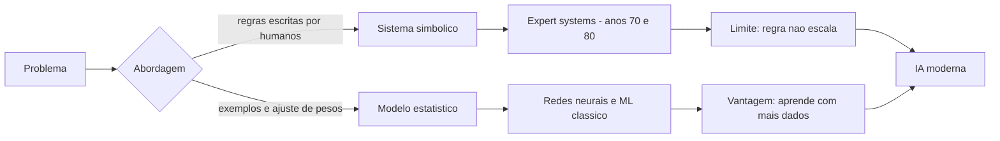

# Capítulo 1: O surgimento da Inteligência Artificial: da lógica simbólica ao aprendizado estatístico

## 1. Introdução

Você está prestes a iniciar a jornada do desencantamento produtivo: a IA que hoje responde no seu navegador não surgiu por acaso e não é uma caixa-preta mágica — ela é o resultado de mais de oitenta anos de decisões de engenharia, acertos, fracassos e reinvenções. Este primeiro capítulo cumpre uma função de fundação: mostrar de onde veio a tecnologia que você vai operar ao longo de todo o livro. Você vai aprender a distinção central que separa a Inteligência Artificial de tudo o que veio antes dela na computação — a diferença entre programar regras explícitas e deixar que um sistema aprenda padrões a partir de dados — e vai entender por que essa distinção, e não a "magia", explica tudo o que veio depois: redes neurais, o Transformer, as LLMs e os agentes dos capítulos seguintes.

Ao final deste capítulo, você será capaz de explicar, com as próprias palavras, o que diferencia um sistema baseado em regras de um sistema de aprendizado de máquina; identificar as principais eras históricas da IA e o que causou seus altos e baixos; e reconhecer, na prática, qual abordagem está por trás de um programa real quando você olhar para o seu código. Nenhum capítulo deste livro exige que você seja matemático ou cientista da computação — apenas curiosidade e vontade de entender. Se você sabe o que é um `if` e uma lista em programação, já tem o suficiente para começar.

## 2. Explica

### O que é IA: lógica tradicional vs. aprendizado de máquina

A forma mais honesta de definir Inteligência Artificial é dizer que ela é uma coleção de técnicas computacionais que executam tarefas que, até pouco tempo, exigiam inteligência humana: reconhecer imagens, traduzir idiomas, responder perguntas, jogar xadrez. A definição vaga é proposital: o que conta como "inteligência" muda conforme a tecnologia avança, e tarefas que hoje parecem triviais (calcular uma raiz quadrada, corrigir ortografia) já foram consideradas marcos de inteligência artificial [14]. Em 1950, Alan Turing propôs substituir a pergunta filosófica "as máquinas podem pensar?" por um teste prático: uma máquina seria considerada inteligente se conseguisse manter uma conversa indistinguível da de um humano [2]. Essa formulação pragmática, hoje conhecida como Teste de Turing, é uma boa lente para o iniciante: ela não pergunta o que a máquina é, mas o que a máquina faz.

Dentro dessa coleção de técnicas existe um divisor de águas conceitual que você precisa dominar antes de qualquer outra coisa. O primeiro grupo é o dos sistemas baseados em regras, também chamados de simbólicos: um humano especialista escreve explicitamente as regras de decisão (se isto, então aquilo) e o computador apenas as executa com velocidade. O segundo grupo é o do aprendizado de máquina (machine learning): em vez de receber as regras prontas, o sistema recebe dados — exemplos de entradas e saídas — e ajusta seus próprios parâmetros numéricos até aprender os padrões que explicam os dados [16]. A diferença é sutil e profunda ao mesmo tempo: no primeiro caso, o conhecimento vem do programador; no segundo, o conhecimento é extraído dos dados pelo próprio sistema. É exatamente essa segunda via que tornou possíveis os modelos modernos — e é ela que você vai aprender a operar, configurar e controlar nos próximos capítulos.

### O nascimento: neurônios artificiais, o Teste de Turing e Dartmouth

As raízes da IA são anteriores ao próprio nome. Em 1943, Warren McCulloch e Walter Pitts publicaram um artigo que é a certidão de nascimento da rede neural artificial: demonstraram, matematicamente, que um conjunto de neurônios artificiais simples — unidades que recebem sinais, somam e disparam se o total passar de um limite — poderia, em princípio, computar qualquer função lógica [1]. Não era ainda um cérebro, mas era a prova de que "pensar" podia ser reduzido a operações calculáveis. Sete anos depois, Turing propôs o teste que leva seu nome e, com ele, a agenda de pesquisa da área [2]. Em 1955, John McCarthy, Marvin Minsky, Nathaniel Rochester e Claude Shannon escreveram a proposta da conferência de Dartmouth, na qual o termo "inteligência artificial" foi cunhado oficialmente no ano seguinte [3].

O entusiasmo da década de 1950 produziu os primeiros sistemas que pareciam, de fato, inteligentes. Em 1956, Allen Newell e Herbert Simon apresentaram o Logic Theorist, um programa capaz de provar teoremas de lógica simbólica — a primeira demonstração pública de uma máquina raciocinando sobre símbolos [4]. Em 1958, Frank Rosenblatt construiu o Perceptron, um classificador de padrões baseado na ideia de neurônios de McCulloch e Pitts, capaz de aprender a distinguir categorias simples a partir de exemplos [5]. No ano seguinte, Arthur Samuel usou o termo "machine learning" pela primeira vez ao descrever um programa de damas que melhorava o próprio jogo com a prática [6]. A impressão geral, na época, era a de que a inteligência geral estava a poucas décadas de distância — impressão que a história trataria de corrigir.

### A era simbólica e o primeiro inverno

A primeira grande correção de rota veio de dentro do próprio campo. Em 1969, Marvin Minsky e Seymour Papert publicaram o livro Perceptrons, no qual demonstraram, com rigor matemático, os limites do Perceptron de camada única: ele é incapaz de aprender problemas que não são linearmente separáveis — o exemplo clássico é o problema do XOR, em que duas classes se entrelaçam de modo que nenhuma linha reta as separa [7]. O impacto foi devastador: o financiamento para redes neurais praticamente secou, inaugurando o primeiro dos chamados "invernos da IA", períodos de ceticismo e cortes de recursos. A lição técnica que ficou é importante para o seu entendimento do todo: redes neurais não são mágica — são máquinas de ajuste de pesos, e sua capacidade depende de arquitetura e dados, não de fé.

A comunidade respondeu ao frio de duas maneiras. Uma parte apostou na sofisticação da abordagem simbólica: surgiram os sistemas especialistas (expert systems), que codificavam o conhecimento de especialistas humanos em grandes conjuntos de regras se-então, com mecanismos de inferência e explicação. O DENDRAL, da década de 1970, deduzia estruturas químicas; o MYCIN, de Edward Shortliffe, diagnosticava infecções bacterianas com desempenho comparável ao de médicos em seu domínio restrito [8][11]. Era a prova de que a IA podia ter valor comercial real — desde que o domínio fosse estreito e o conhecimento, bem organizado [13]. A outra parte da comunidade manteve viva a linha conexionista (redes neurais) nos bastidores, aguardando a convergência de dados e computação que só viria décadas depois. Foi nesse ambiente de paciência técnica que, em 1986, Rumelhart, Hinton e Williams publicaram o trabalho que reavivou as redes neurais: a retropropagação (backpropagation), o algoritmo que permite ajustar os pesos de todas as camadas de uma rede com base no erro final [9].

### A virada estatística: aprender padrões em vez de escrever regras

Enquanto os sistemas especialistas mostravam o valor da IA simbólica, uma revolução silenciosa acontecia na estatística aplicada. Árvores de decisão, regressão logística, k-vizinhos mais próximos e, depois, máquinas de vetores de suporte formaram o arsenal do aprendizado de máquina clássico: algoritmos que, dados exemplos rotulados, aprendem uma fronteira de decisão sem que nenhuma regra tenha sido escrita à mão [18]. A filosofia por trás dessa virada é o que você vai carregar para o resto do livro: em problemas do mundo real, o conhecimento relevante é vasto demais e muda rápido demais para ser codificado por especialistas; é mais robusto deixar que o sistema descubra os padrões a partir de dados, desde que os dados sejam representativos [17]. Essa é a razão de fundo pela qual as ferramentas modernas que você vai operar — harnesses, modelos, agentes — dependem tão fortemente de dados e de qualidade de contexto, como você verá nos módulos seguintes.

A síntese dessa virada é a seguinte: primeiro os pesquisadores tentaram ensinar a máquina como um professor (regras); depois tentaram construir máquinas que aprendem como estudantes (estatística). A segunda abordagem venceu — não porque seja mais "inteligente", mas porque escala melhor: um sistema que aprende com dados melhora quando recebe mais dados, enquanto um sistema de regras só melhora quando alguém escreve mais regras [15]. Hoje, praticamente tudo o que chamamos de IA — do corretor do seu celular aos agentes que escrevem código — é aprendizado de máquina. A parte "clássica" deste capítulo é a base para entender os capítulos 2 e 3, onde redes neurais profundas e o Transformer levaram essa mesma ideia a uma escala inimaginável em 1956 [14][16].

## 3. Ilustra

Para fixar a diferença entre regras e aprendizado, imagine a cozinha do seu apartamento. Existem duas formas de alguém aprender a fazer um molho de tomate. A primeira é seguir uma receita escrita: "adicione 500 gramas de tomate, uma colher de azeite, sal a gosto, cozinhe por vinte minutos". A receita é uma regra: se você a segue exatamente, o resultado é previsível, mas qualquer variação de ingrediente — tomate de outra marca, panela diferente, altitude diferente — exige que um humano reescreva a regra. Essa é a IA simbólica: um especialista escreve o passo a passo, e a máquina executa. A segunda forma é aprender degustando: você prova dez molhos de cozinheiros diferentes, percebe que os melhores têm um ponto de acidez equilibrado e um toque de doçura, e a partir daí ajusta o próprio paladar a cada novo molho que experimenta. Ninguém lhe entregou a regra — você extraiu o padrão dos exemplos. Essa é a IA estatística, e é exatamente assim que os sistemas modernos funcionam: eles "degustam" milhões de exemplos (dados) e ajustam seus parâmetros internos até que a resposta genérica melhore.

Como Aprendiz de Construtor, você já pode perceber a implicação prática desse desencantamento: se a IA é estatística, a qualidade do que ela produz depende menos de "mágica" e mais das duas coisas que você consegue controlar — os dados/contexto que você fornece e a configuração do sistema que a opera. A caixa-preta do navegador começa a abrir: dentro dela não há um gênio, há uma máquina de ajuste de pesos treinada em exemplos. O diagrama abaixo resume as duas rotas históricas e o ponto em que elas se encontram na tecnologia que você usa hoje.



## 4. Técnica

### Dois programas, dois mundos: regras e dados em Python

Nada fixa um conceito como implementá-lo. Vamos construir os dois mundos do capítulo em Python puro — sem instalar nada além do próprio Python — começando pela abordagem simbólica: um classificador de mensagens escrito inteiramente com regras. O exemplo é clássico e útil: dizer se uma mensagem curta parece spam ou não.

```python
def classificar_com_regras(mensagem: str) -> str:
    """Abordagem simbolica: regras escritas a mao pelo programador."""
    texto = mensagem.lower()
    if "grátis" in texto or "gratis" in texto:
        return "spam"
    if "clique aqui" in texto:
        return "spam"
    if "você ganhou" in texto or "voce ganhou" in texto:
        return "spam"
    if len(texto) > 200 and "!" in texto:
        return "spam"
    return "normal"


exemplos = [
    "Olá, tudo bem? Vamos almoçar amanhã?",
    "VOCÊ GANHOU um prêmio! Clique aqui agora mesmo!",
]
for msg in exemplos:
    print(f"{classificar_com_regras(msg):<8} <- {msg}")
```

O código funciona, mas observe o que ele exigiu: alguém teve que prever cada variação de spam ("grátis", "gratis", caixa alta, "clique aqui"...) e escrever cada regra à mão. Um spammer novo que escreva "parabéns, resgate seu bônus" passa despercebido até que um humano adicione a regra. Esse é exatamente o custo da abordagem simbólica: o conhecimento não escala sem o especialista [14]. Agora o mesmo problema com a abordagem estatística: em vez de regras, o programa conta palavras de um vocabulário aprendido de exemplos rotulados.

```python
def treinar_vocabulario(mensagens, rotulos):
    """Conta a frequencia de palavras por classe - o nucleo de um naive bayes."""
    frequencia = {"spam": {}, "normal": {}}
    for msg, rotulo in zip(mensagens, rotulos):
        for palavra in msg.lower().replace(".", " ").replace(",", " ").split():
            dicio = frequencia[rotulo]
            dicio[palavra] = dicio.get(palavra, 0) + 1
    return frequencia


def classificar_aprendendo(mensagem, frequencia):
    """Escolhe a classe que mais conhece as palavras da mensagem."""
    palavras = mensagem.lower().replace(".", " ").replace(",", " ").split()
    pontuacao = {"spam": 0, "normal": 0}
    for rotulo, dicio in frequencia.items():
        total = sum(dicio.values()) or 1
        for palavra in palavras:
            pontuacao[rotulo] += (dicio.get(palavra, 0) + 1) / total
    return max(pontuacao, key=pontuacao.get)


treino = [
    ("ganhe dinheiro facil agora", "spam"),
    ("clique no link e receba premio", "spam"),
    ("reuniao marcada para amanha", "normal"),
    ("preciso revisar o relatorio", "normal"),
]
rotulos = [r for _, r in treino]
frequencia = treinar_vocabulario([m for m, _ in treino], rotulos)
nova = "ganhe premio no link"
print(f"'{nova}' -> {classificar_aprendendo(nova, frequencia)}")
```

Repare na diferença estrutural: o segundo programa nunca viu a frase "ganhe premio no link", mas consegue classificá-la porque aprendeu que "ganhe", "premio" e "link" são palavras típicas de spam. Esse é o ponto do capítulo materializado em código: o conhecimento foi extraído dos dados, não escrito à mão. É primitivo, mas é exatamente o mecanismo que, em escala bilionária de parâmetros, você encontrará nas LLMs dos capítulos 2 e 3 [16][19].

### O limite do Perceptron: por que o inverno aconteceu

Para entender o inverno da IA, implemente o problema que derrubou o otimismo: o XOR. Um classificador linear separa classes com uma reta. O XOR — retornar 1 quando as entradas diferem — cria um padrão em que os pontos de classe 1 ocupam os cantos opostos do quadrado, impossíveis de separar com uma única reta [7]. O programa abaixo tenta aprender o XOR com um modelo linear (uma soma ponderada seguida de um limiar) e mostra que ele nunca converge para a solução correta, exatamente como Minsky e Papert provaram.

```python
def predicao_linear(pesos, entradas):
    soma = sum(p * e for p, e in zip(pesos, entradas))
    return 1 if soma > 0 else 0


def treinar_linear(xor_exemplos, passos=200):
    pesos = [0.2, 0.2, 0.2]  # bias, x1, x2
    for _ in range(passos):
        for entradas, esperado in xor_exemplos:
            obtido = predicao_linear(pesos, entradas)
            erro = esperado - obtido
            pesos[0] += erro * 1
            pesos[1] += erro * entradas[1]
            pesos[2] += erro * entradas[2]
    return pesos


xor_exemplos = [
    ([1, 0, 0], 0),
    ([1, 0, 1], 1),
    ([1, 1, 0], 1),
    ([1, 1, 1], 0),
]
pesos_finais = treinar_linear(xor_exemplos)
acertos = sum(
    1 for entradas, esperado in xor_exemplos
    if predicao_linear(pesos_finais, entradas) == esperado
)
print(f"Acertos no XOR com modelo linear: {acertos} de 4")
```

Rode e observe: o melhor que um modelo linear consegue no XOR são 3 de 4 acertos — sempre erra um canto. A solução exigiria uma camada escondida (não linear), que só seria viável com o algoritmo de retropropagação publicado em 1986 [9]. Esse microcosmo é uma lição valiosa: quando uma técnica atinge o limite estrutural, o progresso não vem de mais esforço, mas de mudança de arquitetura — a mesma lição que explica o salto do Transformer no capítulo 2.

### Um classificador estatístico que aprende de verdade: o SGD

Para fechar a parte técnica, vamos ao mecanismo que está no coração do aprendizado moderno: a descida de gradiente estocástica (SGD). A ideia é simples: definimos um erro mensurável entre a previsão do modelo e a resposta correta, e ajustamos os pesos na direção que reduz esse erro, um exemplo por vez [18]. Implementamos um classificador binário com regressão logística em Python puro — sem numpy, sem dependências.

```python
import math


def sigmoid(valor):
    return 1 / (1 + math.exp(-valor))


def prever(pesos, entradas):
    return sigmoid(sum(p * e for p, e in zip(pesos, entradas)))


def treinar_sgd(dados, epocas=300, taxa=0.1):
    n_features = len(dados[0][0])
    pesos = [0.0] * n_features
    for _ in range(epocas):
        for entradas, esperado in dados:
            erro = prever(pesos, entradas) - esperado
            for i in range(n_features):
                pesos[i] = pesos[i] - taxa * erro * entradas[i]
    return pesos


dados = [
    ([1, 2], 0), ([2, 3], 0), ([5, 5], 1), ([6, 7], 1),
    ([1, 6], 0), ([7, 2], 1), ([3, 3], 0), ([8, 8], 1),
]
pesos = treinar_sgd(dados)
acertos = sum(1 for e, r in dados if round(prever(pesos, e)) == r)
print(f"Acurcia apos treino: {acertos}/{len(dados)}")
for e, _ in dados[:4]:
    print(f"{e} -> {prever(pesos, e):.2f}")
```

Esse é o mesmo mecanismo — com mais matemática, mais camadas e bilhões de parâmetros — que treina os modelos que você usará nos harnesses dos módulos 3 e 4 [16][19]. Quando você entender que uma LLM é, na essência, uma máquina de ajuste de pesos treinada em trilhões de exemplos, nunca mais verá a IA como magia: verá como engenharia — a engenharia que você está prestes a dominar.

### Como verificar o que você escreveu

Todo código que você escrever neste livro deve ser verificável. Para isso, use funções de teste simples com `assert` — um hábito que os capítulos 8 a 11 vão reforçar com projetos reais. Aqui está a forma mínima de validar os classificadores deste capítulo:

```python
def testar_classificadores():
    regra = classificar_com_regras
    assert regra("vamos almoçar amanha?") == "normal"
    assert regra("VOCÊ GANHOU! clique aqui") == "spam"

    treino = [
        ("ganhe dinheiro facil", "spam"),
        ("reuniao as dez", "normal"),
    ]
    rotulos = [r for _, r in treino]
    freq = treinar_vocabulario([m for m, _ in treino], rotulos)
    assert classificar_aprendendo("ganhe premio", freq) == "spam"
    assert classificar_aprendendo("reuniao do time", freq) == "normal"
    print("Todos os testes passaram")


testar_classificadores()
```

Rode o arquivo completo e, se tudo estiver certo, você terá executado — com as próprias mãos — as duas abordagens que dividem o campo da IA desde 1950. Esse é o seu primeiro passo concreto no desencantamento produtivo: o código que você acabou de rodar é, estruturalmente, o mesmo tipo de código que move os sistemas modernos [20].

### Medindo a qualidade do classificador: da intuição ao número

Um classificador só tem valor se a qualidade dele puder ser medida — e a forma canônica de medir é a matriz de confusão, que classifica cada previsão em quatro categorias: verdadeiro positivo (acertou que era spam), falso positivo (marcou como spam o que não era), verdadeiro negativo (acertou que era normal) e falso negativo (deixou passar o spam) [18]. A distinção entre os dois tipos de erro é essencial na prática: um falso positivo custa um e-mail legítimo perdido; um falso negativo custa um spam na caixa do usuário — e cada aplicação tem um custo diferente para cada tipo de erro [19]. O programa abaixo avalia o classificador aprendido e calcula as duas métricas centrais — precisão (das previsões positivas, quantas estavam certas) e revocação (dos positivos reais, quantos foram capturados) [18]:

```python
def avaliar_classificador(classificador, exemplos):
    tp = fp = tn = fn = 0
    for entradas, esperado in exemplos:
        predito = classificador(entradas)
        if predito == 1 and esperado == 1:
            tp += 1
        elif predito == 1 and esperado == 0:
            fp += 1
        elif predito == 0 and esperado == 0:
            tn += 1
        else:
            fn += 1
    return {"tp": tp, "fp": fp, "tn": tn, "fn": fn}


def metricas(confusao):
    precisao = confusao["tp"] / (confusao["tp"] + confusao["fp"] or 1)
    revocacao = confusao["tp"] / (confusao["tp"] + confusao["fn"] or 1)
    return {"precisao": round(precisao, 2), "revocacao": round(revocacao, 2)}


freq = treinar_vocabulario(
    ["ganhe dinheiro facil", "clique no link", "reuniao as dez", "revisar relatorio"],
    ["spam", "spam", "normal", "normal"],
)
exemplos = [
    (["ganhe premio agora"], "spam"),
    (["reuniao da equipe"], "normal"),
]


def predizer_binario(mensagem, frequencia):
    rotulo = classificar_aprendendo(mensagem, frequencia)
    return 1 if rotulo == "spam" else 0


resultado = avaliar_classificador(predizer_binario, exemplos)
print("matriz de confusao:", resultado)
print("metricas:", metricas(resultado))
```

O hábito de medir antes de confiar é o mesmo que você usará com modelos reais nos capítulos seguintes: qualidade não é impressão, é número — e o número decide quando o modelo está pronto para produção e quando ainda precisa de mais dados [19][20].

### O vizinho mais próximo: o algoritmo mais didático do aprendizado de máquina

Antes de encerrar a parte técnica, vale conhecer o algoritmo mais didático do aprendizado de máquina clássico: o k-vizinhos mais próximos (k-NN), que classifica um ponto novo olhando para os exemplos já rotulados mais próximos dele e votando com eles [18]. Não há pesos nem gradientes — há apenas distância e votação, o que torna o mecanismo transparente: você pode explicar cada previsão mostrando os vizinhos que a decidiram [18]. A implementação abaixo usa distância euclidiana e voto majoritário:

```python
import math


def distancia(a, b):
    return math.sqrt(sum((x - y) ** 2 for x, y in zip(a, b)))


def knn(treino, rotulos, novo, k=3):
    ordenados = sorted(
        treino, key=lambda exemplo: distancia(novo, exemplo)
    )
    vizinhos = ordenados[:k]
    votos = {}
    for exemplo in vizinhos:
        rotulo = rotulos[treino.index(exemplo)]
        votos[rotulo] = votos.get(rotulo, 0) + 1
    return max(votos, key=votos.get)


treino = [[1, 2], [2, 1], [8, 8], [9, 9]]
rotulos = ["leve", "leve", "pesado", "pesado"]
print("ponto [2, 2]:", knn(treino, rotulos, [2, 2]))
print("ponto [8, 2]:", knn(treino, rotulos, [8, 2]))
```

O k-NN encapsula a virada estatística de forma pura: nenhuma regra escrita, apenas exemplos, distância e votação [18]. Quando você encontrar essa mesma lógica — dados, medida de proximidade, decisão por evidência — nas ferramentas modernas, saberá reconhecer que a IA estatística não é uma ideia nova: é uma ideia antiga que aprendeu a escalar [19].

## 5. Aplica

### A cena de contraste: quando o instinto de "programar a IA" falha

Imagine a seguinte situação. Você é o Aprendiz de Construtor em seu primeiro estágio, e a equipe recebe a missão de filtrar comentários ofensivos num fórum com milhares de posts por dia. Você, seguindo o instinto natural de quem aprendeu lógica tradicional, abre o editor e começa a escrever uma lista gigante de regras: "se contém palavra X, bloqueia; se contém Y, bloqueia". No segundo dia, a lista tem duzentas linhas de `if`s, e o fórum continua cheio de comentários ofensivos que usam gírias, variações e contextos que você não previu. Você passa a noite adicionando regras, e cada correção parece gerar dois novos casos perdidos — a manutenção virou um buraco sem fundo. A frustração é real e familiar: você está tentando vencer a complexidade do mundo com regras escritas à mão, e o mundo sempre conhece mais variações do que você.

O diagnóstico, ligado à teoria do capítulo, é direto: você replicou, em escala pequena, exatamente o erro que os sistemas especialistas cometeram nos anos 1980 — confiar em regras explícitas para um domínio aberto e mutável. O conhecimento de "o que é ofensivo" muda com a comunidade, com a cultura e com a criatividade dos usuários; nenhuma lista estática dá conta [13]. A correção é a virada estatística que você implementou na seção Técnica: em vez de escrever regras, colete exemplos rotulados (posts marcados por moderadores como ofensivos ou aceitáveis) e treine um classificador que generalize o padrão. Quando um comentário novo chega, o modelo responde com base no padrão aprendido — e quando a comunidade muda, você adiciona novos exemplos e retreina, sem reescrever uma única regra.

Depois da cena, vale a síntese rápida das armadilhas comuns desta fase da jornada: (1) confundir "IA" com "regras disfarçadas" — se todo o conhecimento está em `if`s escritos por você, não há aprendizado; (2) ignorar a qualidade dos dados — um modelo estatístico é tão bom quanto os exemplos que recebeu, e dados enviesados produzem decisões enviesadas [20]; (3) subestimar a manutenção — sistemas de regras têm custo de manutenção crescente, sistemas estatísticos têm custo de retreinamento; (4) esperar perfeição — aprendizado de máquina acerta padrões, não verdades absolutas, e a avaliação contínua é parte do trabalho [18]. No mercado real, essa distinção separa equipes que automatizam de equipes que empilham manutenção — e ela aparecerá de novo, com roupagem moderna, quando você configurar modelos e harnesses nos módulos 3 e 4.

## 6. Conclusão

Você concluiu o primeiro passo do desencantamento produtivo. Recapitule os três pontos centrais: primeiro, IA é uma coleção de técnicas, não uma entidade mágica — e a distinção mais importante é entre regras escritas por humanos e padrões aprendidos de dados; segundo, a história da IA é um ciclo de entusiasmo e correção — o inverno causado pelos limites do Perceptron ensinou que mudanças de arquitetura, não esforço, movem o campo [7][9]; terceiro, a virada estatística venceu porque escala — sistemas que aprendem com dados melhoram quando recebem mais dados, e é isso que você implementou na seção Técnica com os classificadores em Python puro.

O desafio desta etapa: pegue um problema do seu cotidiano — como decidir se um e-mail merece resposta rápida, ou como priorizar mensagens — e implemente as duas abordagens do capítulo para ele. Compare o esforço de manutenção de cada uma após uma semana de exemplos novos. Você vai sentir na pele, em pequena escala, a razão estrutural de o mundo ter migrado para o aprendizado estatístico.

Há ainda uma lição transversal que merece registro antes de avançar: toda técnica de IA carrega um julgamento de valor sobre o que vale a pena otimizar. O classificador que prioriza e-mails pode ser treinado para velocidade, para precisão ou para justiça — e a escolha é sua, não da máquina [12]. Essa responsabilidade do operador vai aparecer de novo em cada etapa do livro, das restrições da instrução aos freios de segurança do Capítulo 12, e é o que separa o uso consciente da IA do uso ingênuo.

No próximo capítulo, a mesma ideia — aprender padrões de dados — é levada ao extremo: redes neurais com dezenas de camadas processando dados em escala massiva, e a arquitetura Transformer, o divisor de águas que deu origem às LLMs que você já usa. Se este capítulo abriu a caixa-preta, o Capítulo 2 vai mostrar a primeira engrenagem gigante que existe dentro dela.

## 7. Referências Bibliográficas

[1] MCCULLOCH, Warren; PITTS, Walter. A Logical Calculus of the Ideas Immanent in Nervous Activity. *Bulletin of Mathematical Biophysics*, v. 5, n. 4, p. 115-133, 1943.

[2] TURING, Alan. Computing Machinery and Intelligence. *Mind*, v. 59, n. 236, p. 433-460, 1950.

[3] MCCARTHY, John; MINSKY, Marvin; ROCHESTER, Nathaniel; SHANNON, Claude. *A Proposal for the Dartmouth Summer Research Project on Artificial Intelligence*. Hanover: Dartmouth College, 1955.

[4] NEWELL, Allen; SIMON, Herbert. The Logic Theory Machine: A Complex Information Processing System. *IRE Transactions on Information Theory*, v. 2, n. 3, p. 61-79, 1956.

[5] ROSENBLATT, Frank. The Perceptron: A Probabilistic Model for Information Storage and Organization in the Brain. *Psychological Review*, v. 65, n. 6, p. 386-408, 1958.

[6] SAMUEL, Arthur. Some Studies in Machine Learning Using the Game of Checkers. *IBM Journal of Research and Development*, v. 3, n. 3, p. 210-229, 1959.

[7] MINSKY, Marvin; PAPERT, Seymour. *Perceptrons: An Introduction to Computational Geometry*. Cambridge: MIT Press, 1969.

[8] SHORTLIFFE, Edward. *Computer-Based Medical Consultations: MYCIN*. Nova York: Elsevier, 1976.

[9] RUMELHART, David; HINTON, Geoffrey; WILLIAMS, Ronald. Learning Representations by Back-Propagating Errors. *Nature*, v. 323, n. 6088, p. 533-536, 1986.

[10] NILSSON, Nils. *Principles of Artificial Intelligence*. Palo Alto: Tioga, 1980.

[11] FEIGENBAUM, Edward; BUCHANAN, Bruce; LEDERBERG, Joshua. On Generality and Problem Solving: A Case Study Using the DENDRAL Program. *Machine Intelligence*, v. 6, p. 165-190, 1971.

[12] WIENER, Norbert. *Cybernetics: Or Control and Communication in the Animal and the Machine*. 2. ed. Cambridge: MIT Press, 1961.

[13] HAYES-ROTH, Frederick; WATERMAN, Donald; LENAT, Douglas. *Building Expert Systems*. Reading: Addison-Wesley, 1983.

[14] RUSSELL, Stuart; NORVIG, Peter. *Artificial Intelligence: A Modern Approach*. 4. ed. Harlow: Pearson, 2021.

[15] LUGER, George. *Artificial Intelligence: Structures and Strategies for Complex Problem Solving*. 6. ed. Boston: Addison-Wesley, 2009.

[16] GOODFELLOW, Ian; BENGIO, Yoshua; COURVILLE, Aaron. *Deep Learning*. Cambridge: MIT Press, 2016.

[17] DOMINGOS, Pedro. *The Master Algorithm: How the Quest for the Ultimate Learning Machine Will Remake Our World*. Nova York: Basic Books, 2015.

[18] BISHOP, Christopher. *Pattern Recognition and Machine Learning*. Nova York: Springer, 2006.

[19] GÉRON, Aurélien. *Hands-On Machine Learning with Scikit-Learn, Keras, and TensorFlow*. 2. ed. Sebastopol: O'Reilly, 2019.

[20] STANFORD UNIVERSITY. *Artificial Intelligence Index Report 2024*. Stanford: Stanford HAI, 2024.
