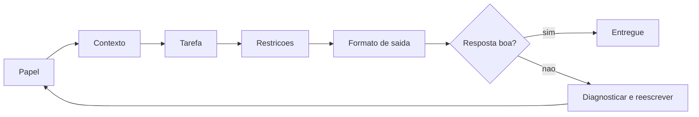

# Capítulo 10: Engenharia de instruções para iniciantes: falando a língua da IA

## 1. Introdução

No Capítulo 9, você montou o seu primeiro sistema operacional de IA — Tela, Harness, LLM e Tools funcionando juntos, de graça. Agora você vai aprender a operá-lo bem. Este capítulo é sobre a habilidade que separa quem tira valor da IA de quem briga com ela: a engenharia de instruções (prompt engineering). Você vai aprender o vocabulário essencial — contexto, restrições e objetivos claros —, as técnicas básicas dos guias oficiais da Anthropic e da OpenAI, e como reduzir alucinações e evitar os loops de erro que desanimam iniciantes.

Ao final deste capítulo, você será capaz de escrever instruções que produzem resultados consistentes; aplicar delimitadores, exemplos e raciocínio passo a passo; e diagnosticar por que uma resposta saiu errada — corrigindo a instrução, não o modelo.

## 2. Explica

### Os três ingredientes de uma boa instrução: contexto, restrições e objetivo

Os guias oficiais de engenharia de prompt convergem em uma lição central: um modelo de linguagem não conhece o seu projeto, a sua situação ou as suas convenções — ele só conhece o que você coloca na instrução [1][3]. A primeira regra é fornecer contexto rico: o que é o projeto, qual arquivo está em jogo, qual é o padrão existente, o que já foi tentado. A instrução vaga "me ajuda com esse código" produz uma resposta genérica; a instrução contextualizada "este arquivo valida e-mails no formato X, usando a biblioteca Y; adicione a regra Z mantendo o padrão de erros existente" produz uma resposta acionável [1][3]. A diferença não está no modelo — está na matéria-prima que você forneceu.

O segundo ingrediente é a restrição: delimitar o que a resposta deve respeitar. Os guias recomendam restrições positivas — dizer o que fazer em vez de apenas o que evitar — porque o modelo segue instruções afirmativas com mais consistência [1]. "Responda em português", "use apenas funções da biblioteca padrão", "gere código Python 3.12 sem dependências externas" são restrições que moldam a saída. O terceiro ingrediente é o objetivo claro: dizer o que conta como pronto. "Escreva uma função que valide e-mails e retorne True ou False" define o destino; sem objetivo, o modelo decide por conta própria — e cada modelo decide diferente [1][3]. Contexto, restrições e objetivo formam o trio que você vai usar em toda instrução daqui em diante.

### Estruturando a instrução: delimitadores e o método "descreva-exija"

A segunda camada da técnica é a estrutura. A Anthropic recomenda separar explicitamente as partes da instrução — contexto, documentos, tarefa — usando delimitadores como tags XML: `<context>`, `<instructions>`, `<documents>` [1]. A OpenAI recomenda o mesmo princípio com separadores claros [3]. A razão é simples: quando o modelo sabe exatamente o que é contexto e o que é instrução, ele obedece melhor e confunde menos — especialmente quando o conteúdo inclui texto que poderia ser lido como outra instrução. Para tarefas de extração e classificação, o método mais eficaz é o few-shot: fornecer de 3 a 5 exemplos completos de entrada e saída esperada, e o modelo replica o padrão com consistência impressionante [3][6].

A estrutura completa de uma instrução profissional tem cinco partes, e você pode memorizá-las como um checklist: papel ("você é um revisor de código"), contexto (o projeto e o problema), tarefa (o que fazer), restrições (como fazer — formato, idioma, ferramentas) e formato de saída (como entregar — lista, código, tabela) [1][3][8]. O esforço de escrever uma instrução estruturada é compensado na primeira resposta: você gasta um minuto a mais na frente e economiza vinte de ajuste depois. A survey acadêmica de engenharia de prompt sistematiza essas técnicas e confirma o efeito: instruções estruturadas mudam o resultado de forma mensurável [8].

### Raciocínio passo a passo: o chain-of-thought na prática

A terceira camada é o raciocínio. O artigo seminal de Wei e colaboradores (2022) mostrou que, quando instruídos a raciocinar passo a passo antes de responder, os modelos melhoram dramaticamente em problemas de lógica, matemática e planejamento — o chain-of-thought [4]. O mesmo princípio foi estendido ao modo zero-shot por Kojima e colaboradores: basta acrescentar a frase "vamos pensar passo a passo" para ativar o raciocínio [5]. Para o Aprendiz de Construtor, a aplicação prática é direta: quando a tarefa envolve várias etapas — depurar um erro, planejar uma feature, decidir entre abordagens — peça explicitamente que o modelo mostre o raciocínio antes da conclusão [4][5].

Uma extensão valiosa é o self-consistency: gerar várias cadeias de raciocínio e escolher a resposta mais consistente entre elas — técnica que melhora ainda mais a acurácia em tarefas de raciocínio [7]. Nos harnesses modernos, parte desse comportamento já vem embutida — muitos modelos têm modos de raciocínio que gastam tokens pensando antes de responder [16] — mas a instrução explícita continua sendo a alavanca que você controla. A regra prática: raciocínio passo a passo para problemas com passos; resposta direta para tarefas simples de formatação [4][7].

### Alucinações e loops de erro: por que acontecem e como evitar

A alucinação é o fenômeno em que o modelo gera afirmações falsas com total fluência — e ela acontece porque o modelo gera o texto estatisticamente mais provável, não o factualmente verificado [10]. As estratégias de mitigação documentadas nos guias oficiais são práticas: (1) fundamentar a resposta em fontes — fornecer documentos e pedir que o modelo responda exclusivamente com base neles, citando trechos (o princípio do RAG, retrieval-augmented generation) [1][9]; (2) permitir a recusa — instruir explicitamente que, se a resposta não estiver no contexto, o modelo deve declarar que não sabe, em vez de inventar [1]; (3) baixar a temperatura em tarefas factuais — menos aleatoriedade, mais determinismo [3]; (4) verificar — nunca aceitar a primeira resposta como verdade em fatos críticos [1][10].

Os loops de erro são o segundo vilão do iniciante: o modelo erra, você reexplica irritado, ele erra de novo, e a conversa vira um ciclo. A raiz do loop é quase sempre a instrução — contexto insuficiente, objetivo ambíguo ou restrição ausente [1][3]. A correção não é gritar com o modelo, é interromper o ciclo e reescrever a instrução com o checklist de cinco partes. A disciplina profissional é: no máximo duas tentativas por instrução; se a terceira falhar, pare, diagnostique a instrução (o que faltou: contexto? restrição? exemplo?) e reescreva do zero [1]. É essa pausa que quebra o loop — e é ela que você vai praticar na seção Aplica.

## 3. Ilustra

Pense numa receita de bolo transmitida a um cozinheiro novato por telefone. Se você disser apenas "faz um bolo aí", o resultado é imprevisível: ele usará os ingredientes que tiver, o forno que achar e o tempo que quiser — e o bolo pode até sair bom, mas não será o que você queria. Agora diga: "você vai fazer um bolo de chocolate para 8 pessoas (contexto); use a forma redonda e sem cobertura (restrição); o bolo deve ficar pronto em 40 minutos e com a casca dourada (objetivo); me confirme os ingredientes antes de começar (verificação)". O cozinheiro não ficou mais inteligente — ficou melhor informado. É exatamente assim com a LLM: instrução vaga produz resultado de loteria; instrução estruturada produz resultado de engenharia [1][3].

Como Aprendiz de Construtor, você reconhece aqui o desencantamento produtivo aplicado à comunicação: a "mágica" de obter respostas boas não está no modelo — está na qualidade da instrução que você escreve, e escrever instrução é uma habilidade treinável. O diagrama abaixo resume o checklist de cinco partes que você vai usar em toda instrução profissional.



## 4. Técnica

### O checklist na prática: da instrução vaga à instrução profissional

Vamos materializar a diferença entre instrução vaga e instrução estruturada. O código abaixo compara duas formas de pedir a mesma tarefa a um modelo — usando o padrão de chamada do Capítulo 8 com qualquer provedor gratuito [1][2]:

```python
def pedir(mensagens, base_url, api_key, modelo):
    import json
    import urllib.request
    payload = {
        "model": modelo,
        "messages": mensagens,
        "max_tokens": 300,
    }
    requisicao = urllib.request.Request(
        base_url.rstrip("/") + "/chat/completions",
        data=json.dumps(payload).encode("utf-8"),
        headers={"Content-Type": "application/json", "Authorization": f"Bearer {api_key}"},
        method="POST",
    )
    with urllib.request.urlopen(requisicao, timeout=60) as resposta:
        corpo = json.loads(resposta.read().decode("utf-8"))
    return corpo["choices"][0]["message"]["content"]


instrucao_vaga = [{"role": "user", "content": "me ajuda com um codigo de calculadora"}]

instrucao_estruturada = [
    {
        "role": "system",
        "content": (
            "Voce e um assistente de programacao para iniciantes. "
            "Responda em portugues. Entregue apenas o codigo Python completo, "
            "sem explicacoes antes ou depois."
        ),
    },
    {
        "role": "user",
        "content": (
            "Contexto: projeto de linha de comando, Python 3.12, sem dependencias externas. "
            "Tarefa: crie uma calculadora que soma, subtrai, multiplica e divide. "
            "Restricoes: use apenas funcoes e uma interface simples com input. "
            "Objetivo: o codigo deve rodar e pedir dois numeros e uma operacao."
        ),
    },
]

# teste com o provedor que voce configurou no capitulo 9
print("=== INSTRUCAO VAGA ===")
print(pedir(instrucao_vaga, "https://openrouter.ai/api/v1", "sua-chave", "openrouter/free"))
print("=== INSTRUCAO ESTRUTURADA ===")
print(pedir(instrucao_estruturada, "https://openrouter.ai/api/v1", "sua-chave", "openrouter/free"))
```

Rode com a sua chave e compare: a instrução estruturada devolve código pronto no formato certo; a vaga devolve uma resposta genérica com conversa, suposições e provavelmente código incompleto [1][3]. Esse experimento — o mesmo modelo, duas instruções, dois mundos — é a demonstração mais convincente do capítulo.

### Few-shot: ensinando pelo exemplo

O few-shot é a técnica mais eficaz para tarefas com formato definido: fornecer exemplos e pedir que o modelo siga o padrão [3][6]. Vamos testar com classificação de intenção — um caso clássico:

```python
def classificador_few_shot(nova_frase, base_url, api_key, modelo):
    exemplos = [
        {"role": "user", "content": "quero saber o preco do plano"},
        {"role": "assistant", "content": "intencao: preco"},
        {"role": "user", "content": "meu login nao funciona"},
        {"role": "assistant", "content": "intencao: suporte"},
        {"role": "user", "content": "cancele minha assinatura"},
        {"role": "assistant", "content": "intencao: cancelamento"},
    ]
    mensagens = exemplos + [{"role": "user", "content": nova_frase}]
    return pedir(mensagens, base_url, api_key, modelo)


for frase in ["como renovo o plano?", "a pagina esta fora do ar"]:
    print(f"{frase} -> {classificador_few_shot(frase, 'https://openrouter.ai/api/v1', 'sua-chave', 'openrouter/free')}")
```

Observe o padrão: o modelo não recebeu regras — recebeu três exemplos de entrada/saída e replicou o formato com alta consistência [6]. Essa é a técnica que você usará para extração de dados, formatação e qualquer tarefa de padrão fixo. No harness, os exemplos podem ir no arquivo de regras do projeto, valendo para todas as sessões [2][12].

### Chain-of-thought: o raciocínio passo a passo

Para tarefas de lógica, ative o raciocínio explícito [4][5]:

```python
def raciocinar(problema, base_url, api_key, modelo):
    mensagens = [
        {
            "role": "system",
            "content": "Resolva o problema passo a passo, mostrando cada etapa, e conclua com a resposta final.",
        },
        {"role": "user", "content": problema},
    ]
    return pedir(mensagens, base_url, api_key, modelo)


problema = (
    "Uma loja vende camisetas a 30 reais cada e frete gratis para compras "
    "acima de 100 reais. Quero comprar 4 camisetas e tenho 150 reais. "
    "Quanto sobra apos a compra?"
)
print(raciocinar(problema, "https://openrouter.ai/api/v1", "sua-chave", "openrouter/free"))
```

Compare com o mesmo problema sem a instrução de raciocínio e observe a diferença na qualidade da resposta: com chain-of-thought, o modelo mostra o caminho — e erros ficam visíveis e corrigíveis [4][5]. Essa transparência é o que transforma a resposta em algo auditável, em vez de uma afirmação a ser aceita ou rejeitada às cegas.

### O depurador de instruções: quando o loop de erro aparece

Para fechar, uma ferramenta mental implementada: o depurador de instruções, que quebra o loop de erro diagnosticando o que faltou [1][3]:

```python
def diagnosticar_instrucao(instrucao):
    """Identifica qual ingrediente da instrucao esta fraco ou ausente."""
    diagnostico = []
    if len(instrucao.split()) < 20:
        diagnostico.append("contexto: muito curto - descreva o projeto e o problema")
    if not any(palavra in instrucao.lower() for palavra in ("nao use", "apenas", "somente", "formato", "em portugues")):
        diagnostico.append("restricoes: nenhuma - defina o que a resposta deve respeitar")
    if not any(palavra in instrucao.lower() for palavra in ("objetivo", "resultado", "deve", "entrega")):
        diagnostico.append("objetivo: ausente - defina o que conta como pronto")
    if not diagnostico:
        diagnostico.append("instrucao razoavel; se ainda falhar, adicione um exemplo (few-shot)")
    return diagnostico


instrucao_ruim = "faz um codigo de banco ai"
for item in diagnosticar_instrucao(instrucao_ruim):
    print("-", item)
```

Essa heurística simples cristaliza o método: quando a resposta sai errada, você não tenta a sorte de novo — você diagnostica qual ingrediente faltou (contexto, restrição, objetivo, exemplo) e reescreve com precisão [1][3]. No máximo duas tentativas cegas; na terceira, diagnose — é essa disciplina que elimina os loops de erro da sua vida com IA.

### Saída estruturada: pedindo JSON e validando o contrato

Quando a resposta do modelo precisa ser processada por outro programa — um harness, um teste, um pipeline — a melhor prática é pedir uma saída estruturada (JSON) e validar o contrato antes de usar [3][19]. O formato elimina a ambiguidade da prosa e torna a resposta verificável por código. O exemplo abaixo pede uma análise estruturada, faz o parse e valida os campos esperados — o mesmo padrão que os harnesses usam para receber chamadas de ferramenta do modelo [19][3]:

```python
import json


def pedir_json(prompt, base_url, api_key, modelo):
    instrucao = (
        prompt + "\n\nResponda SOMENTE com um JSON valido contendo "
        "os campos: resumo (string), pontos (lista de strings), "
        "risco (numero entre 1 e 5)."
    )
    resposta = pedir(
        [{"role": "user", "content": instrucao}],
        base_url, api_key, modelo,
    )
    try:
        dados = json.loads(resposta)
    except json.JSONDecodeError:
        return {"erro": "resposta nao era JSON valido", "bruto": resposta[:120]}
    return validar_contrato(dados)


def validar_contrato(dados):
    esperados = {"resumo": str, "pontos": list, "risco": int}
    for campo, tipo in esperados.items():
        if campo not in dados or not isinstance(dados[campo], tipo):
            return {"erro": f"campo '{campo}' ausente ou com tipo errado"}
    if not 1 <= dados["risco"] <= 5:
        return {"erro": "campo 'risco' fora da faixa 1-5"}
    return {"ok": True, "dados": dados}


resultado = pedir_json(
    "Resuma em uma frase a vantagem de saidas estruturadas de IA.",
    "https://openrouter.ai/api/v1", "sua-chave", "openrouter/free",
)
print(json.dumps(resultado, ensure_ascii=False, indent=2))
```

A validação de contrato é a última linha de defesa contra o risco de saída não confiável: mesmo que o modelo devolva JSON malformado ou campos fora do padrão, o programa detecta e trata — em vez de quebrar silenciosamente [3][19]. Essa disciplina é o mesmo princípio do LLM05 (tratamento inadequado de saídas) que o Capítulo 12 aprofundará: o texto gerado pelo modelo é dado, não verdade — e dado se valida antes de usar [10][3].

### A instrução como artefato: versionando e iterando

Um hábito separa o iniciante que evolui do que fica parado: tratar a instrução como um artefato que merece versionamento, revisão e histórico — exatamente como um arquivo de código [1]. Na prática, isso significa três gestos simples. O primeiro é não guardar o prompt na cabeça: quando uma instrução funciona bem, salve-a num arquivo de texto dentro do projeto, com um comentário de para que serve e quando foi usada. O segundo é versionar: se você usa git, o arquivo de instruções entra no repositório como qualquer outro, e cada ajuste vira um commit com mensagem explicando a mudança — foi o contexto que faltava, foi a restrição que não estava clara, foi o exemplo que funcionou [6]. O terceiro é revisar: uma vez por semana, olhe as instruções que você usou e pergunte qual delas produziu o melhor resultado e por quê.

Esse ciclo de iteração é a mesma lógica do desenvolvimento orientado a testes aplicada a texto: você escreve a instrução, observa a saída, avalia o desvio e ajusta — repetindo até o comportamento esperado estabilizar [11]. O erro mais comum do iniciante é acreditar que a instrução boa nasce pronta; a verdade é que ela nasce de tentativas documentadas, e é o documento que permite aprender com cada tentativa [15]. Um atalho valioso é manter uma pasta de instruções-modelo: cada nova tarefa começa copiando a instrução mais parecida já validada, ajustando apenas a parte que muda. Esse reuso gradual transforma a engenharia de instruções de esforço solitário em acervo pessoal que cresce com você — e é o mesmo princípio das skills que os harnesses profissionais oferecem, só que no seu próprio ritmo [18].

Por fim, adote um critério de qualidade objetivo para fechar o ciclo: a instrução está boa quando, sem nenhuma mudança sua, a segunda execução produz o mesmo resultado da primeira. Se você precisa repetir correções manuais, é a instrução que precisa de ajuste, não a sua paciência. Esse critério de reprodutibilidade transforma um hábito subjetivo em métrica — e é a ponte entre o que você aprendeu neste capítulo e a automação segura que o Capítulo 12 descreve [10][3].

## 5. Aplica

### A cena de contraste: a noite de frustração e a correção em cinco minutos

Imagine a cena. Você está no seu primeiro projeto real com o harness configurado no Capítulo 9. São 23h, o prazo da entrega é amanhã, e você pediu à IA: "faz a página de login". O resultado: um código com bibliotecas que você não instalou, em inglês, com um banco de dados que o projeto não usa. Você responde "não, eu quero com flask", a IA devolve outra coisa; você tenta "tá errado, o projeto usa sqlite", e o ciclo se repete por uma hora — o loop de erro clássico, amplificado pelo cansaço. Você está prestes a desistir e "fazer na mão".

Então você para, respira e aplica o método do capítulo. Reescreve a instrução com o checklist: papel ("você é um assistente deste projeto"), contexto ("o projeto é uma aplicação flask em Python 3.12 com banco sqlite, na pasta app/"), tarefa ("crie a rota de login com autenticação simples por e-mail e senha"), restrições ("use apenas flask e sqlite, siga o padrão de rotas já existente, responda em português") e formato ("entregue o código do arquivo e os comandos para testar"). Na primeira tentativa, a resposta está alinhada; na segunda, ajustada; em cinco minutos, o login funciona. A diferença entre a noite de frustração e a entrega no prazo foi uma instrução estruturada [1][3].

O diagnóstico: o loop de erro não era culpa do modelo — era a ausência dos três ingredientes (contexto, restrições, objetivo), somada à tentativa de "gritar" com a IA em vez de reescrever a instrução. A correção é exatamente a disciplina praticada: interromper o ciclo, diagnosticar com o checklist e reescrever do zero [1]. No mercado, essa é a habilidade que define produtividade real com IA: não é quem pede mais, é quem pede melhor.

Síntese das armadilhas comuns: (1) instrução vaga — "me ajuda" produz resposta de loteria [1]; (2) reexplicar em vez de reescrever — cada nova tentativa deve ser uma instrução melhor, não mais alta; (3) aceitar a primeira resposta sem verificar — especialmente em fatos, números e APIs [10]; (4) ignorar o formato de saída — pedir o formato certo evita metade dos ajustes [3]; (5) não usar exemplos — few-shot resolve tarefas de padrão em segundos [6].

## 6. Conclusão

Você aprendeu a habilidade que multiplica o valor de tudo o que construiu nos capítulos anteriores. Os três pontos deste capítulo: primeiro, uma boa instrução tem três ingredientes — contexto, restrições e objetivo — e uma boa estrutura tem cinco partes — papel, contexto, tarefa, restrições e formato de saída [1][3]; segundo, existem três técnicas de força — delimitadores para separar as partes, few-shot para ensinar pelo exemplo e chain-of-thought para ativar o raciocínio passo a passo [1][3][4][6]; terceiro, alucinações e loops de erro se combatem com método — fundamentação em fontes, permissão de recusa, temperatura baixa e o depurador de instruções que quebra o ciclo [1][9][10].

O desafio desta etapa: refaça o experimento de comparação da seção Técnica (instrução vaga vs. estruturada) com o seu provedor gratuito e guarde os dois resultados. Depois, use o depurador de instruções numa instrução real que você escreveu — e reescreva-a com o checklist completo.

No próximo capítulo, tudo se encontra: o seu primeiro projeto guiado — uma aplicação completa do início ao fim, usando as 4 camadas, a configuração do Capítulo 9 e as instruções deste capítulo, com leitura de logs, aceitação/rejeição de alterações e depuração de problemas.

## 7. Referências Bibliográficas

[1] ANTHROPIC. *Prompt Engineering Overview*. São Francisco: Anthropic, 2025. Disponível em: https://platform.claude.com/docs/en/build-with-claude/prompt-engineering/overview. Acesso em: 5 ago. 2026.

[2] ANTHROPIC. *Prompt Engineering Interactive Tutorial*. São Francisco: Anthropic, 2025. Disponível em: https://github.com/anthropics/prompt-eng-interactive-tutorial. Acesso em: 5 ago. 2026.

[3] OPENAI. *Best Practices for Prompt Engineering with the OpenAI API*. San Francisco: OpenAI, 2024. Disponível em: https://help.openai.com/en/articles/6654000-best-practices-for-prompt-engineering-with-openai-api. Acesso em: 5 ago. 2026.

[4] WEI, Jason; WANG, Xuezhi; SCHUURMANS, Dale; et al. Chain-of-Thought Prompting Elicits Reasoning in Large Language Models. *Advances in Neural Information Processing Systems*, v. 35, 2022.

[5] KOJIMA, Takeshi; GU, Shixiang; REID, Machel; et al. Large Language Models Are Zero-Shot Reasoners. *Advances in Neural Information Processing Systems*, v. 35, 2022.

[6] BROWN, Tom; MANN, Benjamin; RYDER, Nick; et al. Language Models Are Few-Shot Learners. *Advances in Neural Information Processing Systems*, v. 33, 2020.

[7] MENICK, Xuezhi; WANG, Kyle; SHI, Jerry; et al. Self-Consistency Improves Chain of Thought Reasoning in Language Models. *International Conference on Learning Representations*, 2022.

[8] SAHOO, Pranab; SINGH, Ayush; SRIPADA, Sriparna; et al. *A Systematic Survey of Prompt Engineering in Large Language Models*. arXiv:2402.07927, 2024.

[9] LEWIS, Patrick; PEREZ, Ethan; PIKTUS, Aleksandra; et al. Retrieval-Augmented Generation for Knowledge-Intensive NLP Tasks. *Advances in Neural Information Processing Systems*, v. 33, 2020.

[10] HUANG, Lei; YU, Weijiang; MA, Weitao; et al. *A Survey on Hallucination in Large Language Models: Principles, Taxonomy, Challenges, and Open Questions*. arXiv:2311.05232, 2023.

[11] LIU, Nelson; LIN, Kevin; HEWITT, John; et al. Lost in the Middle: How Language Models Use Long Contexts. *Transactions of the Association for Computational Linguistics*, v. 12, p. 157-173, 2023.

[12] ANTHROPIC. *Building Effective Agents*. São Francisco: Anthropic, 2024. Disponível em: https://www.anthropic.com/research/building-effective-agents. Acesso em: 5 ago. 2026.

[13] ANTHROPIC. *Effective Context Engineering for AI Agents*. São Francisco: Anthropic, 2025. Disponível em: https://www.anthropic.com/research/effective-context-engineering-for-ai-agents. Acesso em: 5 ago. 2026.

[14] LIU, Pengfei; YUAN, Weizhe; FU, Jinlan; et al. Pre-train, Prompt, and Predict: A Systematic Survey of Prompting Methods in Natural Language Processing. *ACM Computing Surveys*, v. 55, n. 9, p. 1-35, 2023.

[15] OPENAI. *GPT-4 Technical Report*. arXiv:2303.08774, 2023.

[16] ANTHROPIC. *Introducing the Claude 3 Family*. São Francisco: Anthropic, 2024. Disponível em: https://www.anthropic.com/news/claude-3-family. Acesso em: 5 ago. 2026.

[17] GOOGLE. *Gemini API — Prompting Guide*. Mountain View: Google, 2025. Disponível em: https://ai.google.dev/gemini-api/docs/prompting-intro. Acesso em: 5 ago. 2026.

[18] WEI, Jason; TAY, Yi; BOMMASANI, Rishi; et al. Emergent Abilities of Large Language Models. *Transactions on Machine Learning Research*, 2022.

[19] OPENAI. *Function Calling Documentation*. San Francisco: OpenAI, 2025. Disponível em: https://platform.openai.com/docs/guides/function-calling. Acesso em: 5 ago. 2026.

[20] ANTHROPIC. *Writing Effective Tools*. São Francisco: Anthropic, 2025. Disponível em: https://www.anthropic.com/research/writing-effective-tools. Acesso em: 5 ago. 2026.
