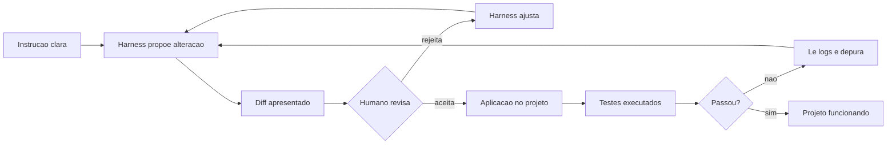

# Capítulo 11: Seu primeiro projeto guiado: das 4 camadas ao aplicativo funcionando

## 1. Introdução

No Capítulo 10, você aprendeu a falar a língua da IA — contexto, restrições, objetivos e o checklist de cinco partes. Agora chegou o momento de juntar tudo o que o livro construiu: o seu primeiro projeto completo, do início ao fim, usando as 4 camadas. Este capítulo é um guia de mão na massa: você vai criar uma aplicação simples — um gerenciador de tarefas de linha de comando — usando o harness e o modelo configurados no Capítulo 9, com instruções do Capítulo 10. E vai aprender as três habilidades de operação que faltavam: ler os logs do harness, aceitar ou rejeitar alterações propostas e depurar problemas quando as coisas saírem do trilho.

Ao final deste capítulo, você terá um projeto real funcionando — não um exercício — e um método repetível para construir os próximos. A meta não é o código em si, é o fluxo: você vai experimentar, pela primeira vez, a sensação de operar um sistema completo de IA assistida.

## 2. Explica

### O projeto: um gerenciador de tarefas com escopo de iniciante

O projeto escolhido tem um propósito pedagógico preciso: ser simples o suficiente para caber num capítulo e rico o suficiente para exercitar as 4 camadas e as ferramentas. Um gerenciador de tarefas de linha de comando em Python — adicionar, listar, concluir e remover tarefas, persistidas num arquivo JSON — cobre exatamente esse espectro [1][16]. Ele exige leitura e escrita de arquivos (Tools), execução de comandos no terminal (Tools), instruções claras (Capítulo 10) e, quando você evoluir o projeto nos exercícios, uma interface web (Tela avançada) e até uma API [1][16][4].

O escopo de iniciante é uma decisão deliberada, e há três regras que o protegem: (1) comece com uma versão mínima que funciona (o mínimo viável), e só depois adicione features; (2) mantenha o projeto num repositório git desde o primeiro comando, para que cada alteração seja rastreável; (3) aceite apenas uma feature por vez — o harness propõe, você revisa e valida [2][3][12]. Essas regras não são burocráticas: são a mesma disciplina de supervisão que você estudou nos capítulos 6 e 12, aplicada na escala do primeiro projeto.

### O fluxo de trabalho com o harness: instrução, geração, aplicação e teste

O fluxo de trabalho que você vai seguir tem quatro fases, e cada uma corresponde a uma pergunta. A instrução: o que exatamente você quer que o harness faça — descrito com o checklist do Capítulo 10 [1][12]. A geração: o harness propõe a alteração — arquivos novos, código, comandos — e você a vê antes de aceitar [2][3]. A aplicação: você aceita (ou rejeita) a alteração, e o harness a aplica ao projeto [3][12]. O teste: você roda o código e verifica que funciona — com testes simples de `assert` ou rodando o programa [1][4]. A sequência é sempre a mesma, e a disciplina está em não pular fases: instrução sem teste gera código não verificado; teste sem instrução vira adivinhação [12].

Cada fase tem artefatos observáveis — o que você vê no harness: o plano proposto, o diff das alterações, os comandos que serão executados, os resultados dos testes [2][3]. É lendo esses artefatos que você aprende a operar: o harness mostra o processo, e o processo é onde está o controle [3][12]. Este capítulo modela esse fluxo de forma explícita: primeiro como método, depois como prática, depois como depuração.

### Lendo logs: a conversa entre as camadas

Os logs do harness são o registro da conversa entre as camadas — cada chamada de ferramenta, cada arquivo lido, cada comando executado, cada resposta do modelo [2][3]. Para o iniciante, ler logs é a habilidade que separa "operação às cegas" de "operação consciente". As linhas que você vai aprender a reconhecer: as chamadas de ferramenta (o harness executou `ler_arquivo`, `escrever_arquivo`, `terminal`), os resultados (sucesso ou erro de cada chamada), as respostas do modelo (o raciocínio e as decisões) e os eventos de supervisão (alterações propostas para sua aprovação) [3][12]. Quando algo der errado, é no log que está o rastro — e o método de diagnóstico por camada do Capítulo 5 se aplica: o erro está na Tela (pedido), no Harness (contexto/permissoes), na LLM (resposta) ou nas Tools (execução) [4][13].

### Aceitando e rejeitando alterações: a supervisão na prática

A supervisão humana — o humano no loop — é o que transforma um gerador de texto em uma ferramenta de engenharia [1][12]. Na prática, isso significa: antes de aceitar qualquer alteração proposta pelo harness, você a examina com três perguntas: (1) o que mudou? — leia o diff, arquivo por arquivo [2][14]; (2) por que mudou? — a alteração corresponde à instrução que você deu? [12]; (3) quebraria algo? — a alteração respeita o código existente, as convenções e os testes? [1]. Rejeitar não é um fracasso — é parte do trabalho: o harness ajusta, propõe de novo, e você reavalia [12]. A regra de ouro que você levará daqui: nunca aceite uma alteração que você não entende; se não entende, peça explicação — o harness explica — e só então decida [1][3].

## 3. Ilustra

Pense no ensaio de uma banda antes do primeiro show. O produtor (você) propõe uma música nova (a instrução). O guitarrista (o harness) arranja os acordes e mostra para a banda (o diff): "vou tocar assim, com esta introdução e este ritmo". A banda ensaia (os testes). Você ouve, ajusta um trecho ou aprova. E se algo soa estranho, você volta ao registro do ensaio (os logs) — quem tocou fora do tempo, onde começou a dissonância — e corrige o trecho, não a banda inteira. É exatamente esse o fluxo do capítulo: propor, mostrar, testar, revisar, registrar — e depurar pelo rastro, não pelo achismo [2][3][12].

Como Aprendiz de Construtor, você está prestes a fazer o primeiro show: um projeto real, construído com as 4 camadas que você desmontou ao longo do livro inteiro. O diagrama abaixo mostra o fluxo de trabalho completo, com os artefatos observáveis em cada fase.



## 4. Técnica

### Fase 1 e 2: a instrução e a primeira geração

O projeto começa com a instrução estruturada — o checklist do Capítulo 10 aplicado ao harness [1][12]. Crie a pasta do projeto e escreva a instrução como um arquivo de tarefa, para que ela seja clara e reutilizável:

```bash
mkdir -p meu-projeto && cd meu-projeto
git init

cat > TAREFA.md << 'FIM'
# Tarefa 1 - versao minima do gerenciador de tarefas

Papel: voce e um assistente deste projeto, respondendo em portugues.

Contexto: projeto python 3.12 sem dependencias externas, na pasta atual,
com git inicializado. Vamos construir um gerenciador de tarefas de linha
de comando.

Tarefa: crie o arquivo tarefas.py com as funcoes adicionar, listar,
concluir e remover. As tarefas ficam salvas em um arquivo tarefas.json.

Restricoes: use apenas a biblioteca padrao. O arquivo tarefas.json deve
ser criado automaticamente se nao existir. Respeite o idioma portugues
nas mensagens do programa.

Formato de saida: entregue o codigo completo de tarefas.py e os comandos
para testar cada funcao.
FIM
```

Agora peça ao harness que execute a tarefa, no modo não interativo, apontando para o arquivo de instrução [2][5]:

```bash
opencode run "leia TAREFA.md e implemente exatamente o que ela pede"
```

O artefato desta fase é o plano e o diff propostos: o harness anuncia os arquivos que vai criar e as funções que vai implementar, e apresenta a alteração para sua revisão [2][3][12]. Antes de aceitar, leia o diff com as três perguntas da seção Explica — o que mudou, por que mudou, o que pode quebrar [12][14].

### Fase 3 e 4: aplicar, rodar e testar

Com a alteração aceita e aplicada, a fase de teste verifica o funcionamento real — rodando o programa e validando cada função [1][16]. Os comandos abaixo exercitam o ciclo completo:

```bash
# Fase 3: aplicar a alteracao proposta (ja feita no passo anterior)
# Fase 4: testar cada funcao do gerenciador
python tarefas.py adicionar "ler o capitulo 11"
python tarefas.py adicionar "revisar o projeto"
python tarefas.py listar
python tarefas.py concluir 1
python tarefas.py listar
```

Cada comando é um teste objetivo: adicionar cria, listar mostra, concluir marca. Se alguma resposta for inesperada — por exemplo, "concluir" não muda a lista — é hora da fase de depuração. Para automatizar a verificação, escreva um teste que não dependa de digitação manual [1][4]:

```python
import json
import os
import subprocess
import sys


def limpar_estado():
    if os.path.exists("tarefas.json"):
        os.remove("tarefas.json")


def executar(*argumentos):
    return subprocess.run(
        [sys.executable, "tarefas.py", *argumentos],
        capture_output=True, text=True, encoding="utf-8",
    )


def testar_gerenciador():
    limpar_estado()
    saida = executar("adicionar", "primeira tarefa")
    assert saida.returncode == 0, saida.stderr
    executar("adicionar", "segunda tarefa")
    lista = executar("listar").stdout
    assert "primeira tarefa" in lista and "segunda tarefa" in lista
    executar("concluir", "1")
    final = executar("listar").stdout
    assert "[x]" in final
    print("gerenciador de tarefas: OK")


testar_gerenciador()
```

Rode o teste: se passar, o mínimo viável está pronto e verificado [4]. Esse é o padrão que você repetirá em todos os projetos: funcionalidade + teste objetivo = feature entregue.

### Evolução com supervisão: uma feature por vez

Com o mínimo viável funcionando, o fluxo de evolução é uma feature por vez, sempre com o mesmo ciclo [12]. A primeira evolução sugerida: adicionar prioridade (alta, média, baixa) às tarefas. A instrução da segunda tarefa:

```bash
cat > TAREFA2.md << 'FIM'
# Tarefa 2 - prioridade nas tarefas

Contexto: o arquivo tarefas.py existe e funciona, com testes em testar.py.
Tarefa: adicione suporte a prioridade (alta, media, baixa) na funcao
adicionar e mostre a prioridade na listagem.
Restricoes: mantenha compatibilidade com os comandos existentes; o
formato do tarefas.json pode evoluir, mas tarefas antigas continuam
funcionando.
Formato de saida: entregue o diff das mudancas e os comandos de teste.
FIM

opencode run "leia TAREFA2.md e implemente exatamente o que ela pede"
python tarefas.py adicionar "revisar testes" --prioridade alta
python tarefas.py listar
python testar.py
```

Observe o fluxo completo de novo: instrução clara, proposta revisada, aplicação, testes. A regra de uma feature por vez é o que mantém cada etapa auditável: quando um teste falha, você sabe exatamente qual alteração introduziu o problema [12][14].

### Depurando com os logs: o caso do arquivo que não existia

A última habilidade técnica do capítulo é a depuração guiada pelos logs. Imagine o cenário: você pediu uma feature nova, o harness disse que implementou, mas o teste falha. Em vez de reler o código inteiro, você segue o rastro dos logs — e descobre, por exemplo, que o harness criou um arquivo de configuração num caminho diferente do esperado [2][3]. O método de depuração tem quatro passos:

```bash
# Passo 1: reproduzir o erro e ver a mensagem exata
python testar.py 2>&1 | tail -5

# Passo 2: consultar o log da sessao do harness (comando varia por ferramenta)
opencode run "liste os arquivos que voce criou neste projeto e seus caminhos"

# Passo 3: verificar o estado real do projeto
find . -name "*.json" -o -name "*.py" | sort

# Passo 4: pedir a correcao com a evidencia em maos
opencode run "o teste espera o arquivo em config.json mas ele esta em dados.json; corrija o caminho"
```

O padrão é o mesmo do diagnóstico por camada: reproduzir (o erro é real?), localizar (qual camada falhou — caminho errado é Tools/arquivos, comportamento errado é LLM/instrução), corrigir com evidência (a instrução de correção cita o achado) [4][13]. Esse ciclo — reproduzir, localizar, corrigir, verificar — é o método de depuração que você usará profissionalmente, com IA ou sem ela [13].

### O diário de desenvolvimento: documentando decisões com o harness

Todo projeto profissional acumula um tipo de memória que o código não carrega: as decisões — por que uma abordagem foi escolhida, o que foi tentado antes e o que não funcionou [3][6]. O harness lembra da sessão, mas a memória do projeto pertence ao projeto: registrar cada decisão num arquivo versionado cria o histórico que orienta as próximas instruções [6][2]. O registro abaixo anexa entradas estruturadas a um arquivo de decisões do projeto — o hábito que transforma projetos individuais em projetos sustentáveis [2][3]:

```python
from datetime import datetime


class DiarioDeDecisoes:
    def __init__(self, caminho="DECISOES.md"):
        self.caminho = caminho

    def registrar(self, decisao, contexto, alternativa_rejeitada=""):
        entrada = (
            f"## {datetime.now().strftime('%d/%m/%Y')} - {decisao}\n\n"
            f"- contexto: {contexto}\n"
        )
        if alternativa_rejeitada:
            entrada += f"- alternativa rejeitada: {alternativa_rejeitada}\n"
        try:
            with open(self.caminho, "a", encoding="utf-8") as arquivo:
                arquivo.write(entrada + "\n")
            return True
        except OSError:
            return False

    def resumo(self):
        try:
            conteudo = open(self.caminho, encoding="utf-8").read()
        except OSError:
            return "diario ainda nao criado"
        titulos = [linha for linha in conteudo.splitlines() if linha.startswith("## ")]
        return f"{len(titulos)} decisoes registradas"


diario = DiarioDeDecisoes()
diario.registrar(
    decisao="armazenar tarefas em JSON",
    contexto="projeto exige persistencia simples sem banco de dados",
    alternativa_rejeitada="usar sqlite (complexidade desnecessaria nesta fase)",
)
diario.registrar(
    decisao="uma feature por ciclo de revisao",
    contexto="falhas de teste ficaram mais faceis de localizar",
)
print(diario.resumo())
print(open("DECISOES.md", encoding="utf-8").read())
```

O diário cumpre duas funções que se reforçam: para você, é a memória de longo prazo que evita repetir decisões já tomadas; para a IA, é contexto de primeira qualidade — um projeto com histórico documentado produz instruções melhores e respostas mais alinhadas [2][3]. É também o hábito que o Capítulo 12 transforma em regra: um projeto registrado é um projeto auditável e revertível [6].

### O esqueleto reutilizável: do projeto único à coleção de padrões

Ao terminar o gerenciador de tarefas, o maior valor não é o aplicativo em si — é o esqueleto de trabalho que ele deixou para trás. Todo projeto assistido bem-sucedido tende a repetir a mesma ossatura: uma pasta de instruções (`INSTRUCOES.md` ou `AGENTS.md`), um arquivo de contexto com a visão do projeto, um script de verificação rápida e o diário de decisões que você construiu neste capítulo [4]. Reconhecer esse padrão é o que transforma a experiência isolada em método reutilizável: no próximo projeto, você começa copiando a estrutura que já funcionou, em vez de recomeçar do zero [9].

O primeiro componente do esqueleto é a instrução de arranque: um texto curto que diz ao harness quem você é, qual é o objetivo do projeto e quais são as restrições não negociáveis (linguagem, formato de saída, proibições). Escrever esse texto uma única vez, com calma, economiza dezenas de instruções repetidas ao longo da vida do projeto — cada mensagem futura já nasce com contexto suficiente [12]. O segundo componente é o teste de fumaça: um comando simples que valida se tudo continua de pé após cada mudança. No gerenciador de tarefas, foi rodar o script e conferir a saída; em projetos maiores, será rodar a suíte de testes. O terceiro é o diário, que você já conhece: a memória que impede o retrabalho.

A partir daí, a evolução é incremental: cada projeto concluído devolve um padrão melhorado para a sua coleção pessoal. Um dia, esse acervo de esqueletos é o que separa o usuário do assistente do profissional que projeta fluxos de trabalho assistidos — o mesmo caminho que os harnesses profissionais formalizam com templates e bibliotecas de instruções [17]. O conselho prático para fechar: depois de publicar o projeto, reserve meia hora para escrever o que funcionou, o que travou e o que você mudaria — esse relatório de uma página é o seu primeiro item de acervo e o seu primeiro passo rumo à maestria [20][2].

## 5. Aplica

### A cena de contraste: aceitar às cegas e o bug que foi para produção

Imagine a cena. Empolgado com a velocidade do harness, você decide acelerar: em vez de revisar cada diff, você aceita as alterações em sequência, "porque o harness é bom mesmo". Na terceira feature, um teste quebra, mas o prazo aperta e você aceita assim mesmo, confiando no modelo. Na semana seguinte, a aplicação é usada por pessoas reais — e um dos relatórios do sistema sai com os números errados, porque a feature aceita às cegas tinha uma lógica de soma com ordem trocada. O bug não veio da IA: veio da ausência de supervisão humana no fluxo que você mesmo montou [1][12]. O custo de aceitar sem entender é pago em produção — onde é caro [2].

O diagnóstico, ligado à teoria do capítulo: a supervisão não é um detalhe do fluxo — é a fase que transforma geração em engenharia [1][12]. A correção é o método que você praticou: revisar cada diff com as três perguntas (o que mudou, por que, o que quebra), rodar os testes antes de aceitar, e rejeitar com pedido de explicação quando algo não ficar claro [12][14]. No mercado, essa disciplina separa times que usam IA como alavanca de times que usam IA como roleta: os primeiros revisam e testam, os segundos aceitam e pagam depois [2][3].

Síntese das armadilhas comuns: (1) aceitar alterações sem ler o diff — a supervisão é a fase que você não pode pular [12]; (2) adicionar features demais de uma vez — uma por vez mantém a auditoria possível [12]; (3) ignorar os logs na depuração — o rastro está lá, use-o [3]; (4) não ter teste objetivo — "funciona na minha máquina" não é verificação [4]; (5) pedir correção sem evidência — "está errado" é instrução fraca; "o teste espera X e encontrou Y" é instrução forte [1][13].

## 6. Conclusão

Seu primeiro projeto está de pé — e, com ele, o fluxo completo que este livro prometeu. Os três pontos deste capítulo: primeiro, o fluxo de trabalho tem quatro fases — instrução, geração, aplicação e teste — e cada uma tem um artefato observável [1][12]; segundo, a supervisão humana é a fase decisiva — revisar o diff, rodar os testes e rejeitar o que não se entende transforma geração em engenharia [12][14]; terceiro, a depuração segue o rastro — logs do harness, diagnóstico por camada e correção com evidência [3][4][13].

O desafio desta etapa: adicione uma terceira feature ao gerenciador — por exemplo, filtro por prioridade ou data de criação — seguindo o ciclo completo: instrução, proposta, revisão, teste. Depois, simule um bug (altere uma linha do código) e pratique o método de depuração com os logs até localizar a causa.

No próximo capítulo, o livro se fecha com as bases para continuar: segurança e privacidade no uso de IA, os limites das ferramentas e o mapa de evolução para seguir crescendo no ecossistema depois deste guia.

## 7. Referências Bibliográficas

[1] ANTHROPIC. *Prompt Engineering Overview*. São Francisco: Anthropic, 2025. Disponível em: https://platform.claude.com/docs/en/build-with-claude/prompt-engineering/overview. Acesso em: 5 ago. 2026.

[2] ANTHROPIC. *Claude Code Overview*. São Francisco: Anthropic, 2025. Disponível em: https://platform.claude.com/docs/en/claude-code/overview. Acesso em: 5 ago. 2026.

[3] ANTHROPIC. *Claude Code Best Practices*. São Francisco: Anthropic, 2025. Disponível em: https://www.anthropic.com/engineering/claude-code-best-practices. Acesso em: 5 ago. 2026.

[4] PYTHON SOFTWARE FOUNDATION. *The Python Tutorial*. 2025. Disponível em: https://docs.python.org/3/tutorial/. Acesso em: 5 ago. 2026.

[5] OPENCODE. *Documentation*. São Francisco: SST, 2025. Disponível em: https://opencode.ai/docs. Acesso em: 5 ago. 2026.

[6] CHACON, Scott; STRAUB, Ben. *Pro Git*. 2. ed. Nova York: Apress, 2014.

[7] MICROSOFT. *Visual Studio Code Documentation*. Redmond: Microsoft, 2025. Disponível em: https://code.visualstudio.com/docs. Acesso em: 5 ago. 2026.

[8] MOZILLA. *HTTP — MDN Web Docs*. 2025. Disponível em: https://developer.mozilla.org/en-US/docs/Web/HTTP. Acesso em: 5 ago. 2026.

[9] GNU PROJECT. *Bash Reference Manual*. Boston: Free Software Foundation, 2023. Disponível em: https://www.gnu.org/software/bash/manual/. Acesso em: 5 ago. 2026.

[10] OLLAMA. *Ollama Documentation*. 2025. Disponível em: https://ollama.com/docs. Acesso em: 5 ago. 2026.

[11] OPENROUTER. *OpenRouter Documentation*. 2025. Disponível em: https://openrouter.ai/docs. Acesso em: 5 ago. 2026.

[12] ANTHROPIC. *Building Effective Agents*. São Francisco: Anthropic, 2024. Disponível em: https://www.anthropic.com/research/building-effective-agents. Acesso em: 5 ago. 2026.

[13] LIU, Nelson; LIN, Kevin; HEWITT, John; et al. Lost in the Middle: How Language Models Use Long Contexts. *Transactions of the Association for Computational Linguistics*, v. 12, p. 157-173, 2023.

[14] HUANG, Lei; YU, Weijiang; MA, Weitao; et al. *A Survey on Hallucination in Large Language Models: Principles, Taxonomy, Challenges, and Open Questions*. arXiv:2311.05232, 2023.

[15] PENG, Sida; KALLIAMVAKOU, Eirini; CITHON, Patrice; DEMIRER, Mert. *The Impact of AI on Developer Productivity: Evidence from GitHub Copilot*. arXiv:2302.06590, 2023.

[16] JSON. *Introducing JSON*. 2025. Disponível em: https://www.json.org/json-en.html. Acesso em: 5 ago. 2026.

[17] PYTHON SOFTWARE FOUNDATION. *venv — Creation of Virtual Environments*. 2025. Disponível em: https://docs.python.org/3/library/venv.html. Acesso em: 5 ago. 2026.

[18] FLASK. *Flask Documentation*. 2025. Disponível em: https://flask.palletsprojects.com/. Acesso em: 5 ago. 2026.

[19] ANTHROPIC. *Effective Context Engineering for AI Agents*. São Francisco: Anthropic, 2025. Disponível em: https://www.anthropic.com/research/effective-context-engineering-for-ai-agents. Acesso em: 5 ago. 2026.

[20] STACK OVERFLOW. *Developer Survey 2024*. Nova York: Stack Overflow, 2024. Disponível em: https://survey.stackoverflow.co/2024/. Acesso em: 5 ago. 2026.
