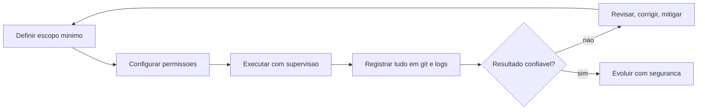

# Capítulo 12: O futuro da criação com IA: segurança, privacidade e próximos passos

## 1. Introdução

No Capítulo 11, você construiu seu primeiro projeto completo com as 4 camadas. Agora o livro se fecha com as duas fundações que sustentam o uso profissional de IA no longo prazo: a segurança e a privacidade — as boas práticas que protegem você, seus dados e seus projetos — e a consciência dos limites das ferramentas, que evita expectativas irrealistas e decisões perigosas. Para terminar, o capítulo traça o mapa de evolução: os próximos passos para continuar crescendo no ecossistema depois deste guia.

Ao final deste capítulo, você será capaz de aplicar as práticas essenciais de segurança no uso de agentes de código — menor privilégio, proteção de credenciais, fluxos de aprovação; reconhecer os riscos documentados da área (o OWASP Top 10 para LLMs, o framework de risco do NIST); e desenhar um plano pessoal de evolução para os próximos meses.

## 2. Explica

### Segurança e privacidade: dados, permissões e boas práticas

Quando você opera um agente de IA com acesso ao seu projeto, você está concedendo a um sistema automatizado a capacidade de ler, escrever e executar no seu ambiente — e essa concessão exige disciplina [1][3]. O princípio mais importante, importado da segurança clássica, é o do menor privilégio: conceda ao agente apenas as ferramentas e permissões necessárias para a tarefa — se ele só precisa ler arquivos, não dê permissão de exclusão; se só precisa rodar testes, não deixe comandos de produção no alcance [1][12]. O OWASP, no Top 10 para aplicações de LLM, nomeia exatamente esse risco: LLM06, agência excessiva — dar autonomia ou permissões demais ao agente é uma das dez principais vulnerabilidades [2].

A proteção de dados é a segunda frente. Credenciais — chaves de API, tokens, senhas — nunca devem entrar em prompts, no código versionado ou em arquivos enviados a terceiros [3][14]. O hábito que você praticou no Capítulo 8 — variável de ambiente e arquivos fora do git — é a regra profissional. Além das credenciais, os dados sensíveis do projeto (dados pessoais, segredos comerciais, informações de clientes) precisam de tratamento consciente: antes de enviar contexto para um provedor na nuvem, pergunte-se se aquilo deveria sair do seu ambiente — e prefira modelos locais (Ollama) quando a resposta for não [3][10][12]. O OWASP nomeia o risco como LLM02, divulgação de informações sensíveis [2].

### Limites das ferramentas: quando a IA erra e como mitigar

O segundo pilar é a consciência dos limites — saber o que a IA não é, para não confiar demais onde ela falha. Os limites documentados são concretos: o modelo pode gerar afirmações factualmente falsas com total fluência — a alucinação, catalogada como LLM09 (desinformação) no OWASP [2][13]; ele pode ser manipulado por instruções maliciosas embutidas em textos que lê — a injeção de prompt (LLM01), que pode vir de um arquivo ou site que o agente processa [2]; e ele pode tratar inadequadamente saídas — se você pega o texto gerado e o injeta direto numa página ou banco sem sanitização, cria as mesmas vulnerabilidades clássicas (XSS, SQL injection), o LLM05 [2]. Nenhum desses limites é mistério: são consequências da arquitetura que você estudou nos Capítulos 2 e 3 — o modelo gera o texto mais provável, não o mais verdadeiro ou o mais seguro [13].

A mitigação é uma combinação de técnica e processo. No plano técnico: fundamentar respostas em fontes (RAG), permitir que o modelo declare que não sabe, validar e sanitizar toda saída antes de usá-la, e manter a supervisão humana nas ações de alto impacto [1][2][3]. No plano de processo: o framework de risco do NIST organiza a gestão em quatro funções — Govern (definir políticas e responsabilidades), Map (entender o contexto de uso e os riscos), Measure (testar e avaliar) e Manage (mitigar e monitorar) [4]. Para o Aprendiz de Construtor, a versão prática é simples: nunca delegue uma decisão irreversível sem revisão humana, e teste sempre antes de confiar [3][4].

### Boas práticas de operação: o checklist do usuário responsável

Sintetizando a segurança na operação diária, o checklist do usuário responsável tem seis itens, todos derivados das práticas que você já praticou nos capítulos anteriores [1][2][3]: (1) menor privilégio — configure as ferramentas do harness com o escopo mínimo; (2) credenciais protegidas — variável de ambiente, nunca no git; (3) supervisão — revise diffs e exija aprovação para ações destrutivas; (4) dados conscientes — não envie dados sensíveis para a nuvem sem necessidade; (5) saída validada — não use a saída do modelo como entrada direta de código ou SQL sem sanitização; (6) plano de reversão — git commitado em cada etapa, para que todo erro seja revertível [6][12]. Esse checklist é o mesmo espírito das boas práticas documentadas pelos provedores — Anthropic e OpenAI mantêm guias oficiais de segurança que detalham cada item [1][3][14].

### O cenário em evolução: regulação, indústria e carreira

O ecossistema em que você está entrando evolui rápido, e três vetores merecem sua atenção. O regulatório: o EU AI Act (Regulamento (UE) 2024/1689) estabeleceu o primeiro marco regulatório abrangente de IA — classificação de risco, obrigações de transparência e governança — e outras jurisdições seguem o mesmo caminho [5]. O industrial: os modelos e ferramentas evoluem em ciclos curtos, com avaliações públicas constantes (o AI Index da Stanford documenta a evolução ano a ano [7]) e previsões de adoção massiva (a Gartner projeta que a maioria dos engenheiros de software usará assistentes de código até 2028 [8]). E o profissional: as habilidades que este livro construiu — operar a arquitetura em 4 camadas, configurar harnesses, escrever instruções, supervisionar agentes — são exatamente as que o mercado de 2026 valoriza, como os relatórios de tendências de trabalho indicam [15].

A leitura madura desse cenário é equilibrada: entusiasmo sem euforia, cautela sem paralisia. O agente ainda precisa de supervisão (os benchmarks mostram que os modelos erram em problemas difíceis [16]); as ferramentas mudam de nome e interface, mas a arquitetura que você domina permanece [12]; e o diferencial humano — entender o sistema, definir o escopo, revisar o resultado — continua sendo o ponto mais valorizado [1][12].

## 3. Ilustra

Pense num marinheiro aprendendo a navegar um barco moderno com piloto automático. O piloto automático (o agente) é excelente em manter o rumo, mas o marinheiro responsável nunca dorme no leme: ele sabe que o piloto segue instruções, não intenções — se um obstáculo não foi informado ou o mapa está desatualizado, o barco segue reto para o problema. Por isso ele mantém três hábitos: define limites claros de navegação (menor privilégio — até onde o piloto pode ir sozinho), mantém o diário de bordo em dia (logs e git — tudo revertível e auditável), e assume o leme nos momentos críticos (supervisão humana em ações irreversíveis) [1][3][12]. Um piloto automático bem operado é o melhor companheiro de navegação; mal operado, é um acidente esperando acontecer.

Como Aprendiz de Construtor, você fecha o livro com essa imagem: a IA é o piloto automático do seu desenvolvimento — poderosa, rápida e surpreendentemente capaz, mas sempre operada por você, com limites, registro e supervisão. O diagrama abaixo resume o ciclo de operação responsável.



## 4. Técnica

### O menor privilégio na prática: definindo o escopo do agente

A segurança começa na configuração: decidir o que o agente pode fazer. Vamos materializar o menor privilégio com um guarda de permissões em Python puro — o mesmo mecanismo que os harnesses implementam para bloquear ações fora do escopo [1][2][3]:

```python
PERMISSOES = {
    "ler_arquivo": True,
    "escrever_arquivo": True,
    "executar_terminal": False,
    "excluir_arquivo": False,
    "acessar_rede": False,
}


def verificar_permissao(acao):
    """Bloqueia acoes fora do escopo configurado (menor privilegio)."""
    permitida = PERMISSOES.get(acao, False)
    if not permitida:
        raise PermissionError(f"acao bloqueada pelo escopo: {acao}")
    return True


def executar_acao(acao, argumento=""):
    try:
        verificar_permissao(acao)
        return f"executando {acao} ({argumento})"
    except PermissionError as erro:
        return f"BLOQUEADO: {erro}"


for acao in ["ler_arquivo", "executar_terminal", "excluir_arquivo"]:
    print(executar_acao(acao, "teste.txt"))
```

Observe o princípio em ação: a tabela define o escopo, e qualquer ação fora dele é bloqueada antes de executar [1][2]. Essa é a mesma lógica das permissões dos harnesses — e a diferença prática entre um agente que é uma alavanca e um que é uma roleta. Quando você configurar um harness real, traduza essa tabela para as permissões da ferramenta: leitura e escrita no projeto, terminal somente quando necessário, exclusão nunca sem aprovação [3][12].

### Proteção de credenciais: o detector de chaves vazadas

Um dos erros mais comuns — e mais baratos de prevenir — é versionar credenciais. O detector abaixo escaneia um projeto em busca de padrões de chave vazada no código e no git [3][14]:

```python
import os
import re


PADROES_SUSPEITOS = [
    re.compile(r"sk-[A-Za-z0-9]{20,}"),
    re.compile(r"(api[_-]?key|token|secret)\s*=\s*[\"'][A-Za-z0-9]{16,}[\"']", re.IGNORECASE),
]


def escanear_credenciais(diretorio):
    """Procura chaves e segredos em arquivos de texto do projeto."""
    achados = []
    for raiz, pastas, arquivos in os.walk(diretorio):
        pastas[:] = [p for p in pastas if p not in (".git", "venv", "__pycache__")]
        for nome in arquivos:
            caminho = os.path.join(raiz, nome)
            try:
                conteudo = open(caminho, encoding="utf-8", errors="ignore").read()
            except OSError:
                continue
            for padrao in PADROES_SUSPEITOS:
                for correspondencia in padrao.finditer(conteudo):
                    achados.append((caminho, correspondencia.group(0)[:25] + "..."))
    return achados


achados = escanear_credenciais(".")
if achados:
    for caminho, trecho in achados:
        print(f"SUSPEITO em {caminho}: {trecho}")
else:
    print("nenhuma credencial suspeita encontrada")
```

Rode este detector no seu projeto como hábito mensal [3]. Se ele encontrar algo, revogue a credencial imediatamente e remova o histórico com as ferramentas adequadas do git [6]. Detectar antes de publicar é centenas de vezes mais barato do que remediar depois [14].

### Sanitização de saída: o modelo não é sua validação

O risco LLM05 do OWASP — tratamento inadequado de saídas — acontece quando o texto gerado pelo modelo é usado como entrada de outra parte do sistema sem validação [2]. O exemplo clássico: injetar a resposta do modelo direto numa consulta SQL ou num comando de terminal. A mitigação é a mesma da segurança clássica: sanitizar e validar [2][3]. O código abaixo demonstra a diferença entre usar saída crua e usar saída validada:

```python
import re


def saida_do_modelo_simulada():
    return "tarefa_id=1; DROP TABLE tarefas; --"


def usar_cru(entrada):
    """Uso inseguro: o texto vai direto para uma camada que interpreta."""
    return f"executando: {entrada}"


def usar_validado(entrada):
    """Uso seguro: somente numeros passam (permite apenas id de tarefa)."""
    correspondencia = re.match(r"tarefa_id=(\d+)", entrada)
    if not correspondencia:
        return "entrada rejeitada: formato inesperado"
    return f"executando remocao da tarefa {correspondencia.group(1)}"


entrada = saida_do_modelo_simulada()
print("saida crua:")
print(" ", usar_cru(entrada))
print("saida validada:")
print(" ", usar_validado(entrada))
```

O contraste é a lição: a saída crua do modelo é texto — e texto não é instrução segura até ser validado [2]. A regra profissional: defina um formato estrito para a saída (um ID, uma lista, um JSON com schema) e valide antes de usar [3][12]. É exatamente o que os harnesses fazem ao validar argumentos de ferramentas antes de executar [12].

### O plano de evolução: um roteiro de 90 dias

Para fechar a parte técnica, um plano concreto de evolução pós-livro — três ciclos de 30 dias, cada um com um objetivo de habilidade e um projeto de verificação [7][15]:

```python
PLANO_90_DIAS = [
    {
        "ciclo": "dias 1-30",
        "foco": "fluencia no fluxo",
        "acoes": [
            "usar o harness configurado em tarefas reais diarias",
            "praticar o checklist de instrucao em 20 prompts",
            "construir um segundo projeto: um diario de anotacoes",
        ],
        "verificacao": "concluir o projeto com testes e git commitado",
    },
    {
        "ciclo": "dias 31-60",
        "foco": "ampliar o ecossistema",
        "acoes": [
            "experimentar um segundo harness gratuito",
            "adicionar uma ferramenta MCP ao fluxo",
            "testar um modelo de raciocinio vs. um modelo direto",
        ],
        "verificacao": "comparar os dois fluxos e escolher o seu",
    },
    {
        "ciclo": "dias 61-90",
        "foco": "seguranca e compartilhamento",
        "acoes": [
            "revisar permissoes e credenciais do ambiente",
            "documentar o fluxo num CLAUDE.md/AGENTS.md do projeto",
            "ensinar o fluxo a alguem (o melhor teste de dominio)",
        ],
        "verificacao": "um guia proprio de uso documentado",
    },
]


def exibir_plano(plano):
    for etapa in plano:
        print(f"== {etapa['ciclo']} - {etapa['foco']} ==")
        for acao in etapa["acoes"]:
            print(f"  - {acao}")
        print(f"  verificacao: {etapa['verificacao']}")


exibir_plano(PLANO_90_DIAS)
```

Esse plano é um ponto de partida, não uma camisa de força — ajuste os ciclos ao seu ritmo [7][15]. A estrutura importa mais do que o conteúdo: cada ciclo tem um foco, ações concretas e uma verificação objetiva — a mesma disciplina de evidência que você usou no livro inteiro.

### O avaliador de riscos: pontuando o seu fluxo de IA

A última ferramenta técnica do livro transforma o checklist de segurança em um scorecard objetivo: um script que avalia o seu fluxo de IA contra os seis itens de boas práticas e devolve uma pontuação de 0 a 100 — a mesma filosofia de evidência do NIST AI RMF aplicada na escala de um projeto pessoal [4][2]. A versão abaixo usa entradas declarativas, mas você pode convertê-la num questionário interativo para auditar o seu próprio ambiente [4][3]:

```python
class AvaliadorDeRiscos:
    def __init__(self):
        self.itens = [
            ("menor privilegio", "permissoes do harness limitadas a tarefa"),
            ("credenciais protegidas", "chaves fora do git, em variaveis de ambiente"),
            ("supervisao humana", "diffs revisados e acoes irreversiveis exigem aprovacao"),
            ("dados conscientes", "dados sensiveis nao sao enviados a nuvem sem necessidade"),
            ("saida validada", "saida do modelo validada antes de usar"),
            ("plano de reversao", "git commitado em cada etapa"),
        ]

    def avaliar(self, respostas):
        total = 0
        detalhes = []
        for (nome, descricao), ok in zip(self.itens, respostas):
            pontos = 100 // len(self.itens) if ok else 0
            total += pontos
            detalhes.append((nome, "OK" if ok else "AUSENTE", pontos))
        return total, detalhes


avaliador = AvaliadorDeRiscos()
pontuacao, detalhes = avaliador.avaliar([True, True, True, False, True, True])
for nome, status, pontos in detalhes:
    print(f"[{status:<7}] {nome} (+{pontos})")
print(f"pontuacao final: {pontuacao}/100")
if pontuacao < 80:
    print("acao: corrija os itens AUSENTES antes de ampliar o uso")
else:
    print("acao: fluxo dentro do padrao de boas praticas")
```

O scorecard converte a intuição em número — e o número orienta a ação: itens ausentes são prioridade de correção [4]. Rode-o quando mudar de harness, de provedor ou de projeto, porque o risco vive na configuração, e configuração muda [2][3]. Esse avaliador é o ponto de chegada da jornada de segurança do livro: você termina não apenas sabendo as boas práticas, mas com uma ferramenta para verificá-las continuamente — o mesmo espírito do healthcheck do Capítulo 9, agora aplicado à segurança [4].

### Automação segura: do manual supervisionado ao automatizado com freios

A última fronteira da jornada é saber quando e como automatizar o que hoje você faz com a mão no freio. A evolução saudável passa por níveis crescentes de autonomia — e cada nível só faz sentido quando o anterior está estabilizado [2]. No nível zero, você aprova cada ação do harness, arquivo por arquivo. No nível um, você aprova por tipo de ação (editar é aceitável, rodar comando de produção nunca é). No nível dois, você autoriza tarefas completas previamente definidas, como rodar os testes, desde que os resultados passem. O nível três, de execução autônoma com revisão posterior, só é prudente em projetos pessoais, com backup automático e com o diário de decisões registrando tudo o que foi feito [7].

O princípio que sustenta essa escada é o do freio sempre acionável: toda automação precisa ter um interruptor — reverter a última mudança, revogar a permissão, desligar o agente. Sem freio, automação é acidente em câmera lenta; com freio, é delegação [10]. Na prática, comece pequeno: automatize primeiro as tarefas de baixo risco e alta repetição (formatar, validar, organizar), mantenha manuais as de alto impacto (deploy, exclusão, pagamento) e nunca automatize o que você ainda não entende o suficiente para explicar em voz alta. Esse teste da explicação é a régua mais confiável para saber se o seu nível de automação está à frente do seu entendimento [14].

Fechando o livro, o retrato completo do usuário maduro de IA é a combinação de tudo o que você viu: a arquitetura em quatro camadas como mapa mental, o harness como ambiente de trabalho, o modelo gratuito como motor, a instrução bem-feita como direção e a segurança como freio. A tecnologia continuará mudando — novos modelos, novos harnesses, novos padrões — mas esse esqueleto de boas práticas é estável. Quem domina o esqueleto não precisa temer a próxima novidade: ela será apenas mais um motor a ser encaixado nas mesmas camadas que você já conhece [19][3]. O próximo passo da sua evolução está nos apêndices e na comunidade: escolha um projeto real, aplique o fluxo, registre as lições e continue a roda girando.

## 5. Aplica

### A cena de contraste: a permissão total e o comando de produção

Imagine a cena. Você está num estágio, empolgado com a produtividade do harness, e configura as permissões da forma mais rápida possível: "deixa tudo liberado, eu confio". O harness ganha acesso a todo o terminal, incluindo a possibilidade de rodar comandos sem aprovação. Numa tarde de segunda, você pede para "limpar arquivos temporários" — e o agente interpreta o pedido de forma mais ampla do que você imaginava, rodando um comando de limpeza no diretório errado, apagando uma pasta de relatórios que era usada pela equipe. O gerente pergunta o que aconteceu; você abre os logs e descobre, com alívio e vergonha, que tudo está registrado — mas o estrago já foi feito, porque ninguém exigiu aprovação antes da ação.

O diagnóstico liga direto à teoria: você violou dois princípios do capítulo de uma vez — o menor privilégio (permissões totais) e a supervisão humana (ações irreversíveis sem aprovação) [1][2][3]. A correção, aplicada imediatamente: reconfigurar o harness com escopo mínimo — leitura e escrita no projeto, terminal somente quando necessário, exclusão e comandos irreversíveis sempre com aprovação explícita [3][12]. O episódio tem final bom porque o git e os logs existiam — a lição final do livro: configure limites antes de precisar deles, e registre tudo, porque registro é o que transforma erro em aprendizado [6][12].

Síntese das armadilhas comuns: (1) permissões totais por comodidade — o menor privilégio é a primeira linha de defesa [1]; (2) versionar credenciais — use o detector da seção Técnica como hábito [3][14]; (3) usar saída do modelo sem validação — texto não é instrução segura até ser validado [2]; (4) confiar na fluência do modelo em fatos e números — verifique o que é crítico [13]; (5) pular a documentação do projeto — um CLAUDE.md/AGENTS.md bem escrito é segurança e produtividade ao mesmo tempo [12].

## 6. Conclusão

O livro se fecha onde começou, mas você não é mais o mesmo leitor: a caixa-preta se abriu completamente, e dentro dela você encontrou um sistema de 4 camadas que você aprendeu a configurar, operar e proteger. Os três pontos deste capítulo: primeiro, a segurança tem três frentes — menor privilégio, proteção de credenciais e supervisão humana — documentadas no OWASP Top 10 e no framework do NIST [1][2][4]; segundo, os limites são conhecidos e mitigáveis — alucinação, injeção de prompt e saída insegura se combatem com fundamentação, validação e revisão [2][13]; terceiro, o futuro é seu — com o plano de 90 dias, a arquitetura na cabeça e a disciplina de evidência na mão, você tem tudo para evoluir no ecossistema [7][15].

O desafio final: execute o detector de credenciais no seu projeto, revise as permissões do seu harness com o princípio do menor privilégio e escreva o primeiro CLAUDE.md/AGENTS.md do seu projeto — documentando as regras que você aprendeu. Depois, comece o ciclo 1 do plano de 90 dias. O próximo passo é simples: escolha uma ideia pequena, abra o seu harness e construa.

## 7. Referências Bibliográficas

[1] ANTHROPIC. *Building Effective Agents*. São Francisco: Anthropic, 2024. Disponível em: https://www.anthropic.com/research/building-effective-agents. Acesso em: 5 ago. 2026.

[2] OWASP. *OWASP Top 10 for Large Language Model Applications*. 2025. Disponível em: https://genai.owasp.org/llm-top-10/. Acesso em: 5 ago. 2026.

[3] ANTHROPIC. *Claude Code Best Practices*. São Francisco: Anthropic, 2025. Disponível em: https://www.anthropic.com/engineering/claude-code-best-practices. Acesso em: 5 ago. 2026.

[4] NIST. *Artificial Intelligence Risk Management Framework (AI RMF 1.0)*. Gaithersburg: NIST, 2023. Disponível em: https://www.nist.gov/itl/ai-risk-management-framework. Acesso em: 5 ago. 2026.

[5] UNIÃO EUROPEIA. *Regulamento (UE) 2024/1689 — Regulamento que Estabelece Regras Harmonizadas em Matéria de Inteligência Artificial*. Bruxelas: Jornal Oficial da União Europeia, 2024.

[6] CHACON, Scott; STRAUB, Ben. *Pro Git*. 2. ed. Nova York: Apress, 2014.

[7] STANFORD UNIVERSITY. *Artificial Intelligence Index Report 2025*. Stanford: Stanford HAI, 2025.

[8] GARTNER. *Gartner Predicts 75% of Enterprise Software Engineers Will Use AI Code Assistants by 2028*. Stamford: Gartner, 2023. Disponível em: https://www.gartner.com/en/newsroom/press-releases/2023-10-12-gartner-predicts-75-percent-of-enterprise-software-engineers-will-use-ai-code-assistants-by-2028. Acesso em: 5 ago. 2026.

[9] ANTHROPIC. *Responsible Scaling Policy*. São Francisco: Anthropic, 2024. Disponível em: https://www.anthropic.com/policies/responsible-scaling-policy. Acesso em: 5 ago. 2026.

[10] OLLAMA. *Ollama Documentation*. 2025. Disponível em: https://ollama.com/docs. Acesso em: 5 ago. 2026.

[11] HUANG, Lei; YU, Weijiang; MA, Weitao; et al. *A Survey on Hallucination in Large Language Models: Principles, Taxonomy, Challenges, and Open Questions*. arXiv:2311.05232, 2023.

[12] ANTHROPIC. *Effective Context Engineering for AI Agents*. São Francisco: Anthropic, 2025. Disponível em: https://www.anthropic.com/research/effective-context-engineering-for-ai-agents. Acesso em: 5 ago. 2026.

[13] LIU, Nelson; LIN, Kevin; HEWITT, John; et al. Lost in the Middle: How Language Models Use Long Contexts. *Transactions of the Association for Computational Linguistics*, v. 12, p. 157-173, 2023.

[14] OPENAI. *Safety Best Practices*. San Francisco: OpenAI, 2024. Disponível em: https://platform.openai.com/docs/guides/safety-best-practices. Acesso em: 5 ago. 2026.

[15] FÓRUM ECONÔMICO MUNDIAL. *The Future of Jobs Report 2025*. Genebra: World Economic Forum, 2025.

[16] OPENAI. *GPT-4 Technical Report*. arXiv:2303.08774, 2023.

[17] OWASP. *Agentic AI — Threats and Mitigations*. 2025. Disponível em: https://genai.owasp.org/resource/agentic-ai-threats-and-mitigations/. Acesso em: 5 ago. 2026.

[18] ANTHROPIC. *Model Context Protocol: Open Standard for Connecting AI Assistants*. São Francisco: Anthropic, 2024. Disponível em: https://modelcontextprotocol.io/. Acesso em: 5 ago. 2026.

[19] XI, Zhiheng; CHEN, Wenxiang; GUO, Xin; et al. *The Rise and Potential of Large Language Model Based Agents: A Survey*. arXiv:2309.07864, 2023.

[20] PARK, Joon Sung; O'BRIEN, Joseph; CAI, Carrie; et al. Generative Agents: Interactive Simulacra of Human Behavior. *Proceedings of the ACM Symposium on User Interface Software and Technology*, 2023.
