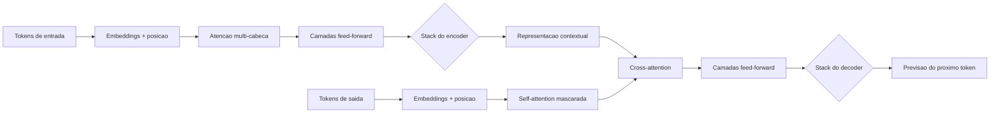

# Capítulo 2: A era do aprendizado profundo: redes neurais e o divisor de águas Transformer

## 1. Introdução

No Capítulo 1, você aprendeu a distinção fundamental que divide o campo da IA: sistemas baseados em regras, escritos à mão por especialistas, e sistemas estatísticos, que aprendem padrões a partir de dados. Você implementou ambos em Python puro e sentiu, na prática, por que a abordagem estatística venceu: ela escala. Este capítulo leva essa ideia ao extremo. Você vai conhecer o aprendizado profundo (deep learning) — redes neurais com dezenas de camadas que processam dados em escala massiva — e o divisor de águas que tornou possível o mundo dos assistentes modernos: a arquitetura Transformer, publicada em 2017, que está por trás de praticamente todas as LLMs que você já usou ou vai usar neste livro.

Ao final deste capítulo, você será capaz de explicar o que são camadas, pesos e atenção; entender por que mais dados e mais computação transformaram redes neurais de curiosidade acadêmica em motor da indústria; e reconhecer o papel do Transformer como a fundação técnica das ferramentas que você vai configurar nos módulos 3 e 4. Como Aprendiz de Construtor, você não precisa dominar a matemática profunda — precisa dominar o mapa conceitual, e é exatamente ele que vamos desenhar aqui.

## 2. Explica

### Redes neurais: neurônios artificiais e o aprendizado em camadas

Uma rede neural é uma função matemática composta por camadas de unidades simples chamadas neurônios artificiais. Cada neurônio recebe vários valores de entrada, multiplica cada um por um peso (um número que representa a importância daquela entrada), soma tudo e passa o resultado por uma função de ativação que decide quanto daquele sinal segue adiante [15]. O que torna uma rede "profunda" é o número de camadas intermediárias entre a entrada e a saída — as chamadas camadas escondidas, que aprendem a representar o dado em níveis crescentes de abstração: numa rede de visão, por exemplo, a primeira camada pode aprender a detectar bordas, a segunda combina bordas em formas, a terceira combina formas em partes de objetos [14]. Nenhuma dessas representações é programada: todas emergem do processo de treinamento.

O processo de treinamento é o coração de tudo. A rede começa com pesos aleatórios e, portanto, previsões ruins. Para cada exemplo de treinamento, comparamos a previsão com a resposta correta e calculamos um erro. O algoritmo de retropropagação (backpropagation) — popularizado em 1986 por Rumelhart, Hinton e Williams [19] — propaga esse erro da camada de saída de volta pelas camadas internas, calculando, para cada peso, quanto ele contribuiu para o erro. Em seguida, a descida de gradiente ajusta cada peso na direção que reduz o erro. Repetido milhões de vezes sobre milhões de exemplos, esse ciclo transforma pesos aleatórios em representações poderosas [15]. É a mesma máquina de ajuste que você implementou no Capítulo 1 — só que com milhões de pesos, dezenas de camadas e organização em lotes.

### O processamento em grande escala: por que o deep learning só decolou agora

O conceito de redes neurais existe desde 1943, mas o deep learning só virou o motor da indústria quando três ingredientes convergiram: dados massivos (a internet), computação paralela (as GPUs, originalmente projetadas para jogos) e algoritmos eficientes [14]. A arquitetura LeNet-5, de Yann LeCun e colaboradores em 1998, já reconhecia dígitos manuscritos com redes convolucionais — redes que varrem a imagem com filtros locais, reduzindo drasticamente o número de pesos [1]. Mas foi em 2012 que o mundo acordou: o AlexNet, de Krizhevsky, Sutskever e Hinton, venceu a competição ImageNet por uma margem avassaladora, usando duas GPUs e a técnica de dropout — que desativa neurônios aleatoriamente durante o treino para evitar que a rede decore os exemplos em vez de generalizar [3][4]. A partir dali, redes profundas dominaram visão computacional, áudio e, gradualmente, linguagem.

Outra peça do quebra-cabeça foi a capacidade de processar sequências. Texto é uma sequência: palavras dependem de contexto à esquerda e à direita. As redes recorrentes (RNNs) processavam tokens em ordem, mantendo um estado interno, e as LSTMs — introduzidas em 1997 por Hochreiter e Schmidhuber — resolveram parcialmente o problema de esquecer informação distante [5]. Mas as RNNs são inerentemente sequenciais: cada token depende do anterior, o que impede a paralelização em larga escala e limita o contexto processável [18]. Foi essa limitação estrutural que abriu caminho para uma ideia radical: abandonar a sequencialidade e processar todas as palavras de uma vez, com atenção.

### O divisor de águas: a arquitetura Transformer e a atenção

Em 2017, o artigo "Attention Is All You Need", de Ashish Vaswani e colegas do Google, propôs o Transformer: uma arquitetura de redes neurais que elimina completamente a recorrência e processa a sequência inteira em paralelo, usando apenas mecanismos de atenção e camadas de feed-forward [7]. A ideia central é o mecanismo de atenção: cada token "olha" para todos os outros tokens da sequência e calcula um peso de relevância — quanto cada um deve influenciar a representação dele. Se a palavra "banco" aparece num texto sobre dinheiro, a atenção a conecta fortemente com "transação", "saldo" e "juros"; num texto sobre rios, com "margem", "água" e "peixe". A atenção multi-cabeça repete esse processo em paralelo com várias "cabeças", capturando diferentes tipos de relação simultaneamente [7].

A vantagem estrutural é dupla. Primeiro, a paralelização: como não há dependência sequencial, o treinamento pode usar GPUs ao máximo, permitindo treinar modelos com bilhões de parâmetros em dados da escala da internet. Segundo, a capacidade de contexto: a atenção conecta tokens distantes diretamente, em um único passo, em vez de depender de um estado interno que se degrada com a distância [5][6]. A base da atenção já existia em tradução automática — o mecanismo de alinhamento de Bahdanau e colaboradores (2015) permitia que o modelo "olhasse para trás" nas palavras relevantes da frase de origem [6] — mas o Transformer a elevou de acessório a arquitetura inteira.

### Do Transformer às LLMs: BERT, GPT e as leis de escala

O Transformer deu origem a duas grandes famílias de modelos de linguagem. O BERT (2018), de Jacob Devlin e colaboradores do Google, usa a parte codificadora (encoder) do Transformer: lê o texto inteiro de uma vez, em duas direções, e é excelente em entender o contexto — classificar sentimentos, extrair entidades, responder perguntas [8]. Os modelos GPT, de Alec Radford e equipe da OpenAI, usam a parte decodificadora (decoder): geram texto token por token, prevendo a próxima palavra, e são excelentes em gerar texto novo [9][10]. A família GPT mostrou um fenômeno surpreendente: com escala suficiente, o modelo aprende tarefas que nunca foi explicitamente treinado para fazer — o chamado aprendizado em contexto (in-context learning), demonstrado pelo GPT-3 em 2020 com 175 bilhões de parâmetros [11].

Essa escalada não foi acaso: seguiu leis de escala. Kaplan e colaboradores (2020) mostraram que o desempenho de modelos Transformer melhora de forma previsível com mais parâmetros, mais dados e mais computação [12]; Hoffmann e colaboradores (2022) refinaram a relação, mostrando que a combinação ótima favorece modelos menores treinados em muito mais dados [13]. Essas leis explicam por que a indústria correu para escalar: os ganhos eram matematicamente antecipáveis. Elas também explicam por que modelos abertos — como os que você vai conectar nos capítulos 8 e 9 — conseguem alcançar níveis respeitáveis: não existe segredo místico, existe escala e engenharia de dados, hoje acessíveis a mais players [20].

## 3. Ilustra

Pense numa fábrica de montagem de carros, mas em versão radicalmente paralela. Na linha de montagem tradicional (a RNN), cada operário só pode trabalhar depois que o carro chega até ele: o motor só é instalado após o chassi passar pelas estações anteriores, e um erro no início atrasa tudo. Processar texto com redes recorrentes é exatamente assim — palavra por palavra, em cadeia. Agora imagine uma fábrica nova onde, para cada carro, todos os operários recebem a planta completa e trabalham ao mesmo tempo, trocando bilhetes sobre os pontos importantes: o operário do motor escreve "o torque está aqui", e o operário da suspensão lê o bilhete na hora, sem esperar o carro chegar. Essa é a atenção: cada palavra da frase escreve um bilhete ("eu sou relevante para você porque...") e lê os bilhetes de todas as outras palavras simultaneamente. A linha de montagem paralela é o Transformer.

Como Aprendiz de Construtor, você já vê a consequência prática: é por isso que os modelos modernos "entendem" contexto longo — não porque pensam, mas porque a arquitetura foi desenhada para conectar cada parte do texto a todas as outras em um único passo [7]. A caixa-preta vai se abrindo: dentro dela há uma fábrica paralela de bilhetes de relevância, treinada em escala gigantesca. O diagrama abaixo mostra a anatomia do Transformer na forma que você precisa reter — encoders, decoders e o mecanismo de atenção no centro.



## 4. Técnica

### Uma rede neural de uma camada em Python puro

Vamos materializar o conceito de rede neural sem nenhuma biblioteca externa. O programa abaixo implementa uma rede de uma camada com retropropagação simples para aprender a função OR — o mesmo mecanismo que, empilhado em camadas, forma o deep learning [15]. Você verá os pesos saindo de valores arbitrários e convergindo para os valores que resolvem o problema.

```python
def ativacao_sigmoid(valor):
    return 1 / (1 + (2.718281828 - 1) ** (-valor)) if valor >= 0 else 1 - 1 / (1 + (2.718281828 - 1) ** valor)


def rede_uma_camada(pesos, entradas):
    soma = sum(p * e for p, e in zip(pesos, entradas))
    return ativacao_sigmoid(soma)


def treinar_or(epocas=2000, taxa=0.3):
    exemplos = [([0, 0], 0), ([0, 1], 1), ([1, 0], 1), ([1, 1], 1)]
    pesos = [0.1, 0.1, 0.1]  # bias, x1, x2
    for _ in range(epocas):
        for entradas, esperado in exemplos:
            previsao = rede_uma_camada(pesos, entradas)
            erro = previsao - esperado
            for i in range(len(pesos)):
                pesos[i] = pesos[i] - taxa * erro * entradas[i]
    return pesos


pesos_or = treinar_or()
for entradas, esperado in [([0, 0], 0), ([0, 1], 1), ([1, 0], 1), ([1, 1], 1)]:
    previsao = rede_uma_camada(pesos_or, entradas)
    print(f"{entradas} -> {previsao:.3f} (esperado {esperado})")
```

Rode e observe: o erro cai a cada época e as previsões convergem para os valores esperados. Esse ciclo — prever, medir erro, ajustar pesos — é o mesmo que treina modelos com bilhões de parâmetros, apenas com mais camadas, mais matemática e mais dados [14].

### Empilhando camadas: o aprendizado profundo em miniatura

Uma camada única não aprende o XOR, como você viu no Capítulo 1. A solução é empilhar uma camada escondida com ativação não linear — exatamente o que tornou o deep learning possível [19]. Vamos implementar uma rede de duas camadas que aprende o XOR, o problema que derrubou o otimismo dos anos 1960 [7]:

```python
def ativacao_tanh(valor):
    exp_pos = 2.718281828 ** valor
    exp_neg = 2.718281828 ** (-valor)
    return (exp_pos - exp_neg) / (exp_pos + exp_neg)


def rede_duas_camadas(w1, w2, entradas):
    camada_escondida = [ativacao_tanh(
        w1[i][0] * entradas[0] + w1[i][1] * entradas[1] + w1[i][2]
    ) for i in range(2)]
    saida = ativacao_tanh(
        w2[0] * camada_escondida[0] + w2[1] * camada_escondida[1] + w2[2]
    )
    return saida, camada_escondida


def treinar_xor_profundo(epocas=3000, taxa=0.5):
    exemplos = [([0, 0], 0), ([0, 1], 1), ([1, 0], 1), ([1, 1], 0)]
    w1 = [[0.4, -0.3, 0.1], [-0.5, 0.6, 0.2]]
    w2 = [0.5, -0.4, 0.1]
    for _ in range(epocas):
        for entradas, esperado in exemplos:
            saida, oculto = rede_duas_camadas(w1, w2, entradas)
            erro = saida - esperado
            for i in range(2):
                w2[i] = w2[i] - taxa * erro * oculto[i]
            w2[2] = w2[2] - taxa * erro
            for j in range(2):
                derivada = oculto[j] * (1 - oculto[j] ** 2)
                for k in range(3):
                    entrada_k = entradas[k] if k < 2 else 1.0
                    w1[j][k] = w1[j][k] - taxa * erro * w2[j] * derivada * entrada_k
    return w1, w2


w1_final, w2_final = treinar_xor_profundo()
acertos = 0
for entradas, esperado in [([0, 0], 0), ([0, 1], 1), ([1, 0], 1), ([1, 1], 0)]:
    saida, _ = rede_duas_camadas(w1_final, w2_final, entradas)
    predito = 1 if saida > 0 else 0
    acertos += predito == esperado
    print(f"{entradas} -> {saida:.3f} (esperado {esperado})")
print(f"Acertos: {acertos}/4")
```

Essa é a essência do aprendizado profundo: camadas intermediárias aprendem representações que tornam o problema resolvível, e a não linearidade é o que dá poder de expressão [16]. O que falta para chegar ao Transformer são dois ingredientes: processamento em paralelo em GPUs (inviável de demonstrar aqui) e o mecanismo de atenção — que vamos implementar em seguida, na sua forma mais simples e didática.

### A atenção na prática: um buscador de relevância em Python

O mecanismo de atenção pode ser entendido como uma forma sofisticada de dizer "quanto cada palavra importa para cada outra". Na sua forma mais simples, ele calcula, para cada par de palavras, um peso de similaridade. Vamos implementar uma atenção simples sobre uma frase usando contagem de co-ocorrência — uma metáfora fiel da ideia central [7][6]:

```python
def construir_vocabulario(texto):
    palavras = texto.lower().replace(".", "").replace(",", "").split()
    return list(dict.fromkeys(palavras))


def matriz_similaridade(palavras):
    """Matriz onde cada celula diz o quanto duas palavras aparecem juntas."""
    n = len(palavras)
    matriz = [[0] * n for _ in range(n)]
    for i in range(n):
        for j in range(n):
            if i == j:
                matriz[i][j] = 1
            elif abs(i - j) == 1:
                matriz[i][j] = 0.5
    return matriz


def atencao_simples(frase, palavra_alvo, topo=3):
    palavras = construir_vocabulario(frase)
    try:
        indice_alvo = palavras.index(palavra_alvo)
    except ValueError:
        return []
    matriz = matriz_similaridade(palavras)
    relevancias = [(matriz[indice_alvo][i], palavras[i]) for i in range(len(palavras))]
    relevancias.sort(reverse=True)
    return [(palavra, round(peso, 2)) for peso, palavra in relevancias[:topo]]


frase = "o banco central anunciou a nova taxa de juros ontem"
print("Palavras mais relevantes para 'banco':")
for palavra, peso in atencao_simples(frase, "banco"):
    print(f"  {palavra} -> {peso}")
```

O exemplo é uma caricatura — a atenção real é aprendida, não baseada em posição — mas captura o princípio: cada palavra recebe, de cada outra palavra, um peso de influência que orienta a representação [7]. O Transformer multiplica essa ideia por milhões de parâmetros aprendidos e por dezenas de cabeças de atenção simultâneas, e é esse mecanismo que conecta "banco" a "juros" num texto e a "margem" em outro.

### Escala na prática: contando o custo de um modelo

Uma lição essencial deste capítulo é o custo do treinamento — e por que os modelos que você vai usar nos próximos capítulos são acessíveis justamente porque o treinamento é caro, mas a inferência (o uso) é barata. O programa abaixo modela, em termos simples, a relação entre parâmetros, dados e esforço de treinamento [12][13]:

```python
def custo_estimado(parametros_milhoes, tokens_bilhoes, gpus, eficiencia=0.5):
    """Estimativa didatica do esforco de treinamento em dias de GPU."""
    flops_por_token = 6 * parametros_milhoes * 1e6
    flops_totais = flops_por_token * tokens_bilhoes * 1e9
    flops_por_gpu_dia = gpus * 1.7e14 * 86400 * eficiencia
    return round(flops_totais / flops_por_gpu_dia, 1)


for parametros, tokens in [(0.125, 10), (7, 15), (70, 200), (175, 300)]:
    dias = custo_estimado(parametros, tokens, 8)
    print(f"{parametros}B de parametros, {tokens}B tokens: ~{dias} dias com 8 GPUs")
```

Os números são aproximações pedagógicas, mas a mensagem é real: o custo cresce de forma previsível com parâmetros e dados [12], e é por isso que modelos abertos menores (7B, 8B), treinados de forma eficiente, são gratuitos para você usar em casa ou via provedores — o tema do Capítulo 8.

### Atenção com pesos normalizados: o softmax na prática

A atenção do Transformer não usa pesos fixos como o exemplo anterior — ela aprende pesos de relevância e os normaliza com a função softmax, que transforma uma lista de valores em probabilidades que somam 1 [7]. Esse detalhe técnico é importante porque permite interpretar a atenção como uma distribuição de foco: o modelo "distribui" sua atenção entre as palavras, e a soma é sempre 100%. A implementação abaixo estende o exemplo da atenção simples com a normalização softmax — o mecanismo que está no coração de todo Transformer moderno [7][6]:

```python
def softmax(valores):
    """Converte uma lista de valores em probabilidades que somam 1."""
    expoentes = [2.718281828 ** v for v in valores]
    total = sum(expoentes)
    return [e / total for e in expoentes]


def atencao_softmax(palavras, indice_alvo):
    """Calcula a distribuicao de atencao da palavra alvo sobre as demais."""
    n = len(palavras)
    escores = []
    for i in range(n):
        if i == indice_alvo:
            escores.append(2.0)
        elif abs(i - indice_alvo) == 1:
            escores.append(1.0)
        else:
            escores.append(0.0)
    pesos = softmax(escores)
    return sorted(
        [(palavras[i], round(peso, 3)) for i in range(n) if i != indice_alvo],
        key=lambda item: item[1],
        reverse=True,
    )


frase = ["o", "banco", "central", "anunciou", "a", "nova", "taxa"]
foco = atencao_softmax(frase, 1)
print(f"atencao da palavra 'banco' sobre as demais:")
for palavra, peso in foco[:4]:
    print(f"  {palavra} -> {peso}")
print(f"soma dos pesos: {sum(p for _, p in foco):.3f}")
```

Observe duas coisas: a soma dos pesos é 1 (a distribuição normalizada) e as palavras vizinhas recebem mais atenção — o padrão que, em escala real, aprende a conectar "banco" a "juros" ou a "margem" conforme o texto [7]. É essa normalização que permite às redes de atenção aprender de forma estável, e é dela que o Transformer derivou seu poder [7][14]. Quando você usar um modelo moderno nos capítulos seguintes, lembre-se desta função: por trás de cada resposta há uma distribuição de atenção como essa — aprendida em bilhões de exemplos [20].

### Funções de ativação: por que a não linearidade importa

Um detalhe técnico que explica muito do deep learning é a função de ativação: sem ela, camadas empilhadas seriam equivalentes a uma única camada linear — e redes profundas não teriam sentido [15]. É a não linearidade (sigmoid, tanh, ReLU) que permite à rede aprender padrões complexos, combinando camadas em representações cada vez mais abstratas [15][16]. O experimento abaixo mostra o contraste: uma pilha linear equivale a uma única transformação, enquanto a ativação não linear quebra essa equivalência [16]:

```python
def linear_puro(valor):
    return 2 * valor + 1


def linear_empilhada(valor):
    return linear_puro(linear_puro(linear_puro(valor)))


def com_ativacao(valor):
    resultado = valor
    for _ in range(3):
        resultado = max(0, 2 * resultado - 1)  # ReLU + transformacao
    return resultado


for x in [-3, 0, 3, 10]:
    print(f"x={x:>3} | linear empilhada={linear_empilhada(x):>5} | com ativacao={com_ativacao(x):>5}")
```

Observe: a pilha linear é só uma reta mais inclinada (equivalente a uma camada única), enquanto a versão com ReLU produz curvas que a linear nunca alcança — é essa diferença que permite a redes profundas modelar dados complexos [16]. A ReLU, introduzida como padrão no deep learning moderno, é a ativação mais comum porque é simples e estável para treinar [15].

## 5. Aplica

### A cena de contraste: "a rede decorou, mas não aprendeu"

Imagine que você, Aprendiz de Construtor, recebeu a missão de treinar um modelo para distinguir fotos de gatos e cachorros para um aplicativo de adoção. Você coleta mil fotos, treina uma rede e obtém 98% de acurácia — comemoração geral. Mas no dia seguinte, o aplicativo vai ao ar e o modelo erra feio: fotos com fundo verde, luz de noite ou ângulos incomuns são classificadas errado. Na reunião, alguém sugere "a IA não presta". Você investiga e descobre o problema: durante o treino, todas as fotos de gatos tinham, por coincidência, etiquetas quadradas no canto — e a rede aprendeu a detectar a etiqueta, não o gato. Com 98% de acurácia, a rede "decorou" o artefato errado: é o clássico sobreajuste, o mesmo fenômeno que o dropout e a regularização combatem [4].

O diagnóstico conecta direto à teoria: o aprendizado profundo extrai padrões dos dados, e padrões espúrios também são padrões. Se os dados têm um atalho — uma cor, um logo, um fundo recorrente — a rede o usa porque ele reduz o erro de treino. A correção tem três frentes: (1) dados limpos e representativos — fotos variadas em fundo, luz e ângulo, sem atalhos coincidentes [15]; (2) separar um conjunto de validação que a rede nunca viu no treino, para medir generalização de verdade [3]; (3) técnicas de regularização, como o dropout, que impedem a dependência excessiva de poucos caminhos [4]. No mercado, esse cuidado separa modelos de demonstração de modelos de produção — e a mesma lógica vale, com outra roupagem, para a qualidade do contexto que você fornece aos modelos nos capítulos 10 e 11.

Síntese das armadilhas comuns desta etapa: (1) confundir acurácia de treino com qualidade real — sempre avalie em dados não vistos; (2) ignorar o viés dos dados — um modelo treinado com fotos de uma única raça não generaliza [20]; (3) tratar o modelo como caixa-preta inescrutável — a análise dos erros (as fotos que ele acertou por engano) é a ferramenta de diagnóstico mais poderosa; (4) esquecer que o Transformer não "entende" no sentido humano — ele modela padrões estatísticos de co-ocorrência, e é esse limite que o Capítulo 3 vai explorar quando agentes passam a agir no mundo real [14].

## 6. Conclusão

Você atravessou o coração técnico do desencantamento. Os três pontos que você leva deste capítulo: primeiro, redes neurais profundas são máquinas de ajuste de pesos organizadas em camadas, que aprendem representações por retropropagação e descida de gradiente — e você implementou esse ciclo em Python puro, do OR ao XOR [15][19]; segundo, o deep learning decolou quando dados massivos, GPUs e algoritmos convergiram, e as leis de escala tornaram o crescimento dos modelos previsível [12][13]; terceiro, o Transformer substituiu o processamento sequencial por atenção paralela — cada token se conecta a todos os outros — e se tornou a fundação de todas as LLMs, do BERT ao GPT [7][8].

O desafio desta etapa: implemente sua própria mini-rede (você pode reusar o código da seção Técnica) para aprender a função AND e, em seguida, altere os pesos iniciais e observe o treino convergir para os mesmos resultados — isso fixa a ideia de que o aprendizado está nos dados e no algoritmo, não nos valores iniciais. Depois, abra qualquer conversa com um assistente de IA e tente identificar, na resposta, os rastros de atenção: como o modelo conectou palavras distantes da sua pergunta.

Uma observação final sobre custo e acesso ajuda a fixar o contexto histórico: o treinamento dessas arquiteturas era caro demais para a maioria das equipes, e foi exatamente essa barreira que o movimento de modelos abertos atacou — liberando pesos, arquiteturas e técnicas para quem quisesse estudar e executar localmente [3][6]. É por isso que hoje você pode rodar um modelo de linguagem no seu próprio computador sem pagar nada, como verá no Capítulo 8, e por que as GPUs, que pareciam exclusividade dos grandes laboratórios, chegaram também a desenvolvedores individuais. Entender essa economia ajuda a prever o futuro: quando o acesso cai, a experimentação cresce — e a experimentação é o motor da inovação em IA [14].

No próximo capítulo, a história dá o salto final: dos modelos que geram texto para os agentes que agem — capazes de chamar ferramentas, interagir com arquivos e sistemas e executar tarefas de ponta a ponta. É a ponte entre o "cérebro" que você acabou de entender e o harness que o capítulo 5 vai apresentar como a peça central da arquitetura em 4 camadas.

## 7. Referências Bibliográficas

[1] LECUN, Yann; BOTTOU, Léon; BENGIO, Yoshua; HAFFNER, Patrick. Gradient-Based Learning Applied to Document Recognition. *Proceedings of the IEEE*, v. 86, n. 11, p. 2278-2324, 1998.

[2] HINTON, Geoffrey; SALAKHUTDINOV, Ruslan. Reducing the Dimensionality of Data with Neural Networks. *Science*, v. 313, n. 5786, p. 504-507, 2006.

[3] KRIZHEVSKY, Alex; SUTSKEVER, Ilya; HINTON, Geoffrey. ImageNet Classification with Deep Convolutional Neural Networks. *Advances in Neural Information Processing Systems*, v. 25, 2012.

[4] SRIVASTAVA, Nitish; HINTON, Geoffrey; KRIZHEVSKY, Alex; SUTSKEVER, Ilya; SALAKHUTDINOV, Ruslan. Dropout: A Simple Way to Prevent Neural Networks from Overfitting. *Journal of Machine Learning Research*, v. 15, p. 1929-1958, 2014.

[5] HOCHREITER, Sepp; SCHMIDHUBER, Jürgen. Long Short-Term Memory. *Neural Computation*, v. 9, n. 8, p. 1735-1780, 1997.

[6] BAHDANAU, Dzmitry; CHO, Kyunghyun; BENGIO, Yoshua. Neural Machine Translation by Jointly Learning to Align and Translate. *International Conference on Learning Representations*, 2015.

[7] VASWANI, Ashish; SHAZEER, Noam; PARMAR, Niki; et al. Attention Is All You Need. *Advances in Neural Information Processing Systems*, v. 30, 2017.

[8] DEVLIN, Jacob; CHANG, Ming-Wei; LEE, Kenton; TOUTANOVA, Kristina. BERT: Pre-training of Deep Bidirectional Transformers for Language Understanding. *NAACL*, p. 4171-4186, 2019.

[9] RADFORD, Alec; NARASIMHAN, Karthik; SALIMANS, Tim; SUTSKEVER, Ilya. *Improving Language Understanding by Generative Pre-Training*. San Francisco: OpenAI, 2018.

[10] RADFORD, Alec; WU, Jeffrey; CHILD, Rewon; et al. *Language Models Are Unsupervised Multitask Learners*. San Francisco: OpenAI, 2019.

[11] BROWN, Tom; MANN, Benjamin; RYDER, Nick; et al. Language Models Are Few-Shot Learners. *Advances in Neural Information Processing Systems*, v. 33, 2020.

[12] KAPLAN, Jared; MCCANDLISH, Sam; HENIGHAN, Tom; et al. *Scaling Laws for Neural Language Models*. arXiv:2001.08361, 2020.

[13] HOFFMANN, Jordan; BORGEAUD, Sebastian; MENSCH, Arthur; et al. *Training Compute-Optimal Large Language Models*. arXiv:2203.15556, 2022.

[14] LECUN, Yann; BENGIO, Yoshua; HINTON, Geoffrey. Deep Learning. *Nature*, v. 521, n. 7553, p. 436-444, 2015.

[15] GOODFELLOW, Ian; BENGIO, Yoshua; COURVILLE, Aaron. *Deep Learning*. Cambridge: MIT Press, 2016.

[16] HE, Kaiming; ZHANG, Xiangyu; REN, Shaoqing; SUN, Jian. Deep Residual Learning for Image Recognition. *IEEE Conference on Computer Vision and Pattern Recognition*, p. 770-778, 2016.

[17] KINGMA, Diederik; BA, Jimmy. Adam: A Method for Stochastic Optimization. *International Conference on Learning Representations*, 2015.

[18] CHO, Kyunghyun; VAN MERRIËNBOER, Bart; GULCEHRE, Caglar; et al. Learning Phrase Representations Using RNN Encoder-Decoder for Statistical Machine Translation. *EMNLP*, p. 1724-1734, 2014.

[19] RUMELHART, David; HINTON, Geoffrey; WILLIAMS, Ronald. Learning Representations by Back-Propagating Errors. *Nature*, v. 323, n. 6088, p. 533-536, 1986.

[20] ZHANG, Susan; ROLLER, Stephen; GOYAL, Naman; et al. *OPT: Open Pre-trained Transformer Language Models*. arXiv:2205.01068, 2022.
