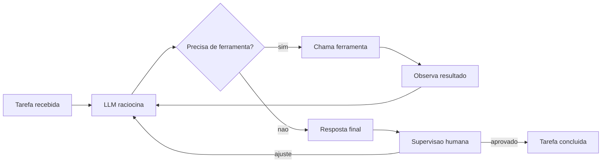

# Capítulo 3: A era das LLMs e dos agentes autônomos: do chat à ação

## 1. Introdução

No Capítulo 2, você desmontou a engrenagem central da IA moderna: redes neurais profundas, o mecanismo de atenção e a arquitetura Transformer que está por trás de todas as LLMs. Agora vamos completar o arco histórico: ver como esses modelos saíram dos laboratórios, viraram produtos usados por centenas de milhões de pessoas e — o salto mais importante para este livro — deixaram de apenas responder no chat para agir: interagir com sistemas, arquivos, código e ferramentas. É essa transição do "chat à ação" que cria o cenário onde os harnesses, as 4 camadas e os projetos dos próximos capítulos fazem sentido.

Ao final deste capítulo, você será capaz de explicar como uma LLM é construída e alinhada; diferenciar os papéis de modelos como GPT, Claude e Gemini; e entender o que torna um sistema um "agente autônomo" — raciocínio, uso de ferramentas e loop de ação. Você também vai conhecer os padrões de design de agentes que a indústria consolidou, porque eles serão o vocabulário do restante do livro.

## 2. Explica

### O salto dos modelos generativos: GPT, Claude, Gemini

Os grandes modelos de linguagem (LLMs) são redes Transformer treinadas em trilhões de tokens — pedaços de texto coletados da internet, livros e código. O treinamento inicial é a previsão do próximo token: o modelo recebe uma sequência e aprende a prever o token seguinte, repetidamente, até internalizar padrões estatísticos de linguagem em escala gigantesca [1]. Mas um modelo que apenas prevê o próximo token não é útil como assistente: ele precisa aprender a seguir instruções. O artigo do InstructGPT (2022), de Long Ouyang e equipe da OpenAI, descreveu o processo decisivo: treinar o modelo com exemplos de instruções escritas por humanos e depois refinar com feedback humano (RLHF — reinforcement learning from human feedback), alinhando o comportamento aos padrões de utilidade e segurança esperados [2]. Foi essa receita que, aplicada ao GPT-3.5, gerou o ChatGPT em novembro de 2022 — o produto que levou o paradigma ao público [3].

No mesmo caminho, surgiram famílias rivais com filosofias próprias. A Anthropic lançou a família Claude, com ênfase em segurança constitucional — um conjunto de princípios explícitos que guia o comportamento do modelo — e forte desempenho em tarefas longas e de programação [4]. O Google lançou a família Gemini, construída como multimodal desde o projeto: treinada para processar texto, imagens, áudio e vídeo em conjunto [5]. A corrida acelerou com iterações anuais: cada geração trouxe mais capacidade de raciocínio, janelas de contexto maiores e melhor adesão a instruções [18]. Para o Aprendiz de Construtor, a lição prática é: os nomes mudam, os preços mudam, mas o funcionamento fundamental — Transformer + alinhamento + escala — é o mesmo que você desmontou no Capítulo 2.

### Além do chat: raciocínio, contexto e os limites

Por que um modelo que prevê o próximo token consegue raciocinar? A resposta curta é que o raciocínio emerge como um padrão estatístico aprendido. O artigo de Wei e colaboradores (2022) mostrou que, quando instruídos a pensar passo a passo — gerar uma cadeia de raciocínio intermediária antes da resposta final —, os modelos melhoram drasticamente em problemas de lógica e matemática: é o chain-of-thought (CoT) [6]. Em vez de tentar "saltar" para a resposta, o modelo articula os passos, e cada passo guia o próximo. Esse comportamento não foi programado: emergiu da escala, e sua presença varia com o tamanho do modelo — o que motivou o conceito de habilidades emergentes [20].

Os limites também precisam ser conhecidos, porque você vai lidar com eles na prática. Primeiro, o contexto: a janela de contexto é a quantidade de texto que o modelo "enxerga" de uma vez, e modelos lidam melhor com informação no início e no fim da janela do que no meio — o fenômeno "lost in the middle" documentado por Liu e colaboradores [14]. Segundo, a alucinação: o modelo pode gerar afirmações falsas com total fluência, porque gera o texto estatisticamente mais provável, não o factualmente verificado — um problema tão relevante que gerou surveys dedicados [15]. Terceiro, o desalinhamento residual: mesmo após o treinamento com feedback humano, o modelo pode seguir instruções de formas imprevistas. Esses limites não são defeitos a serem eliminados, mas características a serem gerenciadas — com contexto de qualidade, verificação e as guardas que você aprenderá nos capítulos 10 e 12.

### Do chat aos agentes: o papel das ferramentas e do loop de raciocínio-ação

A transição mais importante deste capítulo é a que transforma o modelo de "oráculo que responde" em "agente que age". Três avanços técnicos sustentam essa transição. O primeiro é o uso de ferramentas: o artigo Toolformer (2023) mostrou que modelos podem aprender a chamar APIs — detectar quando uma pergunta exige informação externa e formular a chamada certa [7]. O segundo é o padrão ReAct (2023), de Shunyu Yao e colaboradores: alternar raciocínio e ação em loop — o modelo raciocina sobre o problema, decide uma ação (chamar uma ferramenta), observa o resultado e raciocina de novo — até concluir a tarefa [8]. O terceiro é a padronização industrial: as APIs passaram a oferecer "function calling", um formato estruturado em que o modelo declara qual função deseja chamar e com quais argumentos, e o sistema executa e devolve o resultado [11].

Com esses ingredientes, a indústria passou a desenhar sistemas agênticos completos. Surveys de 2023 e 2024 catalogaram a arquitetura típica de um agente: um modelo de cérebro, um conjunto de ferramentas, um ambiente de execução, memória e um loop de decisão [9][10]. Experimentos como os Generative Agents de Park e colaboradores mostraram agentes sociais mantendo memória e comportamento coerente ao longo do tempo [16]. E, em dezembro de 2024, a Anthropic publicou o guia que se tornou referência canônica da área — "Building Effective Agents" — que organiza os padrões de design em cinco categorias: prompt chaining (passos encadeados), routing (escolher o caminho), parallelization (executar em paralelo), orchestrator-workers (um orquestrador coordenando especialistas) e evaluator-optimizer (um avaliador refinando a saída) [12]. Esse guia é o mapa que você vai usar, de forma prática, nos capítulos 6, 7 e 11.

### O cenário atual: agentes no mundo real

O estado da arte em 2025-2026 é a combinação de todas essas peças em produtos: ferramentas que leem um repositório, editam arquivos, rodam testes e comandos de terminal, navegam na web e iteram até concluir uma tarefa — tudo supervisionado pelo humano. A avaliação desses sistemas virou ciência própria: benchmarks como o Chatbot Arena ranqueiam modelos por preferência humana [17], e benchmarks técnicos como GPQA testam conhecimento especializado [19]. Para o iniciante, o cenário é animador e acessível: a mesma arquitetura que move produtos de ponta está disponível em harnesses gratuitos e modelos abertos, como você verá nos módulos 3 e 4. A fronteira do "agente perfeito" ainda está aberta — e é exatamente nesse território que este livro vai te colocar, camada por camada [13].

## 3. Ilustra

Imagine que você contratou um assistente pessoal para organizar sua semana de trabalho. Existem dois tipos possíveis. O primeiro é um consultor que você só consulta por telefone: você liga, descreve o problema, ele dá uma resposta eloquente e desliga — e o trabalho de verdade continua todo com você. Esse é o chat tradicional: a LLM pura, que raciocina e responde, mas não toca no mundo. O segundo tipo é um assistente com chaves e autoridade: ele lê seus e-mails (ferramenta de leitura), agenda reuniões na sua agenda (ferramenta de calendário), envia mensagens (ferramenta de comunicação), e quando uma tarefa exige decisão, ele raciocina em voz alta, executa e volta com o resultado. Esse é o agente: cérebro + ferramentas + loop de raciocínio-ação, o padrão ReAct que você acabou de estudar [8].

Como Aprendiz de Construtor, você já percebe a consequência prática do desencantamento: o salto do chat para a ação não vem de um modelo "mais esperto" — vem da arquitetura ao redor do modelo: as ferramentas disponíveis, o loop que alterna raciocínio e ação, e a supervisão que define o que o agente tem autoridade para fazer [12]. Quando você configurar seu primeiro harness no Capítulo 9, estará exatamente montando esse assistente com chaves: decidindo quais ferramentas ele pode usar e qual autoridade ele tem. O diagrama abaixo mostra o loop agêntico na sua forma canônica.



## 4. Técnica

### Function calling na prática: o agente em Python puro

Vamos materializar o coração do agente moderno — o uso de ferramentas — sem bibliotecas externas. A ideia central: o programa descreve suas funções disponíveis, um "modelo" (aqui, simulado por regras didáticas) decide qual chamar, e o sistema executa e devolve o resultado [11]. O código abaixo implementa um mini-agente com duas ferramentas — calcular e buscar em lista — e um loop de decisão.

```python
def ferramenta_calcular(expressao):
    """Calcula uma expressao aritmetica simples, token a token."""
    partes = expressao.split()
    if len(partes) == 3 and partes[1] in ("+", "-", "*", "/"):
        a, op, b = float(partes[0]), partes[1], float(partes[2])
        if op == "+":
            return str(a + b)
        if op == "-":
            return str(a - b)
        if op == "*":
            return str(a * b)
        if op == "/":
            return "erro: divisao por zero" if b == 0 else str(a / b)
    return "erro: expressao nao reconhecida"


def ferramenta_buscar(termo, dados):
    """Retorna itens do catalogo que contem o termo."""
    return [item for item in dados if termo.lower() in item.lower()]


CATALOGO = [
    "harness opencode gratuito",
    "modelo qwen2.5-coder",
    "provedor groq com api gratuita",
    "ollama para execucao local",
]

ferramentas = {
    "calcular": ferramenta_calcular,
    "buscar": ferramenta_buscar,
}


def decidir_acao(pedido):
    """Simulacao didatica da decisao de um LLM: qual ferramenta usar."""
    if any(op in pedido for op in ("+", "-", "*", "/")) and "quanto" in pedido:
        return "calcular", pedido
    if "busca" in pedido or "encontre" in pedido:
        termo = pedido.replace("busque", "").replace("encontre", "").strip()
        return "buscar", termo
    return None, pedido


def executar_agente(pedido):
    ferramenta, argumento = decidir_acao(pedido)
    if ferramenta is None:
        return f"Nao sei agir sobre: {pedido}"
    if ferramenta == "calcular":
        return f"Resultado de '{argumento}': {ferramentas[ferramenta](argumento)}"
    return f"Busca por '{argumento}': {ferramentas[ferramenta](argumento, CATALOGO)}"


for pedido in [
    "quanto e 12 + 30?",
    "busque modelos gratuitos no catalogo",
    "me explique a teoria da relatividade",
]:
    print(f"> {pedido}\n  {executar_agente(pedido)}")
```

Observe o padrão estrutural: o pedido é classificado, a ferramenta certa é selecionada, executada e o resultado é devolvido. Um agente real faz exatamente isso, com a diferença de que a classificação é feita por uma LLM que declara a chamada em formato estruturado (function calling) [11]. O ponto que você deve reter: o "cérebro" decide, mas quem executa é a ferramenta — e é essa separação que permite controlar o que um agente pode e não pode fazer, tema central do Capítulo 12.

### O loop ReAct em código: raciocina, age, observa

Vamos subir um nível e implementar o padrão ReAct de verdade — um loop que alterna raciocínio e ação até concluir [8]. O problema escolhido: descobrir qual número do catálogo atende a uma condição, usando uma ferramenta de "consultar preço" que simula acesso a um sistema externo.

```python
PRECOS = {"harness": 0, "modelo qwen": 0, "groq": 0, "ollama": 0, "cursor pro": 20}


def consultar_preco(produto):
    """Simula uma ferramenta externa de consulta de preco."""
    return PRECOS.get(produto.lower(), "produto nao encontrado")


def loop_react(objetivo, produtos, max_passos=8):
    """Loop ReAct didatico: raciocina, chama ferramenta, observa, decide."""
    passos = []
    preco_do_objeto = None
    for _ in range(max_passos):
        razao = f"objetivo: {objetivo}; ainda nao verifiquei todos os produtos"
        acao = f"consultar_preco({produtos[0]})" if preco_do_objeto is None else f"consultar_preco({produtos[1]})"
        if preco_do_objeto is not None:
            break
        produto_atual = produtos[0] if "consultar_preco(" + produtos[0] + ")" in acao else produtos[1]
        observacao = consultar_preco(produto_atual)
        passos.append((razao, acao, observacao))
        if observacao == 0:
            preco_do_objeto = produto_atual
            break
        produtos = [produto for produto in produtos if produto != produto_atual]
        if not produtos:
            break
    return passos, preco_do_objeto


produtos = ["cursor pro", "ollama", "groq", "harness"]
passos, achado = loop_react("qual produto e gratuito?", produtos)
for razao, acao, obs in passos:
    print(f"RACIOCINIO: {razao}")
    print(f"ACAO: {acao} -> OBSERVACAO: {obs}")
print(f"CONCLUSAO: produto gratuito encontrado: {achado}")
```

O código é uma caricatura do loop real, mas captura a anatomia: em cada iteração há um raciocínio, uma ação (chamada de ferramenta), uma observação (o resultado) e uma nova decisão [8]. Nos agentes reais, o raciocínio é texto gerado pela LLM, a ação é uma chamada de função estruturada, e a observação é a resposta da ferramenta. Esse ciclo — implementado em escala industrial pelos harnesses — é o coração do Capítulo 6.

### Prompt chaining e evaluator-optimizer: os padrões do guia da Anthropic

O guia "Building Effective Agents" da Anthropic descreve padrões que você pode implementar hoje, mesmo como iniciante. O mais simples é o prompt chaining: dividir uma tarefa em passos encadeados, em que a saída de um vira entrada do próximo [12]. Vamos implementar um exemplo concreto: gerar e depois melhorar uma frase de apresentação para um produto.

```python
def passo_gerar_ideia(produto, publico):
    """Primeiro elo da corrente: gera a base da apresentacao."""
    return (f"Apresente {produto} para {publico} destacando "
            f"simplicidade, custo zero e resultados rapidos")


def passo_refinar_texto(rascunho):
    """Segundo elo: enriquece o rascunho com chamado a acao."""
    return (rascunho + " Comece hoje com uma instalacao de cinco minutos "
            "e veja o primeiro resultado na mesma semana.")


def prompt_chaining(produto, publico):
    return passo_refinar_texto(passo_gerar_ideia(produto, publico))


print(prompt_chaining("um harness gratuito", "iniciantes em programacao"))
```

O padrão evaluator-optimizer, por sua vez, usa um componente que avalia a saída e outro que a melhora, em loop até atingir um critério [12]. A versão didática abaixo avalia frases por comprimento e clareza, iterando até a meta:

```python
def avaliar(texto):
    """Retorna pontuacao entre 0 e 10 por clareza didatica (heuristica simples)."""
    palavras = texto.split()
    if len(palavras) < 12:
        return 3
    if len(palavras) > 30:
        return 5
    tem_acao = any(palavra in texto.lower() for palavra in ("aprenda", "comece", "faça", "configure"))
    return 9 if tem_acao else 6


def melhorar(texto):
    return texto + " Aprenda o passo a passo e configure sua primeira ferramenta hoje."


def evaluator_optimizer(texto_inicial, meta=8, max_iteracoes=4):
    texto = texto_inicial
    for _ in range(max_iteracoes):
        nota = avaliar(texto)
        if nota >= meta:
            return texto, nota
        texto = melhorar(texto)
    return texto, avaliar(texto)


final, nota = evaluator_optimizer("Este livro ensina IA do zero.")
print(f"Nota final: {nota}")
print(final)
```

Esses dois padrões — encadeamento e avaliação iterativa — aparecem em todos os produtos agênticos modernos, e você vai reencontrá-los, com interfaces reais, quando usar harnesses nos capítulos 6 e 7 [12].

### Orquestrador e especialistas: o padrão orchestrator-workers

O guia "Building Effective Agents" da Anthropic descreve o padrão orchestrator-workers: um componente central (o orquestrador) analisa a tarefa, decide o plano e delega a execução a componentes especializados (os workers), que rodam em paralelo quando possível [12]. É o padrão dos times reais: um líder coordena, especialistas executam. A implementação abaixo materializa o padrão com três especialistas — um de código, um de dados e um de documentação — e um orquestrador que roteia o pedido para o especialista certo [12][9]:

```python
def especialista_codigo(tarefa):
    return f"[codigo] vou revisar e implementar: {tarefa}"


def especialista_dados(tarefa):
    return f"[dados] vou validar e preparar os dados para: {tarefa}"


def especialista_documentacao(tarefa):
    return f"[docs] vou documentar: {tarefa}"


ESPECIALISTAS = {
    "codigo": especialista_codigo,
    "dados": especialista_dados,
    "docs": especialista_documentacao,
}


def orquestrador(pedido):
    """Analisa o pedido, decide o plano e delega aos especialistas."""
    plano = []
    if "funcao" in pedido or "implemente" in pedido:
        plano.append("codigo")
    if "dados" in pedido or "json" in pedido or "validacao" in pedido:
        plano.append("dados")
    if "documente" in pedido or "leia-me" in pedido:
        plano.append("docs")
    if not plano:
        return "pedido fora do escopo dos especialistas disponiveis"
    resultados = [ESPECIALISTAS[especialidade](pedido) for especialidade in plano]
    return "\n".join(resultados)


for pedido in [
    "implemente a funcao de busca e documente o modulo",
    "valide os dados do json de entrada",
    "reorganize as pastas do projeto",
]:
    print(f"> {pedido}")
    print(orquestrador(pedido))
    print()
```

O padrão é a base de arquiteturas agênticas profissionais: cada worker tem um escopo estreito (fácil de validar e de trocar), e o orquestrador concentra a decisão — o mesmo desenho que você verá em produtos reais e que o Capítulo 6 retomará sob a lente do harness [12][10]. Quando um sistema delega tarefas a especialistas, ele fica mais auditável: cada worker responde pelo seu domínio, e o log do orquestrador mostra qual especialista foi acionado e por quê [12].

### Descrevendo ferramentas para o modelo: o catálogo bem escrito

Um detalhe que separa agentes medianos de agentes excelentes é a qualidade das descrições das ferramentas: o modelo escolhe o que chamar com base no que ele lê, e descrições vagas geram escolhas erradas [12][11]. O guia "Writing Effective Tools" da Anthropic recomenda descrever cada ferramenta com nome claro, propósito, parâmetros e quando usá-la — e evitar catálogos inflados com ferramentas redundantes [12]. O comparativo abaixo mostra a diferença entre uma descrição ruim e uma boa, medida por uma heurística simples de clareza:

```python
def pontuar_descricao(nome, descricao):
    palavras = descricao.split()
    tem_acao = any(p in descricao.lower() for p in ("quando", "usar", "retorna", "parametros", "apenas"))
    return len(palavras) + (20 if tem_acao else 0)


descricao_ruim = "ferramenta de dados"
descricao_boa = ("quando o usuario pedir para buscar no catalogo, use esta ferramenta; "
                 "parametros: termo (texto); retorna lista de itens correspondentes")
print("descricao ruim:", pontuar_descricao("buscar", descricao_ruim), "pontos")
print("descricao boa:", pontuar_descricao("buscar", descricao_boa), "pontos")
```

A lição é prática e aplicável já no Capítulo 9: quando você configurar ferramentas no seu harness, gaste um minuto descrevendo bem cada uma — o modelo recompensa a clareza com escolhas melhores, e o catálogo enxuto com descrições precisas supera o catálogo gigante com descrições vagas [12][11]. É um dos poucos lugares onde um ajuste de texto, e não de modelo, muda o resultado do sistema.

## 5. Aplica

### A cena de contraste: o agente que recebeu autoridade demais

Imagine a cena: você configurou seu primeiro agente para organizar uma pasta de projetos. Empolgado com o padrão ReAct, você habilita todas as ferramentas disponíveis — leitura, escrita, exclusão de arquivos, execução de comandos no terminal — sem restrições, porque "o agente é inteligente, ele decide certo". No primeiro dia, funciona maravilhosamente: ele renomeia arquivos, reorganiza pastas, cria documentação. No segundo dia, um mal-entendido de instrução faz o agente executar um comando de limpeza que apaga uma pasta de backups que você precisava. O agente não foi "mau" — ele raciocinou, agiu e observou exatamente como o loop manda; o problema é que ninguém definiu a autoridade dele [12].

O diagnóstico liga direto à teoria: o loop ReAct dá ao modelo a capacidade de agir, mas a capacidade de agir não vem com senso de consequência — quem define o escopo da ação é o sistema ao redor, não o modelo [8]. A correção, que será detalhada no Capítulo 12, é o princípio do menor privilégio: conceda apenas as ferramentas necessárias para a tarefa, exija aprovação humana para ações destrutivas ou irreversíveis, e mantenha os backups fora do alcance de exclusão [12][15]. Na prática do mercado, essa distinção separa demonstrações impressionantes de sistemas confiáveis — e é exatamente o tipo de decisão de arquitetura que o Aprendiz de Construtor precisa aprender a tomar desde o início.

Síntese das armadilhas comuns da era dos agentes: (1) confundir fluência com confiabilidade — uma resposta eloquente pode estar factualmente errada [15]; (2) dar autoridade total ao agente — o menor privilégio vale para ferramentas e ações; (3) ignorar o contexto — agentes perdem informação no meio de janelas longas [14]; (4) pular a supervisão — o humano no loop é o que transforma um experimento em produção; (5) esperar que um único modelo resolva tudo — a arquitetura (roteamento, encadeamento, orquestração) importa tanto quanto o modelo [12].

## 6. Conclusão

O arco histórico está completo: da lógica simbólica (Capítulo 1) ao deep learning e ao Transformer (Capítulo 2) e, agora, às LLMs e aos agentes autônomos. Os três pontos que você leva deste capítulo: primeiro, uma LLM é um Transformer treinado em escala gigantesca e depois alinhado por feedback humano para seguir instruções — GPT, Claude e Gemini seguem a mesma receita com filosofias diferentes [1][2][4]; segundo, o salto do chat para a ação vem de três avanços — uso de ferramentas, o padrão ReAct de raciocínio-ação e o function calling padronizado [7][8][11]; terceiro, agentes são sistemas: cérebro, ferramentas, memória e loop, desenhados segundo padrões como prompt chaining, routing e orchestrator-workers [12][9][10].

O desafio desta etapa: pegue o código do loop ReAct da seção Técnica e acrescente uma terceira ferramenta — por exemplo, uma que valide se um arquivo existe — e uma regra de segurança que bloqueie ações destrutivas. Isso exercita exatamente a habilidade que define o uso maduro de agentes: definir o que o sistema pode fazer antes de deixá-lo agir.

No próximo módulo, mudamos de marcha: da história e da mecânica para a arquitetura que você vai operar no dia a dia. O Capítulo 4 mostra por que a IA produtiva não vive no navegador, e o Capítulo 5 apresenta as 4 camadas — Tela, Harness, LLM e Tools — que são o mapa de todo o restante do livro.

## 7. Referências Bibliográficas

[1] BROWN, Tom; MANN, Benjamin; RYDER, Nick; et al. Language Models Are Few-Shot Learners. *Advances in Neural Information Processing Systems*, v. 33, 2020.

[2] OUYANG, Long; WU, Jeff; JIANG, Xu; et al. Training Language Models to Follow Instructions with Human Feedback. *Advances in Neural Information Processing Systems*, v. 35, 2022.

[3] OPENAI. *Introducing ChatGPT*. San Francisco: OpenAI, 2022. Disponível em: https://openai.com/blog/chatgpt. Acesso em: 5 ago. 2026.

[4] ANTHROPIC. *Introducing the Claude 3 Family*. São Francisco: Anthropic, 2024. Disponível em: https://www.anthropic.com/news/claude-3-family. Acesso em: 5 ago. 2026.

[5] GOOGLE. *Gemini: A Family of Highly Capable Multimodal Models*. arXiv:2312.11805, 2023.

[6] WEI, Jason; WANG, Xuezhi; SCHUURMANS, Dale; et al. Chain-of-Thought Prompting Elicits Reasoning in Large Language Models. *Advances in Neural Information Processing Systems*, v. 35, 2022.

[7] SCHICK, Timo; DWIVEDI-YU, Jane; DESSI, Roberto; et al. Toolformer: Language Models Can Teach Themselves to Use Tools. *Advances in Neural Information Processing Systems*, v. 36, 2023.

[8] YAO, Shunyu; ZHAO, Jeffrey; YU, Dian; et al. ReAct: Synergizing Reasoning and Acting in Language Models. *International Conference on Learning Representations*, 2023.

[9] XI, Zhiheng; CHEN, Wenxiang; GUO, Xin; et al. *The Rise and Potential of Large Language Model Based Agents: A Survey*. arXiv:2309.07864, 2023.

[10] WANG, Lei; MA, Chen; FENG, Xueyang; et al. A Survey on Large Language Model Based Autonomous Agents. *Frontiers of Computer Science*, v. 18, n. 6, 2024.

[11] OPENAI. *Function Calling and Other API Updates*. San Francisco: OpenAI, 2023. Disponível em: https://openai.com/blog/function-calling-and-other-api-updates. Acesso em: 5 ago. 2026.

[12] ANTHROPIC. *Building Effective Agents*. São Francisco: Anthropic, 2024. Disponível em: https://www.anthropic.com/research/building-effective-agents. Acesso em: 5 ago. 2026.

[13] BUBECK, Sébastien; CHANDRASEKARAN, Varun; ELDAN, Ronen; et al. *Sparks of Artificial General Intelligence: Early Experiments with GPT-4*. arXiv:2303.12712, 2023.

[14] LIU, Nelson; LIN, Kevin; HEWITT, John; et al. Lost in the Middle: How Language Models Use Long Contexts. *Transactions of the Association for Computational Linguistics*, v. 12, p. 157-173, 2023.

[15] HUANG, Lei; YU, Weijiang; MA, Weitao; et al. *A Survey on Hallucination in Large Language Models: Principles, Taxonomy, Challenges, and Open Questions*. arXiv:2311.05232, 2023.

[16] PARK, Joon Sung; O'BRIEN, Joseph; CAI, Carrie; et al. Generative Agents: Interactive Simulacra of Human Behavior. *Proceedings of the ACM Symposium on User Interface Software and Technology*, 2023.

[17] CHIANG, Wei-Lin; ZHENG, Lianmin; SHENG, Ying; et al. *Chatbot Arena: An Open Platform for Evaluating LLMs by Human Preference*. arXiv:2403.04132, 2024.

[18] OPENAI. *GPT-4 Technical Report*. arXiv:2303.08774, 2023.

[19] DETTMERS, Tim; PAGNUCCO, Mike; HOLTZMAN, Ari; et al. *GPQA: A Graduate-Level Google-Proof Q&A Benchmark*. arXiv:2311.12022, 2023.

[20] WEI, Jason; TAY, Yi; BOMMASANI, Rishi; et al. Emergent Abilities of Large Language Models. *Transactions on Machine Learning Research*, 2022.
