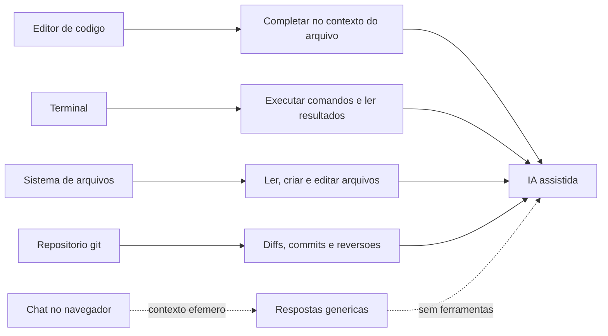

# Capítulo 4: O ecossistema do desenvolvedor: por que a IA não é apenas um chat no navegador

## 1. Introdução

Nos três primeiros capítulos, você percorreu a história e a mecânica da IA: da lógica simbólica ao Transformer e, finalmente, às LLMs e aos agentes autônomos. Agora vamos mudar o ângulo — da tecnologia para o ambiente onde ela vive no trabalho real. Se você usou IA apenas pelo navegador, tem uma experiência incompleta do que ela pode fazer. Este capítulo explica por que a IA produtiva mora no ecossistema do desenvolvedor — editores, terminais, repositórios e interfaces de linha de comando — e por que é lá, e não no chat do navegador, que a arquitetura em 4 camadas do próximo capítulo ganha vida.

Ao final deste capítulo, você será capaz de nomear as peças do ecossistema (editor, terminal, sistema de arquivos, repositório git, APIs) e explicar o que cada uma permite que a IA faça; entender os números que mostram a adoção massiva da IA no desenvolvimento; e reconhecer as limitações estruturais do chat isolado — contexto efêmero, ausência de ferramentas, ausência de memória de projeto — que os harnesses resolvem.

## 2. Explica

### O navegador como ponto de partida e seus limites

O chat no navegador foi a porta de entrada da IA para o mundo — o ChatGPT, lançado em novembro de 2022, levou o paradigma a centenas de milhões de usuários [9]. Para o iniciante, ele é perfeito: sem instalação, sem configuração, resultado imediato. Mas, quando o objetivo é produzir software, o chat isolado esbarra em três limites estruturais. O primeiro é o contexto efêmero: cada conversa começa do zero, sem conhecer os arquivos do seu projeto, e mesmo dentro da conversa, o modelo depende de você colar trechos de código — o que degrada a qualidade com janelas longas [14]. O segundo é a ausência de ferramentas: o chat não pode rodar seus testes, executar seu código, consultar sua API ou editar seus arquivos; ele apenas sugere texto que você copia e cola. O terceiro é a ausência de memória de projeto: as regras do seu repositório, as convenções do time e o histórico de decisões não existem para ele [8].

Esses limites não são defeitos do modelo — são defeitos do ambiente. O mesmo modelo que erra uma refatoração no navegador pode acertar quando opera dentro do repositório, com acesso ao sistema de arquivos, às ferramentas e ao contexto do projeto [20]. Essa constatação define o território do desenvolvedor: a IA produtiva precisa viver onde o código vive. É exatamente essa a tese que a indústria abraçou — e os números da próxima seção mostram a velocidade dessa migração.

### O território do desenvolvedor: editor, terminal, arquivos e git

O ecossistema do desenvolvedor é um conjunto de camadas de software que, juntas, formam o ambiente de trabalho. O editor de código é a peça central — o Visual Studio Code, da Microsoft, é o editor mais usado do mundo e serve de base para várias ferramentas de IA que você conhecerá no Capítulo 7 [6][14]. O terminal é a segunda peça: uma interface de linha de comando — tipicamente bash em sistemas Unix-like e PowerShell no Windows — por onde o desenvolvedor executa comandos, roda testes, instala dependências e opera o git [13]. O sistema de arquivos é a terceira: os diretórios e arquivos do projeto, que contêm código, configuração e documentação. E o repositório git é a quarta: o controle de versão que registra cada alteração, permitindo comparar, reverter e colaborar [12].

Cada uma dessas peças, quando conectada à IA, vira uma capacidade nova: com acesso ao editor, a IA completa código no contexto do arquivo aberto; com acesso ao terminal, ela executa comandos e lê resultados; com acesso aos arquivos, ela edita, cria e reorganiza; com acesso ao git, ela mostra diffs, propõe mensagens de commit e reverte alterações [17][11]. O que parece "milagre" quando visto do navegador é, na verdade, a combinação disciplinada dessas capacidades — o tema central do Capítulo 5. Para o Aprendiz de Construtor, a implicação é prática e animadora: dominar o básico dessas quatro peças (abrir um editor, rodar um comando no terminal, navegar em arquivos e fazer um commit) é o pré-requisito exato para operar a IA assistida — e este capítulo e o próximo fornecem esse básico.

### Os números da adoção: a IA já está no fluxo do desenvolvedor

A migração da IA para o ecossistema do desenvolvedor não é promessa de futuro — é fato medido. Estudo da Microsoft com desenvolvedores que usaram o GitHub Copilot mediu ganho de produtividade de cerca de 55,8% numa tarefa de implementação de servidor HTTP: os participantes concluíram a tarefa consideravelmente mais rápido com o assistente do que sem ele [1]. Levantamento da GitHub em 2023 indicou que 92% dos desenvolvedores dos EUA já usavam ferramentas de IA em algum momento do trabalho, e 70% diziam que elas davam vantagens ao seu trabalho [2]. A pesquisa anual da Stack Overflow de 2024 mostrou que mais de três quartos dos desenvolvedores usam ou planejam usar ferramentas de IA, com o uso concentrado justamente em escrever e depurar código [3]. A Gartner previu que, até 2028, 75% dos engenheiros de software corporativos usarão assistentes de código com IA — ante menos de 10% em 2023 [4].

Os dados também mostram a direção da evolução. O AI Index da Universidade Stanford documenta o crescimento ano a ano dos investimentos e da adoção de IA generativa em produtos comerciais [5]. E a mudança qualitativa é tão importante quanto a quantitativa: as ferramentas estão saindo do "autocomplete" para o "agente" — sistemas que planejam, executam e iteram, exatamente o que o Capítulo 3 descreveu [19]. Para o iniciante, esses números têm uma leitura dupla: a competência está em alta demanda, e as ferramentas para começar — várias gratuitas — nunca foram tão acessíveis, como você verá nos capítulos 7, 8 e 9.

### O que muda quando a IA tem acesso ao seu projeto

Colocar a IA dentro do projeto muda qualitativamente o tipo de ajuda que ela dá. No navegador, você descreve um problema em abstrato e recebe uma resposta genérica. No repositório, a IA pode ler o código real, entender as convenções, detectar onde uma mudança quebraria testes e propor alterações consistentes com o restante da base [7]. A engenharia de contexto — o conjunto de decisões sobre o que entra na janela do modelo, em que ordem e com que compressão — tornou-se disciplina própria, documentada pela Anthropic em 2025: o desempenho do assistente depende tanto da qualidade do contexto quanto da capacidade do modelo [8]. É essa constatação que sustenta o surgimento dos harnesses: ambientes que automatizam a preparação do contexto, a execução de ferramentas e a memória do projeto — a peça central da arquitetura em 4 camadas que você vai montar no Capítulo 5.

## 3. Ilustra

Pense num escritório de arquitetura. No modelo antigo, o arquiteto recebia uma foto borrada de um terreno (o chat do navegador): ele dava uma opinião genérica, baseada em suposições, e você voltava para casa com uma planta que não encaixa no terreno real. No modelo novo, o arquiteto trabalha dentro do terreno: ele caminha pelo lote (sistema de arquivos), mede o relevo (git e histórico), consulta a legislação (documentação) e usa ferramentas de medição (terminal). A opinião dele, agora, é sobre o terreno real — e não sobre um desenho imaginado. É exatamente essa a diferença entre conversar com a IA no navegador e operá-la dentro do ecossistema do desenvolvedor: o contexto real muda tudo [8].

Como Aprendiz de Construtor, você já percebe a consequência: o "terreno" — seu projeto, seus arquivos, suas regras — é a matéria-prima que a IA transforma em trabalho útil. Quem domina o básico do território (editor, terminal, git) está apto a operar a IA assistida; quem não domina, depende de respostas genéricas. A caixa-preta continua se abrindo: dentro dela há um modelo (Capítulos 2 e 3) operando sobre um terreno (este capítulo), e a peça que conecta os dois é o harness (Capítulos 6 e 7). O diagrama abaixo mostra as peças do ecossistema e como cada uma alimenta a IA.



## 4. Técnica

### Montando o território: um projeto real do zero

Nada ensina o ecossistema como construir um projeto mínimo. Vamos criar, passo a passo, uma aplicação de exemplo — um utilitário de linha de comando em Python que conta palavras num arquivo — usando exatamente as quatro peças: editor, terminal, arquivos e git. Primeiro, a estrutura de pastas e o código, como você faria no editor:

```bash
mkdir meu-primeiro-projeto
cd meu-primeiro-projeto
```

Agora crie o arquivo principal com um editor ou com um simples redirecionamento de terminal:

```bash
cat > contador.py << 'FIM'
import sys


def contar_palavras(conteudo):
    return len(conteudo.split())


def main():
    if len(sys.argv) < 2:
        print("uso: python contador.py <arquivo>")
        return 1
    with open(sys.argv[1], encoding="utf-8") as arquivo:
        texto = arquivo.read()
    print(f"palavras: {contar_palavras(texto)}")
    return 0


if __name__ == "__main__":
    sys.exit(main())
FIM
```

Rode no terminal e veja a peça do sistema de arquivos em ação — o programa lê o arquivo, processa e devolve o resultado:

```bash
echo "o aprendizado de maquina aprende padroes dos dados" > exemplo.txt
python contador.py exemplo.txt
```

### Git: o registro de cada alteração

A quarta peça do ecossistema é o controle de versão. O git — documentado de forma canônica no livro Pro Git — registra cada estado do projeto, permitindo comparar, reverter e colaborar [12]. O fluxo mínimo que você precisa dominar tem cinco comandos:

```bash
git init
git add contador.py exemplo.txt
git commit -m "primeiro utilitario de contagem de palavras"
git status
git log --oneline
```

O que você acabou de fazer é a base de uma das capacidades mais valiosas da IA assistida: com o git, você pode pedir ao assistente para mostrar o diff de uma alteração (o que mudou, linha por linha), propor mensagens de commit consistentes e reverter mudanças ruins [17]. Sem git, o assistente trabalha às cegas; com git, ele trabalha com um registro completo do terreno [12].

### Conectando a IA ao projeto: o que o harness fará por você

Para fechar o capítulo, vamos simular — em Python puro — o serviço que o harness presta: preparar o contexto do projeto para o modelo. Quando você abre um projeto na IA assistida, algo precisa (1) listar os arquivos, (2) ler os principais, (3) montar um pacote de contexto e (4) enviar ao modelo. O código abaixo implementa esse pipeline didático:

```python
import os
import json


def listar_arquivos(diretorio):
    """Simula a leitura da estrutura de arquivos feita pelo harness."""
    achados = []
    for raiz, pastas, arquivos in os.walk(diretorio):
        pastas[:] = [p for p in pastas if not p.startswith(".") and p != "__pycache__"]
        for nome in arquivos:
            if nome.endswith((".py", ".md", ".txt")):
                achados.append(os.path.join(raiz, nome))
    return achados


def montar_contexto(diretorio, limite_caracteres=2000):
    """Simula o pacote de contexto: conteudo resumido dos arquivos principais."""
    contexto = []
    total = 0
    for caminho in listar_arquivos(diretorio):
        try:
            conteudo = open(caminho, encoding="utf-8").read()
        except OSError:
            continue
        trecho = conteudo[:limite_caracteres - total]
        contexto.append({"arquivo": caminho, "tamanho": len(conteudo), "trecho": trecho})
        total += len(trecho)
        if total >= limite_caracteres:
            break
    return contexto


contexto = montar_contexto(".")
for item in contexto:
    print(f"{item['arquivo']} ({item['tamanho']} chars)")
print(f"total de contexto: {sum(len(c['trecho']) for c in contexto)} chars")
```

Esse é, em miniatura, o trabalho invisível que o harness faz entre a Tela e a LLM — e que você vai estudar a fundo no Capítulo 5: ler a estrutura, escolher o que entra na janela, montar as instruções. A qualidade dessa montagem — não apenas o modelo — determina a qualidade da resposta, como a pesquisa sobre engenharia de contexto demonstra [8].

### Exercício de verificação: o ciclo completo

Rode o ciclo completo e verifique cada peça com um script de testes:

```python
import subprocess
import sys


def testar_territorio():
    resultado = subprocess.run(
        [sys.executable, "contador.py", "exemplo.txt"],
        capture_output=True, text=True, encoding="utf-8",
    )
    assert "palavras: 8" in resultado.stdout, resultado.stdout
    git_log = subprocess.run(
        ["git", "log", "--oneline"], capture_output=True, text=True, encoding="utf-8"
    )
    assert git_log.returncode == 0 and "primeiro utilitario" in git_log.stdout
    contexto = montar_contexto(".")
    assert any("contador.py" in item["arquivo"] for item in contexto)
    print("Territorio completo e verificado")


testar_territorio()
```

Se os testes passarem, você montou e verificou o território inteiro — editor, terminal, arquivos, git e o esboço do que o harness fará. Esse é o mesmo fluxo que os capítulos 9 e 11 vão repetir com harnesses reais e modelos gratuitos [20].

### O ciclo do projeto assistido: da ideia ao deploy

O ecossistema do desenvolvedor ganha um novo ator quando a IA entra no fluxo: o próprio ciclo de vida do projeto passa a ser uma sequência de fases assistidas. O fluxo maduro tem seis fases — planejar, especificar, implementar, testar, documentar e revisar — e cada fase tem um critério de saída objetivo antes de avançar [7][8]. O pipeline abaixo modela esse ciclo, registrando em qual fase o projeto está e o que falta para avançar — o mesmo tipo de rastreamento que os harnesses mostram no dia a dia [20]:

```python
FASES = [
    ("planejar", "objetivo e escopo definidos"),
    ("especificar", "instrucao escrita com contexto, restricoes e objetivo"),
    ("implementar", "alteracao proposta e aceita"),
    ("testar", "testes objetivos passando"),
    ("documentar", "uso documentado no projeto"),
    ("revisar", "diff revisado e commit feito"),
]


class CicloDeProjeto:
    def __init__(self):
        self.indice = 0
        self.historico = []

    def fase_atual(self):
        if self.indice >= len(FASES):
            return "concluido"
        return FASES[self.indice][0]

    def avancar(self, evidencia):
        nome, criterio = FASES[self.indice]
        if evidencia.strip():
            self.historico.append(f"{nome}: {evidencia}")
            self.indice += 1
            return f"fase '{nome}' concluida"
        return f"fase '{nome}' exige evidencia: {criterio}"

    def relatorio(self):
        return "\n".join(self.historico)


projeto = CicloDeProjeto()
print(projeto.avancar("criar um contador de palavras"))
print(projeto.avancar(""))
print(projeto.avancar("instrucao em TAREFA.md"))
print(projeto.avancar("codigo aceito apos revisar o diff"))
print(projeto.avancar("testes de assert passando"))
print(projeto.avancar("uso descrito no README"))
print(projeto.avancar("commit feito e log revisado"))
print("estado final:", projeto.fase_atual())
```

Repare na regra central do ciclo: nenhuma fase avança sem evidência — a mesma disciplina de verificação que o auditor de qualidade aplica em projetos profissionais [8]. Quando a IA assistida entra no fluxo, cada uma dessas fases pode ser apoiada pelo harness, mas o critério de saída permanece sob seu controle: é você quem define o que conta como "testado" e "revisado" [20][7]. Esse ciclo é a espinha dorsal do Capítulo 11, onde ele será executado de ponta a ponta num projeto real.

### O fluxo de equipe: branch, merge e a IA no meio

No trabalho em equipe, o território ganha uma dimensão nova: o git passa a coordenar o trabalho de várias pessoas, com branches para isolamento e merges para integração [12]. E a IA assistida entra nesse fluxo com duas contribuições práticas: propor mensagens de commit claras a partir do diff e ajudar a resolver conflitos de merge com contexto [12][17]. O fluxo mínimo que todo iniciante deve dominar antes de usar IA em equipe é este:

```bash
git checkout -b feature/filtro-por-prioridade
git add tarefas.py
git commit -m "adiciona filtro por prioridade na listagem"
git checkout main
git merge feature/filtro-por-prioridade
git log --oneline --graph
```

Cada comando tem um papel: a branch isola a mudança, o commit registra com mensagem descritiva, o merge integra e o log em grafo mostra a história visualmente [12]. Quando o harness propõe alterações, ele opera dentro desse mesmo fluxo — e saber ler a história do repositório é o que permite revisar o trabalho do agente com contexto [17]. O domínio desse fluxo, combinado ao território do capítulo, é o pré-requisito exato do Capítulo 11, onde o projeto é construído com commits em cada etapa.

## 5. Aplica

### A cena de contraste: o iniciante que vivia só no navegador

Imagine a cena. Você está no primeiro mês de um projeto de voluntariado que mantém um site de uma ONG. Acostumado ao chat no navegador, você descreve o bug para a IA: "meu site não mostra as fotos". A resposta é genérica e razoável — sugestões de HTML, CSS, caminho de imagem — e você passa a tarde colando código e nada funciona, porque nenhuma resposta considera o seu código real, a sua estrutura de pastas ou as suas dependências. Frustrado, você pergunta a um colega, que abre o terminal, roda o site, olha o console e encontra o erro em dois minutos: o nome do arquivo de imagem estava com maiúscula no HTML e minúscula no disco — um detalhe que o navegador, sem acesso ao projeto, jamais poderia diagnosticar.

O diagnóstico, ligado à teoria: você usou a ferramenta errada para o problema. O chat no navegador é ótimo para aprender conceitos e gerar esboços — mas é estruturalmente cego ao seu terreno [9][14]. A correção é o movimento que este capítulo descreve: levar a IA para dentro do ecossistema — rodar o projeto, dar acesso ao código real, usar o terminal para reproduzir o erro. Quando o assistente opera no repositório, ele enxerga o nome real do arquivo, a estrutura real de pastas e pode até executar comandos para reproduzir o bug [20][17]. O mesmo modelo, no mesmo dia, que falhou no navegador, resolve no território.

Síntese das armadilhas comuns: (1) usar o chat do navegador como ferramenta de produção — use-o para aprender, não para operar seu código; (2) ignorar o terminal — medo de linha de comando é a barreira mais comum do iniciante, e os comandos básicos são poucos; (3) trabalhar sem git — sem histórico, a IA (e você) trabalham sem memória do que mudou; (4) não estruturar o projeto — arquivos bem organizados produzem contexto bem organizado; (5) esperar que a IA adivinhe — fornecer contexto (arquivos, erros, objetivos) é a habilidade central, tema do Capítulo 10 [15][8].

## 6. Conclusão

Você fez a transição do consumidor de IA para o operador de ecossistema. Os três pontos deste capítulo: primeiro, o chat no navegador tem limites estruturais — contexto efêmero, ausência de ferramentas e ausência de memória de projeto [9][14]; segundo, o território do desenvolvedor tem quatro peças — editor, terminal, sistema de arquivos e git — e cada uma, conectada à IA, vira uma capacidade [6][13][12]; terceiro, a adoção é massiva e documentada — dos 55,8% de ganho de produtividade medidos pela Microsoft aos 92% de desenvolvedores que já usam IA segundo a GitHub [1][2].

O desafio desta etapa: refaça o exercício técnico sem olhar o código — crie o contador de palavras, faça o primeiro commit e rode o teste de verificação. Quando isso estiver fluido, você terá o terreno pronto para receber a arquitetura em 4 camadas.

No próximo capítulo, montamos o modelo que organiza tudo: a Tela, o Harness, a LLM e as Tools — as 4 camadas que explicam como a IA assistida funciona por dentro, e que serão o mapa de referência de todos os módulos seguintes.

## 7. Referências Bibliográficas

[1] PENG, Sida; KALLIAMVAKOU, Eirini; CITHON, Patrice; DEMIRER, Mert. *The Impact of AI on Developer Productivity: Evidence from GitHub Copilot*. arXiv:2302.06590, 2023.

[2] GITHUB. *Survey Reveals 92% of Developers Already Use AI Coding Tools*. San Francisco: GitHub, 2023. Disponível em: https://github.blog/2023-06-14-survey-reveals-92-of-developers-already-use-ai-coding-tools/. Acesso em: 5 ago. 2026.

[3] STACK OVERFLOW. *Developer Survey 2024*. Nova York: Stack Overflow, 2024. Disponível em: https://survey.stackoverflow.co/2024/. Acesso em: 5 ago. 2026.

[4] GARTNER. *Gartner Predicts 75% of Enterprise Software Engineers Will Use AI Code Assistants by 2028*. Stamford: Gartner, 2023. Disponível em: https://www.gartner.com/en/newsroom/press-releases/2023-10-12-gartner-predicts-75-percent-of-enterprise-software-engineers-will-use-ai-code-assistants-by-2028. Acesso em: 5 ago. 2026.

[5] STANFORD UNIVERSITY. *Artificial Intelligence Index Report 2024*. Stanford: Stanford HAI, 2024.

[6] MICROSOFT. *Visual Studio Code Documentation*. Redmond: Microsoft, 2025. Disponível em: https://code.visualstudio.com/docs. Acesso em: 5 ago. 2026.

[7] ANTHROPIC. *Building Effective Agents*. São Francisco: Anthropic, 2024. Disponível em: https://www.anthropic.com/research/building-effective-agents. Acesso em: 5 ago. 2026.

[8] ANTHROPIC. *Effective Context Engineering for AI Agents*. São Francisco: Anthropic, 2025. Disponível em: https://www.anthropic.com/research/effective-context-engineering-for-ai-agents. Acesso em: 5 ago. 2026.

[9] OPENAI. *Introducing ChatGPT*. San Francisco: OpenAI, 2022. Disponível em: https://openai.com/blog/chatgpt. Acesso em: 5 ago. 2026.

[10] KARPATHY, Andrej. *Software 2.0*. Medium, 2017. Disponível em: https://karpathy.medium.com/software-2-0-a64152b37c35. Acesso em: 5 ago. 2026.

[11] CURSOR. *Documentation*. San Francisco: Anysphere, 2025. Disponível em: https://cursor.com/docs. Acesso em: 5 ago. 2026.

[12] CHACON, Scott; STRAUB, Ben. *Pro Git*. 2. ed. Nova York: Apress, 2014.

[13] GNU PROJECT. *Bash Reference Manual*. Boston: Free Software Foundation, 2023. Disponível em: https://www.gnu.org/software/bash/manual/. Acesso em: 5 ago. 2026.

[14] LIU, Nelson; LIN, Kevin; HEWITT, John; et al. Lost in the Middle: How Language Models Use Long Contexts. *Transactions of the Association for Computational Linguistics*, v. 12, p. 157-173, 2023.

[15] HUANG, Lei; YU, Weijiang; MA, Weitao; et al. *A Survey on Hallucination in Large Language Models: Principles, Taxonomy, Challenges, and Open Questions*. arXiv:2311.05232, 2023.

[16] IBM. *What is an API?* Armonk: IBM, 2024. Disponível em: https://www.ibm.com/topics/api. Acesso em: 5 ago. 2026.

[17] MICROSOFT. *GitHub Copilot: Your AI Pair Programmer*. Redmond: Microsoft, 2025. Disponível em: https://github.com/features/copilot. Acesso em: 5 ago. 2026.

[18] SCHICK, Timo; DWIVEDI-YU, Jane; DESSI, Roberto; et al. Toolformer: Language Models Can Teach Themselves to Use Tools. *Advances in Neural Information Processing Systems*, v. 36, 2023.

[19] XI, Zhiheng; CHEN, Wenxiang; GUO, Xin; et al. *The Rise and Potential of Large Language Model Based Agents: A Survey*. arXiv:2309.07864, 2023.

[20] ANTHROPIC. *Claude Code Overview*. São Francisco: Anthropic, 2025. Disponível em: https://platform.claude.com/docs/en/claude-code/overview. Acesso em: 5 ago. 2026.
