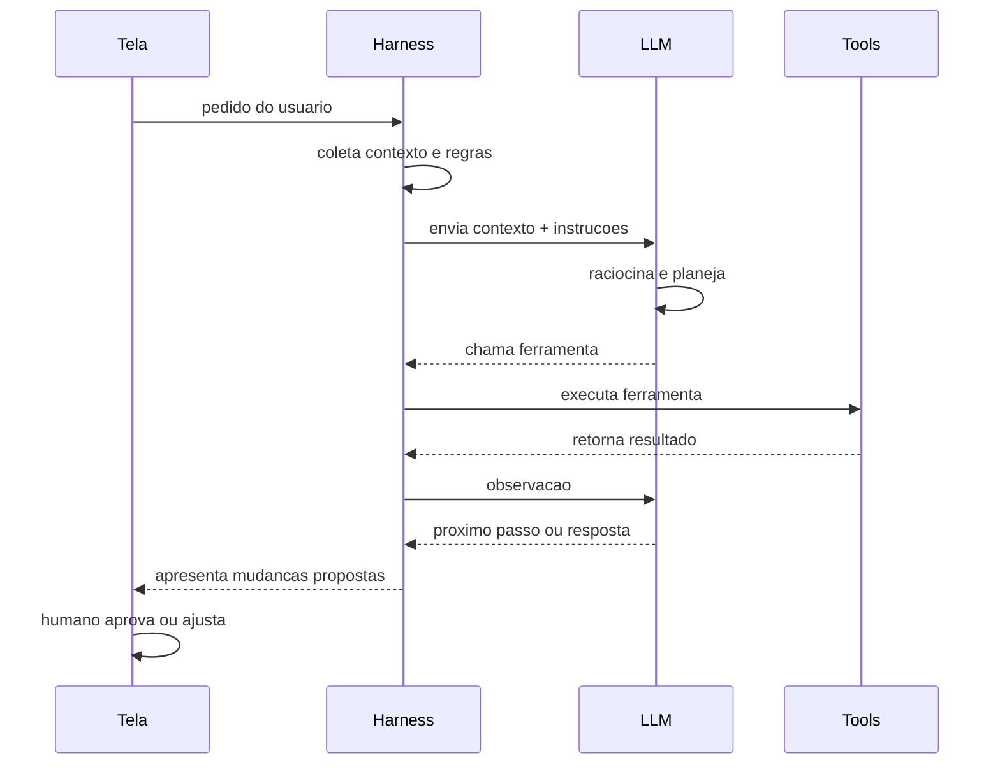

# Capítulo 5: As 4 camadas explicadas na prática: Tela, Harness, LLM e Tools

## 1. Introdução

No Capítulo 4, você conheceu o território do desenvolvedor — editor, terminal, arquivos e git — e entendeu por que a IA produtiva vive nele, e não no navegador. Agora chegamos ao coração conceitual deste livro: o modelo das 4 camadas que explica, de ponta a ponta, como funciona qualquer ferramenta de IA assistida. A Tela, o Harness, a LLM e as Tools — quatro camadas com responsabilidades distintas que, juntas, transformam uma pergunta em ação sobre o mundo real. Este é o capítulo mais importante da obra: tudo o que você aprendeu nos capítulos 1 a 3 (modelos e agentes) e no capítulo 4 (território) se organiza aqui, e tudo o que vem a seguir (harnesses, configuração, projetos) parte deste mapa.

Ao final deste capítulo, você será capaz de desenhar o fluxo completo de uma interação — o que acontece entre digitar um pedido na Tela e ver o resultado — nomeando o papel de cada camada; entender por que a separação entre "cérebro" (LLM) e "braços" (Tools) é a chave do controle; e reconhecer que todo harness do mercado, gratuito ou pago, implementa essas mesmas 4 camadas.

## 2. Explica

### A Tela: onde o usuário digita e visualiza

A primeira camada é a Tela — a interface por onde você, usuário, fala com o sistema e vê os resultados. Ela pode ser um editor como o VS Code com um painel de chat, um terminal com uma interface de linha de comando, uma interface web ou um aplicativo de desktop [1][6][14]. A Tela parece trivial, mas cumpre três funções que definem a experiência: captura a intenção (seu pedido, em linguagem natural ou comando), exibe o progresso (o que a IA está fazendo, quais arquivos está editando, quais comandos vai rodar) e apresenta os resultados para sua decisão — aceitar, rejeitar ou ajustar uma alteração. Uma boa Tela não apenas mostra a resposta final: mostra o processo, porque o processo é onde o humano exerce controle [20].

A Tela também é onde as regras de interação são definidas: ela informa ao Harness quais ferramentas estão disponíveis, quais são os limites de autoridade (o que a IA pode fazer sem perguntar) e como as mudanças propostas são apresentadas para aprovação [1][11]. É comum o iniciante subestimar essa camada — "é só uma caixa de texto" — mas a diferença entre uma Tela que mostra diffs lado a lado com botões de aceitar/rejeitar e uma que apenas imprime texto é a diferença entre operar um sistema e conversar com um oráculo. Nos capítulos 6 e 7, você vai comparar Telas de harnesses diferentes e ver como essa camada muda a experiência.

### O Harness: o orquestrador entre a intenção e a ação

A segunda camada é o Harness — o ambiente que orquestra todo o fluxo. É ele que lê a estrutura de arquivos do projeto, coleta as regras (arquivos de instrução como CLAUDE.md ou AGENTS.md), prepara o contexto que será enviado à LLM, gerencia a memória da sessão e decide, a cada passo, qual ferramenta chamar [1][20][3]. O Harness implementa, na prática, o loop agêntico que você estudou no Capítulo 3: recebe a intenção da Tela, raciocina com a LLM, executa ações via Tools, observa os resultados e itera até concluir [8][5]. Ele é, simultaneamente, o cérebro organizacional e o gerente de projeto da interação.

A qualidade do Harness depende de decisões de engenharia concretas: o que entra na janela de contexto (e em que ordem) [3]; como as ferramentas são descritas para o modelo (descrições claras melhoram a escolha) [2]; como a memória da sessão é compactada quando o contexto enche; e como as ações são apresentadas para aprovação humana. A pesquisa da Anthropic sobre engenharia de contexto (2025) mostrou que essas decisões afetam o resultado tanto quanto o modelo escolhido [3]. Para o Aprendiz de Construtor, a conclusão é libertadora: você não precisa trocar de modelo para melhorar resultados — precisa melhorar o Harness (contexto, ferramentas, memória), e isso está ao seu alcance.

### A LLM: o cérebro que raciocina, planeja e gera

A terceira camada é a LLM — o modelo de linguagem que você desmontou nos Capítulos 2 e 3. Sua função no sistema é raciocinar sobre o pedido, planejar os passos, gerar texto (código, explicações, comandos) e decidir quais ferramentas usar — declarando chamadas estruturadas de função [11][18]. É importante fixar o que a LLM não faz: ela não toca arquivos, não roda comandos e não acessa a internet diretamente. Ela produz texto — e é o Harness que interpreta esse texto como ações. Essa separação é a fonte do controle: como a LLM apenas propõe, o sistema pode validar, limitar e exigir aprovação antes de qualquer efeito no mundo [1][7].

Essa arquitetura explica também as falhas: quando um assistente "faz besteira", quase sempre a causa está na interação entre camadas — contexto insuficiente enviado pelo Harness, ferramenta mal descrita, ou autoridade mal configurada — e não num "capricho" do modelo [15][3]. Entender isso muda a forma como você depura problemas de IA: em vez de culpar o modelo, você examina o fluxo completo — o que entrou no contexto, qual ferramenta foi chamada, qual autoridade estava configurada. Esse método de diagnóstico por camada será uma ferramenta valiosa nos capítulos 9 e 11.

### As Tools: os braços que executam no mundo

A quarta camada é o conjunto de ferramentas (Tools) que o Harness disponibiliza à LLM — os "braços" do sistema. Cada ferramenta é uma função com nome, descrição e parâmetros, que o modelo pode chamar de forma estruturada [11]. O catálogo típico inclui: leitura e escrita de arquivos; execução de comandos no terminal; busca na web; execução de código (com sandbox); consultas a APIs externas; e operações de git [1][2][20]. A Anthropic publicou em 2025 o guia "Writing Effective Tools", que sistematiza o design dessas ferramentas: descrições precisas, validação de entrada e saída, e escopo mínimo [2]. O Model Context Protocol (MCP), lançado pela Anthropic em 2024, padronizou a integração de ferramentas externas, permitindo que um mesmo harness conecte ferramentas de qualquer provedor [4].

A lista de ferramentas define o que o agente pode fazer — e o que ele não pode. Esse é o ponto de controle mais importante para segurança: com menos privilégio configurado nas Tools, menos dano possível [7]. É por isso que os harnesses modernos apresentam as ações para aprovação e permitem negar comandos específicos [5][20]. No Capítulo 12, você vai aprofundar esse tema; por ora, fixe o princípio: a LLM propõe, as Tools executam, e a configuração das Tools — com o Harness — é a fronteira da autoridade do sistema.

## 3. Ilustra

Pense num restaurante moderno com um chef renomado, mas uma regra rígida: o chef nunca sai da cozinha e nunca toca nos ingredientes — ele só escreve as ordens. O sistema funciona assim: você chega (Tela), faz o pedido e senta na mesa onde verá o progresso. O maître (Harness) anota seu pedido, consulta a ficha do dia (contexto: o que há na despensa, as regras do chef, os pedidos anteriores), e leva o pedido para a cozinha. O chef (LLM) raciocina sobre o pedido e escreve ordens detalhadas: "peça ao auxiliar uma panela, ao fornecedor o peixe fresco, ao padeiro o pão". Os auxiliares (Tools) executam cada ordem — um vai à despensa, outro ao mercado, outro ao forno — e trazem os resultados de volta ao maître, que os mostra ao chef, que ajusta a próxima ordem. O prato só sai da cozinha com a sua aprovação (supervisão humana na Tela).

Como Aprendiz de Construtor, você reconhece nessa cena exatamente as 4 camadas: a Tela é a mesa do restaurante; o Harness é o maître que orquestra; a LLM é o chef que raciocina e planeja; as Tools são os auxiliares que executam. E a regra de ouro do restaurante — o chef nunca toca nos ingredientes — é a regra de ouro da arquitetura: o modelo nunca age diretamente; ele propõe, e o sistema executa [1][11]. O diagrama abaixo materializa o fluxo completo de uma interação pelas 4 camadas.



## 4. Técnica

### A arquitetura em 4 camadas em código: um harness em miniatura

A melhor forma de fixar as 4 camadas é construí-las. Vamos implementar um mini-harness em Python puro com as quatro camadas separadas: a Tela (função de entrada/saída), o Harness (orquestrador), a LLM (simulada por regras didáticas) e as Tools (funções reais). Esse esqueleto é a mesma arquitetura dos harnesses comerciais, sem a sofisticação [1][20].

```python
# CAMADA 4 - TOOLS: os bracos que executam no mundo
def tool_listar_arquivos(pasta="."):
    import os
    return sorted(nome for nome in os.listdir(pasta) if not nome.startswith("."))


def tool_ler_arquivo(caminho):
    try:
        with open(caminho, encoding="utf-8") as arquivo:
            return arquivo.read()
    except OSError as erro:
        return f"erro: {erro}"


def tool_calcular(expressao):
    partes = expressao.split()
    if len(partes) == 3 and partes[1] in ("+", "-", "*", "/"):
        a, op, b = float(partes[0]), partes[1], float(partes[2])
        return str({" + ": a + b, " - ": a - b, " * ": a * b, " / ": a / b if b else 0}[ " " + op + " " ])
    return "erro: expressao nao reconhecida"


# CAMADA 3 - LLM: o cerebro que raciocina e decide a acao (simulado)
def llm_raciocinar(pedido, contexto):
    if "quanto" in pedido and any(op in pedido for op in ("+", "-", "*", "/")):
        return {"tipo": "ferramenta", "nome": "calcular", "argumento": pedido}
    if "arquivo" in pedido and "liste" in pedido:
        return {"tipo": "ferramenta", "nome": "listar_arquivos", "argumento": "."}
    return {"tipo": "resposta", "texto": "nao tenho ferramenta para isso"}
```

O código acima define as Tools e o "cérebro". Agora o Harness — o orquestrador que conecta tudo — e a Tela:

```python
# CAMADA 2 - HARNESS: orquestra contexto, LLM e tools
class Harness:
    def __init__(self, llm, tools):
        self.llm = llm
        self.tools = tools
        self.memoria = []

    def preparar_contexto(self):
        return {"projeto": "exemplo", "regras": ["responda em portugues"]}

    def executar(self, pedido):
        contexto = self.preparar_contexto()
        self.memoria.append(f"usuario: {pedido}")
        decisao = self.llm(pedido, contexto)
        if decisao["tipo"] == "ferramenta":
            resultado = self.tools[decisao["nome"]](decisao["argumento"])
            self.memoria.append(f"tool: {decisao['nome']} -> {resultado}")
            return f"resultado: {resultado}"
        self.memoria.append(f"resposta: {decisao['texto']}")
        return decisao["texto"]


# CAMADA 1 - TELA: entrada e saida para o usuario
def tela_executar(harness, pedido):
    print(f"voce: {pedido}")
    resposta = harness.executar(pedido)
    print(f"harness: {resposta}")
    return resposta


ferramentas = {
    "listar_arquivos": tool_listar_arquivos,
    "ler_arquivo": tool_ler_arquivo,
    "calcular": tool_calcular,
}
harness = Harness(llm_raciocinar, ferramentas)
tela_executar(harness, "liste os arquivos do projeto")
tela_executar(harness, "quanto e 15 * 4?")
tela_executar(harness, "o que e um harness?")
```

Rode e observe as 4 camadas em ação: a Tela recebe o pedido, o Harness prepara o contexto e consulta a LLM, a LLM decide entre ferramenta e resposta, e as Tools executam de verdade. Cada decisão fica registrada na memória do Harness — exatamente o que os harnesses reais fazem [1][20].

### Preparando contexto com regras: o CLAUDE.md em miniatura

Um dos trabalhos mais importantes do Harness é injetar as regras do projeto no contexto — o papel dos arquivos de instrução como CLAUDE.md e AGENTS.md [20][5]. Vamos evoluir o mini-harness para carregar um arquivo de regras e incluí-lo no contexto enviado à "LLM":

```python
def carregar_regras(caminho="CLAUDE.md"):
    try:
        with open(caminho, encoding="utf-8") as arquivo:
            return arquivo.read()
    except OSError:
        return "(sem arquivo de regras)"


class HarnessComRegras(Harness):
    def preparar_contexto(self):
        contexto = super().preparar_contexto()
        contexto["regras_do_projeto"] = carregar_regras()
        return contexto


def llm_com_regras(pedido, contexto):
    if "regra" in pedido.lower():
        return {"tipo": "resposta", "texto": f"regras do projeto: {contexto['regras_do_projeto'][:120]}"}
    return llm_raciocinar(pedido, contexto)


harness2 = HarnessComRegras(llm_com_regras, ferramentas)
tela_executar(harness2, "quais sao as regras do projeto?")
```

Crie um arquivo `CLAUDE.md` no diretório com uma regra simples (por exemplo, "Use Python 3.12 ou superior e responda em portugues") e rode novamente — o Harness lê o arquivo e injeta a regra no contexto automaticamente. Esse mecanismo simples é o mesmo que os harnesses reais usam para fazer o assistente "conhecer" as convenções do seu projeto [20].

### Ferramentas que o modelo pode chamar: catálogo e descrição

No mundo real, o Harness descreve cada ferramenta para o modelo — nome, descrição e parâmetros — e o modelo escolhe qual chamar [2][11]. Vamos implementar esse catálogo estruturado:

```python
CATALOGO_TOOLS = [
    {
        "nome": "ler_arquivo",
        "descricao": "le o conteudo de um arquivo de texto",
        "parametros": {"caminho": "caminho relativo do arquivo"},
    },
    {
        "nome": "listar_arquivos",
        "descricao": "lista os arquivos do diretorio atual",
        "parametros": {},
    },
    {
        "nome": "calcular",
        "descricao": "resolve uma expressao aritmetica simples",
        "parametros": {"expressao": "expressao com operador e dois numeros"},
    },
]


def descrever_catalogo(catalogo):
    return "\n".join(
        f"- {item['nome']}: {item['descricao']} {item['parametros']}"
        for item in catalogo
    )


def llm_escolhendo_por_catalogo(pedido, contexto):
    print("catalogo disponivel para a LLM:")
    print(descrever_catalogo(CATALOGO_TOOLS))
    return llm_raciocinar(pedido, contexto)


harness3 = Harness(llm_escolhendo_por_catalogo, ferramentas)
tela_executar(harness3, "quanto e 8 / 2?")
```

Observe o contrato: o modelo vê apenas descrições (nunca o código da ferramenta), decide a chamada, e o Harness executa com o argumento validado [2]. É esse contrato que permite adicionar ferramentas novas — busca na web, APIs, git — sem alterar o modelo, apenas ampliando o catálogo. É também o ponto onde a segurança se aplica: se o catálogo não inclui exclusão de arquivos, o modelo não pode excluir [7].

### Validando argumentos: o contrato de segurança das ferramentas

Cada ferramenta do catálogo é um ponto de contato com o mundo — e cada ponto de contato precisa de um contrato: validar a entrada antes de executar, para que o modelo não consiga, por exemplo, ler um caminho fora do projeto ou executar uma ação com argumento malformado [2]. A boa prática documentada no guia "Writing Effective Tools" da Anthropic é desenhar ferramentas com validação rigorosa de parâmetros [2]. O código abaixo implementa uma ferramenta de leitura com contrato de validação — o mesmo mecanismo que os harnesses reais usam para impedir acesso a caminhos fora do escopo [2][7]:

```python
import os
import re


class FerramentaValidada:
    def __init__(self, raiz_permitida):
        self.raiz = os.path.abspath(raiz_permitida)

    def validar_caminho(self, caminho):
        """Rejeita caminhos fora da raiz permitida (contra traversal)."""
        if not re.match(r"^[A-Za-z0-9_./-]+$", caminho):
            raise ValueError("caminho com caracteres invalidos")
        absoluto = os.path.abspath(os.path.join(self.raiz, caminho))
        if not absoluto.startswith(self.raiz):
            raise PermissionError("acesso fora do diretorio permitido")
        return absoluto

    def ler(self, caminho):
        alvo = self.validar_caminho(caminho)
        try:
            with open(alvo, encoding="utf-8") as arquivo:
                return arquivo.read()
        except OSError as erro:
            return f"erro ao ler: {erro}"


ferramenta = FerramentaValidada(".")
for tentativa in ["notas.txt", "../segredo.txt", "../../etc/passwd"]:
    try:
        print(f"ler '{tentativa}':", ferramenta.ler(tentativa)[:40])
    except (ValueError, PermissionError) as erro:
        print(f"ler '{tentativa}': BLOQUEADO ({erro})")
```

Essa é a camada de segurança que torna o sistema confiável: não basta o modelo ser bem-intencionado — o contrato da ferramenta impede o abuso, intencional ou acidental [2]. Quando o modelo pede para ler `../segredo.txt`, a validação bloqueia antes de qualquer efeito no mundo. É exatamente esse desenho que o Capítulo 12 vai aprofundar sob o princípio do menor privilégio — e é a prova final de que, na arquitetura em 4 camadas, o controle mora na configuração das Tools e do Harness, não na vontade do modelo [7].

### O pipeline de contexto: priorizando o que entra na janela

A engenharia de contexto tem um problema prático: a janela do modelo é finita, e nem tudo cabe. A solução documentada é priorizar — montar o pacote de contexto com os elementos mais relevantes primeiro, e compactar ou descartar o resto [3][13]. O pipeline abaixo simula essa decisão, classificando fontes por prioridade e cortando quando o orçamento de tokens acaba [3]:

```python
def montar_pipeline(fontes, orcamento):
    prioridades = {"regras": 1, "arquivo_principal": 2, "dependencias": 3, "historico": 4}
    ordenadas = sorted(fontes, key=lambda f: prioridades.get(f["tipo"], 9))
    pacote = []
    usado = 0
    for fonte in ordenadas:
        if usado + fonte["tamanho"] > orcamento:
            continue
        pacote.append(fonte["nome"])
        usado += fonte["tamanho"]
    return pacote, usado


fontes = [
    {"nome": "CLAUDE.md", "tipo": "regras", "tamanho": 1200},
    {"nome": "tarefas.py", "tipo": "arquivo_principal", "tamanho": 5000},
    {"nome": "requirements.txt", "tipo": "dependencias", "tamanho": 400},
    {"nome": "logs_antigos.txt", "tipo": "historico", "tamanho": 3000},
]
pacote, usado = montar_pipeline(fontes, orcamento=6000)
print(f"entraram na janela ({usado} chars):", pacote)
```

A regra prática que o código materializa: regras primeiro, arquivo principal em seguida, dependências e histórico depois — e o que não cabe é deixado fora ou resumido [3][13]. Quando você vir um harness montando contexto na sua frente (Capítulo 9), estará assistindo exatamente esse pipeline em produção — e entender a priorização é o que permite diagnosticar por que uma resposta ignorou um arquivo que ficou de fora da janela [3].

## 5. Aplica

### A cena de contraste: diagnosticando uma falha camada por camada

Imagine a cena. Você configurou sua primeira ferramenta de IA assistida e pediu para ela "adicionar uma rota nova no arquivo principal". O assistente responde com confiança, mas o código que ele propõe não existe no projeto — parece gerado para um projeto imaginário. Seu primeiro instinto, natural, é concluir que "o modelo é ruim". Um colega mais experiente, porém, abre o log da sessão e começa o diagnóstico por camada: na camada do Harness, ele verifica o que entrou no contexto — e descobre que o arquivo de instruções do projeto não existia, e o Harness não sabia nem o nome do arquivo principal [3]. Na camada das Tools, ele confere se o assistente chegou a ler o projeto — não leu, porque a ferramenta de leitura não havia sido habilitada. Na camada da LLM, o comportamento era esperado: sem contexto e sem ferramentas, o modelo gera uma resposta genérica [15].

O diagnóstico: a falha não estava na LLM — estava na configuração do Harness (contexto incompleto) e no catálogo de Tools (leitura não habilitada). A correção: criar o arquivo de regras do projeto, habilitar as ferramentas de leitura e refazer o pedido. Agora o assistente lê o projeto real, encontra o arquivo principal e propõe uma rota que faz sentido [20]. Essa cena é o método que você levará para a vida: diante de qualquer resultado estranho da IA, percorra as camadas — Tela (o pedido foi claro?), Harness (o contexto estava completo?), Tools (as ferramentas certas estavam habilitadas?), e só então a LLM [2][3].

Síntese das armadilhas comuns na operação das 4 camadas: (1) culpar o modelo antes de examinar o contexto — a maioria das falhas é de contexto [3]; (2) não habilitar as ferramentas que a tarefa exige — um agente sem ferramenta de leitura é um consultor cego [2]; (3) dar autoridade demais nas Tools — a fronteira de permissão é a fronteira do dano [7]; (4) ignorar a Tela — aceitar mudanças sem revisar o diff anula a supervisão; (5) esquecer a memória — sessões sem histórico repetem os mesmos erros [5][17].

## 6. Conclusão

Você agora possui o mapa do livro inteiro. Os três pontos deste capítulo: primeiro, a arquitetura tem 4 camadas com responsabilidades distintas — Tela (interface), Harness (orquestração), LLM (raciocínio) e Tools (execução) [1]; segundo, a regra de ouro é a separação entre propor e executar — a LLM nunca age diretamente, o que torna o sistema controlável e auditável [11][7]; terceiro, você construiu um harness em miniatura com as 4 camadas em Python puro e viu o fluxo completo de uma interação, do pedido à aprovação [20].

O desafio desta etapa: evolua o mini-harness adicionando uma ferramenta nova ao catálogo (por exemplo, uma que conte palavras de um arquivo) e um mecanismo de aprovação na Tela — o pedido é executado somente se o "humano" confirmar. Isso exercita as duas habilidades que definem o uso profissional das 4 camadas: ampliar o catálogo e controlar a autoridade.

No próximo módulo, você vai conhecer os harnesses de verdade: o Capítulo 6 explica o que um harness faz por você — contexto, regras, memória e rastreamento — e por que ele é a peça central da produtividade assistida.

## 7. Referências Bibliográficas

[1] ANTHROPIC. *Building Effective Agents*. São Francisco: Anthropic, 2024. Disponível em: https://www.anthropic.com/research/building-effective-agents. Acesso em: 5 ago. 2026.

[2] ANTHROPIC. *Writing Effective Tools*. São Francisco: Anthropic, 2025. Disponível em: https://www.anthropic.com/research/writing-effective-tools. Acesso em: 5 ago. 2026.

[3] ANTHROPIC. *Effective Context Engineering for AI Agents*. São Francisco: Anthropic, 2025. Disponível em: https://www.anthropic.com/research/effective-context-engineering-for-ai-agents. Acesso em: 5 ago. 2026.

[4] ANTHROPIC. *Model Context Protocol: Open Standard for Connecting AI Assistants*. São Francisco: Anthropic, 2024. Disponível em: https://modelcontextprotocol.io/. Acesso em: 5 ago. 2026.

[5] ANTHROPIC. *Claude Code Overview*. São Francisco: Anthropic, 2025. Disponível em: https://platform.claude.com/docs/en/claude-code/overview. Acesso em: 5 ago. 2026.

[6] OPENCODE. *Documentation*. São Francisco: SST, 2025. Disponível em: https://opencode.ai/docs. Acesso em: 5 ago. 2026.

[7] CURSOR. *Documentation*. San Francisco: Anysphere, 2025. Disponível em: https://cursor.com/docs. Acesso em: 5 ago. 2026.

[8] YAO, Shunyu; ZHAO, Jeffrey; YU, Dian; et al. ReAct: Synergizing Reasoning and Acting in Language Models. *International Conference on Learning Representations*, 2023.

[9] SCHICK, Timo; DWIVEDI-YU, Jane; DESSI, Roberto; et al. Toolformer: Language Models Can Teach Themselves to Use Tools. *Advances in Neural Information Processing Systems*, v. 36, 2023.

[10] XI, Zhiheng; CHEN, Wenxiang; GUO, Xin; et al. *The Rise and Potential of Large Language Model Based Agents: A Survey*. arXiv:2309.07864, 2023.

[11] OPENAI. *Function Calling and Other API Updates*. San Francisco: OpenAI, 2023. Disponível em: https://openai.com/blog/function-calling-and-other-api-updates. Acesso em: 5 ago. 2026.

[12] KARPATHY, Andrej. *Software 2.0*. Medium, 2017. Disponível em: https://karpathy.medium.com/software-2-0-a64152b37c35. Acesso em: 5 ago. 2026.

[13] LIU, Nelson; LIN, Kevin; HEWITT, John; et al. Lost in the Middle: How Language Models Use Long Contexts. *Transactions of the Association for Computational Linguistics*, v. 12, p. 157-173, 2023.

[14] MICROSOFT. *Visual Studio Code Documentation*. Redmond: Microsoft, 2025. Disponível em: https://code.visualstudio.com/docs. Acesso em: 5 ago. 2026.

[15] GNU PROJECT. *Bash Reference Manual*. Boston: Free Software Foundation, 2023. Disponível em: https://www.gnu.org/software/bash/manual/. Acesso em: 5 ago. 2026.

[16] IBM. *What is an API?* Armonk: IBM, 2024. Disponível em: https://www.ibm.com/topics/api. Acesso em: 5 ago. 2026.

[17] HUANG, Lei; YU, Weijiang; MA, Weitao; et al. *A Survey on Hallucination in Large Language Models: Principles, Taxonomy, Challenges, and Open Questions*. arXiv:2311.05232, 2023.

[18] PARK, Joon Sung; O'BRIEN, Joseph; CAI, Carrie; et al. Generative Agents: Interactive Simulacra of Human Behavior. *Proceedings of the ACM Symposium on User Interface Software and Technology*, 2023.

[19] ANTHROPIC. *Introducing the Claude 3 Family*. São Francisco: Anthropic, 2024. Disponível em: https://www.anthropic.com/news/claude-3-family. Acesso em: 5 ago. 2026.

[20] FREEBUFF. *Freebuff: Ecossistema gratuito de agentes de codificação*. 2025. Disponível em: https://freebuff.com/. Acesso em: 5 ago. 2026.
