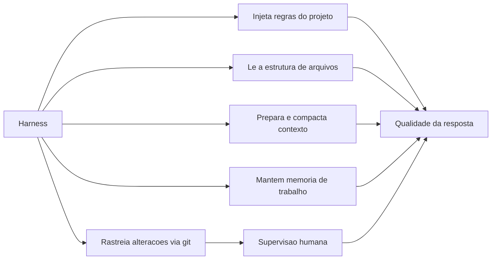

# Capítulo 6: O que é um harness e por que ele é essencial

## 1. Introdução

No Capítulo 5, você montou o mapa das 4 camadas — Tela, Harness, LLM e Tools — e construiu um harness em miniatura em Python puro. Agora vamos aprofundar na camada mais estratégica do sistema: o Harness. Este capítulo responde a duas perguntas que definem o uso profissional de IA: qual é a diferença prática entre conversar com uma LLM pura e trabalhar com um harness estruturado? E o que o harness faz por você — injeção de regras de projeto, rastreamento de alterações, memória de trabalho — que justifica torná-lo a peça central do seu fluxo?

Ao final deste capítulo, você será capaz de explicar o valor do harness com um vocabulário preciso; listar os serviços concretos que ele presta (contexto, regras, memória, ferramentas, supervisão); e avaliar, de forma crítica, qualquer ferramenta de IA assistida — identificando o que é a LLM e o que é o harness por trás dela.

## 2. Explica

### LLM pura vs. harness estruturado: a diferença prática

A LLM pura é a API ou o chat: você envia um texto, recebe um texto. O harness é a camada que transforma esse intercâmbio em trabalho real sobre um projeto. A diferença não é o modelo — pode ser exatamente o mesmo — e sim o que existe ao redor dele: o harness lê a estrutura de arquivos, coleta as regras do projeto, monta o contexto, gerencia a memória da sessão, escolhe e executa ferramentas e apresenta as mudanças para sua aprovação [1][2][14]. Em termos de produto final, a diferença é a distância entre receber uma sugestão de código e receber uma alteração aplicada, testada e pronta para revisão [2].

Pense na metáfora do maître que você conheceu no Capítulo 5: a LLM é o chef, que raciocina e planeja; o harness é o maître, que organiza tudo ao redor — a ficha do dia (contexto), as ordens (ferramentas), a comunicação com o cliente (Tela). Sem o maître, o chef até daria opiniões saborosas, mas nenhum prato sairia. Os guias da indústria convergem para a mesma conclusão: agentes eficazes são construídos sobre loops bem projetados, não sobre um modelo "mais forte" [1][4]. Para o Aprendiz de Construtor, essa é a notícia mais importante da obra: a qualidade do seu fluxo depende menos do modelo que você escolhe e mais da peça que você pode configurar — o harness.

### Como o harness injeta regras de projeto e lê a estrutura de arquivos

O primeiro serviço do harness é a preparação do contexto, e dentro dela, uma função específica e poderosa: injetar as regras do projeto. Os harnesses modernos leem arquivos de instrução — como CLAUDE.md (convenção popularizada pelo Claude Code) e AGENTS.md (padrão aberto adotado por dezenas de ferramentas) — que descrevem as convenções do repositório: linguagens usadas, estrutura de pastas, comandos de teste, estilos de código, decisões arquiteturais [2][5]. Essas regras entram no contexto em cada sessão, fazendo o assistente "conhecer" o projeto mesmo em conversas novas. Sem esse mecanismo, cada sessão começaria do zero — o equivalente a contratar um estagiário novo todo dia e esperar que adivinhe as regras da casa [3].

O segundo serviço é a leitura da estrutura de arquivos: antes de responder, o harness mapeia o repositório — quais arquivos existem, onde está cada módulo, o que mudou recentemente (via git) — e usa esse mapa para decidir o que incluir no contexto e quais arquivos ler antes de propor uma alteração [16][2]. É essa capacidade que permite ao assistente editar o arquivo certo do projeto real, em vez de sugerir código para um projeto imaginário — o problema clássico do chat isolado que você estudou no Capítulo 4. A engenharia de contexto — o que entra, em que ordem, com que compressão — é hoje um campo documentado com técnicas específicas: priorizar informação relevante, resumir blocos antigos e manter os fatos críticos à mão [3].

### Rastreamento de alterações e memória de trabalho

O terceiro serviço é o rastreamento de alterações. Como o projeto vive num repositório git, o harness pode mostrar exatamente o que está propondo: um diff linha por linha, arquivos criados e modificados, e a opção de aceitar ou rejeitar cada mudança [2][14][16]. Esse ciclo de revisão é o coração da supervisão humana — o humano no loop que transforma um gerador de texto em uma ferramenta confiável de engenharia [1]. Na prática, você raramente aceita uma mudança sem olhar: você lê o diff, ajusta e só então confirma. O rastreamento também permite o retorno: se uma alteração quebra um teste, o harness reverte e tenta outro caminho, com o histórico da tentativa anterior disponível para o modelo [4].

O quarto serviço é a memória de trabalho. Ao contrário da API pura, que esquece tudo entre chamadas, o harness mantém o estado da sessão: o objetivo original, as decisões já tomadas, os arquivos já tocados e os resultados de cada passo [17]. Quando o contexto enche, ele compacta seções antigas mantendo os pontos críticos — um padrão documentado pela pesquisa de engenharia de contexto [3][13]. É essa memória que permite tarefas longas: refatorar um módulo inteiro, adicionar uma feature completa, investigar um bug que atravessa vários arquivos — sem que o assistente "esqueça" o meio do caminho [4][7]. Sem harness, você pagaria esse preço manualmente, reexplicando tudo a cada prompt — o erro clássico de quem usa chat puro para tarefas reais.

### O harness como superfície de controle e segurança

O quinto serviço, e talvez o mais importante para o uso responsável, é a superfície de controle. O harness é o ponto onde a autoridade é definida: quais ferramentas o modelo pode chamar, quais comandos exigem aprovação, quais arquivos são proibidos [1][2][15]. É ele que implementa o princípio do menor privilégio na prática — você configura o que o agente pode fazer, e qualquer ação fora disso é bloqueada ou encaminhada para sua decisão [1]. É também o harness que registra o que foi feito: logs de cada chamada de ferramenta, de cada alteração, de cada comando — criando a auditabilidade que sistemas profissionais exigem [2][14]. Quando algo der errado (e vai dar), é no harness que você procura o rastro — não na "mente" do modelo.

## 3. Ilustra

Pense num consultório médico com um sistema de prontuário digital. O médico (a LLM) tem o conhecimento — mas o sistema de prontuário (o harness) é o que torna esse conhecimento útil e seguro. Quando você chega, o sistema puxa seu histórico (memória de trabalho), consulta as diretrizes do hospital (regras de projeto), aguça os exames pedidos e já realizados (estrutura de arquivos), registra cada procedimento realizado (rastreamento de alterações) e exige sua assinatura antes de procedimentos invasivos (supervisão humana). Um médico brilhante sem prontuário atende um paciente por vez e esquece metade do histórico; um médico mediano com um bom sistema atende dezenas de pacientes com continuidade e segurança. É exatamente essa a matemática do harness: a LLM é o conhecimento, o harness é o sistema que o torna operacional [1][2].

Como Aprendiz de Construtor, você reconhece aqui o desencantamento produtivo em sua forma final: não existe "a IA" — existe um sistema de 4 camadas em que a qualidade do resultado depende da qualidade do harness tanto quanto da LLM. A caixa-preta se abriu completamente: dentro dela há um cérebro (a LLM) operando dentro de um sistema de prontuário (o harness) que você pode configurar, auditar e controlar. O diagrama abaixo mostra os cinco serviços do harness que você acabou de estudar.



## 4. Técnica

### O harness com regras, memória e rastreamento: a versão completa

Vamos evoluir o mini-harness do Capítulo 5 até que ele implemente os cinco serviços: regras do projeto, leitura de arquivos, preparação de contexto, memória de trabalho e um rastreamento simples de alterações. O código abaixo é autocontido e rodável em Python puro [1][2][20].

```python
import hashlib
import os


class Projeto:
    """Simula o repositorio: arquivos, regras e historico de alteracoes."""

    def __init__(self, regras):
        self.regras = regras
        self.historico = []

    def lista_arquivos(self):
        return [nome for nome in os.listdir(".") if nome.endswith((".py", ".md", ".txt"))]

    def ler(self, caminho):
        try:
            return open(caminho, encoding="utf-8").read()
        except OSError:
            return ""

    def registrar_mudanca(self, descricao):
        self.historico.append(descricao)


class HarnessServicos:
    def __init__(self, projeto, modelo):
        self.projeto = projeto
        self.modelo = modelo
        self.memoria = []

    def preparar_contexto(self):
        """Servico 1 e 2: regras do projeto + estrutura de arquivos."""
        arquivos = self.projeto.lista_arquivos()
        resumo = "\n".join(f"- {a} ({len(self.projeto.ler(a))} chars)" for a in arquivos)
        return {
            "regras": self.projeto.regras,
            "estrutura": resumo,
            "memoria": list(self.memoria[-5:]),
        }

    def lembrar(self, evento):
        """Servico 4: memoria de trabalho da sessao."""
        self.memoria.append(evento)
        if len(self.memoria) > 20:
            self.memoria = self.memoria[-10:]

    def executar(self, pedido):
        contexto = self.preparar_contexto()
        self.lembrar(f"usuario: {pedido}")
        decisao = self.modelo(pedido, contexto)
        if decisao["tipo"] == "ferramenta":
            if decisao["nome"] == "ler_arquivo":
                resultado = self.projeto.ler(decisao["argumento"])
                self.projeto.registrar_mudanca(f"leitura de {decisao['argumento']}")
                self.lembrar(f"tool: {decisao['nome']}")
                return resultado
            return "ferramenta nao disponivel"
        self.lembrar(f"resposta: {decisao['texto']}")
        return decisao["texto"]


def modelo_didatico(pedido, contexto):
    """Simula a LLM: usa o contexto que o harness preparou."""
    if "regras" in pedido.lower():
        return {"tipo": "resposta", "texto": f"Regras do projeto: {contexto['regras']}"}
    if "leia" in pedido.lower() and "arquivo" in pedido:
        nome = pedido.lower().replace("leia o arquivo", "").strip()
        return {"tipo": "ferramenta", "nome": "ler_arquivo", "argumento": nome}
    return {"tipo": "resposta", "texto": f"Contexto tem {len(contexto['estrutura'])} chars de estrutura"}


projeto = Projeto(regras="responda em portugues; use python puro; rode testes antes de entregar")
harness = HarnessServicos(projeto, modelo_didatico)
print(harness.executar("quais sao as regras do projeto?"))
print(harness.executar("leia o arquivo contador.py")[:60])
print("historico do projeto:", projeto.historico)
```

Rode e observe: o harness injetou as regras, leu a estrutura, manteve memória e registrou cada ação — os cinco serviços em funcionamento. Quando você usar um harness real nos capítulos 7 e 9, estará observando exatamente essas mesmas engrenagens, com interfaces profissionais [20].

### Rastreando alterações: o diff em miniatura

O rastreamento de alterações é o que permite a supervisão humana. Vamos implementar um comparador de arquivos simples — a essência do diff que os harnesses mostram antes de você aceitar uma mudança [16]:

```python
def diff_simples(antes, depois):
    """Retorna as linhas que mudaram, no formato mais proximo de um diff real."""
    linhas_antes = antes.splitlines()
    linhas_depois = depois.splitlines()
    mudancas = []
    max_linhas = max(len(linhas_antes), len(linhas_depois))
    for i in range(max_linhas):
        antiga = linhas_antes[i] if i < len(linhas_antes) else None
        nova = linhas_depois[i] if i < len(linhas_depois) else None
        if antiga != nova:
            if antiga is not None:
                mudancas.append(f"- {antiga}")
            if nova is not None:
                mudancas.append(f"+ {nova}")
    return mudancas


antes = "def saudacao(nome):\n    return 'ola, ' + nome\n"
depois = "def saudacao(nome):\n    return f'ola, {nome}'\n"
for linha in diff_simples(antes, depois):
    print(linha)
```

Esse é o formato essencial que você verá na Tela de qualquer harness: linhas removidas e adicionadas, prontas para sua revisão. O hábito profissional — ler o diff antes de aceitar — é a supervisão humana que transforma a IA em ferramenta confiável [1][2].

### Compactando contexto: a memória que não transborda

O último serviço técnico do capítulo é a compactação de contexto — o que o harness faz quando a sessão cresce demais [3][13]. A ideia: resumir blocos antigos, mantendo os fatos críticos. Implementação didática:

```python
def compactar_memoria(memoria, limite=6):
    """Mantem os ultimos eventos e um resumo dos anteriores."""
    if len(memoria) <= limite:
        return list(memoria)
    antigos = memoria[: len(memoria) - limite]
    recentes = memoria[len(memoria) - limite :]
    resumo = f"[resumo de {len(antigos)} eventos anteriores]"
    return [resumo] + recentes


memoria = [f"evento {i}" for i in range(15)]
print("antes:", len(memoria))
memoria = compactar_memoria(memoria)
print("depois:", memoria)
```

É assim que harnesses mantêm sessões de centenas de passos dentro da janela de contexto: o modelo lê o resumo do passado e os detalhes do presente [3]. Nos harnesses reais, o resumo é gerado pelo próprio modelo — e você verá a diferença prática na qualidade de tarefas longas entre uma ferramenta que compacta e uma que simplesmente corta [13].

### O loop agêntico com critério de conclusão

Um agente profissional não itera para sempre: ele tem um critério objetivo de conclusão e um limite de iterações — o segundo protege contra o loop infinito, um dos erros clássicos de sistemas agênticos [1][4]. O loop abaixo combina as peças do capítulo: raciocínio, ação, observação, verificação do critério e limite máximo de passos [7]:

```python
class LoopAgenico:
    def __init__(self, modelo, ferramentas, max_passos=6):
        self.modelo = modelo
        self.ferramentas = ferramentas
        self.max_passos = max_passos
        self.rastro = []

    def concluido(self, observacao):
        """Criterio objetivo de conclusao: a observacao contem a resposta final."""
        return observacao.startswith("RESPOSTA:")

    def executar(self, tarefa):
        observacao = tarefa
        for passo in range(1, self.max_passos + 1):
            decisao = self.modelo(observacao)
            if decisao["tipo"] == "resposta":
                observacao = "RESPOSTA: " + decisao["texto"]
            else:
                observacao = self.ferramentas[decisao["nome"]](decisao["argumento"])
            self.rastro.append((passo, decisao["nome"], observacao[:60]))
            if self.concluido(observacao):
                return observacao, self.rastro
        return "LIMITE_ATINGIDO", self.rastro


def modelo_iterativo(observacao):
    if "RESPOSTA:" in observacao:
        return {"tipo": "resposta", "nome": "nenhuma", "argumento": "", "texto": observacao.split("RESPOSTA: ")[1]}
    if "numero" in observacao.lower():
        return {"tipo": "resposta", "nome": "nenhuma", "argumento": "", "texto": "resolvido"}
    return {"tipo": "ferramenta", "nome": "consultar", "argumento": observacao}


def tool_consultar(argumento):
    return "RESPOSTA: valor resolvido com base em " + argumento


loop = LoopAgenico(modelo_iterativo, {"consultar": tool_consultar}, max_passos=4)
resultado, rastro = loop.executar("encontre o numero")
for passo, acao, obs in rastro:
    print(f"passo {passo}: {acao} -> {obs}")
print("resultado:", resultado)
```

O rastro registrado a cada passo é o que torna o agente auditável — e o limite de passos é o que o torna seguro [1][4]. No mundo real, o harness implementa exatamente essas duas regras: critério de conclusão (o que conta como pronto) e teto de iterações (quando parar). É essa dupla que separa um agente confiável de um que roda sem parar consumindo tokens e tempo — e você vai reencontrá-la no Capítulo 11, quando depurar loops de erro no seu primeiro projeto [1][7].

### O arquivo de regras na prática: um CLAUDE.md de exemplo

A injeção de regras de projeto — o primeiro serviço do harness — depende de um artefato concreto: o arquivo de instruções. O padrão consolidado é simples: um arquivo de texto na raiz do projeto que o harness lê no início de cada sessão [2][5]. O exemplo abaixo mostra um arquivo de regras mínimo e eficaz, e o código ao lado lê e exibe as regras — o mesmo mecanismo que o harness executa automaticamente:

```markdown
# Regras do projeto

- Linguagem: Python 3.12, apenas biblioteca padrao.
- Testes: todo novo codigo deve vir com teste usando assert.
- Commits: mensagens em portugues, imperativo.
- Estrutura: logica em app/, testes em tests/.
- Respostas da IA: em portugues, codigo completo quando pedido.
```

```python
def carregar_regras_do_projeto(caminho="CLAUDE.md"):
    try:
        return open(caminho, encoding="utf-8").read()
    except OSError:
        return "(arquivo de regras nao encontrado)"


print(carregar_regras_do_projeto())
```

O valor de um bom arquivo de regras é cumulativo: cada sessão nova do harness começa com o conhecimento acumulado do projeto, e instruções boas (Capítulo 10) ficam muito mais curtas porque o contexto já está resolvido [2][5]. Para o Aprendiz de Construtor, o hábito de manter CLAUDE.md/AGENTS.md atualizado é um dos investimentos de maior retorno em produtividade assistida — o Capítulo 12 retoma o tema sob a ótica de segurança e documentação [5].

## 5. Aplica

### A cena de contraste: duas sessões, o mesmo modelo, resultados opostos

Imagine a cena. Dois colegas — Ana e Bruno — recebem a mesma tarefa: "adicione validação de e-mail ao formulário de cadastro". Ana abre um chat de API pura, cola o arquivo do formulário e pede a solução; recebe um código razoável, mas que ignora a biblioteca de validação que o projeto já usa, viola o padrão de erros do time e não tem teste. Ela passa a tarde adaptando manualmente. Bruno abre o harness do projeto: o assistente lê as regras do repositório (que mandam usar a biblioteca padrão e escrever testes), encontra o padrão de validação existente em outro arquivo, propõe a mudança num diff limpo e roda os testes antes de apresentar. Bruno revisa o diff, ajusta um detalhe e aprova em dez minutos. Mesmo modelo, mesmo pedido — resultados incomensuráveis [2][3].

O diagnóstico, ligado à teoria: a diferença não estava na LLM, e sim nos cinco serviços do harness — regras injetadas, estrutura lida, contexto preparado, memória mantida e alterações rastreadas [1][2]. Ana pagou, em tempo de adaptação manual, exatamente o trabalho que o harness faz automaticamente. A correção não é "usar um modelo melhor" — é usar um sistema completo: harness + contexto + ferramentas + supervisão. Essa cena resume a tese dos capítulos 6 e 7: no mundo profissional, o diferencial não é a LLM que você escolhe, é o harness que você opera.

Síntese das armadilhas comuns: (1) comparar LLMs sem comparar harnesses — o benchmark honesto compara sistemas completos; (2) ignorar os arquivos de regras — um projeto sem CLAUDE.md/AGENTS.md desperdiça o principal serviço do harness [2][5]; (3) aceitar mudanças sem revisar o diff — anula a supervisão e corrompe o histórico [16]; (4) reexplicar o projeto a cada prompt — sinal de que a memória de trabalho não está sendo usada; (5) dar autoridade total às ferramentas — a fronteira do controle está no harness, configure-a [1][15].

## 6. Conclusão

Você agora entende a peça que separa amadores de profissionais no uso de IA. Os três pontos deste capítulo: primeiro, a LLM pura responde, mas o harness trabalha — contexto, regras, memória, ferramentas e supervisão são os serviços que transformam o modelo em ferramenta de engenharia [1][2]; segundo, os cinco serviços são concretos e configuráveis — regras do projeto, leitura da estrutura, preparação de contexto, rastreamento de alterações e memória de trabalho [3][16][17]; terceiro, o harness é a superfície de controle — é nele que a autoridade é definida e a auditabilidade é criada [1][15].

O desafio desta etapa: adicione ao HarnessServicos do código da seção Técnica um serviço de aprovação — antes de executar uma ferramenta "destrutiva" (simule uma exclusão), o harness deve exigir confirmação explícita. Isso exercita a habilidade que define o uso profissional: configurar o controle, não apenas admirar a automação.

No próximo capítulo, você vai conhecer os harnesses que existem no mercado — comerciais e gratuitos — com um comparativo honesto de recursos, facilidade e cenários ideais para o seu perfil de iniciante.

## 7. Referências Bibliográficas

[1] ANTHROPIC. *Building Effective Agents*. São Francisco: Anthropic, 2024. Disponível em: https://www.anthropic.com/research/building-effective-agents. Acesso em: 5 ago. 2026.

[2] ANTHROPIC. *Claude Code Overview*. São Francisco: Anthropic, 2025. Disponível em: https://platform.claude.com/docs/en/claude-code/overview. Acesso em: 5 ago. 2026.

[3] ANTHROPIC. *Effective Context Engineering for AI Agents*. São Francisco: Anthropic, 2025. Disponível em: https://www.anthropic.com/research/effective-context-engineering-for-ai-agents. Acesso em: 5 ago. 2026.

[4] BISCHOF, Bryan; MILLER, Charles. *Agents and Agentic Workflows*. Sebastopol: O'Reilly Media, 2025.

[5] ANTHROPIC. *Claude Code Best Practices*. São Francisco: Anthropic, 2025. Disponível em: https://www.anthropic.com/engineering/claude-code-best-practices. Acesso em: 5 ago. 2026.

[6] OPENCODE. *Documentation*. São Francisco: SST, 2025. Disponível em: https://opencode.ai/docs. Acesso em: 5 ago. 2026.

[7] YAO, Shunyu; ZHAO, Jeffrey; YU, Dian; et al. ReAct: Synergizing Reasoning and Acting in Language Models. *International Conference on Learning Representations*, 2023.

[8] XI, Zhiheng; CHEN, Wenxiang; GUO, Xin; et al. *The Rise and Potential of Large Language Model Based Agents: A Survey*. arXiv:2309.07864, 2023.

[9] ANTHROPIC. *Model Context Protocol: Open Standard for Connecting AI Assistants*. São Francisco: Anthropic, 2024. Disponível em: https://modelcontextprotocol.io/. Acesso em: 5 ago. 2026.

[10] ANTHROPIC. *Agent Skills: Bringing Human Skills to Agents*. São Francisco: Anthropic, 2025. Disponível em: https://www.anthropic.com/engineering/agent-skills. Acesso em: 5 ago. 2026.

[11] KARPATHY, Andrej. *Software 2.0*. Medium, 2017. Disponível em: https://karpathy.medium.com/software-2-0-a64152b37c35. Acesso em: 5 ago. 2026.

[12] ANTHROPIC. *Prompt Engineering Overview*. São Francisco: Anthropic, 2025. Disponível em: https://platform.claude.com/docs/en/build-with-claude/prompt-engineering/overview. Acesso em: 5 ago. 2026.

[13] LIU, Nelson; LIN, Kevin; HEWITT, John; et al. Lost in the Middle: How Language Models Use Long Contexts. *Transactions of the Association for Computational Linguistics*, v. 12, p. 157-173, 2023.

[14] HUANG, Lei; YU, Weijiang; MA, Weitao; et al. *A Survey on Hallucination in Large Language Models: Principles, Taxonomy, Challenges, and Open Questions*. arXiv:2311.05232, 2023.

[15] ANTHROPIC. *Writing Effective Tools*. São Francisco: Anthropic, 2025. Disponível em: https://www.anthropic.com/research/writing-effective-tools. Acesso em: 5 ago. 2026.

[16] CHACON, Scott; STRAUB, Ben. *Pro Git*. 2. ed. Nova York: Apress, 2014.

[17] ANTHROPIC. *Memory Tools: Building Real Memories into Claude*. São Francisco: Anthropic, 2025. Disponível em: https://www.anthropic.com/news/memory-tools. Acesso em: 5 ago. 2026.

[18] OPENAI. *Function Calling and Other API Updates*. San Francisco: OpenAI, 2023. Disponível em: https://openai.com/blog/function-calling-and-other-api-updates. Acesso em: 5 ago. 2026.

[19] FREEBUFF. *Freebuff: Ecossistema gratuito de agentes de codificação*. 2025. Disponível em: https://freebuff.com/. Acesso em: 5 ago. 2026.

[20] CURSOR. *Documentation*. San Francisco: Anysphere, 2025. Disponível em: https://cursor.com/docs. Acesso em: 5 ago. 2026.
