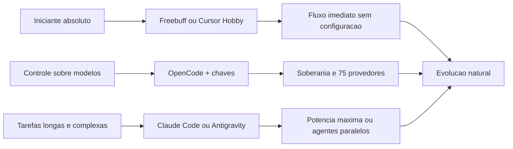

# Capítulo 7: Ecossistema de harnesses práticos: ferramentas comerciais e alternativas gratuitas

## 1. Introdução

No Capítulo 6, você entendeu por que o harness é a peça central da arquitetura — contexto, regras, memória, ferramentas e supervisão. Agora você vai conhecer os harnesses que existem de verdade, no mercado de 2025-2026, e aprender a escolher entre eles. A boa notícia, que sustenta a tese de custo zero deste livro, é que o ecossistema tem opções para todos os perfis: ferramentas comerciais maduras e poderosas, e alternativas gratuitas e open-source que já oferecem capacidades agênticas de primeira linha.

Ao final deste capítulo, você será capaz de comparar harnesses com critérios objetivos — recursos, facilidade de uso, custo, privacidade e cenário ideal — e escolher o ponto de partida certo para o seu perfil de iniciante. Você também entenderá por que "qual harness usar" é uma decisão de arquitetura, e não de moda.

## 2. Explica

### Os harnesses comerciais: Claude Code, Cursor e Antigravity

O harness comercial mais influente da atualidade é o Claude Code, da Anthropic: uma interface de terminal que integra profundamente com os modelos Claude, com loops de planejamento, edição multi-arquivo, gestão de git e comandos de barra [1][2]. É a referência de qualidade para tarefas longas e complexas, e o seu custo — via assinaturas Pro ou Max da Anthropic ou créditos de API — o posiciona para quem já investe no ecossistema ou precisa de máxima potência [2]. O Cursor, por sua vez, é uma IDE completa baseada em VS Code: autocomplete preditivo (Tab), chat lateral e um agente multi-arquivo (Composer), com modo de privacidade configurável e suporte a múltiplos modelos [3][20]. Seu plano Hobby gratuito, sem cartão de crédito, é uma das melhores portas de entrada comerciais para o iniciante [3].

O Antigravity, da Google, é a aposta mais nova (novembro de 2025): uma plataforma agêntica com dois modos — o Editor, para trabalho síncrono, e a superfície Manager, para orquestrar múltiplos agentes em paralelo — com agentes que operam navegador e terminal e geram artefatos visuais (planos, capturas de tela) para verificação [4]. Lançado em preview público gratuito, com limites generosos de uso, ele é uma alternativa forte para quem quer experimentar a fronteira "agent-first" sem custo inicial [4]. O trio comercial mostra o estado da arte: terminal especializado, IDE completa e plataforma agêntica — três filosofias diferentes do mesmo conceito que você estudou no Capítulo 6.

### As alternativas gratuitas e open-source: OpenCode, MiMo Code e Freebuff

No lado gratuito, o ecossistema floresceu. O OpenCode (sst/opencode) é um harness de terminal open source (licença MIT), model-agnostic, que se conecta a mais de 75 provedores de LLM via o catálogo Models.dev — incluindo modelos locais via Ollama — e suporta sessões paralelas e integração LSP nativa [5][12]. Seu diferencial é a soberania: sem retenção de código em servidores remotos, com o usuário trazendo as próprias chaves ou modelos gratuitos [5]. O MiMo Code, da Xiaomi, é um fork do OpenCode especializado em tarefas longas: memória persistente em SQLite, checkpoints automáticos e compressão dinâmica de contexto, com um canal anônimo gratuito (MiMo Auto) e compatibilidade com OpenRouter e outros provedores [6][17].

O Freebuff completa o trio gratuito com uma filosofia distinta: um ecossistema de agentes de codificação (CLI, Desktop, construtor Web e Cloud sandbox) financiado por anúncios discretos, que agrega modelos de fronteira gratuitos — como variantes de DeepSeek, MiniMax e Kimi — sem exigir chaves próprias ou cartão de crédito [19]. Para o iniciante absoluto, o Freebuff é talvez a porta mais simples: instala, abre e usa — a IA funciona sem nenhuma configuração de provedor [19]. O trio gratuito mostra que "grátis" não significa "inferior": significa soberania (OpenCode), resistência para tarefas longas (MiMo) e acessibilidade máxima (Freebuff).

### O comparativo que importa: recursos, facilidade e cenário ideal

Comparar harnesses exige critérios, e os critérios certos dependem do seu momento. Para o iniciante, a facilidade de configuração pesa mais do que a potência máxima: um harness que você usa de verdade vale mais do que um que você abandona na primeira barreira [3][19]. O custo é o segundo critério: hoje é possível operar um fluxo completo — harness gratuito + modelos gratuitos — por zero reais, como você verá nos capítulos 8 e 9 [5][19]. A privacidade é o terceiro: ferramentas locais ou com controle de retenção se destacam para código sensível [5][3]. E o cenário ideal fecha o quadro: terminal para quem vive em linha de comando, IDE para quem prefere ambiente gráfico, e plataforma agêntica para quem quer delegar tarefas de ponta a ponta [1][4].

A indústria fornece contexto útil para a decisão: a adoção de ferramentas de IA no desenvolvimento é massiva, como os dados da Stack Overflow e da GitHub documentam [9][11], e as previsões da Gartner indicam que assistentes de código serão ubíquos [10]. Mas a decisão individual não precisa seguir a moda: ela deve seguir o seu fluxo de trabalho. Um Aprendiz de Construtor pode começar no Freebuff ou no Cursor Hobby, migrar para o OpenCode quando quiser mais controle sobre modelos, e explorar Claude Code ou Antigravity quando as tarefas exigirem potência máxima [1][4][19].

## 3. Ilustra

Pense na escolha de um carro para aprender a dirigir. O Cursor é o carro de passeio popular: fácil, confortável, com painel amigável (IDE gráfica) — perfeito para o primeiro mês, e o plano gratuito é como um test-drive sem compromisso [3]. O OpenCode é o carro com câmbio manual: menos conforto, mais controle — você escolhe o motor (modelo), a oficina (provedor) e o combustível (chaves ou modelos locais), e nada é enviado para uma "concessionária" sem seu controle [5]. O Claude Code é o carro esportivo de pista: potência máxima, mas exige pilotagem experiente e manutenção cara [1][2]. O Antigravity é o carro autônomo experimental: você define o destino e supervisiona a viagem — empolgante, mas ainda em evolução [4]. E o Freebuff é o carro compartilhado da cidade: você entra e usa, o custo é coberto por outro modelo (anúncios), e a simplicidade é o trunfo [19].

Como Aprendiz de Construtor, a lição da metáfora é a decisão por cenário, não por status: não existe "o melhor harness" — existe o harness certo para o seu momento, seu fluxo e seu bolso. O diagrama abaixo organiza o comparativo em uma matriz prática.



## 4. Técnica

### Avaliando harnesses com critérios: a ficha de decisão

Antes de instalar qualquer coisa, é útil ter uma ficha objetiva de avaliação. Vamos criar um script que pontua opções de harness segundo os critérios do capítulo — facilidade, custo, privacidade, recursos e cenário ideal — para que sua escolha seja uma decisão, e não um chute [1][5][19]:

```python
HARNESSES = [
    {
        "nome": "Freebuff",
        "facilidade": 10,
        "custo": 10,
        "privacidade": 6,
        "recursos": 7,
        "cenario": "iniciante absoluto, fluxo imediato",
    },
    {
        "nome": "Cursor Hobby",
        "facilidade": 9,
        "custo": 8,
        "privacidade": 7,
        "recursos": 8,
        "cenario": "quem prefere IDE grafica",
    },
    {
        "nome": "OpenCode",
        "facilidade": 6,
        "custo": 9,
        "privacidade": 9,
        "recursos": 8,
        "cenario": "controle total de modelos e dados",
    },
    {
        "nome": "Claude Code",
        "facilidade": 5,
        "custo": 3,
        "privacidade": 8,
        "recursos": 10,
        "cenario": "tarefas longas e complexas",
    },
    {
        "nome": "Antigravity",
        "facilidade": 7,
        "custo": 8,
        "privacidade": 7,
        "recursos": 9,
        "cenario": "agentes paralelos e navegador",
    },
]


def pontuar(harness, pesos):
    total = sum(harness[criterio] * peso for criterio, peso in pesos.items())
    return round(total / sum(pesos.values()), 1)


pesos_iniciante = {"facilidade": 3, "custo": 3, "privacidade": 1, "recursos": 1}
ranking = sorted(
    HARNESSES,
    key=lambda h: pontuar(h, pesos_iniciante),
    reverse=True,
)
for i, harness in enumerate(ranking, 1):
    print(f"{i}. {harness['nome']}: {pontuar(harness, pesos_iniciante)} "
          f"({harness['cenario']})")
```

Altere os pesos conforme o seu perfil — se você valoriza privacidade, aumente o peso dela; se quer potência máxima, priorize recursos — e observe o ranking mudar. Essa é a forma madura de escolher: critérios explícitos, pontuação, revisão [1][5].

### Instalando o caminho do custo zero: OpenCode + Ollama em 6 comandos

O caminho do custo zero que o livro defende — harness gratuito + modelo local — começa com a instalação do OpenCode e do Ollama. O fluxo completo será detalhado no Capítulo 9; aqui está o esqueleto que você pode executar para sentir o ecossistema [5][13]:

```bash
curl -fsSL https://ollama.com/install.sh | sh
ollama pull qwen2.5-coder:7b
curl -fsSL https://opencode.ai/install | bash
opencode auth login --ollama
opencode run "liste os arquivos deste projeto"
```

Cada comando tem um papel no fluxo: o primeiro instala o motor local de modelos [13]; o segundo baixa um modelo de código aberto otimizado para programação [14]; o terceiro instala o harness gratuito [5]; o quarto conecta o harness ao motor local [5]; e o quinto abre a primeira sessão — a LLM local respondendo dentro do harness, sem nenhuma nuvem. Se o modelo local for lento no seu hardware, o Capítulo 8 mostra a alternativa via provedores na nuvem com chaves gratuitas [5][13].

### Comparando o mesmo pedido em dois harnesses: o teste do contexto

Um teste revelador para comparar harnesses é usar o mesmo pedido em dois deles e observar o comportamento. Antes de ter ambos instalados, você pode simular o que diferencia a experiência — o harness que injeta contexto de projeto versus o que não injeta — com o código abaixo, que estende o mini-harness do Capítulo 6 [2][3]:

```python
def resposta_sem_contexto(pedido):
    return "nao conheco o projeto; sugiro algo generico"


def resposta_com_contexto(pedido, regras):
    return f"baseado nas regras ({regras[:40]}), sugiro algo alinhado ao projeto"


regras_do_projeto = "usar a biblioteca padrao; escrever testes antes de entregar"
pedido = "adicione validacao de e-mail ao formulario"
print("sem harness (LLM pura):")
print(" ", resposta_sem_contexto(pedido))
print("com harness (regras injetadas):")
print(" ", resposta_com_contexto(pedido, regras_do_projeto))
```

O contraste didático ilustra a diferença que você medirá na prática: o harness não muda o modelo — muda o que o modelo enxerga. Quando você testar harnesses reais, use sempre o mesmo pedido e compare três dimensões: qualidade da resposta, qualidade do processo (diff, testes, logs) e facilidade de supervisão [1][2][3].

### A calculadora do fluxo gratuito: quanto custa começar

Uma das perguntas mais honestas do iniciante é: quanto custa, de verdade, manter um fluxo de IA? A resposta para o caminho deste livro é: zero reais — mas vale a pena modelar o custo para entender por que isso é verdade e quando deixa de ser [5][13]. A calculadora abaixo soma os custos de um fluxo gratuito típico: harness open source, modelo local via Ollama e provedores com tier gratuito — e compara com o custo de um fluxo pago [3][5][12]:

```python
def custo_mensal(harness, modelo, provedor, uso_tokens_milhoes):
    precos = {
        "harness_open": 0.0,
        "harness_pago": 20.0,
        "modelo_local": 0.0,
        "modelo_nuvem_gratis": 0.0,
        "modelo_nuvem_pago": 0.002 * uso_tokens_milhoes,
    }
    return round(precos[harness] + precos[modelo] + precos[provedor], 2)


fluxos = [
    ("OpenCode + Ollama local", "harness_open", "modelo_local", "provedor_gratis"),
    ("OpenCode + OpenRouter free", "harness_open", "modelo_nuvem_gratis", "provedor_gratis"),
    ("Cursor Hobby + free", "harness_open", "modelo_nuvem_gratis", "provedor_gratis"),
    ("Claude Code + API paga", "harness_pago", "modelo_nuvem_pago", "provedor_pago"),
]
for nome, h, m, p in fluxos:
    print(f"{nome:<32} US$ {custo_mensal(h, m, p, 30):>7.2f}/mes")
```

O resultado é uma lição econômica do capítulo: os três primeiros fluxos custam zero — e não são fluxos de brinquedo, são os mesmos que você vai configurar no Capítulo 9 com recursos de agente reais [5][13]. O quarto fluxo custa dinheiro porque compra potência máxima e conveniência. A leitura madura: o custo zero é real, mas tem um preço em outras moedas — tempo de configuração (OpenCode), hardware local (Ollama) ou limites de taxa (provedores free) [3][7]. Quando seu cenário mudar — mais volume, mais privacidade exigida, tarefas mais pesadas — a calculadora mostra exatamente o que está mudando e quanto isso custa [12].

### O roteiro de primeiro uso em cada harness

Para transformar a teoria em prática, um roteiro rápido de primeiro uso em cada harness do capítulo — os primeiros passos que validam a instalação e a conexão com o modelo [5][3][19]:

```bash
# Freebuff: o caminho mais simples - instala e usa
curl -fsSL https://freebuff.com/install | bash
freebuff "crie um arquivo ola.py que imprime ola mundo"

# Cursor Hobby: IDE grafica - baixe, entre com a conta, use Tab e Composer
# (sem cartao de credito no plano Hobby)

# OpenCode: controle total - instale e conecte um provedor
curl -fsSL https://opencode.ai/install | bash
opencode auth login --ollama
opencode models use ollama/qwen2.5-coder:7b
opencode "explique o que este projeto faz"
```

Cada roteiro termina com um pedido trivial que prova o funcionamento do fluxo — a mesma disciplina de validação do Capítulo 9 [4]. O roteiro completo de configuração com OpenCode e provedores gratuitos é o tema do próximo módulo; aqui, o objetivo é provar que qualquer um dos caminhos abre o mundo agêntico em poucos minutos [5][19]. Não se prenda à ferramenta da moda: escolha o roteiro mais confortável para o seu momento e evolua quando o cenário pedir [3][19].

## 5. Aplica

### A cena de contraste: a escolha por moda e a escolha por cenário

Imagine a cena. Você entra num grupo de desenvolvedores e só se fala do harness X — "é o futuro", "quem não usa está perdido". Você instala o harness X no mesmo dia, mas ele exige configurar chaves de API pagas, e a interface de terminal é intimidadora para quem está no primeiro projeto. Na primeira semana, você abre a ferramenta três vezes e desiste. Um mês depois, um amigo iniciante como você mostra um fluxo que funciona: ele usa um harness gratuito com modelos gratuitos, configurado em dez minutos, e já entregou dois projetos pequenos de verdade. A diferença não era a ferramenta "do futuro" — era o encaixe com o momento de cada um [1][5][19].

O diagnóstico ligado à teoria: a decisão por status ignora os critérios objetivos do capítulo — facilidade, custo, privacidade e cenário. O harness "do futuro" é excelente no cenário de tarefas longas e complexas, que não é o cenário de quem está começando [1]. A correção é a ficha de decisão: avaliar com pesos explícitos, escolher o ponto de entrada certo e planejar a evolução — começar simples, ganhar fluência, migrar quando o cenário mudar [3][19]. No mercado, essa disciplina separa quem constrói hábitos de quem coleciona ferramentas abandonadas.

Síntese das armadilhas comuns: (1) escolher harness por moda em vez de cenário — use a matriz de critérios; (2) pular o básico do território (Capítulo 4) — harness sem editor/terminal/git vira brinquedo; (3) desistir na primeira barreira de configuração — comece pelo caminho mais simples (Freebuff ou Cursor Hobby) [19][3]; (4) ignorar privacidade — código sensível pede ferramentas com controle de retenção [5]; (5) trocar de harness a cada hype — a fluência num harness vale mais que o "melhor" harness sem fluência.

## 6. Conclusão

Você conhece agora o mapa completo do ecossistema. Os três pontos deste capítulo: primeiro, existem três filosofias comerciais — terminal especializado (Claude Code), IDE completa (Cursor) e plataforma agêntica (Antigravity) [1][3][4]; segundo, o lado gratuito é competitivo — OpenCode (soberania), MiMo Code (tarefas longas) e Freebuff (acessibilidade máxima) [5][6][19]; terceiro, a escolha certa é por critérios e cenário, não por moda — e o caminho do custo zero é viável hoje, com harness gratuito e modelos gratuitos ou locais [5][13].

O desafio desta etapa: execute a ficha de decisão do código da seção Técnica com os seus próprios pesos — e depois instale o caminho do custo zero (OpenCode + Ollama) e rode o primeiro pedido. Se o hardware não suportar modelo local, siga para o Capítulo 8, que abre as portas da nuvem gratuita.

No próximo módulo, o segundo pilar do custo zero: os modelos. O Capítulo 8 explica APIs, provedores de roteamento e como obter chaves gratuitas; o Capítulo 9 monta o guia passo a passo completo de configuração.

## 7. Referências Bibliográficas

[1] ANTHROPIC. *Claude Code Overview*. São Francisco: Anthropic, 2025. Disponível em: https://platform.claude.com/docs/en/claude-code/overview. Acesso em: 5 ago. 2026.

[2] ANTHROPIC. *Claude Code Best Practices*. São Francisco: Anthropic, 2025. Disponível em: https://www.anthropic.com/engineering/claude-code-best-practices. Acesso em: 5 ago. 2026.

[3] CURSOR. *Pricing and Documentation*. San Francisco: Anysphere, 2025. Disponível em: https://cursor.com/pricing. Acesso em: 5 ago. 2026.

[4] GOOGLE. *Build with Google Antigravity: Our New Agentic Development Platform*. Mountain View: Google, 2025. Disponível em: https://developers.googleblog.com/build-with-google-antigravity-our-new-agentic-development-platform. Acesso em: 5 ago. 2026.

[5] OPENCODE. *Documentation*. São Francisco: SST, 2025. Disponível em: https://opencode.ai/docs. Acesso em: 5 ago. 2026.

[6] XIAOMI MIMO. *MiMo-Code: Open-Source Agentic Coding Harness*. Pequim: Xiaomi, 2025. Disponível em: https://github.com/XiaomiMiMo/MiMo-Code. Acesso em: 5 ago. 2026.

[7] ANTHROPIC. *Building Effective Agents*. São Francisco: Anthropic, 2024. Disponível em: https://www.anthropic.com/research/building-effective-agents. Acesso em: 5 ago. 2026.

[8] STACK OVERFLOW. *Developer Survey 2024*. Nova York: Stack Overflow, 2024. Disponível em: https://survey.stackoverflow.co/2024/. Acesso em: 5 ago. 2026.

[9] GARTNER. *Gartner Predicts 75% of Enterprise Software Engineers Will Use AI Code Assistants by 2028*. Stamford: Gartner, 2023. Disponível em: https://www.gartner.com/en/newsroom/press-releases/2023-10-12-gartner-predicts-75-percent-of-enterprise-software-engineers-will-use-ai-code-assistants-by-2028. Acesso em: 5 ago. 2026.

[10] GITHUB. *Survey Reveals 92% of Developers Already Use AI Coding Tools*. San Francisco: GitHub, 2023. Disponível em: https://github.blog/2023-06-14-survey-reveals-92-of-developers-already-use-ai-coding-tools/. Acesso em: 5 ago. 2026.

[11] MODELS.DEV. *Open Registry of AI Models and Providers*. São Francisco: SST, 2025. Disponível em: https://models.dev/. Acesso em: 5 ago. 2026.

[12] OLLAMA. *Ollama Documentation*. 2025. Disponível em: https://ollama.com/docs. Acesso em: 5 ago. 2026.

[13] ALIBABA. *Qwen2.5-Coder Technical Report*. Hangzhou: Alibaba, 2024. Disponível em: https://qwenlm.github.io/blog/qwen2.5-coder-family/. Acesso em: 5 ago. 2026.

[14] META. *Introducing Meta Llama 3*. Menlo Park: Meta, 2024. Disponível em: https://ai.meta.com/blog/meta-llama-3/. Acesso em: 5 ago. 2026.

[15] ANTHROPIC. *Model Context Protocol: Open Standard for Connecting AI Assistants*. São Francisco: Anthropic, 2024. Disponível em: https://modelcontextprotocol.io/. Acesso em: 5 ago. 2026.

[16] ANTHROPIC. *Effective Context Engineering for AI Agents*. São Francisco: Anthropic, 2025. Disponível em: https://www.anthropic.com/research/effective-context-engineering-for-ai-agents. Acesso em: 5 ago. 2026.

[17] XIAOMI MIMO. *MiMo-Code: Long-Horizon Agentic Coding*. Pequim: Xiaomi, 2025. Disponível em: https://mimo.xiaomi.com/blog/mimo-code-long-horizon. Acesso em: 5 ago. 2026.

[18] OPENROUTER. *OpenRouter Documentation*. 2025. Disponível em: https://openrouter.ai/docs. Acesso em: 5 ago. 2026.

[19] FREEBUFF. *Freebuff: Ecossistema gratuito de agentes de codificação*. 2025. Disponível em: https://freebuff.com/. Acesso em: 5 ago. 2026.

[20] CURSOR. *Documentation*. San Francisco: Anysphere, 2025. Disponível em: https://cursor.com/docs. Acesso em: 5 ago. 2026.
