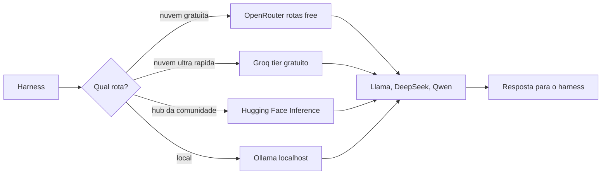

# Capítulo 8: Conectando LLMs gratuitas aos seus harnesses: APIs, provedores e roteamento

## 1. Introdução

No Capítulo 7, você conheceu o ecossistema de harnesses e o caminho do custo zero. Agora vamos completar o segundo pilar desse caminho: os modelos. Este capítulo explica, em linguagem de iniciante, o que é uma API de LLM, o que são provedores de roteamento como OpenRouter e Groq, como funciona o Hugging Face e a execução local com Ollama, e — o mais importante — como obter chaves gratuitas e configurar limites de uso sem pagar nada. Ao final, você terá o cardápio completo de modelos abertos relevantes para código — Llama, DeepSeek e Qwen — e saberá exatamente onde cada um se encaixa no seu fluxo.

Ao final deste capítulo, você será capaz de explicar a diferença entre API, provedor e modelo; criar uma chave gratuita num provedor de roteamento; compreender os limites de uso (taxas por minuto e por dia); e escolher o provedor certo para o seu hardware e a sua tarefa.

## 2. Explica

### O que é uma API de LLM e o que é um provedor de roteamento

Uma API (Interface de Programação de Aplicações) é um contrato de comunicação entre programas: você envia uma requisição formatada (seu prompt, o modelo escolhido, parâmetros de geração) e recebe uma resposta estruturada (o texto gerado, ou uma chamada de ferramenta) [13]. Para uma LLM, a API é a porta de entrada: sem interface gráfica, sem navegador — apenas HTTP, o mesmo protocolo que a web usa. Os harnesses que você estudou nos capítulos 6 e 7 falam com os modelos por APIs: quando você digita um pedido, o harness monta a requisição, envia, recebe e interpreta a resposta [14][1].

Um provedor de roteamento é um intermediário que agrega muitos modelos atrás de uma única API. Em vez de criar uma conta separada para cada modelo de cada fabricante, você cria uma conta no provedor e acessa o catálogo inteiro com uma chave só [1][18]. O OpenRouter é o maior exemplo: centenas de modelos — proprietários e abertos — acessíveis por uma API, com um mecanismo dedicado de modelos gratuitos: os marcados com o sufixo `:free` e o roteador automático `openrouter/free`, que escolhe um modelo gratuito disponível que suporte as ferramentas que você precisa [1][2]. O benefício prático para o iniciante é enorme: uma chave, um painel, e a liberdade de trocar de modelo sem trocar de configuração.

### O cardápio gratuito: OpenRouter, Groq, Hugging Face e Ollama

Cada provedor gratuito tem um perfil. O OpenRouter é o cardápio amplo: rotas gratuitas para testes e desenvolvimento leve, com limites de taxa para contas sem saldo, e compatibilidade com o formato de API usado pela OpenAI — o que permite ligar em quase qualquer harness [1][2][14]. O Groq é o provedor da velocidade: usa hardware próprio (LPU) para inferência ultrarrápida, com API compatível com a OpenAI (base URL `https://api.groq.com/openai/v1`) e um tier gratuito generoso — para o Llama 3.1 8B, por exemplo, algo na ordem de dezenas de requisições por minuto, milhares de tokens por minuto e dezenas de milhares de requisições por dia [3][4]. A velocidade do Groq faz diferença perceptível no uso interativo: a resposta parece instantânea.

O Hugging Face é o hub da comunidade: além de hospedar os modelos, oferece o serviço de Inference Providers — inferência serverless com créditos mensais gratuitos para testes e uma forma unificada de acessar provedores parceiros [5][6]. Para tarefas mais pesadas, os créditos gratuitos servem como porta de entrada, e a documentação detalha os limites [6]. O Ollama é o caminho oposto: execução 100% local, sem nuvem e sem limites de taxa — o custo é o seu hardware. Ele roda em `http://localhost:11434` e serve dezenas de modelos abertos com um comando simples [7][8]. Para quem tem GPU ou Apple Silicon com boa memória unificada, o Ollama é o "custo zero absoluto": sem conta, sem chave, sem teto de requisições [7].

### Modelos abertos relevantes para código: Llama, DeepSeek e Qwen

O cardápio de modelos abertos que você vai ligar aos harnesses tem três famílias protagonistas. A família Llama, da Meta — nas versões 3.1, 3.2 e 3.3 — oferece tamanhos de 8B (leves, rodam localmente) a 70B (potentes, disponíveis via Groq e OpenRouter), com suporte a chamada de ferramentas, essencial para agentes [9][15]. A família DeepSeek — com DeepSeek-Coder, DeepSeek-V3 e o raciocinador DeepSeek-R1 — usa arquiteturas de mistura de especialistas (MoE), eficientes e competitivas com modelos proprietários em lógica e código, com versões disponíveis para rodar local ou via nuvem [10][18]. A família Qwen, da Alibaba — destacando o Qwen2.5-Coder — é otimizada para programação, com janelas de contexto longas (até 128K tokens) e bom desempenho em múltiplas linguagens e correção de bugs [11].

A regra prática para escolher: para o iniciante no caminho do custo zero, comece com um modelo leve (7B-8B) — via Ollama se o hardware aguentar, ou via Groq/OpenRouter se preferir nuvem — e suba de tamanho conforme a tarefa exigir [9][11][7]. Modelos menores respondem mais rápido e cabem em hardware modesto; modelos maiores raciocinam melhor, mas custam mais (em tempo ou em limites de taxa) [3][7]. O registro aberto Models.dev ajuda a comparar preços, contexto e recursos de cada modelo em um só lugar [12].

### Chaves gratuitas e limites de uso: o essencial de segurança

Obter uma chave gratuita é simples: você cria uma conta no provedor — no OpenRouter, no painel de chaves (API Keys), clicando em criar; no Groq, no console, na aba API Keys; no Hugging Face, em Settings, criando um token de acesso [1][3][16]. A parte que exige disciplina é o cuidado com a chave: ela é uma credencial, como uma senha — nunca deve entrar no código versionado, nos prompts ou em arquivos enviados a terceiros [13][1]. A prática padrão é colocar a chave em uma variável de ambiente (ou num arquivo local fora do git) e referenciá-la pela variável [1][14]. O Capítulo 12 aprofunda a segurança; aqui, fixe a regra de ouro: a chave é sua — ela dá acesso ao seu saldo (mesmo gratuito) e aos seus dados de uso.

Os limites de uso completam o quadro. Contas gratuitas operam com tetos — requisições por minuto (RPM), tokens por minuto (TPM) e requisições por dia (RPD) — que variam por provedor e por modelo [3]. Esses limites existem para proteger a infraestrutura e impedir abuso; para o iniciante, eles são mais do que suficientes para aprender e construir projetos reais. Quando um limite é atingido, o harness retorna um erro de taxa — e o Capítulo 9 mostra como tratar isso com retentativas e filas [1][3].

## 3. Ilustra

Pense num balcão de uma feira de alimentos orgânicos. Cada barraca é um produtor de um tipo de alimento (cada fabricante de modelo). No passado, você precisava visitar cada barraca, conhecer o dono e negociar um acordo separado (uma conta e uma chave por fabricante). O provedor de roteamento é o mercado central: um único balcão de atendimento onde você escolhe o produto de qualquer barraca — tomate orgânico, mel, queijo — paga (ou usa a degustação gratuita) e leva [1]. A API é o contrato do balcão: "peça pelo nome, receba o produto". E o Ollama é a sua própria horta em casa: você mesmo planta (baixa o modelo) e colhe sem passar pelo mercado — sem fila, sem preço, limitado apenas pelo tamanho do seu quintal (hardware) [7].

Como Aprendiz de Construtor, você reconhece a estratégia do custo zero: usar as degustações gratuitas do mercado (rotas `:free` do OpenRouter, tier gratuito do Groq) enquanto sua horta não está pronta (hardware insuficiente), e migrar para a horta quando puder [1][3][7]. O diagrama abaixo mostra as rotas possíveis entre o seu harness e os modelos.



## 4. Técnica

### Falando com uma API de LLM em Python puro

Vamos ao primeiro contato técnico com uma API de LLM: uma requisição HTTP simples, sem SDK, usando apenas a biblioteca padrão do Python. O exemplo usa o formato de API compatível com a OpenAI — o mais comum entre provedores — e funciona com o OpenRouter e o Groq [1][3][14]:

```python
import json
import os
import urllib.request


def chamar_llm(prompt, base_url, api_key, modelo):
    """Envia um prompt para uma API OpenAI-compatible e devolve a resposta."""
    payload = {
        "model": modelo,
        "messages": [{"role": "user", "content": prompt}],
        "max_tokens": 200,
    }
    requisicao = urllib.request.Request(
        base_url.rstrip("/") + "/chat/completions",
        data=json.dumps(payload).encode("utf-8"),
        headers={
            "Content-Type": "application/json",
            "Authorization": f"Bearer {api_key}",
        },
        method="POST",
    )
    with urllib.request.urlopen(requisicao, timeout=60) as resposta:
        corpo = json.loads(resposta.read().decode("utf-8"))
    return corpo["choices"][0]["message"]["content"]


OPENROUTER_URL = "https://openrouter.ai/api/v1"
GROQ_URL = "https://api.groq.com/openai/v1"

# Configure as chaves como variaveis de ambiente - nunca no codigo!
chave = os.environ.get("OPENROUTER_API_KEY", "")
if chave:
    print(chamar_llm(
        "Explique em uma frase o que e um harness de IA.",
        OPENROUTER_URL, chave, "openrouter/free",
    ))
else:
    print("defina OPENROUTER_API_KEY como variavel de ambiente para testar")
```

Esse é o coração de tudo: o harness (capítulos 5 e 6) faz exatamente essa chamada — monta o payload, envia, recebe e interpreta. A diferença é que o harness automatiza contexto, ferramentas e memória ao redor dessa chamada [1][14]. Quando você configurar o harness no Capítulo 9, ele fará essa comunicação por você — mas entender a mecânica da chamada é o que permite diagnosticar falhas e escolher provedores com consciência [13].

### Descobrindo modelos gratuitos: o catálogo do OpenRouter

Antes de configurar, é útil saber o que está disponível de graça. O OpenRouter expõe o catálogo pela própria API — e modelos gratuitos aparecem com o sufixo `:free` [1][2]. O script abaixo consulta o catálogo e filtra os modelos gratuitos:

```python
import json
import urllib.request


def listar_modelos_gratuitos():
    url = "https://openrouter.ai/api/v1/models"
    with urllib.request.urlopen(url, timeout=60) as resposta:
        catalogo = json.loads(resposta.read().decode("utf-8"))
    gratuitos = []
    for modelo in catalogo.get("data", []):
        nome = modelo.get("id", "")
        preco = modelo.get("pricing", {})
        prompt = float(preco.get("prompt", "0") or 0)
        if nome.endswith(":free") or (prompt == 0.0):
            gratuitos.append(nome)
    return sorted(gratuitos)


modelos = listar_modelos_gratuitos()
print(f"encontrados {len(modelos)} modelos gratuitos")
for nome in modelos[:15]:
    print(" ", nome)
```

Rode e veja a lista real de modelos gratuitos disponíveis hoje — ela muda com o tempo, e o script é sua ferramenta para acompanhar [1][2]. Essa descoberta programática é a forma madura de navegar o ecossistema: em vez de decorar catálogos, você os consulta.

### Tratando limites de taxa: retentativas com backoff

Os limites de taxa dos provedores gratuitos exigem tratamento no código — quando a API responde com erro de limite (HTTP 429), o cliente deve esperar e tentar de novo [1][3]. A implementação abaixo mostra o padrão de retentativa com espera progressiva (backoff exponencial):

```python
import json
import time
import urllib.error
import urllib.request


def chamar_com_retentativa(prompt, base_url, api_key, modelo, max_tentativas=4):
    payload = {
        "model": modelo,
        "messages": [{"role": "user", "content": prompt}],
        "max_tokens": 150,
    }
    espera = 2
    for tentativa in range(1, max_tentativas + 1):
        try:
            requisicao = urllib.request.Request(
                base_url.rstrip("/") + "/chat/completions",
                data=json.dumps(payload).encode("utf-8"),
                headers={
                    "Content-Type": "application/json",
                    "Authorization": f"Bearer {api_key}",
                },
                method="POST",
            )
            with urllib.request.urlopen(requisicao, timeout=60) as resposta:
                corpo = json.loads(resposta.read().decode("utf-8"))
            return corpo["choices"][0]["message"]["content"]
        except urllib.error.HTTPError as erro:
            if erro.code == 429 and tentativa < max_tentativas:
                print(f"limite de taxa: aguardando {espera}s (tentativa {tentativa})")
                time.sleep(espera)
                espera *= 2
                continue
            raise
    raise RuntimeError("limite de taxa persistente")
```

Esse padrão — tentar, detectar o limite, esperar e tentar de novo com espera crescente — é exatamente o que os harnesses implementam internamente [1][3]. Entender o mecanismo evita duas reações erradas: desistir ao ver o primeiro erro, ou bombardear a API e agravar o bloqueio.

### Ollama local: o custo zero absoluto

Para completar o leque, a rota local com Ollama — sem chave, sem nuvem. Depois de instalar e baixar um modelo (comandos do Capítulo 7), a chamada é idêntica em formato, apontando para `localhost` [7][8]:

```python
import json
import urllib.request


def chamar_ollama(prompt, modelo="qwen2.5-coder:7b"):
    payload = {
        "model": modelo,
        "messages": [{"role": "user", "content": prompt}],
        "stream": False,
    }
    requisicao = urllib.request.Request(
        "http://localhost:11434/api/chat",
        data=json.dumps(payload).encode("utf-8"),
        headers={"Content-Type": "application/json"},
        method="POST",
    )
    try:
        with urllib.request.urlopen(requisicao, timeout=300) as resposta:
            corpo = json.loads(resposta.read().decode("utf-8"))
        return corpo.get("message", {}).get("content", "")
    except urllib.error.URLError:
        return "Ollama nao esta rodando: inicie com o comando 'ollama serve'"


print(chamar_ollama("Escreva uma funcao python que soma dois numeros."))
```

Observe o conforto: nenhuma chave, nenhuma conta, nenhum limite de taxa — apenas o seu hardware [7]. Essa rota é o destino final do caminho do custo zero para quem tem hardware suficiente, e a alternativa imediata para quem ainda não tem [8][11].

### Medindo o uso: o contador de tokens e requisições

Os tiers gratuitos funcionam com tetos — requisições por minuto, tokens por minuto, requisições por dia — e o iniciante que não mede o próprio uso descobre os limites na pior hora [3][1]. A disciplina profissional é medir antes de precisar: registrar os tokens de cada chamada e acumular o uso da sessão. O medidor abaixo acompanha tokens de entrada e saída a cada requisição e avisa quando o teto diário se aproxima [1][3]:

```python
class MedidorDeUso:
    def __init__(self, teto_tokens_dia=100000, teto_requisicoes_dia=500):
        self.teto_tokens = teto_tokens_dia
        self.teto_requisicoes = teto_requisicoes_dia
        self.tokens = 0
        self.requisicoes = 0

    def registrar(self, tokens_entrada, tokens_saida):
        self.tokens += tokens_entrada + tokens_saida
        self.requisicoes += 1

    def status(self):
        pct_tokens = round(100 * self.tokens / self.teto_tokens, 1)
        pct_req = round(100 * self.requisicoes / self.teto_requisicoes, 1)
        aviso = []
        if pct_tokens > 80:
            aviso.append("tokens perto do teto diario")
        if pct_req > 80:
            aviso.append("requisicoes perto do teto diario")
        return {
            "tokens": self.tokens,
            "requisicoes": self.requisicoes,
            "uso_tokens": f"{pct_tokens}%",
            "uso_requisicoes": f"{pct_req}%",
            "avisos": aviso,
        }


medidor = MedidorDeUso()
for i in range(12):
    medidor.registrar(tokens_entrada=2000 + i * 300, tokens_saida=400)
print("uso acumulado:", medidor.status())
```

O medidor cumpre o mesmo papel de um painel de consumo: transforma o limite invisível em número visível, e o número permite planejar — trocar de modelo, pausar tarefas pesadas ou migrar para a rota local [7]. No Capítulo 9, o harness exibirá esses números na própria interface; entendê-los agora significa que, quando um erro de taxa aparecer, você saberá exatamente o que ele está dizendo e o que fazer [3][1].

### Critérios para escolher um modelo de código

Com tantas opções abertas, a escolha do modelo vira uma decisão de critérios, não de reputação. As quatro dimensões que importam para o iniciante são: tamanho (modelos menores rodam local e respondem mais rápido; modelos maiores raciocinam melhor) [9][11]; contexto (janelas maiores permitem trabalhar com arquivos e projetos inteiros) [11]; suporte a ferramentas (essencial para agentes — o modelo precisa declarar chamadas de função) [9]; e custo (tiers gratuitos e consumo) [3][1]. A função abaixo pontua candidatos segundo essas dimensões com pesos ajustáveis:

```python
def pontuar_modelo(modelo, pesos):
    total = sum(modelo[dimensao] * peso for dimensao, peso in pesos.items())
    return round(total / sum(pesos.values()), 1)


candidatos = [
    {"nome": "llama3.2:3b", "tamanho": 8, "contexto": 5, "ferramentas": 6, "custo": 10},
    {"nome": "qwen2.5-coder:7b", "tamanho": 6, "contexto": 8, "ferramentas": 8, "custo": 10},
    {"nome": "llama3.1:70b", "tamanho": 4, "contexto": 8, "ferramentas": 9, "custo": 3},
    {"nome": "deepseek-r1:8b", "tamanho": 6, "contexto": 6, "ferramentas": 7, "custo": 9},
]
pesos_local = {"tamanho": 2, "contexto": 2, "ferramentas": 1, "custo": 3}
ranking = sorted(candidatos, key=lambda m: pontuar_modelo(m, pesos_local), reverse=True)
for i, modelo in enumerate(ranking, 1):
    print(f"{i}. {modelo['nome']}: {pontuar_modelo(modelo, pesos_local)}")
```

A mensagem central: a escolha certa depende do seu hardware e da sua tarefa — um modelo leve bem usado supera um modelo pesado mal configurado [9][7]. Rode o script com os seus pesos e use o resultado como ponto de partida; depois, a evidência real (velocidade, qualidade, limites) refina a decisão [3].

## 5. Aplica

### A cena de contraste: a chave vazada e o limite ignorado

Imagine a cena. Você configurou sua primeira integração com um provedor gratuito e, seguindo um tutorial preguiçoso, colou a chave de API diretamente no código — afinal, "é só um teste". Você faz commit no repositório público do curso para "mostrar o progresso". Na manhã seguinte, seu painel mostra um pico de uso estranho: alguém encontrou a chave no repositório e está usando sua cota. Sem saldo real, o dano é limitado — mas a conta foi suspensa por abuso, e você perdeu o acesso. O colega ao lado configurou a chave numa variável de ambiente, fora do git, e nunca teve o problema.

O diagnóstico, ligado à teoria: a chave é uma credencial, e credencial versionada é credencial exposta [13][1]. A correção tem três partes: (1) colocar a chave em variável de ambiente (ou arquivo local fora do git); (2) revogar e criar uma chave nova imediatamente; (3) tratar os limites de taxa com retentativas, como na seção Técnica, em vez de bombardear a API [3]. No mercado, esse episódio — comum nos primeiros meses de todo desenvolvedor — separa quem aprendeu a disciplina de quem paga o preço duas vezes: a primeira ao vazar, a segunda ao ser suspenso [1][13].

Síntese das armadilhas comuns: (1) versionar chaves — use variáveis de ambiente e `.gitignore`; (2) ignorar limites de taxa — trate o erro 429 com retentativa e backoff [3]; (3) escolher modelo pelo nome famoso em vez do caso de uso — modelo leve para tarefa leve [9][11]; (4) não testar o provedor antes de integrar — use o script de catálogo e a chamada simples da seção Técnica; (5) esquecer que "grátis" tem tetos — planeje sua tarefa dentro dos limites do tier [3].

## 6. Conclusão

O segundo pilar do custo zero está de pé. Os três pontos deste capítulo: primeiro, API é o contrato de comunicação, e provedor de roteamento é o balcão único — o OpenRouter agrega centenas de modelos, incluindo os gratuitos com sufixo `:free` [1][2]; segundo, o cardápio gratuito tem quatro perfis — roteamento amplo (OpenRouter), velocidade (Groq), hub da comunidade (Hugging Face) e execução local sem limites (Ollama) [1][3][5][7]; terceiro, as famílias abertas protagonistas são Llama, DeepSeek e Qwen — e a escolha certa segue a regra do caso de uso [9][10][11].

O desafio desta etapa: execute o script de catálogo do OpenRouter, escolha um modelo gratuito e faça a primeira chamada real com a chave que você criou — usando variável de ambiente. Se tiver hardware, baixe um modelo com Ollama e repita a chamada localmente; compare velocidade e qualidade.

No próximo capítulo, juntamos tudo: o guia passo a passo completo de configuração — do harness gratuito ao modelo gratuito, testando a comunicação Tela → Harness → LLM → Tools de ponta a ponta.

## 7. Referências Bibliográficas

[1] OPENROUTER. *OpenRouter Documentation*. 2025. Disponível em: https://openrouter.ai/docs. Acesso em: 5 ago. 2026.

[2] OPENROUTER. *Free Models Router*. 2025. Disponível em: https://openrouter.ai/docs/guides/routing/routers/free-router. Acesso em: 5 ago. 2026.

[3] GROQ. *Console Documentation — Rate Limits*. San Francisco: Groq, 2025. Disponível em: https://console.groq.com/docs/rate-limits. Acesso em: 5 ago. 2026.

[4] GROQ. *Groq Pricing*. San Francisco: Groq, 2025. Disponível em: https://groq.com/pricing. Acesso em: 5 ago. 2026.

[5] HUGGING FACE. *Inference Providers Documentation*. Nova York: Hugging Face, 2025. Disponível em: https://huggingface.co/docs/inference-providers/. Acesso em: 5 ago. 2026.

[6] HUGGING FACE. *Inference Providers — Pricing and Billing*. Nova York: Hugging Face, 2025. Disponível em: https://huggingface.co/docs/inference-providers/en/pricing. Acesso em: 5 ago. 2026.

[7] OLLAMA. *Ollama Documentation*. 2025. Disponível em: https://ollama.com/docs. Acesso em: 5 ago. 2026.

[8] OLLAMA. *Ollama Library*. 2025. Disponível em: https://ollama.com/library. Acesso em: 5 ago. 2026.

[9] META. *Introducing Meta Llama 3*. Menlo Park: Meta, 2024. Disponível em: https://ai.meta.com/blog/meta-llama-3/. Acesso em: 5 ago. 2026.

[10] DEEPSEEK. *DeepSeek-R1: Incentivizing Reasoning Capability in LLMs*. Hangzhou: DeepSeek, 2025. Disponível em: https://github.com/deepseek-ai/DeepSeek-R1. Acesso em: 5 ago. 2026.

[11] ALIBABA. *Qwen2.5-Coder Technical Report*. Hangzhou: Alibaba, 2024. Disponível em: https://qwenlm.github.io/blog/qwen2.5-coder-family/. Acesso em: 5 ago. 2026.

[12] MODELS.DEV. *Open Registry of AI Models and Providers*. São Francisco: SST, 2025. Disponível em: https://models.dev/. Acesso em: 5 ago. 2026.

[13] IBM. *What is an API?* Armonk: IBM, 2024. Disponível em: https://www.ibm.com/topics/api. Acesso em: 5 ago. 2026.

[14] OPENAI. *API Reference*. San Francisco: OpenAI, 2025. Disponível em: https://platform.openai.com/docs/api-reference. Acesso em: 5 ago. 2026.

[15] META. *Llama 3.3: A Multilingual, Instruction-Tuned Model*. Menlo Park: Meta, 2024. Disponível em: https://ai.meta.com/blog/llama-3-3/. Acesso em: 5 ago. 2026.

[16] HUGGING FACE. *Access Tokens Documentation*. Nova York: Hugging Face, 2025. Disponível em: https://huggingface.co/docs/hub/en/security-tokens. Acesso em: 5 ago. 2026.

[17] OPENROUTER. *OpenRouter Models Catalog*. 2025. Disponível em: https://openrouter.ai/models. Acesso em: 5 ago. 2026.

[18] DEEPSEEK. *DeepSeek-Coder-V2: Breaking the Barrier of Closed-Source Models in Code Intelligence*. Hangzhou: DeepSeek, 2024. Disponível em: https://github.com/deepseek-ai/DeepSeek-Coder-V2. Acesso em: 5 ago. 2026.

[19] ANTHROPIC. *API Overview*. São Francisco: Anthropic, 2025. Disponível em: https://platform.claude.com/docs/en/api/overview. Acesso em: 5 ago. 2026.

[20] FREEBUFF. *Freebuff: Ecossistema gratuito de agentes de codificação*. 2025. Disponível em: https://freebuff.com/. Acesso em: 5 ago. 2026.
