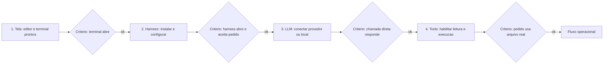

# Capítulo 9: Guia passo a passo de configuração: do zero ao primeiro fluxo funcionando

## 1. Introdução

Nos capítulos 7 e 8, você conheceu os harnesses e os modelos gratuitos — o cardápio. Agora chegou o momento de cozinhar: este capítulo é o guia passo a passo que instala um harness gratuito do zero, vincula modelos abertos (Llama, DeepSeek, Qwen) e testa a comunicação completa entre as 4 camadas — Tela, Harness, LLM e Tools — com um primeiro fluxo funcionando de verdade. Ao final deste capítulo, você terá o seu primeiro sistema operacional de IA assistida, pronto para os projetos dos capítulos 10 e 11.

Ao final deste capítulo, você será capaz de instalar e configurar um harness gratuito; conectar um provedor gratuito (ou execução local) com uma chave protegida; e verificar, com um teste objetivo, que as 4 camadas conversam entre si. O caminho é longo o suficiente para ser real, e curto o suficiente para ser concluído numa tarde.

## 2. Explica

### O plano da configuração: 4 camadas, 4 passos

A configuração de qualquer fluxo de IA assistida segue o mapa das 4 camadas do Capítulo 5, e cada camada tem um passo de configuração correspondente. A Tela (passo 1): escolher onde você vai digitar e ver resultados — terminal, IDE ou interface web. O Harness (passo 2): instalar e configurar o orquestrador — no nosso caminho, o OpenCode, gratuito e open source, ou o Freebuff, que dispensa configuração [1][5]. A LLM (passo 3): conectar o modelo — via provedor gratuito na nuvem (OpenRouter ou Groq) ou execução local (Ollama) [2][3][6]. As Tools (passo 4): habilitar e verificar as ferramentas — leitura de arquivos, terminal, execução de código — que o harness expõe ao modelo [4][7].

A ordem importa: primeiro o terreno (capítulo 4 — editor, git, arquivos), depois o harness, depois o modelo, por último o teste de integração [1][4]. Cada passo tem um critério de sucesso objetivo: se o passo não passa, não avance — essa disciplina de verificação evita as frustrações clássicas do iniciante, em que "instalei tudo mas não funciona" esconde um passo intermediário que nunca foi validado [4]. É o mesmo método de evidência que você usará na auditoria dos seus projetos no Capítulo 11.

### O que o harness precisa saber: credenciais, base URL e modelo

Ao conectar uma LLM a um harness, existem três informações que o harness precisa receber, e entender cada uma elimina metade dos erros de configuração. A primeira é a credencial: a chave de API do provedor, que o harness envia no cabeçalho da requisição (o padrão `Authorization: Bearer <chave>`) [2][8]. A segunda é a base URL: o endereço do provedor — por exemplo, `https://openrouter.ai/api/v1` ou `https://api.groq.com/openai/v1` — que define para onde as requisições vão [2][3]. A terceira é o nome do modelo: o identificador exato no catálogo do provedor, como `qwen2.5-coder:7b` no Ollama ou um modelo com sufixo `:free` no OpenRouter [2][6][7].

Os harnesses modernos simplificam parte desse trabalho: muitos têm provedores nativos (Ollama, OpenRouter, Groq) — você escolhe o provedor, e o harness preenche a base URL sozinho [1][4]. Mas quando o provedor não está na lista (ou você quer um modelo específico), é a configuração manual dessas três informações que faz a diferença — e é exatamente o que este capítulo ensina, com o padrão "OpenAI-compatible" que quase todos os provedores seguem [2][8]. O registro aberto Models.dev agrega essas informações por modelo, simplificando a consulta [9].

### Vinculando modelos abertos: Llama, DeepSeek e Qwen na prática

Os modelos abertos do capítulo 8 — Llama, DeepSeek e Qwen — se vinculam aos harnesses por duas vias. A via local: com Ollama, você baixa o modelo com `ollama pull` e o nome fica disponível para o harness — `llama3.2:3b`, `deepseek-r1:8b`, `qwen2.5-coder:7b` [6][7]. A via nuvem: pelo provedor de roteamento, o mesmo modelo aparece com um nome de catálogo — e versões gratuitas carregam o sufixo `:free` [2]. A escolha entre as vias depende do seu hardware e da sua preferência de privacidade: local para quem tem máquina capaz e quer zero dependência externa; nuvem para quem quer velocidade e não quer ocupar o próprio disco [2][6][7].

Uma diferença prática importante: modelos de raciocínio, como o DeepSeek-R1, gastam tokens pensando antes de responder — o que conta contra os limites de taxa dos tiers gratuitos mais rápido do que modelos diretos [10][2]. Para o iniciante, a recomendação é começar com um modelo de código leve e direto (Qwen2.5-Coder ou Llama 3.1 8B) e explorar modelos de raciocínio depois, quando o fluxo estiver estável [7][11]. A regra do caso de uso do Capítulo 8 vale aqui: modelo leve para tarefa leve, e o custo — tempo, tokens, hardware — é parte da escolha [9][11].

### O teste final: a comunicação entre as 4 camadas

A configuração termina com um teste de integração: provar que as 4 camadas conversam. O teste tem três níveis. Nível 1, a LLM responde: uma chamada direta ao modelo (como a do Capítulo 8) devolve texto — prova que chave, base URL e modelo estão corretos [2]. Nível 2, o harness conversa com a LLM: um pedido simples dentro do harness devolve resposta — prova que a Tela, o Harness e a LLM estão conectados [1][4]. Nível 3, as ferramentas funcionam: um pedido que exige leitura de arquivo ou execução de código devolve um resultado baseado no seu projeto — prova que as Tools estão habilitadas e que o fluxo completo está operacional [4][7]. O restante deste capítulo executa exatamente esses três níveis, com comandos prontos para copiar.

## 3. Ilustra

Pense na inauguração de um pequeno restaurante. Você contratou o chef (a LLM), montou a cozinha (o harness), contratou os auxiliares (as tools) e abriu o salão (a tela). Antes de abrir as portas, você faz o teste de fogo: pede ao chef um prato simples (nível 1), vê o maître anotar e a cozinha responder (nível 2), e pede um prato que exige o forno e a geladeira — verifica que os auxiliares realmente executam (nível 3). Só então você abre o restaurante. É exatamente essa a sequência do capítulo: configurar camada por camada e validar cada nível antes de avançar — porque um restaurante que abre sem o teste de fogo descobre os problemas com a casa cheia [1][4].

Como Aprendiz de Construtor, você está prestes a fazer a sua primeira inauguração: um sistema completo de IA assistida, gratuito, que responde às suas ordens e executa ferramentas no seu projeto. O diagrama abaixo mostra o fluxo de configuração com os critérios de sucesso de cada passo.



## 4. Técnica

### Passo 1 e 2: o terreno e o harness gratuito

O terreno (capítulo 4) já deve estar pronto: Python instalado, um editor e o git funcionando. O passo 2 é instalar o harness gratuito — o OpenCode, open source e model-agnostic [1][5]. Os comandos abaixo fazem a instalação e a primeira abertura:

```bash
# Passo 2: instalar o harness gratuito (OpenCode)
curl -fsSL https://opencode.ai/install | bash
opencode --version

# Criar um projeto de teste e abrir o harness nele
mkdir -p meu-fluxo && cd meu-fluxo
git init
opencode
```

O critério de sucesso deste passo: o comando `opencode --version` imprime uma versão, e o harness abre uma sessão interativa na pasta do projeto [5]. Se o comando de instalação falhar, verifique as pré-condições do terreno (curl instalado, rede disponível, permissões) — e só avance quando o critério passar [4]. Alternativa zero-configuração: se preferir, instale o Freebuff e abra uma sessão sem configurar provedor nenhum — o modelo já vem agregado [12].

### Passo 3: conectar a LLM — nuvem gratuita ou local

Agora a conexão do modelo. Há duas vias; escolha conforme o seu hardware. Via nuvem gratuita — criar a chave no OpenRouter (ou Groq) e registrar no harness como variável de ambiente [2][3]:

```bash
# Nuvem gratuita: criar a chave no painel do provedor e exportar como variavel
export OPENROUTER_API_KEY="sua-chave-aqui"
opencode auth login --openrouter
opencode models use openrouter/free
```

Via local — baixar um modelo com Ollama e apontar o harness para ele [6][7]:

```bash
# Local: baixar o modelo e conectar o harness ao Ollama
ollama pull qwen2.5-coder:7b
opencode auth login --ollama
opencode models use ollama/qwen2.5-coder:7b
```

O critério de sucesso deste passo, antes de seguir, é o nível 1 do teste de integração — a chamada direta responde. Rode o script de chamada simples do Capítulo 8 com a mesma chave, ou teste pelo próprio harness com um pedido trivial:

```bash
opencode run "responda apenas com a palavra funcionando"
```

Se a resposta vier, a LLM está conectada [1][2]. Erros comuns e seus significados: `401` é chave inválida; `404` é base URL ou modelo com nome errado; `429` é limite de taxa — trate com retentativa ou troque de modelo [2][3].

### Passo 4: habilitar e verificar as ferramentas

Com a LLM conectada, o passo final é verificar as Tools. O teste do nível 3: um pedido que exige ferramentas reais — ler um arquivo do projeto e transformá-lo. Crie um arquivo de exemplo e peça ao harness para trabalhar sobre ele:

```bash
cat > notas.txt << 'FIM'
Este projeto testa a comunicacao entre as 4 camadas.
FIM

opencode run "leia notas.txt e me diga quantas palavras ele tem"
```

O critério de sucesso: o harness lê o arquivo real e responde com a contagem correta — prova de que a Tela, o Harness, a LLM e a Tools estão conversando [4][7]. Se o harness responder "não consigo ler arquivos", as permissões de ferramenta estão bloqueadas na configuração — revise as permissões do harness antes de avançar [1][4]. Esse é o momento da inauguração: as 4 camadas estão operacionais.

### O teste de integração automatizado: provando as 4 camadas

Para fechar com método, vamos automatizar o teste de integração em Python — o mesmo espírito do teste de fogo do restaurante, mas executado por script [4]:

```python
import os
import subprocess
import sys


def testar_camada_llm():
    """Nivel 1: a LLM responde (chamada via harness em modo nao interativo)."""
    resultado = subprocess.run(
        ["opencode", "run", "responda apenas com a palavra funcionando"],
        capture_output=True, text=True, encoding="utf-8", timeout=120,
    )
    return resultado.returncode == 0 and "funcionando" in resultado.stdout.lower()


def testar_camada_tools():
    """Nivel 3: as ferramentas leem o arquivo real do projeto."""
    with open("prova.txt", "w", encoding="utf-8") as arquivo:
        arquivo.write("quatro palavras aqui dentro")
    resultado = subprocess.run(
        ["opencode", "run", "leia prova.txt e conte as palavras"],
        capture_output=True, text=True, encoding="utf-8", timeout=180,
    )
    return "4" in resultado.stdout or "quatro" in resultado.stdout.lower()


def principal():
    erros = []
    if not testar_camada_llm():
        erros.append("LLM nao respondeu - verifique chave, base URL e modelo")
    if not testar_camada_tools():
        erros.append("Tools nao leram o arquivo - verifique permissoes do harness")
    if erros:
        for erro in erros:
            print(f"FALHA: {erro}")
        return 1
    print("OK: as 4 camadas estao comunicando")
    return 0


if __name__ == "__main__":
    sys.exit(principal())
```

Rode esse script e guarde o resultado: ele é a sua prova objetiva de que o sistema está configurado — e será a base do primeiro projeto do Capítulo 11 [4][7]. Quando algo falhar, o erro nomeia a camada suspeita: LLM (chave/modelo) ou Tools (permissões) — o diagnóstico por camada que você aprendeu no Capítulo 5.

### O healthcheck do fluxo: um comando para verificar tudo

Depois de configurar as 4 camadas, você precisa de uma rotina de verificação que prove, em um único comando, que o sistema continua saudável — o equivalente ao "checklist do piloto" antes de decolar [1][4]. O healthcheck abaixo junta as três verificações do capítulo: o harness abre, a LLM responde e as ferramentas leem arquivos reais — com saída clara de aprovação ou reprovação [4][2]:

```python
import subprocess
import sys


def verificar(descricao, funcao):
    try:
        ok, detalhe = funcao()
    except Exception as erro:  # noqa: BLE001
        return False, f"excecao: {erro}"
    return ok, detalhe


def checa_harness():
    resultado = subprocess.run(
        ["opencode", "--version"], capture_output=True, text=True, encoding="utf-8"
    )
    return resultado.returncode == 0, resultado.stdout.strip()[:40]


def checa_llm():
    resultado = subprocess.run(
        ["opencode", "run", "responda apenas com a palavra ok"],
        capture_output=True, text=True, encoding="utf-8", timeout=120,
    )
    return resultado.returncode == 0, resultado.stdout.strip()[:40]


def checa_tools():
    with open("health.txt", "w", encoding="utf-8") as arquivo:
        arquivo.write("saudavel")
    resultado = subprocess.run(
        ["opencode", "run", "leia health.txt e diga o que contem"],
        capture_output=True, text=True, encoding="utf-8", timeout=180,
    )
    return "saudavel" in resultado.stdout.lower(), resultado.stdout.strip()[:40]


CHECAGENS = [
    ("harness instalado", checa_harness),
    ("LLM respondendo", checa_llm),
    ("ferramentas operando", checa_tools),
]


def healthcheck():
    falhas = []
    for nome, funcao in CHECAGENS:
        ok, detalhe = verificar(nome, funcao)
        status = "OK " if ok else "FALHA"
        print(f"[{status}] {nome}: {detalhe}")
        if not ok:
            falhas.append(nome)
    if falhas:
        print(f"healthcheck REPROVADO: {', '.join(falhas)}")
        return 1
    print("healthcheck APROVADO: as 4 camadas estao saudaveis")
    return 0


if __name__ == "__main__":
    sys.exit(healthcheck())
```

O healthcheck é a ponte entre a configuração e o uso contínuo: ele transforma "acho que está funcionando" em "está funcionando, verificado agora" [4]. Rode-o no início de cada sessão de trabalho — ou sempre que algo parecer estranho — e ele nomeia a camada com problema antes que você perca tempo caçando [2][4]. Esse hábito simples é a diferença entre operar o sistema e acreditar que o opera.

### Variáveis de ambiente: o padrão que protege suas chaves

A configuração do fluxo depende de um detalhe de organização que protege suas credenciais: as variáveis de ambiente. Em vez de digitar a chave em cada comando ou gravá-la no código, você a define uma vez e o harness a lê do ambiente [2][8]. O padrão profissional combina três peças: a variável exportada na sessão, um arquivo local fora do git (`.env`) e a entrada no `.gitignore` para nunca versionar o arquivo [2][14]:

```bash
# 1. Exportar na sessao atual
set -a; source .env; set +a

# 2. Conteudo do .env (NUNCA versionar este arquivo)
# OPENROUTER_API_KEY=sk-...
# GROQ_API_KEY=gsk-...

# 3. .gitignore - protege o arquivo de segredos
# .env
# *.key
```

```python
import os


def obter_chave(nome):
    chave = os.environ.get(nome, "")
    if not chave:
        print(f"atencao: {nome} nao definida no ambiente")
    return chave


print("chave definida:", bool(obter_chave("OPENROUTER_API_KEY")))
```

Esse padrão resolve dois problemas de uma vez: a chave fica disponível para o harness sem aparecer no código, e fica fora do git por construção [2][14]. A disciplina é a mesma do Capítulo 8, agora incorporada ao fluxo: credencial fora do código, variável no ambiente, arquivo protegido — e o detector do Capítulo 12 confirma a higiene [14].

## 5. Aplica

### A cena de contraste: "instalei tudo, mas não funciona"

Imagine a cena. Você seguiu três tutoriais diferentes — um instalou o harness A, outro configurou o provedor B, outro sugeriu um modelo C — e agora o terminal exibe um erro criptográfico quando você tenta usar. Você passa duas horas tentando comandos aleatórios encontrados em fóruns, sem critério, e o erro muda de cara a cada tentativa. A frustração é total e o abandono, tentador. Um colega mais metódico pergunta: "o que já foi validado? A chave responde numa chamada direta? O harness abre? O modelo está no catálogo do provedor?" Em dez minutos, o problema está localizado: o tutorial B usava uma base URL de um provedor e o tutorial C usava um nome de modelo de outro — as três informações (chave, base URL, modelo) estavam misturadas entre provedores.

O diagnóstico, ligado à teoria do capítulo: configurar sem critérios de sucesso transforma cada erro num mistério; configurar com validação por camada transforma cada erro numa localização [1][2]. A correção é o método que você acabou de praticar: instalar na ordem (Tela → Harness → LLM → Tools), validar cada nível com um critério objetivo antes de avançar, e só então integrar [4]. O script de teste de integração da seção Técnica é a sua rede de segurança: ele transforma "não funciona" em "a camada X falhou, verifique Y".

Síntese das armadilhas comuns: (1) misturar credenciais entre provedores — chave do OpenRouter com base URL do Groq nunca funciona [2][3]; (2) avançar sem validar cada nível — o erro só aparece na integração, onde é mais difícil de isolar [4]; (3) versionar a chave no projeto — repita a disciplina do Capítulo 8 [2]; (4) escolher modelo de raciocínio num tier gratuito apertado — tokens de pensamento esgotam a cota [10][2]; (5) desistir no primeiro erro de taxa — retentativa com backoff resolve [3].

## 6. Conclusão

Sua primeira inauguração está feita. Os três pontos deste capítulo: primeiro, a configuração segue o mapa das 4 camadas — Tela, Harness, LLM e Tools — com um critério de sucesso objetivo em cada passo [1][4]; segundo, conectar uma LLM a um harness é dominar três informações — credencial, base URL e nome do modelo — e escolher entre nuvem gratuita (OpenRouter, Groq) e execução local (Ollama) [2][3][6]; terceiro, o teste de integração em três níveis prova que o sistema está operacional e nomeia a camada suspeita quando algo falha [4][7].

O desafio desta etapa: rode o script de teste de integração e guarde a saída "OK: as 4 camadas estão comunicando". Depois, varie o teste — peça ao harness que crie um arquivo novo e rode um comando no terminal — para ver as ferramentas em ação além da leitura.

No próximo módulo, você vai aprender a operar bem o sistema que acabou de montar: o Capítulo 10 ensina a falar a língua da IA — contexto, restrições e objetivos claros — e o Capítulo 11 guia o seu primeiro projeto completo, do início ao fim, usando as 4 camadas.

## 7. Referências Bibliográficas

[1] OPENCODE. *Documentation*. São Francisco: SST, 2025. Disponível em: https://opencode.ai/docs. Acesso em: 5 ago. 2026.

[2] OPENROUTER. *OpenRouter Documentation*. 2025. Disponível em: https://openrouter.ai/docs. Acesso em: 5 ago. 2026.

[3] GROQ. *Console Documentation — Getting Started*. San Francisco: Groq, 2025. Disponível em: https://console.groq.com/docs. Acesso em: 5 ago. 2026.

[4] ANTHROPIC. *Claude Code Best Practices*. São Francisco: Anthropic, 2025. Disponível em: https://www.anthropic.com/engineering/claude-code-best-practices. Acesso em: 5 ago. 2026.

[5] OPENCODE. *Getting Started*. São Francisco: SST, 2025. Disponível em: https://opencode.ai/docs/getting-started. Acesso em: 5 ago. 2026.

[6] OLLAMA. *Ollama Documentation*. 2025. Disponível em: https://ollama.com/docs. Acesso em: 5 ago. 2026.

[7] OLLAMA. *Ollama Library*. 2025. Disponível em: https://ollama.com/library. Acesso em: 5 ago. 2026.

[8] OPENAI. *API Reference*. San Francisco: OpenAI, 2025. Disponível em: https://platform.openai.com/docs/api-reference. Acesso em: 5 ago. 2026.

[9] MODELS.DEV. *Open Registry of AI Models and Providers*. São Francisco: SST, 2025. Disponível em: https://models.dev/. Acesso em: 5 ago. 2026.

[10] DEEPSEEK. *DeepSeek-R1: Incentivizing Reasoning Capability in LLMs*. Hangzhou: DeepSeek, 2025. Disponível em: https://github.com/deepseek-ai/DeepSeek-R1. Acesso em: 5 ago. 2026.

[11] ALIBABA. *Qwen2.5-Coder Technical Report*. Hangzhou: Alibaba, 2024. Disponível em: https://qwenlm.github.io/blog/qwen2.5-coder-family/. Acesso em: 5 ago. 2026.

[12] FREEBUFF. *Freebuff: Ecossistema gratuito de agentes de codificação*. 2025. Disponível em: https://freebuff.com/. Acesso em: 5 ago. 2026.

[13] META. *Introducing Meta Llama 3*. Menlo Park: Meta, 2024. Disponível em: https://ai.meta.com/blog/meta-llama-3/. Acesso em: 5 ago. 2026.

[14] CHACON, Scott; STRAUB, Ben. *Pro Git*. 2. ed. Nova York: Apress, 2014.

[15] GNU PROJECT. *Bash Reference Manual*. Boston: Free Software Foundation, 2023. Disponível em: https://www.gnu.org/software/bash/manual/. Acesso em: 5 ago. 2026.

[16] MICROSOFT. *Visual Studio Code Documentation*. Redmond: Microsoft, 2025. Disponível em: https://code.visualstudio.com/docs. Acesso em: 5 ago. 2026.

[17] ANTHROPIC. *Claude Code Overview*. São Francisco: Anthropic, 2025. Disponível em: https://platform.claude.com/docs/en/claude-code/overview. Acesso em: 5 ago. 2026.

[18] OPENROUTER. *API Keys Documentation*. 2025. Disponível em: https://openrouter.ai/docs/api-keys. Acesso em: 5 ago. 2026.

[19] HUGGING FACE. *Access Tokens Documentation*. Nova York: Hugging Face, 2025. Disponível em: https://huggingface.co/docs/hub/en/security-tokens. Acesso em: 5 ago. 2026.

[20] DEEPSEEK. *DeepSeek-Coder-V2: Breaking the Barrier of Closed-Source Models in Code Intelligence*. Hangzhou: DeepSeek, 2024. Disponível em: https://github.com/deepseek-ai/DeepSeek-Coder-V2. Acesso em: 5 ago. 2026.
