# Do Zero ao Código Assistido

# Como Este Livro Foi Escrito: A Metodologia EITA

Todo capítulo deste livro segue a metodologia **EITA** — um framework pedagógico de 7 seções projetado para transformar o leitor de "não sei" para "consigo fazer" em cada tema abordado.

## As 7 Seções do EITA

### 1. INTRODUÇÃO
Contextualiza o tema. Explica o que será abordado, por que importa, e o que você será capaz ao final. Uma ponte conecta com o capítulo anterior (quando houver).

### 2. EXPLICA
Desconstrói o conceito: causa raiz, mecânica subjacente, definições precisas. Você passa de "não sei o que é" para "sei definir e explicar".

### 3. ILUSTRA
Uma analogia concreta ancora o conceito na sua intuição — sempre acompanhada de um diagrama visual que torna o abstrato tangível. Você passa de "parece abstrato" para "faz sentido".

### 4. TÉCNICA
O núcleo de valor: código executável, arquiteturas, passo a passo de implementação. É aqui você ganha as mãos para fazer. Você passa de "não sei fazer" para "consigo implementar".

### 5. APLICA
Contextualização em cenário real: onde aquilo se aplica no mercado, armadilhas comuns e como evitá-las. Você passa de "isso é teórico" para "vou usar no trabalho".

### 6. CONCLUSÃO
Síntese dos 3 pontos principais, conexão com o próximo capítulo e um desafio opcional para fixar o aprendizado.

### 7. REFERÊNCIAS BIBLIOGRÁFICAS
Fontes citadas no capítulo, em formato ABNT numerado. Toda afirmação factual tem sua referência.

## Por Que Funciona

O EITA não é uma lista de tópicos — é uma **jornada de transformação**. Cada seção leva o leitor a um estado mental diferente:

```
Introdução → "Quero aprender"
Explica     → "Entendi a teoria"
Ilustra     → "Faz sentido na prática"
Técnica     → "Consigo fazer"
Aplica      → "Vou usar no trabalho"
Conclusão   → "Dominei este tema"
```

## Diagrama do Fluxo EITA

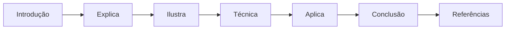

## Dica de Leitura

Você pode ler os capítulos em ordem (recomendado para iniciantes) ou pular diretamente para o tema de interesse. Cada capítulo é autocontido, mas a sequência cria conexões que ampliam o aprendizado.

---

*A metodologia EITA é uma criação da Fábrica Agêntica de Livros, projetada para produzir literatura técnica que transforma leitores em profissionais.*

## Introdução geral

Este livro nasceu de uma pergunta que todo iniciante faz ao abrir um assistente de IA pela primeira vez: o que acontece por trás daquela caixa de texto? A resposta curta é que existe uma arquitetura inteira — a Tela onde você digita, o Harness que orquestra o contexto e as instruções, a LLM que raciocina e gera, e as Tools que executam ações no mundo real. A resposta longa é este livro: uma jornada do absoluto zero até a construção de projetos reais com ferramentas gratuitas.

O guia começa pela história — de onde veio a IA, como as redes neurais e o Transformer mudaram tudo, e como chegamos à era dos agentes autônomos. Em seguida, desmonta a arquitetura em 4 camadas e mostra, na prática, o papel de cada uma. Depois, o leitor domina os harnesses — os ambientes que estruturam o trabalho do modelo — e aprende a conectar LLMs gratuitas, de provedores de roteamento a execução local. Por fim, o fluxo de trabalho prático: engenharia de instruções para iniciantes, um primeiro projeto guiado do início ao fim e as boas práticas de segurança, privacidade e evolução contínua.

Ao final, o leitor não apenas entende a IA — ele a opera. Sem mistério, sem jargão inacessível e sem custo.

# PARTE 1 — A História e a Evolução da IA

# Capítulo 1: O surgimento da Inteligência Artificial: da lógica simbólica ao aprendizado estatístico

## 1. Introdução

Você está prestes a iniciar a jornada do desencantamento produtivo: a IA que hoje responde no seu navegador não surgiu por acaso e não é uma caixa-preta mágica — ela é o resultado de mais de oitenta anos de decisões de engenharia, acertos, fracassos e reinvenções. Este primeiro capítulo cumpre uma função de fundação: mostrar de onde veio a tecnologia que você vai operar ao longo de todo o livro. Você vai aprender a distinção central que separa a Inteligência Artificial de tudo o que veio antes dela na computação — a diferença entre programar regras explícitas e deixar que um sistema aprenda padrões a partir de dados — e vai entender por que essa distinção, e não a "magia", explica tudo o que veio depois: redes neurais, o Transformer, as LLMs e os agentes dos capítulos seguintes.

Ao final deste capítulo, você será capaz de explicar, com as próprias palavras, o que diferencia um sistema baseado em regras de um sistema de aprendizado de máquina; identificar as principais eras históricas da IA e o que causou seus altos e baixos; e reconhecer, na prática, qual abordagem está por trás de um programa real quando você olhar para o seu código. Nenhum capítulo deste livro exige que você seja matemático ou cientista da computação — apenas curiosidade e vontade de entender. Se você sabe o que é um `if` e uma lista em programação, já tem o suficiente para começar.

## 2. Explica

### O que é IA: lógica tradicional vs. aprendizado de máquina

A forma mais honesta de definir Inteligência Artificial é dizer que ela é uma coleção de técnicas computacionais que executam tarefas que, até pouco tempo, exigiam inteligência humana: reconhecer imagens, traduzir idiomas, responder perguntas, jogar xadrez. A definição vaga é proposital: o que conta como "inteligência" muda conforme a tecnologia avança, e tarefas que hoje parecem triviais (calcular uma raiz quadrada, corrigir ortografia) já foram consideradas marcos de inteligência artificial [14]. Em 1950, Alan Turing propôs substituir a pergunta filosófica "as máquinas podem pensar?" por um teste prático: uma máquina seria considerada inteligente se conseguisse manter uma conversa indistinguível da de um humano [2]. Essa formulação pragmática, hoje conhecida como Teste de Turing, é uma boa lente para o iniciante: ela não pergunta o que a máquina é, mas o que a máquina faz.

Dentro dessa coleção de técnicas existe um divisor de águas conceitual que você precisa dominar antes de qualquer outra coisa. O primeiro grupo é o dos sistemas baseados em regras, também chamados de simbólicos: um humano especialista escreve explicitamente as regras de decisão (se isto, então aquilo) e o computador apenas as executa com velocidade. O segundo grupo é o do aprendizado de máquina (machine learning): em vez de receber as regras prontas, o sistema recebe dados — exemplos de entradas e saídas — e ajusta seus próprios parâmetros numéricos até aprender os padrões que explicam os dados [16]. A diferença é sutil e profunda ao mesmo tempo: no primeiro caso, o conhecimento vem do programador; no segundo, o conhecimento é extraído dos dados pelo próprio sistema. É exatamente essa segunda via que tornou possíveis os modelos modernos — e é ela que você vai aprender a operar, configurar e controlar nos próximos capítulos.

### O nascimento: neurônios artificiais, o Teste de Turing e Dartmouth

As raízes da IA são anteriores ao próprio nome. Em 1943, Warren McCulloch e Walter Pitts publicaram um artigo que é a certidão de nascimento da rede neural artificial: demonstraram, matematicamente, que um conjunto de neurônios artificiais simples — unidades que recebem sinais, somam e disparam se o total passar de um limite — poderia, em princípio, computar qualquer função lógica [1]. Não era ainda um cérebro, mas era a prova de que "pensar" podia ser reduzido a operações calculáveis. Sete anos depois, Turing propôs o teste que leva seu nome e, com ele, a agenda de pesquisa da área [2]. Em 1955, John McCarthy, Marvin Minsky, Nathaniel Rochester e Claude Shannon escreveram a proposta da conferência de Dartmouth, na qual o termo "inteligência artificial" foi cunhado oficialmente no ano seguinte [3].

O entusiasmo da década de 1950 produziu os primeiros sistemas que pareciam, de fato, inteligentes. Em 1956, Allen Newell e Herbert Simon apresentaram o Logic Theorist, um programa capaz de provar teoremas de lógica simbólica — a primeira demonstração pública de uma máquina raciocinando sobre símbolos [4]. Em 1958, Frank Rosenblatt construiu o Perceptron, um classificador de padrões baseado na ideia de neurônios de McCulloch e Pitts, capaz de aprender a distinguir categorias simples a partir de exemplos [5]. No ano seguinte, Arthur Samuel usou o termo "machine learning" pela primeira vez ao descrever um programa de damas que melhorava o próprio jogo com a prática [6]. A impressão geral, na época, era a de que a inteligência geral estava a poucas décadas de distância — impressão que a história trataria de corrigir.

### A era simbólica e o primeiro inverno

A primeira grande correção de rota veio de dentro do próprio campo. Em 1969, Marvin Minsky e Seymour Papert publicaram o livro Perceptrons, no qual demonstraram, com rigor matemático, os limites do Perceptron de camada única: ele é incapaz de aprender problemas que não são linearmente separáveis — o exemplo clássico é o problema do XOR, em que duas classes se entrelaçam de modo que nenhuma linha reta as separa [7]. O impacto foi devastador: o financiamento para redes neurais praticamente secou, inaugurando o primeiro dos chamados "invernos da IA", períodos de ceticismo e cortes de recursos. A lição técnica que ficou é importante para o seu entendimento do todo: redes neurais não são mágica — são máquinas de ajuste de pesos, e sua capacidade depende de arquitetura e dados, não de fé.

A comunidade respondeu ao frio de duas maneiras. Uma parte apostou na sofisticação da abordagem simbólica: surgiram os sistemas especialistas (expert systems), que codificavam o conhecimento de especialistas humanos em grandes conjuntos de regras se-então, com mecanismos de inferência e explicação. O DENDRAL, da década de 1970, deduzia estruturas químicas; o MYCIN, de Edward Shortliffe, diagnosticava infecções bacterianas com desempenho comparável ao de médicos em seu domínio restrito [8][11]. Era a prova de que a IA podia ter valor comercial real — desde que o domínio fosse estreito e o conhecimento, bem organizado [13]. A outra parte da comunidade manteve viva a linha conexionista (redes neurais) nos bastidores, aguardando a convergência de dados e computação que só viria décadas depois. Foi nesse ambiente de paciência técnica que, em 1986, Rumelhart, Hinton e Williams publicaram o trabalho que reavivou as redes neurais: a retropropagação (backpropagation), o algoritmo que permite ajustar os pesos de todas as camadas de uma rede com base no erro final [9].

### A virada estatística: aprender padrões em vez de escrever regras

Enquanto os sistemas especialistas mostravam o valor da IA simbólica, uma revolução silenciosa acontecia na estatística aplicada. Árvores de decisão, regressão logística, k-vizinhos mais próximos e, depois, máquinas de vetores de suporte formaram o arsenal do aprendizado de máquina clássico: algoritmos que, dados exemplos rotulados, aprendem uma fronteira de decisão sem que nenhuma regra tenha sido escrita à mão [18]. A filosofia por trás dessa virada é o que você vai carregar para o resto do livro: em problemas do mundo real, o conhecimento relevante é vasto demais e muda rápido demais para ser codificado por especialistas; é mais robusto deixar que o sistema descubra os padrões a partir de dados, desde que os dados sejam representativos [17]. Essa é a razão de fundo pela qual as ferramentas modernas que você vai operar — harnesses, modelos, agentes — dependem tão fortemente de dados e de qualidade de contexto, como você verá nos módulos seguintes.

A síntese dessa virada é a seguinte: primeiro os pesquisadores tentaram ensinar a máquina como um professor (regras); depois tentaram construir máquinas que aprendem como estudantes (estatística). A segunda abordagem venceu — não porque seja mais "inteligente", mas porque escala melhor: um sistema que aprende com dados melhora quando recebe mais dados, enquanto um sistema de regras só melhora quando alguém escreve mais regras [15]. Hoje, praticamente tudo o que chamamos de IA — do corretor do seu celular aos agentes que escrevem código — é aprendizado de máquina. A parte "clássica" deste capítulo é a base para entender os capítulos 2 e 3, onde redes neurais profundas e o Transformer levaram essa mesma ideia a uma escala inimaginável em 1956 [14][16].

## 3. Ilustra

Para fixar a diferença entre regras e aprendizado, imagine a cozinha do seu apartamento. Existem duas formas de alguém aprender a fazer um molho de tomate. A primeira é seguir uma receita escrita: "adicione 500 gramas de tomate, uma colher de azeite, sal a gosto, cozinhe por vinte minutos". A receita é uma regra: se você a segue exatamente, o resultado é previsível, mas qualquer variação de ingrediente — tomate de outra marca, panela diferente, altitude diferente — exige que um humano reescreva a regra. Essa é a IA simbólica: um especialista escreve o passo a passo, e a máquina executa. A segunda forma é aprender degustando: você prova dez molhos de cozinheiros diferentes, percebe que os melhores têm um ponto de acidez equilibrado e um toque de doçura, e a partir daí ajusta o próprio paladar a cada novo molho que experimenta. Ninguém lhe entregou a regra — você extraiu o padrão dos exemplos. Essa é a IA estatística, e é exatamente assim que os sistemas modernos funcionam: eles "degustam" milhões de exemplos (dados) e ajustam seus parâmetros internos até que a resposta genérica melhore.

Como Aprendiz de Construtor, você já pode perceber a implicação prática desse desencantamento: se a IA é estatística, a qualidade do que ela produz depende menos de "mágica" e mais das duas coisas que você consegue controlar — os dados/contexto que você fornece e a configuração do sistema que a opera. A caixa-preta do navegador começa a abrir: dentro dela não há um gênio, há uma máquina de ajuste de pesos treinada em exemplos. O diagrama abaixo resume as duas rotas históricas e o ponto em que elas se encontram na tecnologia que você usa hoje.

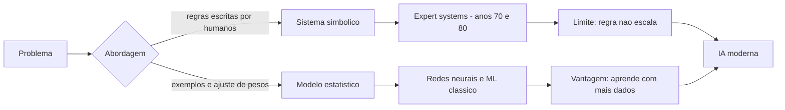

## 4. Técnica

### Dois programas, dois mundos: regras e dados em Python

Nada fixa um conceito como implementá-lo. Vamos construir os dois mundos do capítulo em Python puro — sem instalar nada além do próprio Python — começando pela abordagem simbólica: um classificador de mensagens escrito inteiramente com regras. O exemplo é clássico e útil: dizer se uma mensagem curta parece spam ou não.

```python
def classificar_com_regras(mensagem: str) -> str:
    """Abordagem simbolica: regras escritas a mao pelo programador."""
    texto = mensagem.lower()
    if "grátis" in texto or "gratis" in texto:
        return "spam"
    if "clique aqui" in texto:
        return "spam"
    if "você ganhou" in texto or "voce ganhou" in texto:
        return "spam"
    if len(texto) > 200 and "!" in texto:
        return "spam"
    return "normal"


exemplos = [
    "Olá, tudo bem? Vamos almoçar amanhã?",
    "VOCÊ GANHOU um prêmio! Clique aqui agora mesmo!",
]
for msg in exemplos:
    print(f"{classificar_com_regras(msg):<8} <- {msg}")
```

O código funciona, mas observe o que ele exigiu: alguém teve que prever cada variação de spam ("grátis", "gratis", caixa alta, "clique aqui"...) e escrever cada regra à mão. Um spammer novo que escreva "parabéns, resgate seu bônus" passa despercebido até que um humano adicione a regra. Esse é exatamente o custo da abordagem simbólica: o conhecimento não escala sem o especialista [14]. Agora o mesmo problema com a abordagem estatística: em vez de regras, o programa conta palavras de um vocabulário aprendido de exemplos rotulados.

```python
def treinar_vocabulario(mensagens, rotulos):
    """Conta a frequencia de palavras por classe - o nucleo de um naive bayes."""
    frequencia = {"spam": {}, "normal": {}}
    for msg, rotulo in zip(mensagens, rotulos):
        for palavra in msg.lower().replace(".", " ").replace(",", " ").split():
            dicio = frequencia[rotulo]
            dicio[palavra] = dicio.get(palavra, 0) + 1
    return frequencia


def classificar_aprendendo(mensagem, frequencia):
    """Escolhe a classe que mais conhece as palavras da mensagem."""
    palavras = mensagem.lower().replace(".", " ").replace(",", " ").split()
    pontuacao = {"spam": 0, "normal": 0}
    for rotulo, dicio in frequencia.items():
        total = sum(dicio.values()) or 1
        for palavra in palavras:
            pontuacao[rotulo] += (dicio.get(palavra, 0) + 1) / total
    return max(pontuacao, key=pontuacao.get)


treino = [
    ("ganhe dinheiro facil agora", "spam"),
    ("clique no link e receba premio", "spam"),
    ("reuniao marcada para amanha", "normal"),
    ("preciso revisar o relatorio", "normal"),
]
rotulos = [r for _, r in treino]
frequencia = treinar_vocabulario([m for m, _ in treino], rotulos)
nova = "ganhe premio no link"
print(f"'{nova}' -> {classificar_aprendendo(nova, frequencia)}")
```

Repare na diferença estrutural: o segundo programa nunca viu a frase "ganhe premio no link", mas consegue classificá-la porque aprendeu que "ganhe", "premio" e "link" são palavras típicas de spam. Esse é o ponto do capítulo materializado em código: o conhecimento foi extraído dos dados, não escrito à mão. É primitivo, mas é exatamente o mecanismo que, em escala bilionária de parâmetros, você encontrará nas LLMs dos capítulos 2 e 3 [16][19].

### O limite do Perceptron: por que o inverno aconteceu

Para entender o inverno da IA, implemente o problema que derrubou o otimismo: o XOR. Um classificador linear separa classes com uma reta. O XOR — retornar 1 quando as entradas diferem — cria um padrão em que os pontos de classe 1 ocupam os cantos opostos do quadrado, impossíveis de separar com uma única reta [7]. O programa abaixo tenta aprender o XOR com um modelo linear (uma soma ponderada seguida de um limiar) e mostra que ele nunca converge para a solução correta, exatamente como Minsky e Papert provaram.

```python
def predicao_linear(pesos, entradas):
    soma = sum(p * e for p, e in zip(pesos, entradas))
    return 1 if soma > 0 else 0


def treinar_linear(xor_exemplos, passos=200):
    pesos = [0.2, 0.2, 0.2]  # bias, x1, x2
    for _ in range(passos):
        for entradas, esperado in xor_exemplos:
            obtido = predicao_linear(pesos, entradas)
            erro = esperado - obtido
            pesos[0] += erro * 1
            pesos[1] += erro * entradas[1]
            pesos[2] += erro * entradas[2]
    return pesos


xor_exemplos = [
    ([1, 0, 0], 0),
    ([1, 0, 1], 1),
    ([1, 1, 0], 1),
    ([1, 1, 1], 0),
]
pesos_finais = treinar_linear(xor_exemplos)
acertos = sum(
    1 for entradas, esperado in xor_exemplos
    if predicao_linear(pesos_finais, entradas) == esperado
)
print(f"Acertos no XOR com modelo linear: {acertos} de 4")
```

Rode e observe: o melhor que um modelo linear consegue no XOR são 3 de 4 acertos — sempre erra um canto. A solução exigiria uma camada escondida (não linear), que só seria viável com o algoritmo de retropropagação publicado em 1986 [9]. Esse microcosmo é uma lição valiosa: quando uma técnica atinge o limite estrutural, o progresso não vem de mais esforço, mas de mudança de arquitetura — a mesma lição que explica o salto do Transformer no capítulo 2.

### Um classificador estatístico que aprende de verdade: o SGD

Para fechar a parte técnica, vamos ao mecanismo que está no coração do aprendizado moderno: a descida de gradiente estocástica (SGD). A ideia é simples: definimos um erro mensurável entre a previsão do modelo e a resposta correta, e ajustamos os pesos na direção que reduz esse erro, um exemplo por vez [18]. Implementamos um classificador binário com regressão logística em Python puro — sem numpy, sem dependências.

```python
import math


def sigmoid(valor):
    return 1 / (1 + math.exp(-valor))


def prever(pesos, entradas):
    return sigmoid(sum(p * e for p, e in zip(pesos, entradas)))


def treinar_sgd(dados, epocas=300, taxa=0.1):
    n_features = len(dados[0][0])
    pesos = [0.0] * n_features
    for _ in range(epocas):
        for entradas, esperado in dados:
            erro = prever(pesos, entradas) - esperado
            for i in range(n_features):
                pesos[i] = pesos[i] - taxa * erro * entradas[i]
    return pesos


dados = [
    ([1, 2], 0), ([2, 3], 0), ([5, 5], 1), ([6, 7], 1),
    ([1, 6], 0), ([7, 2], 1), ([3, 3], 0), ([8, 8], 1),
]
pesos = treinar_sgd(dados)
acertos = sum(1 for e, r in dados if round(prever(pesos, e)) == r)
print(f"Acurcia apos treino: {acertos}/{len(dados)}")
for e, _ in dados[:4]:
    print(f"{e} -> {prever(pesos, e):.2f}")
```

Esse é o mesmo mecanismo — com mais matemática, mais camadas e bilhões de parâmetros — que treina os modelos que você usará nos harnesses dos módulos 3 e 4 [16][19]. Quando você entender que uma LLM é, na essência, uma máquina de ajuste de pesos treinada em trilhões de exemplos, nunca mais verá a IA como magia: verá como engenharia — a engenharia que você está prestes a dominar.

### Como verificar o que você escreveu

Todo código que você escrever neste livro deve ser verificável. Para isso, use funções de teste simples com `assert` — um hábito que os capítulos 8 a 11 vão reforçar com projetos reais. Aqui está a forma mínima de validar os classificadores deste capítulo:

```python
def testar_classificadores():
    regra = classificar_com_regras
    assert regra("vamos almoçar amanha?") == "normal"
    assert regra("VOCÊ GANHOU! clique aqui") == "spam"

    treino = [
        ("ganhe dinheiro facil", "spam"),
        ("reuniao as dez", "normal"),
    ]
    rotulos = [r for _, r in treino]
    freq = treinar_vocabulario([m for m, _ in treino], rotulos)
    assert classificar_aprendendo("ganhe premio", freq) == "spam"
    assert classificar_aprendendo("reuniao do time", freq) == "normal"
    print("Todos os testes passaram")


testar_classificadores()
```

Rode o arquivo completo e, se tudo estiver certo, você terá executado — com as próprias mãos — as duas abordagens que dividem o campo da IA desde 1950. Esse é o seu primeiro passo concreto no desencantamento produtivo: o código que você acabou de rodar é, estruturalmente, o mesmo tipo de código que move os sistemas modernos [20].

### Medindo a qualidade do classificador: da intuição ao número

Um classificador só tem valor se a qualidade dele puder ser medida — e a forma canônica de medir é a matriz de confusão, que classifica cada previsão em quatro categorias: verdadeiro positivo (acertou que era spam), falso positivo (marcou como spam o que não era), verdadeiro negativo (acertou que era normal) e falso negativo (deixou passar o spam) [18]. A distinção entre os dois tipos de erro é essencial na prática: um falso positivo custa um e-mail legítimo perdido; um falso negativo custa um spam na caixa do usuário — e cada aplicação tem um custo diferente para cada tipo de erro [19]. O programa abaixo avalia o classificador aprendido e calcula as duas métricas centrais — precisão (das previsões positivas, quantas estavam certas) e revocação (dos positivos reais, quantos foram capturados) [18]:

```python
def avaliar_classificador(classificador, exemplos):
    tp = fp = tn = fn = 0
    for entradas, esperado in exemplos:
        predito = classificador(entradas)
        if predito == 1 and esperado == 1:
            tp += 1
        elif predito == 1 and esperado == 0:
            fp += 1
        elif predito == 0 and esperado == 0:
            tn += 1
        else:
            fn += 1
    return {"tp": tp, "fp": fp, "tn": tn, "fn": fn}


def metricas(confusao):
    precisao = confusao["tp"] / (confusao["tp"] + confusao["fp"] or 1)
    revocacao = confusao["tp"] / (confusao["tp"] + confusao["fn"] or 1)
    return {"precisao": round(precisao, 2), "revocacao": round(revocacao, 2)}


freq = treinar_vocabulario(
    ["ganhe dinheiro facil", "clique no link", "reuniao as dez", "revisar relatorio"],
    ["spam", "spam", "normal", "normal"],
)
exemplos = [
    (["ganhe premio agora"], "spam"),
    (["reuniao da equipe"], "normal"),
]


def predizer_binario(mensagem, frequencia):
    rotulo = classificar_aprendendo(mensagem, frequencia)
    return 1 if rotulo == "spam" else 0


resultado = avaliar_classificador(predizer_binario, exemplos)
print("matriz de confusao:", resultado)
print("metricas:", metricas(resultado))
```

O hábito de medir antes de confiar é o mesmo que você usará com modelos reais nos capítulos seguintes: qualidade não é impressão, é número — e o número decide quando o modelo está pronto para produção e quando ainda precisa de mais dados [19][20].

### O vizinho mais próximo: o algoritmo mais didático do aprendizado de máquina

Antes de encerrar a parte técnica, vale conhecer o algoritmo mais didático do aprendizado de máquina clássico: o k-vizinhos mais próximos (k-NN), que classifica um ponto novo olhando para os exemplos já rotulados mais próximos dele e votando com eles [18]. Não há pesos nem gradientes — há apenas distância e votação, o que torna o mecanismo transparente: você pode explicar cada previsão mostrando os vizinhos que a decidiram [18]. A implementação abaixo usa distância euclidiana e voto majoritário:

```python
import math


def distancia(a, b):
    return math.sqrt(sum((x - y) ** 2 for x, y in zip(a, b)))


def knn(treino, rotulos, novo, k=3):
    ordenados = sorted(
        treino, key=lambda exemplo: distancia(novo, exemplo)
    )
    vizinhos = ordenados[:k]
    votos = {}
    for exemplo in vizinhos:
        rotulo = rotulos[treino.index(exemplo)]
        votos[rotulo] = votos.get(rotulo, 0) + 1
    return max(votos, key=votos.get)


treino = [[1, 2], [2, 1], [8, 8], [9, 9]]
rotulos = ["leve", "leve", "pesado", "pesado"]
print("ponto [2, 2]:", knn(treino, rotulos, [2, 2]))
print("ponto [8, 2]:", knn(treino, rotulos, [8, 2]))
```

O k-NN encapsula a virada estatística de forma pura: nenhuma regra escrita, apenas exemplos, distância e votação [18]. Quando você encontrar essa mesma lógica — dados, medida de proximidade, decisão por evidência — nas ferramentas modernas, saberá reconhecer que a IA estatística não é uma ideia nova: é uma ideia antiga que aprendeu a escalar [19].

## 5. Aplica

### A cena de contraste: quando o instinto de "programar a IA" falha

Imagine a seguinte situação. Você é o Aprendiz de Construtor em seu primeiro estágio, e a equipe recebe a missão de filtrar comentários ofensivos num fórum com milhares de posts por dia. Você, seguindo o instinto natural de quem aprendeu lógica tradicional, abre o editor e começa a escrever uma lista gigante de regras: "se contém palavra X, bloqueia; se contém Y, bloqueia". No segundo dia, a lista tem duzentas linhas de `if`s, e o fórum continua cheio de comentários ofensivos que usam gírias, variações e contextos que você não previu. Você passa a noite adicionando regras, e cada correção parece gerar dois novos casos perdidos — a manutenção virou um buraco sem fundo. A frustração é real e familiar: você está tentando vencer a complexidade do mundo com regras escritas à mão, e o mundo sempre conhece mais variações do que você.

O diagnóstico, ligado à teoria do capítulo, é direto: você replicou, em escala pequena, exatamente o erro que os sistemas especialistas cometeram nos anos 1980 — confiar em regras explícitas para um domínio aberto e mutável. O conhecimento de "o que é ofensivo" muda com a comunidade, com a cultura e com a criatividade dos usuários; nenhuma lista estática dá conta [13]. A correção é a virada estatística que você implementou na seção Técnica: em vez de escrever regras, colete exemplos rotulados (posts marcados por moderadores como ofensivos ou aceitáveis) e treine um classificador que generalize o padrão. Quando um comentário novo chega, o modelo responde com base no padrão aprendido — e quando a comunidade muda, você adiciona novos exemplos e retreina, sem reescrever uma única regra.

Depois da cena, vale a síntese rápida das armadilhas comuns desta fase da jornada: (1) confundir "IA" com "regras disfarçadas" — se todo o conhecimento está em `if`s escritos por você, não há aprendizado; (2) ignorar a qualidade dos dados — um modelo estatístico é tão bom quanto os exemplos que recebeu, e dados enviesados produzem decisões enviesadas [20]; (3) subestimar a manutenção — sistemas de regras têm custo de manutenção crescente, sistemas estatísticos têm custo de retreinamento; (4) esperar perfeição — aprendizado de máquina acerta padrões, não verdades absolutas, e a avaliação contínua é parte do trabalho [18]. No mercado real, essa distinção separa equipes que automatizam de equipes que empilham manutenção — e ela aparecerá de novo, com roupagem moderna, quando você configurar modelos e harnesses nos módulos 3 e 4.

## 6. Conclusão

Você concluiu o primeiro passo do desencantamento produtivo. Recapitule os três pontos centrais: primeiro, IA é uma coleção de técnicas, não uma entidade mágica — e a distinção mais importante é entre regras escritas por humanos e padrões aprendidos de dados; segundo, a história da IA é um ciclo de entusiasmo e correção — o inverno causado pelos limites do Perceptron ensinou que mudanças de arquitetura, não esforço, movem o campo [7][9]; terceiro, a virada estatística venceu porque escala — sistemas que aprendem com dados melhoram quando recebem mais dados, e é isso que você implementou na seção Técnica com os classificadores em Python puro.

O desafio desta etapa: pegue um problema do seu cotidiano — como decidir se um e-mail merece resposta rápida, ou como priorizar mensagens — e implemente as duas abordagens do capítulo para ele. Compare o esforço de manutenção de cada uma após uma semana de exemplos novos. Você vai sentir na pele, em pequena escala, a razão estrutural de o mundo ter migrado para o aprendizado estatístico.

Há ainda uma lição transversal que merece registro antes de avançar: toda técnica de IA carrega um julgamento de valor sobre o que vale a pena otimizar. O classificador que prioriza e-mails pode ser treinado para velocidade, para precisão ou para justiça — e a escolha é sua, não da máquina [12]. Essa responsabilidade do operador vai aparecer de novo em cada etapa do livro, das restrições da instrução aos freios de segurança do Capítulo 12, e é o que separa o uso consciente da IA do uso ingênuo.

No próximo capítulo, a mesma ideia — aprender padrões de dados — é levada ao extremo: redes neurais com dezenas de camadas processando dados em escala massiva, e a arquitetura Transformer, o divisor de águas que deu origem às LLMs que você já usa. Se este capítulo abriu a caixa-preta, o Capítulo 2 vai mostrar a primeira engrenagem gigante que existe dentro dela.

## 7. Referências Bibliográficas

[1] MCCULLOCH, Warren; PITTS, Walter. A Logical Calculus of the Ideas Immanent in Nervous Activity. *Bulletin of Mathematical Biophysics*, v. 5, n. 4, p. 115-133, 1943.

[2] TURING, Alan. Computing Machinery and Intelligence. *Mind*, v. 59, n. 236, p. 433-460, 1950.

[3] MCCARTHY, John; MINSKY, Marvin; ROCHESTER, Nathaniel; SHANNON, Claude. *A Proposal for the Dartmouth Summer Research Project on Artificial Intelligence*. Hanover: Dartmouth College, 1955.

[4] NEWELL, Allen; SIMON, Herbert. The Logic Theory Machine: A Complex Information Processing System. *IRE Transactions on Information Theory*, v. 2, n. 3, p. 61-79, 1956.

[5] ROSENBLATT, Frank. The Perceptron: A Probabilistic Model for Information Storage and Organization in the Brain. *Psychological Review*, v. 65, n. 6, p. 386-408, 1958.

[6] SAMUEL, Arthur. Some Studies in Machine Learning Using the Game of Checkers. *IBM Journal of Research and Development*, v. 3, n. 3, p. 210-229, 1959.

[7] MINSKY, Marvin; PAPERT, Seymour. *Perceptrons: An Introduction to Computational Geometry*. Cambridge: MIT Press, 1969.

[8] SHORTLIFFE, Edward. *Computer-Based Medical Consultations: MYCIN*. Nova York: Elsevier, 1976.

[9] RUMELHART, David; HINTON, Geoffrey; WILLIAMS, Ronald. Learning Representations by Back-Propagating Errors. *Nature*, v. 323, n. 6088, p. 533-536, 1986.

[10] NILSSON, Nils. *Principles of Artificial Intelligence*. Palo Alto: Tioga, 1980.

[11] FEIGENBAUM, Edward; BUCHANAN, Bruce; LEDERBERG, Joshua. On Generality and Problem Solving: A Case Study Using the DENDRAL Program. *Machine Intelligence*, v. 6, p. 165-190, 1971.

[12] WIENER, Norbert. *Cybernetics: Or Control and Communication in the Animal and the Machine*. 2. ed. Cambridge: MIT Press, 1961.

[13] HAYES-ROTH, Frederick; WATERMAN, Donald; LENAT, Douglas. *Building Expert Systems*. Reading: Addison-Wesley, 1983.

[14] RUSSELL, Stuart; NORVIG, Peter. *Artificial Intelligence: A Modern Approach*. 4. ed. Harlow: Pearson, 2021.

[15] LUGER, George. *Artificial Intelligence: Structures and Strategies for Complex Problem Solving*. 6. ed. Boston: Addison-Wesley, 2009.

[16] GOODFELLOW, Ian; BENGIO, Yoshua; COURVILLE, Aaron. *Deep Learning*. Cambridge: MIT Press, 2016.

[17] DOMINGOS, Pedro. *The Master Algorithm: How the Quest for the Ultimate Learning Machine Will Remake Our World*. Nova York: Basic Books, 2015.

[18] BISHOP, Christopher. *Pattern Recognition and Machine Learning*. Nova York: Springer, 2006.

[19] GÉRON, Aurélien. *Hands-On Machine Learning with Scikit-Learn, Keras, and TensorFlow*. 2. ed. Sebastopol: O'Reilly, 2019.

[20] STANFORD UNIVERSITY. *Artificial Intelligence Index Report 2024*. Stanford: Stanford HAI, 2024.

# Capítulo 2: A era do aprendizado profundo: redes neurais e o divisor de águas Transformer

## 1. Introdução

No Capítulo 1, você aprendeu a distinção fundamental que divide o campo da IA: sistemas baseados em regras, escritos à mão por especialistas, e sistemas estatísticos, que aprendem padrões a partir de dados. Você implementou ambos em Python puro e sentiu, na prática, por que a abordagem estatística venceu: ela escala. Este capítulo leva essa ideia ao extremo. Você vai conhecer o aprendizado profundo (deep learning) — redes neurais com dezenas de camadas que processam dados em escala massiva — e o divisor de águas que tornou possível o mundo dos assistentes modernos: a arquitetura Transformer, publicada em 2017, que está por trás de praticamente todas as LLMs que você já usou ou vai usar neste livro.

Ao final deste capítulo, você será capaz de explicar o que são camadas, pesos e atenção; entender por que mais dados e mais computação transformaram redes neurais de curiosidade acadêmica em motor da indústria; e reconhecer o papel do Transformer como a fundação técnica das ferramentas que você vai configurar nos módulos 3 e 4. Como Aprendiz de Construtor, você não precisa dominar a matemática profunda — precisa dominar o mapa conceitual, e é exatamente ele que vamos desenhar aqui.

## 2. Explica

### Redes neurais: neurônios artificiais e o aprendizado em camadas

Uma rede neural é uma função matemática composta por camadas de unidades simples chamadas neurônios artificiais. Cada neurônio recebe vários valores de entrada, multiplica cada um por um peso (um número que representa a importância daquela entrada), soma tudo e passa o resultado por uma função de ativação que decide quanto daquele sinal segue adiante [15]. O que torna uma rede "profunda" é o número de camadas intermediárias entre a entrada e a saída — as chamadas camadas escondidas, que aprendem a representar o dado em níveis crescentes de abstração: numa rede de visão, por exemplo, a primeira camada pode aprender a detectar bordas, a segunda combina bordas em formas, a terceira combina formas em partes de objetos [14]. Nenhuma dessas representações é programada: todas emergem do processo de treinamento.

O processo de treinamento é o coração de tudo. A rede começa com pesos aleatórios e, portanto, previsões ruins. Para cada exemplo de treinamento, comparamos a previsão com a resposta correta e calculamos um erro. O algoritmo de retropropagação (backpropagation) — popularizado em 1986 por Rumelhart, Hinton e Williams [19] — propaga esse erro da camada de saída de volta pelas camadas internas, calculando, para cada peso, quanto ele contribuiu para o erro. Em seguida, a descida de gradiente ajusta cada peso na direção que reduz o erro. Repetido milhões de vezes sobre milhões de exemplos, esse ciclo transforma pesos aleatórios em representações poderosas [15]. É a mesma máquina de ajuste que você implementou no Capítulo 1 — só que com milhões de pesos, dezenas de camadas e organização em lotes.

### O processamento em grande escala: por que o deep learning só decolou agora

O conceito de redes neurais existe desde 1943, mas o deep learning só virou o motor da indústria quando três ingredientes convergiram: dados massivos (a internet), computação paralela (as GPUs, originalmente projetadas para jogos) e algoritmos eficientes [14]. A arquitetura LeNet-5, de Yann LeCun e colaboradores em 1998, já reconhecia dígitos manuscritos com redes convolucionais — redes que varrem a imagem com filtros locais, reduzindo drasticamente o número de pesos [1]. Mas foi em 2012 que o mundo acordou: o AlexNet, de Krizhevsky, Sutskever e Hinton, venceu a competição ImageNet por uma margem avassaladora, usando duas GPUs e a técnica de dropout — que desativa neurônios aleatoriamente durante o treino para evitar que a rede decore os exemplos em vez de generalizar [3][4]. A partir dali, redes profundas dominaram visão computacional, áudio e, gradualmente, linguagem.

Outra peça do quebra-cabeça foi a capacidade de processar sequências. Texto é uma sequência: palavras dependem de contexto à esquerda e à direita. As redes recorrentes (RNNs) processavam tokens em ordem, mantendo um estado interno, e as LSTMs — introduzidas em 1997 por Hochreiter e Schmidhuber — resolveram parcialmente o problema de esquecer informação distante [5]. Mas as RNNs são inerentemente sequenciais: cada token depende do anterior, o que impede a paralelização em larga escala e limita o contexto processável [18]. Foi essa limitação estrutural que abriu caminho para uma ideia radical: abandonar a sequencialidade e processar todas as palavras de uma vez, com atenção.

### O divisor de águas: a arquitetura Transformer e a atenção

Em 2017, o artigo "Attention Is All You Need", de Ashish Vaswani e colegas do Google, propôs o Transformer: uma arquitetura de redes neurais que elimina completamente a recorrência e processa a sequência inteira em paralelo, usando apenas mecanismos de atenção e camadas de feed-forward [7]. A ideia central é o mecanismo de atenção: cada token "olha" para todos os outros tokens da sequência e calcula um peso de relevância — quanto cada um deve influenciar a representação dele. Se a palavra "banco" aparece num texto sobre dinheiro, a atenção a conecta fortemente com "transação", "saldo" e "juros"; num texto sobre rios, com "margem", "água" e "peixe". A atenção multi-cabeça repete esse processo em paralelo com várias "cabeças", capturando diferentes tipos de relação simultaneamente [7].

A vantagem estrutural é dupla. Primeiro, a paralelização: como não há dependência sequencial, o treinamento pode usar GPUs ao máximo, permitindo treinar modelos com bilhões de parâmetros em dados da escala da internet. Segundo, a capacidade de contexto: a atenção conecta tokens distantes diretamente, em um único passo, em vez de depender de um estado interno que se degrada com a distância [5][6]. A base da atenção já existia em tradução automática — o mecanismo de alinhamento de Bahdanau e colaboradores (2015) permitia que o modelo "olhasse para trás" nas palavras relevantes da frase de origem [6] — mas o Transformer a elevou de acessório a arquitetura inteira.

### Do Transformer às LLMs: BERT, GPT e as leis de escala

O Transformer deu origem a duas grandes famílias de modelos de linguagem. O BERT (2018), de Jacob Devlin e colaboradores do Google, usa a parte codificadora (encoder) do Transformer: lê o texto inteiro de uma vez, em duas direções, e é excelente em entender o contexto — classificar sentimentos, extrair entidades, responder perguntas [8]. Os modelos GPT, de Alec Radford e equipe da OpenAI, usam a parte decodificadora (decoder): geram texto token por token, prevendo a próxima palavra, e são excelentes em gerar texto novo [9][10]. A família GPT mostrou um fenômeno surpreendente: com escala suficiente, o modelo aprende tarefas que nunca foi explicitamente treinado para fazer — o chamado aprendizado em contexto (in-context learning), demonstrado pelo GPT-3 em 2020 com 175 bilhões de parâmetros [11].

Essa escalada não foi acaso: seguiu leis de escala. Kaplan e colaboradores (2020) mostraram que o desempenho de modelos Transformer melhora de forma previsível com mais parâmetros, mais dados e mais computação [12]; Hoffmann e colaboradores (2022) refinaram a relação, mostrando que a combinação ótima favorece modelos menores treinados em muito mais dados [13]. Essas leis explicam por que a indústria correu para escalar: os ganhos eram matematicamente antecipáveis. Elas também explicam por que modelos abertos — como os que você vai conectar nos capítulos 8 e 9 — conseguem alcançar níveis respeitáveis: não existe segredo místico, existe escala e engenharia de dados, hoje acessíveis a mais players [20].

## 3. Ilustra

Pense numa fábrica de montagem de carros, mas em versão radicalmente paralela. Na linha de montagem tradicional (a RNN), cada operário só pode trabalhar depois que o carro chega até ele: o motor só é instalado após o chassi passar pelas estações anteriores, e um erro no início atrasa tudo. Processar texto com redes recorrentes é exatamente assim — palavra por palavra, em cadeia. Agora imagine uma fábrica nova onde, para cada carro, todos os operários recebem a planta completa e trabalham ao mesmo tempo, trocando bilhetes sobre os pontos importantes: o operário do motor escreve "o torque está aqui", e o operário da suspensão lê o bilhete na hora, sem esperar o carro chegar. Essa é a atenção: cada palavra da frase escreve um bilhete ("eu sou relevante para você porque...") e lê os bilhetes de todas as outras palavras simultaneamente. A linha de montagem paralela é o Transformer.

Como Aprendiz de Construtor, você já vê a consequência prática: é por isso que os modelos modernos "entendem" contexto longo — não porque pensam, mas porque a arquitetura foi desenhada para conectar cada parte do texto a todas as outras em um único passo [7]. A caixa-preta vai se abrindo: dentro dela há uma fábrica paralela de bilhetes de relevância, treinada em escala gigantesca. O diagrama abaixo mostra a anatomia do Transformer na forma que você precisa reter — encoders, decoders e o mecanismo de atenção no centro.

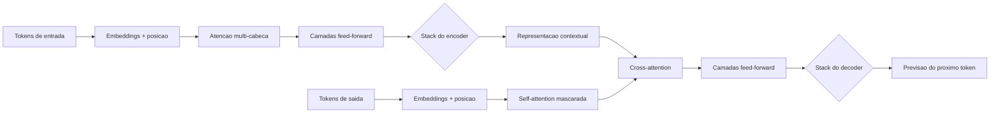

## 4. Técnica

### Uma rede neural de uma camada em Python puro

Vamos materializar o conceito de rede neural sem nenhuma biblioteca externa. O programa abaixo implementa uma rede de uma camada com retropropagação simples para aprender a função OR — o mesmo mecanismo que, empilhado em camadas, forma o deep learning [15]. Você verá os pesos saindo de valores arbitrários e convergindo para os valores que resolvem o problema.

```python
def ativacao_sigmoid(valor):
    return 1 / (1 + (2.718281828 - 1) ** (-valor)) if valor >= 0 else 1 - 1 / (1 + (2.718281828 - 1) ** valor)


def rede_uma_camada(pesos, entradas):
    soma = sum(p * e for p, e in zip(pesos, entradas))
    return ativacao_sigmoid(soma)


def treinar_or(epocas=2000, taxa=0.3):
    exemplos = [([0, 0], 0), ([0, 1], 1), ([1, 0], 1), ([1, 1], 1)]
    pesos = [0.1, 0.1, 0.1]  # bias, x1, x2
    for _ in range(epocas):
        for entradas, esperado in exemplos:
            previsao = rede_uma_camada(pesos, entradas)
            erro = previsao - esperado
            for i in range(len(pesos)):
                pesos[i] = pesos[i] - taxa * erro * entradas[i]
    return pesos


pesos_or = treinar_or()
for entradas, esperado in [([0, 0], 0), ([0, 1], 1), ([1, 0], 1), ([1, 1], 1)]:
    previsao = rede_uma_camada(pesos_or, entradas)
    print(f"{entradas} -> {previsao:.3f} (esperado {esperado})")
```

Rode e observe: o erro cai a cada época e as previsões convergem para os valores esperados. Esse ciclo — prever, medir erro, ajustar pesos — é o mesmo que treina modelos com bilhões de parâmetros, apenas com mais camadas, mais matemática e mais dados [14].

### Empilhando camadas: o aprendizado profundo em miniatura

Uma camada única não aprende o XOR, como você viu no Capítulo 1. A solução é empilhar uma camada escondida com ativação não linear — exatamente o que tornou o deep learning possível [19]. Vamos implementar uma rede de duas camadas que aprende o XOR, o problema que derrubou o otimismo dos anos 1960 [7]:

```python
def ativacao_tanh(valor):
    exp_pos = 2.718281828 ** valor
    exp_neg = 2.718281828 ** (-valor)
    return (exp_pos - exp_neg) / (exp_pos + exp_neg)


def rede_duas_camadas(w1, w2, entradas):
    camada_escondida = [ativacao_tanh(
        w1[i][0] * entradas[0] + w1[i][1] * entradas[1] + w1[i][2]
    ) for i in range(2)]
    saida = ativacao_tanh(
        w2[0] * camada_escondida[0] + w2[1] * camada_escondida[1] + w2[2]
    )
    return saida, camada_escondida


def treinar_xor_profundo(epocas=3000, taxa=0.5):
    exemplos = [([0, 0], 0), ([0, 1], 1), ([1, 0], 1), ([1, 1], 0)]
    w1 = [[0.4, -0.3, 0.1], [-0.5, 0.6, 0.2]]
    w2 = [0.5, -0.4, 0.1]
    for _ in range(epocas):
        for entradas, esperado in exemplos:
            saida, oculto = rede_duas_camadas(w1, w2, entradas)
            erro = saida - esperado
            for i in range(2):
                w2[i] = w2[i] - taxa * erro * oculto[i]
            w2[2] = w2[2] - taxa * erro
            for j in range(2):
                derivada = oculto[j] * (1 - oculto[j] ** 2)
                for k in range(3):
                    entrada_k = entradas[k] if k < 2 else 1.0
                    w1[j][k] = w1[j][k] - taxa * erro * w2[j] * derivada * entrada_k
    return w1, w2


w1_final, w2_final = treinar_xor_profundo()
acertos = 0
for entradas, esperado in [([0, 0], 0), ([0, 1], 1), ([1, 0], 1), ([1, 1], 0)]:
    saida, _ = rede_duas_camadas(w1_final, w2_final, entradas)
    predito = 1 if saida > 0 else 0
    acertos += predito == esperado
    print(f"{entradas} -> {saida:.3f} (esperado {esperado})")
print(f"Acertos: {acertos}/4")
```

Essa é a essência do aprendizado profundo: camadas intermediárias aprendem representações que tornam o problema resolvível, e a não linearidade é o que dá poder de expressão [16]. O que falta para chegar ao Transformer são dois ingredientes: processamento em paralelo em GPUs (inviável de demonstrar aqui) e o mecanismo de atenção — que vamos implementar em seguida, na sua forma mais simples e didática.

### A atenção na prática: um buscador de relevância em Python

O mecanismo de atenção pode ser entendido como uma forma sofisticada de dizer "quanto cada palavra importa para cada outra". Na sua forma mais simples, ele calcula, para cada par de palavras, um peso de similaridade. Vamos implementar uma atenção simples sobre uma frase usando contagem de co-ocorrência — uma metáfora fiel da ideia central [7][6]:

```python
def construir_vocabulario(texto):
    palavras = texto.lower().replace(".", "").replace(",", "").split()
    return list(dict.fromkeys(palavras))


def matriz_similaridade(palavras):
    """Matriz onde cada celula diz o quanto duas palavras aparecem juntas."""
    n = len(palavras)
    matriz = [[0] * n for _ in range(n)]
    for i in range(n):
        for j in range(n):
            if i == j:
                matriz[i][j] = 1
            elif abs(i - j) == 1:
                matriz[i][j] = 0.5
    return matriz


def atencao_simples(frase, palavra_alvo, topo=3):
    palavras = construir_vocabulario(frase)
    try:
        indice_alvo = palavras.index(palavra_alvo)
    except ValueError:
        return []
    matriz = matriz_similaridade(palavras)
    relevancias = [(matriz[indice_alvo][i], palavras[i]) for i in range(len(palavras))]
    relevancias.sort(reverse=True)
    return [(palavra, round(peso, 2)) for peso, palavra in relevancias[:topo]]


frase = "o banco central anunciou a nova taxa de juros ontem"
print("Palavras mais relevantes para 'banco':")
for palavra, peso in atencao_simples(frase, "banco"):
    print(f"  {palavra} -> {peso}")
```

O exemplo é uma caricatura — a atenção real é aprendida, não baseada em posição — mas captura o princípio: cada palavra recebe, de cada outra palavra, um peso de influência que orienta a representação [7]. O Transformer multiplica essa ideia por milhões de parâmetros aprendidos e por dezenas de cabeças de atenção simultâneas, e é esse mecanismo que conecta "banco" a "juros" num texto e a "margem" em outro.

### Escala na prática: contando o custo de um modelo

Uma lição essencial deste capítulo é o custo do treinamento — e por que os modelos que você vai usar nos próximos capítulos são acessíveis justamente porque o treinamento é caro, mas a inferência (o uso) é barata. O programa abaixo modela, em termos simples, a relação entre parâmetros, dados e esforço de treinamento [12][13]:

```python
def custo_estimado(parametros_milhoes, tokens_bilhoes, gpus, eficiencia=0.5):
    """Estimativa didatica do esforco de treinamento em dias de GPU."""
    flops_por_token = 6 * parametros_milhoes * 1e6
    flops_totais = flops_por_token * tokens_bilhoes * 1e9
    flops_por_gpu_dia = gpus * 1.7e14 * 86400 * eficiencia
    return round(flops_totais / flops_por_gpu_dia, 1)


for parametros, tokens in [(0.125, 10), (7, 15), (70, 200), (175, 300)]:
    dias = custo_estimado(parametros, tokens, 8)
    print(f"{parametros}B de parametros, {tokens}B tokens: ~{dias} dias com 8 GPUs")
```

Os números são aproximações pedagógicas, mas a mensagem é real: o custo cresce de forma previsível com parâmetros e dados [12], e é por isso que modelos abertos menores (7B, 8B), treinados de forma eficiente, são gratuitos para você usar em casa ou via provedores — o tema do Capítulo 8.

### Atenção com pesos normalizados: o softmax na prática

A atenção do Transformer não usa pesos fixos como o exemplo anterior — ela aprende pesos de relevância e os normaliza com a função softmax, que transforma uma lista de valores em probabilidades que somam 1 [7]. Esse detalhe técnico é importante porque permite interpretar a atenção como uma distribuição de foco: o modelo "distribui" sua atenção entre as palavras, e a soma é sempre 100%. A implementação abaixo estende o exemplo da atenção simples com a normalização softmax — o mecanismo que está no coração de todo Transformer moderno [7][6]:

```python
def softmax(valores):
    """Converte uma lista de valores em probabilidades que somam 1."""
    expoentes = [2.718281828 ** v for v in valores]
    total = sum(expoentes)
    return [e / total for e in expoentes]


def atencao_softmax(palavras, indice_alvo):
    """Calcula a distribuicao de atencao da palavra alvo sobre as demais."""
    n = len(palavras)
    escores = []
    for i in range(n):
        if i == indice_alvo:
            escores.append(2.0)
        elif abs(i - indice_alvo) == 1:
            escores.append(1.0)
        else:
            escores.append(0.0)
    pesos = softmax(escores)
    return sorted(
        [(palavras[i], round(peso, 3)) for i in range(n) if i != indice_alvo],
        key=lambda item: item[1],
        reverse=True,
    )


frase = ["o", "banco", "central", "anunciou", "a", "nova", "taxa"]
foco = atencao_softmax(frase, 1)
print(f"atencao da palavra 'banco' sobre as demais:")
for palavra, peso in foco[:4]:
    print(f"  {palavra} -> {peso}")
print(f"soma dos pesos: {sum(p for _, p in foco):.3f}")
```

Observe duas coisas: a soma dos pesos é 1 (a distribuição normalizada) e as palavras vizinhas recebem mais atenção — o padrão que, em escala real, aprende a conectar "banco" a "juros" ou a "margem" conforme o texto [7]. É essa normalização que permite às redes de atenção aprender de forma estável, e é dela que o Transformer derivou seu poder [7][14]. Quando você usar um modelo moderno nos capítulos seguintes, lembre-se desta função: por trás de cada resposta há uma distribuição de atenção como essa — aprendida em bilhões de exemplos [20].

### Funções de ativação: por que a não linearidade importa

Um detalhe técnico que explica muito do deep learning é a função de ativação: sem ela, camadas empilhadas seriam equivalentes a uma única camada linear — e redes profundas não teriam sentido [15]. É a não linearidade (sigmoid, tanh, ReLU) que permite à rede aprender padrões complexos, combinando camadas em representações cada vez mais abstratas [15][16]. O experimento abaixo mostra o contraste: uma pilha linear equivale a uma única transformação, enquanto a ativação não linear quebra essa equivalência [16]:

```python
def linear_puro(valor):
    return 2 * valor + 1


def linear_empilhada(valor):
    return linear_puro(linear_puro(linear_puro(valor)))


def com_ativacao(valor):
    resultado = valor
    for _ in range(3):
        resultado = max(0, 2 * resultado - 1)  # ReLU + transformacao
    return resultado


for x in [-3, 0, 3, 10]:
    print(f"x={x:>3} | linear empilhada={linear_empilhada(x):>5} | com ativacao={com_ativacao(x):>5}")
```

Observe: a pilha linear é só uma reta mais inclinada (equivalente a uma camada única), enquanto a versão com ReLU produz curvas que a linear nunca alcança — é essa diferença que permite a redes profundas modelar dados complexos [16]. A ReLU, introduzida como padrão no deep learning moderno, é a ativação mais comum porque é simples e estável para treinar [15].

## 5. Aplica

### A cena de contraste: "a rede decorou, mas não aprendeu"

Imagine que você, Aprendiz de Construtor, recebeu a missão de treinar um modelo para distinguir fotos de gatos e cachorros para um aplicativo de adoção. Você coleta mil fotos, treina uma rede e obtém 98% de acurácia — comemoração geral. Mas no dia seguinte, o aplicativo vai ao ar e o modelo erra feio: fotos com fundo verde, luz de noite ou ângulos incomuns são classificadas errado. Na reunião, alguém sugere "a IA não presta". Você investiga e descobre o problema: durante o treino, todas as fotos de gatos tinham, por coincidência, etiquetas quadradas no canto — e a rede aprendeu a detectar a etiqueta, não o gato. Com 98% de acurácia, a rede "decorou" o artefato errado: é o clássico sobreajuste, o mesmo fenômeno que o dropout e a regularização combatem [4].

O diagnóstico conecta direto à teoria: o aprendizado profundo extrai padrões dos dados, e padrões espúrios também são padrões. Se os dados têm um atalho — uma cor, um logo, um fundo recorrente — a rede o usa porque ele reduz o erro de treino. A correção tem três frentes: (1) dados limpos e representativos — fotos variadas em fundo, luz e ângulo, sem atalhos coincidentes [15]; (2) separar um conjunto de validação que a rede nunca viu no treino, para medir generalização de verdade [3]; (3) técnicas de regularização, como o dropout, que impedem a dependência excessiva de poucos caminhos [4]. No mercado, esse cuidado separa modelos de demonstração de modelos de produção — e a mesma lógica vale, com outra roupagem, para a qualidade do contexto que você fornece aos modelos nos capítulos 10 e 11.

Síntese das armadilhas comuns desta etapa: (1) confundir acurácia de treino com qualidade real — sempre avalie em dados não vistos; (2) ignorar o viés dos dados — um modelo treinado com fotos de uma única raça não generaliza [20]; (3) tratar o modelo como caixa-preta inescrutável — a análise dos erros (as fotos que ele acertou por engano) é a ferramenta de diagnóstico mais poderosa; (4) esquecer que o Transformer não "entende" no sentido humano — ele modela padrões estatísticos de co-ocorrência, e é esse limite que o Capítulo 3 vai explorar quando agentes passam a agir no mundo real [14].

## 6. Conclusão

Você atravessou o coração técnico do desencantamento. Os três pontos que você leva deste capítulo: primeiro, redes neurais profundas são máquinas de ajuste de pesos organizadas em camadas, que aprendem representações por retropropagação e descida de gradiente — e você implementou esse ciclo em Python puro, do OR ao XOR [15][19]; segundo, o deep learning decolou quando dados massivos, GPUs e algoritmos convergiram, e as leis de escala tornaram o crescimento dos modelos previsível [12][13]; terceiro, o Transformer substituiu o processamento sequencial por atenção paralela — cada token se conecta a todos os outros — e se tornou a fundação de todas as LLMs, do BERT ao GPT [7][8].

O desafio desta etapa: implemente sua própria mini-rede (você pode reusar o código da seção Técnica) para aprender a função AND e, em seguida, altere os pesos iniciais e observe o treino convergir para os mesmos resultados — isso fixa a ideia de que o aprendizado está nos dados e no algoritmo, não nos valores iniciais. Depois, abra qualquer conversa com um assistente de IA e tente identificar, na resposta, os rastros de atenção: como o modelo conectou palavras distantes da sua pergunta.

Uma observação final sobre custo e acesso ajuda a fixar o contexto histórico: o treinamento dessas arquiteturas era caro demais para a maioria das equipes, e foi exatamente essa barreira que o movimento de modelos abertos atacou — liberando pesos, arquiteturas e técnicas para quem quisesse estudar e executar localmente [3][6]. É por isso que hoje você pode rodar um modelo de linguagem no seu próprio computador sem pagar nada, como verá no Capítulo 8, e por que as GPUs, que pareciam exclusividade dos grandes laboratórios, chegaram também a desenvolvedores individuais. Entender essa economia ajuda a prever o futuro: quando o acesso cai, a experimentação cresce — e a experimentação é o motor da inovação em IA [14].

No próximo capítulo, a história dá o salto final: dos modelos que geram texto para os agentes que agem — capazes de chamar ferramentas, interagir com arquivos e sistemas e executar tarefas de ponta a ponta. É a ponte entre o "cérebro" que você acabou de entender e o harness que o capítulo 5 vai apresentar como a peça central da arquitetura em 4 camadas.

## 7. Referências Bibliográficas

[1] LECUN, Yann; BOTTOU, Léon; BENGIO, Yoshua; HAFFNER, Patrick. Gradient-Based Learning Applied to Document Recognition. *Proceedings of the IEEE*, v. 86, n. 11, p. 2278-2324, 1998.

[2] HINTON, Geoffrey; SALAKHUTDINOV, Ruslan. Reducing the Dimensionality of Data with Neural Networks. *Science*, v. 313, n. 5786, p. 504-507, 2006.

[3] KRIZHEVSKY, Alex; SUTSKEVER, Ilya; HINTON, Geoffrey. ImageNet Classification with Deep Convolutional Neural Networks. *Advances in Neural Information Processing Systems*, v. 25, 2012.

[4] SRIVASTAVA, Nitish; HINTON, Geoffrey; KRIZHEVSKY, Alex; SUTSKEVER, Ilya; SALAKHUTDINOV, Ruslan. Dropout: A Simple Way to Prevent Neural Networks from Overfitting. *Journal of Machine Learning Research*, v. 15, p. 1929-1958, 2014.

[5] HOCHREITER, Sepp; SCHMIDHUBER, Jürgen. Long Short-Term Memory. *Neural Computation*, v. 9, n. 8, p. 1735-1780, 1997.

[6] BAHDANAU, Dzmitry; CHO, Kyunghyun; BENGIO, Yoshua. Neural Machine Translation by Jointly Learning to Align and Translate. *International Conference on Learning Representations*, 2015.

[7] VASWANI, Ashish; SHAZEER, Noam; PARMAR, Niki; et al. Attention Is All You Need. *Advances in Neural Information Processing Systems*, v. 30, 2017.

[8] DEVLIN, Jacob; CHANG, Ming-Wei; LEE, Kenton; TOUTANOVA, Kristina. BERT: Pre-training of Deep Bidirectional Transformers for Language Understanding. *NAACL*, p. 4171-4186, 2019.

[9] RADFORD, Alec; NARASIMHAN, Karthik; SALIMANS, Tim; SUTSKEVER, Ilya. *Improving Language Understanding by Generative Pre-Training*. San Francisco: OpenAI, 2018.

[10] RADFORD, Alec; WU, Jeffrey; CHILD, Rewon; et al. *Language Models Are Unsupervised Multitask Learners*. San Francisco: OpenAI, 2019.

[11] BROWN, Tom; MANN, Benjamin; RYDER, Nick; et al. Language Models Are Few-Shot Learners. *Advances in Neural Information Processing Systems*, v. 33, 2020.

[12] KAPLAN, Jared; MCCANDLISH, Sam; HENIGHAN, Tom; et al. *Scaling Laws for Neural Language Models*. arXiv:2001.08361, 2020.

[13] HOFFMANN, Jordan; BORGEAUD, Sebastian; MENSCH, Arthur; et al. *Training Compute-Optimal Large Language Models*. arXiv:2203.15556, 2022.

[14] LECUN, Yann; BENGIO, Yoshua; HINTON, Geoffrey. Deep Learning. *Nature*, v. 521, n. 7553, p. 436-444, 2015.

[15] GOODFELLOW, Ian; BENGIO, Yoshua; COURVILLE, Aaron. *Deep Learning*. Cambridge: MIT Press, 2016.

[16] HE, Kaiming; ZHANG, Xiangyu; REN, Shaoqing; SUN, Jian. Deep Residual Learning for Image Recognition. *IEEE Conference on Computer Vision and Pattern Recognition*, p. 770-778, 2016.

[17] KINGMA, Diederik; BA, Jimmy. Adam: A Method for Stochastic Optimization. *International Conference on Learning Representations*, 2015.

[18] CHO, Kyunghyun; VAN MERRIËNBOER, Bart; GULCEHRE, Caglar; et al. Learning Phrase Representations Using RNN Encoder-Decoder for Statistical Machine Translation. *EMNLP*, p. 1724-1734, 2014.

[19] RUMELHART, David; HINTON, Geoffrey; WILLIAMS, Ronald. Learning Representations by Back-Propagating Errors. *Nature*, v. 323, n. 6088, p. 533-536, 1986.

[20] ZHANG, Susan; ROLLER, Stephen; GOYAL, Naman; et al. *OPT: Open Pre-trained Transformer Language Models*. arXiv:2205.01068, 2022.

# Capítulo 3: A era das LLMs e dos agentes autônomos: do chat à ação

## 1. Introdução

No Capítulo 2, você desmontou a engrenagem central da IA moderna: redes neurais profundas, o mecanismo de atenção e a arquitetura Transformer que está por trás de todas as LLMs. Agora vamos completar o arco histórico: ver como esses modelos saíram dos laboratórios, viraram produtos usados por centenas de milhões de pessoas e — o salto mais importante para este livro — deixaram de apenas responder no chat para agir: interagir com sistemas, arquivos, código e ferramentas. É essa transição do "chat à ação" que cria o cenário onde os harnesses, as 4 camadas e os projetos dos próximos capítulos fazem sentido.

Ao final deste capítulo, você será capaz de explicar como uma LLM é construída e alinhada; diferenciar os papéis de modelos como GPT, Claude e Gemini; e entender o que torna um sistema um "agente autônomo" — raciocínio, uso de ferramentas e loop de ação. Você também vai conhecer os padrões de design de agentes que a indústria consolidou, porque eles serão o vocabulário do restante do livro.

## 2. Explica

### O salto dos modelos generativos: GPT, Claude, Gemini

Os grandes modelos de linguagem (LLMs) são redes Transformer treinadas em trilhões de tokens — pedaços de texto coletados da internet, livros e código. O treinamento inicial é a previsão do próximo token: o modelo recebe uma sequência e aprende a prever o token seguinte, repetidamente, até internalizar padrões estatísticos de linguagem em escala gigantesca [1]. Mas um modelo que apenas prevê o próximo token não é útil como assistente: ele precisa aprender a seguir instruções. O artigo do InstructGPT (2022), de Long Ouyang e equipe da OpenAI, descreveu o processo decisivo: treinar o modelo com exemplos de instruções escritas por humanos e depois refinar com feedback humano (RLHF — reinforcement learning from human feedback), alinhando o comportamento aos padrões de utilidade e segurança esperados [2]. Foi essa receita que, aplicada ao GPT-3.5, gerou o ChatGPT em novembro de 2022 — o produto que levou o paradigma ao público [3].

No mesmo caminho, surgiram famílias rivais com filosofias próprias. A Anthropic lançou a família Claude, com ênfase em segurança constitucional — um conjunto de princípios explícitos que guia o comportamento do modelo — e forte desempenho em tarefas longas e de programação [4]. O Google lançou a família Gemini, construída como multimodal desde o projeto: treinada para processar texto, imagens, áudio e vídeo em conjunto [5]. A corrida acelerou com iterações anuais: cada geração trouxe mais capacidade de raciocínio, janelas de contexto maiores e melhor adesão a instruções [18]. Para o Aprendiz de Construtor, a lição prática é: os nomes mudam, os preços mudam, mas o funcionamento fundamental — Transformer + alinhamento + escala — é o mesmo que você desmontou no Capítulo 2.

### Além do chat: raciocínio, contexto e os limites

Por que um modelo que prevê o próximo token consegue raciocinar? A resposta curta é que o raciocínio emerge como um padrão estatístico aprendido. O artigo de Wei e colaboradores (2022) mostrou que, quando instruídos a pensar passo a passo — gerar uma cadeia de raciocínio intermediária antes da resposta final —, os modelos melhoram drasticamente em problemas de lógica e matemática: é o chain-of-thought (CoT) [6]. Em vez de tentar "saltar" para a resposta, o modelo articula os passos, e cada passo guia o próximo. Esse comportamento não foi programado: emergiu da escala, e sua presença varia com o tamanho do modelo — o que motivou o conceito de habilidades emergentes [20].

Os limites também precisam ser conhecidos, porque você vai lidar com eles na prática. Primeiro, o contexto: a janela de contexto é a quantidade de texto que o modelo "enxerga" de uma vez, e modelos lidam melhor com informação no início e no fim da janela do que no meio — o fenômeno "lost in the middle" documentado por Liu e colaboradores [14]. Segundo, a alucinação: o modelo pode gerar afirmações falsas com total fluência, porque gera o texto estatisticamente mais provável, não o factualmente verificado — um problema tão relevante que gerou surveys dedicados [15]. Terceiro, o desalinhamento residual: mesmo após o treinamento com feedback humano, o modelo pode seguir instruções de formas imprevistas. Esses limites não são defeitos a serem eliminados, mas características a serem gerenciadas — com contexto de qualidade, verificação e as guardas que você aprenderá nos capítulos 10 e 12.

### Do chat aos agentes: o papel das ferramentas e do loop de raciocínio-ação

A transição mais importante deste capítulo é a que transforma o modelo de "oráculo que responde" em "agente que age". Três avanços técnicos sustentam essa transição. O primeiro é o uso de ferramentas: o artigo Toolformer (2023) mostrou que modelos podem aprender a chamar APIs — detectar quando uma pergunta exige informação externa e formular a chamada certa [7]. O segundo é o padrão ReAct (2023), de Shunyu Yao e colaboradores: alternar raciocínio e ação em loop — o modelo raciocina sobre o problema, decide uma ação (chamar uma ferramenta), observa o resultado e raciocina de novo — até concluir a tarefa [8]. O terceiro é a padronização industrial: as APIs passaram a oferecer "function calling", um formato estruturado em que o modelo declara qual função deseja chamar e com quais argumentos, e o sistema executa e devolve o resultado [11].

Com esses ingredientes, a indústria passou a desenhar sistemas agênticos completos. Surveys de 2023 e 2024 catalogaram a arquitetura típica de um agente: um modelo de cérebro, um conjunto de ferramentas, um ambiente de execução, memória e um loop de decisão [9][10]. Experimentos como os Generative Agents de Park e colaboradores mostraram agentes sociais mantendo memória e comportamento coerente ao longo do tempo [16]. E, em dezembro de 2024, a Anthropic publicou o guia que se tornou referência canônica da área — "Building Effective Agents" — que organiza os padrões de design em cinco categorias: prompt chaining (passos encadeados), routing (escolher o caminho), parallelization (executar em paralelo), orchestrator-workers (um orquestrador coordenando especialistas) e evaluator-optimizer (um avaliador refinando a saída) [12]. Esse guia é o mapa que você vai usar, de forma prática, nos capítulos 6, 7 e 11.

### O cenário atual: agentes no mundo real

O estado da arte em 2025-2026 é a combinação de todas essas peças em produtos: ferramentas que leem um repositório, editam arquivos, rodam testes e comandos de terminal, navegam na web e iteram até concluir uma tarefa — tudo supervisionado pelo humano. A avaliação desses sistemas virou ciência própria: benchmarks como o Chatbot Arena ranqueiam modelos por preferência humana [17], e benchmarks técnicos como GPQA testam conhecimento especializado [19]. Para o iniciante, o cenário é animador e acessível: a mesma arquitetura que move produtos de ponta está disponível em harnesses gratuitos e modelos abertos, como você verá nos módulos 3 e 4. A fronteira do "agente perfeito" ainda está aberta — e é exatamente nesse território que este livro vai te colocar, camada por camada [13].

## 3. Ilustra

Imagine que você contratou um assistente pessoal para organizar sua semana de trabalho. Existem dois tipos possíveis. O primeiro é um consultor que você só consulta por telefone: você liga, descreve o problema, ele dá uma resposta eloquente e desliga — e o trabalho de verdade continua todo com você. Esse é o chat tradicional: a LLM pura, que raciocina e responde, mas não toca no mundo. O segundo tipo é um assistente com chaves e autoridade: ele lê seus e-mails (ferramenta de leitura), agenda reuniões na sua agenda (ferramenta de calendário), envia mensagens (ferramenta de comunicação), e quando uma tarefa exige decisão, ele raciocina em voz alta, executa e volta com o resultado. Esse é o agente: cérebro + ferramentas + loop de raciocínio-ação, o padrão ReAct que você acabou de estudar [8].

Como Aprendiz de Construtor, você já percebe a consequência prática do desencantamento: o salto do chat para a ação não vem de um modelo "mais esperto" — vem da arquitetura ao redor do modelo: as ferramentas disponíveis, o loop que alterna raciocínio e ação, e a supervisão que define o que o agente tem autoridade para fazer [12]. Quando você configurar seu primeiro harness no Capítulo 9, estará exatamente montando esse assistente com chaves: decidindo quais ferramentas ele pode usar e qual autoridade ele tem. O diagrama abaixo mostra o loop agêntico na sua forma canônica.

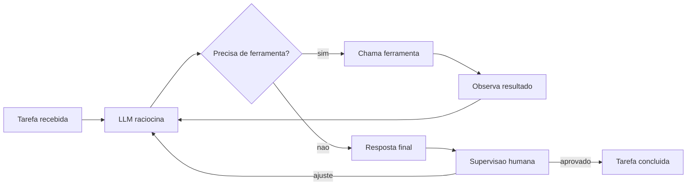

## 4. Técnica

### Function calling na prática: o agente em Python puro

Vamos materializar o coração do agente moderno — o uso de ferramentas — sem bibliotecas externas. A ideia central: o programa descreve suas funções disponíveis, um "modelo" (aqui, simulado por regras didáticas) decide qual chamar, e o sistema executa e devolve o resultado [11]. O código abaixo implementa um mini-agente com duas ferramentas — calcular e buscar em lista — e um loop de decisão.

```python
def ferramenta_calcular(expressao):
    """Calcula uma expressao aritmetica simples, token a token."""
    partes = expressao.split()
    if len(partes) == 3 and partes[1] in ("+", "-", "*", "/"):
        a, op, b = float(partes[0]), partes[1], float(partes[2])
        if op == "+":
            return str(a + b)
        if op == "-":
            return str(a - b)
        if op == "*":
            return str(a * b)
        if op == "/":
            return "erro: divisao por zero" if b == 0 else str(a / b)
    return "erro: expressao nao reconhecida"


def ferramenta_buscar(termo, dados):
    """Retorna itens do catalogo que contem o termo."""
    return [item for item in dados if termo.lower() in item.lower()]


CATALOGO = [
    "harness opencode gratuito",
    "modelo qwen2.5-coder",
    "provedor groq com api gratuita",
    "ollama para execucao local",
]

ferramentas = {
    "calcular": ferramenta_calcular,
    "buscar": ferramenta_buscar,
}


def decidir_acao(pedido):
    """Simulacao didatica da decisao de um LLM: qual ferramenta usar."""
    if any(op in pedido for op in ("+", "-", "*", "/")) and "quanto" in pedido:
        return "calcular", pedido
    if "busca" in pedido or "encontre" in pedido:
        termo = pedido.replace("busque", "").replace("encontre", "").strip()
        return "buscar", termo
    return None, pedido


def executar_agente(pedido):
    ferramenta, argumento = decidir_acao(pedido)
    if ferramenta is None:
        return f"Nao sei agir sobre: {pedido}"
    if ferramenta == "calcular":
        return f"Resultado de '{argumento}': {ferramentas[ferramenta](argumento)}"
    return f"Busca por '{argumento}': {ferramentas[ferramenta](argumento, CATALOGO)}"


for pedido in [
    "quanto e 12 + 30?",
    "busque modelos gratuitos no catalogo",
    "me explique a teoria da relatividade",
]:
    print(f"> {pedido}\n  {executar_agente(pedido)}")
```

Observe o padrão estrutural: o pedido é classificado, a ferramenta certa é selecionada, executada e o resultado é devolvido. Um agente real faz exatamente isso, com a diferença de que a classificação é feita por uma LLM que declara a chamada em formato estruturado (function calling) [11]. O ponto que você deve reter: o "cérebro" decide, mas quem executa é a ferramenta — e é essa separação que permite controlar o que um agente pode e não pode fazer, tema central do Capítulo 12.

### O loop ReAct em código: raciocina, age, observa

Vamos subir um nível e implementar o padrão ReAct de verdade — um loop que alterna raciocínio e ação até concluir [8]. O problema escolhido: descobrir qual número do catálogo atende a uma condição, usando uma ferramenta de "consultar preço" que simula acesso a um sistema externo.

```python
PRECOS = {"harness": 0, "modelo qwen": 0, "groq": 0, "ollama": 0, "cursor pro": 20}


def consultar_preco(produto):
    """Simula uma ferramenta externa de consulta de preco."""
    return PRECOS.get(produto.lower(), "produto nao encontrado")


def loop_react(objetivo, produtos, max_passos=8):
    """Loop ReAct didatico: raciocina, chama ferramenta, observa, decide."""
    passos = []
    preco_do_objeto = None
    for _ in range(max_passos):
        razao = f"objetivo: {objetivo}; ainda nao verifiquei todos os produtos"
        acao = f"consultar_preco({produtos[0]})" if preco_do_objeto is None else f"consultar_preco({produtos[1]})"
        if preco_do_objeto is not None:
            break
        produto_atual = produtos[0] if "consultar_preco(" + produtos[0] + ")" in acao else produtos[1]
        observacao = consultar_preco(produto_atual)
        passos.append((razao, acao, observacao))
        if observacao == 0:
            preco_do_objeto = produto_atual
            break
        produtos = [produto for produto in produtos if produto != produto_atual]
        if not produtos:
            break
    return passos, preco_do_objeto


produtos = ["cursor pro", "ollama", "groq", "harness"]
passos, achado = loop_react("qual produto e gratuito?", produtos)
for razao, acao, obs in passos:
    print(f"RACIOCINIO: {razao}")
    print(f"ACAO: {acao} -> OBSERVACAO: {obs}")
print(f"CONCLUSAO: produto gratuito encontrado: {achado}")
```

O código é uma caricatura do loop real, mas captura a anatomia: em cada iteração há um raciocínio, uma ação (chamada de ferramenta), uma observação (o resultado) e uma nova decisão [8]. Nos agentes reais, o raciocínio é texto gerado pela LLM, a ação é uma chamada de função estruturada, e a observação é a resposta da ferramenta. Esse ciclo — implementado em escala industrial pelos harnesses — é o coração do Capítulo 6.

### Prompt chaining e evaluator-optimizer: os padrões do guia da Anthropic

O guia "Building Effective Agents" da Anthropic descreve padrões que você pode implementar hoje, mesmo como iniciante. O mais simples é o prompt chaining: dividir uma tarefa em passos encadeados, em que a saída de um vira entrada do próximo [12]. Vamos implementar um exemplo concreto: gerar e depois melhorar uma frase de apresentação para um produto.

```python
def passo_gerar_ideia(produto, publico):
    """Primeiro elo da corrente: gera a base da apresentacao."""
    return (f"Apresente {produto} para {publico} destacando "
            f"simplicidade, custo zero e resultados rapidos")


def passo_refinar_texto(rascunho):
    """Segundo elo: enriquece o rascunho com chamado a acao."""
    return (rascunho + " Comece hoje com uma instalacao de cinco minutos "
            "e veja o primeiro resultado na mesma semana.")


def prompt_chaining(produto, publico):
    return passo_refinar_texto(passo_gerar_ideia(produto, publico))


print(prompt_chaining("um harness gratuito", "iniciantes em programacao"))
```

O padrão evaluator-optimizer, por sua vez, usa um componente que avalia a saída e outro que a melhora, em loop até atingir um critério [12]. A versão didática abaixo avalia frases por comprimento e clareza, iterando até a meta:

```python
def avaliar(texto):
    """Retorna pontuacao entre 0 e 10 por clareza didatica (heuristica simples)."""
    palavras = texto.split()
    if len(palavras) < 12:
        return 3
    if len(palavras) > 30:
        return 5
    tem_acao = any(palavra in texto.lower() for palavra in ("aprenda", "comece", "faça", "configure"))
    return 9 if tem_acao else 6


def melhorar(texto):
    return texto + " Aprenda o passo a passo e configure sua primeira ferramenta hoje."


def evaluator_optimizer(texto_inicial, meta=8, max_iteracoes=4):
    texto = texto_inicial
    for _ in range(max_iteracoes):
        nota = avaliar(texto)
        if nota >= meta:
            return texto, nota
        texto = melhorar(texto)
    return texto, avaliar(texto)


final, nota = evaluator_optimizer("Este livro ensina IA do zero.")
print(f"Nota final: {nota}")
print(final)
```

Esses dois padrões — encadeamento e avaliação iterativa — aparecem em todos os produtos agênticos modernos, e você vai reencontrá-los, com interfaces reais, quando usar harnesses nos capítulos 6 e 7 [12].

### Orquestrador e especialistas: o padrão orchestrator-workers

O guia "Building Effective Agents" da Anthropic descreve o padrão orchestrator-workers: um componente central (o orquestrador) analisa a tarefa, decide o plano e delega a execução a componentes especializados (os workers), que rodam em paralelo quando possível [12]. É o padrão dos times reais: um líder coordena, especialistas executam. A implementação abaixo materializa o padrão com três especialistas — um de código, um de dados e um de documentação — e um orquestrador que roteia o pedido para o especialista certo [12][9]:

```python
def especialista_codigo(tarefa):
    return f"[codigo] vou revisar e implementar: {tarefa}"


def especialista_dados(tarefa):
    return f"[dados] vou validar e preparar os dados para: {tarefa}"


def especialista_documentacao(tarefa):
    return f"[docs] vou documentar: {tarefa}"


ESPECIALISTAS = {
    "codigo": especialista_codigo,
    "dados": especialista_dados,
    "docs": especialista_documentacao,
}


def orquestrador(pedido):
    """Analisa o pedido, decide o plano e delega aos especialistas."""
    plano = []
    if "funcao" in pedido or "implemente" in pedido:
        plano.append("codigo")
    if "dados" in pedido or "json" in pedido or "validacao" in pedido:
        plano.append("dados")
    if "documente" in pedido or "leia-me" in pedido:
        plano.append("docs")
    if not plano:
        return "pedido fora do escopo dos especialistas disponiveis"
    resultados = [ESPECIALISTAS[especialidade](pedido) for especialidade in plano]
    return "\n".join(resultados)


for pedido in [
    "implemente a funcao de busca e documente o modulo",
    "valide os dados do json de entrada",
    "reorganize as pastas do projeto",
]:
    print(f"> {pedido}")
    print(orquestrador(pedido))
    print()
```

O padrão é a base de arquiteturas agênticas profissionais: cada worker tem um escopo estreito (fácil de validar e de trocar), e o orquestrador concentra a decisão — o mesmo desenho que você verá em produtos reais e que o Capítulo 6 retomará sob a lente do harness [12][10]. Quando um sistema delega tarefas a especialistas, ele fica mais auditável: cada worker responde pelo seu domínio, e o log do orquestrador mostra qual especialista foi acionado e por quê [12].

### Descrevendo ferramentas para o modelo: o catálogo bem escrito

Um detalhe que separa agentes medianos de agentes excelentes é a qualidade das descrições das ferramentas: o modelo escolhe o que chamar com base no que ele lê, e descrições vagas geram escolhas erradas [12][11]. O guia "Writing Effective Tools" da Anthropic recomenda descrever cada ferramenta com nome claro, propósito, parâmetros e quando usá-la — e evitar catálogos inflados com ferramentas redundantes [12]. O comparativo abaixo mostra a diferença entre uma descrição ruim e uma boa, medida por uma heurística simples de clareza:

```python
def pontuar_descricao(nome, descricao):
    palavras = descricao.split()
    tem_acao = any(p in descricao.lower() for p in ("quando", "usar", "retorna", "parametros", "apenas"))
    return len(palavras) + (20 if tem_acao else 0)


descricao_ruim = "ferramenta de dados"
descricao_boa = ("quando o usuario pedir para buscar no catalogo, use esta ferramenta; "
                 "parametros: termo (texto); retorna lista de itens correspondentes")
print("descricao ruim:", pontuar_descricao("buscar", descricao_ruim), "pontos")
print("descricao boa:", pontuar_descricao("buscar", descricao_boa), "pontos")
```

A lição é prática e aplicável já no Capítulo 9: quando você configurar ferramentas no seu harness, gaste um minuto descrevendo bem cada uma — o modelo recompensa a clareza com escolhas melhores, e o catálogo enxuto com descrições precisas supera o catálogo gigante com descrições vagas [12][11]. É um dos poucos lugares onde um ajuste de texto, e não de modelo, muda o resultado do sistema.

## 5. Aplica

### A cena de contraste: o agente que recebeu autoridade demais

Imagine a cena: você configurou seu primeiro agente para organizar uma pasta de projetos. Empolgado com o padrão ReAct, você habilita todas as ferramentas disponíveis — leitura, escrita, exclusão de arquivos, execução de comandos no terminal — sem restrições, porque "o agente é inteligente, ele decide certo". No primeiro dia, funciona maravilhosamente: ele renomeia arquivos, reorganiza pastas, cria documentação. No segundo dia, um mal-entendido de instrução faz o agente executar um comando de limpeza que apaga uma pasta de backups que você precisava. O agente não foi "mau" — ele raciocinou, agiu e observou exatamente como o loop manda; o problema é que ninguém definiu a autoridade dele [12].

O diagnóstico liga direto à teoria: o loop ReAct dá ao modelo a capacidade de agir, mas a capacidade de agir não vem com senso de consequência — quem define o escopo da ação é o sistema ao redor, não o modelo [8]. A correção, que será detalhada no Capítulo 12, é o princípio do menor privilégio: conceda apenas as ferramentas necessárias para a tarefa, exija aprovação humana para ações destrutivas ou irreversíveis, e mantenha os backups fora do alcance de exclusão [12][15]. Na prática do mercado, essa distinção separa demonstrações impressionantes de sistemas confiáveis — e é exatamente o tipo de decisão de arquitetura que o Aprendiz de Construtor precisa aprender a tomar desde o início.

Síntese das armadilhas comuns da era dos agentes: (1) confundir fluência com confiabilidade — uma resposta eloquente pode estar factualmente errada [15]; (2) dar autoridade total ao agente — o menor privilégio vale para ferramentas e ações; (3) ignorar o contexto — agentes perdem informação no meio de janelas longas [14]; (4) pular a supervisão — o humano no loop é o que transforma um experimento em produção; (5) esperar que um único modelo resolva tudo — a arquitetura (roteamento, encadeamento, orquestração) importa tanto quanto o modelo [12].

## 6. Conclusão

O arco histórico está completo: da lógica simbólica (Capítulo 1) ao deep learning e ao Transformer (Capítulo 2) e, agora, às LLMs e aos agentes autônomos. Os três pontos que você leva deste capítulo: primeiro, uma LLM é um Transformer treinado em escala gigantesca e depois alinhado por feedback humano para seguir instruções — GPT, Claude e Gemini seguem a mesma receita com filosofias diferentes [1][2][4]; segundo, o salto do chat para a ação vem de três avanços — uso de ferramentas, o padrão ReAct de raciocínio-ação e o function calling padronizado [7][8][11]; terceiro, agentes são sistemas: cérebro, ferramentas, memória e loop, desenhados segundo padrões como prompt chaining, routing e orchestrator-workers [12][9][10].

O desafio desta etapa: pegue o código do loop ReAct da seção Técnica e acrescente uma terceira ferramenta — por exemplo, uma que valide se um arquivo existe — e uma regra de segurança que bloqueie ações destrutivas. Isso exercita exatamente a habilidade que define o uso maduro de agentes: definir o que o sistema pode fazer antes de deixá-lo agir.

No próximo módulo, mudamos de marcha: da história e da mecânica para a arquitetura que você vai operar no dia a dia. O Capítulo 4 mostra por que a IA produtiva não vive no navegador, e o Capítulo 5 apresenta as 4 camadas — Tela, Harness, LLM e Tools — que são o mapa de todo o restante do livro.

## 7. Referências Bibliográficas

[1] BROWN, Tom; MANN, Benjamin; RYDER, Nick; et al. Language Models Are Few-Shot Learners. *Advances in Neural Information Processing Systems*, v. 33, 2020.

[2] OUYANG, Long; WU, Jeff; JIANG, Xu; et al. Training Language Models to Follow Instructions with Human Feedback. *Advances in Neural Information Processing Systems*, v. 35, 2022.

[3] OPENAI. *Introducing ChatGPT*. San Francisco: OpenAI, 2022. Disponível em: https://openai.com/blog/chatgpt. Acesso em: 5 ago. 2026.

[4] ANTHROPIC. *Introducing the Claude 3 Family*. São Francisco: Anthropic, 2024. Disponível em: https://www.anthropic.com/news/claude-3-family. Acesso em: 5 ago. 2026.

[5] GOOGLE. *Gemini: A Family of Highly Capable Multimodal Models*. arXiv:2312.11805, 2023.

[6] WEI, Jason; WANG, Xuezhi; SCHUURMANS, Dale; et al. Chain-of-Thought Prompting Elicits Reasoning in Large Language Models. *Advances in Neural Information Processing Systems*, v. 35, 2022.

[7] SCHICK, Timo; DWIVEDI-YU, Jane; DESSI, Roberto; et al. Toolformer: Language Models Can Teach Themselves to Use Tools. *Advances in Neural Information Processing Systems*, v. 36, 2023.

[8] YAO, Shunyu; ZHAO, Jeffrey; YU, Dian; et al. ReAct: Synergizing Reasoning and Acting in Language Models. *International Conference on Learning Representations*, 2023.

[9] XI, Zhiheng; CHEN, Wenxiang; GUO, Xin; et al. *The Rise and Potential of Large Language Model Based Agents: A Survey*. arXiv:2309.07864, 2023.

[10] WANG, Lei; MA, Chen; FENG, Xueyang; et al. A Survey on Large Language Model Based Autonomous Agents. *Frontiers of Computer Science*, v. 18, n. 6, 2024.

[11] OPENAI. *Function Calling and Other API Updates*. San Francisco: OpenAI, 2023. Disponível em: https://openai.com/blog/function-calling-and-other-api-updates. Acesso em: 5 ago. 2026.

[12] ANTHROPIC. *Building Effective Agents*. São Francisco: Anthropic, 2024. Disponível em: https://www.anthropic.com/research/building-effective-agents. Acesso em: 5 ago. 2026.

[13] BUBECK, Sébastien; CHANDRASEKARAN, Varun; ELDAN, Ronen; et al. *Sparks of Artificial General Intelligence: Early Experiments with GPT-4*. arXiv:2303.12712, 2023.

[14] LIU, Nelson; LIN, Kevin; HEWITT, John; et al. Lost in the Middle: How Language Models Use Long Contexts. *Transactions of the Association for Computational Linguistics*, v. 12, p. 157-173, 2023.

[15] HUANG, Lei; YU, Weijiang; MA, Weitao; et al. *A Survey on Hallucination in Large Language Models: Principles, Taxonomy, Challenges, and Open Questions*. arXiv:2311.05232, 2023.

[16] PARK, Joon Sung; O'BRIEN, Joseph; CAI, Carrie; et al. Generative Agents: Interactive Simulacra of Human Behavior. *Proceedings of the ACM Symposium on User Interface Software and Technology*, 2023.

[17] CHIANG, Wei-Lin; ZHENG, Lianmin; SHENG, Ying; et al. *Chatbot Arena: An Open Platform for Evaluating LLMs by Human Preference*. arXiv:2403.04132, 2024.

[18] OPENAI. *GPT-4 Technical Report*. arXiv:2303.08774, 2023.

[19] DETTMERS, Tim; PAGNUCCO, Mike; HOLTZMAN, Ari; et al. *GPQA: A Graduate-Level Google-Proof Q&A Benchmark*. arXiv:2311.12022, 2023.

[20] WEI, Jason; TAY, Yi; BOMMASANI, Rishi; et al. Emergent Abilities of Large Language Models. *Transactions on Machine Learning Research*, 2022.

# PARTE 2 — Desconstruindo a IA: a Arquitetura em 4 Camadas

# Capítulo 4: O ecossistema do desenvolvedor: por que a IA não é apenas um chat no navegador

## 1. Introdução

Nos três primeiros capítulos, você percorreu a história e a mecânica da IA: da lógica simbólica ao Transformer e, finalmente, às LLMs e aos agentes autônomos. Agora vamos mudar o ângulo — da tecnologia para o ambiente onde ela vive no trabalho real. Se você usou IA apenas pelo navegador, tem uma experiência incompleta do que ela pode fazer. Este capítulo explica por que a IA produtiva mora no ecossistema do desenvolvedor — editores, terminais, repositórios e interfaces de linha de comando — e por que é lá, e não no chat do navegador, que a arquitetura em 4 camadas do próximo capítulo ganha vida.

Ao final deste capítulo, você será capaz de nomear as peças do ecossistema (editor, terminal, sistema de arquivos, repositório git, APIs) e explicar o que cada uma permite que a IA faça; entender os números que mostram a adoção massiva da IA no desenvolvimento; e reconhecer as limitações estruturais do chat isolado — contexto efêmero, ausência de ferramentas, ausência de memória de projeto — que os harnesses resolvem.

## 2. Explica

### O navegador como ponto de partida e seus limites

O chat no navegador foi a porta de entrada da IA para o mundo — o ChatGPT, lançado em novembro de 2022, levou o paradigma a centenas de milhões de usuários [9]. Para o iniciante, ele é perfeito: sem instalação, sem configuração, resultado imediato. Mas, quando o objetivo é produzir software, o chat isolado esbarra em três limites estruturais. O primeiro é o contexto efêmero: cada conversa começa do zero, sem conhecer os arquivos do seu projeto, e mesmo dentro da conversa, o modelo depende de você colar trechos de código — o que degrada a qualidade com janelas longas [14]. O segundo é a ausência de ferramentas: o chat não pode rodar seus testes, executar seu código, consultar sua API ou editar seus arquivos; ele apenas sugere texto que você copia e cola. O terceiro é a ausência de memória de projeto: as regras do seu repositório, as convenções do time e o histórico de decisões não existem para ele [8].

Esses limites não são defeitos do modelo — são defeitos do ambiente. O mesmo modelo que erra uma refatoração no navegador pode acertar quando opera dentro do repositório, com acesso ao sistema de arquivos, às ferramentas e ao contexto do projeto [20]. Essa constatação define o território do desenvolvedor: a IA produtiva precisa viver onde o código vive. É exatamente essa a tese que a indústria abraçou — e os números da próxima seção mostram a velocidade dessa migração.

### O território do desenvolvedor: editor, terminal, arquivos e git

O ecossistema do desenvolvedor é um conjunto de camadas de software que, juntas, formam o ambiente de trabalho. O editor de código é a peça central — o Visual Studio Code, da Microsoft, é o editor mais usado do mundo e serve de base para várias ferramentas de IA que você conhecerá no Capítulo 7 [6][14]. O terminal é a segunda peça: uma interface de linha de comando — tipicamente bash em sistemas Unix-like e PowerShell no Windows — por onde o desenvolvedor executa comandos, roda testes, instala dependências e opera o git [13]. O sistema de arquivos é a terceira: os diretórios e arquivos do projeto, que contêm código, configuração e documentação. E o repositório git é a quarta: o controle de versão que registra cada alteração, permitindo comparar, reverter e colaborar [12].

Cada uma dessas peças, quando conectada à IA, vira uma capacidade nova: com acesso ao editor, a IA completa código no contexto do arquivo aberto; com acesso ao terminal, ela executa comandos e lê resultados; com acesso aos arquivos, ela edita, cria e reorganiza; com acesso ao git, ela mostra diffs, propõe mensagens de commit e reverte alterações [17][11]. O que parece "milagre" quando visto do navegador é, na verdade, a combinação disciplinada dessas capacidades — o tema central do Capítulo 5. Para o Aprendiz de Construtor, a implicação é prática e animadora: dominar o básico dessas quatro peças (abrir um editor, rodar um comando no terminal, navegar em arquivos e fazer um commit) é o pré-requisito exato para operar a IA assistida — e este capítulo e o próximo fornecem esse básico.

### Os números da adoção: a IA já está no fluxo do desenvolvedor

A migração da IA para o ecossistema do desenvolvedor não é promessa de futuro — é fato medido. Estudo da Microsoft com desenvolvedores que usaram o GitHub Copilot mediu ganho de produtividade de cerca de 55,8% numa tarefa de implementação de servidor HTTP: os participantes concluíram a tarefa consideravelmente mais rápido com o assistente do que sem ele [1]. Levantamento da GitHub em 2023 indicou que 92% dos desenvolvedores dos EUA já usavam ferramentas de IA em algum momento do trabalho, e 70% diziam que elas davam vantagens ao seu trabalho [2]. A pesquisa anual da Stack Overflow de 2024 mostrou que mais de três quartos dos desenvolvedores usam ou planejam usar ferramentas de IA, com o uso concentrado justamente em escrever e depurar código [3]. A Gartner previu que, até 2028, 75% dos engenheiros de software corporativos usarão assistentes de código com IA — ante menos de 10% em 2023 [4].

Os dados também mostram a direção da evolução. O AI Index da Universidade Stanford documenta o crescimento ano a ano dos investimentos e da adoção de IA generativa em produtos comerciais [5]. E a mudança qualitativa é tão importante quanto a quantitativa: as ferramentas estão saindo do "autocomplete" para o "agente" — sistemas que planejam, executam e iteram, exatamente o que o Capítulo 3 descreveu [19]. Para o iniciante, esses números têm uma leitura dupla: a competência está em alta demanda, e as ferramentas para começar — várias gratuitas — nunca foram tão acessíveis, como você verá nos capítulos 7, 8 e 9.

### O que muda quando a IA tem acesso ao seu projeto

Colocar a IA dentro do projeto muda qualitativamente o tipo de ajuda que ela dá. No navegador, você descreve um problema em abstrato e recebe uma resposta genérica. No repositório, a IA pode ler o código real, entender as convenções, detectar onde uma mudança quebraria testes e propor alterações consistentes com o restante da base [7]. A engenharia de contexto — o conjunto de decisões sobre o que entra na janela do modelo, em que ordem e com que compressão — tornou-se disciplina própria, documentada pela Anthropic em 2025: o desempenho do assistente depende tanto da qualidade do contexto quanto da capacidade do modelo [8]. É essa constatação que sustenta o surgimento dos harnesses: ambientes que automatizam a preparação do contexto, a execução de ferramentas e a memória do projeto — a peça central da arquitetura em 4 camadas que você vai montar no Capítulo 5.

## 3. Ilustra

Pense num escritório de arquitetura. No modelo antigo, o arquiteto recebia uma foto borrada de um terreno (o chat do navegador): ele dava uma opinião genérica, baseada em suposições, e você voltava para casa com uma planta que não encaixa no terreno real. No modelo novo, o arquiteto trabalha dentro do terreno: ele caminha pelo lote (sistema de arquivos), mede o relevo (git e histórico), consulta a legislação (documentação) e usa ferramentas de medição (terminal). A opinião dele, agora, é sobre o terreno real — e não sobre um desenho imaginado. É exatamente essa a diferença entre conversar com a IA no navegador e operá-la dentro do ecossistema do desenvolvedor: o contexto real muda tudo [8].

Como Aprendiz de Construtor, você já percebe a consequência: o "terreno" — seu projeto, seus arquivos, suas regras — é a matéria-prima que a IA transforma em trabalho útil. Quem domina o básico do território (editor, terminal, git) está apto a operar a IA assistida; quem não domina, depende de respostas genéricas. A caixa-preta continua se abrindo: dentro dela há um modelo (Capítulos 2 e 3) operando sobre um terreno (este capítulo), e a peça que conecta os dois é o harness (Capítulos 6 e 7). O diagrama abaixo mostra as peças do ecossistema e como cada uma alimenta a IA.

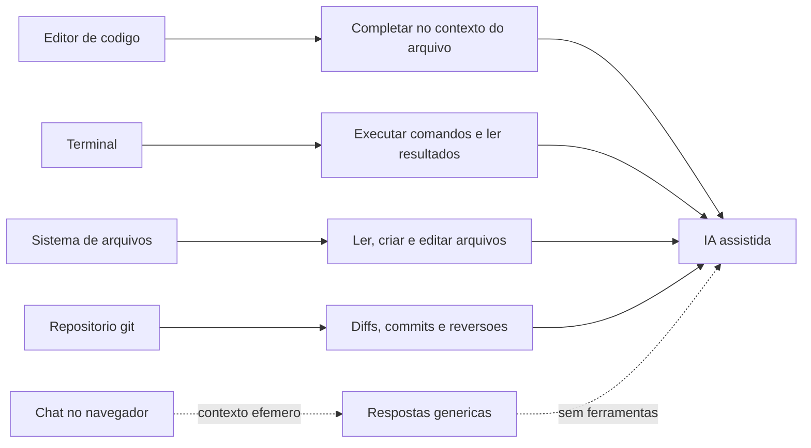

## 4. Técnica

### Montando o território: um projeto real do zero

Nada ensina o ecossistema como construir um projeto mínimo. Vamos criar, passo a passo, uma aplicação de exemplo — um utilitário de linha de comando em Python que conta palavras num arquivo — usando exatamente as quatro peças: editor, terminal, arquivos e git. Primeiro, a estrutura de pastas e o código, como você faria no editor:

```bash
mkdir meu-primeiro-projeto
cd meu-primeiro-projeto
```

Agora crie o arquivo principal com um editor ou com um simples redirecionamento de terminal:

```bash
cat > contador.py << 'FIM'
import sys


def contar_palavras(conteudo):
    return len(conteudo.split())


def main():
    if len(sys.argv) < 2:
        print("uso: python contador.py <arquivo>")
        return 1
    with open(sys.argv[1], encoding="utf-8") as arquivo:
        texto = arquivo.read()
    print(f"palavras: {contar_palavras(texto)}")
    return 0


if __name__ == "__main__":
    sys.exit(main())
FIM
```

Rode no terminal e veja a peça do sistema de arquivos em ação — o programa lê o arquivo, processa e devolve o resultado:

```bash
echo "o aprendizado de maquina aprende padroes dos dados" > exemplo.txt
python contador.py exemplo.txt
```

### Git: o registro de cada alteração

A quarta peça do ecossistema é o controle de versão. O git — documentado de forma canônica no livro Pro Git — registra cada estado do projeto, permitindo comparar, reverter e colaborar [12]. O fluxo mínimo que você precisa dominar tem cinco comandos:

```bash
git init
git add contador.py exemplo.txt
git commit -m "primeiro utilitario de contagem de palavras"
git status
git log --oneline
```

O que você acabou de fazer é a base de uma das capacidades mais valiosas da IA assistida: com o git, você pode pedir ao assistente para mostrar o diff de uma alteração (o que mudou, linha por linha), propor mensagens de commit consistentes e reverter mudanças ruins [17]. Sem git, o assistente trabalha às cegas; com git, ele trabalha com um registro completo do terreno [12].

### Conectando a IA ao projeto: o que o harness fará por você

Para fechar o capítulo, vamos simular — em Python puro — o serviço que o harness presta: preparar o contexto do projeto para o modelo. Quando você abre um projeto na IA assistida, algo precisa (1) listar os arquivos, (2) ler os principais, (3) montar um pacote de contexto e (4) enviar ao modelo. O código abaixo implementa esse pipeline didático:

```python
import os
import json


def listar_arquivos(diretorio):
    """Simula a leitura da estrutura de arquivos feita pelo harness."""
    achados = []
    for raiz, pastas, arquivos in os.walk(diretorio):
        pastas[:] = [p for p in pastas if not p.startswith(".") and p != "__pycache__"]
        for nome in arquivos:
            if nome.endswith((".py", ".md", ".txt")):
                achados.append(os.path.join(raiz, nome))
    return achados


def montar_contexto(diretorio, limite_caracteres=2000):
    """Simula o pacote de contexto: conteudo resumido dos arquivos principais."""
    contexto = []
    total = 0
    for caminho in listar_arquivos(diretorio):
        try:
            conteudo = open(caminho, encoding="utf-8").read()
        except OSError:
            continue
        trecho = conteudo[:limite_caracteres - total]
        contexto.append({"arquivo": caminho, "tamanho": len(conteudo), "trecho": trecho})
        total += len(trecho)
        if total >= limite_caracteres:
            break
    return contexto


contexto = montar_contexto(".")
for item in contexto:
    print(f"{item['arquivo']} ({item['tamanho']} chars)")
print(f"total de contexto: {sum(len(c['trecho']) for c in contexto)} chars")
```

Esse é, em miniatura, o trabalho invisível que o harness faz entre a Tela e a LLM — e que você vai estudar a fundo no Capítulo 5: ler a estrutura, escolher o que entra na janela, montar as instruções. A qualidade dessa montagem — não apenas o modelo — determina a qualidade da resposta, como a pesquisa sobre engenharia de contexto demonstra [8].

### Exercício de verificação: o ciclo completo

Rode o ciclo completo e verifique cada peça com um script de testes:

```python
import subprocess
import sys


def testar_territorio():
    resultado = subprocess.run(
        [sys.executable, "contador.py", "exemplo.txt"],
        capture_output=True, text=True, encoding="utf-8",
    )
    assert "palavras: 8" in resultado.stdout, resultado.stdout
    git_log = subprocess.run(
        ["git", "log", "--oneline"], capture_output=True, text=True, encoding="utf-8"
    )
    assert git_log.returncode == 0 and "primeiro utilitario" in git_log.stdout
    contexto = montar_contexto(".")
    assert any("contador.py" in item["arquivo"] for item in contexto)
    print("Territorio completo e verificado")


testar_territorio()
```

Se os testes passarem, você montou e verificou o território inteiro — editor, terminal, arquivos, git e o esboço do que o harness fará. Esse é o mesmo fluxo que os capítulos 9 e 11 vão repetir com harnesses reais e modelos gratuitos [20].

### O ciclo do projeto assistido: da ideia ao deploy

O ecossistema do desenvolvedor ganha um novo ator quando a IA entra no fluxo: o próprio ciclo de vida do projeto passa a ser uma sequência de fases assistidas. O fluxo maduro tem seis fases — planejar, especificar, implementar, testar, documentar e revisar — e cada fase tem um critério de saída objetivo antes de avançar [7][8]. O pipeline abaixo modela esse ciclo, registrando em qual fase o projeto está e o que falta para avançar — o mesmo tipo de rastreamento que os harnesses mostram no dia a dia [20]:

```python
FASES = [
    ("planejar", "objetivo e escopo definidos"),
    ("especificar", "instrucao escrita com contexto, restricoes e objetivo"),
    ("implementar", "alteracao proposta e aceita"),
    ("testar", "testes objetivos passando"),
    ("documentar", "uso documentado no projeto"),
    ("revisar", "diff revisado e commit feito"),
]


class CicloDeProjeto:
    def __init__(self):
        self.indice = 0
        self.historico = []

    def fase_atual(self):
        if self.indice >= len(FASES):
            return "concluido"
        return FASES[self.indice][0]

    def avancar(self, evidencia):
        nome, criterio = FASES[self.indice]
        if evidencia.strip():
            self.historico.append(f"{nome}: {evidencia}")
            self.indice += 1
            return f"fase '{nome}' concluida"
        return f"fase '{nome}' exige evidencia: {criterio}"

    def relatorio(self):
        return "\n".join(self.historico)


projeto = CicloDeProjeto()
print(projeto.avancar("criar um contador de palavras"))
print(projeto.avancar(""))
print(projeto.avancar("instrucao em TAREFA.md"))
print(projeto.avancar("codigo aceito apos revisar o diff"))
print(projeto.avancar("testes de assert passando"))
print(projeto.avancar("uso descrito no README"))
print(projeto.avancar("commit feito e log revisado"))
print("estado final:", projeto.fase_atual())
```

Repare na regra central do ciclo: nenhuma fase avança sem evidência — a mesma disciplina de verificação que o auditor de qualidade aplica em projetos profissionais [8]. Quando a IA assistida entra no fluxo, cada uma dessas fases pode ser apoiada pelo harness, mas o critério de saída permanece sob seu controle: é você quem define o que conta como "testado" e "revisado" [20][7]. Esse ciclo é a espinha dorsal do Capítulo 11, onde ele será executado de ponta a ponta num projeto real.

### O fluxo de equipe: branch, merge e a IA no meio

No trabalho em equipe, o território ganha uma dimensão nova: o git passa a coordenar o trabalho de várias pessoas, com branches para isolamento e merges para integração [12]. E a IA assistida entra nesse fluxo com duas contribuições práticas: propor mensagens de commit claras a partir do diff e ajudar a resolver conflitos de merge com contexto [12][17]. O fluxo mínimo que todo iniciante deve dominar antes de usar IA em equipe é este:

```bash
git checkout -b feature/filtro-por-prioridade
git add tarefas.py
git commit -m "adiciona filtro por prioridade na listagem"
git checkout main
git merge feature/filtro-por-prioridade
git log --oneline --graph
```

Cada comando tem um papel: a branch isola a mudança, o commit registra com mensagem descritiva, o merge integra e o log em grafo mostra a história visualmente [12]. Quando o harness propõe alterações, ele opera dentro desse mesmo fluxo — e saber ler a história do repositório é o que permite revisar o trabalho do agente com contexto [17]. O domínio desse fluxo, combinado ao território do capítulo, é o pré-requisito exato do Capítulo 11, onde o projeto é construído com commits em cada etapa.

## 5. Aplica

### A cena de contraste: o iniciante que vivia só no navegador

Imagine a cena. Você está no primeiro mês de um projeto de voluntariado que mantém um site de uma ONG. Acostumado ao chat no navegador, você descreve o bug para a IA: "meu site não mostra as fotos". A resposta é genérica e razoável — sugestões de HTML, CSS, caminho de imagem — e você passa a tarde colando código e nada funciona, porque nenhuma resposta considera o seu código real, a sua estrutura de pastas ou as suas dependências. Frustrado, você pergunta a um colega, que abre o terminal, roda o site, olha o console e encontra o erro em dois minutos: o nome do arquivo de imagem estava com maiúscula no HTML e minúscula no disco — um detalhe que o navegador, sem acesso ao projeto, jamais poderia diagnosticar.

O diagnóstico, ligado à teoria: você usou a ferramenta errada para o problema. O chat no navegador é ótimo para aprender conceitos e gerar esboços — mas é estruturalmente cego ao seu terreno [9][14]. A correção é o movimento que este capítulo descreve: levar a IA para dentro do ecossistema — rodar o projeto, dar acesso ao código real, usar o terminal para reproduzir o erro. Quando o assistente opera no repositório, ele enxerga o nome real do arquivo, a estrutura real de pastas e pode até executar comandos para reproduzir o bug [20][17]. O mesmo modelo, no mesmo dia, que falhou no navegador, resolve no território.

Síntese das armadilhas comuns: (1) usar o chat do navegador como ferramenta de produção — use-o para aprender, não para operar seu código; (2) ignorar o terminal — medo de linha de comando é a barreira mais comum do iniciante, e os comandos básicos são poucos; (3) trabalhar sem git — sem histórico, a IA (e você) trabalham sem memória do que mudou; (4) não estruturar o projeto — arquivos bem organizados produzem contexto bem organizado; (5) esperar que a IA adivinhe — fornecer contexto (arquivos, erros, objetivos) é a habilidade central, tema do Capítulo 10 [15][8].

## 6. Conclusão

Você fez a transição do consumidor de IA para o operador de ecossistema. Os três pontos deste capítulo: primeiro, o chat no navegador tem limites estruturais — contexto efêmero, ausência de ferramentas e ausência de memória de projeto [9][14]; segundo, o território do desenvolvedor tem quatro peças — editor, terminal, sistema de arquivos e git — e cada uma, conectada à IA, vira uma capacidade [6][13][12]; terceiro, a adoção é massiva e documentada — dos 55,8% de ganho de produtividade medidos pela Microsoft aos 92% de desenvolvedores que já usam IA segundo a GitHub [1][2].

O desafio desta etapa: refaça o exercício técnico sem olhar o código — crie o contador de palavras, faça o primeiro commit e rode o teste de verificação. Quando isso estiver fluido, você terá o terreno pronto para receber a arquitetura em 4 camadas.

No próximo capítulo, montamos o modelo que organiza tudo: a Tela, o Harness, a LLM e as Tools — as 4 camadas que explicam como a IA assistida funciona por dentro, e que serão o mapa de referência de todos os módulos seguintes.

## 7. Referências Bibliográficas

[1] PENG, Sida; KALLIAMVAKOU, Eirini; CITHON, Patrice; DEMIRER, Mert. *The Impact of AI on Developer Productivity: Evidence from GitHub Copilot*. arXiv:2302.06590, 2023.

[2] GITHUB. *Survey Reveals 92% of Developers Already Use AI Coding Tools*. San Francisco: GitHub, 2023. Disponível em: https://github.blog/2023-06-14-survey-reveals-92-of-developers-already-use-ai-coding-tools/. Acesso em: 5 ago. 2026.

[3] STACK OVERFLOW. *Developer Survey 2024*. Nova York: Stack Overflow, 2024. Disponível em: https://survey.stackoverflow.co/2024/. Acesso em: 5 ago. 2026.

[4] GARTNER. *Gartner Predicts 75% of Enterprise Software Engineers Will Use AI Code Assistants by 2028*. Stamford: Gartner, 2023. Disponível em: https://www.gartner.com/en/newsroom/press-releases/2023-10-12-gartner-predicts-75-percent-of-enterprise-software-engineers-will-use-ai-code-assistants-by-2028. Acesso em: 5 ago. 2026.

[5] STANFORD UNIVERSITY. *Artificial Intelligence Index Report 2024*. Stanford: Stanford HAI, 2024.

[6] MICROSOFT. *Visual Studio Code Documentation*. Redmond: Microsoft, 2025. Disponível em: https://code.visualstudio.com/docs. Acesso em: 5 ago. 2026.

[7] ANTHROPIC. *Building Effective Agents*. São Francisco: Anthropic, 2024. Disponível em: https://www.anthropic.com/research/building-effective-agents. Acesso em: 5 ago. 2026.

[8] ANTHROPIC. *Effective Context Engineering for AI Agents*. São Francisco: Anthropic, 2025. Disponível em: https://www.anthropic.com/research/effective-context-engineering-for-ai-agents. Acesso em: 5 ago. 2026.

[9] OPENAI. *Introducing ChatGPT*. San Francisco: OpenAI, 2022. Disponível em: https://openai.com/blog/chatgpt. Acesso em: 5 ago. 2026.

[10] KARPATHY, Andrej. *Software 2.0*. Medium, 2017. Disponível em: https://karpathy.medium.com/software-2-0-a64152b37c35. Acesso em: 5 ago. 2026.

[11] CURSOR. *Documentation*. San Francisco: Anysphere, 2025. Disponível em: https://cursor.com/docs. Acesso em: 5 ago. 2026.

[12] CHACON, Scott; STRAUB, Ben. *Pro Git*. 2. ed. Nova York: Apress, 2014.

[13] GNU PROJECT. *Bash Reference Manual*. Boston: Free Software Foundation, 2023. Disponível em: https://www.gnu.org/software/bash/manual/. Acesso em: 5 ago. 2026.

[14] LIU, Nelson; LIN, Kevin; HEWITT, John; et al. Lost in the Middle: How Language Models Use Long Contexts. *Transactions of the Association for Computational Linguistics*, v. 12, p. 157-173, 2023.

[15] HUANG, Lei; YU, Weijiang; MA, Weitao; et al. *A Survey on Hallucination in Large Language Models: Principles, Taxonomy, Challenges, and Open Questions*. arXiv:2311.05232, 2023.

[16] IBM. *What is an API?* Armonk: IBM, 2024. Disponível em: https://www.ibm.com/topics/api. Acesso em: 5 ago. 2026.

[17] MICROSOFT. *GitHub Copilot: Your AI Pair Programmer*. Redmond: Microsoft, 2025. Disponível em: https://github.com/features/copilot. Acesso em: 5 ago. 2026.

[18] SCHICK, Timo; DWIVEDI-YU, Jane; DESSI, Roberto; et al. Toolformer: Language Models Can Teach Themselves to Use Tools. *Advances in Neural Information Processing Systems*, v. 36, 2023.

[19] XI, Zhiheng; CHEN, Wenxiang; GUO, Xin; et al. *The Rise and Potential of Large Language Model Based Agents: A Survey*. arXiv:2309.07864, 2023.

[20] ANTHROPIC. *Claude Code Overview*. São Francisco: Anthropic, 2025. Disponível em: https://platform.claude.com/docs/en/claude-code/overview. Acesso em: 5 ago. 2026.

# Capítulo 5: As 4 camadas explicadas na prática: Tela, Harness, LLM e Tools

## 1. Introdução

No Capítulo 4, você conheceu o território do desenvolvedor — editor, terminal, arquivos e git — e entendeu por que a IA produtiva vive nele, e não no navegador. Agora chegamos ao coração conceitual deste livro: o modelo das 4 camadas que explica, de ponta a ponta, como funciona qualquer ferramenta de IA assistida. A Tela, o Harness, a LLM e as Tools — quatro camadas com responsabilidades distintas que, juntas, transformam uma pergunta em ação sobre o mundo real. Este é o capítulo mais importante da obra: tudo o que você aprendeu nos capítulos 1 a 3 (modelos e agentes) e no capítulo 4 (território) se organiza aqui, e tudo o que vem a seguir (harnesses, configuração, projetos) parte deste mapa.

Ao final deste capítulo, você será capaz de desenhar o fluxo completo de uma interação — o que acontece entre digitar um pedido na Tela e ver o resultado — nomeando o papel de cada camada; entender por que a separação entre "cérebro" (LLM) e "braços" (Tools) é a chave do controle; e reconhecer que todo harness do mercado, gratuito ou pago, implementa essas mesmas 4 camadas.

## 2. Explica

### A Tela: onde o usuário digita e visualiza

A primeira camada é a Tela — a interface por onde você, usuário, fala com o sistema e vê os resultados. Ela pode ser um editor como o VS Code com um painel de chat, um terminal com uma interface de linha de comando, uma interface web ou um aplicativo de desktop [1][6][14]. A Tela parece trivial, mas cumpre três funções que definem a experiência: captura a intenção (seu pedido, em linguagem natural ou comando), exibe o progresso (o que a IA está fazendo, quais arquivos está editando, quais comandos vai rodar) e apresenta os resultados para sua decisão — aceitar, rejeitar ou ajustar uma alteração. Uma boa Tela não apenas mostra a resposta final: mostra o processo, porque o processo é onde o humano exerce controle [20].

A Tela também é onde as regras de interação são definidas: ela informa ao Harness quais ferramentas estão disponíveis, quais são os limites de autoridade (o que a IA pode fazer sem perguntar) e como as mudanças propostas são apresentadas para aprovação [1][11]. É comum o iniciante subestimar essa camada — "é só uma caixa de texto" — mas a diferença entre uma Tela que mostra diffs lado a lado com botões de aceitar/rejeitar e uma que apenas imprime texto é a diferença entre operar um sistema e conversar com um oráculo. Nos capítulos 6 e 7, você vai comparar Telas de harnesses diferentes e ver como essa camada muda a experiência.

### O Harness: o orquestrador entre a intenção e a ação

A segunda camada é o Harness — o ambiente que orquestra todo o fluxo. É ele que lê a estrutura de arquivos do projeto, coleta as regras (arquivos de instrução como CLAUDE.md ou AGENTS.md), prepara o contexto que será enviado à LLM, gerencia a memória da sessão e decide, a cada passo, qual ferramenta chamar [1][20][3]. O Harness implementa, na prática, o loop agêntico que você estudou no Capítulo 3: recebe a intenção da Tela, raciocina com a LLM, executa ações via Tools, observa os resultados e itera até concluir [8][5]. Ele é, simultaneamente, o cérebro organizacional e o gerente de projeto da interação.

A qualidade do Harness depende de decisões de engenharia concretas: o que entra na janela de contexto (e em que ordem) [3]; como as ferramentas são descritas para o modelo (descrições claras melhoram a escolha) [2]; como a memória da sessão é compactada quando o contexto enche; e como as ações são apresentadas para aprovação humana. A pesquisa da Anthropic sobre engenharia de contexto (2025) mostrou que essas decisões afetam o resultado tanto quanto o modelo escolhido [3]. Para o Aprendiz de Construtor, a conclusão é libertadora: você não precisa trocar de modelo para melhorar resultados — precisa melhorar o Harness (contexto, ferramentas, memória), e isso está ao seu alcance.

### A LLM: o cérebro que raciocina, planeja e gera

A terceira camada é a LLM — o modelo de linguagem que você desmontou nos Capítulos 2 e 3. Sua função no sistema é raciocinar sobre o pedido, planejar os passos, gerar texto (código, explicações, comandos) e decidir quais ferramentas usar — declarando chamadas estruturadas de função [11][18]. É importante fixar o que a LLM não faz: ela não toca arquivos, não roda comandos e não acessa a internet diretamente. Ela produz texto — e é o Harness que interpreta esse texto como ações. Essa separação é a fonte do controle: como a LLM apenas propõe, o sistema pode validar, limitar e exigir aprovação antes de qualquer efeito no mundo [1][7].

Essa arquitetura explica também as falhas: quando um assistente "faz besteira", quase sempre a causa está na interação entre camadas — contexto insuficiente enviado pelo Harness, ferramenta mal descrita, ou autoridade mal configurada — e não num "capricho" do modelo [15][3]. Entender isso muda a forma como você depura problemas de IA: em vez de culpar o modelo, você examina o fluxo completo — o que entrou no contexto, qual ferramenta foi chamada, qual autoridade estava configurada. Esse método de diagnóstico por camada será uma ferramenta valiosa nos capítulos 9 e 11.

### As Tools: os braços que executam no mundo

A quarta camada é o conjunto de ferramentas (Tools) que o Harness disponibiliza à LLM — os "braços" do sistema. Cada ferramenta é uma função com nome, descrição e parâmetros, que o modelo pode chamar de forma estruturada [11]. O catálogo típico inclui: leitura e escrita de arquivos; execução de comandos no terminal; busca na web; execução de código (com sandbox); consultas a APIs externas; e operações de git [1][2][20]. A Anthropic publicou em 2025 o guia "Writing Effective Tools", que sistematiza o design dessas ferramentas: descrições precisas, validação de entrada e saída, e escopo mínimo [2]. O Model Context Protocol (MCP), lançado pela Anthropic em 2024, padronizou a integração de ferramentas externas, permitindo que um mesmo harness conecte ferramentas de qualquer provedor [4].

A lista de ferramentas define o que o agente pode fazer — e o que ele não pode. Esse é o ponto de controle mais importante para segurança: com menos privilégio configurado nas Tools, menos dano possível [7]. É por isso que os harnesses modernos apresentam as ações para aprovação e permitem negar comandos específicos [5][20]. No Capítulo 12, você vai aprofundar esse tema; por ora, fixe o princípio: a LLM propõe, as Tools executam, e a configuração das Tools — com o Harness — é a fronteira da autoridade do sistema.

## 3. Ilustra

Pense num restaurante moderno com um chef renomado, mas uma regra rígida: o chef nunca sai da cozinha e nunca toca nos ingredientes — ele só escreve as ordens. O sistema funciona assim: você chega (Tela), faz o pedido e senta na mesa onde verá o progresso. O maître (Harness) anota seu pedido, consulta a ficha do dia (contexto: o que há na despensa, as regras do chef, os pedidos anteriores), e leva o pedido para a cozinha. O chef (LLM) raciocina sobre o pedido e escreve ordens detalhadas: "peça ao auxiliar uma panela, ao fornecedor o peixe fresco, ao padeiro o pão". Os auxiliares (Tools) executam cada ordem — um vai à despensa, outro ao mercado, outro ao forno — e trazem os resultados de volta ao maître, que os mostra ao chef, que ajusta a próxima ordem. O prato só sai da cozinha com a sua aprovação (supervisão humana na Tela).

Como Aprendiz de Construtor, você reconhece nessa cena exatamente as 4 camadas: a Tela é a mesa do restaurante; o Harness é o maître que orquestra; a LLM é o chef que raciocina e planeja; as Tools são os auxiliares que executam. E a regra de ouro do restaurante — o chef nunca toca nos ingredientes — é a regra de ouro da arquitetura: o modelo nunca age diretamente; ele propõe, e o sistema executa [1][11]. O diagrama abaixo materializa o fluxo completo de uma interação pelas 4 camadas.

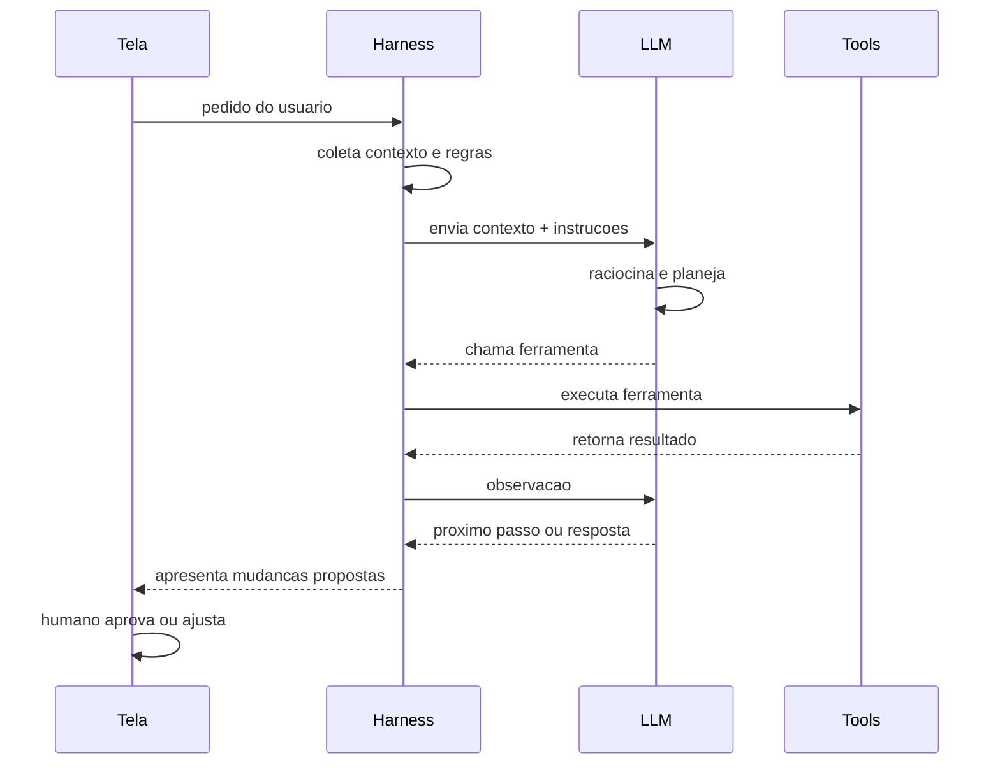

## 4. Técnica

### A arquitetura em 4 camadas em código: um harness em miniatura

A melhor forma de fixar as 4 camadas é construí-las. Vamos implementar um mini-harness em Python puro com as quatro camadas separadas: a Tela (função de entrada/saída), o Harness (orquestrador), a LLM (simulada por regras didáticas) e as Tools (funções reais). Esse esqueleto é a mesma arquitetura dos harnesses comerciais, sem a sofisticação [1][20].

```python
# CAMADA 4 - TOOLS: os bracos que executam no mundo
def tool_listar_arquivos(pasta="."):
    import os
    return sorted(nome for nome in os.listdir(pasta) if not nome.startswith("."))


def tool_ler_arquivo(caminho):
    try:
        with open(caminho, encoding="utf-8") as arquivo:
            return arquivo.read()
    except OSError as erro:
        return f"erro: {erro}"


def tool_calcular(expressao):
    partes = expressao.split()
    if len(partes) == 3 and partes[1] in ("+", "-", "*", "/"):
        a, op, b = float(partes[0]), partes[1], float(partes[2])
        return str({" + ": a + b, " - ": a - b, " * ": a * b, " / ": a / b if b else 0}[ " " + op + " " ])
    return "erro: expressao nao reconhecida"


# CAMADA 3 - LLM: o cerebro que raciocina e decide a acao (simulado)
def llm_raciocinar(pedido, contexto):
    if "quanto" in pedido and any(op in pedido for op in ("+", "-", "*", "/")):
        return {"tipo": "ferramenta", "nome": "calcular", "argumento": pedido}
    if "arquivo" in pedido and "liste" in pedido:
        return {"tipo": "ferramenta", "nome": "listar_arquivos", "argumento": "."}
    return {"tipo": "resposta", "texto": "nao tenho ferramenta para isso"}
```

O código acima define as Tools e o "cérebro". Agora o Harness — o orquestrador que conecta tudo — e a Tela:

```python
# CAMADA 2 - HARNESS: orquestra contexto, LLM e tools
class Harness:
    def __init__(self, llm, tools):
        self.llm = llm
        self.tools = tools
        self.memoria = []

    def preparar_contexto(self):
        return {"projeto": "exemplo", "regras": ["responda em portugues"]}

    def executar(self, pedido):
        contexto = self.preparar_contexto()
        self.memoria.append(f"usuario: {pedido}")
        decisao = self.llm(pedido, contexto)
        if decisao["tipo"] == "ferramenta":
            resultado = self.tools[decisao["nome"]](decisao["argumento"])
            self.memoria.append(f"tool: {decisao['nome']} -> {resultado}")
            return f"resultado: {resultado}"
        self.memoria.append(f"resposta: {decisao['texto']}")
        return decisao["texto"]


# CAMADA 1 - TELA: entrada e saida para o usuario
def tela_executar(harness, pedido):
    print(f"voce: {pedido}")
    resposta = harness.executar(pedido)
    print(f"harness: {resposta}")
    return resposta


ferramentas = {
    "listar_arquivos": tool_listar_arquivos,
    "ler_arquivo": tool_ler_arquivo,
    "calcular": tool_calcular,
}
harness = Harness(llm_raciocinar, ferramentas)
tela_executar(harness, "liste os arquivos do projeto")
tela_executar(harness, "quanto e 15 * 4?")
tela_executar(harness, "o que e um harness?")
```

Rode e observe as 4 camadas em ação: a Tela recebe o pedido, o Harness prepara o contexto e consulta a LLM, a LLM decide entre ferramenta e resposta, e as Tools executam de verdade. Cada decisão fica registrada na memória do Harness — exatamente o que os harnesses reais fazem [1][20].

### Preparando contexto com regras: o CLAUDE.md em miniatura

Um dos trabalhos mais importantes do Harness é injetar as regras do projeto no contexto — o papel dos arquivos de instrução como CLAUDE.md e AGENTS.md [20][5]. Vamos evoluir o mini-harness para carregar um arquivo de regras e incluí-lo no contexto enviado à "LLM":

```python
def carregar_regras(caminho="CLAUDE.md"):
    try:
        with open(caminho, encoding="utf-8") as arquivo:
            return arquivo.read()
    except OSError:
        return "(sem arquivo de regras)"


class HarnessComRegras(Harness):
    def preparar_contexto(self):
        contexto = super().preparar_contexto()
        contexto["regras_do_projeto"] = carregar_regras()
        return contexto


def llm_com_regras(pedido, contexto):
    if "regra" in pedido.lower():
        return {"tipo": "resposta", "texto": f"regras do projeto: {contexto['regras_do_projeto'][:120]}"}
    return llm_raciocinar(pedido, contexto)


harness2 = HarnessComRegras(llm_com_regras, ferramentas)
tela_executar(harness2, "quais sao as regras do projeto?")
```

Crie um arquivo `CLAUDE.md` no diretório com uma regra simples (por exemplo, "Use Python 3.12 ou superior e responda em portugues") e rode novamente — o Harness lê o arquivo e injeta a regra no contexto automaticamente. Esse mecanismo simples é o mesmo que os harnesses reais usam para fazer o assistente "conhecer" as convenções do seu projeto [20].

### Ferramentas que o modelo pode chamar: catálogo e descrição

No mundo real, o Harness descreve cada ferramenta para o modelo — nome, descrição e parâmetros — e o modelo escolhe qual chamar [2][11]. Vamos implementar esse catálogo estruturado:

```python
CATALOGO_TOOLS = [
    {
        "nome": "ler_arquivo",
        "descricao": "le o conteudo de um arquivo de texto",
        "parametros": {"caminho": "caminho relativo do arquivo"},
    },
    {
        "nome": "listar_arquivos",
        "descricao": "lista os arquivos do diretorio atual",
        "parametros": {},
    },
    {
        "nome": "calcular",
        "descricao": "resolve uma expressao aritmetica simples",
        "parametros": {"expressao": "expressao com operador e dois numeros"},
    },
]


def descrever_catalogo(catalogo):
    return "\n".join(
        f"- {item['nome']}: {item['descricao']} {item['parametros']}"
        for item in catalogo
    )


def llm_escolhendo_por_catalogo(pedido, contexto):
    print("catalogo disponivel para a LLM:")
    print(descrever_catalogo(CATALOGO_TOOLS))
    return llm_raciocinar(pedido, contexto)


harness3 = Harness(llm_escolhendo_por_catalogo, ferramentas)
tela_executar(harness3, "quanto e 8 / 2?")
```

Observe o contrato: o modelo vê apenas descrições (nunca o código da ferramenta), decide a chamada, e o Harness executa com o argumento validado [2]. É esse contrato que permite adicionar ferramentas novas — busca na web, APIs, git — sem alterar o modelo, apenas ampliando o catálogo. É também o ponto onde a segurança se aplica: se o catálogo não inclui exclusão de arquivos, o modelo não pode excluir [7].

### Validando argumentos: o contrato de segurança das ferramentas

Cada ferramenta do catálogo é um ponto de contato com o mundo — e cada ponto de contato precisa de um contrato: validar a entrada antes de executar, para que o modelo não consiga, por exemplo, ler um caminho fora do projeto ou executar uma ação com argumento malformado [2]. A boa prática documentada no guia "Writing Effective Tools" da Anthropic é desenhar ferramentas com validação rigorosa de parâmetros [2]. O código abaixo implementa uma ferramenta de leitura com contrato de validação — o mesmo mecanismo que os harnesses reais usam para impedir acesso a caminhos fora do escopo [2][7]:

```python
import os
import re


class FerramentaValidada:
    def __init__(self, raiz_permitida):
        self.raiz = os.path.abspath(raiz_permitida)

    def validar_caminho(self, caminho):
        """Rejeita caminhos fora da raiz permitida (contra traversal)."""
        if not re.match(r"^[A-Za-z0-9_./-]+$", caminho):
            raise ValueError("caminho com caracteres invalidos")
        absoluto = os.path.abspath(os.path.join(self.raiz, caminho))
        if not absoluto.startswith(self.raiz):
            raise PermissionError("acesso fora do diretorio permitido")
        return absoluto

    def ler(self, caminho):
        alvo = self.validar_caminho(caminho)
        try:
            with open(alvo, encoding="utf-8") as arquivo:
                return arquivo.read()
        except OSError as erro:
            return f"erro ao ler: {erro}"


ferramenta = FerramentaValidada(".")
for tentativa in ["notas.txt", "../segredo.txt", "../../etc/passwd"]:
    try:
        print(f"ler '{tentativa}':", ferramenta.ler(tentativa)[:40])
    except (ValueError, PermissionError) as erro:
        print(f"ler '{tentativa}': BLOQUEADO ({erro})")
```

Essa é a camada de segurança que torna o sistema confiável: não basta o modelo ser bem-intencionado — o contrato da ferramenta impede o abuso, intencional ou acidental [2]. Quando o modelo pede para ler `../segredo.txt`, a validação bloqueia antes de qualquer efeito no mundo. É exatamente esse desenho que o Capítulo 12 vai aprofundar sob o princípio do menor privilégio — e é a prova final de que, na arquitetura em 4 camadas, o controle mora na configuração das Tools e do Harness, não na vontade do modelo [7].

### O pipeline de contexto: priorizando o que entra na janela

A engenharia de contexto tem um problema prático: a janela do modelo é finita, e nem tudo cabe. A solução documentada é priorizar — montar o pacote de contexto com os elementos mais relevantes primeiro, e compactar ou descartar o resto [3][13]. O pipeline abaixo simula essa decisão, classificando fontes por prioridade e cortando quando o orçamento de tokens acaba [3]:

```python
def montar_pipeline(fontes, orcamento):
    prioridades = {"regras": 1, "arquivo_principal": 2, "dependencias": 3, "historico": 4}
    ordenadas = sorted(fontes, key=lambda f: prioridades.get(f["tipo"], 9))
    pacote = []
    usado = 0
    for fonte in ordenadas:
        if usado + fonte["tamanho"] > orcamento:
            continue
        pacote.append(fonte["nome"])
        usado += fonte["tamanho"]
    return pacote, usado


fontes = [
    {"nome": "CLAUDE.md", "tipo": "regras", "tamanho": 1200},
    {"nome": "tarefas.py", "tipo": "arquivo_principal", "tamanho": 5000},
    {"nome": "requirements.txt", "tipo": "dependencias", "tamanho": 400},
    {"nome": "logs_antigos.txt", "tipo": "historico", "tamanho": 3000},
]
pacote, usado = montar_pipeline(fontes, orcamento=6000)
print(f"entraram na janela ({usado} chars):", pacote)
```

A regra prática que o código materializa: regras primeiro, arquivo principal em seguida, dependências e histórico depois — e o que não cabe é deixado fora ou resumido [3][13]. Quando você vir um harness montando contexto na sua frente (Capítulo 9), estará assistindo exatamente esse pipeline em produção — e entender a priorização é o que permite diagnosticar por que uma resposta ignorou um arquivo que ficou de fora da janela [3].

## 5. Aplica

### A cena de contraste: diagnosticando uma falha camada por camada

Imagine a cena. Você configurou sua primeira ferramenta de IA assistida e pediu para ela "adicionar uma rota nova no arquivo principal". O assistente responde com confiança, mas o código que ele propõe não existe no projeto — parece gerado para um projeto imaginário. Seu primeiro instinto, natural, é concluir que "o modelo é ruim". Um colega mais experiente, porém, abre o log da sessão e começa o diagnóstico por camada: na camada do Harness, ele verifica o que entrou no contexto — e descobre que o arquivo de instruções do projeto não existia, e o Harness não sabia nem o nome do arquivo principal [3]. Na camada das Tools, ele confere se o assistente chegou a ler o projeto — não leu, porque a ferramenta de leitura não havia sido habilitada. Na camada da LLM, o comportamento era esperado: sem contexto e sem ferramentas, o modelo gera uma resposta genérica [15].

O diagnóstico: a falha não estava na LLM — estava na configuração do Harness (contexto incompleto) e no catálogo de Tools (leitura não habilitada). A correção: criar o arquivo de regras do projeto, habilitar as ferramentas de leitura e refazer o pedido. Agora o assistente lê o projeto real, encontra o arquivo principal e propõe uma rota que faz sentido [20]. Essa cena é o método que você levará para a vida: diante de qualquer resultado estranho da IA, percorra as camadas — Tela (o pedido foi claro?), Harness (o contexto estava completo?), Tools (as ferramentas certas estavam habilitadas?), e só então a LLM [2][3].

Síntese das armadilhas comuns na operação das 4 camadas: (1) culpar o modelo antes de examinar o contexto — a maioria das falhas é de contexto [3]; (2) não habilitar as ferramentas que a tarefa exige — um agente sem ferramenta de leitura é um consultor cego [2]; (3) dar autoridade demais nas Tools — a fronteira de permissão é a fronteira do dano [7]; (4) ignorar a Tela — aceitar mudanças sem revisar o diff anula a supervisão; (5) esquecer a memória — sessões sem histórico repetem os mesmos erros [5][17].

## 6. Conclusão

Você agora possui o mapa do livro inteiro. Os três pontos deste capítulo: primeiro, a arquitetura tem 4 camadas com responsabilidades distintas — Tela (interface), Harness (orquestração), LLM (raciocínio) e Tools (execução) [1]; segundo, a regra de ouro é a separação entre propor e executar — a LLM nunca age diretamente, o que torna o sistema controlável e auditável [11][7]; terceiro, você construiu um harness em miniatura com as 4 camadas em Python puro e viu o fluxo completo de uma interação, do pedido à aprovação [20].

O desafio desta etapa: evolua o mini-harness adicionando uma ferramenta nova ao catálogo (por exemplo, uma que conte palavras de um arquivo) e um mecanismo de aprovação na Tela — o pedido é executado somente se o "humano" confirmar. Isso exercita as duas habilidades que definem o uso profissional das 4 camadas: ampliar o catálogo e controlar a autoridade.

No próximo módulo, você vai conhecer os harnesses de verdade: o Capítulo 6 explica o que um harness faz por você — contexto, regras, memória e rastreamento — e por que ele é a peça central da produtividade assistida.

## 7. Referências Bibliográficas

[1] ANTHROPIC. *Building Effective Agents*. São Francisco: Anthropic, 2024. Disponível em: https://www.anthropic.com/research/building-effective-agents. Acesso em: 5 ago. 2026.

[2] ANTHROPIC. *Writing Effective Tools*. São Francisco: Anthropic, 2025. Disponível em: https://www.anthropic.com/research/writing-effective-tools. Acesso em: 5 ago. 2026.

[3] ANTHROPIC. *Effective Context Engineering for AI Agents*. São Francisco: Anthropic, 2025. Disponível em: https://www.anthropic.com/research/effective-context-engineering-for-ai-agents. Acesso em: 5 ago. 2026.

[4] ANTHROPIC. *Model Context Protocol: Open Standard for Connecting AI Assistants*. São Francisco: Anthropic, 2024. Disponível em: https://modelcontextprotocol.io/. Acesso em: 5 ago. 2026.

[5] ANTHROPIC. *Claude Code Overview*. São Francisco: Anthropic, 2025. Disponível em: https://platform.claude.com/docs/en/claude-code/overview. Acesso em: 5 ago. 2026.

[6] OPENCODE. *Documentation*. São Francisco: SST, 2025. Disponível em: https://opencode.ai/docs. Acesso em: 5 ago. 2026.

[7] CURSOR. *Documentation*. San Francisco: Anysphere, 2025. Disponível em: https://cursor.com/docs. Acesso em: 5 ago. 2026.

[8] YAO, Shunyu; ZHAO, Jeffrey; YU, Dian; et al. ReAct: Synergizing Reasoning and Acting in Language Models. *International Conference on Learning Representations*, 2023.

[9] SCHICK, Timo; DWIVEDI-YU, Jane; DESSI, Roberto; et al. Toolformer: Language Models Can Teach Themselves to Use Tools. *Advances in Neural Information Processing Systems*, v. 36, 2023.

[10] XI, Zhiheng; CHEN, Wenxiang; GUO, Xin; et al. *The Rise and Potential of Large Language Model Based Agents: A Survey*. arXiv:2309.07864, 2023.

[11] OPENAI. *Function Calling and Other API Updates*. San Francisco: OpenAI, 2023. Disponível em: https://openai.com/blog/function-calling-and-other-api-updates. Acesso em: 5 ago. 2026.

[12] KARPATHY, Andrej. *Software 2.0*. Medium, 2017. Disponível em: https://karpathy.medium.com/software-2-0-a64152b37c35. Acesso em: 5 ago. 2026.

[13] LIU, Nelson; LIN, Kevin; HEWITT, John; et al. Lost in the Middle: How Language Models Use Long Contexts. *Transactions of the Association for Computational Linguistics*, v. 12, p. 157-173, 2023.

[14] MICROSOFT. *Visual Studio Code Documentation*. Redmond: Microsoft, 2025. Disponível em: https://code.visualstudio.com/docs. Acesso em: 5 ago. 2026.

[15] GNU PROJECT. *Bash Reference Manual*. Boston: Free Software Foundation, 2023. Disponível em: https://www.gnu.org/software/bash/manual/. Acesso em: 5 ago. 2026.

[16] IBM. *What is an API?* Armonk: IBM, 2024. Disponível em: https://www.ibm.com/topics/api. Acesso em: 5 ago. 2026.

[17] HUANG, Lei; YU, Weijiang; MA, Weitao; et al. *A Survey on Hallucination in Large Language Models: Principles, Taxonomy, Challenges, and Open Questions*. arXiv:2311.05232, 2023.

[18] PARK, Joon Sung; O'BRIEN, Joseph; CAI, Carrie; et al. Generative Agents: Interactive Simulacra of Human Behavior. *Proceedings of the ACM Symposium on User Interface Software and Technology*, 2023.

[19] ANTHROPIC. *Introducing the Claude 3 Family*. São Francisco: Anthropic, 2024. Disponível em: https://www.anthropic.com/news/claude-3-family. Acesso em: 5 ago. 2026.

[20] FREEBUFF. *Freebuff: Ecossistema gratuito de agentes de codificação*. 2025. Disponível em: https://freebuff.com/. Acesso em: 5 ago. 2026.

# PARTE 3 — Dominando os Harnesses

# Capítulo 6: O que é um harness e por que ele é essencial

## 1. Introdução

No Capítulo 5, você montou o mapa das 4 camadas — Tela, Harness, LLM e Tools — e construiu um harness em miniatura em Python puro. Agora vamos aprofundar na camada mais estratégica do sistema: o Harness. Este capítulo responde a duas perguntas que definem o uso profissional de IA: qual é a diferença prática entre conversar com uma LLM pura e trabalhar com um harness estruturado? E o que o harness faz por você — injeção de regras de projeto, rastreamento de alterações, memória de trabalho — que justifica torná-lo a peça central do seu fluxo?

Ao final deste capítulo, você será capaz de explicar o valor do harness com um vocabulário preciso; listar os serviços concretos que ele presta (contexto, regras, memória, ferramentas, supervisão); e avaliar, de forma crítica, qualquer ferramenta de IA assistida — identificando o que é a LLM e o que é o harness por trás dela.

## 2. Explica

### LLM pura vs. harness estruturado: a diferença prática

A LLM pura é a API ou o chat: você envia um texto, recebe um texto. O harness é a camada que transforma esse intercâmbio em trabalho real sobre um projeto. A diferença não é o modelo — pode ser exatamente o mesmo — e sim o que existe ao redor dele: o harness lê a estrutura de arquivos, coleta as regras do projeto, monta o contexto, gerencia a memória da sessão, escolhe e executa ferramentas e apresenta as mudanças para sua aprovação [1][2][14]. Em termos de produto final, a diferença é a distância entre receber uma sugestão de código e receber uma alteração aplicada, testada e pronta para revisão [2].

Pense na metáfora do maître que você conheceu no Capítulo 5: a LLM é o chef, que raciocina e planeja; o harness é o maître, que organiza tudo ao redor — a ficha do dia (contexto), as ordens (ferramentas), a comunicação com o cliente (Tela). Sem o maître, o chef até daria opiniões saborosas, mas nenhum prato sairia. Os guias da indústria convergem para a mesma conclusão: agentes eficazes são construídos sobre loops bem projetados, não sobre um modelo "mais forte" [1][4]. Para o Aprendiz de Construtor, essa é a notícia mais importante da obra: a qualidade do seu fluxo depende menos do modelo que você escolhe e mais da peça que você pode configurar — o harness.

### Como o harness injeta regras de projeto e lê a estrutura de arquivos

O primeiro serviço do harness é a preparação do contexto, e dentro dela, uma função específica e poderosa: injetar as regras do projeto. Os harnesses modernos leem arquivos de instrução — como CLAUDE.md (convenção popularizada pelo Claude Code) e AGENTS.md (padrão aberto adotado por dezenas de ferramentas) — que descrevem as convenções do repositório: linguagens usadas, estrutura de pastas, comandos de teste, estilos de código, decisões arquiteturais [2][5]. Essas regras entram no contexto em cada sessão, fazendo o assistente "conhecer" o projeto mesmo em conversas novas. Sem esse mecanismo, cada sessão começaria do zero — o equivalente a contratar um estagiário novo todo dia e esperar que adivinhe as regras da casa [3].

O segundo serviço é a leitura da estrutura de arquivos: antes de responder, o harness mapeia o repositório — quais arquivos existem, onde está cada módulo, o que mudou recentemente (via git) — e usa esse mapa para decidir o que incluir no contexto e quais arquivos ler antes de propor uma alteração [16][2]. É essa capacidade que permite ao assistente editar o arquivo certo do projeto real, em vez de sugerir código para um projeto imaginário — o problema clássico do chat isolado que você estudou no Capítulo 4. A engenharia de contexto — o que entra, em que ordem, com que compressão — é hoje um campo documentado com técnicas específicas: priorizar informação relevante, resumir blocos antigos e manter os fatos críticos à mão [3].

### Rastreamento de alterações e memória de trabalho

O terceiro serviço é o rastreamento de alterações. Como o projeto vive num repositório git, o harness pode mostrar exatamente o que está propondo: um diff linha por linha, arquivos criados e modificados, e a opção de aceitar ou rejeitar cada mudança [2][14][16]. Esse ciclo de revisão é o coração da supervisão humana — o humano no loop que transforma um gerador de texto em uma ferramenta confiável de engenharia [1]. Na prática, você raramente aceita uma mudança sem olhar: você lê o diff, ajusta e só então confirma. O rastreamento também permite o retorno: se uma alteração quebra um teste, o harness reverte e tenta outro caminho, com o histórico da tentativa anterior disponível para o modelo [4].

O quarto serviço é a memória de trabalho. Ao contrário da API pura, que esquece tudo entre chamadas, o harness mantém o estado da sessão: o objetivo original, as decisões já tomadas, os arquivos já tocados e os resultados de cada passo [17]. Quando o contexto enche, ele compacta seções antigas mantendo os pontos críticos — um padrão documentado pela pesquisa de engenharia de contexto [3][13]. É essa memória que permite tarefas longas: refatorar um módulo inteiro, adicionar uma feature completa, investigar um bug que atravessa vários arquivos — sem que o assistente "esqueça" o meio do caminho [4][7]. Sem harness, você pagaria esse preço manualmente, reexplicando tudo a cada prompt — o erro clássico de quem usa chat puro para tarefas reais.

### O harness como superfície de controle e segurança

O quinto serviço, e talvez o mais importante para o uso responsável, é a superfície de controle. O harness é o ponto onde a autoridade é definida: quais ferramentas o modelo pode chamar, quais comandos exigem aprovação, quais arquivos são proibidos [1][2][15]. É ele que implementa o princípio do menor privilégio na prática — você configura o que o agente pode fazer, e qualquer ação fora disso é bloqueada ou encaminhada para sua decisão [1]. É também o harness que registra o que foi feito: logs de cada chamada de ferramenta, de cada alteração, de cada comando — criando a auditabilidade que sistemas profissionais exigem [2][14]. Quando algo der errado (e vai dar), é no harness que você procura o rastro — não na "mente" do modelo.

## 3. Ilustra

Pense num consultório médico com um sistema de prontuário digital. O médico (a LLM) tem o conhecimento — mas o sistema de prontuário (o harness) é o que torna esse conhecimento útil e seguro. Quando você chega, o sistema puxa seu histórico (memória de trabalho), consulta as diretrizes do hospital (regras de projeto), aguça os exames pedidos e já realizados (estrutura de arquivos), registra cada procedimento realizado (rastreamento de alterações) e exige sua assinatura antes de procedimentos invasivos (supervisão humana). Um médico brilhante sem prontuário atende um paciente por vez e esquece metade do histórico; um médico mediano com um bom sistema atende dezenas de pacientes com continuidade e segurança. É exatamente essa a matemática do harness: a LLM é o conhecimento, o harness é o sistema que o torna operacional [1][2].

Como Aprendiz de Construtor, você reconhece aqui o desencantamento produtivo em sua forma final: não existe "a IA" — existe um sistema de 4 camadas em que a qualidade do resultado depende da qualidade do harness tanto quanto da LLM. A caixa-preta se abriu completamente: dentro dela há um cérebro (a LLM) operando dentro de um sistema de prontuário (o harness) que você pode configurar, auditar e controlar. O diagrama abaixo mostra os cinco serviços do harness que você acabou de estudar.

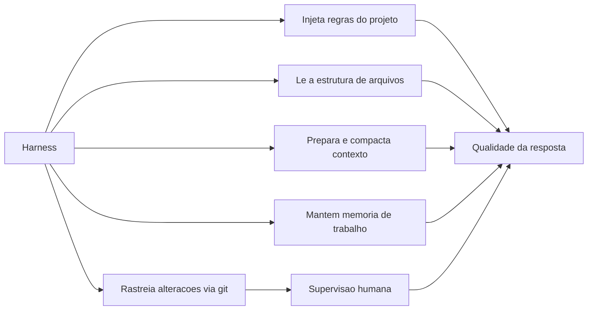

## 4. Técnica

### O harness com regras, memória e rastreamento: a versão completa

Vamos evoluir o mini-harness do Capítulo 5 até que ele implemente os cinco serviços: regras do projeto, leitura de arquivos, preparação de contexto, memória de trabalho e um rastreamento simples de alterações. O código abaixo é autocontido e rodável em Python puro [1][2][20].

```python
import hashlib
import os


class Projeto:
    """Simula o repositorio: arquivos, regras e historico de alteracoes."""

    def __init__(self, regras):
        self.regras = regras
        self.historico = []

    def lista_arquivos(self):
        return [nome for nome in os.listdir(".") if nome.endswith((".py", ".md", ".txt"))]

    def ler(self, caminho):
        try:
            return open(caminho, encoding="utf-8").read()
        except OSError:
            return ""

    def registrar_mudanca(self, descricao):
        self.historico.append(descricao)


class HarnessServicos:
    def __init__(self, projeto, modelo):
        self.projeto = projeto
        self.modelo = modelo
        self.memoria = []

    def preparar_contexto(self):
        """Servico 1 e 2: regras do projeto + estrutura de arquivos."""
        arquivos = self.projeto.lista_arquivos()
        resumo = "\n".join(f"- {a} ({len(self.projeto.ler(a))} chars)" for a in arquivos)
        return {
            "regras": self.projeto.regras,
            "estrutura": resumo,
            "memoria": list(self.memoria[-5:]),
        }

    def lembrar(self, evento):
        """Servico 4: memoria de trabalho da sessao."""
        self.memoria.append(evento)
        if len(self.memoria) > 20:
            self.memoria = self.memoria[-10:]

    def executar(self, pedido):
        contexto = self.preparar_contexto()
        self.lembrar(f"usuario: {pedido}")
        decisao = self.modelo(pedido, contexto)
        if decisao["tipo"] == "ferramenta":
            if decisao["nome"] == "ler_arquivo":
                resultado = self.projeto.ler(decisao["argumento"])
                self.projeto.registrar_mudanca(f"leitura de {decisao['argumento']}")
                self.lembrar(f"tool: {decisao['nome']}")
                return resultado
            return "ferramenta nao disponivel"
        self.lembrar(f"resposta: {decisao['texto']}")
        return decisao["texto"]


def modelo_didatico(pedido, contexto):
    """Simula a LLM: usa o contexto que o harness preparou."""
    if "regras" in pedido.lower():
        return {"tipo": "resposta", "texto": f"Regras do projeto: {contexto['regras']}"}
    if "leia" in pedido.lower() and "arquivo" in pedido:
        nome = pedido.lower().replace("leia o arquivo", "").strip()
        return {"tipo": "ferramenta", "nome": "ler_arquivo", "argumento": nome}
    return {"tipo": "resposta", "texto": f"Contexto tem {len(contexto['estrutura'])} chars de estrutura"}


projeto = Projeto(regras="responda em portugues; use python puro; rode testes antes de entregar")
harness = HarnessServicos(projeto, modelo_didatico)
print(harness.executar("quais sao as regras do projeto?"))
print(harness.executar("leia o arquivo contador.py")[:60])
print("historico do projeto:", projeto.historico)
```

Rode e observe: o harness injetou as regras, leu a estrutura, manteve memória e registrou cada ação — os cinco serviços em funcionamento. Quando você usar um harness real nos capítulos 7 e 9, estará observando exatamente essas mesmas engrenagens, com interfaces profissionais [20].

### Rastreando alterações: o diff em miniatura

O rastreamento de alterações é o que permite a supervisão humana. Vamos implementar um comparador de arquivos simples — a essência do diff que os harnesses mostram antes de você aceitar uma mudança [16]:

```python
def diff_simples(antes, depois):
    """Retorna as linhas que mudaram, no formato mais proximo de um diff real."""
    linhas_antes = antes.splitlines()
    linhas_depois = depois.splitlines()
    mudancas = []
    max_linhas = max(len(linhas_antes), len(linhas_depois))
    for i in range(max_linhas):
        antiga = linhas_antes[i] if i < len(linhas_antes) else None
        nova = linhas_depois[i] if i < len(linhas_depois) else None
        if antiga != nova:
            if antiga is not None:
                mudancas.append(f"- {antiga}")
            if nova is not None:
                mudancas.append(f"+ {nova}")
    return mudancas


antes = "def saudacao(nome):\n    return 'ola, ' + nome\n"
depois = "def saudacao(nome):\n    return f'ola, {nome}'\n"
for linha in diff_simples(antes, depois):
    print(linha)
```

Esse é o formato essencial que você verá na Tela de qualquer harness: linhas removidas e adicionadas, prontas para sua revisão. O hábito profissional — ler o diff antes de aceitar — é a supervisão humana que transforma a IA em ferramenta confiável [1][2].

### Compactando contexto: a memória que não transborda

O último serviço técnico do capítulo é a compactação de contexto — o que o harness faz quando a sessão cresce demais [3][13]. A ideia: resumir blocos antigos, mantendo os fatos críticos. Implementação didática:

```python
def compactar_memoria(memoria, limite=6):
    """Mantem os ultimos eventos e um resumo dos anteriores."""
    if len(memoria) <= limite:
        return list(memoria)
    antigos = memoria[: len(memoria) - limite]
    recentes = memoria[len(memoria) - limite :]
    resumo = f"[resumo de {len(antigos)} eventos anteriores]"
    return [resumo] + recentes


memoria = [f"evento {i}" for i in range(15)]
print("antes:", len(memoria))
memoria = compactar_memoria(memoria)
print("depois:", memoria)
```

É assim que harnesses mantêm sessões de centenas de passos dentro da janela de contexto: o modelo lê o resumo do passado e os detalhes do presente [3]. Nos harnesses reais, o resumo é gerado pelo próprio modelo — e você verá a diferença prática na qualidade de tarefas longas entre uma ferramenta que compacta e uma que simplesmente corta [13].

### O loop agêntico com critério de conclusão

Um agente profissional não itera para sempre: ele tem um critério objetivo de conclusão e um limite de iterações — o segundo protege contra o loop infinito, um dos erros clássicos de sistemas agênticos [1][4]. O loop abaixo combina as peças do capítulo: raciocínio, ação, observação, verificação do critério e limite máximo de passos [7]:

```python
class LoopAgenico:
    def __init__(self, modelo, ferramentas, max_passos=6):
        self.modelo = modelo
        self.ferramentas = ferramentas
        self.max_passos = max_passos
        self.rastro = []

    def concluido(self, observacao):
        """Criterio objetivo de conclusao: a observacao contem a resposta final."""
        return observacao.startswith("RESPOSTA:")

    def executar(self, tarefa):
        observacao = tarefa
        for passo in range(1, self.max_passos + 1):
            decisao = self.modelo(observacao)
            if decisao["tipo"] == "resposta":
                observacao = "RESPOSTA: " + decisao["texto"]
            else:
                observacao = self.ferramentas[decisao["nome"]](decisao["argumento"])
            self.rastro.append((passo, decisao["nome"], observacao[:60]))
            if self.concluido(observacao):
                return observacao, self.rastro
        return "LIMITE_ATINGIDO", self.rastro


def modelo_iterativo(observacao):
    if "RESPOSTA:" in observacao:
        return {"tipo": "resposta", "nome": "nenhuma", "argumento": "", "texto": observacao.split("RESPOSTA: ")[1]}
    if "numero" in observacao.lower():
        return {"tipo": "resposta", "nome": "nenhuma", "argumento": "", "texto": "resolvido"}
    return {"tipo": "ferramenta", "nome": "consultar", "argumento": observacao}


def tool_consultar(argumento):
    return "RESPOSTA: valor resolvido com base em " + argumento


loop = LoopAgenico(modelo_iterativo, {"consultar": tool_consultar}, max_passos=4)
resultado, rastro = loop.executar("encontre o numero")
for passo, acao, obs in rastro:
    print(f"passo {passo}: {acao} -> {obs}")
print("resultado:", resultado)
```

O rastro registrado a cada passo é o que torna o agente auditável — e o limite de passos é o que o torna seguro [1][4]. No mundo real, o harness implementa exatamente essas duas regras: critério de conclusão (o que conta como pronto) e teto de iterações (quando parar). É essa dupla que separa um agente confiável de um que roda sem parar consumindo tokens e tempo — e você vai reencontrá-la no Capítulo 11, quando depurar loops de erro no seu primeiro projeto [1][7].

### O arquivo de regras na prática: um CLAUDE.md de exemplo

A injeção de regras de projeto — o primeiro serviço do harness — depende de um artefato concreto: o arquivo de instruções. O padrão consolidado é simples: um arquivo de texto na raiz do projeto que o harness lê no início de cada sessão [2][5]. O exemplo abaixo mostra um arquivo de regras mínimo e eficaz, e o código ao lado lê e exibe as regras — o mesmo mecanismo que o harness executa automaticamente:

```markdown
# Regras do projeto

- Linguagem: Python 3.12, apenas biblioteca padrao.
- Testes: todo novo codigo deve vir com teste usando assert.
- Commits: mensagens em portugues, imperativo.
- Estrutura: logica em app/, testes em tests/.
- Respostas da IA: em portugues, codigo completo quando pedido.
```

```python
def carregar_regras_do_projeto(caminho="CLAUDE.md"):
    try:
        return open(caminho, encoding="utf-8").read()
    except OSError:
        return "(arquivo de regras nao encontrado)"


print(carregar_regras_do_projeto())
```

O valor de um bom arquivo de regras é cumulativo: cada sessão nova do harness começa com o conhecimento acumulado do projeto, e instruções boas (Capítulo 10) ficam muito mais curtas porque o contexto já está resolvido [2][5]. Para o Aprendiz de Construtor, o hábito de manter CLAUDE.md/AGENTS.md atualizado é um dos investimentos de maior retorno em produtividade assistida — o Capítulo 12 retoma o tema sob a ótica de segurança e documentação [5].

## 5. Aplica

### A cena de contraste: duas sessões, o mesmo modelo, resultados opostos

Imagine a cena. Dois colegas — Ana e Bruno — recebem a mesma tarefa: "adicione validação de e-mail ao formulário de cadastro". Ana abre um chat de API pura, cola o arquivo do formulário e pede a solução; recebe um código razoável, mas que ignora a biblioteca de validação que o projeto já usa, viola o padrão de erros do time e não tem teste. Ela passa a tarde adaptando manualmente. Bruno abre o harness do projeto: o assistente lê as regras do repositório (que mandam usar a biblioteca padrão e escrever testes), encontra o padrão de validação existente em outro arquivo, propõe a mudança num diff limpo e roda os testes antes de apresentar. Bruno revisa o diff, ajusta um detalhe e aprova em dez minutos. Mesmo modelo, mesmo pedido — resultados incomensuráveis [2][3].

O diagnóstico, ligado à teoria: a diferença não estava na LLM, e sim nos cinco serviços do harness — regras injetadas, estrutura lida, contexto preparado, memória mantida e alterações rastreadas [1][2]. Ana pagou, em tempo de adaptação manual, exatamente o trabalho que o harness faz automaticamente. A correção não é "usar um modelo melhor" — é usar um sistema completo: harness + contexto + ferramentas + supervisão. Essa cena resume a tese dos capítulos 6 e 7: no mundo profissional, o diferencial não é a LLM que você escolhe, é o harness que você opera.

Síntese das armadilhas comuns: (1) comparar LLMs sem comparar harnesses — o benchmark honesto compara sistemas completos; (2) ignorar os arquivos de regras — um projeto sem CLAUDE.md/AGENTS.md desperdiça o principal serviço do harness [2][5]; (3) aceitar mudanças sem revisar o diff — anula a supervisão e corrompe o histórico [16]; (4) reexplicar o projeto a cada prompt — sinal de que a memória de trabalho não está sendo usada; (5) dar autoridade total às ferramentas — a fronteira do controle está no harness, configure-a [1][15].

## 6. Conclusão

Você agora entende a peça que separa amadores de profissionais no uso de IA. Os três pontos deste capítulo: primeiro, a LLM pura responde, mas o harness trabalha — contexto, regras, memória, ferramentas e supervisão são os serviços que transformam o modelo em ferramenta de engenharia [1][2]; segundo, os cinco serviços são concretos e configuráveis — regras do projeto, leitura da estrutura, preparação de contexto, rastreamento de alterações e memória de trabalho [3][16][17]; terceiro, o harness é a superfície de controle — é nele que a autoridade é definida e a auditabilidade é criada [1][15].

O desafio desta etapa: adicione ao HarnessServicos do código da seção Técnica um serviço de aprovação — antes de executar uma ferramenta "destrutiva" (simule uma exclusão), o harness deve exigir confirmação explícita. Isso exercita a habilidade que define o uso profissional: configurar o controle, não apenas admirar a automação.

No próximo capítulo, você vai conhecer os harnesses que existem no mercado — comerciais e gratuitos — com um comparativo honesto de recursos, facilidade e cenários ideais para o seu perfil de iniciante.

## 7. Referências Bibliográficas

[1] ANTHROPIC. *Building Effective Agents*. São Francisco: Anthropic, 2024. Disponível em: https://www.anthropic.com/research/building-effective-agents. Acesso em: 5 ago. 2026.

[2] ANTHROPIC. *Claude Code Overview*. São Francisco: Anthropic, 2025. Disponível em: https://platform.claude.com/docs/en/claude-code/overview. Acesso em: 5 ago. 2026.

[3] ANTHROPIC. *Effective Context Engineering for AI Agents*. São Francisco: Anthropic, 2025. Disponível em: https://www.anthropic.com/research/effective-context-engineering-for-ai-agents. Acesso em: 5 ago. 2026.

[4] BISCHOF, Bryan; MILLER, Charles. *Agents and Agentic Workflows*. Sebastopol: O'Reilly Media, 2025.

[5] ANTHROPIC. *Claude Code Best Practices*. São Francisco: Anthropic, 2025. Disponível em: https://www.anthropic.com/engineering/claude-code-best-practices. Acesso em: 5 ago. 2026.

[6] OPENCODE. *Documentation*. São Francisco: SST, 2025. Disponível em: https://opencode.ai/docs. Acesso em: 5 ago. 2026.

[7] YAO, Shunyu; ZHAO, Jeffrey; YU, Dian; et al. ReAct: Synergizing Reasoning and Acting in Language Models. *International Conference on Learning Representations*, 2023.

[8] XI, Zhiheng; CHEN, Wenxiang; GUO, Xin; et al. *The Rise and Potential of Large Language Model Based Agents: A Survey*. arXiv:2309.07864, 2023.

[9] ANTHROPIC. *Model Context Protocol: Open Standard for Connecting AI Assistants*. São Francisco: Anthropic, 2024. Disponível em: https://modelcontextprotocol.io/. Acesso em: 5 ago. 2026.

[10] ANTHROPIC. *Agent Skills: Bringing Human Skills to Agents*. São Francisco: Anthropic, 2025. Disponível em: https://www.anthropic.com/engineering/agent-skills. Acesso em: 5 ago. 2026.

[11] KARPATHY, Andrej. *Software 2.0*. Medium, 2017. Disponível em: https://karpathy.medium.com/software-2-0-a64152b37c35. Acesso em: 5 ago. 2026.

[12] ANTHROPIC. *Prompt Engineering Overview*. São Francisco: Anthropic, 2025. Disponível em: https://platform.claude.com/docs/en/build-with-claude/prompt-engineering/overview. Acesso em: 5 ago. 2026.

[13] LIU, Nelson; LIN, Kevin; HEWITT, John; et al. Lost in the Middle: How Language Models Use Long Contexts. *Transactions of the Association for Computational Linguistics*, v. 12, p. 157-173, 2023.

[14] HUANG, Lei; YU, Weijiang; MA, Weitao; et al. *A Survey on Hallucination in Large Language Models: Principles, Taxonomy, Challenges, and Open Questions*. arXiv:2311.05232, 2023.

[15] ANTHROPIC. *Writing Effective Tools*. São Francisco: Anthropic, 2025. Disponível em: https://www.anthropic.com/research/writing-effective-tools. Acesso em: 5 ago. 2026.

[16] CHACON, Scott; STRAUB, Ben. *Pro Git*. 2. ed. Nova York: Apress, 2014.

[17] ANTHROPIC. *Memory Tools: Building Real Memories into Claude*. São Francisco: Anthropic, 2025. Disponível em: https://www.anthropic.com/news/memory-tools. Acesso em: 5 ago. 2026.

[18] OPENAI. *Function Calling and Other API Updates*. San Francisco: OpenAI, 2023. Disponível em: https://openai.com/blog/function-calling-and-other-api-updates. Acesso em: 5 ago. 2026.

[19] FREEBUFF. *Freebuff: Ecossistema gratuito de agentes de codificação*. 2025. Disponível em: https://freebuff.com/. Acesso em: 5 ago. 2026.

[20] CURSOR. *Documentation*. San Francisco: Anysphere, 2025. Disponível em: https://cursor.com/docs. Acesso em: 5 ago. 2026.

# Capítulo 7: Ecossistema de harnesses práticos: ferramentas comerciais e alternativas gratuitas

## 1. Introdução

No Capítulo 6, você entendeu por que o harness é a peça central da arquitetura — contexto, regras, memória, ferramentas e supervisão. Agora você vai conhecer os harnesses que existem de verdade, no mercado de 2025-2026, e aprender a escolher entre eles. A boa notícia, que sustenta a tese de custo zero deste livro, é que o ecossistema tem opções para todos os perfis: ferramentas comerciais maduras e poderosas, e alternativas gratuitas e open-source que já oferecem capacidades agênticas de primeira linha.

Ao final deste capítulo, você será capaz de comparar harnesses com critérios objetivos — recursos, facilidade de uso, custo, privacidade e cenário ideal — e escolher o ponto de partida certo para o seu perfil de iniciante. Você também entenderá por que "qual harness usar" é uma decisão de arquitetura, e não de moda.

## 2. Explica

### Os harnesses comerciais: Claude Code, Cursor e Antigravity

O harness comercial mais influente da atualidade é o Claude Code, da Anthropic: uma interface de terminal que integra profundamente com os modelos Claude, com loops de planejamento, edição multi-arquivo, gestão de git e comandos de barra [1][2]. É a referência de qualidade para tarefas longas e complexas, e o seu custo — via assinaturas Pro ou Max da Anthropic ou créditos de API — o posiciona para quem já investe no ecossistema ou precisa de máxima potência [2]. O Cursor, por sua vez, é uma IDE completa baseada em VS Code: autocomplete preditivo (Tab), chat lateral e um agente multi-arquivo (Composer), com modo de privacidade configurável e suporte a múltiplos modelos [3][20]. Seu plano Hobby gratuito, sem cartão de crédito, é uma das melhores portas de entrada comerciais para o iniciante [3].

O Antigravity, da Google, é a aposta mais nova (novembro de 2025): uma plataforma agêntica com dois modos — o Editor, para trabalho síncrono, e a superfície Manager, para orquestrar múltiplos agentes em paralelo — com agentes que operam navegador e terminal e geram artefatos visuais (planos, capturas de tela) para verificação [4]. Lançado em preview público gratuito, com limites generosos de uso, ele é uma alternativa forte para quem quer experimentar a fronteira "agent-first" sem custo inicial [4]. O trio comercial mostra o estado da arte: terminal especializado, IDE completa e plataforma agêntica — três filosofias diferentes do mesmo conceito que você estudou no Capítulo 6.

### As alternativas gratuitas e open-source: OpenCode, MiMo Code e Freebuff

No lado gratuito, o ecossistema floresceu. O OpenCode (sst/opencode) é um harness de terminal open source (licença MIT), model-agnostic, que se conecta a mais de 75 provedores de LLM via o catálogo Models.dev — incluindo modelos locais via Ollama — e suporta sessões paralelas e integração LSP nativa [5][12]. Seu diferencial é a soberania: sem retenção de código em servidores remotos, com o usuário trazendo as próprias chaves ou modelos gratuitos [5]. O MiMo Code, da Xiaomi, é um fork do OpenCode especializado em tarefas longas: memória persistente em SQLite, checkpoints automáticos e compressão dinâmica de contexto, com um canal anônimo gratuito (MiMo Auto) e compatibilidade com OpenRouter e outros provedores [6][17].

O Freebuff completa o trio gratuito com uma filosofia distinta: um ecossistema de agentes de codificação (CLI, Desktop, construtor Web e Cloud sandbox) financiado por anúncios discretos, que agrega modelos de fronteira gratuitos — como variantes de DeepSeek, MiniMax e Kimi — sem exigir chaves próprias ou cartão de crédito [19]. Para o iniciante absoluto, o Freebuff é talvez a porta mais simples: instala, abre e usa — a IA funciona sem nenhuma configuração de provedor [19]. O trio gratuito mostra que "grátis" não significa "inferior": significa soberania (OpenCode), resistência para tarefas longas (MiMo) e acessibilidade máxima (Freebuff).

### O comparativo que importa: recursos, facilidade e cenário ideal

Comparar harnesses exige critérios, e os critérios certos dependem do seu momento. Para o iniciante, a facilidade de configuração pesa mais do que a potência máxima: um harness que você usa de verdade vale mais do que um que você abandona na primeira barreira [3][19]. O custo é o segundo critério: hoje é possível operar um fluxo completo — harness gratuito + modelos gratuitos — por zero reais, como você verá nos capítulos 8 e 9 [5][19]. A privacidade é o terceiro: ferramentas locais ou com controle de retenção se destacam para código sensível [5][3]. E o cenário ideal fecha o quadro: terminal para quem vive em linha de comando, IDE para quem prefere ambiente gráfico, e plataforma agêntica para quem quer delegar tarefas de ponta a ponta [1][4].

A indústria fornece contexto útil para a decisão: a adoção de ferramentas de IA no desenvolvimento é massiva, como os dados da Stack Overflow e da GitHub documentam [9][11], e as previsões da Gartner indicam que assistentes de código serão ubíquos [10]. Mas a decisão individual não precisa seguir a moda: ela deve seguir o seu fluxo de trabalho. Um Aprendiz de Construtor pode começar no Freebuff ou no Cursor Hobby, migrar para o OpenCode quando quiser mais controle sobre modelos, e explorar Claude Code ou Antigravity quando as tarefas exigirem potência máxima [1][4][19].

## 3. Ilustra

Pense na escolha de um carro para aprender a dirigir. O Cursor é o carro de passeio popular: fácil, confortável, com painel amigável (IDE gráfica) — perfeito para o primeiro mês, e o plano gratuito é como um test-drive sem compromisso [3]. O OpenCode é o carro com câmbio manual: menos conforto, mais controle — você escolhe o motor (modelo), a oficina (provedor) e o combustível (chaves ou modelos locais), e nada é enviado para uma "concessionária" sem seu controle [5]. O Claude Code é o carro esportivo de pista: potência máxima, mas exige pilotagem experiente e manutenção cara [1][2]. O Antigravity é o carro autônomo experimental: você define o destino e supervisiona a viagem — empolgante, mas ainda em evolução [4]. E o Freebuff é o carro compartilhado da cidade: você entra e usa, o custo é coberto por outro modelo (anúncios), e a simplicidade é o trunfo [19].

Como Aprendiz de Construtor, a lição da metáfora é a decisão por cenário, não por status: não existe "o melhor harness" — existe o harness certo para o seu momento, seu fluxo e seu bolso. O diagrama abaixo organiza o comparativo em uma matriz prática.

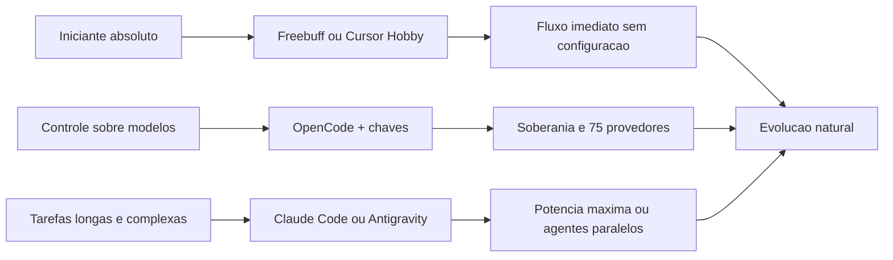

## 4. Técnica

### Avaliando harnesses com critérios: a ficha de decisão

Antes de instalar qualquer coisa, é útil ter uma ficha objetiva de avaliação. Vamos criar um script que pontua opções de harness segundo os critérios do capítulo — facilidade, custo, privacidade, recursos e cenário ideal — para que sua escolha seja uma decisão, e não um chute [1][5][19]:

```python
HARNESSES = [
    {
        "nome": "Freebuff",
        "facilidade": 10,
        "custo": 10,
        "privacidade": 6,
        "recursos": 7,
        "cenario": "iniciante absoluto, fluxo imediato",
    },
    {
        "nome": "Cursor Hobby",
        "facilidade": 9,
        "custo": 8,
        "privacidade": 7,
        "recursos": 8,
        "cenario": "quem prefere IDE grafica",
    },
    {
        "nome": "OpenCode",
        "facilidade": 6,
        "custo": 9,
        "privacidade": 9,
        "recursos": 8,
        "cenario": "controle total de modelos e dados",
    },
    {
        "nome": "Claude Code",
        "facilidade": 5,
        "custo": 3,
        "privacidade": 8,
        "recursos": 10,
        "cenario": "tarefas longas e complexas",
    },
    {
        "nome": "Antigravity",
        "facilidade": 7,
        "custo": 8,
        "privacidade": 7,
        "recursos": 9,
        "cenario": "agentes paralelos e navegador",
    },
]


def pontuar(harness, pesos):
    total = sum(harness[criterio] * peso for criterio, peso in pesos.items())
    return round(total / sum(pesos.values()), 1)


pesos_iniciante = {"facilidade": 3, "custo": 3, "privacidade": 1, "recursos": 1}
ranking = sorted(
    HARNESSES,
    key=lambda h: pontuar(h, pesos_iniciante),
    reverse=True,
)
for i, harness in enumerate(ranking, 1):
    print(f"{i}. {harness['nome']}: {pontuar(harness, pesos_iniciante)} "
          f"({harness['cenario']})")
```

Altere os pesos conforme o seu perfil — se você valoriza privacidade, aumente o peso dela; se quer potência máxima, priorize recursos — e observe o ranking mudar. Essa é a forma madura de escolher: critérios explícitos, pontuação, revisão [1][5].

### Instalando o caminho do custo zero: OpenCode + Ollama em 6 comandos

O caminho do custo zero que o livro defende — harness gratuito + modelo local — começa com a instalação do OpenCode e do Ollama. O fluxo completo será detalhado no Capítulo 9; aqui está o esqueleto que você pode executar para sentir o ecossistema [5][13]:

```bash
curl -fsSL https://ollama.com/install.sh | sh
ollama pull qwen2.5-coder:7b
curl -fsSL https://opencode.ai/install | bash
opencode auth login --ollama
opencode run "liste os arquivos deste projeto"
```

Cada comando tem um papel no fluxo: o primeiro instala o motor local de modelos [13]; o segundo baixa um modelo de código aberto otimizado para programação [14]; o terceiro instala o harness gratuito [5]; o quarto conecta o harness ao motor local [5]; e o quinto abre a primeira sessão — a LLM local respondendo dentro do harness, sem nenhuma nuvem. Se o modelo local for lento no seu hardware, o Capítulo 8 mostra a alternativa via provedores na nuvem com chaves gratuitas [5][13].

### Comparando o mesmo pedido em dois harnesses: o teste do contexto

Um teste revelador para comparar harnesses é usar o mesmo pedido em dois deles e observar o comportamento. Antes de ter ambos instalados, você pode simular o que diferencia a experiência — o harness que injeta contexto de projeto versus o que não injeta — com o código abaixo, que estende o mini-harness do Capítulo 6 [2][3]:

```python
def resposta_sem_contexto(pedido):
    return "nao conheco o projeto; sugiro algo generico"


def resposta_com_contexto(pedido, regras):
    return f"baseado nas regras ({regras[:40]}), sugiro algo alinhado ao projeto"


regras_do_projeto = "usar a biblioteca padrao; escrever testes antes de entregar"
pedido = "adicione validacao de e-mail ao formulario"
print("sem harness (LLM pura):")
print(" ", resposta_sem_contexto(pedido))
print("com harness (regras injetadas):")
print(" ", resposta_com_contexto(pedido, regras_do_projeto))
```

O contraste didático ilustra a diferença que você medirá na prática: o harness não muda o modelo — muda o que o modelo enxerga. Quando você testar harnesses reais, use sempre o mesmo pedido e compare três dimensões: qualidade da resposta, qualidade do processo (diff, testes, logs) e facilidade de supervisão [1][2][3].

### A calculadora do fluxo gratuito: quanto custa começar

Uma das perguntas mais honestas do iniciante é: quanto custa, de verdade, manter um fluxo de IA? A resposta para o caminho deste livro é: zero reais — mas vale a pena modelar o custo para entender por que isso é verdade e quando deixa de ser [5][13]. A calculadora abaixo soma os custos de um fluxo gratuito típico: harness open source, modelo local via Ollama e provedores com tier gratuito — e compara com o custo de um fluxo pago [3][5][12]:

```python
def custo_mensal(harness, modelo, provedor, uso_tokens_milhoes):
    precos = {
        "harness_open": 0.0,
        "harness_pago": 20.0,
        "modelo_local": 0.0,
        "modelo_nuvem_gratis": 0.0,
        "modelo_nuvem_pago": 0.002 * uso_tokens_milhoes,
    }
    return round(precos[harness] + precos[modelo] + precos[provedor], 2)


fluxos = [
    ("OpenCode + Ollama local", "harness_open", "modelo_local", "provedor_gratis"),
    ("OpenCode + OpenRouter free", "harness_open", "modelo_nuvem_gratis", "provedor_gratis"),
    ("Cursor Hobby + free", "harness_open", "modelo_nuvem_gratis", "provedor_gratis"),
    ("Claude Code + API paga", "harness_pago", "modelo_nuvem_pago", "provedor_pago"),
]
for nome, h, m, p in fluxos:
    print(f"{nome:<32} US$ {custo_mensal(h, m, p, 30):>7.2f}/mes")
```

O resultado é uma lição econômica do capítulo: os três primeiros fluxos custam zero — e não são fluxos de brinquedo, são os mesmos que você vai configurar no Capítulo 9 com recursos de agente reais [5][13]. O quarto fluxo custa dinheiro porque compra potência máxima e conveniência. A leitura madura: o custo zero é real, mas tem um preço em outras moedas — tempo de configuração (OpenCode), hardware local (Ollama) ou limites de taxa (provedores free) [3][7]. Quando seu cenário mudar — mais volume, mais privacidade exigida, tarefas mais pesadas — a calculadora mostra exatamente o que está mudando e quanto isso custa [12].

### O roteiro de primeiro uso em cada harness

Para transformar a teoria em prática, um roteiro rápido de primeiro uso em cada harness do capítulo — os primeiros passos que validam a instalação e a conexão com o modelo [5][3][19]:

```bash
# Freebuff: o caminho mais simples - instala e usa
curl -fsSL https://freebuff.com/install | bash
freebuff "crie um arquivo ola.py que imprime ola mundo"

# Cursor Hobby: IDE grafica - baixe, entre com a conta, use Tab e Composer
# (sem cartao de credito no plano Hobby)

# OpenCode: controle total - instale e conecte um provedor
curl -fsSL https://opencode.ai/install | bash
opencode auth login --ollama
opencode models use ollama/qwen2.5-coder:7b
opencode "explique o que este projeto faz"
```

Cada roteiro termina com um pedido trivial que prova o funcionamento do fluxo — a mesma disciplina de validação do Capítulo 9 [4]. O roteiro completo de configuração com OpenCode e provedores gratuitos é o tema do próximo módulo; aqui, o objetivo é provar que qualquer um dos caminhos abre o mundo agêntico em poucos minutos [5][19]. Não se prenda à ferramenta da moda: escolha o roteiro mais confortável para o seu momento e evolua quando o cenário pedir [3][19].

## 5. Aplica

### A cena de contraste: a escolha por moda e a escolha por cenário

Imagine a cena. Você entra num grupo de desenvolvedores e só se fala do harness X — "é o futuro", "quem não usa está perdido". Você instala o harness X no mesmo dia, mas ele exige configurar chaves de API pagas, e a interface de terminal é intimidadora para quem está no primeiro projeto. Na primeira semana, você abre a ferramenta três vezes e desiste. Um mês depois, um amigo iniciante como você mostra um fluxo que funciona: ele usa um harness gratuito com modelos gratuitos, configurado em dez minutos, e já entregou dois projetos pequenos de verdade. A diferença não era a ferramenta "do futuro" — era o encaixe com o momento de cada um [1][5][19].

O diagnóstico ligado à teoria: a decisão por status ignora os critérios objetivos do capítulo — facilidade, custo, privacidade e cenário. O harness "do futuro" é excelente no cenário de tarefas longas e complexas, que não é o cenário de quem está começando [1]. A correção é a ficha de decisão: avaliar com pesos explícitos, escolher o ponto de entrada certo e planejar a evolução — começar simples, ganhar fluência, migrar quando o cenário mudar [3][19]. No mercado, essa disciplina separa quem constrói hábitos de quem coleciona ferramentas abandonadas.

Síntese das armadilhas comuns: (1) escolher harness por moda em vez de cenário — use a matriz de critérios; (2) pular o básico do território (Capítulo 4) — harness sem editor/terminal/git vira brinquedo; (3) desistir na primeira barreira de configuração — comece pelo caminho mais simples (Freebuff ou Cursor Hobby) [19][3]; (4) ignorar privacidade — código sensível pede ferramentas com controle de retenção [5]; (5) trocar de harness a cada hype — a fluência num harness vale mais que o "melhor" harness sem fluência.

## 6. Conclusão

Você conhece agora o mapa completo do ecossistema. Os três pontos deste capítulo: primeiro, existem três filosofias comerciais — terminal especializado (Claude Code), IDE completa (Cursor) e plataforma agêntica (Antigravity) [1][3][4]; segundo, o lado gratuito é competitivo — OpenCode (soberania), MiMo Code (tarefas longas) e Freebuff (acessibilidade máxima) [5][6][19]; terceiro, a escolha certa é por critérios e cenário, não por moda — e o caminho do custo zero é viável hoje, com harness gratuito e modelos gratuitos ou locais [5][13].

O desafio desta etapa: execute a ficha de decisão do código da seção Técnica com os seus próprios pesos — e depois instale o caminho do custo zero (OpenCode + Ollama) e rode o primeiro pedido. Se o hardware não suportar modelo local, siga para o Capítulo 8, que abre as portas da nuvem gratuita.

No próximo módulo, o segundo pilar do custo zero: os modelos. O Capítulo 8 explica APIs, provedores de roteamento e como obter chaves gratuitas; o Capítulo 9 monta o guia passo a passo completo de configuração.

## 7. Referências Bibliográficas

[1] ANTHROPIC. *Claude Code Overview*. São Francisco: Anthropic, 2025. Disponível em: https://platform.claude.com/docs/en/claude-code/overview. Acesso em: 5 ago. 2026.

[2] ANTHROPIC. *Claude Code Best Practices*. São Francisco: Anthropic, 2025. Disponível em: https://www.anthropic.com/engineering/claude-code-best-practices. Acesso em: 5 ago. 2026.

[3] CURSOR. *Pricing and Documentation*. San Francisco: Anysphere, 2025. Disponível em: https://cursor.com/pricing. Acesso em: 5 ago. 2026.

[4] GOOGLE. *Build with Google Antigravity: Our New Agentic Development Platform*. Mountain View: Google, 2025. Disponível em: https://developers.googleblog.com/build-with-google-antigravity-our-new-agentic-development-platform. Acesso em: 5 ago. 2026.

[5] OPENCODE. *Documentation*. São Francisco: SST, 2025. Disponível em: https://opencode.ai/docs. Acesso em: 5 ago. 2026.

[6] XIAOMI MIMO. *MiMo-Code: Open-Source Agentic Coding Harness*. Pequim: Xiaomi, 2025. Disponível em: https://github.com/XiaomiMiMo/MiMo-Code. Acesso em: 5 ago. 2026.

[7] ANTHROPIC. *Building Effective Agents*. São Francisco: Anthropic, 2024. Disponível em: https://www.anthropic.com/research/building-effective-agents. Acesso em: 5 ago. 2026.

[8] STACK OVERFLOW. *Developer Survey 2024*. Nova York: Stack Overflow, 2024. Disponível em: https://survey.stackoverflow.co/2024/. Acesso em: 5 ago. 2026.

[9] GARTNER. *Gartner Predicts 75% of Enterprise Software Engineers Will Use AI Code Assistants by 2028*. Stamford: Gartner, 2023. Disponível em: https://www.gartner.com/en/newsroom/press-releases/2023-10-12-gartner-predicts-75-percent-of-enterprise-software-engineers-will-use-ai-code-assistants-by-2028. Acesso em: 5 ago. 2026.

[10] GITHUB. *Survey Reveals 92% of Developers Already Use AI Coding Tools*. San Francisco: GitHub, 2023. Disponível em: https://github.blog/2023-06-14-survey-reveals-92-of-developers-already-use-ai-coding-tools/. Acesso em: 5 ago. 2026.

[11] MODELS.DEV. *Open Registry of AI Models and Providers*. São Francisco: SST, 2025. Disponível em: https://models.dev/. Acesso em: 5 ago. 2026.

[12] OLLAMA. *Ollama Documentation*. 2025. Disponível em: https://ollama.com/docs. Acesso em: 5 ago. 2026.

[13] ALIBABA. *Qwen2.5-Coder Technical Report*. Hangzhou: Alibaba, 2024. Disponível em: https://qwenlm.github.io/blog/qwen2.5-coder-family/. Acesso em: 5 ago. 2026.

[14] META. *Introducing Meta Llama 3*. Menlo Park: Meta, 2024. Disponível em: https://ai.meta.com/blog/meta-llama-3/. Acesso em: 5 ago. 2026.

[15] ANTHROPIC. *Model Context Protocol: Open Standard for Connecting AI Assistants*. São Francisco: Anthropic, 2024. Disponível em: https://modelcontextprotocol.io/. Acesso em: 5 ago. 2026.

[16] ANTHROPIC. *Effective Context Engineering for AI Agents*. São Francisco: Anthropic, 2025. Disponível em: https://www.anthropic.com/research/effective-context-engineering-for-ai-agents. Acesso em: 5 ago. 2026.

[17] XIAOMI MIMO. *MiMo-Code: Long-Horizon Agentic Coding*. Pequim: Xiaomi, 2025. Disponível em: https://mimo.xiaomi.com/blog/mimo-code-long-horizon. Acesso em: 5 ago. 2026.

[18] OPENROUTER. *OpenRouter Documentation*. 2025. Disponível em: https://openrouter.ai/docs. Acesso em: 5 ago. 2026.

[19] FREEBUFF. *Freebuff: Ecossistema gratuito de agentes de codificação*. 2025. Disponível em: https://freebuff.com/. Acesso em: 5 ago. 2026.

[20] CURSOR. *Documentation*. San Francisco: Anysphere, 2025. Disponível em: https://cursor.com/docs. Acesso em: 5 ago. 2026.

# PARTE 4 — Modelos Gratuitos e Configuração Custo Zero

# Capítulo 8: Conectando LLMs gratuitas aos seus harnesses: APIs, provedores e roteamento

## 1. Introdução

No Capítulo 7, você conheceu o ecossistema de harnesses e o caminho do custo zero. Agora vamos completar o segundo pilar desse caminho: os modelos. Este capítulo explica, em linguagem de iniciante, o que é uma API de LLM, o que são provedores de roteamento como OpenRouter e Groq, como funciona o Hugging Face e a execução local com Ollama, e — o mais importante — como obter chaves gratuitas e configurar limites de uso sem pagar nada. Ao final, você terá o cardápio completo de modelos abertos relevantes para código — Llama, DeepSeek e Qwen — e saberá exatamente onde cada um se encaixa no seu fluxo.

Ao final deste capítulo, você será capaz de explicar a diferença entre API, provedor e modelo; criar uma chave gratuita num provedor de roteamento; compreender os limites de uso (taxas por minuto e por dia); e escolher o provedor certo para o seu hardware e a sua tarefa.

## 2. Explica

### O que é uma API de LLM e o que é um provedor de roteamento

Uma API (Interface de Programação de Aplicações) é um contrato de comunicação entre programas: você envia uma requisição formatada (seu prompt, o modelo escolhido, parâmetros de geração) e recebe uma resposta estruturada (o texto gerado, ou uma chamada de ferramenta) [13]. Para uma LLM, a API é a porta de entrada: sem interface gráfica, sem navegador — apenas HTTP, o mesmo protocolo que a web usa. Os harnesses que você estudou nos capítulos 6 e 7 falam com os modelos por APIs: quando você digita um pedido, o harness monta a requisição, envia, recebe e interpreta a resposta [14][1].

Um provedor de roteamento é um intermediário que agrega muitos modelos atrás de uma única API. Em vez de criar uma conta separada para cada modelo de cada fabricante, você cria uma conta no provedor e acessa o catálogo inteiro com uma chave só [1][18]. O OpenRouter é o maior exemplo: centenas de modelos — proprietários e abertos — acessíveis por uma API, com um mecanismo dedicado de modelos gratuitos: os marcados com o sufixo `:free` e o roteador automático `openrouter/free`, que escolhe um modelo gratuito disponível que suporte as ferramentas que você precisa [1][2]. O benefício prático para o iniciante é enorme: uma chave, um painel, e a liberdade de trocar de modelo sem trocar de configuração.

### O cardápio gratuito: OpenRouter, Groq, Hugging Face e Ollama

Cada provedor gratuito tem um perfil. O OpenRouter é o cardápio amplo: rotas gratuitas para testes e desenvolvimento leve, com limites de taxa para contas sem saldo, e compatibilidade com o formato de API usado pela OpenAI — o que permite ligar em quase qualquer harness [1][2][14]. O Groq é o provedor da velocidade: usa hardware próprio (LPU) para inferência ultrarrápida, com API compatível com a OpenAI (base URL `https://api.groq.com/openai/v1`) e um tier gratuito generoso — para o Llama 3.1 8B, por exemplo, algo na ordem de dezenas de requisições por minuto, milhares de tokens por minuto e dezenas de milhares de requisições por dia [3][4]. A velocidade do Groq faz diferença perceptível no uso interativo: a resposta parece instantânea.

O Hugging Face é o hub da comunidade: além de hospedar os modelos, oferece o serviço de Inference Providers — inferência serverless com créditos mensais gratuitos para testes e uma forma unificada de acessar provedores parceiros [5][6]. Para tarefas mais pesadas, os créditos gratuitos servem como porta de entrada, e a documentação detalha os limites [6]. O Ollama é o caminho oposto: execução 100% local, sem nuvem e sem limites de taxa — o custo é o seu hardware. Ele roda em `http://localhost:11434` e serve dezenas de modelos abertos com um comando simples [7][8]. Para quem tem GPU ou Apple Silicon com boa memória unificada, o Ollama é o "custo zero absoluto": sem conta, sem chave, sem teto de requisições [7].

### Modelos abertos relevantes para código: Llama, DeepSeek e Qwen

O cardápio de modelos abertos que você vai ligar aos harnesses tem três famílias protagonistas. A família Llama, da Meta — nas versões 3.1, 3.2 e 3.3 — oferece tamanhos de 8B (leves, rodam localmente) a 70B (potentes, disponíveis via Groq e OpenRouter), com suporte a chamada de ferramentas, essencial para agentes [9][15]. A família DeepSeek — com DeepSeek-Coder, DeepSeek-V3 e o raciocinador DeepSeek-R1 — usa arquiteturas de mistura de especialistas (MoE), eficientes e competitivas com modelos proprietários em lógica e código, com versões disponíveis para rodar local ou via nuvem [10][18]. A família Qwen, da Alibaba — destacando o Qwen2.5-Coder — é otimizada para programação, com janelas de contexto longas (até 128K tokens) e bom desempenho em múltiplas linguagens e correção de bugs [11].

A regra prática para escolher: para o iniciante no caminho do custo zero, comece com um modelo leve (7B-8B) — via Ollama se o hardware aguentar, ou via Groq/OpenRouter se preferir nuvem — e suba de tamanho conforme a tarefa exigir [9][11][7]. Modelos menores respondem mais rápido e cabem em hardware modesto; modelos maiores raciocinam melhor, mas custam mais (em tempo ou em limites de taxa) [3][7]. O registro aberto Models.dev ajuda a comparar preços, contexto e recursos de cada modelo em um só lugar [12].

### Chaves gratuitas e limites de uso: o essencial de segurança

Obter uma chave gratuita é simples: você cria uma conta no provedor — no OpenRouter, no painel de chaves (API Keys), clicando em criar; no Groq, no console, na aba API Keys; no Hugging Face, em Settings, criando um token de acesso [1][3][16]. A parte que exige disciplina é o cuidado com a chave: ela é uma credencial, como uma senha — nunca deve entrar no código versionado, nos prompts ou em arquivos enviados a terceiros [13][1]. A prática padrão é colocar a chave em uma variável de ambiente (ou num arquivo local fora do git) e referenciá-la pela variável [1][14]. O Capítulo 12 aprofunda a segurança; aqui, fixe a regra de ouro: a chave é sua — ela dá acesso ao seu saldo (mesmo gratuito) e aos seus dados de uso.

Os limites de uso completam o quadro. Contas gratuitas operam com tetos — requisições por minuto (RPM), tokens por minuto (TPM) e requisições por dia (RPD) — que variam por provedor e por modelo [3]. Esses limites existem para proteger a infraestrutura e impedir abuso; para o iniciante, eles são mais do que suficientes para aprender e construir projetos reais. Quando um limite é atingido, o harness retorna um erro de taxa — e o Capítulo 9 mostra como tratar isso com retentativas e filas [1][3].

## 3. Ilustra

Pense num balcão de uma feira de alimentos orgânicos. Cada barraca é um produtor de um tipo de alimento (cada fabricante de modelo). No passado, você precisava visitar cada barraca, conhecer o dono e negociar um acordo separado (uma conta e uma chave por fabricante). O provedor de roteamento é o mercado central: um único balcão de atendimento onde você escolhe o produto de qualquer barraca — tomate orgânico, mel, queijo — paga (ou usa a degustação gratuita) e leva [1]. A API é o contrato do balcão: "peça pelo nome, receba o produto". E o Ollama é a sua própria horta em casa: você mesmo planta (baixa o modelo) e colhe sem passar pelo mercado — sem fila, sem preço, limitado apenas pelo tamanho do seu quintal (hardware) [7].

Como Aprendiz de Construtor, você reconhece a estratégia do custo zero: usar as degustações gratuitas do mercado (rotas `:free` do OpenRouter, tier gratuito do Groq) enquanto sua horta não está pronta (hardware insuficiente), e migrar para a horta quando puder [1][3][7]. O diagrama abaixo mostra as rotas possíveis entre o seu harness e os modelos.

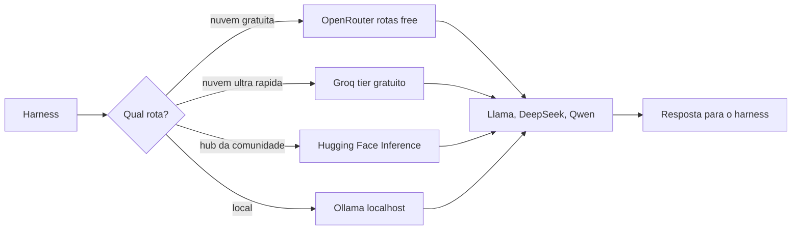

## 4. Técnica

### Falando com uma API de LLM em Python puro

Vamos ao primeiro contato técnico com uma API de LLM: uma requisição HTTP simples, sem SDK, usando apenas a biblioteca padrão do Python. O exemplo usa o formato de API compatível com a OpenAI — o mais comum entre provedores — e funciona com o OpenRouter e o Groq [1][3][14]:

```python
import json
import os
import urllib.request


def chamar_llm(prompt, base_url, api_key, modelo):
    """Envia um prompt para uma API OpenAI-compatible e devolve a resposta."""
    payload = {
        "model": modelo,
        "messages": [{"role": "user", "content": prompt}],
        "max_tokens": 200,
    }
    requisicao = urllib.request.Request(
        base_url.rstrip("/") + "/chat/completions",
        data=json.dumps(payload).encode("utf-8"),
        headers={
            "Content-Type": "application/json",
            "Authorization": f"Bearer {api_key}",
        },
        method="POST",
    )
    with urllib.request.urlopen(requisicao, timeout=60) as resposta:
        corpo = json.loads(resposta.read().decode("utf-8"))
    return corpo["choices"][0]["message"]["content"]


OPENROUTER_URL = "https://openrouter.ai/api/v1"
GROQ_URL = "https://api.groq.com/openai/v1"

# Configure as chaves como variaveis de ambiente - nunca no codigo!
chave = os.environ.get("OPENROUTER_API_KEY", "")
if chave:
    print(chamar_llm(
        "Explique em uma frase o que e um harness de IA.",
        OPENROUTER_URL, chave, "openrouter/free",
    ))
else:
    print("defina OPENROUTER_API_KEY como variavel de ambiente para testar")
```

Esse é o coração de tudo: o harness (capítulos 5 e 6) faz exatamente essa chamada — monta o payload, envia, recebe e interpreta. A diferença é que o harness automatiza contexto, ferramentas e memória ao redor dessa chamada [1][14]. Quando você configurar o harness no Capítulo 9, ele fará essa comunicação por você — mas entender a mecânica da chamada é o que permite diagnosticar falhas e escolher provedores com consciência [13].

### Descobrindo modelos gratuitos: o catálogo do OpenRouter

Antes de configurar, é útil saber o que está disponível de graça. O OpenRouter expõe o catálogo pela própria API — e modelos gratuitos aparecem com o sufixo `:free` [1][2]. O script abaixo consulta o catálogo e filtra os modelos gratuitos:

```python
import json
import urllib.request


def listar_modelos_gratuitos():
    url = "https://openrouter.ai/api/v1/models"
    with urllib.request.urlopen(url, timeout=60) as resposta:
        catalogo = json.loads(resposta.read().decode("utf-8"))
    gratuitos = []
    for modelo in catalogo.get("data", []):
        nome = modelo.get("id", "")
        preco = modelo.get("pricing", {})
        prompt = float(preco.get("prompt", "0") or 0)
        if nome.endswith(":free") or (prompt == 0.0):
            gratuitos.append(nome)
    return sorted(gratuitos)


modelos = listar_modelos_gratuitos()
print(f"encontrados {len(modelos)} modelos gratuitos")
for nome in modelos[:15]:
    print(" ", nome)
```

Rode e veja a lista real de modelos gratuitos disponíveis hoje — ela muda com o tempo, e o script é sua ferramenta para acompanhar [1][2]. Essa descoberta programática é a forma madura de navegar o ecossistema: em vez de decorar catálogos, você os consulta.

### Tratando limites de taxa: retentativas com backoff

Os limites de taxa dos provedores gratuitos exigem tratamento no código — quando a API responde com erro de limite (HTTP 429), o cliente deve esperar e tentar de novo [1][3]. A implementação abaixo mostra o padrão de retentativa com espera progressiva (backoff exponencial):

```python
import json
import time
import urllib.error
import urllib.request


def chamar_com_retentativa(prompt, base_url, api_key, modelo, max_tentativas=4):
    payload = {
        "model": modelo,
        "messages": [{"role": "user", "content": prompt}],
        "max_tokens": 150,
    }
    espera = 2
    for tentativa in range(1, max_tentativas + 1):
        try:
            requisicao = urllib.request.Request(
                base_url.rstrip("/") + "/chat/completions",
                data=json.dumps(payload).encode("utf-8"),
                headers={
                    "Content-Type": "application/json",
                    "Authorization": f"Bearer {api_key}",
                },
                method="POST",
            )
            with urllib.request.urlopen(requisicao, timeout=60) as resposta:
                corpo = json.loads(resposta.read().decode("utf-8"))
            return corpo["choices"][0]["message"]["content"]
        except urllib.error.HTTPError as erro:
            if erro.code == 429 and tentativa < max_tentativas:
                print(f"limite de taxa: aguardando {espera}s (tentativa {tentativa})")
                time.sleep(espera)
                espera *= 2
                continue
            raise
    raise RuntimeError("limite de taxa persistente")
```

Esse padrão — tentar, detectar o limite, esperar e tentar de novo com espera crescente — é exatamente o que os harnesses implementam internamente [1][3]. Entender o mecanismo evita duas reações erradas: desistir ao ver o primeiro erro, ou bombardear a API e agravar o bloqueio.

### Ollama local: o custo zero absoluto

Para completar o leque, a rota local com Ollama — sem chave, sem nuvem. Depois de instalar e baixar um modelo (comandos do Capítulo 7), a chamada é idêntica em formato, apontando para `localhost` [7][8]:

```python
import json
import urllib.request


def chamar_ollama(prompt, modelo="qwen2.5-coder:7b"):
    payload = {
        "model": modelo,
        "messages": [{"role": "user", "content": prompt}],
        "stream": False,
    }
    requisicao = urllib.request.Request(
        "http://localhost:11434/api/chat",
        data=json.dumps(payload).encode("utf-8"),
        headers={"Content-Type": "application/json"},
        method="POST",
    )
    try:
        with urllib.request.urlopen(requisicao, timeout=300) as resposta:
            corpo = json.loads(resposta.read().decode("utf-8"))
        return corpo.get("message", {}).get("content", "")
    except urllib.error.URLError:
        return "Ollama nao esta rodando: inicie com o comando 'ollama serve'"


print(chamar_ollama("Escreva uma funcao python que soma dois numeros."))
```

Observe o conforto: nenhuma chave, nenhuma conta, nenhum limite de taxa — apenas o seu hardware [7]. Essa rota é o destino final do caminho do custo zero para quem tem hardware suficiente, e a alternativa imediata para quem ainda não tem [8][11].

### Medindo o uso: o contador de tokens e requisições

Os tiers gratuitos funcionam com tetos — requisições por minuto, tokens por minuto, requisições por dia — e o iniciante que não mede o próprio uso descobre os limites na pior hora [3][1]. A disciplina profissional é medir antes de precisar: registrar os tokens de cada chamada e acumular o uso da sessão. O medidor abaixo acompanha tokens de entrada e saída a cada requisição e avisa quando o teto diário se aproxima [1][3]:

```python
class MedidorDeUso:
    def __init__(self, teto_tokens_dia=100000, teto_requisicoes_dia=500):
        self.teto_tokens = teto_tokens_dia
        self.teto_requisicoes = teto_requisicoes_dia
        self.tokens = 0
        self.requisicoes = 0

    def registrar(self, tokens_entrada, tokens_saida):
        self.tokens += tokens_entrada + tokens_saida
        self.requisicoes += 1

    def status(self):
        pct_tokens = round(100 * self.tokens / self.teto_tokens, 1)
        pct_req = round(100 * self.requisicoes / self.teto_requisicoes, 1)
        aviso = []
        if pct_tokens > 80:
            aviso.append("tokens perto do teto diario")
        if pct_req > 80:
            aviso.append("requisicoes perto do teto diario")
        return {
            "tokens": self.tokens,
            "requisicoes": self.requisicoes,
            "uso_tokens": f"{pct_tokens}%",
            "uso_requisicoes": f"{pct_req}%",
            "avisos": aviso,
        }


medidor = MedidorDeUso()
for i in range(12):
    medidor.registrar(tokens_entrada=2000 + i * 300, tokens_saida=400)
print("uso acumulado:", medidor.status())
```

O medidor cumpre o mesmo papel de um painel de consumo: transforma o limite invisível em número visível, e o número permite planejar — trocar de modelo, pausar tarefas pesadas ou migrar para a rota local [7]. No Capítulo 9, o harness exibirá esses números na própria interface; entendê-los agora significa que, quando um erro de taxa aparecer, você saberá exatamente o que ele está dizendo e o que fazer [3][1].

### Critérios para escolher um modelo de código

Com tantas opções abertas, a escolha do modelo vira uma decisão de critérios, não de reputação. As quatro dimensões que importam para o iniciante são: tamanho (modelos menores rodam local e respondem mais rápido; modelos maiores raciocinam melhor) [9][11]; contexto (janelas maiores permitem trabalhar com arquivos e projetos inteiros) [11]; suporte a ferramentas (essencial para agentes — o modelo precisa declarar chamadas de função) [9]; e custo (tiers gratuitos e consumo) [3][1]. A função abaixo pontua candidatos segundo essas dimensões com pesos ajustáveis:

```python
def pontuar_modelo(modelo, pesos):
    total = sum(modelo[dimensao] * peso for dimensao, peso in pesos.items())
    return round(total / sum(pesos.values()), 1)


candidatos = [
    {"nome": "llama3.2:3b", "tamanho": 8, "contexto": 5, "ferramentas": 6, "custo": 10},
    {"nome": "qwen2.5-coder:7b", "tamanho": 6, "contexto": 8, "ferramentas": 8, "custo": 10},
    {"nome": "llama3.1:70b", "tamanho": 4, "contexto": 8, "ferramentas": 9, "custo": 3},
    {"nome": "deepseek-r1:8b", "tamanho": 6, "contexto": 6, "ferramentas": 7, "custo": 9},
]
pesos_local = {"tamanho": 2, "contexto": 2, "ferramentas": 1, "custo": 3}
ranking = sorted(candidatos, key=lambda m: pontuar_modelo(m, pesos_local), reverse=True)
for i, modelo in enumerate(ranking, 1):
    print(f"{i}. {modelo['nome']}: {pontuar_modelo(modelo, pesos_local)}")
```

A mensagem central: a escolha certa depende do seu hardware e da sua tarefa — um modelo leve bem usado supera um modelo pesado mal configurado [9][7]. Rode o script com os seus pesos e use o resultado como ponto de partida; depois, a evidência real (velocidade, qualidade, limites) refina a decisão [3].

## 5. Aplica

### A cena de contraste: a chave vazada e o limite ignorado

Imagine a cena. Você configurou sua primeira integração com um provedor gratuito e, seguindo um tutorial preguiçoso, colou a chave de API diretamente no código — afinal, "é só um teste". Você faz commit no repositório público do curso para "mostrar o progresso". Na manhã seguinte, seu painel mostra um pico de uso estranho: alguém encontrou a chave no repositório e está usando sua cota. Sem saldo real, o dano é limitado — mas a conta foi suspensa por abuso, e você perdeu o acesso. O colega ao lado configurou a chave numa variável de ambiente, fora do git, e nunca teve o problema.

O diagnóstico, ligado à teoria: a chave é uma credencial, e credencial versionada é credencial exposta [13][1]. A correção tem três partes: (1) colocar a chave em variável de ambiente (ou arquivo local fora do git); (2) revogar e criar uma chave nova imediatamente; (3) tratar os limites de taxa com retentativas, como na seção Técnica, em vez de bombardear a API [3]. No mercado, esse episódio — comum nos primeiros meses de todo desenvolvedor — separa quem aprendeu a disciplina de quem paga o preço duas vezes: a primeira ao vazar, a segunda ao ser suspenso [1][13].

Síntese das armadilhas comuns: (1) versionar chaves — use variáveis de ambiente e `.gitignore`; (2) ignorar limites de taxa — trate o erro 429 com retentativa e backoff [3]; (3) escolher modelo pelo nome famoso em vez do caso de uso — modelo leve para tarefa leve [9][11]; (4) não testar o provedor antes de integrar — use o script de catálogo e a chamada simples da seção Técnica; (5) esquecer que "grátis" tem tetos — planeje sua tarefa dentro dos limites do tier [3].

## 6. Conclusão

O segundo pilar do custo zero está de pé. Os três pontos deste capítulo: primeiro, API é o contrato de comunicação, e provedor de roteamento é o balcão único — o OpenRouter agrega centenas de modelos, incluindo os gratuitos com sufixo `:free` [1][2]; segundo, o cardápio gratuito tem quatro perfis — roteamento amplo (OpenRouter), velocidade (Groq), hub da comunidade (Hugging Face) e execução local sem limites (Ollama) [1][3][5][7]; terceiro, as famílias abertas protagonistas são Llama, DeepSeek e Qwen — e a escolha certa segue a regra do caso de uso [9][10][11].

O desafio desta etapa: execute o script de catálogo do OpenRouter, escolha um modelo gratuito e faça a primeira chamada real com a chave que você criou — usando variável de ambiente. Se tiver hardware, baixe um modelo com Ollama e repita a chamada localmente; compare velocidade e qualidade.

No próximo capítulo, juntamos tudo: o guia passo a passo completo de configuração — do harness gratuito ao modelo gratuito, testando a comunicação Tela → Harness → LLM → Tools de ponta a ponta.

## 7. Referências Bibliográficas

[1] OPENROUTER. *OpenRouter Documentation*. 2025. Disponível em: https://openrouter.ai/docs. Acesso em: 5 ago. 2026.

[2] OPENROUTER. *Free Models Router*. 2025. Disponível em: https://openrouter.ai/docs/guides/routing/routers/free-router. Acesso em: 5 ago. 2026.

[3] GROQ. *Console Documentation — Rate Limits*. San Francisco: Groq, 2025. Disponível em: https://console.groq.com/docs/rate-limits. Acesso em: 5 ago. 2026.

[4] GROQ. *Groq Pricing*. San Francisco: Groq, 2025. Disponível em: https://groq.com/pricing. Acesso em: 5 ago. 2026.

[5] HUGGING FACE. *Inference Providers Documentation*. Nova York: Hugging Face, 2025. Disponível em: https://huggingface.co/docs/inference-providers/. Acesso em: 5 ago. 2026.

[6] HUGGING FACE. *Inference Providers — Pricing and Billing*. Nova York: Hugging Face, 2025. Disponível em: https://huggingface.co/docs/inference-providers/en/pricing. Acesso em: 5 ago. 2026.

[7] OLLAMA. *Ollama Documentation*. 2025. Disponível em: https://ollama.com/docs. Acesso em: 5 ago. 2026.

[8] OLLAMA. *Ollama Library*. 2025. Disponível em: https://ollama.com/library. Acesso em: 5 ago. 2026.

[9] META. *Introducing Meta Llama 3*. Menlo Park: Meta, 2024. Disponível em: https://ai.meta.com/blog/meta-llama-3/. Acesso em: 5 ago. 2026.

[10] DEEPSEEK. *DeepSeek-R1: Incentivizing Reasoning Capability in LLMs*. Hangzhou: DeepSeek, 2025. Disponível em: https://github.com/deepseek-ai/DeepSeek-R1. Acesso em: 5 ago. 2026.

[11] ALIBABA. *Qwen2.5-Coder Technical Report*. Hangzhou: Alibaba, 2024. Disponível em: https://qwenlm.github.io/blog/qwen2.5-coder-family/. Acesso em: 5 ago. 2026.

[12] MODELS.DEV. *Open Registry of AI Models and Providers*. São Francisco: SST, 2025. Disponível em: https://models.dev/. Acesso em: 5 ago. 2026.

[13] IBM. *What is an API?* Armonk: IBM, 2024. Disponível em: https://www.ibm.com/topics/api. Acesso em: 5 ago. 2026.

[14] OPENAI. *API Reference*. San Francisco: OpenAI, 2025. Disponível em: https://platform.openai.com/docs/api-reference. Acesso em: 5 ago. 2026.

[15] META. *Llama 3.3: A Multilingual, Instruction-Tuned Model*. Menlo Park: Meta, 2024. Disponível em: https://ai.meta.com/blog/llama-3-3/. Acesso em: 5 ago. 2026.

[16] HUGGING FACE. *Access Tokens Documentation*. Nova York: Hugging Face, 2025. Disponível em: https://huggingface.co/docs/hub/en/security-tokens. Acesso em: 5 ago. 2026.

[17] OPENROUTER. *OpenRouter Models Catalog*. 2025. Disponível em: https://openrouter.ai/models. Acesso em: 5 ago. 2026.

[18] DEEPSEEK. *DeepSeek-Coder-V2: Breaking the Barrier of Closed-Source Models in Code Intelligence*. Hangzhou: DeepSeek, 2024. Disponível em: https://github.com/deepseek-ai/DeepSeek-Coder-V2. Acesso em: 5 ago. 2026.

[19] ANTHROPIC. *API Overview*. São Francisco: Anthropic, 2025. Disponível em: https://platform.claude.com/docs/en/api/overview. Acesso em: 5 ago. 2026.

[20] FREEBUFF. *Freebuff: Ecossistema gratuito de agentes de codificação*. 2025. Disponível em: https://freebuff.com/. Acesso em: 5 ago. 2026.

# Capítulo 9: Guia passo a passo de configuração: do zero ao primeiro fluxo funcionando

## 1. Introdução

Nos capítulos 7 e 8, você conheceu os harnesses e os modelos gratuitos — o cardápio. Agora chegou o momento de cozinhar: este capítulo é o guia passo a passo que instala um harness gratuito do zero, vincula modelos abertos (Llama, DeepSeek, Qwen) e testa a comunicação completa entre as 4 camadas — Tela, Harness, LLM e Tools — com um primeiro fluxo funcionando de verdade. Ao final deste capítulo, você terá o seu primeiro sistema operacional de IA assistida, pronto para os projetos dos capítulos 10 e 11.

Ao final deste capítulo, você será capaz de instalar e configurar um harness gratuito; conectar um provedor gratuito (ou execução local) com uma chave protegida; e verificar, com um teste objetivo, que as 4 camadas conversam entre si. O caminho é longo o suficiente para ser real, e curto o suficiente para ser concluído numa tarde.

## 2. Explica

### O plano da configuração: 4 camadas, 4 passos

A configuração de qualquer fluxo de IA assistida segue o mapa das 4 camadas do Capítulo 5, e cada camada tem um passo de configuração correspondente. A Tela (passo 1): escolher onde você vai digitar e ver resultados — terminal, IDE ou interface web. O Harness (passo 2): instalar e configurar o orquestrador — no nosso caminho, o OpenCode, gratuito e open source, ou o Freebuff, que dispensa configuração [1][5]. A LLM (passo 3): conectar o modelo — via provedor gratuito na nuvem (OpenRouter ou Groq) ou execução local (Ollama) [2][3][6]. As Tools (passo 4): habilitar e verificar as ferramentas — leitura de arquivos, terminal, execução de código — que o harness expõe ao modelo [4][7].

A ordem importa: primeiro o terreno (capítulo 4 — editor, git, arquivos), depois o harness, depois o modelo, por último o teste de integração [1][4]. Cada passo tem um critério de sucesso objetivo: se o passo não passa, não avance — essa disciplina de verificação evita as frustrações clássicas do iniciante, em que "instalei tudo mas não funciona" esconde um passo intermediário que nunca foi validado [4]. É o mesmo método de evidência que você usará na auditoria dos seus projetos no Capítulo 11.

### O que o harness precisa saber: credenciais, base URL e modelo

Ao conectar uma LLM a um harness, existem três informações que o harness precisa receber, e entender cada uma elimina metade dos erros de configuração. A primeira é a credencial: a chave de API do provedor, que o harness envia no cabeçalho da requisição (o padrão `Authorization: Bearer <chave>`) [2][8]. A segunda é a base URL: o endereço do provedor — por exemplo, `https://openrouter.ai/api/v1` ou `https://api.groq.com/openai/v1` — que define para onde as requisições vão [2][3]. A terceira é o nome do modelo: o identificador exato no catálogo do provedor, como `qwen2.5-coder:7b` no Ollama ou um modelo com sufixo `:free` no OpenRouter [2][6][7].

Os harnesses modernos simplificam parte desse trabalho: muitos têm provedores nativos (Ollama, OpenRouter, Groq) — você escolhe o provedor, e o harness preenche a base URL sozinho [1][4]. Mas quando o provedor não está na lista (ou você quer um modelo específico), é a configuração manual dessas três informações que faz a diferença — e é exatamente o que este capítulo ensina, com o padrão "OpenAI-compatible" que quase todos os provedores seguem [2][8]. O registro aberto Models.dev agrega essas informações por modelo, simplificando a consulta [9].

### Vinculando modelos abertos: Llama, DeepSeek e Qwen na prática

Os modelos abertos do capítulo 8 — Llama, DeepSeek e Qwen — se vinculam aos harnesses por duas vias. A via local: com Ollama, você baixa o modelo com `ollama pull` e o nome fica disponível para o harness — `llama3.2:3b`, `deepseek-r1:8b`, `qwen2.5-coder:7b` [6][7]. A via nuvem: pelo provedor de roteamento, o mesmo modelo aparece com um nome de catálogo — e versões gratuitas carregam o sufixo `:free` [2]. A escolha entre as vias depende do seu hardware e da sua preferência de privacidade: local para quem tem máquina capaz e quer zero dependência externa; nuvem para quem quer velocidade e não quer ocupar o próprio disco [2][6][7].

Uma diferença prática importante: modelos de raciocínio, como o DeepSeek-R1, gastam tokens pensando antes de responder — o que conta contra os limites de taxa dos tiers gratuitos mais rápido do que modelos diretos [10][2]. Para o iniciante, a recomendação é começar com um modelo de código leve e direto (Qwen2.5-Coder ou Llama 3.1 8B) e explorar modelos de raciocínio depois, quando o fluxo estiver estável [7][11]. A regra do caso de uso do Capítulo 8 vale aqui: modelo leve para tarefa leve, e o custo — tempo, tokens, hardware — é parte da escolha [9][11].

### O teste final: a comunicação entre as 4 camadas

A configuração termina com um teste de integração: provar que as 4 camadas conversam. O teste tem três níveis. Nível 1, a LLM responde: uma chamada direta ao modelo (como a do Capítulo 8) devolve texto — prova que chave, base URL e modelo estão corretos [2]. Nível 2, o harness conversa com a LLM: um pedido simples dentro do harness devolve resposta — prova que a Tela, o Harness e a LLM estão conectados [1][4]. Nível 3, as ferramentas funcionam: um pedido que exige leitura de arquivo ou execução de código devolve um resultado baseado no seu projeto — prova que as Tools estão habilitadas e que o fluxo completo está operacional [4][7]. O restante deste capítulo executa exatamente esses três níveis, com comandos prontos para copiar.

## 3. Ilustra

Pense na inauguração de um pequeno restaurante. Você contratou o chef (a LLM), montou a cozinha (o harness), contratou os auxiliares (as tools) e abriu o salão (a tela). Antes de abrir as portas, você faz o teste de fogo: pede ao chef um prato simples (nível 1), vê o maître anotar e a cozinha responder (nível 2), e pede um prato que exige o forno e a geladeira — verifica que os auxiliares realmente executam (nível 3). Só então você abre o restaurante. É exatamente essa a sequência do capítulo: configurar camada por camada e validar cada nível antes de avançar — porque um restaurante que abre sem o teste de fogo descobre os problemas com a casa cheia [1][4].

Como Aprendiz de Construtor, você está prestes a fazer a sua primeira inauguração: um sistema completo de IA assistida, gratuito, que responde às suas ordens e executa ferramentas no seu projeto. O diagrama abaixo mostra o fluxo de configuração com os critérios de sucesso de cada passo.

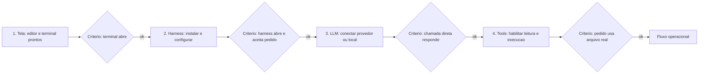

## 4. Técnica

### Passo 1 e 2: o terreno e o harness gratuito

O terreno (capítulo 4) já deve estar pronto: Python instalado, um editor e o git funcionando. O passo 2 é instalar o harness gratuito — o OpenCode, open source e model-agnostic [1][5]. Os comandos abaixo fazem a instalação e a primeira abertura:

```bash
# Passo 2: instalar o harness gratuito (OpenCode)
curl -fsSL https://opencode.ai/install | bash
opencode --version

# Criar um projeto de teste e abrir o harness nele
mkdir -p meu-fluxo && cd meu-fluxo
git init
opencode
```

O critério de sucesso deste passo: o comando `opencode --version` imprime uma versão, e o harness abre uma sessão interativa na pasta do projeto [5]. Se o comando de instalação falhar, verifique as pré-condições do terreno (curl instalado, rede disponível, permissões) — e só avance quando o critério passar [4]. Alternativa zero-configuração: se preferir, instale o Freebuff e abra uma sessão sem configurar provedor nenhum — o modelo já vem agregado [12].

### Passo 3: conectar a LLM — nuvem gratuita ou local

Agora a conexão do modelo. Há duas vias; escolha conforme o seu hardware. Via nuvem gratuita — criar a chave no OpenRouter (ou Groq) e registrar no harness como variável de ambiente [2][3]:

```bash
# Nuvem gratuita: criar a chave no painel do provedor e exportar como variavel
export OPENROUTER_API_KEY="sua-chave-aqui"
opencode auth login --openrouter
opencode models use openrouter/free
```

Via local — baixar um modelo com Ollama e apontar o harness para ele [6][7]:

```bash
# Local: baixar o modelo e conectar o harness ao Ollama
ollama pull qwen2.5-coder:7b
opencode auth login --ollama
opencode models use ollama/qwen2.5-coder:7b
```

O critério de sucesso deste passo, antes de seguir, é o nível 1 do teste de integração — a chamada direta responde. Rode o script de chamada simples do Capítulo 8 com a mesma chave, ou teste pelo próprio harness com um pedido trivial:

```bash
opencode run "responda apenas com a palavra funcionando"
```

Se a resposta vier, a LLM está conectada [1][2]. Erros comuns e seus significados: `401` é chave inválida; `404` é base URL ou modelo com nome errado; `429` é limite de taxa — trate com retentativa ou troque de modelo [2][3].

### Passo 4: habilitar e verificar as ferramentas

Com a LLM conectada, o passo final é verificar as Tools. O teste do nível 3: um pedido que exige ferramentas reais — ler um arquivo do projeto e transformá-lo. Crie um arquivo de exemplo e peça ao harness para trabalhar sobre ele:

```bash
cat > notas.txt << 'FIM'
Este projeto testa a comunicacao entre as 4 camadas.
FIM

opencode run "leia notas.txt e me diga quantas palavras ele tem"
```

O critério de sucesso: o harness lê o arquivo real e responde com a contagem correta — prova de que a Tela, o Harness, a LLM e a Tools estão conversando [4][7]. Se o harness responder "não consigo ler arquivos", as permissões de ferramenta estão bloqueadas na configuração — revise as permissões do harness antes de avançar [1][4]. Esse é o momento da inauguração: as 4 camadas estão operacionais.

### O teste de integração automatizado: provando as 4 camadas

Para fechar com método, vamos automatizar o teste de integração em Python — o mesmo espírito do teste de fogo do restaurante, mas executado por script [4]:

```python
import os
import subprocess
import sys


def testar_camada_llm():
    """Nivel 1: a LLM responde (chamada via harness em modo nao interativo)."""
    resultado = subprocess.run(
        ["opencode", "run", "responda apenas com a palavra funcionando"],
        capture_output=True, text=True, encoding="utf-8", timeout=120,
    )
    return resultado.returncode == 0 and "funcionando" in resultado.stdout.lower()


def testar_camada_tools():
    """Nivel 3: as ferramentas leem o arquivo real do projeto."""
    with open("prova.txt", "w", encoding="utf-8") as arquivo:
        arquivo.write("quatro palavras aqui dentro")
    resultado = subprocess.run(
        ["opencode", "run", "leia prova.txt e conte as palavras"],
        capture_output=True, text=True, encoding="utf-8", timeout=180,
    )
    return "4" in resultado.stdout or "quatro" in resultado.stdout.lower()


def principal():
    erros = []
    if not testar_camada_llm():
        erros.append("LLM nao respondeu - verifique chave, base URL e modelo")
    if not testar_camada_tools():
        erros.append("Tools nao leram o arquivo - verifique permissoes do harness")
    if erros:
        for erro in erros:
            print(f"FALHA: {erro}")
        return 1
    print("OK: as 4 camadas estao comunicando")
    return 0


if __name__ == "__main__":
    sys.exit(principal())
```

Rode esse script e guarde o resultado: ele é a sua prova objetiva de que o sistema está configurado — e será a base do primeiro projeto do Capítulo 11 [4][7]. Quando algo falhar, o erro nomeia a camada suspeita: LLM (chave/modelo) ou Tools (permissões) — o diagnóstico por camada que você aprendeu no Capítulo 5.

### O healthcheck do fluxo: um comando para verificar tudo

Depois de configurar as 4 camadas, você precisa de uma rotina de verificação que prove, em um único comando, que o sistema continua saudável — o equivalente ao "checklist do piloto" antes de decolar [1][4]. O healthcheck abaixo junta as três verificações do capítulo: o harness abre, a LLM responde e as ferramentas leem arquivos reais — com saída clara de aprovação ou reprovação [4][2]:

```python
import subprocess
import sys


def verificar(descricao, funcao):
    try:
        ok, detalhe = funcao()
    except Exception as erro:  # noqa: BLE001
        return False, f"excecao: {erro}"
    return ok, detalhe


def checa_harness():
    resultado = subprocess.run(
        ["opencode", "--version"], capture_output=True, text=True, encoding="utf-8"
    )
    return resultado.returncode == 0, resultado.stdout.strip()[:40]


def checa_llm():
    resultado = subprocess.run(
        ["opencode", "run", "responda apenas com a palavra ok"],
        capture_output=True, text=True, encoding="utf-8", timeout=120,
    )
    return resultado.returncode == 0, resultado.stdout.strip()[:40]


def checa_tools():
    with open("health.txt", "w", encoding="utf-8") as arquivo:
        arquivo.write("saudavel")
    resultado = subprocess.run(
        ["opencode", "run", "leia health.txt e diga o que contem"],
        capture_output=True, text=True, encoding="utf-8", timeout=180,
    )
    return "saudavel" in resultado.stdout.lower(), resultado.stdout.strip()[:40]


CHECAGENS = [
    ("harness instalado", checa_harness),
    ("LLM respondendo", checa_llm),
    ("ferramentas operando", checa_tools),
]


def healthcheck():
    falhas = []
    for nome, funcao in CHECAGENS:
        ok, detalhe = verificar(nome, funcao)
        status = "OK " if ok else "FALHA"
        print(f"[{status}] {nome}: {detalhe}")
        if not ok:
            falhas.append(nome)
    if falhas:
        print(f"healthcheck REPROVADO: {', '.join(falhas)}")
        return 1
    print("healthcheck APROVADO: as 4 camadas estao saudaveis")
    return 0


if __name__ == "__main__":
    sys.exit(healthcheck())
```

O healthcheck é a ponte entre a configuração e o uso contínuo: ele transforma "acho que está funcionando" em "está funcionando, verificado agora" [4]. Rode-o no início de cada sessão de trabalho — ou sempre que algo parecer estranho — e ele nomeia a camada com problema antes que você perca tempo caçando [2][4]. Esse hábito simples é a diferença entre operar o sistema e acreditar que o opera.

### Variáveis de ambiente: o padrão que protege suas chaves

A configuração do fluxo depende de um detalhe de organização que protege suas credenciais: as variáveis de ambiente. Em vez de digitar a chave em cada comando ou gravá-la no código, você a define uma vez e o harness a lê do ambiente [2][8]. O padrão profissional combina três peças: a variável exportada na sessão, um arquivo local fora do git (`.env`) e a entrada no `.gitignore` para nunca versionar o arquivo [2][14]:

```bash
# 1. Exportar na sessao atual
set -a; source .env; set +a

# 2. Conteudo do .env (NUNCA versionar este arquivo)
# OPENROUTER_API_KEY=sk-...
# GROQ_API_KEY=gsk-...

# 3. .gitignore - protege o arquivo de segredos
# .env
# *.key
```

```python
import os


def obter_chave(nome):
    chave = os.environ.get(nome, "")
    if not chave:
        print(f"atencao: {nome} nao definida no ambiente")
    return chave


print("chave definida:", bool(obter_chave("OPENROUTER_API_KEY")))
```

Esse padrão resolve dois problemas de uma vez: a chave fica disponível para o harness sem aparecer no código, e fica fora do git por construção [2][14]. A disciplina é a mesma do Capítulo 8, agora incorporada ao fluxo: credencial fora do código, variável no ambiente, arquivo protegido — e o detector do Capítulo 12 confirma a higiene [14].

## 5. Aplica

### A cena de contraste: "instalei tudo, mas não funciona"

Imagine a cena. Você seguiu três tutoriais diferentes — um instalou o harness A, outro configurou o provedor B, outro sugeriu um modelo C — e agora o terminal exibe um erro criptográfico quando você tenta usar. Você passa duas horas tentando comandos aleatórios encontrados em fóruns, sem critério, e o erro muda de cara a cada tentativa. A frustração é total e o abandono, tentador. Um colega mais metódico pergunta: "o que já foi validado? A chave responde numa chamada direta? O harness abre? O modelo está no catálogo do provedor?" Em dez minutos, o problema está localizado: o tutorial B usava uma base URL de um provedor e o tutorial C usava um nome de modelo de outro — as três informações (chave, base URL, modelo) estavam misturadas entre provedores.

O diagnóstico, ligado à teoria do capítulo: configurar sem critérios de sucesso transforma cada erro num mistério; configurar com validação por camada transforma cada erro numa localização [1][2]. A correção é o método que você acabou de praticar: instalar na ordem (Tela → Harness → LLM → Tools), validar cada nível com um critério objetivo antes de avançar, e só então integrar [4]. O script de teste de integração da seção Técnica é a sua rede de segurança: ele transforma "não funciona" em "a camada X falhou, verifique Y".

Síntese das armadilhas comuns: (1) misturar credenciais entre provedores — chave do OpenRouter com base URL do Groq nunca funciona [2][3]; (2) avançar sem validar cada nível — o erro só aparece na integração, onde é mais difícil de isolar [4]; (3) versionar a chave no projeto — repita a disciplina do Capítulo 8 [2]; (4) escolher modelo de raciocínio num tier gratuito apertado — tokens de pensamento esgotam a cota [10][2]; (5) desistir no primeiro erro de taxa — retentativa com backoff resolve [3].

## 6. Conclusão

Sua primeira inauguração está feita. Os três pontos deste capítulo: primeiro, a configuração segue o mapa das 4 camadas — Tela, Harness, LLM e Tools — com um critério de sucesso objetivo em cada passo [1][4]; segundo, conectar uma LLM a um harness é dominar três informações — credencial, base URL e nome do modelo — e escolher entre nuvem gratuita (OpenRouter, Groq) e execução local (Ollama) [2][3][6]; terceiro, o teste de integração em três níveis prova que o sistema está operacional e nomeia a camada suspeita quando algo falha [4][7].

O desafio desta etapa: rode o script de teste de integração e guarde a saída "OK: as 4 camadas estão comunicando". Depois, varie o teste — peça ao harness que crie um arquivo novo e rode um comando no terminal — para ver as ferramentas em ação além da leitura.

No próximo módulo, você vai aprender a operar bem o sistema que acabou de montar: o Capítulo 10 ensina a falar a língua da IA — contexto, restrições e objetivos claros — e o Capítulo 11 guia o seu primeiro projeto completo, do início ao fim, usando as 4 camadas.

## 7. Referências Bibliográficas

[1] OPENCODE. *Documentation*. São Francisco: SST, 2025. Disponível em: https://opencode.ai/docs. Acesso em: 5 ago. 2026.

[2] OPENROUTER. *OpenRouter Documentation*. 2025. Disponível em: https://openrouter.ai/docs. Acesso em: 5 ago. 2026.

[3] GROQ. *Console Documentation — Getting Started*. San Francisco: Groq, 2025. Disponível em: https://console.groq.com/docs. Acesso em: 5 ago. 2026.

[4] ANTHROPIC. *Claude Code Best Practices*. São Francisco: Anthropic, 2025. Disponível em: https://www.anthropic.com/engineering/claude-code-best-practices. Acesso em: 5 ago. 2026.

[5] OPENCODE. *Getting Started*. São Francisco: SST, 2025. Disponível em: https://opencode.ai/docs/getting-started. Acesso em: 5 ago. 2026.

[6] OLLAMA. *Ollama Documentation*. 2025. Disponível em: https://ollama.com/docs. Acesso em: 5 ago. 2026.

[7] OLLAMA. *Ollama Library*. 2025. Disponível em: https://ollama.com/library. Acesso em: 5 ago. 2026.

[8] OPENAI. *API Reference*. San Francisco: OpenAI, 2025. Disponível em: https://platform.openai.com/docs/api-reference. Acesso em: 5 ago. 2026.

[9] MODELS.DEV. *Open Registry of AI Models and Providers*. São Francisco: SST, 2025. Disponível em: https://models.dev/. Acesso em: 5 ago. 2026.

[10] DEEPSEEK. *DeepSeek-R1: Incentivizing Reasoning Capability in LLMs*. Hangzhou: DeepSeek, 2025. Disponível em: https://github.com/deepseek-ai/DeepSeek-R1. Acesso em: 5 ago. 2026.

[11] ALIBABA. *Qwen2.5-Coder Technical Report*. Hangzhou: Alibaba, 2024. Disponível em: https://qwenlm.github.io/blog/qwen2.5-coder-family/. Acesso em: 5 ago. 2026.

[12] FREEBUFF. *Freebuff: Ecossistema gratuito de agentes de codificação*. 2025. Disponível em: https://freebuff.com/. Acesso em: 5 ago. 2026.

[13] META. *Introducing Meta Llama 3*. Menlo Park: Meta, 2024. Disponível em: https://ai.meta.com/blog/meta-llama-3/. Acesso em: 5 ago. 2026.

[14] CHACON, Scott; STRAUB, Ben. *Pro Git*. 2. ed. Nova York: Apress, 2014.

[15] GNU PROJECT. *Bash Reference Manual*. Boston: Free Software Foundation, 2023. Disponível em: https://www.gnu.org/software/bash/manual/. Acesso em: 5 ago. 2026.

[16] MICROSOFT. *Visual Studio Code Documentation*. Redmond: Microsoft, 2025. Disponível em: https://code.visualstudio.com/docs. Acesso em: 5 ago. 2026.

[17] ANTHROPIC. *Claude Code Overview*. São Francisco: Anthropic, 2025. Disponível em: https://platform.claude.com/docs/en/claude-code/overview. Acesso em: 5 ago. 2026.

[18] OPENROUTER. *API Keys Documentation*. 2025. Disponível em: https://openrouter.ai/docs/api-keys. Acesso em: 5 ago. 2026.

[19] HUGGING FACE. *Access Tokens Documentation*. Nova York: Hugging Face, 2025. Disponível em: https://huggingface.co/docs/hub/en/security-tokens. Acesso em: 5 ago. 2026.

[20] DEEPSEEK. *DeepSeek-Coder-V2: Breaking the Barrier of Closed-Source Models in Code Intelligence*. Hangzhou: DeepSeek, 2024. Disponível em: https://github.com/deepseek-ai/DeepSeek-Coder-V2. Acesso em: 5 ago. 2026.

# PARTE 5 — O Fluxo de Trabalho Prático

# Capítulo 10: Engenharia de instruções para iniciantes: falando a língua da IA

## 1. Introdução

No Capítulo 9, você montou o seu primeiro sistema operacional de IA — Tela, Harness, LLM e Tools funcionando juntos, de graça. Agora você vai aprender a operá-lo bem. Este capítulo é sobre a habilidade que separa quem tira valor da IA de quem briga com ela: a engenharia de instruções (prompt engineering). Você vai aprender o vocabulário essencial — contexto, restrições e objetivos claros —, as técnicas básicas dos guias oficiais da Anthropic e da OpenAI, e como reduzir alucinações e evitar os loops de erro que desanimam iniciantes.

Ao final deste capítulo, você será capaz de escrever instruções que produzem resultados consistentes; aplicar delimitadores, exemplos e raciocínio passo a passo; e diagnosticar por que uma resposta saiu errada — corrigindo a instrução, não o modelo.

## 2. Explica

### Os três ingredientes de uma boa instrução: contexto, restrições e objetivo

Os guias oficiais de engenharia de prompt convergem em uma lição central: um modelo de linguagem não conhece o seu projeto, a sua situação ou as suas convenções — ele só conhece o que você coloca na instrução [1][3]. A primeira regra é fornecer contexto rico: o que é o projeto, qual arquivo está em jogo, qual é o padrão existente, o que já foi tentado. A instrução vaga "me ajuda com esse código" produz uma resposta genérica; a instrução contextualizada "este arquivo valida e-mails no formato X, usando a biblioteca Y; adicione a regra Z mantendo o padrão de erros existente" produz uma resposta acionável [1][3]. A diferença não está no modelo — está na matéria-prima que você forneceu.

O segundo ingrediente é a restrição: delimitar o que a resposta deve respeitar. Os guias recomendam restrições positivas — dizer o que fazer em vez de apenas o que evitar — porque o modelo segue instruções afirmativas com mais consistência [1]. "Responda em português", "use apenas funções da biblioteca padrão", "gere código Python 3.12 sem dependências externas" são restrições que moldam a saída. O terceiro ingrediente é o objetivo claro: dizer o que conta como pronto. "Escreva uma função que valide e-mails e retorne True ou False" define o destino; sem objetivo, o modelo decide por conta própria — e cada modelo decide diferente [1][3]. Contexto, restrições e objetivo formam o trio que você vai usar em toda instrução daqui em diante.

### Estruturando a instrução: delimitadores e o método "descreva-exija"

A segunda camada da técnica é a estrutura. A Anthropic recomenda separar explicitamente as partes da instrução — contexto, documentos, tarefa — usando delimitadores como tags XML: `<context>`, `<instructions>`, `<documents>` [1]. A OpenAI recomenda o mesmo princípio com separadores claros [3]. A razão é simples: quando o modelo sabe exatamente o que é contexto e o que é instrução, ele obedece melhor e confunde menos — especialmente quando o conteúdo inclui texto que poderia ser lido como outra instrução. Para tarefas de extração e classificação, o método mais eficaz é o few-shot: fornecer de 3 a 5 exemplos completos de entrada e saída esperada, e o modelo replica o padrão com consistência impressionante [3][6].

A estrutura completa de uma instrução profissional tem cinco partes, e você pode memorizá-las como um checklist: papel ("você é um revisor de código"), contexto (o projeto e o problema), tarefa (o que fazer), restrições (como fazer — formato, idioma, ferramentas) e formato de saída (como entregar — lista, código, tabela) [1][3][8]. O esforço de escrever uma instrução estruturada é compensado na primeira resposta: você gasta um minuto a mais na frente e economiza vinte de ajuste depois. A survey acadêmica de engenharia de prompt sistematiza essas técnicas e confirma o efeito: instruções estruturadas mudam o resultado de forma mensurável [8].

### Raciocínio passo a passo: o chain-of-thought na prática

A terceira camada é o raciocínio. O artigo seminal de Wei e colaboradores (2022) mostrou que, quando instruídos a raciocinar passo a passo antes de responder, os modelos melhoram dramaticamente em problemas de lógica, matemática e planejamento — o chain-of-thought [4]. O mesmo princípio foi estendido ao modo zero-shot por Kojima e colaboradores: basta acrescentar a frase "vamos pensar passo a passo" para ativar o raciocínio [5]. Para o Aprendiz de Construtor, a aplicação prática é direta: quando a tarefa envolve várias etapas — depurar um erro, planejar uma feature, decidir entre abordagens — peça explicitamente que o modelo mostre o raciocínio antes da conclusão [4][5].

Uma extensão valiosa é o self-consistency: gerar várias cadeias de raciocínio e escolher a resposta mais consistente entre elas — técnica que melhora ainda mais a acurácia em tarefas de raciocínio [7]. Nos harnesses modernos, parte desse comportamento já vem embutida — muitos modelos têm modos de raciocínio que gastam tokens pensando antes de responder [16] — mas a instrução explícita continua sendo a alavanca que você controla. A regra prática: raciocínio passo a passo para problemas com passos; resposta direta para tarefas simples de formatação [4][7].

### Alucinações e loops de erro: por que acontecem e como evitar

A alucinação é o fenômeno em que o modelo gera afirmações falsas com total fluência — e ela acontece porque o modelo gera o texto estatisticamente mais provável, não o factualmente verificado [10]. As estratégias de mitigação documentadas nos guias oficiais são práticas: (1) fundamentar a resposta em fontes — fornecer documentos e pedir que o modelo responda exclusivamente com base neles, citando trechos (o princípio do RAG, retrieval-augmented generation) [1][9]; (2) permitir a recusa — instruir explicitamente que, se a resposta não estiver no contexto, o modelo deve declarar que não sabe, em vez de inventar [1]; (3) baixar a temperatura em tarefas factuais — menos aleatoriedade, mais determinismo [3]; (4) verificar — nunca aceitar a primeira resposta como verdade em fatos críticos [1][10].

Os loops de erro são o segundo vilão do iniciante: o modelo erra, você reexplica irritado, ele erra de novo, e a conversa vira um ciclo. A raiz do loop é quase sempre a instrução — contexto insuficiente, objetivo ambíguo ou restrição ausente [1][3]. A correção não é gritar com o modelo, é interromper o ciclo e reescrever a instrução com o checklist de cinco partes. A disciplina profissional é: no máximo duas tentativas por instrução; se a terceira falhar, pare, diagnostique a instrução (o que faltou: contexto? restrição? exemplo?) e reescreva do zero [1]. É essa pausa que quebra o loop — e é ela que você vai praticar na seção Aplica.

## 3. Ilustra

Pense numa receita de bolo transmitida a um cozinheiro novato por telefone. Se você disser apenas "faz um bolo aí", o resultado é imprevisível: ele usará os ingredientes que tiver, o forno que achar e o tempo que quiser — e o bolo pode até sair bom, mas não será o que você queria. Agora diga: "você vai fazer um bolo de chocolate para 8 pessoas (contexto); use a forma redonda e sem cobertura (restrição); o bolo deve ficar pronto em 40 minutos e com a casca dourada (objetivo); me confirme os ingredientes antes de começar (verificação)". O cozinheiro não ficou mais inteligente — ficou melhor informado. É exatamente assim com a LLM: instrução vaga produz resultado de loteria; instrução estruturada produz resultado de engenharia [1][3].

Como Aprendiz de Construtor, você reconhece aqui o desencantamento produtivo aplicado à comunicação: a "mágica" de obter respostas boas não está no modelo — está na qualidade da instrução que você escreve, e escrever instrução é uma habilidade treinável. O diagrama abaixo resume o checklist de cinco partes que você vai usar em toda instrução profissional.

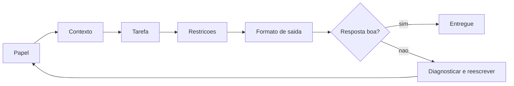

## 4. Técnica

### O checklist na prática: da instrução vaga à instrução profissional

Vamos materializar a diferença entre instrução vaga e instrução estruturada. O código abaixo compara duas formas de pedir a mesma tarefa a um modelo — usando o padrão de chamada do Capítulo 8 com qualquer provedor gratuito [1][2]:

```python
def pedir(mensagens, base_url, api_key, modelo):
    import json
    import urllib.request
    payload = {
        "model": modelo,
        "messages": mensagens,
        "max_tokens": 300,
    }
    requisicao = urllib.request.Request(
        base_url.rstrip("/") + "/chat/completions",
        data=json.dumps(payload).encode("utf-8"),
        headers={"Content-Type": "application/json", "Authorization": f"Bearer {api_key}"},
        method="POST",
    )
    with urllib.request.urlopen(requisicao, timeout=60) as resposta:
        corpo = json.loads(resposta.read().decode("utf-8"))
    return corpo["choices"][0]["message"]["content"]


instrucao_vaga = [{"role": "user", "content": "me ajuda com um codigo de calculadora"}]

instrucao_estruturada = [
    {
        "role": "system",
        "content": (
            "Voce e um assistente de programacao para iniciantes. "
            "Responda em portugues. Entregue apenas o codigo Python completo, "
            "sem explicacoes antes ou depois."
        ),
    },
    {
        "role": "user",
        "content": (
            "Contexto: projeto de linha de comando, Python 3.12, sem dependencias externas. "
            "Tarefa: crie uma calculadora que soma, subtrai, multiplica e divide. "
            "Restricoes: use apenas funcoes e uma interface simples com input. "
            "Objetivo: o codigo deve rodar e pedir dois numeros e uma operacao."
        ),
    },
]

# teste com o provedor que voce configurou no capitulo 9
print("=== INSTRUCAO VAGA ===")
print(pedir(instrucao_vaga, "https://openrouter.ai/api/v1", "sua-chave", "openrouter/free"))
print("=== INSTRUCAO ESTRUTURADA ===")
print(pedir(instrucao_estruturada, "https://openrouter.ai/api/v1", "sua-chave", "openrouter/free"))
```

Rode com a sua chave e compare: a instrução estruturada devolve código pronto no formato certo; a vaga devolve uma resposta genérica com conversa, suposições e provavelmente código incompleto [1][3]. Esse experimento — o mesmo modelo, duas instruções, dois mundos — é a demonstração mais convincente do capítulo.

### Few-shot: ensinando pelo exemplo

O few-shot é a técnica mais eficaz para tarefas com formato definido: fornecer exemplos e pedir que o modelo siga o padrão [3][6]. Vamos testar com classificação de intenção — um caso clássico:

```python
def classificador_few_shot(nova_frase, base_url, api_key, modelo):
    exemplos = [
        {"role": "user", "content": "quero saber o preco do plano"},
        {"role": "assistant", "content": "intencao: preco"},
        {"role": "user", "content": "meu login nao funciona"},
        {"role": "assistant", "content": "intencao: suporte"},
        {"role": "user", "content": "cancele minha assinatura"},
        {"role": "assistant", "content": "intencao: cancelamento"},
    ]
    mensagens = exemplos + [{"role": "user", "content": nova_frase}]
    return pedir(mensagens, base_url, api_key, modelo)


for frase in ["como renovo o plano?", "a pagina esta fora do ar"]:
    print(f"{frase} -> {classificador_few_shot(frase, 'https://openrouter.ai/api/v1', 'sua-chave', 'openrouter/free')}")
```

Observe o padrão: o modelo não recebeu regras — recebeu três exemplos de entrada/saída e replicou o formato com alta consistência [6]. Essa é a técnica que você usará para extração de dados, formatação e qualquer tarefa de padrão fixo. No harness, os exemplos podem ir no arquivo de regras do projeto, valendo para todas as sessões [2][12].

### Chain-of-thought: o raciocínio passo a passo

Para tarefas de lógica, ative o raciocínio explícito [4][5]:

```python
def raciocinar(problema, base_url, api_key, modelo):
    mensagens = [
        {
            "role": "system",
            "content": "Resolva o problema passo a passo, mostrando cada etapa, e conclua com a resposta final.",
        },
        {"role": "user", "content": problema},
    ]
    return pedir(mensagens, base_url, api_key, modelo)


problema = (
    "Uma loja vende camisetas a 30 reais cada e frete gratis para compras "
    "acima de 100 reais. Quero comprar 4 camisetas e tenho 150 reais. "
    "Quanto sobra apos a compra?"
)
print(raciocinar(problema, "https://openrouter.ai/api/v1", "sua-chave", "openrouter/free"))
```

Compare com o mesmo problema sem a instrução de raciocínio e observe a diferença na qualidade da resposta: com chain-of-thought, o modelo mostra o caminho — e erros ficam visíveis e corrigíveis [4][5]. Essa transparência é o que transforma a resposta em algo auditável, em vez de uma afirmação a ser aceita ou rejeitada às cegas.

### O depurador de instruções: quando o loop de erro aparece

Para fechar, uma ferramenta mental implementada: o depurador de instruções, que quebra o loop de erro diagnosticando o que faltou [1][3]:

```python
def diagnosticar_instrucao(instrucao):
    """Identifica qual ingrediente da instrucao esta fraco ou ausente."""
    diagnostico = []
    if len(instrucao.split()) < 20:
        diagnostico.append("contexto: muito curto - descreva o projeto e o problema")
    if not any(palavra in instrucao.lower() for palavra in ("nao use", "apenas", "somente", "formato", "em portugues")):
        diagnostico.append("restricoes: nenhuma - defina o que a resposta deve respeitar")
    if not any(palavra in instrucao.lower() for palavra in ("objetivo", "resultado", "deve", "entrega")):
        diagnostico.append("objetivo: ausente - defina o que conta como pronto")
    if not diagnostico:
        diagnostico.append("instrucao razoavel; se ainda falhar, adicione um exemplo (few-shot)")
    return diagnostico


instrucao_ruim = "faz um codigo de banco ai"
for item in diagnosticar_instrucao(instrucao_ruim):
    print("-", item)
```

Essa heurística simples cristaliza o método: quando a resposta sai errada, você não tenta a sorte de novo — você diagnostica qual ingrediente faltou (contexto, restrição, objetivo, exemplo) e reescreve com precisão [1][3]. No máximo duas tentativas cegas; na terceira, diagnose — é essa disciplina que elimina os loops de erro da sua vida com IA.

### Saída estruturada: pedindo JSON e validando o contrato

Quando a resposta do modelo precisa ser processada por outro programa — um harness, um teste, um pipeline — a melhor prática é pedir uma saída estruturada (JSON) e validar o contrato antes de usar [3][19]. O formato elimina a ambiguidade da prosa e torna a resposta verificável por código. O exemplo abaixo pede uma análise estruturada, faz o parse e valida os campos esperados — o mesmo padrão que os harnesses usam para receber chamadas de ferramenta do modelo [19][3]:

```python
import json


def pedir_json(prompt, base_url, api_key, modelo):
    instrucao = (
        prompt + "\n\nResponda SOMENTE com um JSON valido contendo "
        "os campos: resumo (string), pontos (lista de strings), "
        "risco (numero entre 1 e 5)."
    )
    resposta = pedir(
        [{"role": "user", "content": instrucao}],
        base_url, api_key, modelo,
    )
    try:
        dados = json.loads(resposta)
    except json.JSONDecodeError:
        return {"erro": "resposta nao era JSON valido", "bruto": resposta[:120]}
    return validar_contrato(dados)


def validar_contrato(dados):
    esperados = {"resumo": str, "pontos": list, "risco": int}
    for campo, tipo in esperados.items():
        if campo not in dados or not isinstance(dados[campo], tipo):
            return {"erro": f"campo '{campo}' ausente ou com tipo errado"}
    if not 1 <= dados["risco"] <= 5:
        return {"erro": "campo 'risco' fora da faixa 1-5"}
    return {"ok": True, "dados": dados}


resultado = pedir_json(
    "Resuma em uma frase a vantagem de saidas estruturadas de IA.",
    "https://openrouter.ai/api/v1", "sua-chave", "openrouter/free",
)
print(json.dumps(resultado, ensure_ascii=False, indent=2))
```

A validação de contrato é a última linha de defesa contra o risco de saída não confiável: mesmo que o modelo devolva JSON malformado ou campos fora do padrão, o programa detecta e trata — em vez de quebrar silenciosamente [3][19]. Essa disciplina é o mesmo princípio do LLM05 (tratamento inadequado de saídas) que o Capítulo 12 aprofundará: o texto gerado pelo modelo é dado, não verdade — e dado se valida antes de usar [10][3].

### A instrução como artefato: versionando e iterando

Um hábito separa o iniciante que evolui do que fica parado: tratar a instrução como um artefato que merece versionamento, revisão e histórico — exatamente como um arquivo de código [1]. Na prática, isso significa três gestos simples. O primeiro é não guardar o prompt na cabeça: quando uma instrução funciona bem, salve-a num arquivo de texto dentro do projeto, com um comentário de para que serve e quando foi usada. O segundo é versionar: se você usa git, o arquivo de instruções entra no repositório como qualquer outro, e cada ajuste vira um commit com mensagem explicando a mudança — foi o contexto que faltava, foi a restrição que não estava clara, foi o exemplo que funcionou [6]. O terceiro é revisar: uma vez por semana, olhe as instruções que você usou e pergunte qual delas produziu o melhor resultado e por quê.

Esse ciclo de iteração é a mesma lógica do desenvolvimento orientado a testes aplicada a texto: você escreve a instrução, observa a saída, avalia o desvio e ajusta — repetindo até o comportamento esperado estabilizar [11]. O erro mais comum do iniciante é acreditar que a instrução boa nasce pronta; a verdade é que ela nasce de tentativas documentadas, e é o documento que permite aprender com cada tentativa [15]. Um atalho valioso é manter uma pasta de instruções-modelo: cada nova tarefa começa copiando a instrução mais parecida já validada, ajustando apenas a parte que muda. Esse reuso gradual transforma a engenharia de instruções de esforço solitário em acervo pessoal que cresce com você — e é o mesmo princípio das skills que os harnesses profissionais oferecem, só que no seu próprio ritmo [18].

Por fim, adote um critério de qualidade objetivo para fechar o ciclo: a instrução está boa quando, sem nenhuma mudança sua, a segunda execução produz o mesmo resultado da primeira. Se você precisa repetir correções manuais, é a instrução que precisa de ajuste, não a sua paciência. Esse critério de reprodutibilidade transforma um hábito subjetivo em métrica — e é a ponte entre o que você aprendeu neste capítulo e a automação segura que o Capítulo 12 descreve [10][3].

## 5. Aplica

### A cena de contraste: a noite de frustração e a correção em cinco minutos

Imagine a cena. Você está no seu primeiro projeto real com o harness configurado no Capítulo 9. São 23h, o prazo da entrega é amanhã, e você pediu à IA: "faz a página de login". O resultado: um código com bibliotecas que você não instalou, em inglês, com um banco de dados que o projeto não usa. Você responde "não, eu quero com flask", a IA devolve outra coisa; você tenta "tá errado, o projeto usa sqlite", e o ciclo se repete por uma hora — o loop de erro clássico, amplificado pelo cansaço. Você está prestes a desistir e "fazer na mão".

Então você para, respira e aplica o método do capítulo. Reescreve a instrução com o checklist: papel ("você é um assistente deste projeto"), contexto ("o projeto é uma aplicação flask em Python 3.12 com banco sqlite, na pasta app/"), tarefa ("crie a rota de login com autenticação simples por e-mail e senha"), restrições ("use apenas flask e sqlite, siga o padrão de rotas já existente, responda em português") e formato ("entregue o código do arquivo e os comandos para testar"). Na primeira tentativa, a resposta está alinhada; na segunda, ajustada; em cinco minutos, o login funciona. A diferença entre a noite de frustração e a entrega no prazo foi uma instrução estruturada [1][3].

O diagnóstico: o loop de erro não era culpa do modelo — era a ausência dos três ingredientes (contexto, restrições, objetivo), somada à tentativa de "gritar" com a IA em vez de reescrever a instrução. A correção é exatamente a disciplina praticada: interromper o ciclo, diagnosticar com o checklist e reescrever do zero [1]. No mercado, essa é a habilidade que define produtividade real com IA: não é quem pede mais, é quem pede melhor.

Síntese das armadilhas comuns: (1) instrução vaga — "me ajuda" produz resposta de loteria [1]; (2) reexplicar em vez de reescrever — cada nova tentativa deve ser uma instrução melhor, não mais alta; (3) aceitar a primeira resposta sem verificar — especialmente em fatos, números e APIs [10]; (4) ignorar o formato de saída — pedir o formato certo evita metade dos ajustes [3]; (5) não usar exemplos — few-shot resolve tarefas de padrão em segundos [6].

## 6. Conclusão

Você aprendeu a habilidade que multiplica o valor de tudo o que construiu nos capítulos anteriores. Os três pontos deste capítulo: primeiro, uma boa instrução tem três ingredientes — contexto, restrições e objetivo — e uma boa estrutura tem cinco partes — papel, contexto, tarefa, restrições e formato de saída [1][3]; segundo, existem três técnicas de força — delimitadores para separar as partes, few-shot para ensinar pelo exemplo e chain-of-thought para ativar o raciocínio passo a passo [1][3][4][6]; terceiro, alucinações e loops de erro se combatem com método — fundamentação em fontes, permissão de recusa, temperatura baixa e o depurador de instruções que quebra o ciclo [1][9][10].

O desafio desta etapa: refaça o experimento de comparação da seção Técnica (instrução vaga vs. estruturada) com o seu provedor gratuito e guarde os dois resultados. Depois, use o depurador de instruções numa instrução real que você escreveu — e reescreva-a com o checklist completo.

No próximo capítulo, tudo se encontra: o seu primeiro projeto guiado — uma aplicação completa do início ao fim, usando as 4 camadas, a configuração do Capítulo 9 e as instruções deste capítulo, com leitura de logs, aceitação/rejeição de alterações e depuração de problemas.

## 7. Referências Bibliográficas

[1] ANTHROPIC. *Prompt Engineering Overview*. São Francisco: Anthropic, 2025. Disponível em: https://platform.claude.com/docs/en/build-with-claude/prompt-engineering/overview. Acesso em: 5 ago. 2026.

[2] ANTHROPIC. *Prompt Engineering Interactive Tutorial*. São Francisco: Anthropic, 2025. Disponível em: https://github.com/anthropics/prompt-eng-interactive-tutorial. Acesso em: 5 ago. 2026.

[3] OPENAI. *Best Practices for Prompt Engineering with the OpenAI API*. San Francisco: OpenAI, 2024. Disponível em: https://help.openai.com/en/articles/6654000-best-practices-for-prompt-engineering-with-openai-api. Acesso em: 5 ago. 2026.

[4] WEI, Jason; WANG, Xuezhi; SCHUURMANS, Dale; et al. Chain-of-Thought Prompting Elicits Reasoning in Large Language Models. *Advances in Neural Information Processing Systems*, v. 35, 2022.

[5] KOJIMA, Takeshi; GU, Shixiang; REID, Machel; et al. Large Language Models Are Zero-Shot Reasoners. *Advances in Neural Information Processing Systems*, v. 35, 2022.

[6] BROWN, Tom; MANN, Benjamin; RYDER, Nick; et al. Language Models Are Few-Shot Learners. *Advances in Neural Information Processing Systems*, v. 33, 2020.

[7] MENICK, Xuezhi; WANG, Kyle; SHI, Jerry; et al. Self-Consistency Improves Chain of Thought Reasoning in Language Models. *International Conference on Learning Representations*, 2022.

[8] SAHOO, Pranab; SINGH, Ayush; SRIPADA, Sriparna; et al. *A Systematic Survey of Prompt Engineering in Large Language Models*. arXiv:2402.07927, 2024.

[9] LEWIS, Patrick; PEREZ, Ethan; PIKTUS, Aleksandra; et al. Retrieval-Augmented Generation for Knowledge-Intensive NLP Tasks. *Advances in Neural Information Processing Systems*, v. 33, 2020.

[10] HUANG, Lei; YU, Weijiang; MA, Weitao; et al. *A Survey on Hallucination in Large Language Models: Principles, Taxonomy, Challenges, and Open Questions*. arXiv:2311.05232, 2023.

[11] LIU, Nelson; LIN, Kevin; HEWITT, John; et al. Lost in the Middle: How Language Models Use Long Contexts. *Transactions of the Association for Computational Linguistics*, v. 12, p. 157-173, 2023.

[12] ANTHROPIC. *Building Effective Agents*. São Francisco: Anthropic, 2024. Disponível em: https://www.anthropic.com/research/building-effective-agents. Acesso em: 5 ago. 2026.

[13] ANTHROPIC. *Effective Context Engineering for AI Agents*. São Francisco: Anthropic, 2025. Disponível em: https://www.anthropic.com/research/effective-context-engineering-for-ai-agents. Acesso em: 5 ago. 2026.

[14] LIU, Pengfei; YUAN, Weizhe; FU, Jinlan; et al. Pre-train, Prompt, and Predict: A Systematic Survey of Prompting Methods in Natural Language Processing. *ACM Computing Surveys*, v. 55, n. 9, p. 1-35, 2023.

[15] OPENAI. *GPT-4 Technical Report*. arXiv:2303.08774, 2023.

[16] ANTHROPIC. *Introducing the Claude 3 Family*. São Francisco: Anthropic, 2024. Disponível em: https://www.anthropic.com/news/claude-3-family. Acesso em: 5 ago. 2026.

[17] GOOGLE. *Gemini API — Prompting Guide*. Mountain View: Google, 2025. Disponível em: https://ai.google.dev/gemini-api/docs/prompting-intro. Acesso em: 5 ago. 2026.

[18] WEI, Jason; TAY, Yi; BOMMASANI, Rishi; et al. Emergent Abilities of Large Language Models. *Transactions on Machine Learning Research*, 2022.

[19] OPENAI. *Function Calling Documentation*. San Francisco: OpenAI, 2025. Disponível em: https://platform.openai.com/docs/guides/function-calling. Acesso em: 5 ago. 2026.

[20] ANTHROPIC. *Writing Effective Tools*. São Francisco: Anthropic, 2025. Disponível em: https://www.anthropic.com/research/writing-effective-tools. Acesso em: 5 ago. 2026.

# Capítulo 11: Seu primeiro projeto guiado: das 4 camadas ao aplicativo funcionando

## 1. Introdução

No Capítulo 10, você aprendeu a falar a língua da IA — contexto, restrições, objetivos e o checklist de cinco partes. Agora chegou o momento de juntar tudo o que o livro construiu: o seu primeiro projeto completo, do início ao fim, usando as 4 camadas. Este capítulo é um guia de mão na massa: você vai criar uma aplicação simples — um gerenciador de tarefas de linha de comando — usando o harness e o modelo configurados no Capítulo 9, com instruções do Capítulo 10. E vai aprender as três habilidades de operação que faltavam: ler os logs do harness, aceitar ou rejeitar alterações propostas e depurar problemas quando as coisas saírem do trilho.

Ao final deste capítulo, você terá um projeto real funcionando — não um exercício — e um método repetível para construir os próximos. A meta não é o código em si, é o fluxo: você vai experimentar, pela primeira vez, a sensação de operar um sistema completo de IA assistida.

## 2. Explica

### O projeto: um gerenciador de tarefas com escopo de iniciante

O projeto escolhido tem um propósito pedagógico preciso: ser simples o suficiente para caber num capítulo e rico o suficiente para exercitar as 4 camadas e as ferramentas. Um gerenciador de tarefas de linha de comando em Python — adicionar, listar, concluir e remover tarefas, persistidas num arquivo JSON — cobre exatamente esse espectro [1][16]. Ele exige leitura e escrita de arquivos (Tools), execução de comandos no terminal (Tools), instruções claras (Capítulo 10) e, quando você evoluir o projeto nos exercícios, uma interface web (Tela avançada) e até uma API [1][16][4].

O escopo de iniciante é uma decisão deliberada, e há três regras que o protegem: (1) comece com uma versão mínima que funciona (o mínimo viável), e só depois adicione features; (2) mantenha o projeto num repositório git desde o primeiro comando, para que cada alteração seja rastreável; (3) aceite apenas uma feature por vez — o harness propõe, você revisa e valida [2][3][12]. Essas regras não são burocráticas: são a mesma disciplina de supervisão que você estudou nos capítulos 6 e 12, aplicada na escala do primeiro projeto.

### O fluxo de trabalho com o harness: instrução, geração, aplicação e teste

O fluxo de trabalho que você vai seguir tem quatro fases, e cada uma corresponde a uma pergunta. A instrução: o que exatamente você quer que o harness faça — descrito com o checklist do Capítulo 10 [1][12]. A geração: o harness propõe a alteração — arquivos novos, código, comandos — e você a vê antes de aceitar [2][3]. A aplicação: você aceita (ou rejeita) a alteração, e o harness a aplica ao projeto [3][12]. O teste: você roda o código e verifica que funciona — com testes simples de `assert` ou rodando o programa [1][4]. A sequência é sempre a mesma, e a disciplina está em não pular fases: instrução sem teste gera código não verificado; teste sem instrução vira adivinhação [12].

Cada fase tem artefatos observáveis — o que você vê no harness: o plano proposto, o diff das alterações, os comandos que serão executados, os resultados dos testes [2][3]. É lendo esses artefatos que você aprende a operar: o harness mostra o processo, e o processo é onde está o controle [3][12]. Este capítulo modela esse fluxo de forma explícita: primeiro como método, depois como prática, depois como depuração.

### Lendo logs: a conversa entre as camadas

Os logs do harness são o registro da conversa entre as camadas — cada chamada de ferramenta, cada arquivo lido, cada comando executado, cada resposta do modelo [2][3]. Para o iniciante, ler logs é a habilidade que separa "operação às cegas" de "operação consciente". As linhas que você vai aprender a reconhecer: as chamadas de ferramenta (o harness executou `ler_arquivo`, `escrever_arquivo`, `terminal`), os resultados (sucesso ou erro de cada chamada), as respostas do modelo (o raciocínio e as decisões) e os eventos de supervisão (alterações propostas para sua aprovação) [3][12]. Quando algo der errado, é no log que está o rastro — e o método de diagnóstico por camada do Capítulo 5 se aplica: o erro está na Tela (pedido), no Harness (contexto/permissoes), na LLM (resposta) ou nas Tools (execução) [4][13].

### Aceitando e rejeitando alterações: a supervisão na prática

A supervisão humana — o humano no loop — é o que transforma um gerador de texto em uma ferramenta de engenharia [1][12]. Na prática, isso significa: antes de aceitar qualquer alteração proposta pelo harness, você a examina com três perguntas: (1) o que mudou? — leia o diff, arquivo por arquivo [2][14]; (2) por que mudou? — a alteração corresponde à instrução que você deu? [12]; (3) quebraria algo? — a alteração respeita o código existente, as convenções e os testes? [1]. Rejeitar não é um fracasso — é parte do trabalho: o harness ajusta, propõe de novo, e você reavalia [12]. A regra de ouro que você levará daqui: nunca aceite uma alteração que você não entende; se não entende, peça explicação — o harness explica — e só então decida [1][3].

## 3. Ilustra

Pense no ensaio de uma banda antes do primeiro show. O produtor (você) propõe uma música nova (a instrução). O guitarrista (o harness) arranja os acordes e mostra para a banda (o diff): "vou tocar assim, com esta introdução e este ritmo". A banda ensaia (os testes). Você ouve, ajusta um trecho ou aprova. E se algo soa estranho, você volta ao registro do ensaio (os logs) — quem tocou fora do tempo, onde começou a dissonância — e corrige o trecho, não a banda inteira. É exatamente esse o fluxo do capítulo: propor, mostrar, testar, revisar, registrar — e depurar pelo rastro, não pelo achismo [2][3][12].

Como Aprendiz de Construtor, você está prestes a fazer o primeiro show: um projeto real, construído com as 4 camadas que você desmontou ao longo do livro inteiro. O diagrama abaixo mostra o fluxo de trabalho completo, com os artefatos observáveis em cada fase.

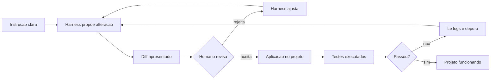

## 4. Técnica

### Fase 1 e 2: a instrução e a primeira geração

O projeto começa com a instrução estruturada — o checklist do Capítulo 10 aplicado ao harness [1][12]. Crie a pasta do projeto e escreva a instrução como um arquivo de tarefa, para que ela seja clara e reutilizável:

```bash
mkdir -p meu-projeto && cd meu-projeto
git init

cat > TAREFA.md << 'FIM'
# Tarefa 1 - versao minima do gerenciador de tarefas

Papel: voce e um assistente deste projeto, respondendo em portugues.

Contexto: projeto python 3.12 sem dependencias externas, na pasta atual,
com git inicializado. Vamos construir um gerenciador de tarefas de linha
de comando.

Tarefa: crie o arquivo tarefas.py com as funcoes adicionar, listar,
concluir e remover. As tarefas ficam salvas em um arquivo tarefas.json.

Restricoes: use apenas a biblioteca padrao. O arquivo tarefas.json deve
ser criado automaticamente se nao existir. Respeite o idioma portugues
nas mensagens do programa.

Formato de saida: entregue o codigo completo de tarefas.py e os comandos
para testar cada funcao.
FIM
```

Agora peça ao harness que execute a tarefa, no modo não interativo, apontando para o arquivo de instrução [2][5]:

```bash
opencode run "leia TAREFA.md e implemente exatamente o que ela pede"
```

O artefato desta fase é o plano e o diff propostos: o harness anuncia os arquivos que vai criar e as funções que vai implementar, e apresenta a alteração para sua revisão [2][3][12]. Antes de aceitar, leia o diff com as três perguntas da seção Explica — o que mudou, por que mudou, o que pode quebrar [12][14].

### Fase 3 e 4: aplicar, rodar e testar

Com a alteração aceita e aplicada, a fase de teste verifica o funcionamento real — rodando o programa e validando cada função [1][16]. Os comandos abaixo exercitam o ciclo completo:

```bash
# Fase 3: aplicar a alteracao proposta (ja feita no passo anterior)
# Fase 4: testar cada funcao do gerenciador
python tarefas.py adicionar "ler o capitulo 11"
python tarefas.py adicionar "revisar o projeto"
python tarefas.py listar
python tarefas.py concluir 1
python tarefas.py listar
```

Cada comando é um teste objetivo: adicionar cria, listar mostra, concluir marca. Se alguma resposta for inesperada — por exemplo, "concluir" não muda a lista — é hora da fase de depuração. Para automatizar a verificação, escreva um teste que não dependa de digitação manual [1][4]:

```python
import json
import os
import subprocess
import sys


def limpar_estado():
    if os.path.exists("tarefas.json"):
        os.remove("tarefas.json")


def executar(*argumentos):
    return subprocess.run(
        [sys.executable, "tarefas.py", *argumentos],
        capture_output=True, text=True, encoding="utf-8",
    )


def testar_gerenciador():
    limpar_estado()
    saida = executar("adicionar", "primeira tarefa")
    assert saida.returncode == 0, saida.stderr
    executar("adicionar", "segunda tarefa")
    lista = executar("listar").stdout
    assert "primeira tarefa" in lista and "segunda tarefa" in lista
    executar("concluir", "1")
    final = executar("listar").stdout
    assert "[x]" in final
    print("gerenciador de tarefas: OK")


testar_gerenciador()
```

Rode o teste: se passar, o mínimo viável está pronto e verificado [4]. Esse é o padrão que você repetirá em todos os projetos: funcionalidade + teste objetivo = feature entregue.

### Evolução com supervisão: uma feature por vez

Com o mínimo viável funcionando, o fluxo de evolução é uma feature por vez, sempre com o mesmo ciclo [12]. A primeira evolução sugerida: adicionar prioridade (alta, média, baixa) às tarefas. A instrução da segunda tarefa:

```bash
cat > TAREFA2.md << 'FIM'
# Tarefa 2 - prioridade nas tarefas

Contexto: o arquivo tarefas.py existe e funciona, com testes em testar.py.
Tarefa: adicione suporte a prioridade (alta, media, baixa) na funcao
adicionar e mostre a prioridade na listagem.
Restricoes: mantenha compatibilidade com os comandos existentes; o
formato do tarefas.json pode evoluir, mas tarefas antigas continuam
funcionando.
Formato de saida: entregue o diff das mudancas e os comandos de teste.
FIM

opencode run "leia TAREFA2.md e implemente exatamente o que ela pede"
python tarefas.py adicionar "revisar testes" --prioridade alta
python tarefas.py listar
python testar.py
```

Observe o fluxo completo de novo: instrução clara, proposta revisada, aplicação, testes. A regra de uma feature por vez é o que mantém cada etapa auditável: quando um teste falha, você sabe exatamente qual alteração introduziu o problema [12][14].

### Depurando com os logs: o caso do arquivo que não existia

A última habilidade técnica do capítulo é a depuração guiada pelos logs. Imagine o cenário: você pediu uma feature nova, o harness disse que implementou, mas o teste falha. Em vez de reler o código inteiro, você segue o rastro dos logs — e descobre, por exemplo, que o harness criou um arquivo de configuração num caminho diferente do esperado [2][3]. O método de depuração tem quatro passos:

```bash
# Passo 1: reproduzir o erro e ver a mensagem exata
python testar.py 2>&1 | tail -5

# Passo 2: consultar o log da sessao do harness (comando varia por ferramenta)
opencode run "liste os arquivos que voce criou neste projeto e seus caminhos"

# Passo 3: verificar o estado real do projeto
find . -name "*.json" -o -name "*.py" | sort

# Passo 4: pedir a correcao com a evidencia em maos
opencode run "o teste espera o arquivo em config.json mas ele esta em dados.json; corrija o caminho"
```

O padrão é o mesmo do diagnóstico por camada: reproduzir (o erro é real?), localizar (qual camada falhou — caminho errado é Tools/arquivos, comportamento errado é LLM/instrução), corrigir com evidência (a instrução de correção cita o achado) [4][13]. Esse ciclo — reproduzir, localizar, corrigir, verificar — é o método de depuração que você usará profissionalmente, com IA ou sem ela [13].

### O diário de desenvolvimento: documentando decisões com o harness

Todo projeto profissional acumula um tipo de memória que o código não carrega: as decisões — por que uma abordagem foi escolhida, o que foi tentado antes e o que não funcionou [3][6]. O harness lembra da sessão, mas a memória do projeto pertence ao projeto: registrar cada decisão num arquivo versionado cria o histórico que orienta as próximas instruções [6][2]. O registro abaixo anexa entradas estruturadas a um arquivo de decisões do projeto — o hábito que transforma projetos individuais em projetos sustentáveis [2][3]:

```python
from datetime import datetime


class DiarioDeDecisoes:
    def __init__(self, caminho="DECISOES.md"):
        self.caminho = caminho

    def registrar(self, decisao, contexto, alternativa_rejeitada=""):
        entrada = (
            f"## {datetime.now().strftime('%d/%m/%Y')} - {decisao}\n\n"
            f"- contexto: {contexto}\n"
        )
        if alternativa_rejeitada:
            entrada += f"- alternativa rejeitada: {alternativa_rejeitada}\n"
        try:
            with open(self.caminho, "a", encoding="utf-8") as arquivo:
                arquivo.write(entrada + "\n")
            return True
        except OSError:
            return False

    def resumo(self):
        try:
            conteudo = open(self.caminho, encoding="utf-8").read()
        except OSError:
            return "diario ainda nao criado"
        titulos = [linha for linha in conteudo.splitlines() if linha.startswith("## ")]
        return f"{len(titulos)} decisoes registradas"


diario = DiarioDeDecisoes()
diario.registrar(
    decisao="armazenar tarefas em JSON",
    contexto="projeto exige persistencia simples sem banco de dados",
    alternativa_rejeitada="usar sqlite (complexidade desnecessaria nesta fase)",
)
diario.registrar(
    decisao="uma feature por ciclo de revisao",
    contexto="falhas de teste ficaram mais faceis de localizar",
)
print(diario.resumo())
print(open("DECISOES.md", encoding="utf-8").read())
```

O diário cumpre duas funções que se reforçam: para você, é a memória de longo prazo que evita repetir decisões já tomadas; para a IA, é contexto de primeira qualidade — um projeto com histórico documentado produz instruções melhores e respostas mais alinhadas [2][3]. É também o hábito que o Capítulo 12 transforma em regra: um projeto registrado é um projeto auditável e revertível [6].

### O esqueleto reutilizável: do projeto único à coleção de padrões

Ao terminar o gerenciador de tarefas, o maior valor não é o aplicativo em si — é o esqueleto de trabalho que ele deixou para trás. Todo projeto assistido bem-sucedido tende a repetir a mesma ossatura: uma pasta de instruções (`INSTRUCOES.md` ou `AGENTS.md`), um arquivo de contexto com a visão do projeto, um script de verificação rápida e o diário de decisões que você construiu neste capítulo [4]. Reconhecer esse padrão é o que transforma a experiência isolada em método reutilizável: no próximo projeto, você começa copiando a estrutura que já funcionou, em vez de recomeçar do zero [9].

O primeiro componente do esqueleto é a instrução de arranque: um texto curto que diz ao harness quem você é, qual é o objetivo do projeto e quais são as restrições não negociáveis (linguagem, formato de saída, proibições). Escrever esse texto uma única vez, com calma, economiza dezenas de instruções repetidas ao longo da vida do projeto — cada mensagem futura já nasce com contexto suficiente [12]. O segundo componente é o teste de fumaça: um comando simples que valida se tudo continua de pé após cada mudança. No gerenciador de tarefas, foi rodar o script e conferir a saída; em projetos maiores, será rodar a suíte de testes. O terceiro é o diário, que você já conhece: a memória que impede o retrabalho.

A partir daí, a evolução é incremental: cada projeto concluído devolve um padrão melhorado para a sua coleção pessoal. Um dia, esse acervo de esqueletos é o que separa o usuário do assistente do profissional que projeta fluxos de trabalho assistidos — o mesmo caminho que os harnesses profissionais formalizam com templates e bibliotecas de instruções [17]. O conselho prático para fechar: depois de publicar o projeto, reserve meia hora para escrever o que funcionou, o que travou e o que você mudaria — esse relatório de uma página é o seu primeiro item de acervo e o seu primeiro passo rumo à maestria [20][2].

## 5. Aplica

### A cena de contraste: aceitar às cegas e o bug que foi para produção

Imagine a cena. Empolgado com a velocidade do harness, você decide acelerar: em vez de revisar cada diff, você aceita as alterações em sequência, "porque o harness é bom mesmo". Na terceira feature, um teste quebra, mas o prazo aperta e você aceita assim mesmo, confiando no modelo. Na semana seguinte, a aplicação é usada por pessoas reais — e um dos relatórios do sistema sai com os números errados, porque a feature aceita às cegas tinha uma lógica de soma com ordem trocada. O bug não veio da IA: veio da ausência de supervisão humana no fluxo que você mesmo montou [1][12]. O custo de aceitar sem entender é pago em produção — onde é caro [2].

O diagnóstico, ligado à teoria do capítulo: a supervisão não é um detalhe do fluxo — é a fase que transforma geração em engenharia [1][12]. A correção é o método que você praticou: revisar cada diff com as três perguntas (o que mudou, por que, o que quebra), rodar os testes antes de aceitar, e rejeitar com pedido de explicação quando algo não ficar claro [12][14]. No mercado, essa disciplina separa times que usam IA como alavanca de times que usam IA como roleta: os primeiros revisam e testam, os segundos aceitam e pagam depois [2][3].

Síntese das armadilhas comuns: (1) aceitar alterações sem ler o diff — a supervisão é a fase que você não pode pular [12]; (2) adicionar features demais de uma vez — uma por vez mantém a auditoria possível [12]; (3) ignorar os logs na depuração — o rastro está lá, use-o [3]; (4) não ter teste objetivo — "funciona na minha máquina" não é verificação [4]; (5) pedir correção sem evidência — "está errado" é instrução fraca; "o teste espera X e encontrou Y" é instrução forte [1][13].

## 6. Conclusão

Seu primeiro projeto está de pé — e, com ele, o fluxo completo que este livro prometeu. Os três pontos deste capítulo: primeiro, o fluxo de trabalho tem quatro fases — instrução, geração, aplicação e teste — e cada uma tem um artefato observável [1][12]; segundo, a supervisão humana é a fase decisiva — revisar o diff, rodar os testes e rejeitar o que não se entende transforma geração em engenharia [12][14]; terceiro, a depuração segue o rastro — logs do harness, diagnóstico por camada e correção com evidência [3][4][13].

O desafio desta etapa: adicione uma terceira feature ao gerenciador — por exemplo, filtro por prioridade ou data de criação — seguindo o ciclo completo: instrução, proposta, revisão, teste. Depois, simule um bug (altere uma linha do código) e pratique o método de depuração com os logs até localizar a causa.

No próximo capítulo, o livro se fecha com as bases para continuar: segurança e privacidade no uso de IA, os limites das ferramentas e o mapa de evolução para seguir crescendo no ecossistema depois deste guia.

## 7. Referências Bibliográficas

[1] ANTHROPIC. *Prompt Engineering Overview*. São Francisco: Anthropic, 2025. Disponível em: https://platform.claude.com/docs/en/build-with-claude/prompt-engineering/overview. Acesso em: 5 ago. 2026.

[2] ANTHROPIC. *Claude Code Overview*. São Francisco: Anthropic, 2025. Disponível em: https://platform.claude.com/docs/en/claude-code/overview. Acesso em: 5 ago. 2026.

[3] ANTHROPIC. *Claude Code Best Practices*. São Francisco: Anthropic, 2025. Disponível em: https://www.anthropic.com/engineering/claude-code-best-practices. Acesso em: 5 ago. 2026.

[4] PYTHON SOFTWARE FOUNDATION. *The Python Tutorial*. 2025. Disponível em: https://docs.python.org/3/tutorial/. Acesso em: 5 ago. 2026.

[5] OPENCODE. *Documentation*. São Francisco: SST, 2025. Disponível em: https://opencode.ai/docs. Acesso em: 5 ago. 2026.

[6] CHACON, Scott; STRAUB, Ben. *Pro Git*. 2. ed. Nova York: Apress, 2014.

[7] MICROSOFT. *Visual Studio Code Documentation*. Redmond: Microsoft, 2025. Disponível em: https://code.visualstudio.com/docs. Acesso em: 5 ago. 2026.

[8] MOZILLA. *HTTP — MDN Web Docs*. 2025. Disponível em: https://developer.mozilla.org/en-US/docs/Web/HTTP. Acesso em: 5 ago. 2026.

[9] GNU PROJECT. *Bash Reference Manual*. Boston: Free Software Foundation, 2023. Disponível em: https://www.gnu.org/software/bash/manual/. Acesso em: 5 ago. 2026.

[10] OLLAMA. *Ollama Documentation*. 2025. Disponível em: https://ollama.com/docs. Acesso em: 5 ago. 2026.

[11] OPENROUTER. *OpenRouter Documentation*. 2025. Disponível em: https://openrouter.ai/docs. Acesso em: 5 ago. 2026.

[12] ANTHROPIC. *Building Effective Agents*. São Francisco: Anthropic, 2024. Disponível em: https://www.anthropic.com/research/building-effective-agents. Acesso em: 5 ago. 2026.

[13] LIU, Nelson; LIN, Kevin; HEWITT, John; et al. Lost in the Middle: How Language Models Use Long Contexts. *Transactions of the Association for Computational Linguistics*, v. 12, p. 157-173, 2023.

[14] HUANG, Lei; YU, Weijiang; MA, Weitao; et al. *A Survey on Hallucination in Large Language Models: Principles, Taxonomy, Challenges, and Open Questions*. arXiv:2311.05232, 2023.

[15] PENG, Sida; KALLIAMVAKOU, Eirini; CITHON, Patrice; DEMIRER, Mert. *The Impact of AI on Developer Productivity: Evidence from GitHub Copilot*. arXiv:2302.06590, 2023.

[16] JSON. *Introducing JSON*. 2025. Disponível em: https://www.json.org/json-en.html. Acesso em: 5 ago. 2026.

[17] PYTHON SOFTWARE FOUNDATION. *venv — Creation of Virtual Environments*. 2025. Disponível em: https://docs.python.org/3/library/venv.html. Acesso em: 5 ago. 2026.

[18] FLASK. *Flask Documentation*. 2025. Disponível em: https://flask.palletsprojects.com/. Acesso em: 5 ago. 2026.

[19] ANTHROPIC. *Effective Context Engineering for AI Agents*. São Francisco: Anthropic, 2025. Disponível em: https://www.anthropic.com/research/effective-context-engineering-for-ai-agents. Acesso em: 5 ago. 2026.

[20] STACK OVERFLOW. *Developer Survey 2024*. Nova York: Stack Overflow, 2024. Disponível em: https://survey.stackoverflow.co/2024/. Acesso em: 5 ago. 2026.

# Capítulo 12: O futuro da criação com IA: segurança, privacidade e próximos passos

## 1. Introdução

No Capítulo 11, você construiu seu primeiro projeto completo com as 4 camadas. Agora o livro se fecha com as duas fundações que sustentam o uso profissional de IA no longo prazo: a segurança e a privacidade — as boas práticas que protegem você, seus dados e seus projetos — e a consciência dos limites das ferramentas, que evita expectativas irrealistas e decisões perigosas. Para terminar, o capítulo traça o mapa de evolução: os próximos passos para continuar crescendo no ecossistema depois deste guia.

Ao final deste capítulo, você será capaz de aplicar as práticas essenciais de segurança no uso de agentes de código — menor privilégio, proteção de credenciais, fluxos de aprovação; reconhecer os riscos documentados da área (o OWASP Top 10 para LLMs, o framework de risco do NIST); e desenhar um plano pessoal de evolução para os próximos meses.

## 2. Explica

### Segurança e privacidade: dados, permissões e boas práticas

Quando você opera um agente de IA com acesso ao seu projeto, você está concedendo a um sistema automatizado a capacidade de ler, escrever e executar no seu ambiente — e essa concessão exige disciplina [1][3]. O princípio mais importante, importado da segurança clássica, é o do menor privilégio: conceda ao agente apenas as ferramentas e permissões necessárias para a tarefa — se ele só precisa ler arquivos, não dê permissão de exclusão; se só precisa rodar testes, não deixe comandos de produção no alcance [1][12]. O OWASP, no Top 10 para aplicações de LLM, nomeia exatamente esse risco: LLM06, agência excessiva — dar autonomia ou permissões demais ao agente é uma das dez principais vulnerabilidades [2].

A proteção de dados é a segunda frente. Credenciais — chaves de API, tokens, senhas — nunca devem entrar em prompts, no código versionado ou em arquivos enviados a terceiros [3][14]. O hábito que você praticou no Capítulo 8 — variável de ambiente e arquivos fora do git — é a regra profissional. Além das credenciais, os dados sensíveis do projeto (dados pessoais, segredos comerciais, informações de clientes) precisam de tratamento consciente: antes de enviar contexto para um provedor na nuvem, pergunte-se se aquilo deveria sair do seu ambiente — e prefira modelos locais (Ollama) quando a resposta for não [3][10][12]. O OWASP nomeia o risco como LLM02, divulgação de informações sensíveis [2].

### Limites das ferramentas: quando a IA erra e como mitigar

O segundo pilar é a consciência dos limites — saber o que a IA não é, para não confiar demais onde ela falha. Os limites documentados são concretos: o modelo pode gerar afirmações factualmente falsas com total fluência — a alucinação, catalogada como LLM09 (desinformação) no OWASP [2][13]; ele pode ser manipulado por instruções maliciosas embutidas em textos que lê — a injeção de prompt (LLM01), que pode vir de um arquivo ou site que o agente processa [2]; e ele pode tratar inadequadamente saídas — se você pega o texto gerado e o injeta direto numa página ou banco sem sanitização, cria as mesmas vulnerabilidades clássicas (XSS, SQL injection), o LLM05 [2]. Nenhum desses limites é mistério: são consequências da arquitetura que você estudou nos Capítulos 2 e 3 — o modelo gera o texto mais provável, não o mais verdadeiro ou o mais seguro [13].

A mitigação é uma combinação de técnica e processo. No plano técnico: fundamentar respostas em fontes (RAG), permitir que o modelo declare que não sabe, validar e sanitizar toda saída antes de usá-la, e manter a supervisão humana nas ações de alto impacto [1][2][3]. No plano de processo: o framework de risco do NIST organiza a gestão em quatro funções — Govern (definir políticas e responsabilidades), Map (entender o contexto de uso e os riscos), Measure (testar e avaliar) e Manage (mitigar e monitorar) [4]. Para o Aprendiz de Construtor, a versão prática é simples: nunca delegue uma decisão irreversível sem revisão humana, e teste sempre antes de confiar [3][4].

### Boas práticas de operação: o checklist do usuário responsável

Sintetizando a segurança na operação diária, o checklist do usuário responsável tem seis itens, todos derivados das práticas que você já praticou nos capítulos anteriores [1][2][3]: (1) menor privilégio — configure as ferramentas do harness com o escopo mínimo; (2) credenciais protegidas — variável de ambiente, nunca no git; (3) supervisão — revise diffs e exija aprovação para ações destrutivas; (4) dados conscientes — não envie dados sensíveis para a nuvem sem necessidade; (5) saída validada — não use a saída do modelo como entrada direta de código ou SQL sem sanitização; (6) plano de reversão — git commitado em cada etapa, para que todo erro seja revertível [6][12]. Esse checklist é o mesmo espírito das boas práticas documentadas pelos provedores — Anthropic e OpenAI mantêm guias oficiais de segurança que detalham cada item [1][3][14].

### O cenário em evolução: regulação, indústria e carreira

O ecossistema em que você está entrando evolui rápido, e três vetores merecem sua atenção. O regulatório: o EU AI Act (Regulamento (UE) 2024/1689) estabeleceu o primeiro marco regulatório abrangente de IA — classificação de risco, obrigações de transparência e governança — e outras jurisdições seguem o mesmo caminho [5]. O industrial: os modelos e ferramentas evoluem em ciclos curtos, com avaliações públicas constantes (o AI Index da Stanford documenta a evolução ano a ano [7]) e previsões de adoção massiva (a Gartner projeta que a maioria dos engenheiros de software usará assistentes de código até 2028 [8]). E o profissional: as habilidades que este livro construiu — operar a arquitetura em 4 camadas, configurar harnesses, escrever instruções, supervisionar agentes — são exatamente as que o mercado de 2026 valoriza, como os relatórios de tendências de trabalho indicam [15].

A leitura madura desse cenário é equilibrada: entusiasmo sem euforia, cautela sem paralisia. O agente ainda precisa de supervisão (os benchmarks mostram que os modelos erram em problemas difíceis [16]); as ferramentas mudam de nome e interface, mas a arquitetura que você domina permanece [12]; e o diferencial humano — entender o sistema, definir o escopo, revisar o resultado — continua sendo o ponto mais valorizado [1][12].

## 3. Ilustra

Pense num marinheiro aprendendo a navegar um barco moderno com piloto automático. O piloto automático (o agente) é excelente em manter o rumo, mas o marinheiro responsável nunca dorme no leme: ele sabe que o piloto segue instruções, não intenções — se um obstáculo não foi informado ou o mapa está desatualizado, o barco segue reto para o problema. Por isso ele mantém três hábitos: define limites claros de navegação (menor privilégio — até onde o piloto pode ir sozinho), mantém o diário de bordo em dia (logs e git — tudo revertível e auditável), e assume o leme nos momentos críticos (supervisão humana em ações irreversíveis) [1][3][12]. Um piloto automático bem operado é o melhor companheiro de navegação; mal operado, é um acidente esperando acontecer.

Como Aprendiz de Construtor, você fecha o livro com essa imagem: a IA é o piloto automático do seu desenvolvimento — poderosa, rápida e surpreendentemente capaz, mas sempre operada por você, com limites, registro e supervisão. O diagrama abaixo resume o ciclo de operação responsável.

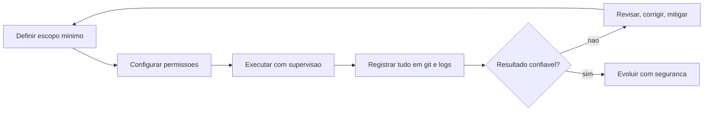

## 4. Técnica

### O menor privilégio na prática: definindo o escopo do agente

A segurança começa na configuração: decidir o que o agente pode fazer. Vamos materializar o menor privilégio com um guarda de permissões em Python puro — o mesmo mecanismo que os harnesses implementam para bloquear ações fora do escopo [1][2][3]:

```python
PERMISSOES = {
    "ler_arquivo": True,
    "escrever_arquivo": True,
    "executar_terminal": False,
    "excluir_arquivo": False,
    "acessar_rede": False,
}


def verificar_permissao(acao):
    """Bloqueia acoes fora do escopo configurado (menor privilegio)."""
    permitida = PERMISSOES.get(acao, False)
    if not permitida:
        raise PermissionError(f"acao bloqueada pelo escopo: {acao}")
    return True


def executar_acao(acao, argumento=""):
    try:
        verificar_permissao(acao)
        return f"executando {acao} ({argumento})"
    except PermissionError as erro:
        return f"BLOQUEADO: {erro}"


for acao in ["ler_arquivo", "executar_terminal", "excluir_arquivo"]:
    print(executar_acao(acao, "teste.txt"))
```

Observe o princípio em ação: a tabela define o escopo, e qualquer ação fora dele é bloqueada antes de executar [1][2]. Essa é a mesma lógica das permissões dos harnesses — e a diferença prática entre um agente que é uma alavanca e um que é uma roleta. Quando você configurar um harness real, traduza essa tabela para as permissões da ferramenta: leitura e escrita no projeto, terminal somente quando necessário, exclusão nunca sem aprovação [3][12].

### Proteção de credenciais: o detector de chaves vazadas

Um dos erros mais comuns — e mais baratos de prevenir — é versionar credenciais. O detector abaixo escaneia um projeto em busca de padrões de chave vazada no código e no git [3][14]:

```python
import os
import re


PADROES_SUSPEITOS = [
    re.compile(r"sk-[A-Za-z0-9]{20,}"),
    re.compile(r"(api[_-]?key|token|secret)\s*=\s*[\"'][A-Za-z0-9]{16,}[\"']", re.IGNORECASE),
]


def escanear_credenciais(diretorio):
    """Procura chaves e segredos em arquivos de texto do projeto."""
    achados = []
    for raiz, pastas, arquivos in os.walk(diretorio):
        pastas[:] = [p for p in pastas if p not in (".git", "venv", "__pycache__")]
        for nome in arquivos:
            caminho = os.path.join(raiz, nome)
            try:
                conteudo = open(caminho, encoding="utf-8", errors="ignore").read()
            except OSError:
                continue
            for padrao in PADROES_SUSPEITOS:
                for correspondencia in padrao.finditer(conteudo):
                    achados.append((caminho, correspondencia.group(0)[:25] + "..."))
    return achados


achados = escanear_credenciais(".")
if achados:
    for caminho, trecho in achados:
        print(f"SUSPEITO em {caminho}: {trecho}")
else:
    print("nenhuma credencial suspeita encontrada")
```

Rode este detector no seu projeto como hábito mensal [3]. Se ele encontrar algo, revogue a credencial imediatamente e remova o histórico com as ferramentas adequadas do git [6]. Detectar antes de publicar é centenas de vezes mais barato do que remediar depois [14].

### Sanitização de saída: o modelo não é sua validação

O risco LLM05 do OWASP — tratamento inadequado de saídas — acontece quando o texto gerado pelo modelo é usado como entrada de outra parte do sistema sem validação [2]. O exemplo clássico: injetar a resposta do modelo direto numa consulta SQL ou num comando de terminal. A mitigação é a mesma da segurança clássica: sanitizar e validar [2][3]. O código abaixo demonstra a diferença entre usar saída crua e usar saída validada:

```python
import re


def saida_do_modelo_simulada():
    return "tarefa_id=1; DROP TABLE tarefas; --"


def usar_cru(entrada):
    """Uso inseguro: o texto vai direto para uma camada que interpreta."""
    return f"executando: {entrada}"


def usar_validado(entrada):
    """Uso seguro: somente numeros passam (permite apenas id de tarefa)."""
    correspondencia = re.match(r"tarefa_id=(\d+)", entrada)
    if not correspondencia:
        return "entrada rejeitada: formato inesperado"
    return f"executando remocao da tarefa {correspondencia.group(1)}"


entrada = saida_do_modelo_simulada()
print("saida crua:")
print(" ", usar_cru(entrada))
print("saida validada:")
print(" ", usar_validado(entrada))
```

O contraste é a lição: a saída crua do modelo é texto — e texto não é instrução segura até ser validado [2]. A regra profissional: defina um formato estrito para a saída (um ID, uma lista, um JSON com schema) e valide antes de usar [3][12]. É exatamente o que os harnesses fazem ao validar argumentos de ferramentas antes de executar [12].

### O plano de evolução: um roteiro de 90 dias

Para fechar a parte técnica, um plano concreto de evolução pós-livro — três ciclos de 30 dias, cada um com um objetivo de habilidade e um projeto de verificação [7][15]:

```python
PLANO_90_DIAS = [
    {
        "ciclo": "dias 1-30",
        "foco": "fluencia no fluxo",
        "acoes": [
            "usar o harness configurado em tarefas reais diarias",
            "praticar o checklist de instrucao em 20 prompts",
            "construir um segundo projeto: um diario de anotacoes",
        ],
        "verificacao": "concluir o projeto com testes e git commitado",
    },
    {
        "ciclo": "dias 31-60",
        "foco": "ampliar o ecossistema",
        "acoes": [
            "experimentar um segundo harness gratuito",
            "adicionar uma ferramenta MCP ao fluxo",
            "testar um modelo de raciocinio vs. um modelo direto",
        ],
        "verificacao": "comparar os dois fluxos e escolher o seu",
    },
    {
        "ciclo": "dias 61-90",
        "foco": "seguranca e compartilhamento",
        "acoes": [
            "revisar permissoes e credenciais do ambiente",
            "documentar o fluxo num CLAUDE.md/AGENTS.md do projeto",
            "ensinar o fluxo a alguem (o melhor teste de dominio)",
        ],
        "verificacao": "um guia proprio de uso documentado",
    },
]


def exibir_plano(plano):
    for etapa in plano:
        print(f"== {etapa['ciclo']} - {etapa['foco']} ==")
        for acao in etapa["acoes"]:
            print(f"  - {acao}")
        print(f"  verificacao: {etapa['verificacao']}")


exibir_plano(PLANO_90_DIAS)
```

Esse plano é um ponto de partida, não uma camisa de força — ajuste os ciclos ao seu ritmo [7][15]. A estrutura importa mais do que o conteúdo: cada ciclo tem um foco, ações concretas e uma verificação objetiva — a mesma disciplina de evidência que você usou no livro inteiro.

### O avaliador de riscos: pontuando o seu fluxo de IA

A última ferramenta técnica do livro transforma o checklist de segurança em um scorecard objetivo: um script que avalia o seu fluxo de IA contra os seis itens de boas práticas e devolve uma pontuação de 0 a 100 — a mesma filosofia de evidência do NIST AI RMF aplicada na escala de um projeto pessoal [4][2]. A versão abaixo usa entradas declarativas, mas você pode convertê-la num questionário interativo para auditar o seu próprio ambiente [4][3]:

```python
class AvaliadorDeRiscos:
    def __init__(self):
        self.itens = [
            ("menor privilegio", "permissoes do harness limitadas a tarefa"),
            ("credenciais protegidas", "chaves fora do git, em variaveis de ambiente"),
            ("supervisao humana", "diffs revisados e acoes irreversiveis exigem aprovacao"),
            ("dados conscientes", "dados sensiveis nao sao enviados a nuvem sem necessidade"),
            ("saida validada", "saida do modelo validada antes de usar"),
            ("plano de reversao", "git commitado em cada etapa"),
        ]

    def avaliar(self, respostas):
        total = 0
        detalhes = []
        for (nome, descricao), ok in zip(self.itens, respostas):
            pontos = 100 // len(self.itens) if ok else 0
            total += pontos
            detalhes.append((nome, "OK" if ok else "AUSENTE", pontos))
        return total, detalhes


avaliador = AvaliadorDeRiscos()
pontuacao, detalhes = avaliador.avaliar([True, True, True, False, True, True])
for nome, status, pontos in detalhes:
    print(f"[{status:<7}] {nome} (+{pontos})")
print(f"pontuacao final: {pontuacao}/100")
if pontuacao < 80:
    print("acao: corrija os itens AUSENTES antes de ampliar o uso")
else:
    print("acao: fluxo dentro do padrao de boas praticas")
```

O scorecard converte a intuição em número — e o número orienta a ação: itens ausentes são prioridade de correção [4]. Rode-o quando mudar de harness, de provedor ou de projeto, porque o risco vive na configuração, e configuração muda [2][3]. Esse avaliador é o ponto de chegada da jornada de segurança do livro: você termina não apenas sabendo as boas práticas, mas com uma ferramenta para verificá-las continuamente — o mesmo espírito do healthcheck do Capítulo 9, agora aplicado à segurança [4].

### Automação segura: do manual supervisionado ao automatizado com freios

A última fronteira da jornada é saber quando e como automatizar o que hoje você faz com a mão no freio. A evolução saudável passa por níveis crescentes de autonomia — e cada nível só faz sentido quando o anterior está estabilizado [2]. No nível zero, você aprova cada ação do harness, arquivo por arquivo. No nível um, você aprova por tipo de ação (editar é aceitável, rodar comando de produção nunca é). No nível dois, você autoriza tarefas completas previamente definidas, como rodar os testes, desde que os resultados passem. O nível três, de execução autônoma com revisão posterior, só é prudente em projetos pessoais, com backup automático e com o diário de decisões registrando tudo o que foi feito [7].

O princípio que sustenta essa escada é o do freio sempre acionável: toda automação precisa ter um interruptor — reverter a última mudança, revogar a permissão, desligar o agente. Sem freio, automação é acidente em câmera lenta; com freio, é delegação [10]. Na prática, comece pequeno: automatize primeiro as tarefas de baixo risco e alta repetição (formatar, validar, organizar), mantenha manuais as de alto impacto (deploy, exclusão, pagamento) e nunca automatize o que você ainda não entende o suficiente para explicar em voz alta. Esse teste da explicação é a régua mais confiável para saber se o seu nível de automação está à frente do seu entendimento [14].

Fechando o livro, o retrato completo do usuário maduro de IA é a combinação de tudo o que você viu: a arquitetura em quatro camadas como mapa mental, o harness como ambiente de trabalho, o modelo gratuito como motor, a instrução bem-feita como direção e a segurança como freio. A tecnologia continuará mudando — novos modelos, novos harnesses, novos padrões — mas esse esqueleto de boas práticas é estável. Quem domina o esqueleto não precisa temer a próxima novidade: ela será apenas mais um motor a ser encaixado nas mesmas camadas que você já conhece [19][3]. O próximo passo da sua evolução está nos apêndices e na comunidade: escolha um projeto real, aplique o fluxo, registre as lições e continue a roda girando.

## 5. Aplica

### A cena de contraste: a permissão total e o comando de produção

Imagine a cena. Você está num estágio, empolgado com a produtividade do harness, e configura as permissões da forma mais rápida possível: "deixa tudo liberado, eu confio". O harness ganha acesso a todo o terminal, incluindo a possibilidade de rodar comandos sem aprovação. Numa tarde de segunda, você pede para "limpar arquivos temporários" — e o agente interpreta o pedido de forma mais ampla do que você imaginava, rodando um comando de limpeza no diretório errado, apagando uma pasta de relatórios que era usada pela equipe. O gerente pergunta o que aconteceu; você abre os logs e descobre, com alívio e vergonha, que tudo está registrado — mas o estrago já foi feito, porque ninguém exigiu aprovação antes da ação.

O diagnóstico liga direto à teoria: você violou dois princípios do capítulo de uma vez — o menor privilégio (permissões totais) e a supervisão humana (ações irreversíveis sem aprovação) [1][2][3]. A correção, aplicada imediatamente: reconfigurar o harness com escopo mínimo — leitura e escrita no projeto, terminal somente quando necessário, exclusão e comandos irreversíveis sempre com aprovação explícita [3][12]. O episódio tem final bom porque o git e os logs existiam — a lição final do livro: configure limites antes de precisar deles, e registre tudo, porque registro é o que transforma erro em aprendizado [6][12].

Síntese das armadilhas comuns: (1) permissões totais por comodidade — o menor privilégio é a primeira linha de defesa [1]; (2) versionar credenciais — use o detector da seção Técnica como hábito [3][14]; (3) usar saída do modelo sem validação — texto não é instrução segura até ser validado [2]; (4) confiar na fluência do modelo em fatos e números — verifique o que é crítico [13]; (5) pular a documentação do projeto — um CLAUDE.md/AGENTS.md bem escrito é segurança e produtividade ao mesmo tempo [12].

## 6. Conclusão

O livro se fecha onde começou, mas você não é mais o mesmo leitor: a caixa-preta se abriu completamente, e dentro dela você encontrou um sistema de 4 camadas que você aprendeu a configurar, operar e proteger. Os três pontos deste capítulo: primeiro, a segurança tem três frentes — menor privilégio, proteção de credenciais e supervisão humana — documentadas no OWASP Top 10 e no framework do NIST [1][2][4]; segundo, os limites são conhecidos e mitigáveis — alucinação, injeção de prompt e saída insegura se combatem com fundamentação, validação e revisão [2][13]; terceiro, o futuro é seu — com o plano de 90 dias, a arquitetura na cabeça e a disciplina de evidência na mão, você tem tudo para evoluir no ecossistema [7][15].

O desafio final: execute o detector de credenciais no seu projeto, revise as permissões do seu harness com o princípio do menor privilégio e escreva o primeiro CLAUDE.md/AGENTS.md do seu projeto — documentando as regras que você aprendeu. Depois, comece o ciclo 1 do plano de 90 dias. O próximo passo é simples: escolha uma ideia pequena, abra o seu harness e construa.

## 7. Referências Bibliográficas

[1] ANTHROPIC. *Building Effective Agents*. São Francisco: Anthropic, 2024. Disponível em: https://www.anthropic.com/research/building-effective-agents. Acesso em: 5 ago. 2026.

[2] OWASP. *OWASP Top 10 for Large Language Model Applications*. 2025. Disponível em: https://genai.owasp.org/llm-top-10/. Acesso em: 5 ago. 2026.

[3] ANTHROPIC. *Claude Code Best Practices*. São Francisco: Anthropic, 2025. Disponível em: https://www.anthropic.com/engineering/claude-code-best-practices. Acesso em: 5 ago. 2026.

[4] NIST. *Artificial Intelligence Risk Management Framework (AI RMF 1.0)*. Gaithersburg: NIST, 2023. Disponível em: https://www.nist.gov/itl/ai-risk-management-framework. Acesso em: 5 ago. 2026.

[5] UNIÃO EUROPEIA. *Regulamento (UE) 2024/1689 — Regulamento que Estabelece Regras Harmonizadas em Matéria de Inteligência Artificial*. Bruxelas: Jornal Oficial da União Europeia, 2024.

[6] CHACON, Scott; STRAUB, Ben. *Pro Git*. 2. ed. Nova York: Apress, 2014.

[7] STANFORD UNIVERSITY. *Artificial Intelligence Index Report 2025*. Stanford: Stanford HAI, 2025.

[8] GARTNER. *Gartner Predicts 75% of Enterprise Software Engineers Will Use AI Code Assistants by 2028*. Stamford: Gartner, 2023. Disponível em: https://www.gartner.com/en/newsroom/press-releases/2023-10-12-gartner-predicts-75-percent-of-enterprise-software-engineers-will-use-ai-code-assistants-by-2028. Acesso em: 5 ago. 2026.

[9] ANTHROPIC. *Responsible Scaling Policy*. São Francisco: Anthropic, 2024. Disponível em: https://www.anthropic.com/policies/responsible-scaling-policy. Acesso em: 5 ago. 2026.

[10] OLLAMA. *Ollama Documentation*. 2025. Disponível em: https://ollama.com/docs. Acesso em: 5 ago. 2026.

[11] HUANG, Lei; YU, Weijiang; MA, Weitao; et al. *A Survey on Hallucination in Large Language Models: Principles, Taxonomy, Challenges, and Open Questions*. arXiv:2311.05232, 2023.

[12] ANTHROPIC. *Effective Context Engineering for AI Agents*. São Francisco: Anthropic, 2025. Disponível em: https://www.anthropic.com/research/effective-context-engineering-for-ai-agents. Acesso em: 5 ago. 2026.

[13] LIU, Nelson; LIN, Kevin; HEWITT, John; et al. Lost in the Middle: How Language Models Use Long Contexts. *Transactions of the Association for Computational Linguistics*, v. 12, p. 157-173, 2023.

[14] OPENAI. *Safety Best Practices*. San Francisco: OpenAI, 2024. Disponível em: https://platform.openai.com/docs/guides/safety-best-practices. Acesso em: 5 ago. 2026.

[15] FÓRUM ECONÔMICO MUNDIAL. *The Future of Jobs Report 2025*. Genebra: World Economic Forum, 2025.

[16] OPENAI. *GPT-4 Technical Report*. arXiv:2303.08774, 2023.

[17] OWASP. *Agentic AI — Threats and Mitigations*. 2025. Disponível em: https://genai.owasp.org/resource/agentic-ai-threats-and-mitigations/. Acesso em: 5 ago. 2026.

[18] ANTHROPIC. *Model Context Protocol: Open Standard for Connecting AI Assistants*. São Francisco: Anthropic, 2024. Disponível em: https://modelcontextprotocol.io/. Acesso em: 5 ago. 2026.

[19] XI, Zhiheng; CHEN, Wenxiang; GUO, Xin; et al. *The Rise and Potential of Large Language Model Based Agents: A Survey*. arXiv:2309.07864, 2023.

[20] PARK, Joon Sung; O'BRIEN, Joseph; CAI, Carrie; et al. Generative Agents: Interactive Simulacra of Human Behavior. *Proceedings of the ACM Symposium on User Interface Software and Technology*, 2023.

## Conclusão geral

A jornada que começou com uma caixa de texto misteriosa termina com um sistema compreendido e operado. O leitor que percorreu as 4 camadas — Tela, Harness, LLM e Tools — agora sabe que a IA não é magia: é engenharia, e engenharia pode ser aprendida, configurada e dominada por qualquer pessoa disposta a começar do zero. O primeiro projeto guiado é apenas o primeiro de muitos: a partir dele, cada nova ideia reaproveita o mesmo fluxo — instrução clara, harness configurado, modelo conectado e ferramentas à disposição. O ecossistema evolui rápido, mas a fundação deste livro — a arquitetura, a mentalidade prática e o fluxo de trabalho — permanece como base para todo o crescimento futuro no universo do desenvolvimento assistido por IA.
