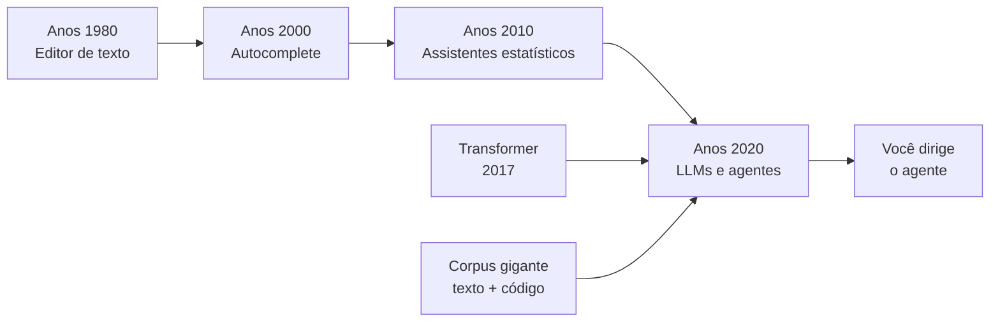

# Capítulo 1: A Nova Revolução Industrial do Software

## 1. Introdução

Você está prestes a entrar em uma oficina onde a ferramenta mais poderosa não é um martelo, nem uma chave de fenda — é uma máquina que escreve código a partir de comandos falados em linguagem natural. Em poucos anos, programar deixou de ser escrever cada linha de código para ser dirigir agentes que escrevem linhas por você. Este capítulo mostra o salto que o software está vivendo: o mesmo salto que a humanidade deu da enxada para a máquina. Ao final, você será capaz de explicar por que a programação assistida por inteligência artificial é a maior mudança do ofício desde o surgimento das linguagens de alto nível — e por que este é o melhor momento da história para começar a aprender.

## 2. Explica

### A evolução da assistência de código

Para entender o presente, é preciso olhar para trás. Nos anos 1980, programar significava digitar cada caractere em editores de texto brutos. Nos anos 2000, os autocompletes sugeriam nomes de variáveis e completavam palavras-chave — uma ajuda útil, porém mecânica, incapaz de entender o que você queria fazer. Na década de 2010, assistentes baseados em heurísticas e modelos estatísticos começaram a sugerir trechos de código, mas sempre limitados ao que já tinha sido escrito antes naquele projeto [1].

A virada aconteceu com os modelos de linguagem de grande escala (LLMs). Diferente das ferramentas anteriores, um LLM não apenas completa o que você digita: ele entende a intenção por trás do pedido, gera código novo, explica o que fez e corrige erros. Estudos mostram que a adoção de assistentes de código como o GitHub Copilot acelerou a difusão de código gerado por IA em escala global, com um classificador neural rastreando essa adoção em mais de 30 milhões de commits [2].

### O que é um LLM e por que o Transformer mudou o jogo

A base de tudo é a arquitetura Transformer, introduzida em 2017 por Vaswani e colaboradores [3]. O segredo do Transformer é o mecanismo de atenção: em vez de processar palavras uma a uma como os modelos anteriores, ele processa sequências inteiras em paralelo, calculando o quanto cada palavra deve "prestar atenção" nas outras. Essa capacidade permitiu treinar modelos com bilhões de parâmetros sobre textos e códigos em escala nunca antes vista. O resultado são modelos que não decoram código, mas que aprendem padrões profundos de como programas são escritos — a sintaxe, a lógica, os padrões de projeto e até o estilo das equipes [4].

Um LLM é uma máquina de previsão de próxima palavra treinada em um corpus gigante. Quando você pede "escreva uma função que valide um CPF", o modelo calcula, passo a passo, qual é a sequência de tokens mais provável que resolve seu pedido. É por isso que os assistentes modernos parecem entender intenção: na prática, eles modelaram uma distribuição de probabilidade sobre linguagem e código que funciona surpreendentemente bem [5].

### Por que hoje é o melhor momento para aprender

O momento atual é historicamente único por três razões. Primeiro, as ferramentas de código assistido gratuitas e acessíveis explodiram: existem agentes de código open source que rodam no seu computador sem custo, usando modelos locais ou provedores com planos gratuitos. Segundo, a curva de aprendizado despencou: antes era preciso dominar sintaxe, compiladores e estruturas de dados antes de produzir qualquer coisa útil; hoje, um iniciante pode pedir a um agente que construa um programa funcional e aprender programação observando o código que ele escreve [6]. Terceiro, o mercado de trabalho já reflete essa mudança: empresas estão contratando profissionais que sabem dirigir agentes de IA com o mesmo entusiasmo com que contratavam programadores tradicionais há uma década [7].

Não se engane, porém: a máquina não substitui o construtor — ela o amplifica. Estudos empíricos mostram que o código gerado por IA precisa de revisão humana cuidadosa, e que a confiança cega em sugestões leva a erros sutis que o modelo não consegue detectar sozinho [8]. O valor do profissional moderno está em saber o que pedir, como inspecionar o resultado e quando intervir.

### O que muda no seu dia a dia de trabalho

Para dimensionar a mudança, vale comparar o fluxo clássico com o fluxo assistido em cada etapa do ofício. A tabela abaixo resume a transformação prática — e ela será o fio condutor de todos os capítulos deste livro:

| Etapa do ofício | Fluxo clássico (serrote) | Fluxo assistido (máquina elétrica) |
|---|---|---|
| Entender o problema | Ler requisitos e interpretar sozinho | Discutir o problema com o agente, que sugere perguntas e casos de borda |
| Escrever o código | Digitar cada linha, consultar documentação | Pedir uma solução inicial, revisar e ajustar iterativamente |
| Validar a lógica | Raciocinar sobre o fluxo manualmente | Pedir testes e casos de borda, rodar validação automática |
| Corrigir erros | Depurar linha a linha com prints | Enviar o log do erro ao agente e receber correções propostas |
| Documentar | Escrever docstrings e README por último | Pedir documentação gerada a partir do próprio código |
| Aprender | Ler livros e tutoriais em sequência | Perguntar ao agente, receber exemplos e referências sob demanda |

Perceba o padrão: em nenhuma linha a máquina remove o construtor — ela remove o *trabalho mecânico* e devolve ao profissional as decisões que exigem julgamento. Essa distinção entre tarefa mecânica e decisão de projeto é o conceito que separa quem apenas "usa IA" de quem efetivamente *dirige* agentes [5].

### Os três níveis de maturidade do construtor assistido

Ainda na fase de entendimento, é útil se localizar no caminho de aprendizado. A literatura de adoção de ferramentas de IA na engenharia de software descreve três níveis de maturidade, que usaremos ao longo de todo o livro para calibrar exercícios e expectativas:

1. **Nível 1 — Operador:** usa a IA como autocomplete glorificado. Aceita sugestões sem entender, não valida resultados e não consegue diagnosticar falhas. É o nível da "caixa preta".
2. **Nível 2 — Construtor Assistido:** usa o agente como ferramenta de bancada. Sabe pedir com precisão, inspeciona o que recebe, valida com testes e intervém quando o resultado não serve. É o nível que este livro constrói, capítulo a capítulo.
3. **Nível 3 — Capataz:** projeta a oficina inteira — escolhe modelos, configura ferramentas, define fluxos, audita qualidade. É o nível dos capítulos finais, onde você ensinará máquinas a trabalharem para você em escalas maiores [9].

A passagem entre os níveis não é linear no tempo: ela é linear na *disciplina*. Um profissional de dez anos de experiência que aceita código de IA sem executar está no Nível 1; um iniciante que adota o hábito de validar tudo está no Nível 2 em semanas. O que muda não é a idade, é o hábito.

### A dimensão econômica: por que as empresas estão investindo

Há uma quarta razão — econômica — que explica o momento. Estudos de produtividade com assistentes de código relatam ganhos expressivos em tarefas de manutenção, testes e escrita de código boilerplate: desenvolvedores que adotam ferramentas assistidas completam tarefas rotineiras em frações do tempo anterior, liberando horas para o trabalho de arquitetura e revisão [7]. Para as empresas, isso se traduz em métricas concretas: menos tempo por história, menos débito técnico de código copiado sem revisão e equipes menores conseguindo escopo maior.

Mas a mesma literatura traz um alerta importante: o ganho de velocidade não é uniforme. Em tarefas que exigem compreensão profunda de um domínio específico — segurança, regras de negócio complexas, sistemas legados — o ganho é pequeno ou até negativo quando o profissional confia demais na sugestão [4]. A conclusão prática: o retorno do investimento em IA de código depende diretamente da capacidade de revisão do time, o que reforça o papel central do construtor humano no processo.

## 3. Ilustra

Imagine a Oficina do Código: uma bancada de trabalho com as ferramentas mais modernas que existem — serras elétricas que cortam sozinhas, parafusadeiras automáticas, níveis a laser. O aprendiz que entra nessa oficina tem duas escolhas. Pode ignorar as máquinas e trabalhar só com o serrote manual, acreditando que "programador de verdade escreve cada linha". Ou pode aprender a operar as máquinas: configurá-las, calibrá-las, saber quando cortar no automático e quando cortar na mão. Os salários, os projetos e o respeito no mercado são cada vez mais da segunda categoria de construtores — os que dominam as ferramentas elétricas sem ter medo delas.



Como Construtor Assistido, você está exatamente no ponto onde a oficina trocou as ferramentas manuais pelas elétricas: quem aprende agora, aprende direto na máquina nova, sem o atraso de anos de serrote. Essa é a sua vantagem competitiva.

## 4. Técnica

### A primeira fábrica: instalando seu primeiro agente

Antes de discutir teoria, vamos colocar as mãos na bancada. O exemplo abaixo mostra como criar seu primeiro programa assistido usando a API de um modelo de linguagem. Execute em um ambiente Python 3.10+ com a biblioteca `openai` instalada:

```python
import os
import sys

try:
    from openai import OpenAI
except ImportError:
    print("Instale com: pip install openai")
    sys.exit(1)

def gerar_codigo(prompt: str, chave: str) -> str:
    """Gera código Python a partir de um prompt em linguagem natural."""
    cliente = OpenAI(api_key=chave)
    resposta = cliente.chat.completions.create(
        model="gpt-4o-mini",
        messages=[
            {
                "role": "system",
                "content": "Você é um assistente de programação. Responda apenas com código Python válido e comentários breves em português.",
            },
            {"role": "user", "content": prompt},
        ],
        temperature=0.2,
    )
    return resposta.choices[0].message.content or ""


def main() -> None:
    chave = os.environ.get("OPENAI_API_KEY", "<seu-token>")
    prompt = "Escreva uma função que receba uma lista de números e retorne a soma dos pares."
    codigo = gerar_codigo(prompt, chave)
    print(codigo)


if __name__ == "__main__":
    main()
```

### O loop do agente: planejar, agir, observar

Agentes modernos não param na primeira resposta: eles executam um loop. Planejam o passo (qual arquivo ler, qual comando rodar), agem (editam, executam), observam o resultado (erro? saída esperada?) e corrigem. O pseudocódigo abaixo formaliza esse ciclo — ele é a base de todos os agentes de código do mercado [9]:

```python
def executar_agente(tarefa: str, max_iteracoes: int = 10) -> str:
    """Executa o loop planejar-agir-observar até concluir a tarefa."""
    plano = planejar(tarefa)
    for _ in range(max_iteracoes):
        acao = escolher_acao(plano)
        resultado = executar_acao(acao)
        if tarefa_concluida(resultado):
            return resultado
        plano = revisar_plano(plano, resultado)
    raise RuntimeError("Número máximo de iterações atingido")


def planejar(tarefa: str) -> list[str]:
    """Decompõe a tarefa em passos ordenados."""
    return [f"Entender o problema: {tarefa}", "Escrever a solução", "Testar a solução"]


def escolher_acao(plano: list[str]) -> str:
    """Retorna o próximo passo do plano."""
    return plano[0] if plano else ""

def executar_acao(acao: str) -> str:
    """Simula a execução de uma ação no ambiente."""
    return f"Executado: {acao}"

def tarefa_concluida(resultado: str) -> bool:
    """Verifica se a tarefa foi concluída com sucesso."""
    return "Executado" in resultado

def revisar_plano(plano: list[str], resultado: str) -> list[str]:
    """Atualiza o plano com base no resultado observado."""
    return plano[1:] + [f"Ajustar: {resultado}"]
```

### Medindo o comportamento do modelo: temperatura na prática

Uma pergunta que todo iniciante faz é: "por que o mesmo pedido gera resultados diferentes?". A resposta está em um parâmetro chamado temperatura. Ele controla o quão criativa — ou determinística — é a resposta do modelo. Com temperatura baixa (próxima de 0), o modelo repete quase sempre a mesma resposta, ideal para código; com temperatura alta, ele explora variações, útil para ideias. O experimento abaixo mede essa diferença na prática:

```python
from openai import OpenAI
import os


def amostrar_respostas(prompt: str, temperaturas: list[float]) -> None:
    """Compara a variabilidade das respostas do modelo por temperatura."""
    cliente = OpenAI(api_key=os.environ.get("OPENAI_API_KEY", "<seu-token>"))
    for temperatura in temperaturas:
        respostas = set()
        for _ in range(3):
            resposta = cliente.chat.completions.create(
                model="gpt-4o-mini",
                messages=[{"role": "user", "content": prompt}],
                temperature=temperatura,
            )
            respostas.add(resposta.choices[0].message.content or "")
        print(f"Temperatura {temperatura}: {len(respostas)} resposta(s) diferente(s)")


if __name__ == "__main__":
    prompt = "Escreva uma função Python que retorne o maior número de uma lista."
    amostrar_respostas(prompt, [0.0, 0.7, 1.5])
```

Rode o experimento três vezes seguidas e observe o padrão: com `temperature=0.0`, o conjunto de respostas quase nunca varia; com `1.5`, quase sempre varia. Essa é a primeira evidência empírica de que o LLM é uma *máquina de probabilidade* — e explica por que código de produção deve ser gerado com temperatura baixa [5].

### Validando o código gerado

A lição mais importante da oficina: nunca aceite o que a máquina produz sem conferência. O script abaixo valida a sintaxe de qualquer arquivo Python gerado por IA — seu primeiro controle de qualidade:

```python
import ast
import sys
from pathlib import Path


def validar_sintaxe(caminho: str) -> bool:
    """Valida a sintaxe de um arquivo Python usando a AST."""
    try:
        conteudo = Path(caminho).read_text(encoding="utf-8")
        ast.parse(conteudo)
        return True
    except (SyntaxError, OSError) as erro:
        print(f"Falha na validação: {erro}")
        return False


if __name__ == "__main__":
    if len(sys.argv) != 2:
        print("Uso: python validar.py <arquivo.py>")
        sys.exit(2)
    if validar_sintaxe(sys.argv[1]):
        print("[OK] Sintaxe válida")
    else:
        sys.exit(1)
```

Essa validação automática é o embrião do que, nos capítulos 11 e 12, será o controle de qualidade completo da sua oficina.

## 5. Aplica

### Cena de contraste: o erro do aprendiz apressado

Imagine a cena: você acabou de instalar seu primeiro agente e quer impressionar o time. Um colega pede ajuda com um script que processa arquivos CSV. Você pede ao agente: "crie um script que processe CSVs" — e ele devolve 200 linhas de código que parecem perfeitas. Empolgado, você envia o código direto para o repositório, sem rodar nada.

Trinta minutos depois, o script trava em produção: ele não trata o cabeçalho dos arquivos, ignora linhas com campos vazios e usa uma biblioteca de terceiros que não estava no `requirements.txt` do projeto. O erro foi seu, não da máquina: você tratou o agente como um oráculo, não como uma ferramenta de bancada. O diagnóstico liga direto à teoria do capítulo: o LLM gera o que é *provavelmente* correto, não o que é *garantidamente* correto no seu contexto específico [8].

A correção, na prática: antes de qualquer aceite, rode o código, teste com dados reais, valide a sintaxe (como no script da seção Técnica) e leia as partes críticas. O fluxo profissional é: pedir → rodar → testar → revisar → integrar. Nunca pule etapas.

### Armadilhas comuns do construtor iniciante

- Pedir tarefas gigantes de uma vez — o agente erra em proporção ao tamanho do pedido.
- Aceitar código sem executar — o maior erro estatístico relatado na literatura [8].
- Não declarar o formato esperado da resposta (arquivo, função, comando) no prompt.
- Ignorar erros de execução e re-pedir sem fornecer o log do erro ao agente.
- Usar temperatura alta para tarefas de produção, gerando respostas instáveis.
- Misturar modelos diferentes para a mesma tarefa sem documentar qual foi usado.
- Tratar o agente como substituto da leitura: pedir, colar e esquecer o código no repositório.

### Roteiro prático da primeira semana

Para consolidar o Nível 2, use o roteiro abaixo — ele transforma a teoria deste capítulo em hábito verificável. Cada item tem um resultado concreto que você deve ser capaz de mostrar:

| Dia | Ação | Entregável | Validação |
|---|---|---|---|
| 1 | Instalar um agente de código e fazer a primeira conversa | Prompt + resposta | A resposta resolve um problema real seu |
| 2 | Gerar um script com temperatura baixa e rodar | Script executando | Executa sem erro com dados reais |
| 3 | Validar o script com o validador de sintaxe da seção Técnica | Relatório de validação | `[OK] Sintaxe válida` no terminal |
| 4 | Pedir ao agente testes para o script e executar | Suite de testes | Testes passam; pelo menos um caso de borda |
| 5 | Reenviar ao agente um erro real com o log completo | Correção aplicada | O erro original desapareceu |
| 6 | Escrever uma linha de explicação para cada função gerada | Comentário/docstring | Você consegue explicar sem ajuda |
| 7 | Registrar no seu caderno: 3 erros que o agente cometeu | Anotações | Você identifica o padrão dos erros |

O dia 7 é o mais importante: anotar os erros do agente transforma a experiência em diagnóstico. Na maioria dos casos, você descobrirá que os erros seguem padrões — contexto incompleto no prompt, formato não especificado, biblioteca errada. Cada padrão anotado é uma correção que você aprenderá a aplicar preventivamente nos próximos capítulos.

### Exercícios do construtor

1. **O mestre de obras do seu dia a dia**: escolha uma tarefa que você faz com um agente de IA hoje (responder e-mail, gerar planilha, criar texto). Descreva em três linhas: o que a tarefa exige, o que o agente faz bem e onde você precisa intervir.
2. **Contrato de uma linha**: escreva o contrato de uma tarefa doméstica ("peça ao agente que planeje o jantar da semana") em exatamente uma frase — entrada, transformação e saída. Refaça até a frase caber em uma linha.
3. **Decomposição do pão de queijo**: desmonte uma receita do seu dia (preparar café, arrumar a mochila) em cinco passos, como a receita de pão de queijo do capítulo. Cada passo deve ser verificável.
4. **Parceiro de prancheta**: releia a analogia da prancheta (contexto) e responda: qual é a sua "prancheta" de trabalho — o que você precisa lembrar antes de começar uma tarefa complexa?
5. **O prumo do canteiro**: liste três critérios que você usaria para saber que uma tarefa foi bem-feita (como o prumo mede a parede). Seja específico: "a planilha abre sem erros" vale mais que "ficou boa".
6. **Assistido vs. automático**: separe as tarefas do seu trabalho em duas colunas: as que pedem um agente (fazem parte, você supervisiona) e as que pedem um script (sem humano no meio). Explique o critério que você usou.
7. **Diálogo de obra**: escreva o diálogo de duas frases entre você e o agente sobre uma tarefa mal explicada — uma frase vaga e a resposta que você receberia. Depois reescreva a frase com contrato completo.
8. **O que é a sua obra**: responda em um parágrafo: qual é a obra que você quer construir com assistência de IA neste ano? Aplique as três perguntas do capítulo (o quê, para quem, como saber que ficou pronto).

### Glossário do capítulo

| Termo | Significado |
|---|---|
| Agente | Software que executa tarefas com autonomia parcial, seguindo instruções |
| Contrato | Descrição precisa de entrada, transformação e saída esperada de uma tarefa |
| Contexto | Informação que o agente considera ao responder — sua "prancheta de trabalho" |
| Decomposição | Quebrar um problema grande em passos pequenos e verificáveis |
| Prumo | Critério de qualidade: a medida que diz se a parede está reta |
| Mestre de obras | Humano que especifica, supervisiona e responde pela obra |
| Canteiro | Ambiente de trabalho onde a obra (o projeto) é construída |
| Assistido | Trabalho em parceria: o humano decide, a máquina executa parte |

### Erros comuns do construtor

| Erro | Sintoma | Correção do capítulo |
|---|---|---|
| Pedir sem contrato | Resposta bonita, resultado inútil | Defina entrada, transformação e saída antes de pedir |
| Delegar o julgamento | Entrega "funciona" mas não atende | Você é o mestre de obras: a decisão final é sua |
| Contexto em excesso | Agente se perde em informação | Alimente só o que a tarefa precisa |
| Esquecer o prumo | Só descobre o problema no fim | Defina os critérios de qualidade antes de começar |
| Automatizar o que não entende | Script quebra e ninguém sabe por quê | Entenda o processo antes de delegar |
| Abandonar a obra no meio | Projeto morto na segunda-feira | Peças pequenas e validade a cada passo |

### O passeio de uma hora

Reserve uma hora e percorra o capítulo em ação:

1. **Escolha uma tarefa real** do seu dia — não uma tarefa de exemplo.
2. **Escreva o contrato** em uma frase no topo de um arquivo de rascunho.
3. **Decomponha** a tarefa em três passos verificáveis, numerados.
4. **Defina o prumo**: três critérios objetivos de "ficou pronto".
5. **Peça ao agente** a tarefa usando contrato, passos e prumo no prompt.
6. **Receba e meça**: a resposta atende aos três critérios? Marque sim ou não ao lado de cada um.
7. **Itere uma vez**: refaça o prompt apenas com o que faltou.
8. **Registre** no final do arquivo: o que funcionou, o que faltou, quanto tempo levou.
9. **Repita o passeio** amanhã com outra tarefa — a constância ensina mais que o volume.
10. **Compare os registros** no fim da semana: seu contrato ficou melhor? Suas instruções ficaram mais curtas?

### Perguntas e respostas do capítulo

- **Preciso saber programar para usar este capítulo?** Não. As lições valem para qualquer tarefa com agentes — as ferramentas mudam, a dança é a mesma.
- **O agente não vai simplesmente fazer tudo?** Ele faz a execução. O capítulo existe porque a execução sem contrato, sem contexto e sem prumo produz obras tortas.
- **E se o agente errar?** Ele vai errar — e você vai corrigir. O mestre de obras não é o que nunca erra; é o que mede antes de assinar a parede.
- **Quanto tempo leva para dominar?** O método cabe em uma hora de passeio por capítulo. O domínio vem da repetição: cada ciclo com contrato e prumo deixa o próximo mais rápido.
- **Isto é sobre o futuro do meu emprego?** É sobre o futuro do seu ofício: o construtor que especifica, supervisiona e responde não é substituído — é aumentado.

### Você sabe que dominou quando...

1. Escreve o contrato de uma tarefa em uma frase antes de pedir.
2. Separa em três passos verificáveis qualquer tarefa que recebe.
3. Define o prumo (critérios de pronto) antes de começar, não depois.
4. Reconhece a diferença entre "o agente respondeu" e "a tarefa foi cumprida".
5. Decompõe uma tarefa grande sem pânico, peça por peça.
6. Explica a dança do mestre de obras para outra pessoa sem consultar o capítulo.

### Resumo em pontos

- O construtor assistido especifica, supervisiona e responde — o agente executa.
- Contrato, contexto e prumo são os três tijolos de toda tarefa bem pedida.
- Decompor é a ferramenta contra o medo do tamanho.
- A régua do capítulo: você é o mestre de obras, não o operário da máquina.
- Aprender a pedir bem é a primeira obra que todo construtor deve construir.

### Desafio de aprofundamento

Escreva, em uma página, o "AGENTS.md pessoal" do seu canteiro: sua missão, suas regras de trabalho com agentes (o que você aceita delegar, o que nunca delega) e o seu prumo — os três critérios que definem um dia bem-feito. Leia-o no começo de cada semana e revise a cada mês: esse documento é o contrato mais importante que você vai assinar com você mesmo.

### Conexão com o próximo capítulo

Agora que o canteiro está definido, o próximo capítulo entra no ofício do pedreiro: como transformar qualquer pedido em um prompt de construção que o agente entende de primeira. O prumo que você definiu aqui será a régua de avaliação de lá.

## 6. Conclusão

Você viu a evolução que levou do editor de texto ao agente autônomo, entendeu o papel do Transformer como motor dessa mudança e por que este é o melhor momento para aprender a programar com IA. Construiu seu primeiro programa assistido, formalizou o loop planejar-agir-observar e criou sua primeira validação de sintaxe. O desafio desta semana: gere um script com um agente, valide-o com o script da seção Técnica e escreva uma linha de explicação para cada função gerada. No Capítulo 2, você vai abrir o capô dessa máquina e entender, token por token, como um agente realmente escreve código — e onde estão seus limites.

## 7. Referências Bibliográficas

[1] COPILOT. *GitHub Copilot documentation*. Disponível em: https://docs.github.com/en/copilot. Acesso em: 06 ago. 2026.

[2] CLASSIFICADOR NEURAL. *Diffusion of AI-generated code across developers* (Science, 2026). Disponível em: https://www.science.org. Acesso em: 06 ago. 2026.

[3] VASWANI, Ashish et al. *Attention Is All You Need*. Disponível em: https://arxiv.org/abs/1706.03762. Acesso em: 06 ago. 2026.

[4] LIU, Jiawei et al. *Is Your Code Generated by ChatGPT Really Correct?* (ACM TOSEM, 2024). Disponível em: https://dl.acm.org. Acesso em: 06 ago. 2026.

[5] SPRINGER. *Applied Intelligence survey on LLM-based code generation* (2026). Disponível em: https://link.springer.com/article/10.1007/s10489-026-07230-0. Acesso em: 06 ago. 2026.

[6] OPENCODE. *OpenCode: agentic coding CLI*. Disponível em: https://opencode.ai. Acesso em: 06 ago. 2026.

[7] IEEE ACCESS. *Coding Agents in the Wild* (2026). Disponível em: https://ieeexplore.ieee.org/document/10795597. Acesso em: 06 ago. 2026.

[8] PERRY, Neil et al. *Do Users Write More Insecure Code with AI Assistants?* (ACM CCS, 2023). Disponível em: https://dl.acm.org. Acesso em: 06 ago. 2026.

[9] ANTHROPIC. *Building effective agents*. Disponível em: https://www.anthropic.com/research/building-effective-agents. Acesso em: 06 ago. 2026.

[10] OPENAI. *GPT-4 Technical Report*. Disponível em: https://arxiv.org/abs/2303.08774. Acesso em: 06 ago. 2026.

[11] BUBECK, Sébastien et al. *Sparks of Artificial General Intelligence: Early Experiments with GPT-4*. Disponível em: https://arxiv.org/abs/2303.12712. Acesso em: 06 ago. 2026.

[12] CHEN, Mark et al. *Evaluating Large Language Models Trained on Code* (Codex). Disponível em: https://arxiv.org/abs/2107.03374. Acesso em: 06 ago. 2026.

[13] AUSTIN, Jacob et al. *Program Synthesis with Large Language Models* (HumanEval). Disponível em: https://arxiv.org/abs/2108.07732. Acesso em: 06 ago. 2026.

[14] ALLAMANIS, Miltiadis et al. *A Survey of Machine Learning for Big Code and Naturalness*. Disponível em: https://arxiv.org/abs/1709.06182. Acesso em: 06 ago. 2026.

[15] KAPLAN, Jared et al. *Scaling Laws for Neural Language Models*. Disponível em: https://arxiv.org/abs/2001.08361. Acesso em: 06 ago. 2026.

[16] NIJKAMP, Erik et al. *CodeGen: An Open Large Language Model for Code*. Disponível em: https://arxiv.org/abs/2203.13474. Acesso em: 06 ago. 2026.

[17] ROZIÈRE, Baptiste et al. *Code Llama: Open Foundation Models for Code*. Disponível em: https://arxiv.org/abs/2308.12950. Acesso em: 06 ago. 2026.

[18] ZHANG, Fengji et al. *RepoCoder: Repository-Level Code Completion through Iterative Retrieval and Generation*. Disponível em: https://arxiv.org/abs/2302.12571. Acesso em: 06 ago. 2026.

[19] GEMINI TEAM. *Gemini: A Family of Highly Capable Multimodal Models*. Disponível em: https://arxiv.org/abs/2312.11805. Acesso em: 06 ago. 2026.

[20] PENG, Yun et al. *The Impact of AI on Developer Productivity: Evidence from GitHub Copilot*. Disponível em: https://arxiv.org/abs/2302.06590. Acesso em: 06 ago. 2026.
