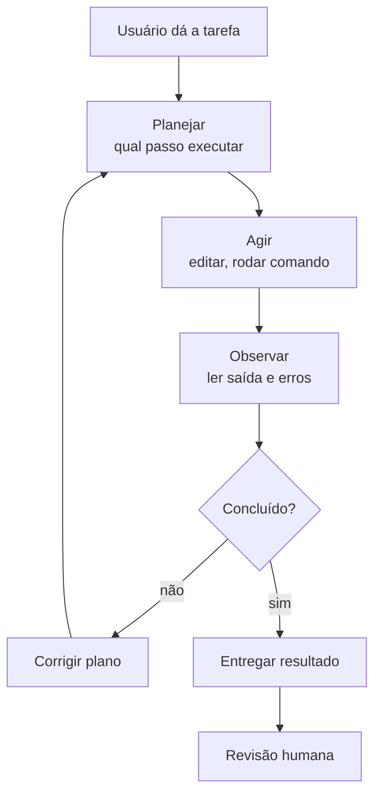

# Capítulo 2: Como um Agente Escreve Código

## 1. Introdução

No Capítulo 1, você conheceu a oficina e viu a máquina que escreve código pela primeira vez. Agora vamos abrir o capô. Este capítulo explica, em linguagem acessível, o funcionamento interno de um agente de código: como ele enxerga o mundo (tokens e janela de contexto), como decide o que fazer (o loop planejar-agir-observar) e por que ele erra (alucinação e limites). Ao final, você saberá quando confiar na máquina e quando desconfiar — a habilidade mais valiosa de um Construtor Assistido.

## 2. Explica

### Tokens: a matéria-prima que o agente enxerga

Tudo que um modelo de linguagem vê é uma sequência de tokens. Um token não é exatamente uma palavra: é um pedaço de texto — às vezes uma palavra inteira ("código"), às vezes uma sílaba ("có"), às vezes um símbolo ("{" ou "}"). Um LLM não lê caracteres nem entende palavras como você: ele recebe tokens e calcula, para cada posição, qual token tem maior probabilidade de vir a seguir [1].

Essa é a primeira lição importante: o agente não "vê" seu repositório, nem "lê" seu arquivo como um humano. Ele vê uma representação numérica do texto convertida em tokens. Isso tem consequências práticas enormes. Código mal formatado, comentários ambíguos e variáveis sem nome significativo produzem sequências de tokens que o modelo tem mais dificuldade de interpretar — por isso prompts claros e código limpo geram respostas melhores [2].

### Janela de contexto: o espaço de trabalho mental

O modelo não guarda memória: ele só enxerga o que está dentro da janela de contexto — a quantidade de tokens que cabem em uma única interação. Se o seu repositório tem 50 mil linhas e a janela comporta 200 mil tokens, o agente não lê tudo: ele precisa de estratégias para escolher o que é relevante [3].

Pense na janela de contexto como a bancada da oficina: ela tem um tamanho fixo. Se você espalhar ferramentas demais na bancada, não sobra espaço para a peça que está sendo trabalhada. Por isso, os profissionais de código assistido aprendem a gerenciar contexto — o tema do Capítulo 8 — selecionando quais arquivos abrir, quais partes do histórico resumir e o que deixar de fora.

### O loop do agente: planejar, agir, observar, corrigir

Um assistente de autocomplete responde uma vez. Um agente, não: ele opera em um loop contínuo. O padrão, descrito na literatura sobre agentes eficazes, tem quatro momentos [4]:

1. **Planejar**: o agente decide qual será o próximo passo — ler um arquivo, editar uma função, rodar um comando.
2. **Agir**: ele executa a ação escolhida por meio de ferramentas (terminal, editor, navegador de arquivos).
3. **Observar**: ele lê o resultado da ação — a saída do comando, o erro de compilação, o teste que falhou.
4. **Corrigir**: com base na observação, ele ajusta o plano e repete.

É esse loop que separa um agente de um chatbot. O chatbot responde e espera; o agente trabalha até concluir, alternando entre raciocínio e ação [4]. Estudos de campo mostram que agentes bem projetados resolvem tarefas de ponta a ponta, como corrigir bugs e abrir pull requests, com supervisão humana pontual [5].

### Alucinação: por que o agente erra

Alucinação é o nome dado ao fenômeno em que o modelo gera conteúdo confiante, bem formatado, mas factualmente ou tecnicamente errado. Não é um bug aleatório: é consequência da natureza estatística do modelo. Ele não "sabe" que seu projeto usa Python 3.10 ou que a biblioteca `requests` não está instalada — ele produz a sequência de tokens mais provável, e "mais provável" nem sempre é "correta" [6].

A alucinação se manifesta de três formas no código: funções que parecem existir mas não existem (APIs inventadas), lógica que compila mas faz a coisa errada, e citações ou referências falsas. O estudo "From Developer Pairs to AI Copilots" mostrou que desenvolvedores tendem a aceitar sugestões da IA com menos escrutínio do que em pair programming humano — exatamente o comportamento que a oficina precisa corrigir [7].

### Tipos de alucinação e como cada um se manifesta

Para combater a alucinação, o primeiro passo é reconhecer seus padrões. A literatura de pesquisa divide o fenômeno em categorias que, na prática do código assistido, aparecem com frequências muito diferentes. A tabela abaixo é o "catálogo de defeitos" do robô — memorize-a, porque ela será referência nos capítulos de validação:

| Tipo | Manifestação no código | Frequência | Como detectar |
|---|---|---|---|
| API fantasma | Função ou parâmetro que não existe na biblioteca | Alta | Rodar o código; import falha ou AttributeError |
| Referência falsa | Cita autor, norma ou doc inexistente | Alta | Conferir a URL e o título citado |
| Lógica plausível errada | Compila e roda, mas resolve o problema errado | Média | Testes com dados reais e casos de borda |
| Dado inventado | Valor, hash ou saída que não condiz com a entrada | Média | Comparar saída com cálculo manual |
| Mistura de contextos | Junta trechos de projetos/versões incompatíveis | Baixa | Ler o diff linha a linha antes do commit |
| Omissão silenciosa | Pula etapas do pedido sem avisar | Alta | Checklist do prompt contra a resposta |

A lição da tabela: os dois defeitos mais frequentes (API fantasma e referência falsa) são também os mais baratos de detectar — um teste de execução e uma busca na web resolvem. Os defeitos caros (lógica plausível errada e dado inventado) são os que exigem o escrutínio humano que a revisão de código formaliza [6].

### O papel do system prompt: as instruções permanentes do robô

Todo agente moderno carrega um conjunto de instruções fixas que vêm antes de qualquer pedido: o *system prompt*. Ele define a personalidade, as regras e os limites da máquina — é o "manual do operador" que o robô segue em todas as tarefas. No código do agente mínimo da seção Técnica, o system prompt determina que o modelo responda em JSON para que o loop consiga interpretar a ação. Sem essa instrução, o modelo responderia em prosa e o agente quebraria [16].

O system prompt importa por três razões práticas. Primeiro, ele reduz a alucinação de formato: quando o modelo sabe exatamente o formato esperado, ele o segue com muito mais consistência. Segundo, ele controla o comportamento: dizer "não invente APIs, liste apenas funções verificadas" muda visivelmente a taxa de resposta com código inválido. Terceiro, ele economiza contexto: em vez de repetir as regras em todo pedido, você as fixa uma única vez — e o modelo as aplica a cada mensagem subsequente dentro da mesma janela.

### Escolhendo o que entra na janela: a arte da prioridade

Como a bancada é limitada, todo construtor precisa de uma heurística para decidir o que mostrar ao robô. A regra prática usada por profissionais é: entre na janela apenas o que a tarefa *toca* — os arquivos que serão editados, os testes relacionados e o trecho de dados relevante; deixe de fora o que é contexto de contexto. Essa triagem é uma habilidade treinável, e o Capítulo 8 a aprofunda com técnicas de compressão e indexação; aqui, o importante é fixar o princípio: *cada token na janela custa atenção do modelo, e atenção mal gasta produz erro* [3].

## 3. Ilustra

Volte à Oficina do Código. Você agora é o Construtor Assistido e ganhou um ajudante: um robô com braço mecânico. Ele não é um mestre de obras que entende o projeto inteiro — é uma máquina extremamente habilidosa que executa o que você manda, peça por peça. Quando você diz "parafuse a viga na posição X", ele faz. Mas se você não disser a posição, ele escolhe a mais provável — e às vezes essa posição quebra a estrutura.

O robô só consegue ver a bancada (janela de contexto). Se a peça importante está do outro lado da oficina, ele não sabe que ela existe e improvisa com o que vê. O loop do agente é o ciclo natural do robô: olhar a bancada, mover o braço, verificar o resultado, ajustar.



O robô tem um defeito de fábrica: às vezes, com toda a confiança do mundo, ele parafusa onde não deve — é a alucinação. Seu trabalho como construtor não é impedir o defeito (impossível), é inspecionar cada parafuso antes de entregar a obra. A revisão humana não é opcional: é o controle de qualidade da oficina [7].

## 4. Técnica

### Implementando um agente mínimo com o loop completo

Vamos construir, em Python puro, um agente mínimo que executa o loop planejar-agir-observar com um modelo gratuito. O código abaixo usa a API da OpenAI (compatível com provedores gratuitos via OpenRouter, tema do Capítulo 3) e ferramentas reais de terminal:

```python
import json
import os
import subprocess
import sys
from typing import Any


class AgenteMinimo:
    """Agente de código com o loop planejar-agir-observar-corrigir."""

    def __init__(self, chave: str, modelo: str = "gpt-4o-mini") -> None:
        try:
            from openai import OpenAI
        except ImportError:
            print("Instale com: pip install openai")
            sys.exit(1)
        self.cliente = OpenAI(api_key=chave)
        self.modelo = modelo
        self.historico: list[dict[str, str]] = [
            {
                "role": "system",
                "content": (
                    "Você é um agente de software. Para executar comandos, "
                    "responda com JSON: {\"acao\": \"shell\", \"comando\": \"...\"} "
                    "ou {\"acao\": \"final\", \"resposta\": \"...\"}."
                ),
            }
        ]

    def perguntar(self, mensagem: str) -> str:
        """Envia a mensagem e retorna a resposta do modelo."""
        self.historico.append({"role": "user", "content": mensagem})
        resposta = self.cliente.chat.completions.create(
            model=self.modelo,
            messages=self.historico,
            temperature=0.1,
        )
        texto = resposta.choices[0].message.content or ""
        self.historico.append({"role": "assistant", "content": texto})
        return texto

    def executar_shell(self, comando: str) -> str:
        """Executa um comando no terminal e retorna a saída."""
        try:
            resultado = subprocess.run(
                comando,
                shell=True,
                capture_output=True,
                text=True,
                timeout=30,
            )
            saida = resultado.stdout + resultado.stderr
            return saida[:2000] or "(sem saída)"
        except subprocess.TimeoutExpired:
            return "(comando excedeu 30 segundos)"

    def resolver(self, tarefa: str, max_passos: int = 5) -> str:
        """Executa o loop até a resposta final."""
        mensagem = f"Tarefa: {tarefa}\nExecute os passos necessários e finalize."
        for _ in range(max_passos):
            resposta = self.perguntar(mensagem)
            try:
                decisao = json.loads(resposta)
            except json.JSONDecodeError:
                return resposta
            if decisao.get("acao") == "shell":
                observacao = self.executar_shell(decisao.get("comando", ""))
                mensagem = f"Saída do comando:\n{observacao}\nContinue."
            elif decisao.get("acao") == "final":
                return decisao.get("resposta", "")
        return "Limite de passos atingido sem conclusão."


def main() -> None:
    chave = os.environ.get("OPENAI_API_KEY", "<seu-token>")
    agente = AgenteMinimo(chave)
    tarefa = "Verifique a versão do Python instalada e diga qual é."
    print(agente.resolver(tarefa))


if __name__ == "__main__":
    main()
```

### Por que o loop corrige erros por conta própria

O poder do loop está na retroalimentação. Quando o agente roda um comando que falha, ele recebe o erro como observação e ajusta o plano. Isso transforma o processo de tentativa e erro em um ciclo controlado:

```python
def contar_linhas_de_codigo(diretorio: str) -> dict[str, int]:
    """Conta linhas de código por extensão em um diretório."""
    from pathlib import Path

    contagem: dict[str, int] = {}
    for arquivo in Path(diretorio).rglob("*"):
        if arquivo.is_file() and arquivo.suffix in {".py", ".js", ".ts"}:
            try:
                linhas = len(arquivo.read_text(encoding="utf-8").splitlines())
            except (UnicodeDecodeError, OSError):
                continue
            contagem[arquivo.suffix] = contagem.get(arquivo.suffix, 0) + linhas
    return contagem
```

### Medindo o tamanho do seu contexto na prática

Se a janela de contexto é a bancada, o construtor precisa de uma fita métrica. A biblioteca `tiktoken` da OpenAI é o padrão de mercado para contar tokens: ela usa o mesmo vocabulário do modelo, então a contagem é precisa. O script abaixo mede quanto do orçamento da janela seus arquivos consomem:

```python
import sys
from pathlib import Path


def contar_tokens(texto: str, modelo: str = "gpt-4o") -> int:
    """Conta tokens de um texto usando o tokenizador do modelo."""
    try:
        import tiktoken
    except ImportError:
        print("Instale com: pip install tiktoken")
        sys.exit(1)
    codificador = tiktoken.encoding_for_model(modelo)
    return len(codificador.encode(texto))


def orcamento_do_projeto(diretorio: str, janela: int = 128_000) -> None:
    """Imprime o consumo de tokens dos arquivos do projeto."""
    total = 0
    for arquivo in sorted(Path(diretorio).rglob("*")):
        if not arquivo.is_file() or arquivo.suffix not in {".py", ".md", ".txt"}:
            continue
        try:
            conteudo = arquivo.read_text(encoding="utf-8")
        except (UnicodeDecodeError, OSError):
            continue
        tokens = contar_tokens(conteudo)
        total += tokens
        uso = tokens / janela * 100
        print(f"{uso:6.2f}%  {tokens:7d} tokens  {arquivo}")
    print(f"\nTotal: {total:,} tokens de {janela:,} da janela ({total / janela * 100:.1f}%)")


if __name__ == "__main__":
    orcamento_do_projeto(sys.argv[1] if len(sys.argv) > 1 else ".")
```

Rode este script no seu projeto e você terá um número concreto: se o total ultrapassa a janela do modelo, o agente *necessariamente* está trabalhando sem ver partes do seu código — e aí você saberá que precisa da triagem discutida na seção Explica [8].

### Detectando alucinação: validação de existência de funções

Uma das formas mais comuns de alucinação em código é chamar funções de bibliotecas que não existem. O script abaixo varre um arquivo Python e verifica se os nomes importados existem de fato nos módulos instalados:

```python
import importlib
import re
import sys
from pathlib import Path


def verificar_imports(arquivo: str) -> list[str]:
    """Verifica se cada import do arquivo resolve para um módulo existente."""
    erros: list[str] = []
    try:
        conteudo = Path(arquivo).read_text(encoding="utf-8")
    except OSError as erro:
        return [f"Erro ao ler arquivo: {erro}"]
    for modulo in re.findall(r"^\s*(?:import|from)\s+([a-zA-Z_][a-zA-Z0-9_]*)", conteudo, re.M):
        try:
            importlib.import_module(modulo)
        except ImportError:
            erros.append(f"Módulo não encontrado: {modulo}")
    return erros


if __name__ == "__main__":
    if len(sys.argv) != 2:
        print("Uso: python verificar_imports.py <arquivo.py>")
        sys.exit(2)
    problemas = verificar_imports(sys.argv[1])
    if problemas:
        for problema in problemas:
            print(f"[ALERTA] {problema}")
        sys.exit(1)
    print("[OK] Todos os imports resolvidos")
```

## 5. Aplica

### Cena de contraste: a confiança cega no robô

Você está na Oficina do Código, trabalhando em um relatório de vendas. O robô sugeriu uma função que "agrupa as vendas por região". Parece pronta: nomes bons, comentários claros, compila perfeitamente. Você a integra sem executar — afinal, o código está bonito e o robô parecia confiante.

Na hora da apresentação, o relatório mostra números absurdos: as regiões estão duplicadas e alguns valores somados duas vezes. O diagnóstico liga direto à teoria: a função usava `pandas.groupby` de forma incorreta com dados que continham duplicatas — o modelo não sabia da característica específica dos seus dados, e você não inspecionou [6][7].

A correção: antes de integrar qualquer bloco, rode-o com uma amostra dos dados reais e compare o resultado com o esperado. O robô acerta 90% das vezes — e são os 10% errados que custam caro.

### Armadilhas comuns do Construtor Assistido

- Tratar a primeira resposta como final — o loop de correção existe justamente porque a primeira tentativa falha com frequência.
- Não fornecer o erro de volta ao agente — a observação é o combustível da correção.
- Confiar em código que "parece" correto sem rodar testes com dados reais.
- Ignorar a janela de contexto: pedir ao agente para "lembrar" de algo fora da conversa.
- Deixar o system prompt vago: sem regras de formato e limites, o modelo inventa formato.
- Colar a resposta do modelo em produção sem conferir se alguma etapa do pedido foi silenciosamente pulada.

### Protocolo de inspeção de três camadas

Para transformar a teoria da alucinação em hábito, adote o protocolo abaixo em toda tarefa que envolva código gerado. Ele combina as três defesas que a seção Explica apresentou: formatação controlada, execução obrigatória e escrutínio humano:

| Camada | Ação | Ferramenta | Pergunta que responde |
|---|---|---|---|
| 1. Formato | Exigir resposta estruturada (JSON, fenced code) | system prompt | A resposta respeitou o contrato? |
| 2. Execução | Rodar o código em um ambiente controlado | terminal + testes | O código funciona com dados reais? |
| 3. Escrutínio | Ler o diff, conferir imports e lógica crítica | revisão humana | O código faz o que o pedido pedia? |

A ordem é importante: cada camada filtra uma classe de defeito. A camada 1 captura os erros de formato (que quebrariam o loop do agente); a camada 2 captura APIs fantasma e erros de execução; a camada 3 captura a lógica plausível errada — a mais perigosa, porque só ela exige julgamento humano. Pular a camada 2 é o erro que a cena de contraste deste capítulo ilustrou com o relatório de vendas; pular a camada 3 é o erro estatisticamente mais caro relatado na literatura de segurança com assistentes de IA [7].

### Exercícios do construtor

1. **Prompt de uma frase**: pegue um pedido que você faria a um agente ("me ajuda com um texto") e reescreva-o como um prompt de uma frase com contexto, instrução e formato.
2. **O contexto que faltava**: descreva uma situação em que um prompt fracassou por falta de contexto — e reescreva o prompt acrescentando o papel do agente e a informação de fundo.
3. **Prompt com passos**: escreva um prompt que peça ao agente uma tarefa em três passos explícitos (ex.: "liste, depois explique, depois resuma"). Compare com a versão sem passos.
4. **Formato definido**: peça ao agente a mesma informação em três formatos diferentes (lista, tabela, parágrafo) e avalie qual ficou mais útil para você.
5. **Prompt negativo**: escreva um prompt que diga o que o agente NÃO deve fazer (ex.: "não use jargão, não liste mais de cinco itens") e observe a diferença na resposta.
6. **Iteração consciente**: faça três refinamentos sucessivos do mesmo pedido, registrando o que mudou em cada rodada — você está treinando o olho de curador.
7. **Papel invertido**: peça ao agente que faça perguntas sobre o seu pedido antes de executá-lo. Avalie se as perguntas revelaram informação que faltava.
8. **Prompt para a sua vida**: escreva um prompt reutilizável para uma tarefa que você repete toda semana (reunião, e-mail, relatório) e guarde-o num arquivo.

### Glossário do capítulo

| Termo | Significado |
|---|---|
| Prompt | Instrução dada ao agente para executar uma tarefa |
| Contexto | Informação de fundo que orienta a resposta |
| Instrução | A ordem clara do que deve ser feito |
| Formato | Como a resposta deve ser apresentada (lista, tabela, código) |
| Iteração | Refinar o pedido em rodadas sucessivas até acertar |
| Prompt negativo | O que o agente deve evitar fazer |
| Curador | Quem julga e refina o resultado gerado |
| Prompt reutilizável | Instrução salva para tarefas repetidas |

### Erros comuns do construtor

| Erro | Sintoma | Correção do capítulo |
|---|---|---|
| Prompt de uma palavra | Resposta genérica e inútil | Contexto + instrução + formato |
| Esquecer o formato | Resposta linda no formato errado | Diga como quer receber: lista, tabela, código |
| Pular a iteração | Desiste na primeira resposta ruim | Refine em rodadas: o curador nasce na terceira tentativa |
| Contexto escondido | O agente inventa o que você não disse | Conte o cenário antes da instrução |
| Instrução dupla | Faz as duas coisas pela metade | Um prompt, uma tarefa — divida em dois |
| Aprovar sem ler | Erro copiado do prompt para a entrega | Leia a resposta com o olho de curador |

### O passeio de uma hora

Reserve uma hora e percorra o capítulo em ação:

1. **Escolha um texto** que você precisa produzir nesta semana (e-mail, resumo, roteiro).
2. **Escreva o prompt completo**: papel do agente, contexto do texto, instrução clara e formato da resposta.
3. **Rode o prompt** e guarde a primeira resposta — não a use ainda.
4. **Refine uma vez**: acrescente apenas o que faltou (exemplo, tom, restrição de tamanho).
5. **Rode de novo** e compare: o que a segunda resposta melhorou?
6. **Refine de novo** com o prompt negativo: o que o texto não deve conter.
7. **Compare as três respostas** lado a lado e escolha a melhor — justifique a escolha em uma linha.
8. **Edite o vencedor** à mão: o que você mudou é o seu valor como curador.
9. **Salve o prompt final** num arquivo de prompts reutilizáveis.
10. **Registre** o tempo gasto e o que a iteração ensinou — amanhã você começa da versão 3, não da versão 1.

### Perguntas e respostas do capítulo

- **Por que meu prompt deu resposta errada?** Quase sempre falta um dos três ingredientes: contexto, instrução clara ou formato definido. Confira os três na ordem.
- **Prompt longo é melhor?** Não. Melhor é completo: a informação certa, sem peso morto. Excesso de contexto atrapalha tanto quanto falta.
- **Preciso refinar até ficar perfeito?** Refine até ficar útil. O curador sabe o ponto de parada: a resposta que resolve a tarefa, mesmo imperfeita.
- **O que faço com uma resposta boa?** Edite e guarde o prompt que a produziu. A iteração vencedora vira ativo reutilizável.
- **E o prompt negativo, não confunde o agente?** Quando bem escrito, ele evita erros conhecidos. O segredo é ser específico: "não use jargão" vale mais que "seja bom".

### Você sabe que dominou quando...

1. Escreve prompts com contexto, instrução e formato em um parágrafo.
2. Refina uma resposta ruim em duas rodadas sem irritação.
3. Explica por que a primeira resposta falhou — com precisão.
4. Guarda prompts vencedores como ativos reutilizáveis.
5. Escreve prompt negativo específico que funciona.
6. Ensina outra pessoa a iterar em vez de desistir.

### Resumo em pontos

- Prompt completo tem três ingredientes: contexto, instrução e formato.
- Iteração é o ofício do curador: a terceira rodada costuma ser a boa.
- Prompt negativo bem escrito evita erros conhecidos.
- Prompt vencedor é ativo: guarde, reuse, compartilhe.
- O bom prompt não é sorte: é método aplicado com constância.

### Desafio de aprofundamento

Crie o seu "livro de prompts": um arquivo com cinco prompts reutilizáveis (reunião, e-mail, relatório, revisão e aprendizado) seguindo o padrão do capítulo. Use-os por duas semanas e anote ao lado de cada um a taxa de sucesso — depois refine os dois piores e os dois melhores. No fim do mês, o arquivo é o seu maior ativo de produtividade.

### Conexão com o próximo capítulo

Os prompts do capítulo entregam o texto; o próximo capítulo garante que o texto entregue a coisa certa: requisitos claros e critérios de aceitação. Prompta bem quem sabe o que pedir — e saber o que pedir é o ofício do próximo passo.

## 6. Conclusão

Você agora entende a anatomia do agente: tokens como matéria-prima, janela de contexto como bancada, o loop planejar-agir-observar como ciclo de trabalho e a alucinação como defeito de fábrica a ser gerenciado. Construiu um agente mínimo com loop real e uma ferramenta de detecção de imports fantasma. Desafio: use o agente mínimo para resolver uma tarefa simples no seu computador (listar arquivos, somar números) e observe quantas iterações ele precisa. No Capítulo 3, você vai escolher as ferramentas certas para montar sua oficina definitiva — comparando agentes, provedores gratuitos e instalação local.

## 7. Referências Bibliográficas

[1] VASWANI, Ashish et al. *Attention Is All You Need*. Disponível em: https://arxiv.org/abs/1706.03762. Acesso em: 06 ago. 2026.

[2] SPRINGER. *Applied Intelligence survey on LLM-based code generation* (2026). Disponível em: https://link.springer.com/article/10.1007/s10489-026-07230-0. Acesso em: 06 ago. 2026.

[3] ANTHROPIC. *Building effective agents*. Disponível em: https://www.anthropic.com/research/building-effective-agents. Acesso em: 06 ago. 2026.

[4] ANTHROPIC. *How we built our multi-agent research system*. Disponível em: https://www.anthropic.com/research. Acesso em: 06 ago. 2026.

[5] IEEE ACCESS. *Coding Agents in the Wild* (2026). Disponível em: https://ieeexplore.ieee.org/document/10795597. Acesso em: 06 ago. 2026.

[6] LIU, Jiawei et al. *Is Your Code Generated by ChatGPT Really Correct?* (ACM TOSEM, 2024). Disponível em: https://dl.acm.org. Acesso em: 06 ago. 2026.

[7] ARXIV. *From Developer Pairs to AI Copilots* (2025). Disponível em: https://arxiv.org. Acesso em: 06 ago. 2026.

[8] OPENAI. *tiktoken: BPE tokenizer for OpenAI models*. Disponível em: https://github.com/openai/tiktoken. Acesso em: 06 ago. 2026.

[9] LIU, Nelson F. et al. *Lost in the Middle: How Language Models Use Long Contexts*. Disponível em: https://arxiv.org/abs/2307.03172. Acesso em: 06 ago. 2026.

[10] YAO, Shunyu et al. *ReAct: Synergizing Reasoning and Acting in Language Models*. Disponível em: https://arxiv.org/abs/2210.03629. Acesso em: 06 ago. 2026.

[11] WEI, Jason et al. *Chain-of-Thought Prompting Elicits Reasoning in Large Language Models*. Disponível em: https://arxiv.org/abs/2201.11903. Acesso em: 06 ago. 2026.

[12] SCHICK, Timo et al. *Toolformer: Language Models Can Teach Themselves to Use Tools*. Disponível em: https://arxiv.org/abs/2302.04761. Acesso em: 06 ago. 2026.

[13] XI, Zhiheng et al. *The Rise and Potential of Large Language Model Based Agents: A Survey*. Disponível em: https://arxiv.org/abs/2309.07864. Acesso em: 06 ago. 2026.

[14] JI, Ziwei et al. *Survey of Hallucination in Natural Language Generation*. Disponível em: https://arxiv.org/abs/2202.03629. Acesso em: 06 ago. 2026.

[15] RAFFEL, Colin et al. *Exploring the Limits of Transfer Learning with a Unified Text-to-Text Transformer* (T5). Disponível em: https://arxiv.org/abs/1910.10683. Acesso em: 06 ago. 2026.

[16] BROWN, Tom B. et al. *Language Models are Few-Shot Learners* (GPT-3). Disponível em: https://arxiv.org/abs/2005.14165. Acesso em: 06 ago. 2026.

[17] OUYANG, Long et al. *Training Language Models to Follow Instructions with Human Feedback* (InstructGPT). Disponível em: https://arxiv.org/abs/2203.02155. Acesso em: 06 ago. 2026.

[18] WEI, Jason et al. *Emergent Abilities of Large Language Models*. Disponível em: https://arxiv.org/abs/2206.07682. Acesso em: 06 ago. 2026.

[19] HOFFMANN, Jordan et al. *Training Compute-Optimal Large Language Models* (Chinchilla). Disponível em: https://arxiv.org/abs/2203.15556. Acesso em: 06 ago. 2026.

[20] KADAVATH, Shashank et al. *Mystery of Aligned Models: Self-Rewarding Language Models*. Disponível em: https://arxiv.org/abs/2402.04619. Acesso em: 06 ago. 2026.
