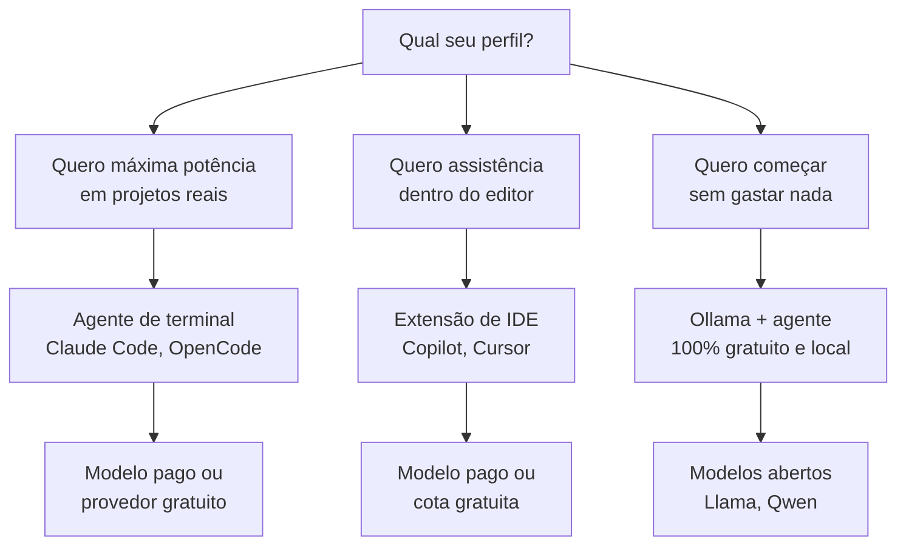

# Capítulo 3: Montando a Oficina: Escolhendo suas Ferramentas

## 1. Introdução

Nos Capítulos 1 e 2, você conheceu a máquina e entendeu seu funcionamento interno. Agora é hora de montar sua própria bancada. Este capítulo compara as principais ferramentas de código assistido — agentes de terminal, extensões de IDE e assistentes proprietários —, apresenta os provedores de modelos gratuitos e te guia pela instalação do primeiro agente de código. Ao final, você terá uma oficina funcionando, com ferramenta escolhida, modelo configurado e primeiro comando executado.

## 2. Explica

### O ecossistema de ferramentas: quatro categorias

A oferta de ferramentas de código assistido pode parecer caótica, mas se organiza em quatro categorias, cada uma com um papel distinto na oficina:

1. **Agentes de terminal (CLI)**: rodam no terminal, têm acesso ao sistema de arquivos e ao shell, e executam tarefas de ponta a ponta — como Claude Code e OpenCode. São as ferramentas mais poderosas para o fluxo de trabalho profissional porque operam no mesmo ambiente em que o código vive [1].
2. **Extensões de IDE**: integram-se ao editor (VS Code, JetBrains) e oferecem autocomplete e chat contextual — como GitHub Copilot e Cursor. São ótimas para quem quer assistência sem sair do editor [2].
3. **Assistentes proprietários de nuvem**: plataformas web com agentes completos, com custo por uso ou assinatura, voltadas a times.
4. **Ferramentas de automação e pipelines**: integradas ao CI/CD, que revisam código e geram testes automaticamente.

A escolha não é "qual é melhor", mas "qual combina com o meu fluxo de trabalho". O mercado de agentes de código é novo e está em rápida evolução: estudos sobre agentes de código em produção mostram padrões de adoção e falha que mudam a cada trimestre [3].

### Aberto vs. proprietário: o que isso significa na prática

Um agente "aberto" (open source) tem o código-fonte disponível, pode ser auditado, modificado e executado localmente — como OpenCode e ferramentas da família Claude Code. Um agente "proprietário" é controlado pela empresa que o desenvolve, com código fechado, mas geralmente com suporte mais polido.

Para o iniciante, a diferença prática importa menos do que parece. O que realmente importa são três fatores: (1) qual modelo o agente usa por padrão e se você pode trocá-lo, (2) se o agente permite provedores gratuitos, e (3) se ele roda no seu sistema operacional sem fricção [1].

### Provedores e modelos gratuitos: o motor da oficina sem custo

A peça que mais assusta iniciantes é o custo dos modelos. A boa notícia: existem caminhos 100% gratuitos para começar, e eles são perfeitamente suficientes para aprender:

- **Provedores com planos gratuitos**: serviços como OpenRouter agregam centenas de modelos e oferecem cotas gratuitas; Groq executa modelos abertos (como Llama) com altíssima velocidade e tem camada gratuita.
- **Execução local**: com Ollama, você baixa modelos abertos (Llama, Qwen, Gemma) e os executa no seu próprio computador, sem internet e sem custo. Modelos pequenos (7–8 bilhões de parâmetros) rodam bem em máquinas com 8–16 GB de RAM e são suficientes para autocompletar, explicar e gerar código simples [4].
- **Modelos embutidos nas ferramentas**: algumas ferramentas incluem modelos gratuitos com limites diários.

O segredo para começar: não compre nada. Monte a oficina com o que é grátis, aprenda o fluxo, e só depois decida se vale a pena investir em modelos melhores.

### Os cinco critérios de avaliação de uma ferramenta

Quando você for comparar ferramentas — agora ou daqui a um ano — use cinco critérios objetivos. Eles evitam que a decisão seja guiada por marketing e transformam a escolha em um processo mensurável:

| Critério | Pergunta a fazer | Onde verificar |
|---|---|---|
| Troca de modelo | Consigo usar outro provedor/modelo sem trocar de ferramenta? | Documentação, arquivo de configuração |
| Transparência | A ferramenta mostra cada ação que executa (comando, arquivo, diff)? | Log de execução, revisão de histórico |
| Custo inicial | Existe caminho gratuito suficiente para aprender? | Planos, cotas, modelos free |
| Fricção de instalação | Roda no meu sistema operacional sem conflitos? | Guia de instalação, requisitos |
| Automação | Tem permissões/approvals, integração com testes e CI? | Documentação de permissões |

Repare que "qualidade do modelo" não está na lista — não porque não importe, mas porque ela é variável (o modelo padrão de hoje pode ser trocado amanhã) e porque a ferramenta certa permite trocá-la sem migrar de ecossistema. Uma ferramenta que fixa o modelo é uma oficina com serra soldada na bancada [1].

### Privacidade: onde seu código está indo

Uma dimensão que o iniciante costuma descobrir tarde é a privacidade. Todo pedido enviado a um provedor de nuvem deixa sua máquina — e pode ser usado para treinamento, auditado por terceiros ou vazado em uma violação. O código de clientes, credenciais e segredos de negócio viajam com cada prompt. As perguntas que você deve fazer antes de escolher o provedor são: o provedor usa meus dados para treinar? As conversas ficam retidas? Existe opção de retenção zero? [8]

A tabela a seguir mostra o espectro de privacidade das opções discutidas neste capítulo:

| Opção | Dados saem da máquina? | Uso para treino | Custo |
|---|---|---|---|
| Ollama local | Não — execução 100% local | Nunca | Grátis |
| OpenRouter (cota free) | Sim | Política do provedor de origem | Grátis |
| Groq free tier | Sim | Sujeito à política pública | Grátis |
| API paga (OpenAI, Anthropic) | Sim | Configurável (retenção zero em alguns planos) | Por token |

A regra de ouro: dados sensíveis — senhas, dados de clientes, código proprietário com segredos — não entram em provedores de nuvem sem política de retenção zero. Para esses casos, a oficina local com Ollama é a única opção sem compromisso, e é exatamente por isso que a execução local é uma habilidade obrigatória do Construtor Assistido, e não um luxo [5].

### Os primeiros comandos: o vocabulário básico do agente

Independentemente da ferramenta escolhida, todo agente de terminal entende um conjunto básico de operações. Dominar esse vocabulário — e saber que ele existe — é o que transforma a primeira semana de uso de "brincadeira com chatbot" em "trabalho de oficina". Os comandos fundamentais são:

| Operação | Pergunta típica | O que o agente faz |
|---|---|---|
| Ler o projeto | "Explique o que este repositório faz" | Abre arquivos-chave e sintetiza a arquitetura |
| Modificar | "Adicione validação de email em `cadastro.py`" | Edita o arquivo e mostra o diff |
| Executar | "Rode os testes do módulo de pagamento" | Executa no terminal e reporta a saída |
| Corrigir | "O teste falhou com este erro" + log | Lê o erro, propõe correção e re-executa |
| Perguntar | "Por que esta função é lenta?" | Explica com referências ao código |
| Documentar | "Gere docstring para as funções deste módulo" | Edita o arquivo com a documentação |

Observe o padrão nas colunas: cada operação tem um *verbo de trabalho* (ler, modificar, executar, corrigir) — e o agente responde com uma *ação*, não com um conselho. É essa distinção que separa o agente do chatbot, como vimos no Capítulo 2. Quando o agente responde apenas com texto e não executa, você está diante de uma limitação de configuração — a ferramenta não está com permissão de executar, e isso precisa ser ajustado nas permissões (tema do Capítulo 6).

### Quando a oficina não funciona: diagnóstico rápido de falhas

Nenhuma instalação funciona de primeira. Os problemas mais comuns do iniciante têm sintomas e remédios conhecidos — e diagnosticá-los em minutos, em vez de horas, é uma habilidade que paga o capítulo. O quadro abaixo é o "manual de manutenção" da oficina:

| Sintoma | Causa provável | Remédio |
|---|---|---|
| "Comando não encontrado" | Ferramenta não está no PATH | Reinstalar ou adicionar ao PATH; reabrir o terminal |
| "Falha de autenticação" | Chave de API inválida ou expirada | Regenerar a chave; conferir variável de ambiente |
| "Modelo não encontrado" | Nome do modelo errado ou não baixado | `ollama pull <modelo>`; conferir ID no provedor |
| Respostas absurdas | Modelo pequeno demais para a tarefa | Trocar por modelo maior; dividir a tarefa |
| Agente não executa nada | Permissões desabilitadas | Configurar approvals/permissões da ferramenta |
| Lentidão extrema | Modelo local sem RAM suficiente | Fechar abas/processos; usar modelo menor |

A ordem de diagnóstico recomendada é sempre a mesma: verificar credenciais, verificar conexão, verificar nome do modelo, verificar permissões. Em 80% dos casos, o problema está nesses quatro pontos — e o script de verificação da seção Técnica automatiza o primeiro diagnóstico.

## 3. Ilustra

Na Oficina do Código, escolher a ferramenta é como escolher a serra elétrica: existem marcas caras, marcas baratas e serras caseiras que você monta na garagem. O aprendiz que entra na loja e compra a serra mais cara do catálogo, sem saber operar nenhuma, faz um péssimo investimento. O aprendiz sábio começa com a serra de entrada — ou com a que ele mesmo montou —, aprende a cortar direito e, quando a demanda cresce, sobe de equipamento.

O modelo do motor (o LLM) é o motor da serra; o harness (a ferramenta que conecta o modelo ao ambiente) é a estrutura da serra — o arnês que segura a lâmina no lugar [5]. Você pode ter o motor mais potente do mundo preso a um arnês frágil, e o corte sai torto. Por isso este capítulo é sobre a ferramenta inteira, não só sobre o motor.



Como Construtor Assistido, sua primeira decisão de oficina é esta: comece pelo caminho que custa zero e aprenda o fluxo completo — porque o fluxo é o mesmo em qualquer ferramenta: pedir, executar, inspecionar.

## 4. Técnica

### Instalando o Ollama e rodando um modelo local

O caminho mais gratuito e didático é o Ollama. O exemplo abaixo instala o modelo `qwen2.5-coder` (especializado em código) e testa com uma pergunta simples:

```bash
# Instalação (Windows: baixe de ollama.com; Linux/macOS):
# curl -fsSL https://ollama.com/install.sh | sh

# Baixa o modelo de código com 7 bilhões de parâmetros
ollama pull qwen2.5-coder:7b

# Gera código a partir de um prompt direto
ollama run qwen2.5-coder:7b "Escreva uma função Python que valide um número de CPF."
```

### Configurando um agente de terminal com provedor gratuito

Com o OpenCode (agente de terminal open source), você configura um provedor gratuito como OpenRouter para usar modelos sem custo. O arquivo de configuração abaixo é um ponto de partida funcional:

```json
{
  "provider": {
    "openrouter": {
      "models": ["meta-llama/llama-3.3-70b-instruct:free"],
      "apiKey": "<seu-token-do-openrouter>"
    }
  },
  "model": "openrouter:meta-llama/llama-3.3-70b-instruct:free"
}
```

Com essa configuração, o comando `opencode` abre a sessão interativa do agente no terminal, com acesso ao repositório atual.

### Comparativo rápido: qual ferramenta para qual tarefa

A tabela abaixo resume as escolhas típicas do Construtor Assistido no dia a dia:

| Tarefa | Ferramenta recomendada | Por quê |
|---|---|---|
| Autocompletar enquanto digita | Copilot / extensão de IDE | Baixa latência, sem trocar de janela |
| Refatorar um módulo inteiro | Agente de terminal (OpenCode, Claude Code) | Loop completo com execução e testes |
| Gerar um script descartável | Qualquer chat com modelo gratuito | Basta a resposta, sem ambiente |
| Aprender sem internet | Ollama local | Privacidade total, custo zero |
| Projeto profissional em equipe | Agente de terminal + CI de código | Rastreabilidade e revisão obrigatória |

### Rodando o mesmo prompt em três motores gratuitos

Uma das melhores formas de entender a diferença entre modelos é comparar a mesma pergunta em motores distintos. O script abaixo testa três caminhos gratuitos — Ollama local, Groq e OpenRouter — e imprime a resposta de cada um lado a lado:

```python
import json
import os
import subprocess
import sys


def testar_ollama(prompt: str, modelo: str = "qwen2.5-coder:7b") -> str:
    """Executa um prompt no Ollama local."""
    try:
        resultado = subprocess.run(
            ["ollama", "run", modelo, prompt],
            capture_output=True, text=True, timeout=120,
        )
        return (resultado.stdout or resultado.stderr).strip()[:500]
    except (subprocess.TimeoutExpired, FileNotFoundError) as erro:
        return f"Falha: {erro}"


def testar_groq(prompt: str, chave: str) -> str:
    """Executa um prompt no GroqCloud com um modelo aberto."""
    try:
        import requests
    except ImportError:
        return "Falha: instale requests"
    resposta = requests.post(
        "https://api.groq.com/openai/v1/chat/completions",
        headers={"Authorization": f"Bearer {chave}"},
        json={
            "model": "llama-3.3-70b-versatile",
            "messages": [{"role": "user", "content": prompt}],
            "max_tokens": 300,
        },
        timeout=60,
    )
    dados = resposta.json()
    return dados["choices"][0]["message"]["content"][:500]


def testar_openrouter(prompt: str, chave: str) -> str:
    """Executa um prompt no OpenRouter com o modelo gratuito."""
    try:
        import requests
    except ImportError:
        return "Falha: instale requests"
    resposta = requests.post(
        "https://openrouter.ai/api/v1/chat/completions",
        headers={
            "Authorization": f"Bearer {chave}",
            "Content-Type": "application/json",
        },
        json={
            "model": "meta-llama/llama-3.3-70b-instruct:free",
            "messages": [{"role": "user", "content": prompt}],
        },
        timeout=60,
    )
    dados = resposta.json()
    return dados["choices"][0]["message"]["content"][:500]


def main() -> None:
    prompt = "Explique em duas frases o que é um agente de código."
    print("=== OLLAMA (local) ===")
    print(testar_ollama(prompt))
    print("\n=== GROQ (nuvem gratuita) ===")
    print(testar_groq(prompt, os.environ.get("GROQ_API_KEY", "<chave>")))
    print("\n=== OPENROUTER (nuvem gratuita) ===")
    print(testar_openrouter(prompt, os.environ.get("OPENROUTER_API_KEY", "<chave>")))


if __name__ == "__main__":
    main()
```

Este script é o seu "bancada de testes de motores": quando um provedor ficar indisponível ou um modelo for descontinuado, você troca uma linha — e não a oficina inteira. É exatamente a portabilidade que o critério "troca de modelo" da seção Explica promete.

### Validando a instalação com um teste real

Depois de configurar, rode a verificação abaixo para confirmar que o agente está operacional:

```python
import shutil
import subprocess
import sys


def verificar_ferramentas() -> dict[str, bool]:
    """Verifica quais ferramentas de código assistido estão instaladas."""
    status: dict[str, bool] = {}
    for ferramenta in ["ollama", "opencode", "node", "python"]:
        caminho = shutil.which(ferramenta)
        status[ferramenta] = caminho is not None
    return status


def testar_ollama() -> str:
    """Executa um prompt de teste no Ollama e retorna a resposta."""
    try:
        resultado = subprocess.run(
            ["ollama", "run", "qwen2.5-coder:7b", "Responda apenas: OK"],
            capture_output=True,
            text=True,
            timeout=60,
        )
        return (resultado.stdout or resultado.stderr).strip()
    except (subprocess.TimeoutExpired, FileNotFoundError) as erro:
        return f"Falha no teste: {erro}"


if __name__ == "__main__":
    print("Ferramentas instaladas:", verificar_ferramentas())
    resposta = testar_ollama()
    print("Resposta do Ollama:", resposta)
    sys.exit(0 if "OK" in resposta else 1)
```

## 5. Aplica

### Cena de contraste: a serra mais cara do catálogo

Você está empolgado com a oficina e decide comprar a assinatura mais cara da ferramenta mais famosa, antes de entender o que está fazendo. Na primeira semana, você descobre que o agente da assinatura usa um modelo que você não pode trocar, que o plano não inclui o provedor gratuito que você queria testar, e que a interface esconde o histórico das ações — você não consegue auditar o que a máquina fez.

O diagnóstico liga à teoria: você escolheu pela marca, não pelo fluxo. A ferramenta certa para você, nesta fase, é a que oferece transparência (mostra o que faz), troca de modelo (permite provedores gratuitos) e custo zero para aprender.

A correção, na prática: cancele a assinatura, instale o OpenCode com OpenRouter gratuito (ou Ollama local), e gaste duas semanas aprendendo o fluxo pedir → executar → inspecionar. Quando a obra crescer e você souber exatamente o que precisa, escolha a ferramenta paga com critério — na ponta da necessidade, não na ponta do marketing [3].

### Armadilhas comuns na montagem da oficina

- Comprar assinatura antes de dominar o fluxo gratuito.
- Não verificar se a ferramenta permite trocar de modelo/provedor.
- Instalar tudo sem testar: configure uma ferramenta por vez e valide com o script da seção Técnica.
- Ignorar a segurança das credenciais: nunca cole uma chave de API em arquivo versionado.
- Enviar dados sensíveis para provedores de nuvem sem política de retenção zero.
- Julgar a ferramenta pelo modelo padrão de hoje, sem verificar se há troca de modelo.

### Checklist de decisão da oficina

Use esta sequência quando for montar ou revisar sua bancada — ela condensa este capítulo em uma decisão de dez minutos:

1. Defina o perfil de uso: aprendizado, projeto pessoal ou trabalho em equipe.
2. Liste os cinco critérios (troca de modelo, transparência, custo, fricção, automação) e pontue as candidatas.
3. Escolha o caminho de custo zero primeiro: OpenRouter free, Groq free tier ou Ollama local.
4. Configure uma única ferramenta e rode o script de verificação da seção Técnica até dar `[OK]`.
5. Teste o mesmo prompt nos três motores para conhecer a variação de resposta.
6. Grave no seu caderno a configuração usada (ferramenta, modelo, provedor, custo).
7. Classifique os dados que você vai manipular e decida o provedor permitido para cada classe.
8. Só então, se a demanda justificar, avalie a ferramenta paga — com os critérios na mão, não com o marketing.

### Exercícios do construtor

1. **Requisito vago × requisito testável**: pegue a frase "o sistema deve ser rápido" e reescreva-a como requisito testável com número e condição ("a página carrega em menos de 3 segundos no celular com internet 4G").
2. **A história do seu dia**: escreva uma história de usuário para uma tarefa que você faz no trabalho — "Como [quem], quero [o quê], para [por quê]". Valide se o critério de aceitação cabe em uma frase.
3. **Critérios de aceitação**: para a história do exercício anterior, liste três critérios de aceitação objetivos — cada um deve ser testável por alguém sem contexto.
4. **O protótipo da conversa**: descreva, em cinco linhas, como você testaria uma ideia de ferramenta conversando com um agente antes de escrever código.
5. **Protótipo descartável**: escolha uma ideia pequena e defina: o que o protótipo deve provar, quanto tempo você vai gastar e qual decisão ele vai alimentar.
6. **Nada é grátis**: liste três dependências de um projeto seu (biblioteca, serviço, pessoa) e, para cada uma, o que acontece se ela falhar.
7. **MVP do seu projeto**: descreva a versão mínima do seu projeto que entrega valor — o que fica fora do MVP e por quê.
8. **A pergunta de ouro**: aplique as cinco perguntas de decisão do capítulo a uma ideia que você tem — e anote a conclusão.

### Glossário do capítulo

| Termo | Significado |
|---|---|
| Requisito | Necessidade que o software deve atender |
| Requisito testável | Afirmação objetiva com critério mensurável |
| História de usuário | Formato "como/quero/para" que descreve uma necessidade |
| Critério de aceitação | Condição que prova que a entrega está pronta |
| Protótipo | Versão barata para validar ideia ou interação |
| MVP | Mínimo produto viável: a menor versão com valor |
| Dependência | Recurso externo do qual o projeto depende |
| Validação | Prova de que a ideia atende ao problema real |

### Erros comuns do construtor

| Erro | Sintoma | Correção do capítulo |
|---|---|---|
| Requisito vago | Entrega pronta, necessidade não atendida | Reescreva com número e condição testável |
| História sem critério | "Está pronto" sem prova | Critérios de aceitação objetivos desde o início |
| Confundir protótipo com produto | Protótipo vira produção sem validação | Protótipo é descartável: responde, depois jogue fora |
| Ignorar dependências | Projeto trava na primeira falha externa | Liste e planeje o que fazer quando a dependência cair |
| MVP gigante | Seis meses para lançar o básico | Corte até sobrar o mínimo com valor |
| Pular a validação | Constrói a resposta errada, bem feita | Valide o problema antes de construir a solução |

### O passeio de uma hora

Reserve uma hora e percorra o capítulo em ação:

1. **Pegue uma ideia** que você tem (função, ferramenta, página).
2. **Escreva a história de usuário**: como [quem], quero [o quê], para [por quê].
3. **Adicione três critérios de aceitação** objetivos e testáveis.
4. **Aplique as cinco perguntas** de decisão do capítulo e anote as respostas.
5. **Defina o MVP**: o que fica dentro e o que fica fora — escreva os dois "não faz parte do v1".
6. **Liste as dependências** e marque qual é a mais arriscada.
7. **Desenhe o teste do problema**: como você validaria a ideia gastando o mínimo? Uma conversa com agente? Um protótipo descartável?
8. **Execute a validação** com o agente: uma conversa de dez minutos testando a ideia.
9. **Registre a decisão**: validar, ajustar ou abandonar — e por quê.
10. **Guarde o registro**: é a prova de que a sua próxima construção parte de uma decisão, não de um palpite.

### Perguntas e respostas do capítulo

- **Preciso de requisito formal para ideias pequenas?** Preciso de clareza — mesmo uma linha. A formalidade cresce com o tamanho da obra.
- **Protótipo é desperdício?** É investimento barato em decisão cara. O protótipo descartável que mata uma ideia errada economizou semanas.
- **Quando abandono uma ideia?** Quando o teste do problema falha: a necessidade não existe, já é atendida ou você não consegue descrevê-la. Abandonar com dados é decisão, não fracasso.
- **O MVP é para todos os projetos?** Para os que valem construir. Para os que não valem, o MVP revela isso mais cedo — que é exatamente o trabalho dele.
- **E se a dependência crítica falhar?** Você tem o plano escrito do capítulo: o que acontece, quem resolve, quanto tempo. Dependência sem plano é aposta.

### Você sabe que dominou quando...

1. Transforma qualquer ideia em história de usuário com critérios de aceitação.
2. Reescreve requisito vago em requisito testável sem ajuda.
3. Desenha o teste do problema antes de escrever código.
4. Define MVP cortando sem pena o que não é essencial.
5. Lista dependências e seus planos B.
6. Diz "abandonei com dados" sem culpa.

### Resumo em pontos

- Requisito vago produz entrega errada: reescreva com número e condição.
- História de usuário + critérios de aceitação = a mesma linguagem para todos.
- Protótipo responde pergunta; MVP entrega valor; dependência tem plano B.
- Valide o problema antes de construir a solução — sempre.
- Ideia boa é a que sobrevive ao teste do problema; o resto é palpite com orçamento.

### Desafio de aprofundamento

Pegue uma ideia que você defende há meses e submeta-a ao teste do problema do capítulo: escreva a história de usuário, os critérios de aceitação e o teste de validação mais barato possível — uma conversa com agente, um protótipo descartável ou uma pesquisa com três pessoas. Execute o teste em uma semana e escreva o veredito em um parágrafo: validar, ajustar ou abandonar. Esse parágrafo vale mais que meses de planejamento.

### Conexão com o próximo capítulo

Com o requisito validado e o MVP cortado, o próximo capítulo ensina a transformar essa clareza em spec: o documento que o agente lê e o aceite que você confere. Requisito bom é a metade da spec pronta.

## 6. Conclusão

Você mapeou as quatro categorias de ferramentas, entendeu a diferença entre aberto e proprietário, conheceu os caminhos gratuitos (OpenRouter, Groq, Ollama) e instalou sua primeira oficina com um modelo local e um agente de terminal configurado. Desafio: instale o Ollama, baixe o modelo de código e use o script de verificação para confirmar que tudo está operacional. No Capítulo 4, você vai aprender a falar com a máquina: prompt engineering para iniciantes, sem jargão acadêmico.

## 7. Referências Bibliográficas

[1] OPENCODE. *OpenCode: agentic coding CLI*. Disponível em: https://opencode.ai. Acesso em: 06 ago. 2026.

[2] COPILOT. *GitHub Copilot documentation*. Disponível em: https://docs.github.com/en/copilot. Acesso em: 06 ago. 2026.

[3] IEEE ACCESS. *Coding Agents in the Wild* (2026). Disponível em: https://ieeexplore.ieee.org/document/10795597. Acesso em: 06 ago. 2026.

[4] OLLAMA. *Ollama: run large language models locally*. Disponível em: https://ollama.com. Acesso em: 06 ago. 2026.

[5] ANTHROPIC. *Building effective agents*. Disponível em: https://www.anthropic.com/research/building-effective-agents. Acesso em: 06 ago. 2026.

[6] OLLAMA. *ollama/ollama — repositório oficial*. Disponível em: https://github.com/ollama/ollama. Acesso em: 06 ago. 2026.

[7] OPENROUTER. *Documentação oficial*. Disponível em: https://openrouter.ai/docs. Acesso em: 06 ago. 2026.

[8] GROQ. *GroqCloud documentation*. Disponível em: https://console.groq.com/docs. Acesso em: 06 ago. 2026.

[9] ANTHROPIC. *Claude Code documentation*. Disponível em: https://docs.anthropic.com/en/docs/claude-code. Acesso em: 06 ago. 2026.

[10] HUGGING FACE. *Open LLM Leaderboard*. Disponível em: https://huggingface.co/spaces/open-llm-leaderboard/open_llm_leaderboard. Acesso em: 06 ago. 2026.

[11] QWEN TEAM. *Qwen2.5-Coder Technical Report*. Disponível em: https://arxiv.org/abs/2409.12186. Acesso em: 06 ago. 2026.

[12] TEAM GEMMA. *Gemma: Open Models Based on Gemini Research and Technology*. Disponível em: https://arxiv.org/abs/2403.08295. Acesso em: 06 ago. 2026.

[13] JIANG, Albert Q. et al. *Mixtral of Experts*. Disponível em: https://arxiv.org/abs/2401.04088. Acesso em: 06 ago. 2026.

[14] OPENAI. *Platform documentation*. Disponível em: https://platform.openai.com/docs. Acesso em: 06 ago. 2026.

[15] MODEL CONTEXT PROTOCOL. *Documentação oficial*. Disponível em: https://modelcontextprotocol.io. Acesso em: 06 ago. 2026.

[16] MICROSOFT. *Visual Studio Code documentation*. Disponível em: https://code.visualstudio.com/docs. Acesso em: 06 ago. 2026.

[17] JETBRAINS. *JetBrains AI Assistant*. Disponível em: https://www.jetbrains.com/ai/. Acesso em: 06 ago. 2026.

[18] MISTRAL AI. *Mistral 7B*. Disponível em: https://arxiv.org/abs/2310.06825. Acesso em: 06 ago. 2026.

[19] GRATTAFIORI, Aaron et al. *The Llama 3 Herd of Models*. Disponível em: https://arxiv.org/abs/2407.21783. Acesso em: 06 ago. 2026.

[20] DOCKER. *Docker documentation*. Disponível em: https://docs.docker.com. Acesso em: 06 ago. 2026.
