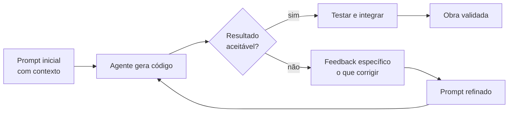

# Capítulo 4: Falando com Máquinas: Prompt Engineering para Iniciantes

## 1. Introdução

Sua oficina está montada: a serra está ligada, o motor configurado. Mas você ainda não sabe se comunicar com a máquina — e uma serra mal operada corta torto. Este capítulo ensina prompt engineering para iniciantes: como pedir coisas a um agente de código de forma clara, iterativa e produtiva, sem jargão acadêmico. Ao final, você será capaz de escrever prompts que geram código melhor na primeira tentativa — e de refinar pedidos quando o resultado vier errado.

## 2. Explica

### O que é um bom prompt: contexto, restrições e formato

Um prompt é a instrução que você dá ao modelo. A qualidade do código gerado depende menos do modelo e mais da qualidade do prompt — um resultado amplamente confirmado na literatura de engenharia de prompt [1]. Um bom prompt tem três ingredientes:

1. **Contexto**: o que o modelo precisa saber sobre a situação. Qual linguagem? Qual framework? Qual versão? Existe código existente? Fornecer contexto correto evita que o modelo invente premissas.
2. **Restrições**: o que NÃO fazer. "Não use bibliotecas externas", "compatível com Python 3.9", "sem async", "trate erros de arquivo ausente". Restrições transformam código genérico em código adequado ao seu projeto.
3. **Formato esperado**: como a resposta deve ser entregue. "Responda com uma única função chamada `calcular_imposto`", "retorne JSON", "explique em 3 linhas o que o código faz".

Um prompt vago ("crie um script de vendas") produz código vago. Um prompt especificado ("crie uma função `resumo_vendas` que receba uma lista de pedidos e retorne o total e a média por vendedor, em Python puro, tratando listas vazias") produz código que você pode usar de verdade [2].

### Técnicas essenciais: few-shot, cadeia de pensamento e iteração

Três técnicas cobrem 90% das necessidades do iniciante:

- **Few-shot (exemplos)**: mostrar exemplos de entrada e saída esperada no prompt. O modelo imita o padrão. Exemplo: "Abaixo, um par de exemplos. A entrada é uma frase, a saída é o mesmo texto em maiúsculas. Entrada: 'olá'. Saída: 'OLÁ'. Agora: 'bom dia'." Funciona porque o modelo é excelente em continuar padrões [3].
- **Cadeia de pensamento (chain-of-thought)**: pedir que o modelo raciocine passo a passo antes de responder. "Pense passo a passo e depois escreva o código." Estudos mostram que essa instrução simples melhora significativamente a precisão em tarefas de raciocínio e programação [4].
- **Iteração**: o prompt raramente é perfeito na primeira vez. O fluxo profissional é: pedir, avaliar o resultado, dar feedback específico ("isso quebra se a lista estiver vazia"), repetir. Cada iteração refina o pedido com o conhecimento do que a máquina entendeu errado [5].

### Do prompt ao projeto: dividir pedidos grandes em pedidos pequenos

O erro mais comum do iniciante é pedir um projeto inteiro de uma vez: "crie um sistema de vendas completo com login, carrinho e relatórios". O modelo responde com um amontoado de código genérico que não funciona em conjunto. A prática profissional é decompor: cada prompt resolve uma peça pequena e testável — primeiro a função de autenticação, depois a tela de login, depois a persistência [2].

A decomposição tem um bônus de controle: como cada peça é pequena, você consegue inspecionar, testar e validar o que o agente entregou — o ciclo de qualidade da oficina funciona em escala humana.

### Anti-padrões: o que enfraquece um prompt

Assim como existem padrões que funcionam, existem padrões que sistematicamente degradam a qualidade das respostas. Reconhecer esses anti-padrões nos seus próprios pedidos é mais valioso do que decorar templates. O quadro abaixo lista os mais comuns, com o sintoma observável e a correção correspondente:

| Anti-padrão | Sintoma | Correção |
|---|---|---|
| Pedido vago de escopo | Resposta genérica ou com supérfluos | Definir entrada, saída e limites |
| Instruções conflitantes | Código que viola uma das regras | Uma regra por frase; sem contradições |
| Contexto oculto | Modelo inventa premissas erradas | Declarar versões, libs, formato de dados |
| Tom ambíguo | Resposta que não decide entre opções | Pedir decisão explícita ou justificativa |
| Negação dupla | Modelo faz exatamente o que você não queria | Reformular em positivo |
| Jargão não definido | Uso incorreto de termos técnicos | Definir termos antes de usá-los |
| Sem ponto de parada | Resposta que segue além do pedido | Fixar formato e extensão máxima |

Observe que todos os anti-padrões têm uma causa comum: o modelo executa a *forma* do pedido, não a *intenção* — e a forma confusa gera execução confusa. A boa notícia é que prompt é texto: você sempre pode corrigir a planta e pedir de novo, sem custo de material [5].

### A anatomia da conversa: system, user e o histórico

Todo prompt enviado a um agente é na verdade uma sequência de mensagens com papéis distintos, e entender essa anatomia melhora imediatamente a forma de pedir. O papel *system* carrega as regras permanentes da sessão — o papel do construtor, o estilo, as proibições. O papel *user* traz cada pedido concreto. O papel *assistant* guarda as respostas anteriores — e é ele que permite a iteração: quando o modelo "lembra" do que respondeu, é porque as respostas anteriores voltam na mensagem seguinte.

Na prática do agente de código, essa distinção tem três consequências úteis. Primeira: regras de projeto (linguagem, convenções, proibições) devem viver no system — assim não precisam ser repetidas em cada pedido, economizando tokens e evitando esquecimento. Segunda: o feedback de iteração deve ser explícito sobre a resposta anterior ("a função X falha quando..."), e não genérico ("está errado") — o modelo precisa saber o que mudou entre as versões. Terceira: sessões longas acumulam histórico e enchem a janela; quando a conversa fica lenta ou o modelo "esquece" o início, é hora de abrir uma nova sessão com um resumo das regras — o embrião do gerenciamento de contexto do Capítulo 7 [6].

## 3. Ilustra

Na Oficina do Código, o prompt é a planta que você entrega ao mestre de obras. Se a planta diz "construa uma casa", o mestre constrói uma casa qualquer — talvez sem banheiro, talvez sem fundação, talvez de dois andares quando você queria um sobrado. Se a planta especifica cômodos, medidas, materiais e prazos, o mestre constrói exatamente o que você desenhou.

O construtor experiente nunca entrega uma planta vaga. Ele sabe que a máquina é literal: ela executa o que está escrito, não o que estava na sua cabeça. E quando a obra sai errada, ele não xinga a máquina — ele corrige a planta e manda de novo.



Como Construtor Assistido, lembre-se: a planta é sua responsabilidade. O mestre (agente) executa; você especifica e inspeciona.

## 4. Técnica

### O modelo de prompt em três camadas

Uma forma prática de estruturar prompts é a sequência: papel → contexto → tarefa → formato. O exemplo abaixo mostra um prompt profissional para gerar uma função:

```text
Você é um desenvolvedor sênior Python.

Projeto: um script de análise de vendas em Python puro (sem pandas).
Contexto: a lista de pedidos pode conter itens duplicados e listas vazias.

Tarefa: escreva a função resumo_vendas(pedidos) que recebe uma lista de
pedidos no formato {"vendedor": str, "valor": float} e retorna um dicionário
com o total geral e o total por vendedor. Trate listas vazias retornando zeros.

Formato: apenas a função completa, com docstring em português e tratamento
de erros básico. Não use type hints de bibliotecas externas.
```

### Um helper Python para iterar prompts com o agente

Para exercitar a iteração de forma sistemática, o script abaixo permite enviar um prompt, guardar o histórico e refinar o pedido com feedback:

```python
import os
import sys
from pathlib import Path


class SessaoPrompt:
    """Gerencia uma sessão de prompt com histórico para iteração."""

    def __init__(self, chave: str, modelo: str = "gpt-4o-mini") -> None:
        try:
            from openai import OpenAI
        except ImportError:
            print("Instale com: pip install openai")
            sys.exit(1)
        self.cliente = OpenAI(api_key=chave)
        self.modelo = modelo
        self.mensagens: list[dict[str, str]] = [
            {
                "role": "system",
                "content": "Você é um desenvolvedor sênior. Entregue código limpo e objetivo.",
            }
        ]

    def pedir(self, mensagem: str) -> str:
        """Envia uma mensagem e retorna a resposta, registrando no histórico."""
        self.mensagens.append({"role": "user", "content": mensagem})
        resposta = self.cliente.chat.completions.create(
            model=self.modelo,
            messages=self.mensagens,
            temperature=0.2,
        )
        texto = resposta.choices[0].message.content or ""
        self.mensagens.append({"role": "assistant", "content": texto})
        return texto

    def refinar(self, feedback: str) -> str:
        """Itera sobre a resposta anterior com feedback específico."""
        return self.pedir(
            "O código acima precisa de ajustes. "
            f"Feedback: {feedback}\nEntregue a versão corrigida completa."
        )

    def salvar(self, caminho: str) -> None:
        """Salva o histórico da sessão em Markdown."""
        blocos = [f"# Sessão de prompt\n"]
        for mensagem in self.mensagens:
            papel = mensagem["role"]
            blocos.append(f"\n## {papel.capitalize()}\n\n{mensagem['content']}\n")
        Path(caminho).write_text("".join(blocos), encoding="utf-8")


def main() -> None:
    chave = os.environ.get("OPENAI_API_KEY", "<seu-token>")
    sessao = SessaoPrompt(chave)
    primeira = sessao.pedir(
        "Escreva uma função que conte palavras em um texto, em Python puro."
    )
    print(primeira)
    revisada = sessao.refinar("Ignore pontuação e trate quebras de linha como separadores.")
    print(revisada)
    sessao.salvar("sessao_prompt.md")


if __name__ == "__main__":
    main()
```

### Checklist de qualidade do prompt: um validador prático

Antes de enviar qualquer prompt, confira-o com a lista abaixo — ela automatiza a disciplina das seções anteriores. O script lê um prompt de um arquivo e avalia presença dos ingredientes obrigatórios, apontando o que falta:

```python
import re
import sys
from pathlib import Path

INGREDIENTES = [
    ("contexto", r"projeto|linguagem|versão|framework|contexto"),
    ("restricao", r"não|sem |apenas|somente|evite|proibido"),
    ("formato", r"retorne|responda|formato|json|função|docstring"),
    ("exemplo", r"exemplo|entrada|saída|esperado"),
    ("tarefa", r"crie|escreva|implemente|gere|refatore"),
]


def auditar_prompt(caminho: str) -> None:
    """Audita um prompt Markdown quanto aos ingredientes essenciais."""
    try:
        texto = Path(caminho).read_text(encoding="utf-8")
    except OSError as erro:
        print(f"Erro ao ler: {erro}")
        sys.exit(2)
    texto_normalizado = texto.lower()
    presentes = 0
    for nome, padrao in INGREDIENTES:
        tem = re.search(padrao, texto_normalizado) is not None
        presentes += tem
        print(f"[{'OK' if tem else 'FALTA'}] {nome}")
    if presentes < 4:
        print("\nPrompt fraco: revise antes de enviar ao agente.")
        sys.exit(1)
    print("\nPrompt pronto para envio.")


if __name__ == "__main__":
    auditar_prompt(sys.argv[1])
```

Rode o validador nos seus prompts por uma semana e você verá o padrão: os prompts que falham na auditoria são exatamente os que geram código que precisa de três rodadas de correção.

### Decompondo um projeto em prompts pequenos

A tabela abaixo mostra como decompor um projeto real — um CLI de tarefas — em prompts testáveis, cada um com escopo fechado:

| Prompt | Escopo | Validação |
|---|---|---|
| 1 | Função `adicionar_tarefa(lista, descricao)` | Teste de unidade |
| 2 | Função `listar_tarefas(lista)` com formatação | Teste de unidade |
| 3 | Função `concluir_tarefa(lista, indice)` com validação de índice | Teste de unidade |
| 4 | Loop de menu no terminal orquestrando as três funções | Teste manual |

Cada prompt seguinte reutiliza o código do anterior — e você inspeciona cada peça antes de pedir a próxima:

```python
def adicionar_tarefa(lista: list[str], descricao: str) -> list[str]:
    """Adiciona uma tarefa à lista e retorna a nova lista."""
    if not descricao.strip():
        raise ValueError("A descrição da tarefa não pode ser vazia")
    return lista + [descricao.strip()]


def listar_tarefas(lista: list[str]) -> str:
    """Retorna a lista formatada com numeração."""
    if not lista:
        return "Nenhuma tarefa pendente."
    linhas = [f"{indice + 1}. {tarefa}" for indice, tarefa in enumerate(lista)]
    return "\n".join(linhas)


def concluir_tarefa(lista: list[str], indice: int) -> list[str]:
    """Remove a tarefa no índice informado, validando os limites."""
    if indice < 0 or indice >= len(lista):
        raise IndexError("Índice fora dos limites da lista")
    return [tarefa for i, tarefa in enumerate(lista) if i != indice]
```

## 5. Aplica

### Cena de contraste: a planta vaga

Segunda-feira de manhã, você está no escritório e seu gestor pede um relatório de desempenho dos vendedores. Em vez de decompor, você abre o agente e digita: "faça um sistema de relatório de vendas". O agente devolve 300 linhas com gráfico, banco de dados e uma interface web que você não pediu. Você perde duas horas tentando adaptar, e o código nem roda porque usa bibliotecas que não estão instaladas.

O diagnóstico liga à teoria: a planta estava vaga, então o mestre construiu a casa dos sonhos dele — não a sua. O erro não é do agente; é da especificação.

A correção: respire e decompose. Primeiro prompt: "função que lê um CSV de vendas e retorna total por vendedor, em Python puro". Teste. Segundo prompt: "função que formata o resultado como tabela". Teste. Em uma hora, você tem um relatório de terminal funcionando, peça por peça, com cada linha inspecionada [2].

### Armadilhas comuns do prompt engineering

- Pedir projetos inteiros em um prompt único — sempre decomponha.
- Não fornecer restrições ("não use X", "só com a biblioteca padrão").
- Esquecer o formato esperado ("retorne JSON", "uma única função").
- Não iterar: a primeira resposta é ponto de partida, não destino.
- Aceitar código sem rodar — validação e teste são parte do fluxo (Capítulos 11 e 12).
- Dar feedback genérico ("não está bom") em vez de específico ("falha quando a lista é vazia").
- Esquecer de declarar o ponto de parada ("entregue apenas a função, sem explicação").

### Caderno de prompts: o ativo que cresce com você

Um hábito que separa o iniciante do profissional é registrar os prompts que funcionam. Cada prompt bom que você escreve é um ativo reutilizável — um molde que economiza horas na próxima tarefa parecida. O caderno de prompts segue a estrutura abaixo, e o Capítulo 15 mostrará como transformá-lo em biblioteca executável:

| Campo | Exemplo |
|---|---|
| Nome | `resumo-vendas-por-vendedor` |
| Contexto | Python puro, lista de pedidos `{"vendedor", "valor"}`, pode ter duplicatas |
| Prompt | (texto completo do prompt aprovado) |
| Restrições | Sem pandas, tratar listas vazias, docstring em PT-BR |
| Formato esperado | Uma única função com docstring |
| Teste de aceite | Total por vendedor confere com cálculo manual |
| Data / versão | 2026-08-06 / v1 |

Manter o caderno tem dois efeitos colaterais poderosos. Primeiro, ele documenta o *conhecimento acumulado do seu projeto* — a versão das bibliotecas, as pegadinhas dos dados, as decisões de arquitetura — que passa a ser reutilizável em qualquer sessão nova. Segundo, ele treina seu olho: ao escrever o teste de aceite antes do prompt, você começa a pensar como engenheiro de qualidade, não como usuário de ferramenta. É o mesmo raciocínio que sustenta o desenvolvimento orientado a testes, que você verá na prática nos Capítulos 11 e 12.

### Exercícios do construtor

1. **Prompt sistemático**: escolha uma tarefa de código e escreva o prompt completo do capítulo: papel, objetivo, contexto, passos, formato e o que evitar. Compare com o que você pediria normalmente.
2. **Spec de uma função**: escreva a especificação de uma função simples (nome, parâmetros, retorno, exemplos) em markdown — como o contrato de função do capítulo.
3. **Prompt com restrições**: acrescente ao seu prompt uma restrição clara ("não use bibliotecas externas", "Python 3.11 ou anterior") e avalie como a resposta muda.
4. **Da vaga ao refinado**: transforme um prompt vago em um prompt refinado em quatro rodadas, anotando o que cada rodada melhorou.
5. **Teste de reprodutibilidade**: rode o mesmo prompt duas vezes e compare as respostas — onde a variação é aceitável e onde é problema?
6. **Orçamento de contexto**: estime os tokens do seu prompt usando a regra do capítulo e decida o que poderia ser cortado sem perder qualidade.
7. **Prompt para a pasta**: crie uma pasta `prompts/` com três prompts reutilizáveis seus, nomeados por tarefa — como o AGENTS.md, mas para você.
8. **Debrief de prompt**: depois de um prompt que deu errado, anote: o que faltou? contexto, passos, formato, restrição? Essa anotação é seu caderno de curador.

### Glossário do capítulo

| Termo | Significado |
|---|---|
| Spec | Especificação escrita do que o código deve fazer |
| Papel | Persona que o agente assume no prompt |
| Restrição | Limite explícito do que o agente não pode fazer |
| Repro­dutibilidade | Capacidade de obter resultado consistente |
| Token | Unidade de texto que o modelo processa |
| Refinamento | Melhorar o prompt em rodadas sucessivas |
| Prompt sistemático | Instrução com estrutura fixa (papel, objetivo, formato) |
| Debrief | Registro do que deu errado e do que faltou |

### Erros comuns do construtor

| Erro | Sintoma | Correção do capítulo |
|---|---|---|
| Prompt sem papel | Resposta em tom errado | Diga quem o agente é: revisor, professor, par |
| Espec sem exemplos | Código que diverge do esperado | Mostre entrada e saída concretas |
| Restrição depois do fato | Código bonito com a dependência proibida | Restrições antes da instrução principal |
| Aceitar a primeira versão | Bug sutil passa no sorriso da primeira entrega | Teste a spec antes de aceitar |
| Spec que muda no meio | Agente mistura versões | Congele o contrato; nova mudança, novo ciclo |
| Desistir do debrief | Repete o mesmo erro na semana seguinte | Registre o que faltou e o que funcionou |

### O passeio de uma hora

Reserve uma hora e percorra o capítulo em ação:

1. **Escolha uma função** que um agente vai escrever para você.
2. **Escreva a spec** completa: nome, assinatura, comportamento, exemplos de entrada e saída.
3. **Monte o prompt sistemático**: papel, objetivo, contexto, passos, formato, restrições.
4. **Peça ao agente** que implemente — sem mostrar a spec para você mesmo resolver antes.
5. **Teste a entrega**: rode os exemplos da própria spec. Todos passam?
6. **Refine o prompt** com o que faltou (um caso de borda, uma restrição).
7. **Peça a correção** e re-teste — a spec é o juiz, não a opinião do agente.
8. **Escreva o debrief**: o que a primeira versão errou e qual parte do prompt resolveu.
9. **Rode o mesmo fluxo** com uma segunda função — mais rápido desta vez?
10. **Compare os dois debriefs**: o seu prompt sistemático ficou mais curto ou mais eficaz? Esse é o progresso do capítulo.

### Perguntas e respostas do capítulo

- **A spec precisa ser longa?** Precisa ser precisa. Uma função pequena cabe em cinco linhas de spec; um sistema inteiro exige documento maior. Tamanho segue complexidade.
- **O agente segue a spec ou o prompt?** Segue os dois — e é por isso que o prompt sistemático organiza a spec dentro dele, sem contradição.
- **E se a primeira versão vier errada?** A spec é o juiz: você aponta o caso que falhou e pede correção. Sem spec, a discussão vira achismo.
- **Restrições atrapalham?** Restrições evitam retrabalho. "Sem bibliotecas externas" dito antes economiza a reescrita depois.
- **Devo guardar as specs?** Sim — vira catálogo de contrato do seu projeto. A próxima peça parecida começa da spec pronta.

### Você sabe que dominou quando...

1. Escreve spec com exemplos concretos de entrada e saída.
2. Monta prompt sistemático de uma só vez, sem esquecer partes.
3. Testa a entrega contra a spec, não contra a opinião do agente.
4. Usa restrições para evitar retrabalho conhecido.
5. Escreve debrief que melhora o próximo prompt.
6. Recicla specs vencedoras como ativos do projeto.

### Resumo em pontos

- Spec é contrato: comportamento, exemplos, restrições e definição de pronto.
- Prompt sistemático organiza a spec dentro da própria tarefa.
- Exemplos e casos de borda falam mais alto que instruções genéricas.
- Todo passo de semente: spec, debrief, refinamento — depois o agente escreve.

### Desafio de aprofundamento

Pegue uma tarefa real que você fez nas últimas duas semanas (um relatório, uma planilha, um script) e reescreva-a como spec completa: contexto, comportamento esperado com exemplos, restrições e aceite. Depois execute essa spec com um agente e compare o resultado com o trabalho original. Se a entrega nova for melhor, a spec venceu — e você acaba de provar para si mesmo que o capítulo funciona.

### Conexão com o próximo capítulo

A spec diz o que construir; o próximo capítulo diz como provar que foi construído certo: os testes que protegem o contrato. Spec sem teste é desejo; spec com teste é ordem de serviço.

## 6. Conclusão

Você aprendeu os três ingredientes de um bom prompt (contexto, restrições, formato), as técnicas essenciais (few-shot, cadeia de pensamento, iteração) e a arte de decompor projetos em peças testáveis. Construiu um helper de sessão de prompt e decompôs um CLI de tarefas em quatro prompts validáveis. Desafio: pegue uma tarefa pequena do seu dia a dia, escreva um prompt com as três camadas (papel, contexto, tarefa, formato) e itere até o resultado funcionar. No Capítulo 5, você vai subir um nível na arquitetura: as quatro camadas do motor da oficina — modelo, contexto, ferramentas e execução.

## 7. Referências Bibliográficas

[1] OPENAI. *Prompt engineering guide*. Disponível em: https://platform.openai.com/docs/guides/prompt-engineering. Acesso em: 06 ago. 2026.

[2] SPRINGER. *Applied Intelligence survey on LLM-based code generation* (2026). Disponível em: https://link.springer.com/article/10.1007/s10489-026-07230-0. Acesso em: 06 ago. 2026.

[3] VASWANI, Ashish et al. *Attention Is All You Need*. Disponível em: https://arxiv.org/abs/1706.03762. Acesso em: 06 ago. 2026.

[4] WEI, Jason et al. *Chain-of-Thought Prompting Elicits Reasoning in Large Language Models*. Disponível em: https://arxiv.org/abs/2201.11903. Acesso em: 06 ago. 2026.

[5] ANTHROPIC. *Building effective agents*. Disponível em: https://www.anthropic.com/research/building-effective-agents. Acesso em: 06 ago. 2026.

[6] ANTHROPIC. *Prompt engineering overview*. Disponível em: https://www.anthropic.com/docs/en/build-with-claude/prompt-engineering/overview. Acesso em: 06 ago. 2026.

[7] KOJIMA, Takeshi et al. *Large Language Models are Zero-Shot Reasoners*. Disponível em: https://arxiv.org/abs/2205.11916. Acesso em: 06 ago. 2026.

[8] WANG, Xuezhi et al. *Self-Consistency Improves Chain of Thought Reasoning in Language Models*. Disponível em: https://arxiv.org/abs/2203.11171. Acesso em: 06 ago. 2026.

[9] ZHOU, Yongchao et al. *Large Language Models Are Human-Level Prompt Engineers* (APE). Disponível em: https://arxiv.org/abs/2211.01910. Acesso em: 06 ago. 2026.

[10] WHITE, Jules et al. *A Prompt Pattern Catalog to Enhance Prompt Engineering with ChatGPT*. Disponível em: https://arxiv.org/abs/2302.11382. Acesso em: 06 ago. 2026.

[11] LIU, Pengfei et al. *Pre-train, Prompt, and Predict: A Systematic Survey of Prompting Methods in Natural Language Processing*. Disponível em: https://arxiv.org/abs/2107.13586. Acesso em: 06 ago. 2026.

[12] SANH, Victor et al. *Multitask Prompted Training Enables Zero-Shot Task Generalization* (T0). Disponível em: https://arxiv.org/abs/2110.08207. Acesso em: 06 ago. 2026.

[13] SHIN, Taylor et al. *AutoPrompt: Eliciting Knowledge from Language Models with Automatically Generated Prompts*. Disponível em: https://arxiv.org/abs/2010.15980. Acesso em: 06 ago. 2026.

[14] REYNOLDS, Laria; McDONELL, Kyle. *Prompt Programming for Large Language Models: Beyond the Few-Shot Paradigm*. Disponível em: https://arxiv.org/abs/2102.07350. Acesso em: 06 ago. 2026.

[15] QIAO, Shuofei et al. *Reasoning with Language Model Prompting: A Survey*. Disponível em: https://arxiv.org/abs/2212.09597. Acesso em: 06 ago. 2026.

[16] FAN, Angela et al. *Large Language Models for Software Engineering: Survey and Open Problems*. Disponível em: https://arxiv.org/abs/2310.03533. Acesso em: 06 ago. 2026.

[17] TANG, Zhicheng et al. *Large Language Models for Software Engineering: A Systematic Literature Review*. Disponível em: https://arxiv.org/abs/2308.10620. Acesso em: 06 ago. 2026.

[18] CHEN, Xinyun et al. *Teaching Large Language Models to Self-Debug*. Disponível em: https://arxiv.org/abs/2304.05128. Acesso em: 06 ago. 2026.

[19] GU, Zhou et al. *AgentBench: Evaluating LLMs as Agents*. Disponível em: https://arxiv.org/abs/2308.03688. Acesso em: 06 ago. 2026.

[20] BIGSCIENCE. *PromptSource: a toolkit for creating and sharing prompts*. Disponível em: https://github.com/bigscience-workshop/promptsource. Acesso em: 06 ago. 2026.
