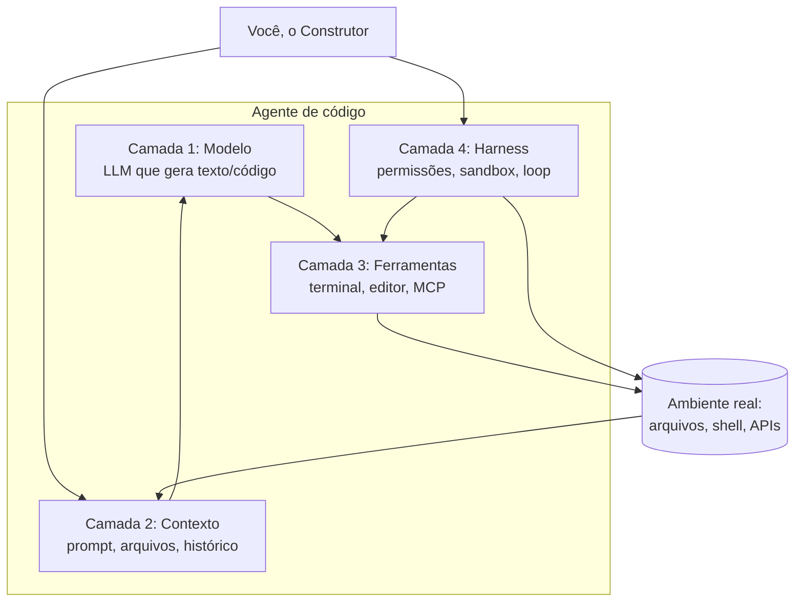

# Capítulo 5: Arquitetura em Quatro Camadas: o Motor da Oficina

## 1. Introdução

Você já sabe operar a serra e falar com o mestre de obras. Agora vamos entender a máquina por dentro, em nível de arquitetura: as quatro camadas que sustentam todo agente de código moderno — modelo, contexto, ferramentas e execução. Este capítulo é o mapa do motor da Oficina do Código: entender o que está sob seu controle e o que é infraestrutura muda completamente a forma como você diagnostica problemas e tira proveito dos agentes.

## 2. Explica

### A arquitetura em quatro camadas

Todo agente de código — do mais simples chatbot ao mais sofisticado sistema de automação — pode ser descrito por quatro camadas sobrepostas [1]:

**Camada 1 — Modelo**: o cérebro estatístico. Um LLM treinado em texto e código que gera a próxima sequência de tokens mais provável. Esta camada é a matéria-prima intelectual: ela decide *o que escrever* [2].

**Camada 2 — Contexto**: o espaço de trabalho. Tudo o que o modelo pode enxergar em uma interação: histórico da conversa, arquivos lidos, saídas de comandos, instruções do sistema. Esta camada decide *o que o modelo sabe* [3].

**Camada 3 — Ferramentas**: os braços. As capacidades que o agente pode acionar: executar comandos no terminal, editar arquivos, navegar no repositório, consultar APIs. Esta camada decide *o que o modelo pode fazer* [1].

**Camada 4 — Execução (o harness)**: o corpo. A infraestrutura que orquestra tudo: o loop de controle, permissões, sandbox, retentativas e a política de segurança. Esta camada decide *o que o modelo tem permissão de fazer* [4].

A separação em camadas não é acadêmica: ela define onde cada problema mora. Um código errado pode ser problema de modelo (gerou besteira), de contexto (não sabia do requisito), de ferramenta (não conseguiu rodar o teste) ou de harness (foi bloqueado pela política de permissões). O diagnóstico correto economiza horas.

### Por que a arquitetura importa para o iniciante

O iniciante tende a tratar o agente como uma caixa-preta monolítica: "o agente falhou". Com o mapa das quatro camadas, você passa a perguntar "qual camada falhou?" — e essa pergunta aponta a solução: melhorar o prompt (camada 2), trocar o modelo (camada 1), conceder acesso (camada 3) ou ajustar permissões (camada 4) [5].

Estudos sobre agentes de código em produção mostram que a maioria das falhas não está no modelo, mas na integração das camadas: contexto insuficiente, ferramentas quebradas e harness mal configurado [6].

### O que você controla e o que é infraestrutura

A distribuição de controle é o segredo do profissional:

| Camada | O que é | Quem controla |
|---|---|---|
| Modelo | LLM (GPT, Claude, Llama) | Você escolhe, o fornecedor executa |
| Contexto | Prompt, arquivos, histórico | Você decide o que entra |
| Ferramentas | Terminal, editor, MCP | Você concede/revoga |
| Harness | Permissões, sandbox, loop | Você configura (e o fabricante provê) |

Você não controla o modelo por dentro, mas controla tudo ao redor — e é exatamente aí que o profissional se diferencia.

### O ciclo de vida de uma tarefa atravessando as camadas

Para fixar o mapa, vale percorrer uma tarefa real — "corrija o bug no login" — e observar cada camada em ação. O acompanhamento do ciclo de vida é a habilidade de diagnóstico central do Construtor Assistido:

| Momento | Camada em ação | O que acontece | Ponto de falha comum |
|---|---|---|---|
| 1. Pedido | Contexto | O agente recebe a tarefa e o que está na janela | Prompt vago; arquivo do login não aberto |
| 2. Leitura | Contexto | Abre o arquivo do login e o teste que falha | Arquivo grande demais; trecho errado |
| 3. Raciocínio | Modelo | Propõe a correção do bug | Modelo sugere causa provável, não a real |
| 4. Edição | Ferramenta | Edita o arquivo e mostra o diff | Edição em outro arquivo, diff confuso |
| 5. Execução | Ferramenta | Roda o teste de novo | Ambiente sem a dependência |
| 6. Autorização | Harness | Permite ou bloqueia a ação | Política bloqueia comando legítimo |
| 7. Entrega | Harness | Reporta o resultado ao construtor | Resumo omite etapas puladas |

O padrão a notar: as camadas 2 e 4 aparecem em mais momentos do ciclo do que a camada 1. Por isso a maioria das falhas do iniciante está em contexto e permissões — não na "inteligência" do modelo. Se você anotar as falhas da semana usando este ciclo, verá o mesmo padrão que os estudos de produção relatam [6].

### Como as camadas conversam: o fluxo de dados

Há um detalhe de arquitetura que explica muitos comportamentos estranhos: o fluxo de informação entre as camadas é um circuito. A saída do modelo vira entrada da ferramenta; a saída da ferramenta volta como contexto (a observação); a observação alimenta o próximo raciocínio. Quando qualquer elo do circuito quebra — um comando que não retorna saída, um arquivo que não é relido —, o agente "aloira" e repete erros, porque está trabalhando com informação desatualizada.

Esse circuito explica dois fenômenos clássicos. O primeiro é o *loop infinito de correção*: o agente tenta a mesma solução repetidamente porque a observação não chega ao modelo (ferramenta com problema de captura de saída). O segundo é a *correção alucinada*: o agente "corrige" código que já está correto porque o contexto mostra uma versão antiga do arquivo. Nos dois casos, o problema não é raciocínio — é o circuito de dados. E nos dois casos, a solução é técnica: conferir que a saída da ferramenta realmente chega ao contexto [1].

## 3. Ilustra

Na Oficina do Código, as quatro camadas são as quatro estações de trabalho do mestre de obras:

1. **O arquiteto (modelo)**: desenha as soluções. Ele é brilhante, mas nunca visitou a obra.
2. **A prancheta (contexto)**: tudo o que o arquiteto vê — plantas, fotos, anotações. Se a prancheta estiver vazia, o arquiteto desenha a partir da imaginação dele.
3. **O braço do mestre (ferramentas)**: a habilidade de pegar a serra, subir o andaime, medir a parede. Sem braços, o arquiteto só desenha.
4. **O capataz (harness)**: autoriza cada movimento — "pode usar a serra, não pode ligar a betoneira sem o mestre presente".

Quando a obra sai errada, o construtor experiente não pergunta "quem errou?". Ele percorre as estações: o arquiteto tinha a planta certa? A prancheta tinha a medida real? O braço executou o corte? O capataz autorizou o material certo?



Como Construtor Assistido, seu posto de comando é a camada de contexto e a de harness: é de lá que você dirige as outras duas.

## 4. Técnica

### Instrumentando as quatro camadas em Python

Vamos construir um pequeno "agente de arquitetura em camadas" que registra, em cada iteração, qual camada produziu o resultado — a base para diagnosticar falhas:

```python
import subprocess
from dataclasses import dataclass, field
from typing import Any


@dataclass
class DiagnosticoCamadas:
    """Registra a origem de cada resultado durante a execução do agente."""
    camadas: dict[str, list[str]] = field(
        default_factory=lambda: {"modelo": [], "contexto": [], "ferramenta": [], "harness": []}
    )

    def registrar(self, camada: str, observacao: str) -> None:
        if camada in self.camadas:
            self.camadas[camada].append(observacao)

    def relatorio(self) -> str:
        linhas = ["Relatório por camada:"]
        for camada, eventos in self.camadas.items():
            if eventos:
                linhas.append(f"  {camada}: {len(eventos)} evento(s) — {eventos[-1][:80]}")
        return "\n".join(linhas)


def camada_modelo(prompt: str, temperatura: float = 0.1) -> str:
    """Camada 1: chama o modelo de linguagem (substituível por qualquer API)."""
    return f"gerado_para: {prompt[:40]}"


def camada_ferramenta(comando: str) -> str:
    """Camada 3: executa um comando no shell e devolve a saída."""
    try:
        resultado = subprocess.run(
            comando, shell=True, capture_output=True, text=True, timeout=15
        )
        return (resultado.stdout + resultado.stderr).strip() or "(sem saída)"
    except subprocess.TimeoutExpired:
        return "(timeout)"


class HarnessMinimo:
    """Camada 4: autoriza ações com base em uma política de permissões."""

    def __init__(self, comandos_permitidos: set[str] | None = None) -> None:
        self.permitidos = comandos_permitidos or {"python", "dir", "git status"}

    def autorizar(self, comando: str) -> bool:
        """Verifica se o comando está na lista de permitidos."""
        return any(comando.startswith(prefixo) for prefixo in self.permitidos)


def executar_fluxo(tarefa: str, diagnostico: DiagnosticoCamadas, harness: HarnessMinimo) -> str:
    """Executa o fluxo completo atravessando as quatro camadas."""
    diagnostico.registrar("contexto", f"tarefa recebida: {tarefa}")
    solucao = camada_modelo(tarefa)
    diagnostico.registrar("modelo", solucao)
    comando = f"python -c \"print('{solucao[:20]}')\""
    if not harness.autorizar(comando):
        diagnostico.registrar("harness", f"bloqueado: {comando[:40]}")
        return "Ação bloqueada pelo harness"
    saída = camada_ferramenta(comando)
    diagnostico.registrar("ferramenta", saída)
    return saída


def main() -> None:
    diag = DiagnosticoCamadas()
    harness = HarnessMinimo()
    print(executar_fluxo("calcular média de notas", diag, harness))
    print(diag.relatorio())


if __name__ == "__main__":
    main()
```

### Mapeando falhas comuns por camada

A tabela de diagnóstico abaixo é o guia de bolso do Construtor Assistido:

| Sintoma observado | Camada provável | Correção típica |
|---|---|---|
| Código tecnicamente errado | 1 (modelo) | Trocar modelo, reformular prompt |
| Código ignora requisito do projeto | 2 (contexto) | Fornecer contexto, abrir arquivos |
| Agente tenta rodar comando e falha | 3 (ferramentas) | Conferir ambiente, instalar dependências |
| Agente diz que não pode executar | 4 (harness) | Ajustar permissões/política |
| Tudo funciona isolado, quebra no conjunto | 2+4 (contexto+harness) | Revisar escopo e permissões do fluxo |

### Testando a política de permissões do harness

Uma das maiores responsabilidades do capataz (camada 4) é bloquear ações perigosas. O script abaixo formaliza uma política simples de permissões com categorias — e serve de base para o tema de segurança do Capítulo 13:

```python
import re


class PoliticaPermissoes:
    """Classifica comandos em categorias de risco e autoriza por regra."""

    CATEGORIAS = {
        "seguro": ["dir", "ls", "cat", "type", "python", "git status", "git diff"],
        "cuidado": ["git add", "git commit", "pip install", "npm install"],
        "perigoso": ["rm", "del", "drop", "format", "shutdown", "curl |"],
    }

    def __init__(self, permitir_cuidado: bool = True) -> None:
        self.permitir_cuidado = permitir_cuidado
        self.decisoes: list[tuple[str, str]] = []

    def classificar(self, comando: str) -> str:
        for categoria, prefixos in self.CATEGORIAS.items():
            if any(comando.strip().startswith(prefixo) for prefixo in prefixos):
                return categoria
        return "desconhecido"

    def autorizar(self, comando: str) -> bool:
        categoria = self.classificar(comando)
        if categoria == "perigoso":
            decisao = False
        elif categoria == "cuidado":
            decisao = self.permitir_cuidado
        else:
            decisao = True
        self.decisoes.append((comando, categoria))
        return decisao

    def resumo(self) -> str:
        return "\n".join(f"{categoria}: {comando[:50]}" for comando, categoria in self.decisoes)


if __name__ == "__main__":
    politica = PoliticaPermissoes()
    comandos = ["git status", "git commit -m 'ajuste'", "rm -rf cache", "python test.py"]
    for comando in comandos:
        autorizado = politica.autorizar(comando)
        print(f"[{'PERMITIDO' if autorizado else 'BLOQUEADO'}] {comando}")
    print("\nResumo das decisões:\n" + politica.resumo())
```

Rode o exemplo e observe: o `rm -rf` é bloqueado na hora, o `git commit` exige a política de cuidado, e comandos desconhecidos passam — o que revela a limitação clássica desse modelo por prefixo: comandos novos não são classificados. No Capítulo 13, você evoluirá essa política para o padrão allowlist estrita, em que tudo o que não está na lista é negado por padrão.

### Monitorando o comportamento do agente

Um bom harness registra tudo para auditoria — a base da rastreabilidade que você usará nos capítulos de revisão:

```python
import json
from datetime import datetime, timezone
from pathlib import Path


class AuditoriaAgente:
    """Persiste um log JSON de cada ação executada pelo agente."""

    def __init__(self, caminho_log: str = "auditoria_agente.json") -> None:
        self.caminho = Path(caminho_log)
        self.acoes: list[dict[str, Any]] = []

    def registrar_acao(self, acao: str, resultado: str, permitida: bool) -> None:
        entrada = {
            "timestamp": datetime.now(timezone.utc).isoformat(),
            "acao": acao,
            "resultado": resultado[:200],
            "permitida": permitida,
        }
        self.acoes.append(entrada)
        self.caminho.write_text(json.dumps(self.acoes, ensure_ascii=False, indent=2), encoding="utf-8")

    def resumo(self) -> str:
        permitidas = sum(1 for acao in self.acoes if acao["permitida"])
        return f"{len(self.acoes)} ações registradas, {permitidas} permitidas"


if __name__ == "__main__":
    auditoria = AuditoriaAgente()
    auditoria.registrar_acao("listar arquivos", "3 arquivos", permitida=True)
    auditoria.registrar_acao("apagar banco", "bloqueado", permitida=False)
    print(auditoria.resumo())
```

## 5. Aplica

### Cena de contraste: caçando o fantasma errado

Uma sexta-feira à noite, o agente do seu projeto começa a "esquecer" regras do sistema: gera código que não respeita o formato dos dados. Você decide que o modelo é ruim e troca para o mais caro do mercado. O problema persiste. Você xinga a ferramenta, o fornecedor, a IA em geral.

O diagnóstico com o mapa das quatro camadas revela o erro: a camada 2 (contexto) estava vazia. O agente nunca recebeu o schema dos dados no prompt — ele não "esqueceu" nada, nunca soube. O problema era contexto insuficiente, não modelo fraco [3][6].

A correção: você abre o arquivo do schema e pede ao agente para lê-lo antes de gerar código — duas linhas de mudança que resolvem o que horas de troca de modelo não resolveram. O mapa das camadas transformou um mistério em um ajuste de rotina.

### Armadilhas comuns da arquitetura

- Trocar o modelo (camada 1) quando o problema é contexto (camada 2).
- Culpar o agente quando a permissão (camada 4) bloqueou a ação correta.
- Não auditar: sem o log de ações, todo diagnóstico é chute.
- Tratar o agente como caixa-preta: o mapa das camadas é a ferramenta de diagnóstico mais barata que existe.
- Esquecer que a observação precisa voltar ao contexto — sem circuito, o agente repete erros.
- Confundir "agente não pode" (harness) com "agente não consegue" (ferramenta).

### Protocolo de diagnóstico de dez minutos

Quando um agente falhar, não tente consertar pelo sintoma. Use o protocolo abaixo — ele percorre as quatro camadas na ordem correta e termina com uma decisão de reparo documentada:

1. Reproduza a falha e copie a saída exata (sintoma objetivo, não memória).
2. Verifique a camada 4: existe log de ação bloqueada? A permissão impediu algo legítimo?
3. Verifique a camada 3: o comando roda fora do agente? A ferramenta está instalada no ambiente?
4. Verifique a camada 2: o arquivo/requisito relevante estava na janela de contexto? Peça ao agente para confirmar o que viu.
5. Verifique a camada 1: com o contexto completo e o comando funcionando, o modelo ainda erra? Aí sim é modelo.
6. Registre no seu caderno: sintoma, camada culpada, correção aplicada, resultado.

O passo 4 é onde a maioria das falhas é encontrada — e a pergunta "o que você viu?" (pedindo ao agente para descrever o contexto que recebeu) é a ferramenta de diagnóstico mais rápida que existe. Ela revela em segundos se a informação chegou ou não à bancada.

### Exercícios do construtor

1. **Função de uma linha**: escreva uma função Python pura de uma linha que valide se um número é par, com docstring e exemplos no prompt — e peça ao agente que a implemente.
2. **Três casos de borda**: para a função do exercício anterior, liste três casos de borda (negativo, zero, tipo errado) e escreva testes para cada um.
3. **O teste que falha**: escreva o teste ANTES da função — a disciplina do capítulo: primeiro a prova, depois a obra. Rode e veja o teste falhar, depois implemente e veja passar.
4. **Tabela de decisão**: descreva uma regra de negócio sua (ex.: desconto por faixa de valor) em forma de tabela com 4 faixas — depois peça ao agente que transforme a tabela em código.
5. **Escrevendo em voz alta**: diga em voz alta (ou escreva) o que a função deve fazer antes de pedir ao agente. Se você não consegue dizer em duas frases, o problema ainda está mal definido.
6. **Ciclo completo**: gere uma função com o agente, teste-a com três casos e documente a decisão de aceitar ou rejeitar o resultado — o debrief do capítulo.
7. **Entrada inesperada**: escolha uma função do capítulo e imagine a entrada mais estranha possível (string vazia, número gigante). O que ela faz? Se quebrar, como corrigir?
8. **O contrato do capítulo**: escreva o contrato (entrada → saída) de três funções do dia a dia e verifique se o agente as implementa sem ambiguidade.

### Glossário do capítulo

| Termo | Significado |
|---|---|
| Função pura | Função sem efeitos colaterais: mesma entrada, mesma saída |
| Caso feliz | Entrada normal que deve funcionar |
| Caso de borda | Entrada limite ou incomum que pode quebrar |
| Tabela de decisão | Regras organizadas em linhas de condição e ação |
| Teste primeiro | Escrever a prova antes da implementação |
| Contrato de função | Entrada, saída e comportamento esperado |
| Debrief | Registro do resultado e da decisão de aceitação |
| Docstring | Documentação dentro do código da função |

### Erros comuns do construtor

| Erro | Sintoma | Correção do capítulo |
|---|---|---|
| Testar só o caso feliz | Borda quebra em produção | Três casos por função: feliz, borda, erro |
| Teste depois do código | Teste "passa" sem provar nada | Teste primeiro: a prova guia a obra |
| Função com efeito colateral | Teste dependente de estado | Função pura: mesma entrada, mesma saída |
| Aceitar código sem docstring | Ninguém entende a intenção | Exija docstring com o quê e o porquê |
| Regra de negócio no meio do código | Tabela de decisão ilegível | Regras em tabela, implementação separada |
| Pular o debrief | Rejeita código bom por preguiça | Registre a decisão: aceito ou rejeitado, e por quê |

### O passeio de uma hora

Reserve uma hora e percorra o capítulo em ação:

1. **Escolha uma função** do seu projeto que ainda não tem testes.
2. **Escreva o contrato** dela: o que recebe, o que devolve, o que faz com o que é inválido.
3. **Liste três casos**: feliz, borda e erro — com valores concretos.
4. **Escreva os testes** primeiro, sem implementar — eles devem falhar agora.
5. **Rode** e confirme que falham pelo motivo certo (função não existe, não falha o caso errado).
6. **Peça ao agente** que implemente apenas o suficiente para os testes passarem.
7. **Rode a suíte** e confira o verde — sem olhar a implementação antes.
8. **Leia o código** e verifique a docstring e a simplicidade: o que o agente fez além do necessário?
9. **Faça o vandalismo**: quebre a função de propósito e confirme que o teste pega.
10. **Registre o debrief**: o ciclo levou quanto tempo? Essa é a sua linha de base de produtividade com prova.

### Perguntas e respostas do capítulo

- **Testar antes de implementar não é perda de tempo?** É a maior economia do ofício: o teste falhando mostra o que construir; o teste passando prova que está pronto.
- **Três casos bastam?** Para a maioria das funções, sim: feliz, borda e erro cobrem o mapa. Funções críticas merecem mais — a régua é o risco.
- **O agente não escreve os testes melhor?** Ele escreve rápido; você escreve o contrato. Teste gerado sem contrato testa o que ele entendeu, não o que você precisa.
- **Função pura é dogma?** É ferramenta: funções puras são fáceis de testar. Quando o efeito colateral é inevitável, isole-o na beirada e teste o núcleo.
- **E se o teste passar e o código estiver errado?** Falso verde — o capítulo o ensina a caçar: vandalismo intencional e casos de borda honestos.

### Você sabe que dominou quando...

1. Escreve o teste antes da função sem resistência.
2. Cobre feliz, borda e erro em toda peça nova.
3. Detecta falso verde com o vandalismo intencional.
4. Isola a lógica de negócio em funções puras.
5. Usa a tabela de decisão para regras de negócio.
6. Registra o debrief de cada peça aceita ou rejeitada.

### Resumo em pontos

- Teste primeiro: o teste é o contrato em execução.
- Feliz, borda e erro cobrem o mapa da maioria das funções.
- Falso verde é o inimigo: vandalismo intencional o expõe.
- Função pura testa fácil; efeito colateral isola na beirada.
- Teste que passa por acaso não protege: o vandalismo intencional é o detector.

### Desafio de aprofundamento

Escolha uma função que você escreveu sem testes e aplique o método completo do capítulo: escreva três testes (feliz, borda, erro), rode-os, observe-os falharem, implemente a função e veja o verde. Depois tente o vandalismo intencional — introduza um bug de propósito e confirme que o teste o pega. Esse ciclo de dez minutos treina o músculo que sustenta todos os capítulos seguintes.

### Conexão com o próximo capítulo

O teste verde do capítulo roda em máquina vazia; o próximo capítulo garante que essa máquina exista para todos — o ambiente reproduzível e o harness que o agente usa sem medo. Teste que só passa na sua máquina é teste que ainda não nasceu.

## 6. Conclusão

Você mapeou as quatro camadas do motor da oficina — modelo, contexto, ferramentas e harness —, aprendeu o que controla em cada uma e construiu um agente instrumentado que diagnostica falhas por camada, além de um log de auditoria persistente. Desafio: da próxima vez que um agente falhar, classifique a falha em uma das quatro camadas antes de tentar consertar. No Capítulo 6, você vai se aprofundar na camada 4: o harness e as permissões — o andaime que sustenta o agente e o separa do perigo.

## 7. Referências Bibliográficas

[1] ANTHROPIC. *Building effective agents*. Disponível em: https://www.anthropic.com/research/building-effective-agents. Acesso em: 06 ago. 2026.

[2] VASWANI, Ashish et al. *Attention Is All You Need*. Disponível em: https://arxiv.org/abs/1706.03762. Acesso em: 06 ago. 2026.

[3] ANTHROPIC. *How we built our multi-agent research system*. Disponível em: https://www.anthropic.com/research. Acesso em: 06 ago. 2026.

[4] ANTHROPIC. *Claude Code: best practices for agentic coding*. Disponível em: https://www.anthropic.com/engineering/claude-code-best-practices. Acesso em: 06 ago. 2026.

[5] SPRINGER. *Applied Intelligence survey on LLM-based code generation* (2026). Disponível em: https://link.springer.com/article/10.1007/s10489-026-07230-0. Acesso em: 06 ago. 2026.

[6] IEEE ACCESS. *Coding Agents in the Wild* (2026). Disponível em: https://ieeexplore.ieee.org/document/10795597. Acesso em: 06 ago. 2026.

[7] YAO, Shunyu et al. *ReAct: Synergizing Reasoning and Acting in Language Models*. Disponível em: https://arxiv.org/abs/2210.03629. Acesso em: 06 ago. 2026.

[8] XI, Zhiheng et al. *The Rise and Potential of Large Language Model Based Agents: A Survey*. Disponível em: https://arxiv.org/abs/2309.07864. Acesso em: 06 ago. 2026.

[9] WANG, Lei et al. *A Survey on Large Language Model Based Autonomous Agents*. Disponível em: https://arxiv.org/abs/2308.11432. Acesso em: 06 ago. 2026.

[10] SCHICK, Timo et al. *Toolformer: Language Models Can Teach Themselves to Use Tools*. Disponível em: https://arxiv.org/abs/2302.04761. Acesso em: 06 ago. 2026.

[11] GU, Zhou et al. *AgentBench: Evaluating LLMs as Agents*. Disponível em: https://arxiv.org/abs/2308.03688. Acesso em: 06 ago. 2026.

[12] PARK, Joon Sung et al. *Generative Agents: Interactive Simulacra of Human Behavior*. Disponível em: https://arxiv.org/abs/2304.03442. Acesso em: 06 ago. 2026.

[13] LIU, Xiao et al. *AgentBench: Evaluating LLMs as Agents* (repositório). Disponível em: https://github.com/THUDM/AgentBench. Acesso em: 06 ago. 2026.

[14] YANG, Hui et al. *SWE-agent: Agent-Computer Interfaces Enable Automated Software Engineering*. Disponível em: https://arxiv.org/abs/2405.15793. Acesso em: 06 ago. 2026.

[15] JIMENEZ, Carlos E. et al. *SWE-bench: Can Language Models Resolve Real-World GitHub Issues?* Disponível em: https://arxiv.org/abs/2310.06770. Acesso em: 06 ago. 2026.

[16] ANTHROPIC. *Introducing the Model Context Protocol*. Disponível em: https://www.anthropic.com/news/model-context-protocol. Acesso em: 06 ago. 2026.

[17] OWASP. *OWASP Top 10 for Large Language Model Applications*. Disponível em: https://owasp.org/www-project-top-10-for-large-language-model-applications/. Acesso em: 06 ago. 2026.

[18] CHEN, Xinyun et al. *Teaching Large Language Models to Self-Debug*. Disponível em: https://arxiv.org/abs/2304.05128. Acesso em: 06 ago. 2026.

[19] FAN, Angela et al. *Large Language Models for Software Engineering: Survey and Open Problems*. Disponível em: https://arxiv.org/abs/2310.03533. Acesso em: 06 ago. 2026.

[20] BROWN, Tom B. et al. *Language Models are Few-Shot Learners* (GPT-3). Disponível em: https://arxiv.org/abs/2005.14165. Acesso em: 06 ago. 2026.
