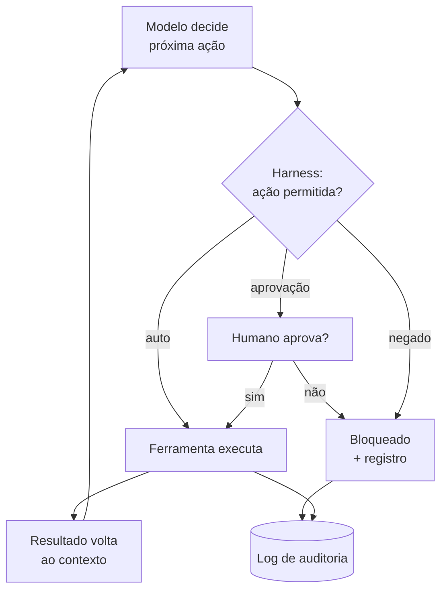

# Capítulo 6: O Capataz da Oficina: Harness, Permissões e o Protocolo MCP

## 1. Introdução

Na oficina, o capataz é quem autoriza cada movimento: pode cortar aqui, não pode ligar a betoneira sem o mestre por perto. No mundo dos agentes, esse capataz é o harness — a camada de execução que separa o que o agente *pode* fazer do que ele *tentaria* fazer. Este capítulo desmonta o harness: o loop de execução, o sistema de permissões, a sandbox e o protocolo MCP (Model Context Protocol), o padrão que conecta o agente a ferramentas externas. Ao final, você vai configurar um harness Python com política de permissões auditável.

## 2. Explica

### O harness e o loop de execução

Um agente sem harness é um arquiteto com as mãos soltas: desenha a planta e sai demolindo paredes. O harness é o corpo que dá sentido à mente — e seu coração é o loop de execução: **pensar → agir → observar → repetir** [1]. Em cada ciclo:

1. O modelo recebe o contexto e decide a próxima ação (pensar).
2. O harness valida a ação contra a política de permissões (decidir se pode).
3. A ferramenta executa a ação no ambiente (agir).
4. O resultado volta ao contexto do modelo (observar).
5. O ciclo recomeça até a tarefa terminar ou o limite ser atingido.

O harness também define: o número máximo de ciclos, o que acontece em erro, a retentativa e o que é registrado para auditoria [2]. É a camada que torna o agente *seguro* e *rastreável*.

### O sistema de permissões

A permissão é a pergunta "o agente pode fazer isso?" respondida por três regimes:

| Regime | Comportamento | Uso típico |
|---|---|---|
| Auto | Executa sem perguntar | Comandos de leitura seguros (`ls`, `grep`) |
| Aprovação | Pergunta ao humano a cada ação | Comandos destrutivos (`rm`, `git push`) |
| Negado | Bloqueia e registra | Zonas proibidas (produção, credenciais) |

O princípio do menor privilégio rege a política: conceda apenas o necessário para a tarefa, nada além [3]. Um harness bem configurado nunca decide sozinho — ele *escala* a decisão para o humano quando a ação é cara ou irreversível.

### O protocolo MCP

O Model Context Protocol (MCP) é o padrão aberto (anunciado pela Anthropic em 2024) que resolve um problema antigo: cada agente precisava de uma integração sob medida para cada ferramenta. Com o MCP, um único padrão conecta o agente a qualquer ferramenta — banco de dados, sistema de arquivos, API externa — por meio de servidores MCP [4]. O MCP usa três tipos de primitivas:

- **Ferramentas** (tools): funções que o modelo pode chamar com parâmetros definidos.
- **Recursos** (resources): dados que o modelo pode ler do servidor.
- **Prompts** (prompts): templates de instrução reutilizáveis.

Um servidor MCP expõe essas primitivas; o agente (cliente MCP) consome. É a camada 3 da arquitetura (Capítulo 5) materializada como protocolo [4].

### Anatomia da aprovação humana: o ponto mais barato de controle

O regime de aprovação é o mecanismo mais subestimado da oficina. Quando o harness pede aprovação, ele não está sendo burocrático — está movendo a decisão para o único ator que entende as consequências irreversíveis. Entender quando pedir aprovação (e quando não pedir) é o equilíbrio que define um harness bem desenhado:

| Característica da ação | Regime adequado | Racional |
|---|---|---|
| Leitura, sem efeito colateral | Auto | Não há dano possível, só custo de tempo |
| Escrita local, reversível (git diff, undo) | Auto ou aprovação leve | Perda limitada e recuperável |
| Escrita irreversível (delete, overwrite) | Aprovação | Dano permanente exige olho humano |
| Acesso a dados sensíveis | Aprovação + registro | Privacidade e rastreabilidade |
| Efeito fora da máquina (rede, push, deploy) | Aprovação obrigatória | Escopo externo, responsabilidade |
| Zona proibida (produção, credenciais) | Negado sempre | Nem humana — nem deve existir |

Repare no último item: algumas ações devem ser *impossíveis*, não apenas *aprováveis*. É a diferença entre "preciso da sua autorização para apagar produção" e "não existe caminho para apagar produção". O harness profissional configura as duas coisas: aprovação para o custoso e negação para o proibido. Essa distinção evita o erro clássico de times que "só pedem confirmação" para ações que nunca deveriam acontecer [3].

### O princípio do menor privilégio aplicado a agentes

O menor privilégio, vindo da segurança de sistemas, traduz-se para agentes em uma pergunta: *qual é o menor conjunto de capacidades que permite cumprir a tarefa?* Em vez de dar ao agente acesso ao disco inteiro, dá-se a pasta do projeto; em vez de um terminal genérico, comandos específicos. A tabela abaixo mostra a tradução prática para três tarefas típicas:

| Tarefa | Privilégio mínimo adequado | Privilégio exagerado (evitar) |
|---|---|---|
| Refatorar módulo de pagamento | Leitura+escrita só em `src/pagamento/` | Todo o repositório |
| Rodar testes | Executar `pytest` na pasta do projeto | Shell completo irrestrito |
| Consultar métricas do banco | Conexão read-only com usuário dedicado | Credenciais de admin de produção |

O custo do privilégio exagerado não é só o risco do desastre — é o risco do *erro silencioso*: o agente, com acesso amplo, modifica arquivos que não deveria tocar e ninguém percebe até a quebra aparecer em produção. O privilégio mínimo é, ao mesmo tempo, uma medida de segurança e uma medida de qualidade [2].

### MCP na prática: quando conectar um servidor de ferramentas

O MCP resolve o problema de integração, mas nem toda integração merece um servidor MCP. A decisão prática segue três critérios: (1) a ferramenta será usada por mais de um agente ou em mais de uma sessão? (2) o contrato da ferramenta (entrada/saída) precisa ser estável e documentado? (3) a ferramenta precisa de autenticação ou isolamento próprio? Se duas respostas forem "sim", o MCP compensa; se for uma tarefa pontual, um script resolve com menos cerimônia. A disciplina de não criar infraestrutura desnecessária — o princípio YAGNI — também vale para a oficina [5].

## 3. Ilustra

A obra sem capataz é o caos: o mestre de obras, cheio de boa vontade, derruba a parede que sustentava o telhado — ele só queria "melhorar a iluminação". Com capataz, cada movimento é avaliado: "derrubar parede? Não sem a aprovação do engenheiro. Fazer a medição? Pode, já está autorizado."

O capataz não é o desconfiado da oficina; ele é o responsável pela obra inteira. Ele mantém o caderno de ocorrências (o log de auditoria), escala decisões perigosas e mantém o mestre produtivo nas tarefas liberadas. Sem capataz, o mestre brilhante é um risco; com capataz, ele é uma força.



Como Construtor Assistido, você é o engenheiro que define a política do capataz — e revisa o caderno de ocorrências de vez em quando.

## 4. Técnica

### Um harness mínimo com política de permissões em Python

O harness abaixo executa comandos com política de permissões e auditoria completa — o esqueleto de qualquer ferramenta segura:

```python
import json
import shlex
import subprocess
from datetime import datetime, timezone
from pathlib import Path
from typing import Callable


class Politica:
    """Política de permissões por prefixo de comando."""

    def __init__(self, auto: set[str], negado: set[str]) -> None:
        self.auto = auto
        self.negado = negado

    def avaliar(self, comando: str) -> str:
        """Retorna 'auto', 'aprovacao' ou 'negado' para o comando."""
        for prefixo in self.negado:
            if comando.startswith(prefixo):
                return "negado"
        for prefixo in self.auto:
            if comando.startswith(prefixo):
                return "auto"
        return "aprovacao"


class HarnessSeguro:
    """Executa comandos respeitando a política e registrando tudo."""

    def __init__(self, politica: Politica, log: str = "harness_log.json") -> None:
        self.politica = politica
        self.log = Path(log)
        self.entradas: list[dict[str, str | bool | None]] = []

    def registrar(self, comando: str, veredito: str, saida: str | None, ok: bool) -> None:
        entrada = {
            "timestamp": datetime.now(timezone.utc).isoformat(),
            "comando": comando,
            "veredito": veredito,
            "saida": (saida or "")[:300],
            "executado": ok,
        }
        self.entradas.append(entrada)
        self.log.write_text(
            json.dumps(self.entradas, ensure_ascii=False, indent=2), encoding="utf-8"
        )

    def executar(self, comando: str, aprovar: Callable[[str], bool] | None = None) -> str:
        """Executa o comando segundo a política. Se exigir aprovação e não houver
        aprovador, bloqueia por padrão (fail-safe)."""
        veredito = self.politica.avaliar(comando)
        if veredito == "negado":
            self.registrar(comando, veredito, None, False)
            return "[BLOQUEADO pela política]"
        if veredito == "aprovacao" and aprovar is not None:
            veredito = "aprovado" if aprovar(comando) else "reprovado"
        if veredito in ("aprovacao", "reprovado"):
            self.registrar(comando, veredito, None, False)
            return "[AGUARDA aprovação humana]"
        try:
            resultado = subprocess.run(
                shlex.split(comando), capture_output=True, text=True, timeout=20
            )
            saida = (resultado.stdout + resultado.stderr).strip()
            ok = resultado.returncode == 0
        except (subprocess.TimeoutExpired, FileNotFoundError) as erro:
            saida, ok = str(erro), False
        self.registrar(comando, veredito, saida, ok)
        return saida


def main() -> None:
    politica = Politica(
        auto={"python -c", "dir", "git status", "pwd"},
        negado={"del /f", "git push", "rm -rf"},
    )
    capataz = HarnessSeguro(politica)
    print(capataz.executar("git status"))
    print(capataz.executar("rm -rf C:/temp"))
    print(capataz.executar("python -c print('ok')"))


if __name__ == "__main__":
    main()
```

### Criando um servidor MCP mínimo em Python

O padrão MCP permite expor ferramentas ao agente de forma padronizada. Abaixo, um servidor MCP mínimo usando o SDK oficial — expõe duas ferramentas de arquivo com política de leitura:

```python
import sys
from pathlib import Path
from typing import Any

try:
    from mcp.server.fastmcp import FastMCP
except ImportError:
    print("Instale com: pip install 'mcp[cli]'")
    sys.exit(1)

mcp = FastMCP("Oficina de Arquivos")


@mcp.tool()
def listar_arquivos(pasta: str = ".") -> str:
    """Lista os arquivos e pastas de um diretório (somente leitura)."""
    caminho = Path(pasta)
    if not caminho.exists():
        return "Diretório não encontrado."
    return "\n".join(sorted(str(item) for item in caminho.iterdir()))


@mcp.tool()
def ler_arquivo(caminho: str, linhas: int = 50) -> str:
    """Lê as primeiras N linhas de um arquivo de texto (somente leitura)."""
    arquivo = Path(caminho)
    if not arquivo.is_file():
        return "Arquivo não encontrado."
    try:
        texto = arquivo.read_text(encoding="utf-8")
    except UnicodeDecodeError:
        return "(arquivo binário — leitura ignorada)"
    return "\n".join(texto.splitlines()[:linhas])


def main() -> None:
    print("Servidor MCP 'Oficina de Arquivos' iniciado.")
    print("Ferramentas: listar_arquivos, ler_arquivo")
    print("Somente leitura — nenhuma escrita é permitida.")
    mcp.run()


if __name__ == "__main__":
    main()
```

### Gerando o relatório de auditoria do harness

De nada adianta registrar tudo se ninguém lê o caderno de ocorrências. O script abaixo transforma o `harness_log.json` produzido pelo `HarnessSeguro` em um relatório de auditoria legível — o "olhar do capataz" que o construtor deve fazer ao fim de cada sessão:

```python
import json
from collections import Counter
from pathlib import Path


def gerar_relatorio(caminho_log: str = "harness_log.json") -> str:
    """Lê o log do harness e devolve um resumo de auditoria em texto."""
    log = Path(caminho_log)
    if not log.exists():
        return "Nenhum log encontrado. Rode o harness antes de auditar."
    entradas = json.loads(log.read_text(encoding="utf-8"))
    if not entradas:
        return "Log vazio — nenhuma ação foi executada."

    linhas = [f"Auditoria do harness — {len(entradas)} ações registradas", "-" * 42]
    por_veredito = Counter(entrada["veredito"] for entrada in entradas)
    for veredito, quantidade in por_veredito.most_common():
        linhas.append(f"{veredito:<12} {quantidade}")
    linhas.append("-" * 42)

    negados = [e for e in entradas if e["veredito"] == "negado"]
    falhas = [e for e in entradas if not e["executado"]]
    if negados:
        linhas.append("Ações bloqueadas pela política:")
        linhas.extend(f"  - {e['comando'][:70]}" for e in negados)
    if falhas:
        linhas.append("Execuções com erro:")
        linhas.extend(f"  - {e['comando'][:70]}" for e in falhas)
    if not negados and not falhas:
        linhas.append("Nenhum bloqueio nem falha registrada.")

    return "\n".join(linhas)


if __name__ == "__main__":
    print(gerar_relatorio())
```

Rode após executar o `HarnessSeguro` do exemplo anterior e observe: o relatório mostra a distribuição de vereditos (auto, aprovado, negado), lista as ações bloqueadas e as que falharam. Esse ritual de fim de sessão — rodar a auditoria e ler o relatório — transforma o log em aprendizado: a cada dia, você ajusta a política com base no que o relatório revelou [2].

### Lista de verificação de segurança do harness

- Nunca execute comandos destrutivos no modo auto.
- Bloqueie por padrão (fail-safe): sem aprovador, negue.
- Registre tudo: comando, veredito, saída e resultado em log imutável.
- Conceda o menor privilégio necessário para a tarefa.
- Isole o ambiente (sandbox/docker) antes de expor a produção.

## 5. Aplica

### Cena de contraste: o capataz que não existia

Você conecta seu agente ao banco de dados de produção "só para fazer uma consulta de relatório". Sem harness configurado, o agente entende a conversa, acha que precisa de uma tabela nova para o relatório e executa `DROP TABLE` — a consulta virou tragédia. Não foi maldade: foi a camada de execução aberta, sem capataz.

A correção preventiva é a política vista neste capítulo: o banco de produção entra na lista `negado`, consultas de leitura ficam em `auto`, e qualquer escrita exige aprovação humana explícita. O capataz não impede o trabalho; impede o desastre. Ele registra cada acesso no caderno de ocorrências — e é essa trilha que permite auditar o que aconteceu quando algo der errado [3][4].

### Armadilhas comuns de harness e permissões

- Deixar tudo em modo auto "para agilizar" — o preço é a irreversibilidade.
- Conceder acesso amplo (ex.: todo o disco) quando o escopo é uma pasta.
- Não auditar: sem log, qualquer incidente vira mistério.
- Ignorar o MCP: ferramentas sem padrão viram integrações frágeis e inseguras.
- Tratar a aprovação como burocracia: ela é o ponto de controle mais barato que existe.
- Escrever a política com prefixos frágeis (`git` cobre `git push`?) em vez de comandos completos.
- Configurar o harness sozinho, sem revisão: a política de permissões merece o mesmo review que o código.
- Aprovar no piloto automático: aprovar por aprovar desfaz a proteção que o capataz oferece.

### Protocolo de configuração segura do harness (dez pontos)

Ao conectar um agente a qualquer ambiente pela primeira vez, percorra esta lista na ordem — cada ponto é um portão:

1. Liste todas as ações que a tarefa exige (ler, escrever, executar, rede, banco).
2. Separe as ações em três grupos: auto, aprovação e negado.
3. Aplique o menor privilégio: o caminho mais curto até cada necessidade, nada além.
4. Configure o fail-safe: sem aprovador disponível, a ação é negada.
5. Registre tudo: comando, veredito, saída, resultado, timestamp.
6. Teste a política com três comandos de cada regime antes de começar.
7. Rode a primeira tarefa real em modo observação, sem autonomia total.
8. Ao fim da sessão, gere o relatório de auditoria e leia os bloqueios.
9. Ajuste a política com base no relatório — sem "permissão por conveniência".
10. Repita a auditoria em todo ambiente novo (produção, banco, rede externa).

O ponto 7 merece destaque: o modo observação — em que o agente propõe e você executa — é a ponte perfeita entre o medo inicial e a autonomia plena. Depois de uma semana em modo observação, você conhecerá o padrão de ações do seu agente e poderá configurar a política com segurança real, não com achismo [3].

### Exercícios do construtor

1. **Mapeando seu ambiente**: desenhe (no papel ou em texto) o mapa do seu ambiente: onde fica o código, onde ficam as dependências, onde rodam os testes. Se faltar um pedaço, anote como resolver.
2. **Ambiente do zero**: escreva o passo a passo para alguém reproduzir seu ambiente em outra máquina — rode o passo a passo do início e veja onde ele falha.
3. **Política do harness**: escreva em três frases a política do seu projeto: o que é permitido ao agente (rodar testes? instalar pacotes?) e o que é proibido (deploy? apagar arquivos?).
4. **Teste de reprodução**: delete uma pasta de dependências do projeto e rode o script de setup — o ambiente se reconstrói sozinho? Se não, o setup está incompleto.
5. **Checklist de uma linha**: escreva o comando que valida seu projeto inteiro em uma linha (formatação, testes, lint) e coloque-o num arquivo `checar.sh` ou `checar.ps1`.
6. **A pasta que não suja**: liste o que NUNCA deve ir para o repositório (segredos, cache, build) e confira se o `.gitignore` cobre tudo.
7. **Falha proposital**: quebre um teste de propósito e rode a suíte — a saída de erro indica onde está o problema? Legibilidade do erro é parte do harness.
8. **Ambiente como contrato**: escreva a versão exata das dependências do seu projeto (ou use um gerenciador) — a reprodutibilidade é um requisito, não um detalhe.

### Glossário do capítulo

| Termo | Significado |
|---|---|
| Ambiente | Conjunto de ferramentas e dependências onde o código roda |
| Harness | Estrutura que controla o que os agentes podem executar |
| Política | Regras de permissão e proibição da automação |
| Reprodução | Recriar o ambiente em outra máquina sem erros |
| Setup | Script que prepara o ambiente do zero |
| .gitignore | Lista de arquivos que não entram no repositório |
| Dependência | Pacote ou serviço do qual o projeto precisa |
| Suíte de testes | Conjunto completo de testes do projeto |

### Erros comuns do construtor

| Erro | Sintoma | Correção do capítulo |
|---|---|---|
| Ambiente na memória | "Na minha máquina funciona" | Reproduza o ambiente com script do zero |
| Harness sem política | Agente roda o que não devia | Regras claras: o que é permitido e o que é proibido |
| Setup pela metade | Dependência fantasma reaparece | Rode o setup numa pasta limpa e complete as lacunas |
| Segredo versionado | Credencial vaza no repositório | .gitignore cobre, varredura confere |
| Ignorar o erro ilegível | Bug escondido em parede de texto | Erros legíveis são parte do harness |
| Testes que demoram | Suíte vira castigo, ninguém roda | Suíte rápida roda a cada mudança |

### O passeio de uma hora

Reserve uma hora e percorra o capítulo em ação:

1. **Desenhe o mapa do ambiente** do seu projeto: código, dependências, testes, deploy.
2. **Escreva a política do harness** em três frases: o que o agente pode, o que não pode, o que sempre roda.
3. **Crie o script de setup** com os comandos do capítulo — instale, configure, rode a suíte.
4. **Teste a reprodução**: apague as dependências e rode o setup do zero numa pasta limpa.
5. **Confira o .gitignore**: liste o que nunca deve ir ao repositório e verifique cada item.
6. **Rode o comando de uma linha** (formatação, lint, testes) e anote o tempo.
7. **Quebre um teste de propósito** e avalie: o erro aponta o problema com clareza?
8. **Registre a saída** do comando de checagem num arquivo de exemplo do README.
9. **Simule o harness**: dê ao agente permissão de rodar a suíte e veja se ele executa apenas o permitido.
10. **Guarde o script de setup** no repositório — o ambiente agora é um arquivo, não uma lembrança.

### Perguntas e respostas do capítulo

- **Configurar ambiente é tarefa de agente?** Pode ser — com supervisão. O harness permite rodar setup, testes e lint; mudanças destrutivas ficam com você.
- **O que é mais importante: ambiente ou código?** Sem ambiente reproduzível, o código bom morre na máquina de quem escreveu. A obra não é só o prédio — é o canteiro.
- **E se o setup quebrar no meio?** O erro legível é parte do harness: mensagem que diz onde falhou e o que fazer. Setup que quebra em silêncio é bug, não infortúnio.
- **Posso dar acesso total ao agente?** Pode — se a política disser isso e você aceitar o risco. O capítulo recomenda o mínimo: testes e lint sim, deploy e exclusões não.
- **Quanto tempo investir nisso?** O passeio de uma hora do capítulo monta a base. Depois, cada ajuste é minutos — e cada sessão economiza o dobro.

### Você sabe que dominou quando...

1. Reproduz o ambiente do zero com um comando.
2. Escreve a política do harness em três frases.
3. Roda a checagem de uma linha antes de cada sessão.
4. Mantém segredos fora do repositório sem esforço.
5. Lê um erro e sabe onde começar a consertar.
6. Apresenta o ambiente do projeto a outra pessoa em cinco minutos.

### Resumo em pontos

- Ambiente reproduzível protege a obra: o setup vira script, não memória.
- Harness define o que o agente pode tocar — política escrita, sem ambiguidade.
- Checagem de uma linha antes de cada sessão evita horas de remendo.
- Segredos nunca entram no repositório; a varredura é automática.
- Ambiente que só funciona na sua máquina não existe para o resto do mundo.

### Desafio de aprofundamento

Leve um projeto antigo seu para o padrão do capítulo: escreva o script de setup completo, a checagem de uma linha, a política do harness e o guarda de segredos. Convide outra pessoa (ou um agente em nova sessão) para rodar tudo do zero seguindo só o README. Se a pessoa precisar de uma explicação oral para terminar, o ambiente ainda não está pronto — aperte até ela conseguir sozinha.

### Conexão com o próximo capítulo

O harness da máquina está de pé; o próximo capítulo coloca a placa na obra: o AGENTS.md que conta ao agente o contexto, as regras e os limites do projeto. Ambiente preparado e prancheta escrita — só então o mestre de obras abre a sessão.

## 6. Conclusão

Você desmontou o harness — loop de execução, regimes de permissão (auto/aprovação/negado), princípio do menor privilégio —, construiu um harness Python com política auditável e um servidor MCP mínimo com ferramentas de leitura, e memorizou a lista de verificação de segurança. Desafio: configure um harness para uma tarefa sua de hoje, com leituras em auto, escritas em aprovação e produção em negado. No Capítulo 7, você vai dominar a camada de contexto: a prancheta do arquiteto — o gerenciamento do contexto e a arte do arquivo de instruções.

## 7. Referências Bibliográficas

[1] ANTHROPIC. *Building effective agents*. Disponível em: https://www.anthropic.com/research/building-effective-agents. Acesso em: 06 ago. 2026.

[2] ANTHROPIC. *Claude Code: best practices for agentic coding*. Disponível em: https://www.anthropic.com/engineering/claude-code-best-practices. Acesso em: 06 ago. 2026.

[3] OWASP. *AI Agent Security and Governance* (2026). Disponível em: https://owasp.org/www-project-top-10-for-large-language-model-applications/. Acesso em: 06 ago. 2026.

[4] ANTHROPIC. *Model Context Protocol: connect tools to your AI assistant*. Disponível em: https://modelcontextprotocol.io. Acesso em: 06 ago. 2026.

[5] ANTHROPIC. *Introducing the Model Context Protocol*. Disponível em: https://www.anthropic.com/news/model-context-protocol. Acesso em: 06 ago. 2026.

[6] MODEL CONTEXT PROTOCOL. *Specification 2025-06-18*. Disponível em: https://modelcontextprotocol.io/specification/2025-06-18. Acesso em: 06 ago. 2026.

[7] MODEL CONTEXT PROTOCOL (GitHub). *python-sdk*. Disponível em: https://github.com/modelcontextprotocol/python-sdk. Acesso em: 06 ago. 2026.

[8] QIN, Yujia et al. *Tool Learning with Foundation Models*. Disponível em: https://arxiv.org/abs/2304.08354. Acesso em: 06 ago. 2026.

[9] YI, Jingwei et al. *Agent Security Bench (ASB): Formalizing and Benchmarking Attacks and Defenses in LLM-based Agents*. Disponível em: https://arxiv.org/abs/2410.02620. Acesso em: 06 ago. 2026.

[10] OWASP. *Agentic AI – Threats and Mitigations*. Disponível em: https://genai.owasp.org/resource/agentic-ai-threats-and-mitigations/. Acesso em: 06 ago. 2026.

[11] LIU, Yi et al. *Prompt Injection Attacks and Defenses in LLM-Integrated Applications*. Disponível em: https://arxiv.org/abs/2310.12815. Acesso em: 06 ago. 2026.

[12] ZOU, Andy et al. *Universal and Transferable Adversarial Attacks on Aligned Language Models*. Disponível em: https://arxiv.org/abs/2307.15043. Acesso em: 06 ago. 2026.

[13] NASR, Milad et al. *Scalable Extraction of Training Data from (Production) Language Models*. Disponível em: https://arxiv.org/abs/2311.17035. Acesso em: 06 ago. 2026.

[14] CARLINI, Nicholas et al. *Extracting Training Data from Large Language Models*. Disponível em: https://arxiv.org/abs/2012.07805. Acesso em: 06 ago. 2026.

[15] ARTIFICIAL INTELLIGENCE INCIDENT DATABASE. *AIID*. Disponível em: https://incidentdatabase.ai. Acesso em: 06 ago. 2026.

[16] ANTHROPIC. *Agent Skills*. Disponível em: https://www.anthropic.com/news/skills. Acesso em: 06 ago. 2026.

[17] MERRY, Bruce et al. *Gorilla: Large Language Model Connected with Massive APIs*. Disponível em: https://arxiv.org/abs/2305.15334. Acesso em: 06 ago. 2026.

[18] HU, Binyuan et al. *Trial-and-Error: A (Sober) Analysis of Language Models for Complex Reasoning*. Disponível em: https://arxiv.org/abs/2502.01087. Acesso em: 06 ago. 2026.

[19] BROWN, Tom B. et al. *Language Models are Few-Shot Learners* (GPT-3). Disponível em: https://arxiv.org/abs/2005.14165. Acesso em: 06 ago. 2026.

[20] SALAMAT, Ali et al. *Rethinking the Role of Demonstrations: What Makes In-Context Learning Work?* Disponível em: https://arxiv.org/abs/2202.12837. Acesso em: 06 ago. 2026.
