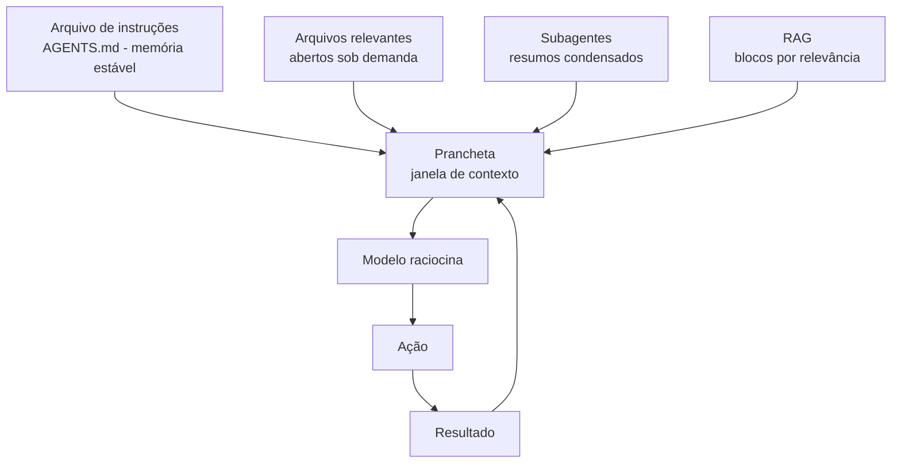

# Capítulo 7: A Prancheta do Arquiteto: Gerenciamento de Contexto

## 1. Introdução

O arquiteto da oficina é brilhante — mas só desenha o que vê na prancheta. No mundo dos agentes, a prancheta é a janela de contexto: tudo o que o modelo enxerga em uma interação. Esquecer de colocar informação na prancheta é a causa número um de resultados medíocres — não porque o modelo é fraco, mas porque ele trabalha no escuro. Este capítulo ensina a arte de gerenciar contexto: o que entra na janela, o que fica de fora e como um arquivo de instruções (AGENTS.md) transforma qualquer projeto em terreno fértil para agentes.

## 2. Explica

### A janela de contexto e seus limites

A janela de contexto é o espaço de trabalho do modelo: tokens de sistema (instruções fixas), mensagens do usuário, respostas do agente, conteúdo de arquivos e saídas de comandos [1]. Modelos modernos têm janelas de 128 mil a 1 milhão de tokens — mas a qualidade da atenção decai com a distância e a janela é finita [2]. Duas consequências práticas:

1. **Orçamento**: cada token dentro é um token que não pode ser usado para raciocinar. Inundar o contexto com conteúdo irrelevante degrada a qualidade.
2. **Esquecimento**: informação colocada no início da janela recebe menos atenção do que informação recente — o modelo "esquece" o início quando a janela enche.

O gerenciamento de contexto é a prática de escolher o que entra, o que sai e quando — como o mestre de obras que mantém a prancheta limpa, com a planta certa, em vez de empilhar todas as plantas da cidade.

### Estratégias: documentos de instruções, subagentes e memória

Três ferramentas dominam o gerenciamento de contexto profissional:

**1. Arquivo de instruções (AGENTS.md/CLAUDE.md)**: um arquivo na raiz do projeto que o agente lê automaticamente ao iniciar. Declara a missão do projeto, convenções de código, comandos, estrutura e regras. É a memória estável da oficina: o agente sempre começa sabendo o essencial, sem que você precise repetir [3].

**2. Subagentes (fan-out)**: em vez de carregar 20 arquivos no contexto principal, o orquestrador despacha subagentes — cada um com janela própria, focada em uma subtarefa — e recebe de volta apenas o resumo. É a forma profissional de escalar sem estourar o contexto [4].

**3. RAG (Retrieval-Augmented Generation)**: quando o conhecimento é grande demais para a janela, indexe o material (embeddings ou índices TF-IDF) e consulte por relevância: apenas os blocos mais relacionados à pergunta entram no contexto. A oficina pesquisa na biblioteca em vez de carregá-la inteira [5].

### O que nunca deve entrar na prancheta

- Arquivos gigantes quando um trecho resolve (leia por partes).
- Material duplicado (o mesmo arquivo em duas versões).
- Conversa irrelevante: cada mensagem permanece na janela.
- Logs enormes sem resumo.
- Credenciais e segredos (além do risco de exposição, poluem o contexto).

### A hierarquia do que o agente lê primeiro

O agente não lê tudo na mesma ordem — há uma hierarquia implícita que o construtor experiente conhece e explora:

| Nível | O que é | Quando entra | Papel |
|---|---|---|---|
| 1. Instruções fixas | System prompt, AGENTS.md | Sempre, no início | Define identidade e regras |
| 2. Pedido atual | Sua mensagem/tarefa | A cada interação | Define o objetivo |
| 3. Estado do projeto | Arquivos abertos, saídas de comandos | Sob demanda | Dá o material de trabalho |
| 4. Histórico da conversa | Mensagens anteriores | Acumulado | Dá continuidade, mas enche |

A consequência prática: o nível 1 é o mais barato de manter (fica no início, é sempre lido) e o nível 4 é o mais caro (cresce sem controle). Quando a janela enche, o que começa a sofrer é o nível 3 — o modelo "esquece" detalhes dos arquivos que você abriu no início da sessão. Por isso a regra de ouro do gerenciamento: **quanto maior a sessão, menor o apetite do agente — e maior a sua responsabilidade de resumir** [1].

### Medindo o contexto: o orçamento em tokens

Uma intuição comum é "cabe na janela, então está bom". O profissional pensa em orçamento: cada token do contexto custa espaço de raciocínio. A tabela abaixo estima o custo típico das peças de uma sessão (valores aproximados, variam por tokenizador):

| Peça | Tamanho aproximado | Estimativa de tokens |
|---|---|---|
| AGENTS.md bem escrito | 40–60 linhas | 400–700 |
| Um arquivo de código médio | 150–300 linhas | 2.000–4.000 |
| Mensagem sua bem escrita | 100–200 palavras | 150–300 |
| Resposta longa do agente | 500 palavras | 700–900 |
| Log de comando sem filtro | 1.000 linhas | 8.000–12.000 |
| Livro inteiro no contexto | 200 páginas | 80.000–120.000 |

Observe o contraste entre o log sem filtro e o AGENTS.md: um custa dez vezes mais que o outro e entrega muito menos valor por token. Essa é a lente para todas as decisões de contexto — *valor por token*, não "cabe ou não cabe". Quando um arquivo ou log não cabe economicamente, o RAG e os resumos existem exatamente para isso [2].

### O ciclo de vida da informação: do bruto ao resumo

Informação entra na oficina em três estados, e cada um tem destino diferente:

1. **Bruta** (arquivo, log, doc): entra apenas o trecho necessário, sob demanda — e sai quando não serve mais.
2. **Processada** (saída de comando, resultado de teste): entra como observação — e é resumida se for longa.
3. **Destilada** (regra, decisão, convenção): promovida para o AGENTS.md — a única que deve ficar para sempre.

O erro de iniciante é tratar tudo como destilada: jogar decisões na conversa, sem nunca promovê-las ao arquivo de instruções. Quando a conversa morre, a decisão morre junto — e o próximo agente refaz o que já foi decidido. O ritual de fim de sessão do construtor inclui a pergunta: *que decisões de hoje merecem virar regra no AGENTS.md?* [3]

## 3. Ilustra

O arquiteto chega à obra com a prancheta vazia e o mestre de obras pede: "desenhe a escada". O arquiteto desenha uma escada qualquer — de caracol, quando o espaço exige reta; de madeira, quando a norma exige aço. O mestre reclama da incompetência do arquiteto. Mas o erro é dele: a prancheta estava vazia e ele não forneceu o desenho do terreno, o material, as medidas.

O construtor experiente mantém na prancheta apenas o essencial: a planta atual, a medida do vão, a norma aplicável — e esconde o resto. A prancheta limpa e completa é a diferença entre "o arquiteto é bom" e "o arquiteto acerta sempre".



Como Construtor Assistido, seu ritual diário: verificar se a prancheta está completa (contexto), limpa (sem lixo) e estável (instruções no arquivo, não na cabeça).

## 4. Técnica

### Um modelo de AGENTS.md eficaz

O arquivo de instruções é o primeiro documento que o agente lê. Um modelo conciso e eficaz:

```text
---
description: Regras do projeto Oficina do Código.
alwaysApply: true
---

# OFICINA DO CÓDIGO — Instruções

## Missão
Sistema de gestão de tarefas de programação assistida por IA.

## Stack
- Python 3.12+, FastAPI, SQLite.
- Testes com pytest (obrigatórios para toda mudança).

## Estrutura
- src/ (código), tests/ (testes), docs/ (documentação).

## Regras
- Nunca commitar dependências (requirements.txt é a fonte).
- Padrão de commit: Conventional Commits.
- Rodar `pytest` e `python -m compileall src` antes de concluir.

## Perguntas frequentes
- Onde está o schema? -> src/db/schema.sql
- Como rodar? -> uvicorn src.app:app --reload
```

### O gerenciador de contexto: leitura sob demanda e RAG em Python

A técnica central do gerenciamento é *nunca carregar tudo*: indexar primeiro, consultar depois. O exemplo abaixo implementa um indexador TF-IDF e um seletor de trechos — o esqueleto de um RAG local:

```python
import math
import re
from collections import Counter
from pathlib import Path

STOPWORDS = {
    "a", "o", "e", "de", "do", "da", "em", "para", "com", "que",
    "uma", "um", "os", "as", "no", "na", "por", "se", "não", "é",
}


def tokenizar(texto: str) -> list[str]:
    """Divide o texto em tokens minúsculos sem stopwords."""
    palavras = re.findall(r"[a-zà-ú0-9]+", texto.lower())
    return [palavra for palavra in palavras if palavra not in STOPWORDS]


class IndexadorTFIDF:
    """Indexa blocos de texto e responde buscas por relevância."""

    def __init__(self) -> None:
        self.blocos: list[str] = []
        self.tf: list[Counter[str]] = []
        self.df: Counter[str] = Counter()
        self.total_documentos = 0

    def indexar(self, caminho: str, tamanho_bloco: int = 1500) -> None:
        """Lê um arquivo e divide em blocos de tamanho aproximado."""
        texto = Path(caminho).read_text(encoding="utf-8")
        palavras = tokenizar(texto)
        for inicio in range(0, len(palavras), tamanho_bloco):
            bloco = " ".join(palavras[inicio : inicio + tamanho_bloco])
            self.blocos.append(bloco)
            contagem = Counter(tokenizar(bloco))
            self.tf.append(contagem)
            for termo in contagem:
                self.df[termo] += 1
            self.total_documentos += 1

    def consultar(self, pergunta: str, topo: int = 3) -> list[tuple[float, str]]:
        """Retorna os blocos mais relevantes para a pergunta, com pontuação."""
        termos = tokenizar(pergunta)
        pontuacoes: list[tuple[float, int]] = []
        for indice, contagem in enumerate(self.tf):
            soma = 0.0
            for termo in termos:
                if termo not in contagem:
                    continue
                tf = contagem[termo]
                df = self.df[termo]
                idf = math.log((1 + self.total_documentos) / (1 + df)) + 1
                soma += tf * idf
            if soma > 0:
                pontuacoes.append((soma, indice))
        pontuacoes.sort(reverse=True)
        return [
            (pontuacao, self.blocos[indice])
            for pontuacao, indice in pontuacoes[:topo]
        ]


def main() -> None:
    indexador = IndexadorTFIDF()
    indexador.indexar("AGENTS.md", tamanho_bloco=300)
    for pontuacao, trecho in indexador.consultar("como rodar os testes", topo=1):
        print(f"Relevância {pontuacao:.2f}: {trecho[:120]}...")


if __name__ == "__main__":
    main()
```

### O medidor de orçamento de contexto

Antes de decidir o que entra na prancheta, meça. O script abaixo estima o custo em tokens de qualquer conjunto de arquivos (heurística de 4 caracteres por token, a média usada em ferramentas de contagem) e mostra onde está o seu orçamento — o primeiro passo para gerenciar de verdade:

```python
import sys
from pathlib import Path

CARACTERES_POR_TOKEN = 4
ORCAMENTO_TOTAL = 128_000


def estimar_tokens(texto: str) -> int:
    """Estima o número de tokens de um texto (heurística 4 chars/token)."""
    return max(1, len(texto) // CARACTERES_POR_TOKEN)


def medir_arquivos(caminhos: list[str]) -> list[tuple[str, int, int]]:
    """Mede cada arquivo: caminho, caracteres e tokens estimados."""
    medicao: list[tuple[str, int, int]] = []
    for caminho in caminhos:
        arquivo = Path(caminho)
        if not arquivo.is_file():
            continue
        texto = arquivo.read_text(encoding="utf-8", errors="replace")
        medicao.append((caminho, len(texto), estimar_tokens(texto)))
    return medicao


def relatorio(caminhos: list[str]) -> str:
    medicao = medir_arquivos(caminhos)
    if not medicao:
        return "Nenhum arquivo encontrado."
    total_tokens = sum(item[2] for item in medicao)
    percentual = total_tokens / ORCAMENTO_TOTAL * 100
    linhas = [
        f"Orçamento de contexto: {ORCAMENTO_TOTAL:,} tokens",
        f"Consumo estimado: {total_tokens:,} tokens ({percentual:.1f}%)",
        "-" * 56,
    ]
    for caminho, caracteres, tokens in sorted(medicao, key=lambda m: m[2], reverse=True):
        linhas.append(f"{tokens:>9,} tokens  {caminho} ({caracteres:,} chars)")
    return "\n".join(linhas)


if __name__ == "__main__":
    alvo = sys.argv[1:] or ["AGENTS.md", "src", "logs.txt"]
    print(relatorio(alvo))
```

Rode `python medir_contexto.py src AGENTS.md` em um projeto seu e veja o resultado: quase sempre, três ou quatro arquivos consomem mais da metade do orçamento. Esses são exatamente os candidatos a RAG — indexar em vez de abrir. A medição transforma o gerenciamento de contexto de intuição em decisão com número na mão [6].

### Checklist de higiene da prancheta (contexto)

- O AGENTS.md existe e está atualizado? (memória estável)
- Os arquivos abertos são os necessários? (leitura sob demanda)
- O material grande foi indexado e consultado por blocos? (RAG)
- Resumos de subagentes substituíram trabalhos brutos? (fan-out)
- Segredos e dados sensíveis fora do contexto?

## 5. Aplica

### Cena de contraste: o projeto sem instruções

Uma equipe contrata um agente para contribuir no repositório de um sistema legado de 200 mil linhas. Sem AGENTS.md, o agente abre arquivos aleatórios, inventa convenções e quebra os padrões do projeto — formatação diferente, testes na pasta errada, imports absolutos onde o padrão é relativo. A equipe conclui que "IA não funciona para código legado".

A correção é cultural: um AGENTS.md de 30 linhas declarando stack, convenções, estrutura e regras de teste. Na próxima execução, o agente acerta de primeira o que antes exigia dezenas de correções manuais. O problema nunca foi o modelo; foi a prancheta vazia [3].

### Armadilhas comuns de contexto

- Repetir instruções em cada prompt em vez de persistir no AGENTS.md.
- Carregar arquivos inteiros quando trechos bastam.
- Deixar o contexto encher de conversa morta — arquive e resuma.
- Indexar sem testar a consulta: RAG bom é RAG validado.
- Esquecer que subagentes são a resposta para escala — o orquestrador que faz tudo na janela principal estoura.
- Medir o contexto só "quando travar": a medição é preventiva, não reativa.
- Promover decisões só oralmente: decisão que não vira regra é decisão que não existe.
- Confundir janela grande com atenção grande: 128K de lixo produzem menos que 10K de essencial.

### Protocolo de preparação da prancheta (antes de cada sessão)

Antes de abrir qualquer sessão com agente, percorra os seis passos — cinco minutos que economizam uma hora de correção:

1. **Instruções**: confira que o AGENTS.md está atualizado e cobre stack, regras e comandos do trabalho de hoje.
2. **Escopo**: escreva a tarefa em uma frase, com o resultado esperado e o critério de "pronto".
3. **Arquivos**: liste o que o agente deve abrir — só o necessário, aberto sob demanda.
4. **Orçamento**: meça os arquivos grandes; indexe ou fatie o que passar do limite.
5. **Filtro**: remova credenciais, dados sensíveis e material duplicado da área de trabalho.
6. **Checkpoint**: combine o ponto de revisão — em que momento você quer ser chamado antes de ações irreversíveis.

O passo 6 fecha o círculo com o capítulo anterior: a prancheta preparada só é segura se o harness estiver configurado. Contexto e permissões andam juntos — a prancheta diz o que o agente vê; o harness diz o que ele pode fazer. As duas disciplinas juntas definem a diferença entre um assistente confiável e um gerador de surpresas [3][4].

### Exercícios do construtor

1. **Audite sua prancheta**: abra o arquivo de instruções do seu projeto (AGENTS.md, README ou similar) e liste o que ele contém — contexto, regras, comandos? Marque o que está faltando.
2. **AGENTS.md de três blocos**: escreva a versão inicial do AGENTS.md de um projeto seu com apenas três blocos: descrição, regras e comandos. Menos é mais no contexto.
3. **O que nunca entra**: liste cinco informações que NUNCA devem ir para o arquivo de instruções (segredos, caminhos pessoais, dívidas de contexto) — e explique por quê.
4. **Orçamento de tokens**: estime quantos tokens seu AGENTS.md consome com a regra do capítulo e decida o que cortar se passar de 2.000.
5. **Hierarquia na prática**: num projeto seu, identifique o que o agente lê primeiro e o que lê por último — a ordem está correta para as tarefas mais comuns?
6. **Subagente com missão**: defina um subagente simples (nome, missão em duas frases, o que ele NÃO faz) para uma tarefa repetitiva sua — e avalie o resultado.
7. **Ciclo de vida da informação**: pegue uma conversa longa com um agente e extraia dela um resumo de dez linhas que serviria como contexto inicial da próxima sessão.
8. **Prompt de prancheta**: escreva o prompt que você usaria para pedir ao agente que atualize o AGENTS.md do projeto — incluindo a regra de não apagar informação útil.

### Glossário do capítulo

| Termo | Significado |
|---|---|
| Prancheta | Espaço de contexto do agente — o que ele "carrega" na tarefa |
| Token | Unidade de texto; o orçamento da prancheta é finito |
| AGENTS.md | Arquivo de instruções do projeto para o agente |
| Subagente | Agente secundário com missão específica |
| Hierarquia de leitura | Ordem em que o agente consome os documentos |
| Memória | Informação persistida entre sessões |
| Resumo | Versão comprimida do contexto para a próxima sessão |
| Dívida de contexto | Informação desatualizada ou redundante no arquivo |

### Erros comuns do construtor

| Erro | Sintoma | Correção do capítulo |
|---|---|---|
| AGENTS.md vazio de regras | Agente age por impulso | Regras curtas e imperativas no arquivo |
| Instruções eternas | Agente se perde no meio | Contexto é orçamento: corte o supérfluo |
| Segredo no arquivo | Vazamento na primeira sincronização | Só o que é seguro vai para a prancheta |
| Contexto desatualizado | Agente segue regra antiga | Revise o arquivo a cada mudança de projeto |
| Subagente sem missão | Subagente refaz a tarefa do pai | Missão em duas frases, com limites explícitos |
| Resumo que não resume | Sessão nova recomeça do zero | Extraia o resumo antes de fechar a sessão |

### O passeio de uma hora

Reserve uma hora e percorra o capítulo em ação:

1. **Abra o AGENTS.md** do seu projeto e leia como um agente leria — sem contexto anterior.
2. **Marque o que está faltando**: descrição, regras, comandos, proibições.
3. **Reescreva em três blocos**: descrição do projeto, regras, comandos úteis.
4. **Meça o orçamento**: estime os tokens do arquivo com a régua do capítulo.
5. **Corte o que não é regra**: histórico, decisões antigas, elogios — saem da prancheta.
6. **Escreva uma proibição** clara: o que o agente NUNCA deve fazer neste projeto.
7. **Crie um subagente** com missão de duas frases para a tarefa mais repetitiva do projeto.
8. **Teste**: abra uma sessão nova com o agente e peça a tarefa mais comum do projeto.
9. **Registre** o que o agente fez certo e errado com o novo arquivo.
10. **Atualize o AGENTS.md** com o aprendizado do teste — a prancheta vive do feedback.

### Perguntas e respostas do capítulo

- **O AGENTS.md é só para projetos grandes?** É para qualquer projeto com agente — um arquivo de 20 linhas muda o resultado mais do que você imagina.
- **Quanto contexto devo colocar?** O que a tarefa exige, nem mais. Regra prática: se o arquivo passa de alguns milhares de tokens, corte antes de adicionar.
- **Segredo pode ficar no AGENTS.md?** Nunca. Variáveis de ambiente e arquivos ignorados — a prancheta é pública, os segredos não.
- **Subagente vale a pena em projetos pequenos?** Vale quando a tarefa repete: missão fixa em duas frases. Para tarefa única, o agente principal resolve.
- **Como atualizo o arquivo sem perder o bom?** A regra do capítulo: revisar a cada mudança de projeto e nunca apagar instrução ainda útil — editar, não reescrever.

### Você sabe que dominou quando...

1. Escreve AGENTS.md de três blocos sem hesitar.
2. Estima o orçamento de tokens da prancheta.
3. Recusa colocar segredo em instrução.
4. Cria subagentes com missão de duas frases.
5. Extrai resumo de sessão em dez linhas.
6. Atualiza o arquivo mantendo o que funciona.

### Resumo em pontos

- AGENTS.md é a prancheta: contexto, regras, o que evitar.
- Tudo no arquivo vira comportamento; segredo nunca entra nele.
- Orçamento de tokens: só o que a tarefa exige, sem exagero.
- Subagentes com missão de duas frases multiplicam o canteiro.

### Desafio de aprofundamento

Escreva o AGENTS.md do seu próprio projeto pessoal com os três blocos do capítulo: contexto, regras e proibições. Depois faça um experimento controlado: execute a mesma tarefa com o arquivo presente e ausente (duas sessões de agente) e compare os resultados. A diferença que você observar é a prova do valor do capítulo — e a regra que você escreveu agora evita retrabalho em todas as sessões futuras.

### Conexão com o próximo capítulo

Com a prancheta pronta, o próximo capítulo responde a pergunta do custo: qual modelo usar para cada tarefa, medindo acerto, latência e dinheiro. A prancheta diz o quê; o capítulo que vem diz com quem.

## 6. Conclusão

Você dominou a prancheta do arquiteto: entendeu a janela de contexto como orçamento finito, aprendeu as três estratégias (AGENTS.md, subagentes, RAG), construiu um indexador TF-IDF em Python puro e memorizou o checklist de higiene do contexto. Desafio: escreva um AGENTS.md para um projeto seu e observe a diferença na primeira sessão. No Capítulo 8, você vai fechar a parte de arquitetura: o guarda-roupas da oficina — modelos, comparando LLMs como se comparam ferramentas de marca.

## 7. Referências Bibliográficas

[1] ANTHROPIC. *Claude Code: best practices for agentic coding*. Disponível em: https://www.anthropic.com/engineering/claude-code-best-practices. Acesso em: 06 ago. 2026.

[2] LIU, Nelson F. et al. *Lost in the Middle: How Language Models Use Long Contexts*. Disponível em: https://arxiv.org/abs/2307.03172. Acesso em: 06 ago. 2026.

[3] OPENAI. *A practical guide to building agents* (2025). Disponível em: https://cdn.openai.com/business-guides-and-resources/a-practical-guide-to-building-agents.pdf. Acesso em: 06 ago. 2026.

[4] ANTHROPIC. *How we built our multi-agent research system*. Disponível em: https://www.anthropic.com/research. Acesso em: 06 ago. 2026.

[5] LEWIS, Patrick et al. *Retrieval-Augmented Generation for Knowledge-Intensive NLP Tasks*. Disponível em: https://arxiv.org/abs/2005.11401. Acesso em: 06 ago. 2026.

[6] GAO, Yunfan et al. *Retrieval-Augmented Generation for Large Language Models: A Survey*. Disponível em: https://arxiv.org/abs/2312.10997. Acesso em: 06 ago. 2026.

[7] PACKER, Charles et al. *MemGPT: Towards LLMs as Operating Systems*. Disponível em: https://arxiv.org/abs/2310.08560. Acesso em: 06 ago. 2026.

[8] HUANG, Jie et al. *A Systematic Approach to Context Engineering*. Disponível em: https://arxiv.org/abs/2504.11843. Acesso em: 06 ago. 2026.

[9] GEMMINI TEAM. *Gemini 1.5: Unlocking multimodal understanding across millions of tokens of context*. Disponível em: https://arxiv.org/abs/2403.05530. Acesso em: 06 ago. 2026.

[10] ANTHROPIC. *Effective context engineering for AI agents*. Disponível em: https://www.anthropic.com/engineering/effective-context-engineering-for-ai-agents. Acesso em: 06 ago. 2026.

[11] ZHANG, Zeyu et al. *A Survey on the Memory Mechanism of Large Language Model based Agents*. Disponível em: https://arxiv.org/abs/2404.13501. Acesso em: 06 ago. 2026.

[12] AGENTS.MD. *The open standard for agent instructions*. Disponível em: https://agents.md. Acesso em: 06 ago. 2026.

[13] ANTHROPIC. *Claude Code as an expert coding assistant* (2025). Disponível em: https://www.anthropic.com/research/claude-code-as-an-expert-coding-assistant. Acesso em: 06 ago. 2026.

[14] YAO, Shunyu et al. *Tree of Thoughts: Deliberate Problem Solving with Large Language Models*. Disponível em: https://arxiv.org/abs/2305.10601. Acesso em: 06 ago. 2026.

[15] WEI, Jason et al. *Finetuned Language Models Are Zero-Shot Learners* (FLAN). Disponível em: https://arxiv.org/abs/2109.01652. Acesso em: 06 ago. 2026.

[16] BAI, Yushi et al. *LongBench: A Bilingual, Multitask Benchmark for Long Context Understanding*. Disponível em: https://arxiv.org/abs/2308.14508. Acesso em: 06 ago. 2026.

[17] XIAO, Guangxuan et al. *StreamingLLM: Efficient Streaming Language Models with Attention Sinks*. Disponível em: https://arxiv.org/abs/2309.17453. Acesso em: 06 ago. 2026.

[18] MUNKHDALAI, Tsendsuren et al. *Leave No Context Behind: Efficient Infinite Context Transformers with Infini-attention*. Disponível em: https://arxiv.org/abs/2404.07143. Acesso em: 06 ago. 2026.

[19] OPENAI. *Prompt caching*. Disponível em: https://platform.openai.com/docs/guides/prompt-caching. Acesso em: 06 ago. 2026.

[20] ANTHROPIC. *Prompt caching with Claude*. Disponível em: https://www.anthropic.com/news/prompt-caching. Acesso em: 06 ago. 2026.
