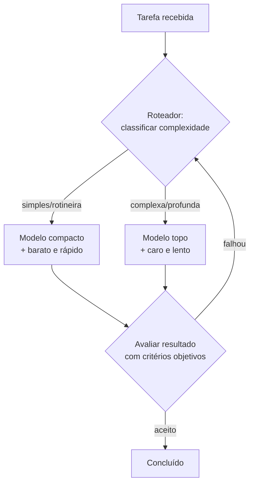

# Capítulo 8: O Guarda-Roupa: Comparando Modelos sem Mistério

## 1. Introdução

Na oficina, nenhum mestre usa uma única ferramenta para tudo: a serra circular não substitui o formão, e o formão não substitui a serra. No mundo dos agentes, o mesmo vale para modelos: GPT, Claude, Gemini e Llama são ferramentas diferentes — com pontos fortes, janelas de contexto e preços distintos. Este capítulo ensina a comparar LLMs como ferramentas: critérios objetivos de avaliação, custo por token, quando trocar e como medir se a troca valeu a pena.

## 2. Explica

### O que diferencia um modelo de outro

Quatro dimensões separam os modelos na prática [1]:

**1. Capacidade de raciocínio e código**: a habilidade de resolver problemas complexos e gerar código correto. É medida por benchmarks (HumanEval, SWE-bench) e, acima de tudo, por testes no seu próprio domínio [2].

**2. Janela de contexto**: quantos tokens cabem na prancheta. Modelos vão de 128 mil a 1 milhão+ de tokens. Importante para projetos grandes — mas lembre-se: janela grande não substitui gerenciamento de contexto (Capítulo 7).

**3. Custo**: preço por milhão de tokens de entrada e de saída. A diferença entre modelos compactos e topo de linha é grande — e o custo explodir sem necessidade é o erro clássico do iniciante [3].

**4. Velocidade e disponibilidade**: tokens por segundo e estabilidade da API. Para fluxos interativos, a velocidade importa; para automação em lote, o custo domina.

### Os critérios objetivos de avaliação

Comparar modelos "no chute" é apostar. O profissional usa três critérios objetivos:

- **Precisão no seu domínio**: o modelo acerta a tarefa *que você* precisa? Nada substitui um teste com seus próprios dados (evals).
- **Custo por tarefa concluída**: divida o custo total pelo número de tarefas concluídas com sucesso. Um modelo caro que acerta de primeira pode ser mais barato que um barato que precisa de 5 tentativas.
- **Tempo até o resultado**: quanto tempo você espera até o código útil? Para o iniciante, velocidade de iteração é qualidade.

### Modelos compactos vs. modelos topo de linha

A regra de ouro do custo-benefício: **use o menor modelo que resolve a tarefa**. Modelos compactos (ex.: gpt-4o-mini, claude-haiku) custam 10-20x menos que os topo de linha e resolvem a maioria das tarefas rotineiras — formatação, refatoração simples, testes. Os topo de linha (ex.: gpt-4o, claude-opus) justificam o custo em tarefas de raciocínio profundo: arquitetura, debugging difícil, segurança [3]. Roteamento: classificações simples mandam tarefas para modelos baratos, e só o complexo vai para o caro.

### Como ler um benchmark sem se enganar

Os benchmarks são o rótulo nutricional do modelo — mas rótulo não é refeição. Antes de decidir, entenda o que cada um mede e onde engana:

| Benchmark | O que mede | Limitação conhecida |
|---|---|---|
| HumanEval | Gera funções Python isoladas | Problemas curtos, sem contexto de projeto |
| SWE-bench | Resolve issues reais de GitHub | Exige leitura de repositório inteiro |
| MMLU | Conhecimento geral de múltiplas áreas | Memória, não raciocínio aplicado |
| LiveCodeBench | Código com perguntas novas | Cobre contaminação de treino |
| Leaderboards (LMArena) | Preferência humana em duelos | Gosto ≠ desempenho na sua tarefa |

O padrão do engano: um modelo brilha no HumanEval (funções isoladas) e fracassa no seu projeto real (arquitetura, dependências, convenções). O inverso também acontece. Por isso o critério número um nunca é o benchmark — é o *seu* domínio, medido com o seu eval [2]. O benchmark serve para triar candidatos; o eval serve para escolher o vencedor.

### O custo que ninguém vê: latência, rate limits e retentativas

O preço por token é a etiqueta da vitrine — o custo real inclui mais três componentes:

1. **Latência**: um modelo lento dobra o tempo de cada iteração; em fluxos interativos, isso é custo de produtividade, não de API.
2. **Rate limits**: modelos baratos e populares têm limites por minuto; sessões longas de agentes estouram o limite e o fluxo quebra no meio.
3. **Retentativas**: toda chamada que falha (timeout, rate limit, resposta truncada) precisa de retry com backoff — e cada retry reconsome tokens de contexto.

O cálculo honesto de custo por tarefa concluída já embute os três: tarefa que exige 3 chamadas custa 3x o preço da etiqueta. É por isso que o modelo compacto que acerta em 1 chamada pode vencer o topo de linha que precisa de 3 — o comparador da seção Técnica existe para essa conta exata [1].

### Roteamento na prática: quando o problema é complexo

O roteador de tarefas parece simples — "simples vai pro barato, complexo vai pro caro" — mas a classificação é a parte difícil. Três sinais objetivos ajudam a decidir sem adivinhar:

| Sinal de tarefa complexa | Exemplo concreto |
|---|---|
| Exige entender contexto além do arquivo aberto | Refatorar um fluxo que toca 6 arquivos |
| Envolve decisão de arquitetura ou trade-off | Escolher entre fila em memória e banco |
| Erros não são triviais (lógica, não sintaxe) | Bug que só aparece em produção |
| Saída precisa ser validada por humano | Código de segurança, regex, contrato |

O erro de novato é classificar pela *frente* da tarefa (o pedido) em vez da *profundidade* (o contexto). "Faça uma função de soma" é simples; "integre a soma no pipeline de pagamento" é complexo — mesmo que a frase de pedido seja parecida. A regra prática: se você precisa de mais de um parágrafo para explicar a tarefa, ela provavelmente é para o modelo topo de linha [4].

## 3. Ilustra

O guarda-roupas do mestre de obras tem a serra pesada, a serra de bancada, a tico-tico e o estilete. Ele não carrega todas para todo serviço: para cortar um sarrafo fino, pega o estilete; para a viga, a serra pesada. Carregar a serra pesada para tudo deixaria o mestre cansado e lento — e o custo seria pago em tempo e energia.

O construtor assistido trata os modelos do mesmo jeito: a tarefa define a ferramenta. Prompt de boas-vindas? Modelo compacto. Refatoração do módulo crítico com testes quebrados? Modelo topo de linha. A regra do estilete economiza dinheiro e velocidade — sem perder qualidade, porque a escolha é consciente e medida.



Como Construtor Assistido, você é o roupeiro: cada tarefa tem sua ferramenta, e a decisão é medida, não emocional.

## 4. Técnica

### Um avaliador de modelos por custo e acerto em Python

A ferramenta abaixo compara dois modelos pelo critério de custo por tarefa concluída — o número que de fato importa:

```python
from dataclasses import dataclass


@dataclass
class Modelo:
    """Metadados de um modelo para comparação de custo-benefício."""
    nome: str
    custo_entrada_por_milhao: float
    custo_saida_por_milhao: float
    tokens_entrada_medio: int = 2000
    tokens_saida_medio: int = 800

    def custo_por_chamada(self) -> float:
        """Custo estimado em reais por chamada típica."""
        entrada = self.tokens_entrada_medio / 1_000_000 * self.custo_entrada_por_milhao
        saida = self.tokens_saida_medio / 1_000_000 * self.custo_saida_por_milhao
        return entrada + saida


class ComparadorModelos:
    """Compara modelos pelo custo por tarefa concluída."""

    def __init__(self, modelos: list[Modelo]) -> None:
        self.modelos = modelos

    def comparar(self, taxa_acerto: dict[str, float]) -> str:
        """Imprime ranking por custo por tarefa concluída (C/T)."""
        linhas: list[tuple[float, str]] = []
        for modelo in self.modelos:
            custo_chamada = modelo.custo_por_chamada()
            acerto = taxa_acerto.get(modelo.nome, 0.5)
            custo_tarefa = custo_chamada / acerto
            linhas.append(
                (custo_tarefa, f"{modelo.nome}: C/T R$ {custo_tarefa:.4f} (acerto {acerto:.0%})")
            )
        linhas.sort()
        return "\n".join(f"{indice + 1}. {texto}" for indice, (_, texto) in enumerate(linhas))


def main() -> None:
    modelos = [
        Modelo("compacto", 0.15, 0.60),
        Modelo("topo", 2.50, 10.00),
        Modelo("intermediario", 0.80, 4.00),
    ]
    comparador = ComparadorModelos(modelos)
    # Taxas de acerto típicas no domínio (medidas com eval próprio)
    taxa_acerto = {"compacto": 0.6, "topo": 0.95, "intermediario": 0.85}
    print(comparador.comparar(taxa_acerto))


if __name__ == "__main__":
    main()
```

### Construindo um mini-eval para decidir com dados

Antes de trocar de modelo, meça. O mini-eval abaixo roda a mesma tarefa em dois modelos e compara o resultado com uma resposta de referência:

```python
import hashlib


class MiniEval:
    """Executa uma bateria de perguntas e pontua respostas por similaridade."""

    def __init__(self, perguntas: dict[str, str]) -> None:
        self.perguntas = perguntas  # pergunta -> resposta de referência

    @staticmethod
    def _normalizar(texto: str) -> str:
        return " ".join(texto.lower().split())

    def executar(self, responder) -> dict[str, bool]:
        """`responder` é uma função (pergunta) -> resposta do modelo."""
        resultado: dict[str, bool] = {}
        for pergunta, referencia in self.perguntas.items():
            resposta = responder(pergunta)
            # Avaliação simples: comparar hash de tokens significativos
            chave_ref = hashlib.md5(
                self._normalizar(referencia).encode("utf-8")
            ).hexdigest()[:8]
            chave_resp = hashlib.md5(
                self._normalizar(resposta).encode("utf-8")
            ).hexdigest()[:8]
            resultado[pergunta] = chave_ref == chave_resp
        return resultado

    def taxa_acerto(self, resultado: dict[str, bool]) -> float:
        if not resultado:
            return 0.0
        return sum(resultado.values()) / len(resultado)


def resposta_referencia(pergunta: str) -> str:
    """Simula a resposta do modelo. Em produção, chame a API do modelo."""
    return "funcao que soma dois numeros"


def main() -> None:
    avaliador = MiniEval(
        {"escreva uma funcao de soma": "funcao que soma dois numeros"}
    )
    print(f"Taxa de acerto: {avaliador.taxa_acerto(avaliador.executar(resposta_referencia)):.0%}")


if __name__ == "__main__":
    main()
```

### O roteador de tarefas por complexidade

O roteamento é a prática que reduz a fatura sem perder qualidade. O script abaixo classifica tarefas pelos sinais objetivos da tabela da seção Explica e sugere o nível de modelo — o esqueleto de um roteador de produção:

```python
import re

SINAIS_COMPLEXIDADE = {
    "contexto_multiplo": [
        "integra", "refatore", "migre", "conecte", "pipeline",
        "fluxo", "endpoint", "servico", "modulo", "camada",
    ],
    "arquitetura": [
        "arquitetura", "design", "trade-off", "projete", "esquema",
        "banco", "cache", "fila", "mensageria", "padrao de projeto",
    ],
    "depuracao_profunda": [
        "bug", "erro", "falha", "producao", "intermitente",
        "memory leak", "race condition", "lentidao",
    ],
    "validador_humano": [
        "seguranca", "criptografia", "contrato", "conformidade",
        "acesso", "permissao", "pagamento", "pii", "lgpd",
    ],
}

PALAVRAS_SIMPLES = [
    "formate", "renomeie", "traduza", "comente", "docstring",
    "funcao simples", "tabela", "css", "typo", "escreva um teste",
]


class RoteadorTarefas:
    """Classifica uma tarefa e sugere o nível de modelo adequado."""

    def __init__(self) -> None:
        self.indicadores: list[tuple[str, str, list[str]]] = []

    def classificar(self, tarefa: str) -> str:
        texto = tarefa.lower()
        self.indicadores.clear()
        for nivel, sinais in SINAIS_COMPLEXIDADE.items():
            achados = [sinal for sinal in sinais if sinal in texto]
            if achados:
                self.indicadores.append((nivel, ", ".join(achados[:3]), achados))
        simples = [palavra for palavra in PALAVRAS_SIMPLES if palavra in texto]
        if self.indicadores:
            return "topo_de_linha"
        if simples:
            return "compacto"
        return "intermediario"

    def relatorio(self, tarefa: str) -> str:
        nivel = self.classificar(tarefa)
        linhas = [f"Tarefa: {tarefa[:80]}", f"Nivel sugerido: {nivel}"]
        for categoria, sinais, _ in self.indicadores:
            linhas.append(f"  sinal de complexidade ({categoria}): {sinais}")
        if nivel == "compacto":
            linhas.append("  (nada de complexo detectado — rotina)")
        return "\n".join(linhas)


if __name__ == "__main__":
    roteador = RoteadorTarefas()
    tarefas = [
        "Formate o codigo do modulo de login",
        "Refatore o fluxo de pagamento para usar fila",
        "Escreva um teste para a funcao de soma",
    ]
    for tarefa in tarefas:
        print(roteador.relatorio(tarefa))
        print()
```

Rode e observe a classificação: a tarefa de formatação vai para o modelo compacto, a do fluxo de pagamento para o topo de linha. A heurística por palavras é o ponto de partida — em produção, o roteador pode usar classificação do próprio modelo ou regras do seu domínio [1].

### Critérios para trocar de modelo

- Acerto no seu domínio: rode evals com suas tarefas antes e depois da troca.
- Custo por tarefa concluída: o número decisivo — não o preço por token.
- Janela de contexto: precisa de mais prancheta? Verifique antes de trocar.
- Velocidade: o fluxo interativo ficou insuportável? Considere compacto.

## 5. Aplica

### Cena de contraste: o modelo errado para o problema certo

Um iniciante assina o modelo mais caro do mercado "para garantir qualidade" e usa-o para todas as tarefas — inclusive as rotineiras de formatação e testes. A fatura do mês surpreende; a qualidade, nem tanto, porque a maioria das tarefas era simples. Pior: na tarefa complexa que exigia o topo de linha, ele não percebeu e culpou a ferramenta.

A correção é o roteamento deste capítulo: classificar a tarefa antes de escolher o modelo, medir o acerto por domínio com mini-evals e calcular o custo por tarefa concluída. O resultado típico: 80% das tarefas vão para o modelo compacto, 20% para o topo — custo total cai pela metade ou mais, com a mesma qualidade nas tarefas que importam [3].

### Armadilhas comuns na escolha de modelos

- Usar o modelo mais caro por status, não por necessidade.
- Comparar modelos por benchmark, não pelo seu domínio.
- Trocar de modelo sem medir antes e depois (eval).
- Ignorar a janela de contexto como dimensão de escolha.
- Fixar um modelo no código em vez de rotear por complexidade.
- Escolher por preço da etiqueta sem calcular o custo por tarefa concluída.
- Esquecer latência e rate limits no cálculo — o barato pode ser o lento.
- Usar o mesmo modelo para tudo "por simplicidade": a régua do estilete não corta viga.

### Protocolo de avaliação de modelo em cinco passos

Quando você precisar decidir entre dois modelos (ou trocar o atual), siga a sequência — ela garante que a decisão saia de dados, não de impressão:

1. **Defina a tarefa-alvo**: escolha as 5 a 10 tarefas que representam seu trabalho real (não as fáceis).
2. **Crie a referência**: escreva o resultado esperado de cada tarefa — a "gabarito".
3. **Rode o eval nos dois modelos**: mesma tarefa, mesmo prompt, mesmo parâmetro (Capítulo 4).
4. **Calcule o custo por tarefa concluída**: custo por chamada ÷ taxa de acerto, incluindo retentativas.
5. **Decida com janela de observação**: mantenha o modelo escolhido por uma semana e meça de novo — performance de produção é sempre diferente da de teste.

O passo 5 é o mais ignorado: trocar modelo é como trocar de serra — precisa de uma semana de obra para saber se a escolha foi boa. Modelo que acerta no teste e trava no fluxo real é descoberto apenas com a janela de observação [3].

### Exercícios do construtor

1. **Tabela de dois modelos**: pesquise dois modelos que você pode usar hoje e preencha uma tabela: preço por token, velocidade, pontos fortes e fracos. Decida qual usar para sua próxima tarefa e por quê.
2. **Benchmark com ceticismo**: encontre um benchmark de modelos e identifique: quem mediu, com qual tarefa e com qual tamanho de amostra. O que o número NÃO diz?
3. **Mini-eval seu**: crie um mini-eval com três tarefas do seu trabalho (uma fácil, uma média, uma difícil) e rode-as em dois modelos — registre acerto e custo.
4. **Custo por tarefa**: estime o custo em tokens de uma tarefa sua (prompt + resposta) nos preços de dois modelos e calcule quanto custaria rodar essa tarefa 100 vezes por mês.
5. **Roteador na vida real**: defina uma regra de roteamento sua: qual modelo para qual tipo de tarefa? Escreva a regra em uma frase.
6. **Latência na prática**: cronometre duas tarefas idênticas em modelos diferentes e responda: a diferença de velocidade importa para o seu caso?
7. **O falso amigo**: encontre um caso em que o modelo "grande" errou e o "pequeno" acertou — o que isso diz sobre os critérios de escolha?
8. **Debrief de troca**: troque o modelo padrão de um projeto por uma semana e anote: o que melhorou, o que piorou e o que você mediu de verdade.

### Glossário do capítulo

| Termo | Significado |
|---|---|
| Modelo | Versão do sistema de IA que gera as respostas |
| Benchmark | Conjunto de tarefas usado para comparar modelos |
| Latência | Tempo entre o pedido e a resposta |
| Rate limit | Limite de requisições permitidas por período |
| Token | Unidade de cobrança e processamento de texto |
| Eval | Avaliação estruturada de acerto em tarefas definidas |
| Roteador | Regra que envia cada tarefa ao modelo mais adequado |
| Custo total | Preço por token somado a latência e retentativas |

### Erros comuns do construtor

| Erro | Sintoma | Correção do capítulo |
|---|---|---|
| Modelo único para tudo | Caro e lento onde não precisa | Roteie: simples no compacto, complexo no topo |
| Confiar no número do benchmark | Escolha errada para o seu caso | Faça mini-eval com as SUAS tarefas |
| Ignorar rate limit | Retentativas explodem o custo | Conte custo total: preço + latência + retries |
| Trocar de modelo sem medir | "Parece melhor" e nada registrado | Rode o mesmo eval nos dois antes de trocar |
| Esquecer o contexto do custo | Budget estoura no fim do mês | Custo por tarefa × volume mensal |
| Atualizar por moda | Curva de aprendizado sem retorno | Decisão por dados: eval, custo, latência |

### O passeio de uma hora

Reserve uma hora e percorra o capítulo em ação:

1. **Liste suas três tarefas** mais comuns com agentes: uma fácil, uma média, uma difícil.
2. **Defina o mini-eval**: para cada tarefa, um critério objetivo de acerto.
3. **Rode as três tarefas** no modelo que você usa hoje e registre acerto e tempo.
4. **Rode as mesmas três** num segundo modelo disponível e registre o mesmo.
5. **Preencha a tabela de custo**: tokens gastos × preço por token nos dois modelos.
6. **Compare latência** tarefa a tarefa — onde a diferença importa para você?
7. **Escreva sua regra de roteamento** em uma frase: tarefa X vai para modelo A, tarefa Y para modelo B.
8. **Aplique a regra por uma semana** e anote acertos e falhas.
9. **Revise a regra** com os dados da semana — o roteador aprende com você.
10. **Guarde o mini-eval** num arquivo: a próxima troca de modelo terá régua, não palpite.

### Perguntas e respostas do capítulo

- **O modelo mais caro é sempre o melhor?** Para a tarefa certa, não — para a errada, desperdiça dinheiro e latência. A escolha é por tarefa, não por moda.
- **Como escolho sem dados?** Crie o mini-eval do capítulo: três tarefas suas, dois modelos, acerto e custo anotados. Uma hora que responde por meses.
- **Benchmark serve para quê, então?** Para orientação inicial e comparação geral. A régua final é a sua tarefa, o seu custo, a sua latência.
- **Rate limit é problema de quem?** Seu. Retentativas custam e a fila atrasa — o custo total inclui a espera.
- **Devo trocar de modelo toda semana?** Não. Roteie, meça e mude quando os dados falarem. Modelo é ferramenta do canteiro, não coleção.

### Você sabe que dominou quando...

1. Escolhe modelo por tarefa, com critério escrito.
2. Monta e roda um mini-eval em menos de uma hora.
3. Lê benchmark sem se deixar enganar pela vitrine.
4. Calcula o custo total (tokens + latência + retries).
5. Escreve regra de roteamento em uma frase.
6. Justifica troca de modelo com dados, não com impressão.

### Resumo em pontos

- Modelo é ferramenta por tarefa: a escolha certa muda custo e latência.
- Mini-eval com tarefas suas vale mais que qualquer benchmark da vitrine.
- Custo total inclui tokens, latência e retentativas — não só o preço por token.
- Roteamento em uma frase: decisão rápida e auditável.
- Quem não mede, escolhe por vitrine — e paga caro pelo enfeite.

### Desafio de aprofundamento

Monte seu mini-eval pessoal hoje: escolha três tarefas reais suas (uma de escrita, uma de código, uma de análise), rode cada uma em dois modelos disponíveis na sua ferramenta e anote acerto, tempo e custo numa tabela. Ao final de uma semana de uso, escreva sua regra de roteamento em uma frase e coloque-a no AGENTS.md. Você acaba de trocar achismo por dado — o mesmo método que usará para cada decisão de ferramenta daqui em diante.

### Conexão com o próximo capítulo

Escolhida a ferramenta, o próximo capítulo entrega o projeto zero: a primeira obra completa que reúne especificação, testes, ciclo de peça e publicação. O modelo certo na mão e o método na cabeça — o canteiro está pronto para a primeira obra de verdade.

## 6. Conclusão

Você abriu o guarda-roupa: entendeu as quatro dimensões que separam os modelos (capacidade, contexto, custo, velocidade), aprendeu os critérios objetivos (precisão no seu domínio, custo por tarefa, tempo) e construiu um comparador de custo-benefício e um mini-eval em Python. Desafio: rode um mini-eval com 5 tarefas suas em dois modelos e decida com números qual mantém. Na Parte III, você vai erguer projetos reais — começando pelo projeto zero: um gerador de problemas de matemática assistido por agente.

## 7. Referências Bibliográficas

[1] OPENAI. *Models overview and pricing*. Disponível em: https://platform.openai.com/docs/models. Acesso em: 06 ago. 2026.

[2] ANTHROPIC. *Claude model family overview*. Disponível em: https://docs.anthropic.com/en/docs/about-claude/models/overview. Acesso em: 06 ago. 2026.

[3] OWASP. *AI Agent Security and Governance* (2026). Disponível em: https://owasp.org/www-project-top-10-for-large-language-model-applications/. Acesso em: 06 ago. 2026.

[4] IEEE ACCESS. *Coding Agents in the Wild* (2026). Disponível em: https://ieeexplore.ieee.org/document/10795597. Acesso em: 06 ago. 2026.

[5] CHEN, Mark et al. *Evaluating Large Language Models Trained on Code* (HumanEval). Disponível em: https://arxiv.org/abs/2107.03374. Acesso em: 06 ago. 2026.

[6] JIMENEZ, Carlos E. et al. *SWE-bench: Can Language Models Resolve Real-World GitHub Issues?* Disponível em: https://arxiv.org/abs/2310.06770. Acesso em: 06 ago. 2026.

[7] HENDRYCKS, Dan et al. *Measuring Massive Multitask Language Understanding* (MMLU). Disponível em: https://arxiv.org/abs/2009.03300. Acesso em: 06 ago. 2026.

[8] JAIN, Naman et al. *LiveCodeBench: Holistic and Contamination Free Evaluation of Large Language Models for Code*. Disponível em: https://arxiv.org/abs/2303.15324. Acesso em: 06 ago. 2026.

[9] OPEN LLM LEADERBOARD. Disponível em: https://huggingface.co/spaces/open-llm-leaderboard/open_llm_leaderboard. Acesso em: 06 ago. 2026.

[10] ANTHROPIC. *The Claude 3 model family: Opus, Sonnet, Haiku*. Disponível em: https://www.anthropic.com/claude-3. Acesso em: 06 ago. 2026.

[11] TOUBRON, Hugo et al. *Llama 2: Open Foundation and Fine-Tuned Chat Models*. Disponível em: https://arxiv.org/abs/2307.09288. Acesso em: 06 ago. 2026.

[12] GEMMINI TEAM. *Gemini: A Family of Highly Capable Multimodal Models*. Disponível em: https://arxiv.org/abs/2312.11805. Acesso em: 06 ago. 2026.

[13] TAYLOR, Ross et al. *Galactica: A Large Language Model for Science*. Disponível em: https://arxiv.org/abs/2211.09085. Acesso em: 06 ago. 2026.

[14] GUO, Daya et al. *DeepSeek-Coder: When the Large Language Model Meets Programming*. Disponível em: https://arxiv.org/abs/2401.14196. Acesso em: 06 ago. 2026.

[15] ROZI, Baptiste et al. *Llemma: An Open Language Model for Mathematics*. Disponível em: https://arxiv.org/abs/2310.10631. Acesso em: 06 ago. 2026.

[16] HURST, Aaron et al. *GPT-4o System Card*. Disponível em: https://arxiv.org/abs/2410.21276. Acesso em: 06 ago. 2026.

[17] DEEPSEEK-AI. *DeepSeek-V3 Technical Report*. Disponível em: https://arxiv.org/abs/2412.19437. Acesso em: 06 ago. 2026.

[18] QWEN TEAM. *Qwen2.5 Technical Report*. Disponível em: https://arxiv.org/abs/2412.15115. Acesso em: 06 ago. 2026.

[19] LMA ARENA. *Chatbot Arena Leaderboard*. Disponível em: https://lmarena.ai. Acesso em: 06 ago. 2026.

[20] OPENAI. *Evals framework*. Disponível em: https://github.com/openai/evals. Acesso em: 06 ago. 2026.
