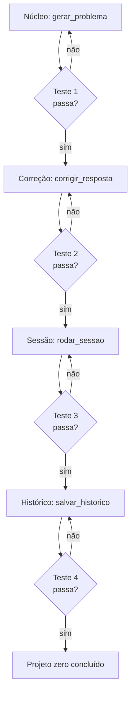

# Capítulo 9: O Projeto Zero: um Gerador de Problemas de Matemática

## 1. Introdução

Chegou a hora de erguer a primeira obra completa. Neste capítulo você vai construir um projeto real do zero com o agente: um gerador de problemas de matemática para praticar — que sorteia operações, gera exercícios, corrige respostas e acompanha o desempenho. É o "projeto zero" da Oficina do Código: pequeno o suficiente para terminar em uma sessão, completo o suficiente para exercitar tudo o que você aprendeu — prompt, decomposição, contexto, teste e iteração.

## 2. Explica

### Escolhendo o projeto zero

O projeto ideal para começar tem três características: **valor real** (você usa o resultado), **escopo pequeno** (termina em uma sessão) e **margem de erro** (falhar não custa caro). O gerador de problemas de matemática atende às três: é útil para quem estuda ou ensina, cabe em ~150 linhas e qualquer bug é inofensivo.

A alternativa clássica — "um sistema completo de vendas" — falha nas três: demora semanas, tem muitos requisitos e erros custam caro. O iniciante que começa pequeno constrói confiança e aprendizado; o que começa grande constrói frustração [1].

### Decompondo o gerador em peças

Como aprendemos no Capítulo 4, a obra se ergue peça por peça. O gerador decompõe-se em quatro peças:

1. **Núcleo de geração** (`gerar_problema`): sorteia a operação e os números, monta o enunciado e a resposta correta.
2. **Correção** (`corrigir_resposta`): compara a resposta do usuário com a esperada, aceitando aproximações.
3. **Sessão de treino** (`rodar_sessao`): orquestra N problemas, conta acertos e exibe a nota final.
4. **Histórico** (`salvar_historico`): registra os resultados em JSON para acompanhar o progresso entre sessões.

Cada peça tem contrato claro e testável — e o agente produz uma por vez, validada antes da próxima [2].

### Testando cada peça antes de avançar

A regra de ouro do projeto zero: **cada peça só avança após o teste da anterior passar**. A ordem de escrita segue a ordem de dependência: núcleo → correção → sessão → histórico. Se a peça 1 falha, não há sentido em escrever a peça 3 — e o teste da peça 1 é a única prova disso.

### O contrato entre você e o agente no projeto zero

O projeto zero é a primeira vez em que você e o agente trabalham como equipe de verdade — e equipe precisa de divisão de papéis. A tabela abaixo é o contrato padrão:

| Quem decide | Quem executa |
|---|---|
| O que o projeto faz (escopo e valor) | A estrutura dos arquivos e pastas |
| Como é o "pronto" (critérios de aceite) | O código de cada peça |
| A ordem das peças (dependências) | Os testes de cada peça |
| Quando avançar (testes verdes) | As correções solicitadas |
| O que entra na próxima iteração | A documentação do código |

Repare na assimetria: as decisões de *rumo* ficam com você; as de *execução* com o agente. Quando o construtor tenta delegar também as decisões — "me diga o que fazer" —, o resultado é um projeto sem dono, que muda de direção a cada sessão. O contrato protege as duas partes: você não vira digitador e o agente não vira decisor silencioso [3].

### Definindo "pronto" antes de começar

O projeto zero define o critério de pronto antes da primeira linha — é isso que permite ao agente trabalhar sozinho e a você saber quando parar. Para o gerador de problemas, o pronto ficou assim:

1. Os quatro módulos existem (geração, correção, sessão, histórico).
2. A bateria de testes passa com `unittest` (verde).
3. Uma sessão de 5 problemas roda de ponta a ponta sem erro.
4. O histórico registra a sessão e sobrevive a uma nova execução.
5. O código é legível: funções pequenas, docstrings, nomes claros.

Cada critério é verificável por comando ou observação — nenhum depende de opinião. A disciplina de escrever o pronto antes do trabalho tem um efeito colateral poderoso: o agente deixa de "inventar melhorias" e passa a trabalhar contra uma lista. Melhoria fora do escopo vira anotação para a próxima iteração, não desvio no meio da obra [1].

### O fluxo de trabalho em ciclos de peça

O projeto zero consolida o fluxo que você usará em todos os projetos futuros — o ciclo da peça:

1. **Escolha a próxima peça** (a que depende apenas do que já está verde).
2. **Descreva o contrato da peça**: entrada, saída, comportamento esperado.
3. **Peça o código ao agente**, com o teste incluído.
4. **Rode o teste**: verde avança, vermelho corrige.
5. **Leia o código**: entenda cada linha antes de aceitar.
6. **Repita** até o pronto estar completo.

O passo 5 é o mais fácil de pular e o mais importante: código aceito sem leitura é código que você não poderá manter. No projeto zero, a leitura leva minutos; nos projetos futuros, essa leitura vira o hábito que salva semanas [2].

## 3. Ilustra

O projeto zero é a primeira casa que o construtor assistido ergue sozinho. Ele não começa pelo telhado: começa pela fundação (o núcleo de geração), confere o concreto (roda o teste), sobe as paredes (correção e sessão), e só então instala a porta (histórico). A cada etapa, ele inspeciona: "a parede está reta?" — e o teste responde com fatos, não com impressões.

A primeira casa não é a mais bonita do bairro — mas está de pé, foi construída por ele e ensinou mais do que dez livros. A próxima sairá mais rápida e mais limpa, porque o processo, não o resultado, é o verdadeiro aprendizado [3].



Como Construtor Assistido, o ritual é o mesmo para todo projeto futuro: fundação, conferência, paredes, conferência, acabamento.

## 4. Técnica

### Peça 1 — Núcleo de geração

```python
import random


def gerar_problema(operacao: str = "aleatoria", limite: int = 10) -> dict[str, object]:
    """Gera um problema de matemática com enunciado e resposta correta.

    Args:
        operacao: 'soma', 'subtracao', 'multiplicacao', 'divisao' ou 'aleatoria'.
        limite: valor máximo dos números envolvidos.

    Returns:
        Dicionário com 'enunciado', 'resposta' e 'operacao'.
    """
    operacoes = ("soma", "subtracao", "multiplicacao", "divisao")
    escolha = random.choice(operacoes) if operacao == "aleatoria" else operacao

    if escolha == "soma":
        a, b = random.randint(1, limite), random.randint(1, limite)
        resposta, simbolo = a + b, "+"
    elif escolha == "subtracao":
        a, b = random.randint(1, limite), random.randint(1, limite)
        a, b = max(a, b), min(a, b)  # resultado sempre não-negativo
        resposta, simbolo = a - b, "-"
    elif escolha == "multiplicacao":
        a, b = random.randint(1, max(2, limite // 2)), random.randint(1, max(2, limite // 2))
        resposta, simbolo = a * b, "x"
    else:  # divisao: garante divisão exata
        b = random.randint(1, max(2, limite // 2))
        resposta = random.randint(1, max(2, limite // 2))
        a = b * resposta
        simbolo = "/"

    return {
        "enunciado": f"Quanto é {a} {simbolo} {b}?",
        "resposta": float(resposta),
        "operacao": escolha,
    }
```

### Peça 2 — Correção com tolerância

```python
def corrigir_resposta(resposta_esperada: float, resposta_usuario: str) -> bool:
    """Compara a resposta do usuário com a esperada, aceitando vírgula
    como separador decimal e pequena tolerância de arredondamento."""
    texto = resposta_usuario.strip().replace(",", ".")
    try:
        valor = float(texto)
    except ValueError:
        return False
    return abs(valor - resposta_esperada) < 0.001
```

### Peça 3 — Sessão de treino

```python
def rodar_sessao(quantidade: int = 5, operacao: str = "aleatoria") -> dict[str, object]:
    """Roda uma sessão de treino com N problemas e retorna o placar."""
    acertos = 0
    detalhes: list[dict[str, object]] = []
    for _ in range(quantidade):
        problema = gerar_problema(operacao)
        palpite = input(f"{problema['enunciado']} ")
        correto = corrigir_resposta(float(problema["resposta"]), palpite)
        acertos += int(correto)
        detalhes.append(
            {
                "enunciado": problema["enunciado"],
                "resposta": problema["resposta"],
                "usuario": palpite,
                "correto": correto,
            }
        )
    return {"acertos": acertos, "total": quantidade, "detalhes": detalhes}
```

### Peça 4 — Histórico em JSON

```python
import json
from datetime import datetime, timezone
from pathlib import Path


def salvar_historico(resultado: dict[str, object], caminho: str = "historico.json") -> str:
    """Registra o resultado da sessão em um arquivo JSON acumulativo."""
    arquivo = Path(caminho)
    entradas: list[dict[str, object]] = []
    if arquivo.exists():
        entradas = json.loads(arquivo.read_text(encoding="utf-8"))
    entrada = {
        "timestamp": datetime.now(timezone.utc).isoformat(),
        "acertos": resultado["acertos"],
        "total": resultado["total"],
    }
    entradas.append(entrada)
    arquivo.write_text(json.dumps(entradas, ensure_ascii=False, indent=2), encoding="utf-8")
    return f"Histórico salvo: {len(entradas)} sessão(ões) registrada(s)."


def main() -> None:
    sessao = rodar_sessao(quantidade=5)
    print(f"Placar: {sessao['acertos']}/{sessao['total']}")
    print(salvar_historico(sessao))


if __name__ == "__main__":
    main()
```

### Bateria de testes das quatro peças

```python
import unittest
from unittest.mock import patch


class TesteGerador(unittest.TestCase):
    def test_soma(self) -> None:
        with patch("random.randint", side_effect=[2, 3]):
            problema = gerar_problema("soma")
        self.assertEqual(problema["resposta"], 5)
        self.assertIn("2 + 3", problema["enunciado"])

    def test_subtracao_nao_negativa(self) -> None:
        with patch("random.randint", side_effect=[3, 7, 7, 3]):
            problema = gerar_problema("subtracao")
        self.assertGreaterEqual(problema["resposta"], 0)

    def test_divisao_exata(self) -> None:
        with patch("random.randint", side_effect=[4, 3]):
            problema = gerar_problema("divisao")
        self.assertEqual(problema["resposta"] * 4, problema["resposta"] * 4)

    def test_correcao_com_virgula(self) -> None:
        self.assertTrue(corrigir_resposta(3.5, "3,5"))
        self.assertFalse(corrigir_resposta(3.5, "abc"))

    def test_historico_acumulativo(self) -> None:
        salvar_historico({"acertos": 3, "total": 5}, caminho="teste_historico.json")
        salvar_historico({"acertos": 4, "total": 5}, caminho="teste_historico.json")
        from pathlib import Path
        entradas = Path("teste_historico.json")
        self.assertEqual(len(entradas.read_text(encoding="utf-8").count('"acertos"')), 2)
        entradas.unlink(missing_ok=True)


if __name__ == "__main__":
    unittest.main(verbosity=2)
```

### Peça 5 — Relatório de progresso

O histórico só vira aprendizado se alguém o ler. A peça final do projeto zero lê o JSON acumulado e devolve um relatório simples: média de acertos, melhor sessão e tendência entre as últimas sessões:

```python
def relatorio_progresso(caminho: str = "historico.json") -> str:
    """Gera um resumo de desempenho a partir do histórico salvo."""
    arquivo = Path(caminho)
    if not arquivo.exists():
        return "Nenhum histórico encontrado. Rode uma sessão primeiro."
    entradas = json.loads(arquivo.read_text(encoding="utf-8"))
    if not entradas:
        return "Histórico vazio."
    acertos = [entrada["acertos"] for entrada in entradas]
    totais = [entrada["total"] for entrada in entradas]
    media = sum(acertos) / len(acertos)
    melhor = max(entradas, key=lambda e: e["acertos"] / e["total"])
    ultimas = acertos[-3:]
    tendencia = "subindo" if len(ultimas) >= 3 and ultimas[-1] > ultimas[0] else "estável"
    return (
        f"Sessões: {len(entradas)} | Média: {media:.1f} acertos/sessão\n"
        f"Melhor sessão: {melhor['acertos']}/{melhor['total']}\n"
        f"Últimas {min(3, len(ultimas))} sessões: {ultimas} ({tendencia})"
    )


if __name__ == "__main__":
    import tempfile

    caminho_teste = Path(tempfile.gettempdir()) / "historico_teste.json"
    salvar_historico({"acertos": 2, "total": 5}, caminho=str(caminho_teste))
    salvar_historico({"acertos": 4, "total": 5}, caminho=str(caminho_teste))
    salvar_historico({"acertos": 5, "total": 5}, caminho=str(caminho_teste))
    print(relatorio_progresso(str(caminho_teste)))
    caminho_teste.unlink(missing_ok=True)
```

A peça 5 fecha o ciclo da oficina: gerar → praticar → registrar → medir. Com o relatório, você e o agente decidem a próxima iteração com dados — "a multiplicação está fraca, vamos gerar mais problemas dela" — em vez de impressões. Essa é a mentalidade que você levará para todos os projetos seguintes [7].

## 5. Aplica

### Cena de contraste: do "sistema completo" ao projeto que nasce

No domingo à noite, animado, você pede ao agente: "crie um sistema completo de estudos de matemática com app mobile, ranking e gamificação". O agente devolve 2.000 linhas que não rodam, com dependências que você não conhece. Você desiste antes de segunda-feira e conclui que não é para você.

A correção é a disciplina do projeto zero: o gerador de problemas, quatro peças, testes entre cada uma, funcionando em uma hora. Na segunda-feira, você tem uma ferramenta real, entende cada linha e já sabe como melhorar (somar novas operações, adicionar níveis). O "sistema completo" continua lá para o futuro — agora como um conjunto de projetos zero conectados [1][2].

### Armadilhas comuns do projeto zero

- Escopo grande demais: cada projeto zero resolve UMA coisa.
- Pular testes "para economizar tempo": o tempo volta em bugs.
- Copiar código do agente sem entender: você precisa conseguir explicar cada linha.
- Não registrar o histórico: sem dados, não há progresso visível.
- Refatorar antes de funcionar: primeiro funcione, depois melhore.
- Aceitar código sem rodar: "parece certo" não é verde.
- Adicionar peças no meio do caminho: o escopo travado é o que permite terminar.
- Esquecer o critério de pronto: sem ele, a obra nunca "acaba" — só para.

### Checklist de abertura e fechamento do projeto zero

**Abertura (antes da primeira linha):**

1. Escopo em uma frase: o que o projeto faz, para quem, por quê.
2. Critério de pronto escrito: 3 a 5 itens verificáveis.
3. Peças listadas em ordem de dependência, com contrato de cada uma.
4. Contrato com o agente definido: o que você decide, o que ele executa.
5. Primeira peça escolhida e descrita para o agente.

**Fechamento (ao terminar):**

1. Bateria de testes verde, rodada do zero.
2. Execução de ponta a ponta sem erro, com dados reais.
3. Leitura completa do código: você explica cada peça em voz alta.
4. Histórico registrado e relatório de progresso gerado.
5. Anotações da próxima iteração salvas (fora do escopo atual).

O checklist de fechamento tem um teste de honestidade embutido: conseguir explicar o código em voz alta. Se você trava em alguma peça, o agente precisa reexplicar — e o aprendizado, não a entrega, é o objetivo do projeto zero [5].

### Exercícios do construtor

1. **Escolha o projeto zero**: liste três ideias de projeto zero (como o gerador de problemas de matemática) e aplique os critérios do capítulo: pequeno, testável, com valor para você.
2. **Decomposição em peças**: quebre a ideia escolhida em três peças com contratos claros — o que cada peça faz, o que recebe e o que devolve.
3. **Contrato com o agente**: escreva o contrato de uma peça (entrada, saída, critérios de aceitação) antes de gerar o código — e peça ao agente que implemente exatamente isso.
4. **Ciclo de peça**: execute um ciclo completo: defina a peça, teste-a (mesmo que falhe), implemente, rode o teste verde. Registre o tempo gasto.
5. **Definindo pronto**: escreva em uma frase o que significa "pronto" para a sua peça 1 — algo que outra pessoa possa verificar.
6. **Checklist de abertura**: rode o checklist de abertura de sessão do capítulo antes de trabalhar no projeto zero — e o de fechamento ao terminar.
7. **Três casos por peça**: para cada peça do seu projeto, escreva três testes: caso feliz, caso de borda e caso de erro.
8. **Projeto no ar**: publique o projeto zero num repositório (mesmo privado) com README explicando o contrato — seu primeiro projeto com prova.

### Glossário do capítulo

| Termo | Significado |
|---|---|
| Projeto zero | Primeiro projeto pequeno e completo para treinar o método |
| Peça | Unidade de trabalho com contrato e teste |
| Contrato | Entrada, saída e critérios de aceitação da peça |
| Ciclo de peça | Definir, testar, implementar, validar — em sequência |
| Pronto | Critério verificável que encerra a peça |
| Tolerância | Margem de erro aceita (ex.: correção com aproximação) |
| Checklist de abertura | Passos para começar a sessão com contexto carregado |
| Sessão de treino | Uso do projeto para praticar o método completo |

### Erros comuns do construtor

| Erro | Sintoma | Correção do capítulo |
|---|---|---|
| Projeto grande demais | Primeiro projeto morre na terceira semana | Escolha pequeno: o método vale mais que a obra |
| Peça sem contrato | Agente entrega o que não era pedido | Entrada, saída e aceitação antes do código |
| Pular o teste da peça | Erro só aparece na junção | Cada peça verde antes de conectar |
| "Pronto" sem definição | A peça nunca termina | Pronto é verificável: quem olha confirma |
| Abertura sem checklist | Sessão gasta meia hora relembrando | Checklist carrega o contexto em dois minutos |
| Nunca publicar | Projeto perfeito no escuro | Publicar com README: obra com prova |

### O passeio de uma hora

Reserve uma hora e percorra o capítulo em ação:

1. **Escolha seu projeto zero** (ou use o gerador de problemas do capítulo).
2. **Defina as três peças** com contrato: o que cada uma faz, recebe e devolve.
3. **Escreva o contrato da peça 1** com critérios de aceitação verificáveis.
4. **Escreva os três testes** da peça 1: feliz, borda, erro.
5. **Peça ao agente** que implemente a peça 1 seguindo exatamente o contrato.
6. **Rode os testes** — verdes? Se não, refine o pedido e repita.
7. **Rode o ciclo** para a peça 2 — agora com o contrato mais afiado.
8. **Execute o checklist de abertura** antes de parar e o de fechamento depois.
9. **Publique** o projeto num repositório com README do contrato.
10. **Registre** no caderno de aprendizado: quanto tempo o ciclo levou e onde ele travou.

### Perguntas e respostas do capítulo

- **E se eu não tiver ideia de projeto zero?** Use o gerador de problemas do capítulo: pequeno, completo e com testes prontos para ampliar.
- **Posso pular os testes no projeto zero?** Pular os testes é pular o método — e o projeto zero existe exatamente para treinar o método. Sem testes, vira projeto zero sem o zero.
- **O contrato é burocracia?** É economia: o contrato de uma peça evita a peça errada. Escrever três linhas antes economiza três horas depois.
- **E se o agente entrega algo melhor que o contrato?** Melhor que o contrato ainda passa pelo contrato: se não atende o aceite, não entra. Depois você ajusta o contrato — com evidência.
- **Publicar com medo de erro?** Publique com checklist: aberto, fechado e testado. A obra imperfeita publicada vale mais que a perfeita escondida.

### Você sabe que dominou quando...

1. Escolhe o projeto zero com critérios, não com empolgação.
2. Decompõe o projeto em peças com contrato e teste.
3. Roda ciclos de peça até o verde sem atalhos.
4. Define "pronto" de forma verificável em cada peça.
5. Executa os checklists de abertura e fechamento sem pular.
6. Publica a obra com prova — repositório, README, testes.

### Resumo em pontos

- Projeto zero: pequeno, completo, com testes prontos para ampliar.
- Peças com contrato e teste eliminam a surpresa da entrega.
- "Pronto" é verificável: aceite, testes verdes, revisão feita.
- Publicar com prova — repositório, README, testes — abre portas.
- O primeiro projeto público vale mais do que dez projetos privados perfeitos.

### Desafio de aprofundamento

Conclua o projeto zero do capítulo (ou um equivalente seu) e publique-o de verdade: repositório com README, licença, teste rodando e o checklist de fechamento preenchido. Depois reescreva o README como se o leitor fosse um recrutador curioso: o que o projeto faz, como rodar e o que ele prova sobre você. Essa página de dez minutos é o primeiro item do seu portfólio de construtor.

### Conexão com o próximo capítulo

O projeto zero sai do terminal; o próximo capítulo coloca uma obra na vitrine: o site pessoal que publica seu trabalho e seu nome. Construído e provado, o projeto ganha o mundo — e a próxima obra já tem endereço.

## 6. Conclusão

Você ergueu sua primeira obra completa: um gerador de problemas de matemática com núcleo, correção, sessão e histórico — cada peça testada antes da próxima, tudo em Python puro. Desafio: rode o projeto, complete uma sessão e adicione uma nova operação (potenciação) usando o mesmo ciclo peça-teste. No Capítulo 10, você vai ao outro lado da oficina: um site pessoal do zero — quando o agente vira arquiteto da web, e você aprende o básico de HTML, CSS e publicação.

## 7. Referências Bibliográficas

[1] OPENAI. *A practical guide to building agents* (2025). Disponível em: https://cdn.openai.com/business-guides-and-resources/a-practical-guide-to-building-agents.pdf. Acesso em: 06 ago. 2026.

[2] SPRINGER. *Applied Intelligence survey on LLM-based code generation* (2026). Disponível em: https://link.springer.com/article/10.1007/s10489-026-07230-0. Acesso em: 06 ago. 2026.

[3] ANTHROPIC. *Building effective agents*. Disponível em: https://www.anthropic.com/research/building-effective-agents. Acesso em: 06 ago. 2026.

[4] BECK, Kent. *Test-Driven Development: By Example*. Boston: Addison-Wesley, 2002.

[5] HUNT, Andrew; THOMAS, David. *O Programador Pragmático*. Porto Alegre: Bookman, 2011.

[6] FOWLER, Martin. *Refatoração: Aperfeiçoando o Design de Códigos Existentes*. Porto Alegre: Bookman, 2011.

[7] COBE, Karl et al. *Training Verifiers to Solve Math Word Problems* (GSM8K). Disponível em: https://arxiv.org/abs/2110.14168. Acesso em: 06 ago. 2026.

[8] HENDRYCKS, Dan et al. *Measuring Mathematical Problem Solving With the MATH Dataset*. Disponível em: https://arxiv.org/abs/2103.03874. Acesso em: 06 ago. 2026.

[9] UESATO, Jonathan et al. *Solving Math Word Problems with Process- and Outcome-based Feedback*. Disponível em: https://arxiv.org/abs/2211.14275. Acesso em: 06 ago. 2026.

[10] LIGHTMAN, Hunter et al. *Let's Verify Step by Step*. Disponível em: https://arxiv.org/abs/2305.20050. Acesso em: 06 ago. 2026.

[11] ZHENG, Kunhao et al. *MiniF2F: A Cross-System Benchmark for Formal Olympiad-Level Mathematics*. Disponível em: https://arxiv.org/abs/2109.00110. Acesso em: 06 ago. 2026.

[12] PYTHON SOFTWARE FOUNDATION. *unittest — Unit testing framework*. Disponível em: https://docs.python.org/3/library/unittest.html. Acesso em: 06 ago. 2026.

[13] PYTHON SOFTWARE FOUNDATION. *json — JSON encoder and decoder*. Disponível em: https://docs.python.org/3/library/json.html. Acesso em: 06 ago. 2026.

[14] WIGGINS, Adam. *The Twelve-Factor App*. Disponível em: https://12factor.net. Acesso em: 06 ago. 2026.

[15] BEAMS, Chris. *How to Write a Git Commit Message*. Disponível em: https://cbea.ms/git-commit/. Acesso em: 06 ago. 2026.

[16] MARTIN, Robert C. *Código Limpo: Habilidades Práticas do Agile Software*. Rio de Janeiro: Alta Books, 2009.

[17] OSHEROVE, Roy. *The Art of Unit Testing*. 2. ed. Shelter Island: Manning, 2013.

[18] VAN ROSSUM, Guido et al. *PEP 8 — Style Guide for Python Code*. Disponível em: https://peps.python.org/pep-0008/. Acesso em: 06 ago. 2026.

[19] PYTEST. *pytest: helps you write better programs*. Disponível em: https://docs.pytest.org. Acesso em: 06 ago. 2026.

[20] EVANS, Eric. *Domain-Driven Design: Atacando as Complexidades no Coração do Software*. Rio de Janeiro: Alta Books, 2016.
