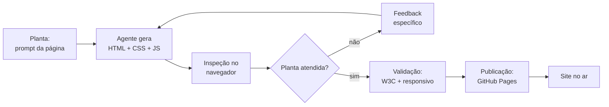

# Capítulo 10: Um Site Pessoal do Zero: Quando o Agente é Arquiteto da Web

## 1. Introdução

Você já ergueu um projeto em Python. Agora vamos mudar de canteiro: construir um site pessoal do zero — uma página única com HTML, CSS e um toque de JavaScript — usando o agente como arquiteto e você como construtor que inspeciona cada parede. Este capítulo cobre a tríade da web (estrutura, estilo e comportamento), a colaboração com o agente na geração de páginas e a publicação gratuita do resultado. Ao final, seu site estará no ar.

## 2. Explica

### A tríade da web: HTML, CSS e JavaScript

Todo site, por mais sofisticado, repousa sobre três camadas [1]:

**HTML (estrutura)**: a linguagem de marcação que define o conteúdo e a semântica — títulos, parágrafos, listas, imagens, links. É o esqueleto da página. Um HTML semântico (`<header>`, `<nav>`, `<main>`, `<footer>`) é acessível e compreensível para humanos e buscadores.

**CSS (estilo)**: a linguagem que define a aparência — cores, fontes, espaçamentos, posicionamento. É a pele do esqueleto. Uma folha de estilos externa mantém a separação entre conteúdo e visual, a boa prática central [2].

**JavaScript (comportamento)**: a linguagem de programação do navegador — interações, validação de formulário, atualização de conteúdo sem recarregar. É o músculo. Para um site pessoal, algumas linhas bastam.

A regra de ouro da arquitetura web: **separe as camadas** — cada uma em seu arquivo. Misturar estilos dentro do HTML funciona, mas transforma a manutenção em pesadelo.

### Colaborando com o agente na geração de páginas

O site pessoal é o exercício perfeito de colaboração com o agente porque a inspeção é instantânea e visual: você abre o navegador e vê o resultado. O fluxo profissional:

1. **Prompt com a planta**: descreva a página em termos de conteúdo e estrutura ("portfólio com cabeçalho, sobre mim, projetos e contato; paleta escura com acento verde; responsivo").
2. **Geração e inspeção**: o agente gera os três arquivos; você abre no navegador e compara com a planta.
3. **Iteração visual**: feedback específico ("o menu quebra no celular", "aumente o contraste do título") — o ciclo de iteração do Capítulo 4 aplicado ao visual [3].
4. **Validação**: confira o HTML no validador (W3C) e a responsividade com o modo de desenvolvimento do navegador.

### Publicação gratuita: GitHub Pages

Publicar um site estático não custa nada: GitHub Pages serve arquivos HTML/CSS/JS diretamente do seu repositório, com domínio `usuario.github.io` e HTTPS gratuito [4]. O fluxo: criar repositório, enviar os arquivos, ativar Pages nas configurações — e o site está no ar em minutos. É o caminho de menor atrito para o iniciante: sem servidor, sem banco, sem custo.

### Responsividade: a regra do celular primeiro

O site pessoal será visto no celular — estatisticamente, na maioria das vezes. A responsividade não é um extra: é a regra do projeto. Três técnicas formam o mínimo profissional:

| Técnica | O que faz | Onde entra |
|---|---|---|
| `viewport` meta | Ajusta a escala ao tamanho da tela | `<head>` do HTML |
| Unidades flexíveis | `fr`, `%`, `auto-fit` em vez de larguras fixas | CSS (grid/grade) |
| Media queries | Regras condicionais por largura de tela | CSS (`@media`) |

O teste de honestidade da responsividade: abra o site no navegador, reduza a janela até o tamanho de um celular (375px) e verifique menu, cartões e formulário. Se algo quebra, o feedback para o agente é cirúrgico: "abaixo de 768px, o menu deve virar hambúrguer" — nunca "deixa mais responsivo" [3].

### Acessibilidade básica: o agente não pode pular

O validador W3C garante que o HTML é válido — não que ele é utilizável. A acessibilidade mínima que o construtor deve exigir do agente em todo site:

| Item | Exigência |
|---|---|
| Idioma | `lang="pt-BR"` no `<html>` |
| Semântica | `<header>`, `<nav>`, `<main>`, `<footer>` em vez de `<div>` genéricos |
| Formulário | `<label>` associado a cada `<input>` (pelo atributo `for`) |
| Contraste | Texto legível sobre o fundo (verifique com ferramentas de contraste) |
| Teclado | Todos os elementos interativos acessíveis por Tab |
| Texto alternativo | `alt` descritivo em imagens |

A boa notícia: essas seis exigências cabem em duas linhas do prompt da planta ("HTML semântico e acessível; labels nos formulários"). O agente cumpre; o construtor inspeciona — e o site sai acessível sem esforço extra [2].

### O que NÃO entra no site pessoal v1

O escopo protegido é o que permite terminar. Para o v1, ficam de fora com anotação para iterações futuras:

- Framework JavaScript (React/Vue): o v1 é HTML/CSS/JS puro.
- Backend ou banco de dados: o formulário é de demonstração.
- Conta de e-mail real: o formulário não envia nada (anotar: Formspree).
- Domínio próprio: `usuario.github.io` serve — o domínio vem depois.
- Build tooling: sem npm, sem bundler — o navegador lê direto.

Cada item fora do escopo é uma decisão consciente, não uma limitação. Quando o site v1 estiver no ar, as iterações seguintes resolvem uma coisa de cada vez — o mesmo princípio do projeto zero, agora com a vitrine pública [4].

## 3. Ilustra

O site pessoal é o estande da feira do construtor assistido: a vitrine onde ele mostra o que sabe fazer. O mestre de obras não levanta o estande sozinho — ele desenha a planta (o prompt), o arquiteto digital desenha as paredes (HTML), o decorador pinta (CSS), e o eletricista instala o botão da lâmpada (JavaScript). O construtor não executa tudo; ele dirige e inspeciona.

E como todo estande, ele é público: qualquer um pode visitar. A publicação não é o fim — é o começo de um portfólio que cresce a cada obra [4].



Como Construtor Assistido, o site pessoal é seu cartão de visitas digital — e o primeiro item do portfólio que você vai construir na Parte IV.

## 4. Técnica

### A planta: prompt para gerar o site

Prompt profissional para o agente (use as três camadas do Capítulo 4):

```text
Você é um desenvolvedor front-end sênior.

Contexto: site pessoal de portfólio, página única, em português.
Tarefa: gere três arquivos separados (index.html, estilo.css, script.js):
- HTML semântico: cabeçalho com navegação, seção "Sobre mim",
  seção "Projetos" com 3 cartões, seção "Contato" com formulário
  simples (nome e e-mail) e rodapé.
- CSS externo: tema escuro (#0d1117), acento verde (#2ea44f),
  fonte Inter, layout responsivo (media query em 768px), menu
  que vira hambúrguer no celular.
- JS externo: validação do formulário (nome e e-mail obrigatórios)
  e mensagem de sucesso sem recarregar a página.
Formato: um arquivo por vez, começando pelo HTML, todos completos.
```

### HTML semântico de um site pessoal

```html
<!DOCTYPE html>
<html lang="pt-BR">
<head>
  <meta charset="UTF-8">
  <meta name="viewport" content="width=device-width, initial-scale=1.0">
  <title>Meu Portfólio</title>
  <link rel="stylesheet" href="estilo.css">
</head>
<body>
  <header>
    <nav>
      <a href="#sobre">Sobre</a>
      <a href="#projetos">Projetos</a>
      <a href="#contato">Contato</a>
    </nav>
  </header>

  <main>
    <section id="sobre">
      <h1>Olá, eu sou a Ana</h1>
      <p>Estudante de programação assistida por IA.</p>
    </section>

    <section id="projetos">
      <h2>Projetos</h2>
      <div class="grade">
        <article class="cartao">
          <h3>Gerador de Matemática</h3>
          <p>Treinador de problemas com histórico.</p>
        </article>
        <article class="cartao">
          <h3>CLI de Tarefas</h3>
          <p>Lista de tarefas no terminal.</p>
        </article>
        <article class="cartao">
          <h3>Este site</h3>
          <p>Feito em parceria com um agente.</p>
        </article>
      </div>
    </section>

    <section id="contato">
      <h2>Contato</h2>
      <form id="formulario">
        <label for="nome">Nome</label>
        <input id="nome" name="nome" required>
        <label for="email">E-mail</label>
        <input id="email" name="email" type="email" required>
        <button type="submit">Enviar</button>
      </form>
      <p id="mensagem" hidden>Mensagem enviada!</p>
    </section>
  </main>

  <footer><p>Feito com auxílio de IA.</p></footer>
  <script src="script.js"></script>
</body>
</html>
```

### CSS responsivo com tema escuro

```css
:root {
  --fundo: #0d1117;
  --texto: #e6edf3;
  --acento: #2ea44f;
}

* {
  margin: 0;
  padding: 0;
  box-sizing: border-box;
}

body {
  background-color: var(--fundo);
  color: var(--texto);
  font-family: "Inter", system-ui, sans-serif;
  line-height: 1.6;
}

header {
  padding: 1rem 2rem;
  border-bottom: 1px solid #30363d;
}

nav {
  display: flex;
  gap: 1.5rem;
}

nav a {
  color: var(--texto);
  text-decoration: none;
}

nav a:hover {
  color: var(--acento);
}

main {
  max-width: 720px;
  margin: 0 auto;
  padding: 2rem;
}

.grade {
  display: grid;
  grid-template-columns: repeat(auto-fit, minmax(200px, 1fr));
  gap: 1rem;
  margin-top: 1rem;
}

.cartao {
  border: 1px solid #30363d;
  border-radius: 8px;
  padding: 1rem;
}

.cartao h3 {
  color: var(--acento);
  margin-bottom: 0.5rem;
}

form {
  display: flex;
  flex-direction: column;
  gap: 0.5rem;
  max-width: 360px;
}

input {
  padding: 0.5rem;
  border-radius: 6px;
  border: 1px solid #30363d;
  background-color: #161b22;
  color: var(--texto);
}

button {
  padding: 0.5rem;
  background-color: var(--acento);
  color: #ffffff;
  border: none;
  border-radius: 6px;
  cursor: pointer;
}

@media (max-width: 768px) {
  nav {
    flex-direction: column;
    gap: 0.5rem;
  }
}
```

### JavaScript: validação sem recarregar

```javascript
const formulario = document.getElementById("formulario");
const mensagem = document.getElementById("mensagem");

formulario.addEventListener("submit", (evento) => {
  evento.preventDefault();
  const nome = document.getElementById("nome").value.trim();
  const email = document.getElementById("email").value.trim();
  if (nome.length === 0 || email.length === 0) {
    alert("Preencha nome e e-mail.");
    return;
  }
  formulario.hidden = true;
  mensagem.hidden = false;
});
```

### Verificação automática do site em Python

Antes de publicar, confie em código, não em olhar. O script abaixo inspeciona o `index.html` com o analisador da biblioteca padrão e confere as exigências da seção Explica — estrutura, acessibilidade e boas práticas:

```python
import sys
from html.parser import HTMLParser
from pathlib import Path


class InspecionadorHTML(HTMLParser):
    """Coleta as tags e atributos essenciais do arquivo HTML."""

    def __init__(self) -> None:
        super().__init__()
        self.tags: list[str] = []
        self.ids: set[str] = set()
        self.tem_lang = False
        self.tem_viewport = False
        self.tem_doctype = False

    def handle_starttag(self, tag: str, attrs: list[tuple[str, str | None]]) -> None:
        self.tags.append(tag)
        atributos = dict(attrs)
        if tag == "html" and atributos.get("lang"):
            self.tem_lang = True
        if tag == "meta" and atributos.get("name") == "viewport":
            self.tem_viewport = True
        if atributos.get("id"):
            self.ids.add(str(atributos["id"]))


def verificar_site(caminho_html: str = "index.html") -> str:
    """Verifica as boas práticas do site e devolve um relatório."""
    arquivo = Path(caminho_html)
    if not arquivo.is_file():
        return f"Arquivo {caminho_html} não encontrado."
    texto = arquivo.read_text(encoding="utf-8")
    parser = InspecionadorHTML()
    parser.feed(texto)
    parser.tem_doctype = texto.lstrip().lower().startswith("<!doctype html>")

    requisitos = [
        ("DOCTYPE html", parser.tem_doctype),
        ("lang no <html>", parser.tem_lang),
        ("meta viewport", parser.tem_viewport),
        ("<main> presente", "main" in parser.tags),
        ("<header> presente", "header" in parser.tags),
        ("<footer> presente", "footer" in parser.tags),
        ("<nav> presente", "nav" in parser.tags),
        ("script externo", "script" in parser.tags),
        ("formulario com id", "form" in parser.tags and bool(parser.ids)),
    ]
    linhas = [f"Verificação de {caminho_html}", "-" * 46]
    for nome, ok in requisitos:
        linhas.append(f"[{'OK' if ok else 'FALTA'}] {nome}")
    aprovado = all(ok for _, ok in requisitos)
    linhas.append("-" * 46)
    linhas.append(f"Resultado: {'APROVADO' if aprovado else 'INCOMPLETO'}")
    return "\n".join(linhas)


if __name__ == "__main__":
    alvo = sys.argv[1] if len(sys.argv) > 1 else "index.html"
    print(verificar_site(alvo))
```

Rode `python verificar_site.py index.html` antes do `git push`: o relatório substitui a inspeção de olho pelas mesmas exigências que o agente recebeu na planta. Se o agente "esqueceu" o `lang` ou o viewport, o script acusa antes do site ir ao ar — a mesma filosofia de CI do Capítulo 11 [5].

### Publicando no GitHub Pages

```bash
# 1. Crie o repositório no GitHub (ex.: meu-site)
git init
git add index.html estilo.css script.js
git commit -m "feat: site pessoal v1"
git remote add origin https://github.com/SEU_USUARIO/meu-site.git
git push -u origin main

# 2. No GitHub: Settings > Pages > Source > branch main > Save
# 3. Seu site estará em https://SEU_USUARIO.github.io/meu-site/
```

## 5. Aplica

### Cena de contraste: o estande sem inspeção

Você pede ao agente "um site de portfólio bonito" e recebe 400 linhas de HTML com estilo embutido, sem separação de camadas, sem responsividade. No desktop parece razoável; no celular do seu irmão, o menu explode e o texto corta. Você "não entende de web" e desiste de consertar.

A correção é o fluxo deste capítulo: a planta vem primeiro (prompt com estrutura e camadas separadas), a inspeção é obrigatória (abrir no navegador e no modo mobile antes de avançar) e a iteração é cirúrgica (um feedback específico por vez: "no celular, o menu deve virar hambúrguer"). Cada parede é verificada antes da próxima — o mesmo ritual do projeto zero, agora com olhos [3].

### Armadilhas comuns do site pessoal

- Misturar HTML/CSS/JS num arquivo único (pesadelo de manutenção).
- Não testar no celular: responsividade não é opcional.
- Copiar templates gigantes sem entender a estrutura.
- Publicar sem validar HTML (validador W3C gratuito).
- Esquecer o `lang="pt-BR"` e as meta tags essenciais.
- Pedir "site bonito" em vez de planta com estrutura e camadas.
- Iterar com feedback vago ("ficou estranho") — o agente responde ao específico.
- Publicar "quando der": o GitHub Pages tira o perfeccionismo do caminho.

### Checklist de inspeção antes de publicar

Percorra os oito pontos antes do `git push` — a inspeção que separa o site no ar do site constrangedor:

1. **Verificação automática**: `python verificar_site.py index.html` — tudo OK?
2. **Validador W3C**: cole o HTML no validador; zero erros críticos.
3. **Responsividade**: janela em 375px — menu, cartões e formulário íntegros?
4. **Navegação**: os âncoras (`#sobre`, `#projetos`, `#contato`) funcionam?
5. **Formulário**: sem preencher, o envio mostra a mensagem de erro?
6. **Acessibilidade**: Tab percorre todos os elementos; labels presentes?
7. **Título e idioma**: título descritivo; `lang="pt-BR"` no `<html>`.
8. **Publicação**: repositório com os três arquivos; Pages ativo; HTTPS ok.

Os pontos 5 e 6 são os mais pulados — e os que mais aparecem em sites de iniciantes. O formulário que não valida e a página que não aceita teclado são os dois defeitos que o visitante percebe primeiro. O checklist existe para o construtor nunca mais esquecer [6].

### Exercícios do construtor

1. **Site do zero**: peça ao agente que gere a estrutura de um site pessoal de uma página (HTML + CSS) com o prompt do capítulo — papel, objetivo, contexto, formato.
2. **Inspeção semântica**: rode o script de inspeção do capítulo no site gerado e anote: o que passou e o que faltou (viewport? lang? nav?).
3. **Teste do celular**: abra o site gerado no modo de inspeção do navegador com largura de 375px e liste o que quebrou — a regra do celular primeiro.
4. **Acessibilidade na prática**: use o inspetor de acessibilidade do navegador e encontre um problema real de contraste ou rótulo — depois peça ao agente que corrija.
5. **Publicação**: publique o site no GitHub Pages seguindo os passos do capítulo e registre o URL — a primeira obra no ar.
6. **Contrapelo do prompt**: peça ao agente que gere o site "com tudo o que NÃO deve entrar" (JavaScript desnecessário, carrossel, fontes de terceiros) e compare com a versão enxuta.
7. **Revisão em três ângulos**: revise o site gerado com os três ângulos do capítulo (estrutura, estilo, comportamento) e liste um problema de cada.
8. **Checklist antes de publicar**: rode o checklist de inspeção completo do capítulo no seu site e corrija cada item reprovado.

### Glossário do capítulo

| Termo | Significado |
|---|---|
| Semântico | HTML que descreve o conteúdo (header, main, nav, footer) |
| Viewport | Área visível do navegador; meta que habilita o celular |
| Responsivo | Layout que se adapta ao tamanho da tela |
| Acessibilidade | Uso do site por qualquer pessoa, com ou sem limitações |
| GitHub Pages | Hospedagem gratuita de sites estáticos pelo GitHub |
| Contraste | Diferença de luminosidade entre texto e fundo |
| Inspetor | Ferramenta do navegador para examinar elementos |
| Site estático | Site de arquivos prontos, sem servidor de aplicação |

### Erros comuns do construtor

| Erro | Sintoma | Correção do capítulo |
|---|---|---|
| Site só no desktop | Metade dos visitantes vê quebra | Teste a 375px antes de publicar |
| Semântica ignorada | Acessibilidade e SEO sofrem juntos | header, main, nav, footer, lang, viewport |
| JavaScript de ornamento | Site lento e frágil | O que NÃO entra: carrossel, efeitos, plugins |
| Contraste baixo | Texto ilegível no sol | Verifique contraste texto × fundo |
| Publicar sem inspeção | Erro visível só no ar | Checklist de inspeção antes do push |
| Fonte de terceiros pesada | Carregamento lento no celular | Fontes do sistema ou otimizadas |

### O passeio de uma hora

Reserve uma hora e percorra o capítulo em ação:

1. **Peça ao agente** a planta do seu site pessoal com o prompt do capítulo (papel, objetivo, contexto, formato).
2. **Gere a página** HTML + CSS de uma seção (sobre você).
3. **Rode o inspetor** do capítulo no arquivo e anote o que faltou.
4. **Corrija** cada item reprovado (lang, viewport, nav, footer).
5. **Abra no navegador** em 375px e liste o que quebrou no celular.
6. **Ajuste com media query** ou unidades responsivas — peça ao agente, confira você.
7. **Confira o contraste** com o inspetor de acessibilidade e corrija uma cor.
8. **Publique** no GitHub Pages e abra o link no celular de verdade.
9. **Rode o checklist final** de inspeção antes de divulgar.
10. **Registre** o URL e o que a inspeção pegou — a próxima página nasce já inspecionada.

### Perguntas e respostas do capítulo

- **Preciso aprender HTML e CSS para usar este capítulo?** Para supervisionar, sim, o básico: o capítulo ensina a ler e inspecionar o que o agente gera — você não digita, você decide.
- **E se o site quebrar no celular?** A regra do capítulo: celular primeiro. Abra a 375px, anote o que quebrou e peça correção com media query ou unidades responsivas.
- **Acessibilidade é obrigação ou enfeite?** Obrigação. Semântica e contraste são requisitos, não polimento — e o inspetor do navegador mede sem opinião.
- **GitHub Pages serve para site profissional?** Serve para o seu site pessoal v1 — o capítulo é sobre publicar, não sobre competir com agências.
- **O que faço se o agente gerar JavaScript de ornamento?** Corte. A lista do "não entra no v1" é a régua: enxuto, rápido, sem efeitos frágeis.

### Você sabe que dominou quando...

1. Inspeciona um site gerado e lista o que falta sem pânico.
2. Testa no celular antes de qualquer divulgado.
3. Corrige um problema de acessibilidade com o inspetor.
4. Publica no GitHub Pages e abre o link no telefone.
5. Defende o que NÃO entra no v1 com argumentos.
6. Rode o checklist de inspeção antes de cada push.

### Resumo em pontos

- Site pessoal v1: uma página, link em três segundos, enxuto.
- Celular primeiro: a 375px é o teste que mais revela defeitos.
- Semântica e contraste são requisitos, não polimento.
- Publicado é melhor que perfeito: o checklist libera o push.

### Desafio de aprofundamento

Leve o site pessoal v1 ao ar e depois faça a versão 1.5 em uma sessão: peça ao agente um relatório de melhorias com custo estimado, escolha as três com melhor relação entre impacto e esforço e implemente-as com o ciclo do capítulo. Ao final, execute o checklist de inspeção completo e compartilhe o link com três pessoas — as perguntas que elas fizerem são o seu backlog da versão 2.

### Conexão com o próximo capítulo

O site publicado é a vitrine; o próximo capítulo protege o prédio por dentro: a estratégia de teste que garante que cada nova peça não quebre o que já está de pé. Vitrine bonita com fundação testada — é assim que o canteiro cresce.

## 6. Conclusão

Você construiu e publicou um site pessoal completo: HTML semântico, CSS responsivo com tema escuro, JavaScript de validação — tudo gerado em parceria com o agente, inspecionado por você e publicado no GitHub Pages. Desafio: publique o site e adicione um quarto cartão de projeto ao portfólio, iterando com o agente. No Capítulo 11, você vai aprender a ciência por trás do ofício: fluxos de teste — como transformar "parece que funciona" em "provado que funciona".

## 7. Referências Bibliográficas

[1] MOZILLA. *MDN Web Docs: HTML, CSS e JavaScript*. Disponível em: https://developer.mozilla.org/pt-BR/docs/Learn. Acesso em: 06 ago. 2026.

[2] W3C. *HTML validator*. Disponível em: https://validator.w3.org. Acesso em: 06 ago. 2026.

[3] ANTHROPIC. *Claude Code: best practices for agentic coding*. Disponível em: https://www.anthropic.com/engineering/claude-code-best-practices. Acesso em: 06 ago. 2026.

[4] GITHUB. *Documentação do GitHub Pages*. Disponível em: https://docs.github.com/pt/pages. Acesso em: 06 ago. 2026.

[5] PYTHON SOFTWARE FOUNDATION. *html.parser — Simple HTML and XHTML parser*. Disponível em: https://docs.python.org/3/library/html.parser.html. Acesso em: 06 ago. 2026.

[6] NIELSEN, Jakob. *10 Usability Heuristics for User Interface Design*. Disponível em: https://www.nngroup.com/articles/ten-usability-heuristics/. Acesso em: 06 ago. 2026.

[7] WHATWG. *HTML Living Standard*. Disponível em: https://html.spec.whatwg.org. Acesso em: 06 ago. 2026.

[8] W3C. *CSS validator*. Disponível em: https://jigsaw.w3.org/css-validator/. Acesso em: 06 ago. 2026.

[9] MDN WEB DOCS. *Responsive design*. Disponível em: https://developer.mozilla.org/pt-BR/docs/Learn/CSS/CSS_layout/Responsive_Design. Acesso em: 06 ago. 2026.

[10] MDN WEB DOCS. *CSS custom properties (variáveis CSS)*. Disponível em: https://developer.mozilla.org/pt-BR/docs/Web/CSS/Using_CSS_custom_properties. Acesso em: 06 ago. 2026.

[11] MDN WEB DOCS. *CSS grid layout*. Disponível em: https://developer.mozilla.org/pt-BR/docs/Web/CSS/CSS_grid_layout. Acesso em: 06 ago. 2026.

[12] MDN WEB DOCS. *Media queries*. Disponível em: https://developer.mozilla.org/pt-BR/docs/Web/CSS/CSS_media_queries. Acesso em: 06 ago. 2026.

[13] MDN WEB DOCS. *Acessibilidade*. Disponível em: https://developer.mozilla.org/pt-BR/docs/Learn/Accessibility. Acesso em: 06 ago. 2026.

[14] W3C. *WCAG 2.2 — Web Content Accessibility Guidelines*. Disponível em: https://www.w3.org/TR/WCAG22/. Acesso em: 06 ago. 2026.

[15] GOOGLE. *Teste de compatibilidade com dispositivos móveis*. Disponível em: https://search.google.com/test/mobile-friendly. Acesso em: 06 ago. 2026.

[16] MDN WEB DOCS. *JavaScript — primeiros passos*. Disponível em: https://developer.mozilla.org/pt-BR/docs/Learn/JavaScript/First_steps. Acesso em: 06 ago. 2026.

[17] NORMAN, Don. *O Design do Dia a Dia*. Rio de Janeiro: Rocco, 2006.

[18] GITHUB. *Configurando um domínio personalizado para GitHub Pages*. Disponível em: https://docs.github.com/pt/pages/configuring-a-custom-domain-for-your-github-pages-site. Acesso em: 06 ago. 2026.

[19] GOOGLE. *PageSpeed Insights*. Disponível em: https://pagespeed.web.dev. Acesso em: 06 ago. 2026.

[20] GITHUB. *Tipos de sites do GitHub Pages*. Disponível em: https://docs.github.com/pt/pages/getting-started-with-github-pages/about-github-pages. Acesso em: 06 ago. 2026.
