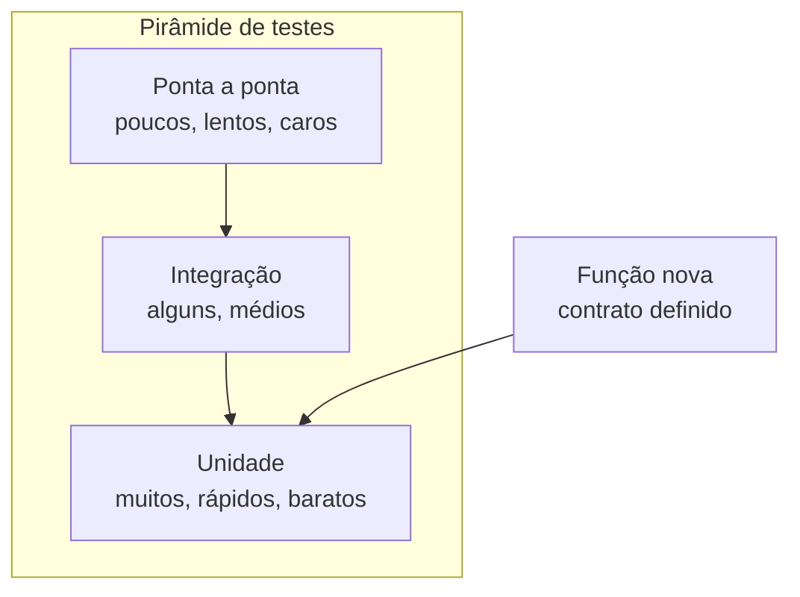

# Capítulo 11: Fluxos de Teste: Provando que o Código Funciona

## 1. Introdução

"Parece que funciona" é o inimigo número um do construtor assistido. O código gerado por IA tem uma habilidade impressionante de parecer correto — e uma capacidade igualmente impressionante de quebrar nos cantos. Este capítulo ensina a ciência dos testes: testes de unidade para provar cada peça, testes de integração para provar o encaixe das peças e o papel do agente em escrever e rodar essa bateria. Ao final, você vai transformar "eu acho que" em "está provado".

## 2. Explica

### Por que testar código gerado por IA é obrigatório

Modelos de linguagem geram código estatisticamente plausível, não logicamente garantido [1]. Eles erram de formas sutis: tratam o caso feliz com perfeição e tropeçam no caso de borda — lista vazia, valor negativo, caractere especial, divisão por zero. O teste é a única forma objetiva de separar código bom de código que parece bom [2].

Há ainda o viés do agente: quando perguntamos "o código está correto?", a resposta tende a ser "sim" — a validação feita pelo próprio gerador é auto-referente. O teste determinístico (rodado por máquina, com resultado fixo) quebra esse ciclo: o veredito não vem de opinião, vem de execução.

### Os três níveis da pirâmide de testes

A pirâmide de testes organiza os níveis por custo e velocidade [3]:

**1. Testes de unidade (base, muitos)**: testam uma função isolada, sem dependências externas. Rápidos, baratos, rodam em milissegundos. Cobrem os casos: feliz, borda e erro.

**2. Testes de integração (meio, alguns)**: testam o encaixe entre duas ou mais peças — função + banco, função + API. Mais lentos e frágeis que os de unidade, mas provam o que a unidade isolada não prova.

**3. Testes de ponta a ponta (topo, poucos)**: testam o fluxo completo como o usuário vive — rodar o programa, digitar, ver o resultado. Os mais lentos e caros; reserve para os caminhos críticos.

A regra da pirâmide: muitos testes na base, poucos no topo. Inverter a pirâmide (tudo de ponta a ponta) torna a suíte frágil e lenta.

### O papel do agente nos testes

O agente é um aliado poderoso de testes — com supervisão: ele escreve a bateria a partir do seu contrato, você revisa os casos e ele roda. A divisão de trabalho ideal:

1. Você define o contrato (o que a função deve fazer, inclusive nos casos de borda).
2. O agente escreve os testes iniciais.
3. Você adiciona os casos de borda que o agente esqueceu (ele tende a cobrir o caminho feliz).
4. O agente roda a suíte e corrige falhas — mas a decisão final de "bom o suficiente" é sua.

### Cobertura: a régua e a métrica

Cobertura de código mede quantas linhas do programa foram executadas pela suíte de testes — e é a régua do mestre em forma de número [4]. Mas ela tem duas faces:

| Face | O que mostra | A armadilha |
|---|---|---|
| Alta cobertura | Muitas linhas executadas pelos testes | Cobertura alta não prova correção: 90% de cobertura com uma asserção errada é 90% de ilusão |
| Baixa cobertura | Regiões do código nunca exercitadas | É o mapa do risco: todo código sem teste é território desconhecido |

A meta honesta para o projeto de aprendizado: cobrir as funções críticas (cálculo, validação, transformação) com os três casos — feliz, borda, erro. Cobertura de 100% em funções triviais é esforço mal investido; cobertura de 0% em função de dinheiro é negligência.

### O falso verde: quando o teste passa e o código está errado

O teste pode estar "verde" e mentir. Os três falsos verdes mais comuns em suítes de iniciante:

| Falso verde | Como acontece | Como detectar |
|---|---|---|
| Sem asserção | O teste roda a função e não verifica nada | Revisar: todo teste com nome `test_*` deve terminar em `assert` |
| Teste que não roda | Erro de import faz o unittest pular o módulo | Rodar a suíte inteira e contar os testes executados |
| Exceção engolida | `try/except` silencioso no caminho do teste | Interromper o teste no meio: ele deve falhar |

O teste de honestidade do falso verde: **mude o código para o errado e veja se a suíte acusa**. Se você quebra a função e o teste continua verde, o teste não testa nada — vale o papel em que está escrito [5].

### Teste de regressão: a rede de proteção

A regressão é o teste que prova que o que funcionava ontem continua funcionando hoje. Ela é a razão pela qual a suíte de testes acumula valor com o tempo: cada bug corrigido vira um teste novo que impede o bug de voltar.

O ritual do construtor assistido: quando o agente entrega uma correção, o primeiro pedido não é "corrija" — é "escreva o teste que reproduz o bug, confirme que ele falha antes da correção, e então corrija". Esse teste de reprodução é a rede de proteção que o código nunca mais cai: o veredito da regressão fica para sempre na suíte [6].

## 3. Ilustra

Na obra, o teste é a régua do mestre: ele não "acha" que a parede está reta — ele passa a régua. A parede de tijolos pode parecer perfeita aos olhos, mas a régua revela a inclinação de dois centímetros que derrubará o armário em cinco anos.

O construtor assistido aplica a mesma disciplina: antes de declarar uma peça pronta, passa a régua — o teste de unidade. Antes de declarar o prédio pronto, passa a régua na estrutura — o teste de integração. E antes de entregar a chave, caminha pelo prédio como o morador faria — o teste de ponta a ponta. Régua na mão é o que separa o profissional do entusiasta [3].



Como Construtor Assistido, a régua nunca sai do bolso: cada peça entregue pelo agente passa pela régua antes de ser aceita.

## 4. Técnica

### O contrato primeiro: definindo o que provar

Antes de escrever ou pedir testes, defina o contrato da função. Para uma função de cálculo de desconto:

```text
Contrato de calcular_desconto(valor, percentual):
- valor e percentual devem ser maiores que zero.
- Percentual máximo é 100 (desconto total).
- Retorna float com até 2 casas decimais.
- Erros: ValueError se valor ou percentual forem inválidos.
- Caso de borda: percentual 0 retorna o valor original.
```

### Testes de unidade cobrindo caso feliz, borda e erro

```python
import unittest

from desconto import calcular_desconto


class TesteDesconto(unittest.TestCase):
    # Caso feliz
    def test_desconto_normal(self) -> None:
        self.assertAlmostEqual(calcular_desconto(100.0, 10.0), 90.0, places=2)

    # Casos de borda
    def test_percentual_zero(self) -> None:
        self.assertEqual(calcular_desconto(100.0, 0.0), 100.0)

    def test_percentual_cem(self) -> None:
        self.assertEqual(calcular_desconto(50.0, 100.0), 0.0)

    def test_valores_decimais(self) -> None:
        self.assertAlmostEqual(calcular_desconto(99.99, 33.3), 66.69, places=2)

    # Casos de erro
    def test_valor_negativo_rejeitado(self) -> None:
        with self.assertRaises(ValueError):
            calcular_desconto(-1.0, 10.0)

    def test_percentual_acima_de_cem_rejeitado(self) -> None:
        with self.assertRaises(ValueError):
            calcular_desconto(100.0, 101.0)

    def test_tipos_invalidos_rejeitados(self) -> None:
        with self.assertRaises((TypeError, ValueError)):
            calcular_desconto("cem", 10.0)


if __name__ == "__main__":
    unittest.main(verbosity=2)
```

### A implementação que passa nos testes

```python
def calcular_desconto(valor: float, percentual: float) -> float:
    """Aplica um percentual de desconto sobre um valor.

    Raises:
        ValueError: se valor ou percentual forem inválidos.
    """
    if not isinstance(valor, (int, float)) or not isinstance(percentual, (int, float)):
        raise TypeError("Valor e percentual devem ser numéricos")
    if valor < 0 or percentual < 0:
        raise ValueError("Valor e percentual devem ser maiores ou iguais a zero")
    if percentual > 100:
        raise ValueError("Percentual não pode ultrapassar 100")
    return round(valor * (1 - percentual / 100), 2)
```

### Teste de integração: provando o encaixe das peças

O teste de integração conecta o cálculo de desconto a uma camada de apresentação — provando que o texto exibido usa o valor correto:

```python
import unittest

from desconto import calcular_desconto
from apresentacao import formatar_valor


class TesteIntegracao(unittest.TestCase):
    def test_fluxo_desconto_ate_apresentacao(self) -> None:
        valor_final = calcular_desconto(200.0, 25.0)
        texto = formatar_valor(valor_final)
        self.assertEqual(texto, "R$ 150,00")

    def test_fluxo_sem_desconto(self) -> None:
        valor_final = calcular_desconto(200.0, 0.0)
        self.assertEqual(formatar_valor(valor_final), "R$ 200,00")


if __name__ == "__main__":
    unittest.main(verbosity=2)
```

Com a peça de apresentação correspondente:

```python
def formatar_valor(valor: float) -> str:
    """Formata um valor em reais no padrão brasileiro."""
    return f"R$ {valor:,.2f}".replace(",", "X").replace(".", ",").replace("X", ".")


if __name__ == "__main__":
    print(formatar_valor(150.0))  # R$ 150,00
```

### O auditor da suíte: inspecionando os testes com Python

Os testes também merecem teste. O script abaixo lê os arquivos de teste com o analisador sintático (`ast`), lista cada teste encontrado e acusa os falsos verdes estruturais — teste sem `assert` e método que não começa com `test_`:

```python
import ast
import sys
from pathlib import Path


def auditar_suite(caminho: str) -> str:
    """Audita os testes de um diretório e devolve um relatório."""
    base = Path(caminho)
    if not base.is_dir():
        return f"Diretório {caminho} não encontrado."
    linhas = [f"Auditoria da suíte em {caminho}", "-" * 46]
    total = 0
    for arquivo in sorted(base.glob("test_*.py")):
        arvore = ast.parse(arquivo.read_text(encoding="utf-8"))
        for no in ast.walk(arvore):
            if not isinstance(no, ast.ClassDef):
                continue
            for item in no.body:
                if not isinstance(item, (ast.FunctionDef, ast.AsyncFunctionDef)):
                    continue
                nome = item.name
                if not nome.startswith("test_"):
                    continue
                total += 1
                tem_assert = any(
                    isinstance(sub, (ast.Assert, ast.Raise))
                    for sub in ast.walk(item)
                )
                status = "OK" if tem_assert else "SUSPEITO"
                linhas.append(f"[{status}] {arquivo.name}::{no.name}::{nome}")
    linhas.append("-" * 46)
    linhas.append(f"Total de testes auditados: {total}")
    return "\n".join(linhas)


if __name__ == "__main__":
    alvo = sys.argv[1] if len(sys.argv) > 1 else "testes"
    print(auditar_suite(alvo))
```

Rode `python auditar_suite.py testes` após o agente escrever a suíte: cada teste listado como `[OK]` tem uma asserção no corpo; os `[SUSPEITO]` são candidatos a falso verde — o ponto de partida da sua revisão de casos [7].

### Rodando a suíte e medindo a cobertura

```bash
# Roda todos os testes do diretório atual
python -m unittest discover -v

# Com cobertura (instale antes: pip install coverage)
coverage run -m unittest discover
coverage report -m
```

## 5. Aplica

### Cena de contraste: o código que "funcionava"

Sexta-feira, o agente entrega a função de cálculo de frete. Você roda uma vez, o resultado parece certo, e segue para o fim de semana. Na segunda, o e-commerce calcula frete negativo para CEPs do interior e a equipe de suporte entra em pânico. O código tinha uma regra errada para CEPs com dígito verificador 0 — caso que o teste de borda teria pego em segundos.

A correção é o fluxo deste capítulo: contrato primeiro, testes com os três casos (feliz, borda, erro) antes de declarar pronto, e a régua na mão a cada peça do agente. O código "que funcionava" nunca tinha sido provado — e a diferença entre parecer e provar é exatamente a suíte de testes [2].

### Armadilhas comuns de teste

- Testar só o caso feliz: o caso de borda é onde vive o bug.
- Pedir ao agente para validar o próprio código: veredito auto-referente.
- Não rodar a suíte: teste escrito e não executado é ficção.
- Ignorar a cobertura: código sem teste é código sem régua.
- Testes acoplados a detalhes de implementação: quebram sem o código estar errado.
- Confiar no verde sem revisar as asserções: o falso verde é o pior dos verdes.
- Escrever o teste depois do bug: o teste de reprodução deve nascer antes da correção.
- Inverter a pirâmide: suíte de ponta a ponta demais fica lenta, frágil e cara.

### Checklist de aceitação de uma peça testada

Antes de aceitar qualquer peça do agente como "provada", percorra os sete pontos:

1. **Contrato escrito**: o comportamento esperado (inclusive bordas) está registrado?
2. **Três casos cobertos**: existe teste de caso feliz, de borda e de erro?
3. **Testes rodados**: a suíte executa e o resultado é real, não suposto?
4. **Falso verde descartado**: quebrar o código de propósito faz a suíte falhar?
5. **Teste de reprodução**: o bug corrigido ganhou um teste que impede o retorno?
6. **Cobertura das funções críticas**: cálculo e validação estão exercitados?
7. **Veredito da máquina**: a decisão de aceitar veio da execução, não da opinião?

O ponto 4 é o teste de honestidade definitivo: um minuto de vandalismo intencional vale mais que uma hora de leitura. Se a suíte sobrevive ao código quebrado, ela é decoração — e o construtor volta ao ponto 1 [8].

### Exercícios do construtor

1. **O teste que falta**: pegue uma função do capítulo e escreva o teste do caso de borda que o capítulo não cobre — rode e veja o que acontece.
2. **Três níveis**: para o seu projeto zero, identifique uma tarefa em cada nível da pirâmide (unidade, integração, ponta a ponta) e escreva um teste para cada.
3. **Falso verde caçado**: introduza de propósito um erro sutil no código (troque `>=` por `>`) e veja se a suíte pega. Se não pega, o teste está fraco — melhore-o.
4. **Regressão documentada**: escolha um bug que você já corrigiu e escreva o teste de regressão que o impede de voltar — como o teste de reprodução do capítulo.
5. **Cobertura na régua**: rode a cobertura do seu projeto e responda: onde o número engana? Identifique uma linha "coberta" que nunca é exercitada de verdade.
6. **Contrato primeiro**: escreva o contrato e os testes de uma nova função ANTES de pedir ao agente que a implemente — e aceite o código apenas com a suíte verde.
7. **Teste de honestidade**: faça o vandalismo intencional do capítulo: quebre uma função e confirme que o teste falha. Um teste que não falha quando deveria não serve.
8. **Suíte em segundos**: cronometre a suíte do seu projeto e estabeleça a meta do capítulo: se passar de alguns segundos, encontre o teste lento e o que o torna lento.

### Glossário do capítulo

| Termo | Significado |
|---|---|
| Unidade | Teste de uma função isolada |
| Integração | Teste de peças trabalhando juntas |
| Ponta a ponta | Teste do fluxo completo do usuário |
| Cobertura | Porcentagem de código exercitado pelos testes |
| Falso verde | Teste que passa sem provar o comportamento |
| Regressão | Bug que volta depois de uma mudança |
| Rede de proteção | Suíte que impede o código de quebrar silenciosamente |
| Vandalismo intencional | Quebrar o código de propósito para testar os testes |

### Erros comuns do construtor

| Erro | Sintoma | Correção do capítulo |
|---|---|---|
| Testar só o caminho feliz | O bug mora na borda | Três casos por comportamento: feliz, borda, erro |
| Aceitar o falso verde | Teste passa, código errado | Vandalismo intencional: quebre e veja falhar |
| Cobertura como troféu | Número alto, garantia baixa | Régua: o teste prova o comportamento, não a linha |
| Corrigir sem testar antes | Regressão volta no próximo deploy | Teste de reprodução primeiro, correção depois |
| Suíte lenta | Ninguém roda, tudo quebra | Suíte em segundos para rodar a cada mudança |
| Teste que testa a si mesmo | Implementação copiada no teste | Contrato independente escrito antes do código |

### O passeio de uma hora

Reserve uma hora e percorra o capítulo em ação:

1. **Escolha um comportamento** do seu projeto que ainda não tem teste.
2. **Escreva o contrato** em uma frase: o que ele deve fazer.
3. **Escreva os três testes**: feliz, borda, erro — antes de qualquer código.
4. **Rode e veja falhar** — teste que não falha quando deve não serve.
5. **Peça ao agente** a implementação que passa nos testes.
6. **Rode a suíte** e confirme o verde.
7. **Faça o vandalismo**: troque um operador de propósito e confirme que o teste pega.
8. **Rode a cobertura** e responda: onde o número engana?
9. **Cronometre a suíte** inteira e estabeleça a meta de segundos.
10. **Registre** no caderno: o ciclo teste→verde levou quanto tempo? É a sua régua de qualidade por minuto.

### Perguntas e respostas do capítulo

- **Quanto teste é suficiente?** O suficiente para dormir tranquilo: comportamentos críticos cobertos, bordas testadas, suíte rápida. A régua é o risco, não a porcentagem.
- **Testes gerados por IA são confiáveis?** São ponto de partida — como código gerado. O contrato é seu: você define o que provar; a IA escreve rápido, você revisa o que vale.
- **Falso verde acontece mesmo?** Acontece, e o capítulo ensina a caçá-lo: vandalismo intencional e testes escritos antes do código.
- **Cobertura alta garante qualidade?** Não — garante que linhas foram tocadas. O teste de um bug que nunca ocorreu não protege de nada.
- **Suíte lenta é aceitável?** Aceitável é rodar a cada mudança. Se a suíte demora, ela não roda — e o projeto fica sem rede de proteção.

### Você sabe que dominou quando...

1. Escreve contrato e testes antes do código sem atalho.
2. Cobre feliz, borda e erro nos comportamentos críticos.
3. Caça falso verde com vandalismo intencional.
4. Escreve teste de regressão para cada bug corrigido.
5. Mantém a suíte rápida e roda a cada mudança.
6. Lê o relatório de cobertura sem se enganar com o número.

### Resumo em pontos

- Estratégia de teste é risco em forma de plano: o crítico cobre primeiro.
- Testes de unidade, integração e sistema têm funções distintas.
- Falso verde e falso azul são os dois modos de traição.
- Suíte rápida roda a cada mudança; suíte lenta roda nunca.
- O teste que você escreve para o bug de hoje é a defesa contra o bug de amanhã.

### Desafio de aprofundamento

Audite o projeto zero publicado no capítulo anterior: liste os comportamentos críticos, verifique se cada um tem teste (unidade, integração ou sistema) e introduza um bug proposital em cada comportamento sem teste. Os bugs que passarem despercebidos são o seu mapa de cobertura de verdade — escreva os testes que faltam e reexecute a auditoria até nenhum bug invisível sobreviver.

### Conexão com o próximo capítulo

A estratégia de teste protege o sistema; o próximo capítulo mostra a próxima obra: o CLI que organiza o seu dia. Sistema testado e hábito digital — o método agora constrói ferramentas que o construtor usa todos os dias.

## 6. Conclusão

Você aprendeu a ciência da prova: a pirâmide de testes (unidade, integração, ponta a ponta), a arte do contrato antes do código, e o fluxo de colaboração com o agente — que escreve, você revisa os casos de borda, e a máquina decide. Desafio: escreva o contrato e a suíte de testes de uma função sua de ontem — e veja quantos casos de borda estavam esquecidos. No Capítulo 12, você vai fechar a parte prática com o grande projeto: um CLI de tarefas completo, usando tudo o que você aprendeu até aqui.

## 7. Referências Bibliográficas

[1] VASWANI, Ashish et al. *Attention Is All You Need*. Disponível em: https://arxiv.org/abs/1706.03762. Acesso em: 06 ago. 2026.

[2] IEEE ACCESS. *Coding Agents in the Wild* (2026). Disponível em: https://ieeexplore.ieee.org/document/10795597. Acesso em: 06 ago. 2026.

[3] FOWLER, Martin. *TestPyramid*. Disponível em: https://martinfowler.com/bliki/TestPyramid.html. Acesso em: 06 ago. 2026.

[4] MICROSOFT LEARN. *Using code coverage to determine how much code is being tested*. Disponível em: https://learn.microsoft.com/en-us/visualstudio/test/using-code-coverage-to-determine-how-much-code-is-being-tested. Acesso em: 06 ago. 2026.

[5] MESZAROS, Gerard. *xUnit Test Patterns: Refactoring Test Code*. Boston: Addison-Wesley, 2007.

[6] BECK, Kent. *Test-Driven Development: By Example*. Boston: Addison-Wesley, 2002.

[7] PYTHON SOFTWARE FOUNDATION. *ast — Abstract Syntax Trees*. Disponível em: https://docs.python.org/3/library/ast.html. Acesso em: 06 ago. 2026.

[8] OSHEROVE, Roy. *The Art of Unit Testing*. 2. ed. Shelter Island: Manning, 2013.

[9] PYTHON SOFTWARE FOUNDATION. *unittest — Unit testing framework*. Disponível em: https://docs.python.org/3/library/unittest.html. Acesso em: 06 ago. 2026.

[10] COVERAGE.PY. *Coverage.py documentation*. Disponível em: https://coverage.readthedocs.io. Acesso em: 06 ago. 2026.

[11] BECK, Kent. *Extreme Programming Explained: Embrace Change*. Boston: Addison-Wesley, 2000.

[12] PYTEST. *pytest: helps you write better programs*. Disponível em: https://docs.pytest.org. Acesso em: 06 ago. 2026.

[13] WINTERS, Titus; MANSHREK, Tom; WRIGHT, Hyrum. *Software Engineering at Google*. Sebastopol: O'Reilly, 2020.

[14] FOWLER, Martin. *Continuous Integration*. Disponível em: https://martinfowler.com/articles/continuousIntegration.html. Acesso em: 06 ago. 2026.

[15] GITHUB. *About continuous integration*. Disponível em: https://docs.github.com/pt/actions/automating-builds-and-tests/about-continuous-integration. Acesso em: 06 ago. 2026.

[16] ISTQB. *Certified Tester Foundation Level Syllabus*. Disponível em: https://www.istqb.org/certifications/certified-tester-foundation-level. Acesso em: 06 ago. 2026.

[17] HYPOTHESIS. *Hypothesis documentation*. Disponível em: https://hypothesis.readthedocs.io. Acesso em: 06 ago. 2026.

[18] FOWLER, Martin. *Mocks Aren't Stubs*. Disponível em: https://martinfowler.com/articles/mocksArentStubs.html. Acesso em: 06 ago. 2026.

[19] SOMMERVILLE, Ian. *Engenharia de Software*. 10. ed. São Paulo: Pearson, 2019.

[20] PRESSMAN, Roger. *Engenharia de Software: Uma Abordagem Profissional*. 9. ed. Porto Alegre: AMGH, 2021.
