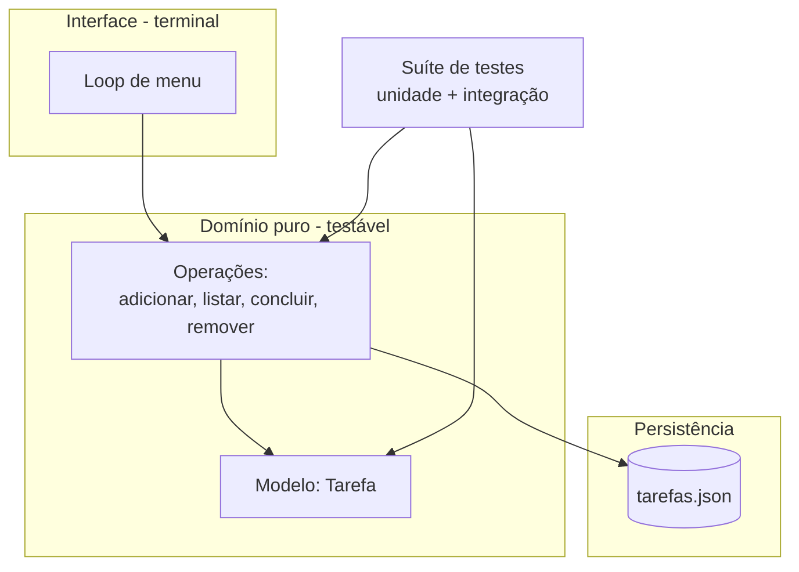

# Capítulo 12: O Grande Projeto: um CLI de Tarefas Completo

## 1. Introdução

Este é o capítulo da colheita. Você vai construir, com o agente, o projeto que amarra tudo o que aprendeu: um CLI (interface de linha de comando) de tarefas com adicionar, listar, concluir, prioridade, persistência em arquivo e testes — tudo em Python puro, peça por peça, com contrato e régua. Ao final, você terá uma ferramenta útil no terminal e, mais importante, um método completo de construção assistida que serve para qualquer projeto.

## 2. Explica

### O projeto: escopo e arquitetura

O CLI de tarefas resolve um problema real — controlar o que fazer — e cabe em um único módulo com funções puras e um loop de menu. A arquitetura é a mesma do projeto zero (Capítulo 9), ampliada:

1. **Modelo de dados** (`Tarefa`): dataclass com id, descrição, prioridade (alta/média/baixa) e status (pendente/concluída).
2. **Operações de domínio**: `adicionar`, `listar`, `concluir`, `remover` — funções puras que recebem a lista e retornam a lista modificada.
3. **Persistência**: `carregar`/`salvar` em JSON — o estado sobrevive entre execuções.
4. **Interface**: loop de menu no terminal que orquestra as operações.
5. **Testes**: suíte de unidade e integração cobrindo os casos feliz, borda e erro.

A separação em camadas (domínio puro + persistência + interface) é o que permite testar as operações sem tocar no terminal [1].

### O contrato de cada operação

O contrato vem antes do código (Capítulo 11):

- `adicionar(tarefas, descricao, prioridade)`: valida descrição não vazia e prioridade válida; retorna nova lista com tarefa com id incremental.
- `listar(tarefas, filtro=None)`: retorna texto formatado; aceita filtro "pendentes"/"concluidas".
- `concluir(tarefas, id)`: marca como concluída; erro se id não existir ou já estiver concluída.
- `remover(tarefas, id)`: remove a tarefa; erro se id não existir.

### O fluxo de construção assistida

O ritual completo: contrato → prompt com a peça → geração → inspeção → testes → próxima peça. O agente gera cada função; você revisa; a máquina prova [2].

### Por que JSON para persistir?

A persistência do CLI poderia ser feita de várias formas — e a escolha é uma decisão de arquitetura, não um detalhe. A comparação para este projeto:

| Opção | Custo | Benefício | Veredito para o CLI |
|---|---|---|---|
| JSON em arquivo | Zero (biblioteca padrão) | Legível, simples, o padrão de fato para dados | **Escolhido** |
| CSV | Zero | Legível em planilhas | Perde o aninhamento natural dos dados |
| Banco SQLite | Zero (biblioteca padrão) | Consultas poderosas | Custo excessivo para 50 tarefas |
| Memória pura | Zero | Simples | Estado perdido ao fechar — inaceitável |

A regra de ouro: use a persistência mais simples que atenda ao requisito. Quando o requisito crescer (muitos usuários, consultas complexas), a migração para SQLite é natural — porque a camada de persistência é isolada das operações de domínio [3].

### O princípio da função pura no CLI

Toda operação de domínio do CLI é uma **função pura**: recebe a lista de tarefas, devolve uma lista nova, não altera a lista original e não toca em terminal nem arquivo. As consequências práticas:

1. **Testável**: não precisa simular `input` nem `print` — basta chamar a função.
2. **Previsível**: a mesma entrada sempre produz a mesma saída.
3. **Componível**: a interface chama as funções e cuida de entrada/saída — um único ponto de contato com o mundo.

A separação é o que torna o projeto de 5 peças testável com 9 testes e nenhum mock. Se o domínio fosse acoplado ao terminal, cada teste precisaria fingir um teclado — e a régua perderia a precisão [1].

### Enums: o domínio que se autovalida

`Prioridade` e `Status` como `Enum` transformam erros de digitação em erros de programa: o valor `"urgentissima"` não é "aceito e ignorado" — é rejeitado pelo próprio domínio com `ValueError`. O ganho silencioso: a validação vive no mesmo lugar que os dados, e o agente não tem liberdade criativa para inventar estados. Quando a descrição diz "prioridades válidas: alta, media, baixa", o `Enum` faz o contrato ser executável — a mesma filosofia do contrato primeiro do Capítulo 11, agora embutida no código [4].

## 3. Ilustra

O CLI de tarefas é o prédio completo da oficina: o projeto zero foi a casa simples (Capítulo 9); o site foi o estande (Capítulo 10); agora é o prédio com vários andares — fundação (modelo de dados), estrutura (operações), encanamento (persistência) e recepção (menu). Cada andar é erguido com a régua na mão: os testes.

E o prédio tem um detalhe novo: ele guarda memória. Ao contrário dos programas que esquecem tudo ao fechar, o CLI salva o estado em JSON — a primeira vez que seu programa conversa com o futuro [3].



Como Construtor Assistido, este é o momento em que o aprendiz se torna oficial: o prédio é seu, e você sabe como cada parede foi erguida.

## 4. Técnica

### Peça 1 — Modelo de dados

```python
from dataclasses import dataclass
from enum import Enum


class Prioridade(Enum):
    ALTA = "alta"
    MEDIA = "media"
    BAIXA = "baixa"


class Status(Enum):
    PENDENTE = "pendente"
    CONCLUIDA = "concluida"


@dataclass
class Tarefa:
    """Uma tarefa da lista com id, descrição, prioridade e status."""
    id: int
    descricao: str
    prioridade: str = Prioridade.MEDIA.value
    status: str = Status.PENDENTE.value

    def para_dict(self) -> dict[str, str | int]:
        """Serializa a tarefa para salvar em JSON."""
        return {
            "id": self.id,
            "descricao": self.descricao,
            "prioridade": self.prioridade,
            "status": self.status,
        }
```

### Peça 2 — Operações de domínio

```python
from typing import Callable

from modelo import Prioridade, Status, Tarefa

PRIORIDADES_VALIDAS = {prioridade.value for prioridade in Prioridade}


def adicionar(tarefas: list[Tarefa], descricao: str, prioridade: str = "media") -> list[Tarefa]:
    """Adiciona uma tarefa com id incremental e validações."""
    if not descricao or not descricao.strip():
        raise ValueError("A descrição não pode ser vazia")
    if prioridade not in PRIORIDADES_VALIDAS:
        raise ValueError(f"Prioridade inválida: {prioridade}")
    proximo_id = max((tarefa.id for tarefa in tarefas), default=0) + 1
    nova = Tarefa(id=proximo_id, descricao=descricao.strip(), prioridade=prioridade)
    return tarefas + [nova]


def listar(tarefas: list[Tarefa], filtro: str | None = None) -> str:
    """Retorna a lista formatada, com filtro opcional por status."""
    if filtro not in (None, "pendentes", "concluidas"):
        raise ValueError(f"Filtro inválido: {filtro}")
    visiveis = tarefas
    if filtro == "pendentes":
        visiveis = [tarefa for tarefa in tarefas if tarefa.status == Status.PENDENTE.value]
    if filtro == "concluidas":
        visiveis = [tarefa for tarefa in tarefas if tarefa.status == Status.CONCLUIDA.value]
    if not visiveis:
        return "Nenhuma tarefa encontrada."
    linhas = [
        f"[{tarefa.id}] ({tarefa.prioridade}) {tarefa.descricao} — {tarefa.status}"
        for tarefa in visiveis
    ]
    return "\n".join(linhas)


def concluir(tarefas: list[Tarefa], id_tarefa: int) -> list[Tarefa]:
    """Marca a tarefa como concluída, validando existência e estado."""
    tarefa = _buscar(tarefas, id_tarefa)
    if tarefa.status == Status.CONCLUIDA.value:
        raise ValueError(f"Tarefa {id_tarefa} já está concluída")
    return [
        Tarefa(tarefa.id, tarefa.descricao, tarefa.prioridade, Status.CONCLUIDA.value)
        if tarefa.id == id_tarefa
        else t
        for t in tarefas
    ]


def remover(tarefas: list[Tarefa], id_tarefa: int) -> list[Tarefa]:
    """Remove a tarefa com o id informado."""
    _buscar(tarefas, id_tarefa)  # garante que existe (levanta erro se não)
    return [tarefa for tarefa in tarefas if tarefa.id != id_tarefa]


def _buscar(tarefas: list[Tarefa], id_tarefa: int) -> Tarefa:
    for tarefa in tarefas:
        if tarefa.id == id_tarefa:
            return tarefa
    raise KeyError(f"Tarefa {id_tarefa} não encontrada")
```

### Peça 3 — Persistência em JSON

```python
import json
from pathlib import Path

from modelo import Tarefa


def carregar(caminho: str = "tarefas.json") -> list[Tarefa]:
    """Carrega as tarefas do arquivo JSON. Arquivo ausente retorna lista vazia."""
    arquivo = Path(caminho)
    if not arquivo.exists():
        return []
    dados = json.loads(arquivo.read_text(encoding="utf-8"))
    return [Tarefa(**item) for item in dados]


def salvar(tarefas: list[Tarefa], caminho: str = "tarefas.json") -> None:
    """Salva as tarefas em JSON com indentação."""
    dados = [tarefa.para_dict() for tarefa in tarefas]
    Path(caminho).write_text(
        json.dumps(dados, ensure_ascii=False, indent=2), encoding="utf-8"
    )
```

### Peça 4 — Interface de menu

```python
import sys

from operacoes import adicionar, concluir, listar, remover
from persistencia import carregar, salvar


def rodar(caminho_arquivo: str = "tarefas.json") -> None:
    """Loop principal do CLI."""
    tarefas = carregar(caminho_arquivo)
    while True:
        print("\n1. Adicionar | 2. Listar | 3. Concluir | 4. Remover | 5. Sair")
        opcao = input("Opção: ").strip()
        try:
            if opcao == "1":
                descricao = input("Descrição: ")
                prioridade = input("Prioridade (alta/media/baixa) [media]: ").strip() or "media"
                tarefas = adicionar(tarefas, descricao, prioridade)
                salvar(tarefas, caminho_arquivo)
            elif opcao == "2":
                filtro = input("Filtro (pendentes/concluidas) [tudo]: ").strip() or None
                print(listar(tarefas, filtro))
            elif opcao == "3":
                tarefas = concluir(tarefas, int(input("Id: ")))
                salvar(tarefas, caminho_arquivo)
            elif opcao == "4":
                tarefas = remover(tarefas, int(input("Id: ")))
                salvar(tarefas, caminho_arquivo)
            elif opcao == "5":
                break
            else:
                print("Opção inválida.")
        except (ValueError, KeyError) as erro:
            print(f"Erro: {erro}")


if __name__ == "__main__":
    rodar(sys.argv[1] if len(sys.argv) > 1 else "tarefas.json")
```

### Peça 5 — Suíte de testes

```python
import unittest
from pathlib import Path

from modelo import Status, Tarefa
from operacoes import adicionar, concluir, listar, remover
from persistencia import carregar, salvar


class TesteOperacoes(unittest.TestCase):
    def setUp(self) -> None:
        self.base = [Tarefa(id=1, descricao="Estudar IA"), Tarefa(id=2, descricao="Revisar código")]

    def test_adicionar_atribui_id_incremental(self) -> None:
        resultado = adicionar(self.base, "Testar CLI", "alta")
        self.assertEqual(resultado[-1].id, 3)

    def test_adicionar_rejeita_descricao_vazia(self) -> None:
        with self.assertRaises(ValueError):
            adicionar(self.base, "   ")

    def test_adicionar_rejeita_prioridade_invalida(self) -> None:
        with self.assertRaises(ValueError):
            adicionar(self.base, "Tarefa", "urgentissima")

    def test_listar_filtro_pendentes(self) -> None:
        texto = listar(self.base, "pendentes")
        self.assertIn("Estudar IA", texto)
        self.assertNotIn("concluida", texto)

    def test_concluir_muda_status(self) -> None:
        resultado = concluir(self.base, 1)
        self.assertEqual(resultado[0].status, Status.CONCLUIDA.value)

    def test_concluir_tarefa_inexistente(self) -> None:
        with self.assertRaises(KeyError):
            concluir(self.base, 99)

    def test_concluir_duas_vezes_rejeitado(self) -> None:
        uma_vez = concluir(self.base, 1)
        with self.assertRaises(ValueError):
            concluir(uma_vez, 1)

    def test_remover_elimina_tarefa(self) -> None:
        resultado = remover(self.base, 2)
        self.assertEqual(len(resultado), 1)


class TestePersistencia(unittest.TestCase):
    def test_ciclo_salvar_carregar(self) -> None:
        caminho = "teste_tarefas.json"
        salvar([Tarefa(id=1, descricao="Persistir")], caminho)
        carregadas = carregar(caminho)
        self.assertEqual(carregadas[0].descricao, "Persistir")
        Path(caminho).unlink(missing_ok=True)


if __name__ == "__main__":
    unittest.main(verbosity=2)
```

### O gerador de estatísticas do CLI

Uma peça extra que mostra o domínio servindo a quem usa: o script abaixo lê o `tarefas.json` e devolve um relatório de progresso — total, concluídas, pendentes e a distribuição por prioridade:

```python
import json
import sys
from pathlib import Path


def estatisticas(caminho: str = "tarefas.json") -> str:
    """Gera o relatório de progresso das tarefas persistidas."""
    arquivo = Path(caminho)
    if not arquivo.exists():
        return "Nenhum arquivo de tarefas encontrado."
    dados = json.loads(arquivo.read_text(encoding="utf-8"))
    if not dados:
        return "Nenhuma tarefa cadastrada."

    total = len(dados)
    concluidas = sum(1 for item in dados if item.get("status") == "concluida")
    pendentes = total - concluidas
    percentual = round(concluidas / total * 100)

    por_prioridade: dict[str, int] = {}
    for item in dados:
        prioridade = item.get("prioridade", "media")
        por_prioridade[prioridade] = por_prioridade.get(prioridade, 0) + 1

    linhas = [f"Relatório de {caminho}", "-" * 46]
    linhas.append(f"Total de tarefas: {total}")
    linhas.append(f"Concluídas: {concluidas} ({percentual}%)")
    linhas.append(f"Pendentes: {pendentes}")
    linhas.append("-" * 46)
    for prioridade in ("alta", "media", "baixa"):
        linhas.append(
            f"  {prioridade:<6}: {por_prioridade.get(prioridade, 0)} tarefa(s)"
        )
    return "\n".join(linhas)


if __name__ == "__main__":
    alvo = sys.argv[1] if len(sys.argv) > 1 else "tarefas.json"
    print(estatisticas(alvo))
```

`python estatisticas.py` responde à pergunta que o dono da obra faz toda semana — "como está o andamento?" — sem abrir o editor. É a peça que transforma dados brutos em visão: o mesmo princípio do relatório de progresso do projeto zero, agora para as suas tarefas [5].

### Instruções finais de uso

```bash
# Rodar o CLI
python interface.py
# Rodar os testes
python -m unittest discover -v
```

## 5. Aplica

### Cena de contraste: o atalho que custou o método

Você decide que o CLI é "simples demais para método" e pede ao agente para gerar tudo de uma vez, sem contrato e sem testes: "faz um CLI de tarefas completo". O agente entrega 400 linhas. O menu funciona no caso feliz, mas: a prioridade é aceita em qualquer texto, o id não é incremental, a lista não sobrevive a caracteres especiais e concluir duas vezes quebra o programa. Você gasta a noite corrigindo o que o método teria evitado [2].

A correção é o próprio método: contrato, peças, testes — e o resultado é visível. A versão deste capítulo tem 5 peças testadas, sobrevive a reinicialização e lida com entradas inválidas com mensagens claras. O tempo total de construção é menor que o da tentativa "rápida" — porque a régua economiza o tempo que o chute desperdiça.

### Armadilhas comuns do projeto completo

- Pular o contrato: sem contrato, o teste não sabe o que provar.
- Acoplar domínio à interface: funções que fazem `print` não se testam.
- Esquecer a persistência: fechou o terminal, perdeu o trabalho.
- Tratar `input` como confiável: toda entrada é suspeita até validar.
- Deixar testes para depois: "depois" nunca chega na sexta-feira.
- Pedir o projeto inteiro de uma vez: a peça única é o erro que este capítulo corrige.
- Salvar sem `ensure_ascii=False`: o "café" vira "caf\u00e9" no arquivo.
- Rejeitar prioridade por string solta: sem `Enum`, o domínio aceita qualquer palavra.

### Checklist de aceitação do CLI

O prédio completo só é entregue com a vistoria final — os oito pontos:

1. **Contrato executável**: cada operação valida suas entradas (descrição, prioridade, id)?
2. **Funções puras**: nenhuma operação de domínio faz `print`, `input` ou abre arquivo?
3. **Persistência**: adicionar, fechar o programa, reabrir — a tarefa continua lá?
4. **Caracteres especiais**: "Estudar café e açaí" sobrevive ao ciclo salvar/carregar?
5. **Erros amigáveis**: id inexistente e prioridade inválida mostram mensagem clara?
6. **Suíte verde**: `python -m unittest discover -v` passa do zero?
7. **Vandalismo testado**: quebrar `adicionar` de propósito faz a suíte acusar?
8. **Relatório**: `python estatisticas.py` mostra o andamento sem erros?

O ponto 4 é o teste que quase ninguém faz e todo mundo sofre: o JSON sem `ensure_ascii=False` trai o primeiro texto com acento. O checklist existe para o construtor entregar o prédio — e para o prédio continuar de pé na semana seguinte [6].

### Exercícios do construtor

1. **CLI do zero**: descreva um CLI que resolve um problema seu (tarefas, notas, orçamento) e defina seus três comandos principais com entrada e saída.
2. **JSON na prática**: inspecione o arquivo JSON de um projeto seu (ou o do capítulo) e identifique: estrutura, campos obrigatórios e um erro comum de formatação.
3. **Função pura no CLI**: isole a lógica de negócio do seu CLI (sem input/output) e escreva três testes para ela — a disciplina do capítulo.
4. **Enum como contrato**: defina um enum para os estados possíveis de um item do seu CLI (ex.: pendente, em andamento, concluída) e valide o que acontece com um valor inválido.
5. **Erro amigável**: rode o seu CLI com entrada inválida e avalie a mensagem de erro — ela diz ao usuário o que fazer? Refaça a mensagem se não disser.
6. **Relatório com dados**: implemente (sozinho ou com o agente) um comando de estatísticas do seu CLI que lê o arquivo JSON e imprime um resumo — como o script do capítulo.
7. **Teste de persistência**: rode o CLI, salve dados, feche, reabra e confirme que os dados continuam lá — o teste da persistência.
8. **Checklist de aceitação**: rode o checklist do capítulo no seu CLI (funções puras testadas, enums validados, erros amigáveis, JSON íntegro) e marque cada item.

### Glossário do capítulo

| Termo | Significado |
|---|---|
| CLI | Interface de linha de comando: programa usado pelo terminal |
| JSON | Formato de dados legível por humanos e máquinas |
| Persistência | Salvamento de dados entre execuções |
| Função pura | Função sem efeitos colaterais, fácil de testar |
| Enum | Conjunto de valores válidos que se autovalida |
| Caso de borda | Entrada inválida ou limite que precisa de tratamento |
| Comando | Ação do CLI com argumentos e saída |
| Relatório | Resumo impresso a partir dos dados salvos |

### Erros comuns do construtor

| Erro | Sintoma | Correção do capítulo |
|---|---|---|
| CLI com lógica no main | Testar vira sofrimento | Funções puras fora do input/output |
| JSON sem validação | Arquivo corrompido derruba o programa | Enums e contratos que se autovalida |
| Erro que grita | Usuário não sabe o que fazer | Mensagens amigáveis com o próximo passo |
| Estado solto em strings | "Pendente" vira "pendendte" | Enum: valores válidos, erro na hora |
| Persistência sem teste | Dados somem na reinicialização | Abra, feche, reabra: o teste da persistência |
| Relatório decorativo | Números sem decisão | Estatísticas que respondem: o que fazer com isso? |

### O passeio de uma hora

Reserve uma hora e percorra o capítulo em ação:

1. **Escolha um CLI** para construir (tarefas, notas, orçamento — o problema é seu).
2. **Defina os comandos**: o que cada um recebe e o que imprime.
3. **Isol a lógica** em funções puras: manipular dados sem tocar em input/output.
4. **Escreva os testes** das funções puras: feliz, borda, erro.
5. **Defina os enums** dos estados possíveis dos seus itens.
6. **Peça ao agente** a implementação dos comandos usando as funções testadas.
7. **Rode o CLI de verdade**: adicione, liste, altere, remova — e teste entradas inválidas.
8. **Verifique a persistência**: salve, feche, reabra e confira os dados.
9. **Implemente o comando de estatísticas** (ou peça ao agente) e rode sobre seus dados.
10. **Rode o checklist de aceitação** do capítulo e marque cada item — depois publique o CLI como prova do seu método.

### Perguntas e respostas do capítulo

- **JSON é a melhor escolha para persistir?** Para um CLI iniciante, sim: legível, editável e padrão. O capítulo mostra a tabela — escolha com critério, não por moda.
- **E se o arquivo JSON corromper?** O programa deve falhar com mensagem clara, não com stack trace. Teste o caso: arquivo inválido → mensagem amigável.
- **Enum é coisa de linguagem tipada?** Enum é contrato em qualquer linguagem: os valores válidos declarados, o erro aparecendo cedo — o domínio se autovalida.
- **CLI com interface gráfica é melhor?** Para aprender e testar, CLI é melhor: o contrato é visível, o teste é fácil. Interface gráfica fica para a próxima obra.
- **Quando o CLI está "pronto"?** Quando passa o checklist do capítulo: funções puras testadas, enums validados, erros amigáveis, persistência íntegra e estatísticas úteis.

### Você sabe que dominou quando...

1. Define comandos com entrada e saída antes de programar.
2. Isola a lógica de negócio em funções puras testadas.
3. Usa enums para o domínio se autovalida.
4. Escreve mensagens de erro que apontam o próximo passo.
5. Testa a persistência: salvar, fechar, reabrir, conferir.
6. Entrega o CLI passando no checklist de aceitação.

### Resumo em pontos

- A interface do CLI é contrato: ajuda, entradas, saídas documentadas.
- Enum declara o domínio; o domínio se autovalida.
- Erro bom aponta o caminho; erro ruim esconde a porta.
- Persistência íntegra: salvar, fechar, reabrir, conferir.

### Desafio de aprofundamento

Pegue um hábito seu que ainda depende de papel ou memória (gastos, metas, leituras) e implemente-o como CLI com o padrão do capítulo: enums, funções puras testadas, persistência em JSON e estatísticas úteis. Use o comando por uma semana de verdade — não para demonstração, mas para o seu dia. No fim da semana, liste o que faltou no seu fluxo real e escreva os três testes que protegeriam essas lacunas. O hábito vira produto, e o produto vira o capítulo 13 do seu portfólio.

### Conexão com o próximo capítulo

O CLI organiza o seu dia; o próximo capítulo garante que a obra não se vire contra você: segurança, segredos e os limites do que se delega à máquina. Ferramenta pessoal protegida — o canteiro fica seguro até quando cresce.

## 6. Conclusão

Você construiu o projeto que amarra a oficina: um CLI de tarefas completo — modelo, operações puras, persistência, interface e testes — seguindo o método de contrato, peças e régua. Desafio: adicione uma nova funcionalidade (editar descrição) seguindo o mesmo fluxo: contrato → peça → teste → integração. Na Parte IV, você vai se tornar o Construtor Profissional: segurança, hábitos de produtividade e o ofício de escrever com máquinas.

## 7. Referências Bibliográficas

[1] FOWLER, Martin. *TestPyramid*. Disponível em: https://martinfowler.com/bliki/TestPyramid.html. Acesso em: 06 ago. 2026.

[2] OPENAI. *A practical guide to building agents* (2025). Disponível em: https://cdn.openai.com/business-guides-and-resources/a-practical-guide-to-building-agents.pdf. Acesso em: 06 ago. 2026.

[3] ANTHROPIC. *Building effective agents*. Disponível em: https://www.anthropic.com/research/building-effective-agents. Acesso em: 06 ago. 2026.

[4] PYTHON SOFTWARE FOUNDATION. *enum — Support for enumerations*. Disponível em: https://docs.python.org/3/library/enum.html. Acesso em: 06 ago. 2026.

[5] PYTHON SOFTWARE FOUNDATION. *json — JSON encoder and decoder*. Disponível em: https://docs.python.org/3/library/json.html. Acesso em: 06 ago. 2026.

[6] PYTHON SOFTWARE FOUNDATION. *dataclasses — Data Classes*. Disponível em: https://docs.python.org/3/library/dataclasses.html. Acesso em: 06 ago. 2026.

[7] PYTHON SOFTWARE FOUNDATION. *pathlib — Object-oriented filesystem paths*. Disponível em: https://docs.python.org/3/library/pathlib.html. Acesso em: 06 ago. 2026.

[8] PYTHON SOFTWARE FOUNDATION. *unittest — Unit testing framework*. Disponível em: https://docs.python.org/3/library/unittest.html. Acesso em: 06 ago. 2026.

[9] GAMMA, Erich et al. *Padrões de Projeto: Soluções Reutilizáveis de Software Orientado a Objetos*. Porto Alegre: Bookman, 2000.

[10] FOWLER, Martin. *Refatoração: Aperfeiçoando o Design de Códigos Existentes*. Porto Alegre: Bookman, 2011.

[11] HUNT, Andrew; THOMAS, David. *O Programador Pragmático*. Porto Alegre: Bookman, 2011.

[12] CLI GUIDELINES. *Command Line Interface Guidelines*. Disponível em: https://clig.dev. Acesso em: 06 ago. 2026.

[13] JSON.ORG. *Introducing JSON*. Disponível em: https://www.json.org/json-en.html. Acesso em: 06 ago. 2026.

[14] BECK, Kent. *Test-Driven Development: By Example*. Boston: Addison-Wesley, 2002.

[15] MARTIN, Robert C. *Código Limpo: Habilidades Práticas do Agile Software*. Rio de Janeiro: Alta Books, 2009.

[16] PYTHON SOFTWARE FOUNDATION. *Errors and Exceptions*. Disponível em: https://docs.python.org/3/tutorial/errors.html. Acesso em: 06 ago. 2026.

[17] KERNIGHAN, Brian; PIKE, Rob. *The Practice of Programming*. Boston: Addison-Wesley, 1999.

[18] PYTHON SOFTWARE FOUNDATION. *Reading and Writing Files*. Disponível em: https://docs.python.org/3/tutorial/inputoutput.html. Acesso em: 06 ago. 2026.

[19] BROOKS, Frederick. *The Mythical Man-Month: Essays on Software Engineering*. Boston: Addison-Wesley, 1995.

[20] FOWLER, Martin. *YAGNI*. Disponível em: https://martinfowler.com/bliki/Yagni.html. Acesso em: 06 ago. 2026.
