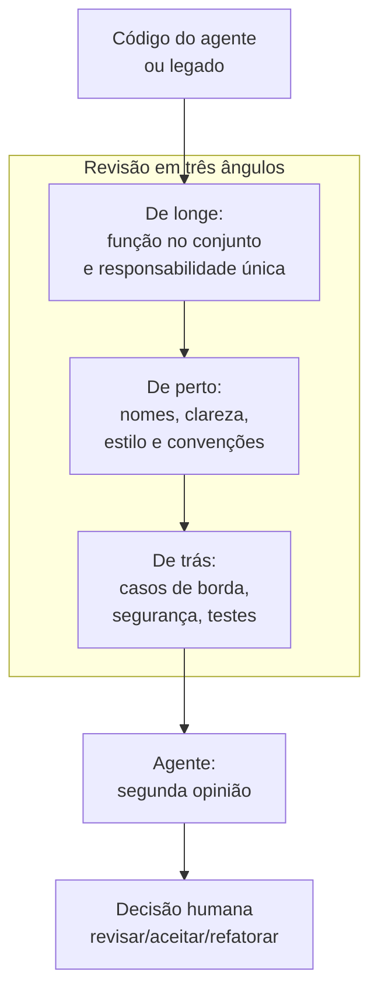

# Capítulo 14: Revisão de Código: A Inspeção que Faz o Profissional

## 1. Introdução

O mestre de obras não entrega uma parede sem inspecionar a parede — e a inspeção não é um luxo, é parte do ofício. Este capítulo trata da revisão de código com e para agentes: a revisão humana do código que a IA gerou, a revisão assistida de código legado e o agente como revisor de segunda opinião. Ao final, você terá um checklist de revisão e um script de análise estática que complementa seus olhos.

## 2. Explica

### Por que revisar é parte do ofício

Código gerado por IA chega com alta qualidade estatística e baixa garantia lógica (Capítulo 11). A revisão é a inspeção final antes da entrega — e ela pega o que os testes não pegam: legibilidade, nomes enganosos, código morto, complexidade desnecessária, duplicação. Testes provam comportamento; revisão prova intenção [1].

Há um segundo motivo, decisivo para o iniciante: **revisar é a forma mais rápida de aprender**. Cada revisão do código do agente expõe padrões — bons e ruins — que você não teria visto sem o par. O iniciante que só aceita código revisa pouco; o que revisa vira profissional mais rápido.

### Revisão humana: o que procurar

O checklist do revisor profissional, por camada:

- **Correção**: o código faz o que o contrato diz? Os casos de borda estão tratados?
- **Clareza**: os nomes dizem o que fazem? Uma função faz uma coisa só?
- **Segurança**: há credenciais, `eval`, comandos destrutivos? (Capítulo 13)
- **Manutenibilidade**: há duplicação? O código é testável? As dependências são mínimas?
- **Estilo**: o código segue as convenções do projeto (AGENTS.md)?

A revisão deve ser específica e cirúrgica: cada comentário aponta uma linha e propõe uma direção, não julga o autor [2].

### O agente como revisor: limites e usos

O agente pode revisar código — e o faz com um viés estrutural: tende a aprovar código parecido com o que ele mesmo geraria e a focar em forma, não em comportamento [3]. Por isso o uso profissional é de *segunda opinião*: o agente aponta padrões (complexidade, duplicação, nomes), e o humano decide. A régua final da revisão é sempre humana — especialmente para código gerado por IA, onde o revisor é também o responsável [4].

### Revisão de código legado: o arquivo que ninguém entende

Revisar o próprio código é fácil; revisar código legado — o que outra pessoa (ou outro agente) escreveu e ninguém entende — é o teste de fogo do revisor. A abordagem profissional é gradual, nunca "reescrever tudo":

| Etapa | Ação | Resultado |
|---|---|---|
| 1. Mapa | Rodar os testes; anotar o que a função faz por observação | Terreno conhecido |
| 2. Esqueleto | Listar funções, dependências e efeitos colaterais | Visão da arquitetura |
| 3. Ponto de luz | Refatorar um trecho pequeno e seguro por vez, testando após cada um | Progresso sem catástrofe |
| 4. Cobertura | Adicionar testes de regressão para o comportamento observado | Rede de proteção |
| 5. Veredito | Decidir: manter, refatorar ou reescrever com o agente | Decisão informada |

A regra de ouro do legado: **não refatore o que os testes não protegem**. O código legado sem testes é uma bomba que qualquer edição pode detonar — o passo 4 vem antes do passo 3 para quem sabe o ofício [5].

### O vocabulário do revisor profissional

O comentário vago é o comentário inútil: quem recebe "isso está ruim" não sabe o que mudar. O revisor profissional traduz sensações em direções:

| Frase vaga | Frase cirúrgica |
|---|---|
| "Essa função está ruim" | "`processar_pedidos` faz validação, cálculo e formatação — divida em três funções" |
| "Esse nome é confuso" | "`x` é o valor do frete: renomeie para `valor_frete`" |
| "Isso pode quebrar" | "Se `campos` vier vazio, a linha 42 levanta `IndexError` — trate o caso" |
| "Muito código" | "As linhas 30–45 repetem o bloco das linhas 60–75 — extraia `calcular_total`" |

A forma de cada comentário: **linha + problema + direção**. Sem os três, o comentário não sobrevive à primeira reunião — e a revisão vira atrito, não aprendizado [6].

### Os quatro tipos de comentário de revisão

Todo comentário de revisão se classifica em um dos quatro níveis — e o revisor declara o nível para o autor saber o que é obrigatório:

1. **Bloqueador (must-fix)**: bug, brecha de segurança, contrato violado. A entrega não acontece sem corrigir.
2. **Deveria (should-fix)**: qualidade que incomoda — duplicação, nome enganoso. Corrigir antes de aceitar é o padrão.
3. **Detalhe (nit)**: estilo, preferência pessoal. O autor decide; nenhum nit bloqueia entrega.
4. **Dúvida (question)**: o revisor não entendeu — e perguntar é obrigação do ofício, não falta de preparo.

A disciplina dos níveis evita os dois extremos: o revisor que bloqueia tudo (o nit vira must-fix e o time paralisa) e o que não bloqueia nada (o bug vira produção). Quando o agente revisa, o revisor humano reclassifica os alertas — a máquina tende a tratar tudo como deveria [7].

## 3. Ilustra

O mestre de obras inspeciona a parede de três ângulos: de longe (a parede está reta?), de perto (o tijolo está alinhado?) e de trás (a argamassa está cheia?). Três ângulos, três perguntas — uma única resposta errada reprova a parede.

O construtor assistido revisa o código com o mesmo ritual: de longe (a função faz sentido no conjunto?), de perto (as linhas são claras?), e de trás (os casos de borda estão cobertos?). E ele usa o agente como segundo par de olhos: que aponta o que pode escapar — nunca como substituto dos próprios olhos.



Como Construtor Assistido, revisar é seu cartão de identidade profissional: nenhuma parede sai sem inspeção.

## 4. Técnica

### O analisador estático: complexidade e duplicação

O script abaixo mede duas propriedades objetivas que os testes não medem: complexidade ciclomática (ramos por função) e duplicação (funções com corpos idênticos):

```python
import ast
import sys
from collections import Counter
from pathlib import Path


def medir_arquivo(caminho: str) -> list[str]:
    """Analisa um arquivo Python e retorna achados de complexidade e duplicação."""
    arvore = ast.parse(Path(caminho).read_text(encoding="utf-8"))
    achados: list[str] = []
    corpos: list[tuple[str, int, str]] = []

    for no in ast.walk(arvore):
        if isinstance(no, ast.FunctionDef):
            ramos = sum(
                1
                for filho in ast.walk(no)
                if isinstance(filho, (ast.If, ast.For, ast.While, ast.ExceptHandler))
            )
            corpos.append((no.name, no.lineno, ast.dump(no.body, include_attributes=False)))
            if ramos > 8:
                achados.append(
                    f"{no.name} (linha {no.lineno}): complexidade {ramos} > 8 — considere dividir"
                )

    contagem = Counter(corpo for _, _, corpo in corpos)
    for (nome, linha, corpo), ocorrencias in contagem.items():
        if ocorrencias > 1:
            achados.append(
                f"{nome} (linha {linha}): corpo duplicado em {ocorrencias} função(ões)"
            )
    return achados


def main() -> None:
    if len(sys.argv) < 2:
        print("Uso: python analisar_codigo.py <arquivo>")
        sys.exit(1)
    achados = medir_arquivo(sys.argv[1])
    if achados:
        print("ACHADOS DE REVISÃO:")
        for achado in achados:
            print(f"  - {achado}")
    else:
        print("[OK] Sem achados automáticos. Revisão humana continua obrigatória.")


if __name__ == "__main__":
    main()
```

### O prompt de revisão para o agente (segunda opinião)

Prompt profissional para o agente revisar uma função:

```text
Você é um revisor sênior. Revise a função abaixo e responda em
formato de checklist:
1. Correção: erros óbvios ou casos de borda não tratados.
2. Clareza: nomes e responsabilidade única.
3. Segurança: credenciais, execução dinâmica, comandos externos.
4. Manutenibilidade: duplicação e complexidade.
Para cada item: [OK] ou [ALERTA] + linha + sugestão cirúrgica.
Não reescreva o código. Apenas aponte.

<<<CODIGO>>>
{cole_a_funcao_aqui}
<<<FIM>>>
```

### O detector de nomes genéricos

O analisador estático mede complexidade; o detector abaixo caça o que os olhos cansam de procurar: nomes que não dizem nada. Funções e parâmetros chamados `dados`, `item`, `x`, `tmp` e afins são o sinal mais barato de código que ninguém entende:

```python
import ast
import sys
from pathlib import Path

NOMES_GENERICOS = {"dados", "item", "x", "y", "tmp", "temp", "coisa", "valor", "aux", "foo", "bar"}


def detectar_nomes_genericos(caminho: str) -> list[str]:
    """Aponta funções e parâmetros com nomes genéricos."""
    arvore = ast.parse(Path(caminho).read_text(encoding="utf-8"))
    achados: list[str] = []
    for no in ast.walk(arvore):
        if not isinstance(no, ast.FunctionDef):
            continue
        if no.name in NOMES_GENERICOS:
            achados.append(f"função {no.name!r} (linha {no.lineno})")
        for argumento in no.args.args:
            if argumento.arg in NOMES_GENERICOS:
                achados.append(
                    f"parâmetro {argumento.arg!r} da função {no.name!r} "
                    f"(linha {no.lineno})"
                )
    return achados


if __name__ == "__main__":
    if len(sys.argv) < 2:
        print("Uso: python detectar_nomes.py <arquivo>")
        sys.exit(1)
    achados = detectar_nomes_genericos(sys.argv[1])
    if achados:
        print("NOMES GENÉRICOS ENCONTRADOS:")
        for achado in achados:
            print(f"  - {achado}")
    else:
        print("[OK] Nenhum nome genérico na lista de controle.")
```

`python detectar_nomes.py operacoes.py` converte a impressão "esse código é confuso" em uma lista de linhas. O nome genérico não é bug — é dívida: cada `x` que o leitor decifra hoje é um minuto perdido por toda a vida do código [8].

### O ritual de revisão em cinco passos

1. Rode os testes e o analisador estático (evidência objetiva).
2. Leia a função de longe: ela faz uma coisa só? Encapsula bem?
3. Leia de perto: nomes, comentários, convenções do AGENTS.md.
4. Leia de trás: casos de borda, segurança, integração com o resto.
5. Peça a segunda opinião ao agente e decida cada alerta: corrigir, ignorar ou refatorar.

## 5. Aplica

### Cena de contraste: a revisão que não aconteceu

O agente entrega uma função `processar_pedidos` de 120 linhas com 14 ramos de condição, três nomes genéricos (`dados`, `item`, `x`) e um `eval` importado de uma solução antiga. Os testes passam — o caminho feliz está coberto. Você aceita sem revisar. Três semanas depois, um pedido com campo nulo explode em produção e ninguém entende a função para consertar.

A correção é o ritual: o analisador estático aponta complexidade 14 e o `eval` (alertas objetivos), a revisão em três ângulos revela os nomes genéricos, e a segunda opinião do agente sugere a divisão em três funções. O custo da revisão: 20 minutos. O custo do acidente: uma madrugada de produção parada [2].

### Armadilhas comuns de revisão

- Aceitar código do agente sem revisar ("ele é o especialista").
- Revisar só o caminho feliz: casos de borda vivem no "de trás".
- Deixar o agente como revisor único: segunda opinião, não sentença.
- Comentários vagos ("isso está ruim") em vez de cirúrgicos (linha + sugestão).
- Revisar de cabeça quente: a revisão se faz com a régua, não com o humor.
- Refatorar legado sem rede de proteção: quem mexe sem testes paga a madrugada.
- Tratar todo alerta como bloqueador: a revisão vira atrito e perde o time.
- Esquecer a segunda passada: a revisão em três ângulos nunca é uma passada só.

### Checklist de revisão em três ângulos

O ritual completo em forma de lista — os nove pontos que o revisor percorre em cada parede:

**De longe (o conjunto):**

1. A função faz uma coisa só? O nome reflete a responsabilidade?
2. A função encaixa na arquitetura? Ela conhece o que não deveria?
3. A duplicação foi extraída? (o analisador estático já respondeu?)

**De perto (a letra):**

4. Os nomes dizem o que fazem? (rodou `detectar_nomes.py`?)
5. Os comentários explicam o porquê, não o quê?
6. O código segue as convenções do AGENTS.md?

**De trás (o avesso):**

7. Os casos de borda estão tratados (lista vazia, campo nulo, valor limite)?
8. Segurança: credenciais, `eval`, comandos destrutivos? (Capítulo 13)
9. Os testes cobrem os três casos — feliz, borda e erro?

O ponto 2 é o que separa o iniciante do profissional: a função que conhece o que não deveria (imprime, lê arquivo, chama API) é a função que amanhã ninguém consegue testar — e o flagrante mais valioso da revisão de longe [9].

### Exercícios do construtor

1. **Revisão real**: pegue um trecho de código de um projeto antigo seu (ou do agente) e aplique os três ângulos: comportamento, legibilidade, segurança — um achado por ângulo.
2. **Vocabulário cirúrgico**: reescreva os comentários de uma revisão antiga sua trocando as frases vagas ("isso está confuso") por frases cirúrgicas ("aqui o `retorno` muda de tipo sem aviso").
3. **Os quatro tipos**: classifique cinco comentários de revisão que você já recebeu (bloqueador, deveria, detalhe, dúvida) e reordene a fila de correção pelo peso.
4. **Nomes genéricos**: rode o detector de nomes genéricos do capítulo num projeto seu e renomeie pelo menos dois nomes com significado real.
5. **Agente como segunda opinião**: peça ao agente que revise um trecho seu com o prompt do capítulo e compare com a sua revisão — o que cada um viu que o outro não viu?
6. **Revisão de legado**: pegue um arquivo que "ninguém entende" e aplique as cinco etapas do capítulo: mapa, esqueleto, ponto de luz, cobertura, veredito.
7. **Complexidade na régua**: rode o analisador estático do capítulo num projeto e responda: onde a complexidade é alta, o código está testado?
8. **Revisão educada**: escreva um comentário bloqueador de forma respeitosa — sem sarcasmo, com evidência e alternativa — e leia em voz alta.

### Glossário do capítulo

| Termo | Significado |
|---|---|
| Revisão | Inspeção do código por outro par de olhos |
| Bloqueador | Problema que impede a entrega |
| Dúvida | Comentário que pergunta antes de julgar |
| Complexidade | Dificuldade de entender e modificar o código |
| Duplicação | Código repetido que deveria ser unificado |
| Vaga × cirúrgica | Frase imprecisa versus frase com local e causa |
| Segunda opinião | Revisão do agente para complementar a humana |
| Legado | Código antigo que precisa de cuidado para mudar |

### Erros comuns do construtor

| Erro | Sintoma | Correção do capítulo |
|---|---|---|
| Revisar só o seu código | Ponto cego garantido | Segunda opinião: humana e do agente |
| Comentário vago | Autor não sabe o que corrigir | Cirúrgico: local, causa e alternativa |
| Confundir detalhe com bloqueador | Filas de correção intermináveis | Classifique: bloqueador, deveria, detalhe, dúvida |
| Revisão pessoal | Autor se defende, código piora | Revisa-se o código, não a pessoa |
| Nomes genéricos eternos | Código ilegível para todos | Detector + renomeio com significado |
| Pular a revisão de legado | O arquivo que ninguém entende vira monstro | Cinco etapas: mapa, esqueleto, luz, cobertura, veredito |

### O passeio de uma hora

Reserve uma hora e percorra o capítulo em ação:

1. **Escolha um trecho** de código seu (ou gerado) para revisar.
2. **Aplique os três ângulos**: comportamento, legibilidade, segurança — um achado por ângulo.
3. **Rode o analisador estático** do capítulo e registre complexidade e duplicação.
4. **Rode o detector de nomes genéricos** e escolha dois nomes para renomear.
5. **Renomeie** com significado real e justifique cada escolha em uma linha.
6. **Peça ao agente** a segunda opinião com o prompt de revisão do capítulo.
7. **Compare**: o que você viu que o agente não viu, e vice-versa?
8. **Escreva os comentários** classificados: bloqueador, deveria, detalhe, dúvida.
9. **Corrija o bloqueador** e o "deveria" — a revisão termina com ação.
10. **Registre** no caderno: qual ângulo seu olho costuma perder? Treine-o amanhã.

### Perguntas e respostas do capítulo

- **Revisar código gerado por IA é mesmo necessário?** É mais necessário ainda: a máquina é confiante e rápida — as duas qualidades que mais precisam de um par de olhos humanos.
- **O agente não pode revisar tudo?** Ele revisa bem o que é mecânico (estilo, complexidade). Julgamento de comportamento e segurança continua sendo seu — revisão é curadoria, não automação.
- **Comentário vago é inofensivo?** É caro: o autor não sabe o que fazer e a revisão vira bate-bola. Cirúrgico: local, causa, alternativa.
- **Revisão de legado vale a pena?** É a escola mais barata do mercado: código antigo ensina decisões, riscos e história que nenhum tutorial cobre.
- **Quantas revisões antes de aceitar?** O suficiente para o bloqueador sumir. A fila por peso: bloqueador hoje, deveria esta semana, detalhe quando der.

### Você sabe que dominou quando...

1. Revisa em três ângulos: comportamento, legibilidade, segurança.
2. Escreve comentário cirúrgico com local, causa e alternativa.
3. Classifica cada achado em bloqueador, deveria, detalhe ou dúvida.
4. Usa o agente como segunda opinião sem terceirizar o julgamento.
5. Revisa legado em cinco etapas sem medo.
6. Corrige o bloqueador antes de encerrar a revisão.

### Resumo em pontos

- Revisão é curadoria: comportamento, legibilidade e segurança.
- Fila por peso: bloqueador hoje, deveria esta semana, detalhe quando der.
- Comentário cirúrgico: local, causa e alternativa.
- Legado é escola barata: cinco etapas, da varredura ao resumo.
- Todo código que você lê ensina algo — inclusive o que deveria ter sido melhor escrito.

### Desafio de aprofundamento

Organize uma revisão de verdade: convide um colega para revisar um projeto seu (ou faça o papel de revisor no projeto de um colega) seguindo o método do capítulo — três ângulos, fila por peso, comentários cirúrgicos. Depois troque os papéis e compare a sua experiência nos dois lados da mesa: o que faltou na sua entrega, o que faltou no seu julgamento. Anote os dois aprendizados no seu caderno e aplique-os na próxima revisão — a revisão é a habilidade que mais cresce com a prática consciente.

### Conexão com o próximo capítulo

O olho da revisão está treinado; o próximo capítulo devolve o olhar para dentro: a rotina pessoal que torna o canteiro produtivo, do setup de sessão ao protocolo de fim de dia. Obra revisada e ofício rotinizado — o construtor trabalha com ritmo.

## 6. Conclusão

Você dominou a inspeção profissional: o porquê (testes provam comportamento, revisão prova intenção), o checklist em três ângulos e o agente como segunda opinião limitada. Construiu um analisador estático de complexidade e duplicação e memorizou o ritual de cinco passos. Desafio: aplique o ritual a uma função que você escreveu na semana — e veja o que seus olhos de autor não viram. No Capítulo 15, você vai organizar o canteiro: fluxos de trabalho e automação para produtividade diária.

## 7. Referências Bibliográficas

[1] FOWLER, Martin. *Refactoring*: improving the design of existing code. 2. ed. Addison-Wesley, 2019. Disponível em: https://martinfowler.com/books/refactoring.html. Acesso em: 06 ago. 2026.

[2] GOOGLE. *Engineering Practices Documentation: Code Review*. Disponível em: https://google.github.io/eng-practices/review/. Acesso em: 06 ago. 2026.

[3] IEEE ACCESS. *Coding Agents in the Wild* (2026). Disponível em: https://ieeexplore.ieee.org/document/10795597. Acesso em: 06 ago. 2026.

[4] OPENAI. *A practical guide to building agents* (2025). Disponível em: https://cdn.openai.com/business-guides-and-resources/a-practical-guide-to-building-agents.pdf. Acesso em: 06 ago. 2026.

[5] MCCABE, Thomas J. *A Complexity Measure*. IEEE Transactions on Software Engineering, v. SE-2, n. 4, 1976.

[6] CONVENTIONAL COMMENTS. *Conventional Comments: A specification for comments in code reviews*. Disponível em: https://conventionalcomments.org. Acesso em: 06 ago. 2026.

[7] SMARTBEAR. *Best Practices for Peer Code Review*. Disponível em: https://smartbear.com/learn/code-review/best-practices-for-peer-code-review/. Acesso em: 06 ago. 2026.

[8] PYTHON SOFTWARE FOUNDATION. *ast — Abstract Syntax Trees*. Disponível em: https://docs.python.org/3/library/ast.html. Acesso em: 06 ago. 2026.

[9] MARTIN, Robert C. *Código Limpo: Habilidades Práticas do Agile Software*. Rio de Janeiro: Alta Books, 2009.

[10] KERNIGHAN, Brian; PIKE, Rob. *The Practice of Programming*. Boston: Addison-Wesley, 1999.

[11] WINTERS, Titus; MANSHREK, Tom; WRIGHT, Hyrum. *Software Engineering at Google*. Sebastopol: O'Reilly, 2020.

[12] FOWLER, Martin. *CodeSmell*. Disponível em: https://martinfowler.com/bliki/CodeSmell.html. Acesso em: 06 ago. 2026.

[13] GITHUB. *About pull requests*. Disponível em: https://docs.github.com/pt/pull-requests. Acesso em: 06 ago. 2026.

[14] BECK, Kent. *Extreme Programming Explained: Embrace Change*. Boston: Addison-Wesley, 2000.

[15] OWASP. *Code Review Guide*. Disponível em: https://owasp.org/www-project-code-review-guide/. Acesso em: 06 ago. 2026.

[16] FLAKE8. *Flake8 documentation*. Disponível em: https://flake8.pycqa.org. Acesso em: 06 ago. 2026.

[17] MYPY. *mypy documentation*. Disponível em: https://mypy-lang.org. Acesso em: 06 ago. 2026.

[18] SONARSOURCE. *Cyclomatic complexity*. Disponível em: https://www.sonarsource.com/learn/cyclomatic-complexity/. Acesso em: 06 ago. 2026.

[19] COHN, Mike. *Succeeding with Agile: Software Development Using Scrum*. Boston: Addison-Wesley, 2010.

[20] BLACK. *Black — The uncompromising code formatter*. Disponível em: https://black.readthedocs.io. Acesso em: 06 ago. 2026.
