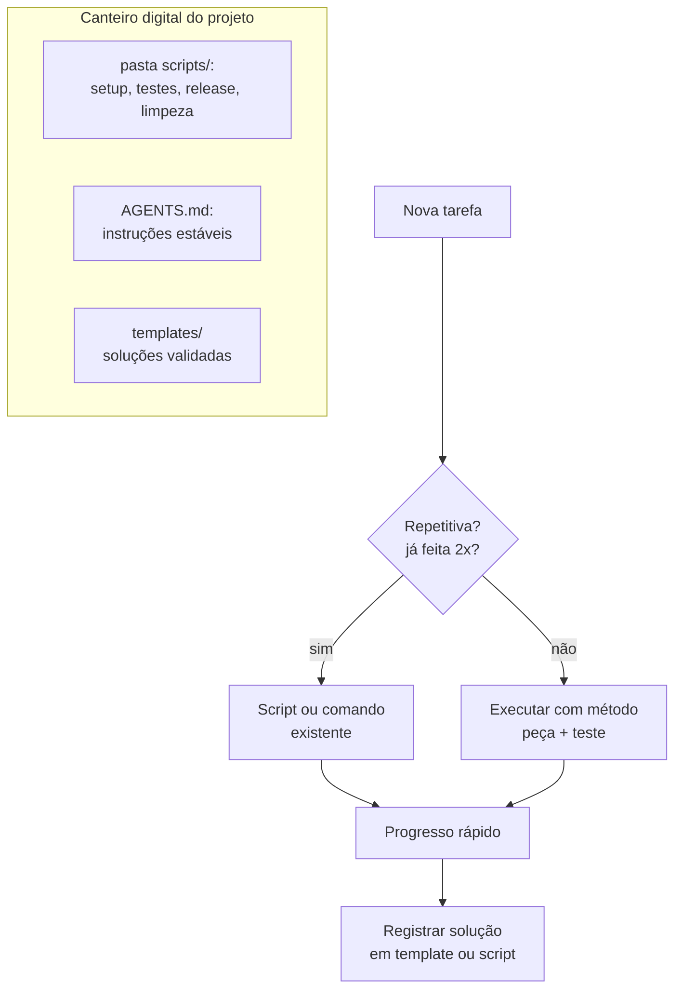

# Capítulo 15: Produtividade: o Canteiro Organizado e os Fluxos que Repetem

## 1. Introdução

O mestre de obras rápido não trabalha mais rápido: ele trabalha sem repetir trabalho. O canteiro organizado — ferramentas no lugar, plantas à mão, rituais fixos — multiplica a produção sem multiplicar o esforço. Este capítulo aplica a mesma lógica ao trabalho com agentes: os hábitos de alta produtividade, os fluxos de trabalho que você repete (e deveria automatizar) e a arte de transformar tarefas manuais em comandos de uma linha.

## 2. Explica

### Os hábitos do construtor produtivo

Produtividade com agentes não é fazer mais; é fazer com menos atrito. Os hábitos que separam o produtivo do ocupado:

- **A prancheta estável**: o AGENTS.md do projeto (Capítulo 7) elimina a re-explicação em toda sessão.
- **Rituais fixos**: revisão (Capítulo 14), teste (Capítulo 11) e segurança (Capítulo 13) acontecem em ordem fixa, sem decidir a cada vez.
- **Registro do que funciona**: cada solução validada vira um template ou um comando — o conhecimento não morre na sessão.
- **Pequenas iterações**: pedidos pequenos, validação rápida, progresso constante (Capítulo 4).

A regra de ouro: **se você fez a mesma coisa duas vezes, você precisa de um script**. A terceira vez é puro desperdício [1].

### Fluxos de trabalho: o que automatizar

Os fluxos que repetem no trabalho com agentes:

1. **Setup de sessão**: abrir o projeto, carregar o contexto, rodar os testes iniciais.
2. **Ciclo peça-teste**: gerar peça, validar sintaxe, rodar testes, registrar progresso.
3. **Release**: testes completos, revisão, build, versionamento, publicação.
4. **Limpeza**: remover arquivos temporários, logs velhos, caches.

Cada um desses fluxos é candidato a virar um comando — um script que faz em segundos o que você fazia em dez minutos.

### A economia da automação

Automação não é sobre nunca mais fazer as coisas: é sobre concentrar sua atenção onde ela agrega — decisão, revisão e aprendizado — e delegar a repetição à máquina [2]. O tempo gasto automatizando um fluxo se paga na primeira dúzia de execuções; depois disso, é lucro líquido. A régua do investimento: automatize o que é frequente, estável e barato de automatizar.

### O inventário de fluxos: a régua da automação

Nem todo fluxo merece script. A régua de decisão combina duas perguntas: com que frequência o fluxo acontece e quanto tempo ele custa por execução?

| Frequência × custo | Exemplo | Decisão |
|---|---|---|
| Alta × alto | Release manual de 20 min, toda semana | **Automatize já** |
| Alta × baixo | Rodar testes (1 min, todo dia) | Automatize com comando simples |
| Baixa × alto | Migração de dados (2 h, uma vez por ano) | Script com revisão humana obrigatória |
| Baixa × baixo | Renomear uma pasta | Não automatize; execute |

A regra de bolso: **duas vezes = suspeita; três vezes = script**. Antes da terceira repetição, o construtor pergunta "por que estou fazendo isso à mão?" — e a resposta quase sempre é "porque ainda não automatizei" [3].

### A disciplina da fila única: uma tarefa por vez

O construtor produtivo tem uma fila única de tarefas — e a fila é curta. O fluxo de trabalho em lotes pequenos, já praticado neste livro (peças, capítulos, lotes), é a aplicação direta: uma tarefa em andamento, uma fila curta, nada em paralelo mental.

Os três inimigos da fila única:

- **Multitarefa real**: alternar entre duas tarefas custa o "tempo de troca" — retomar o contexto de cada uma.
- **Fila longa demais**: cada item da fila envelhece; o contexto da tarefa de ontem já não cabe na cabeça de hoje.
- **Interrupções**: cada notificação desvia o canteiro — e o retorno ao foco custa minutos.

O antídoto prático é o mesmo do projeto zero: escopo travado, uma peça por vez, validação antes de avançar. A produtividade não vem de fazer muitas coisas; vem de terminar uma coisa [4].

### O registro de aprendizado como ativo

A diferença entre o construtor que melhora todo mês e o que repete o mesmo mês 12 vezes é o registro. Cada solução validada, cada erro corrigido, cada padrão descoberto — anotado onde a próxima sessão encontra: no repositório, não na memória.

O registro de aprendizado tem três destinos possíveis, em ordem crescente de valor:

1. **Anotação**: um tópico no `aprendizados.md` — o que funcionou e por quê.
2. **Template**: a solução vira um arquivo reutilizável na pasta `templates/`.
3. **Script**: a solução vira um comando de uma linha — o fluxo automatizado.

O conhecimento que morre na sessão é o desperdício mais caro do canteiro: o trabalho foi feito, mas não rendeu juros. O registro é o que transforma experiência em patrimônio [5].

## 3. Ilustra

O canteiro organizado tem um lugar para cada ferramenta: o martelo pendurado, a serra na bancada, os parafusos separados por tamanho. O mestre não perde dez minutos procurando o martelo — ele gasta zero segundos, porque a organização é automática. O canteiro caótico, por outro lado, transforma cada tarefa em caça ao tesouro.

O construtor assistido organiza o canteiro digital do mesmo jeito: os fluxos que repetem viram scripts na bancada (pasta `scripts/` do projeto), cada um com nome claro e um comando. A tarefa que levava dez minutos vira `python scripts/release.py` — e o tempo economizado vira revisão, aprendizado e descanso.



Como Construtor Assistido, o canteiro organizado é sua segunda natureza: ferramentas no lugar, fluxos em scripts, conhecimento persistido.

## 4. Técnica

### Script de setup de sessão

O primeiro script que todo projeto merece: prepara o ambiente e confere a saúde do projeto em segundos:

```python
import subprocess
import sys
from pathlib import Path


def rodar(comando: str) -> tuple[int, str]:
    """Executa um comando e retorna (código, saída)."""
    resultado = subprocess.run(comando, shell=True, capture_output=True, text=True)
    return resultado.returncode, (resultado.stdout + resultado.stderr).strip()


def setup_sessao(raiz: str = ".") -> None:
    """Prepara a sessão: dependências, testes e estado do repositório."""
    base = Path(raiz)
    passos = [
        ("Instalar dependências", f"pip install -r {base}/requirements.txt -q", True),
        ("Compilar módulos", f"python -m compileall {base}/src", True),
        ("Rodar testes", f"python -m unittest discover -s {base}/tests -v", True),
        ("Status do git", "git status --short", False),
    ]
    falhas = 0
    for nome, comando, obrigatorio in passos:
        codigo, saida = rodar(comando)
        status = "OK" if codigo == 0 else "FALHOU"
        print(f"[{status}] {nome}")
        if codigo != 0 and obrigatorio:
            falhas += 1
        if saida and codigo != 0:
            print(saida[:500])
    if falhas:
        sys.exit(f"Setup concluído com {falhas} falha(s) obrigatória(s).")


if __name__ == "__main__":
    setup_sessao(sys.argv[1] if len(sys.argv) > 1 else ".")
```

### O gerador de comandos repetitivos

Automatizar um fluxo manual começa por registrar a sequência — e transformá-la em comando:

```python
from dataclasses import dataclass, field
import subprocess


@dataclass
class Fluxo:
    """Registra e executa uma sequência de comandos repetitiva."""
    nome: str
    comandos: list[str] = field(default_factory=list)

    def adicionar(self, comando: str) -> None:
        self.comandos.append(comando)

    def executar(self) -> None:
        print(f"Executando fluxo '{self.nome}'...")
        for comando in self.comandos:
            print(f"  $ {comando}")
            resultado = subprocess.run(comando, shell=True)
            if resultado.returncode != 0:
                print(f"  [PARADO] comando falhou: {comando}")
                return
        print("Fluxo concluído.")


def main() -> None:
    # Exemplo: fluxo de teste antes de publicar
    fluxo = Fluxo("testes")
    fluxo.adicionar("python -m unittest discover -v")
    fluxo.adicionar("python scripts/analisar_codigo.py src/app.py")
    fluxo.executar()


if __name__ == "__main__":
    main()
```

### O registrador de aprendizado

O script que transforma o conhecimento em patrimônio: um comando anota o aprendizado com data e hora no arquivo `aprendizados.md` — o caderno do canteiro que a próxima sessão sempre encontra:

```python
import argparse
import sys
from datetime import date, datetime
from pathlib import Path


def registrar(anotacao: str, categoria: str = "padrao", arquivo: str = "aprendizados.md") -> str:
    """Acrescenta uma anotação datada ao caderno de aprendizado."""
    destino = Path(arquivo)
    agora = datetime.now().strftime("%Y-%m-%d %H:%M")
    entrada = f"- [{agora}] ({categoria}) {anotacao}\n"
    with destino.open("a", encoding="utf-8") as caderno:
        caderno.write(entrada)
    return f"Registrado em {destino} — total: {sum(1 for _ in destino.open(encoding='utf-8'))} linhas"


def resumo(arquivo: str = "aprendizados.md") -> str:
    """Mostra as anotações do dia e o total do caderno."""
    destino = Path(arquivo)
    if not destino.exists():
        return "Caderno de aprendizado ainda não existe."
    linhas = destino.read_text(encoding="utf-8").splitlines()
    hoje = date.today().isoformat()
    do_dia = [linha for linha in linhas if linha.startswith(f"- [{hoje}")]
    return (
        f"Anotações de hoje: {len(do_dia)}\n"
        f"Total do caderno: {len(linhas)}\n\n"
        + "\n".join(do_dia[-5:])
    )


if __name__ == "__main__":
    parser = argparse.ArgumentParser(description="Caderno de aprendizado do construtor")
    sub = parser.add_subparsers(dest="comando", required=True)
    sub.add_parser("resumo")
    registra = sub.add_parser("registrar")
    registra.add_argument("anotacao")
    registra.add_argument("--categoria", default="padrao")
    args = parser.parse_args()
    if args.comando == "resumo":
        print(resumo())
    else:
        print(registrar(args.anotacao, args.categoria))
```

Uso: `python registrar_aprendizado.py registrar "função pura facilita testes" --categoria padrao` anota; `python registrar_aprendizado.py resumo` mostra o progresso do dia. O caderno vira o input do fim de sessão: o que foi aprendido hoje vira template ou script amanhã — o ciclo do canteiro que rende juros [6].

### Calendário do construtor produtivo

| Momento | Ritual | Ferramenta |
|---|---|---|
| Início do dia | Setup de sessão | `setup_sessao.py` |
| Cada peça | Gerar → testar → registrar | ciclo do Capítulo 4/11 |
| Cada entrega | Revisão em 3 ângulos | checklist Capítulo 14 |
| Final do dia | Registrar aprendizado | templates e comandos novos |
| Toda semana | Limpeza de canteiro | scripts de limpeza |

## 5. Aplica

### Cena de contraste: o mestre que perde o martelo

Dois construtores começam o mesmo projeto. O primeiro trabalha no canteiro caótico: cada sessão começa do zero — "onde está o requirements? como roda o teste mesmo?", cada release é um ritual manual de dez minutos e cada solução validada morre na memória da sessão. O segundo tem o canteiro organizado: setup em um comando, testes em um comando, release em um comando, e cada solução validada virou template.

No fim do mês, o primeiro entregou um terço do trabalho do segundo — e trabalhou o dobro das horas. A diferença não foi talento: foi organização [2]. A automação não substitui a técnica; ela a multiplica.

### Armadilhas comuns de produtividade

- Automatizar antes de entender o processo: script de fluxo que você não entende é dívida.
- Otimizar o que você não repete: a régua é frequência × tempo economizado.
- Deixar o conhecimento morrer na sessão: todo dia é segunda-feira.
- Rituais rígidos demais: o método serve ao ofício, não o contrário.
- Confundir atividade com progresso: sem entrega validada, não houve dia.
- Automatizar a decisão: script que decide sozinho é delegação demais — a régua final é sua.
- Multitarefa de verdade: a fila única é o que faz as tarefas terminarem.
- Fila longa: cada tarefa parada na fila é contexto envelhecendo.

### Protocolo de fim de sessão

O dia do construtor produtivo não termina quando a tela fecha — termina quando o canteiro fica pronto para amanhã. Os seis passos do fechamento:

1. **Estado salvo**: arquivos, mudanças e branches documentados — nada na memória da sessão.
2. **Testes verdes**: a suíte roda e passa antes de guardar as ferramentas.
3. **Aprendizado registrado**: `python registrar_aprendizado.py registrar "..."` — o que funcionou hoje?
4. **Caderno consultado**: `resumo` mostra o que o dia produziu além de linhas de código.
5. **Próximo passo definido**: uma linha escrita sobre o que vem — amanhã começa com direção.
6. **Pare**: descanso deliberado — o canteiro descansado é o canteiro seguro.

O passo 5 é o que transforma o fim de sessão em começo de sessão: amanhã, a primeira tarefa não é "decidir o que fazer" — é executar o próximo passo anotado. O construtor que fecha o canteiro à noite é o que abre com velocidade pela manhã [7].

### Exercícios do construtor

1. **Inventário de fluxos**: liste as tarefas que você repete na semana (setup, build, e-mail, relatório) e preencha a tabela do capítulo: frequência × tempo gasto. Marque o candidato a automação.
2. **A régua da automação**: aplique a regra do capítulo ("duas vezes = suspeita; três vezes = script") a um fluxo seu e decida: automatizar, documentar ou esquecer.
3. **Fila única por um dia**: escolha um dia e trabalhe com uma única tarefa ativa por vez — anote quantas vezes você tentou a multitarefa e o que perdeu com ela.
4. **Setup em script**: escreva o script de setup de sessão do capítulo adaptado ao seu projeto (comandos de ambiente, testes, lint) e rode-o no começo da próxima sessão.
5. **Caderno de aprendizado**: rode o registrador do capítulo por uma semana — uma anotação por dia — e no fim avalie: o que o caderno revelou sobre o seu método?
6. **Protocolo de fim de sessão**: execute o protocolo de 6 passos do capítulo ao fim da próxima sessão e anote o que ele mudou no começo da sessão seguinte.
7. **Três inimigos**: identifique qual dos três inimigos da fila única (multitarefa, fila longa, interrupções) mais ataca o seu dia e desenhe uma defesa simples.
8. **Template de aprendizado**: transforme a sua melhor anotação da semana em um template ou script que evite repetir o trabalho — o ciclo do canteiro.

### Glossário do capítulo

| Termo | Significado |
|---|---|
| Fluxo | Sequência de passos que você repete |
| Automação | Script que executa o fluxo sem você |
| Inventário | Lista organizada dos fluxos e seus custos |
| Fila única | Uma tarefa ativa por vez |
| Multitarefa | Alternância que paga custo de troca de contexto |
| Registro de aprendizado | Anotação datada do que funcionou |
| Setup de sessão | Script que prepara o ambiente no começo do dia |
| Protocolo | Sequência fixa de passos para fechar o dia |

### Erros comuns do construtor

| Erro | Sintoma | Correção do capítulo |
|---|---|---|
| Automatizar cedo demais | Script de um fluxo que não entendia | Régua: três vezes = script, duas = suspeita |
| Multitarefa disfarçada de produtividade | Tudo pela metade no fim do dia | Fila única: uma tarefa ativa por vez |
| Conhecimento morto na sessão | Reaprende o mesmo toda semana | Registro de aprendizado: anotar, transformar, reusar |
| Setup manual toda manhã | Vinte minutos perdidos antes do trabalho | Script de setup: ambiente pronto em um comando |
| Sem protocolo de fim de sessão | Amanhã recomeça do zero | Fechamento em 6 passos: estado salvo e próximo passo |
| Ritual rígido demais | Método vira dogma | O método serve ao ofício, não o contrário |

### O passeio de uma hora

Reserve uma hora e percorra o capítulo em ação:

1. **Preencha o inventário de fluxos**: as tarefas da sua semana com frequência e tempo gasto.
2. **Aplique a régua da automação** em cada fluxo e marque o candidato a script.
3. **Escreva o script de setup** de sessão do capítulo adaptado ao seu projeto.
4. **Rode o setup** num dia real de trabalho e cronometre.
5. **Crie o caderno de aprendizado** e registre a primeira anotação do dia.
6. **Trabalhe em fila única** pelo resto da hora: uma tarefa, sem alternância.
7. **Registre no caderno** o que a fila única mudou no seu dia.
8. **Execute o protocolo de fim de sessão** completo: salvo, testado, registrado, próximo passo.
9. **Rode o resumo do caderno** e leia o que o dia produziu além de código.
10. **Repita amanhã** — o passeio é o próprio hábito que o capítulo ensina.

### Perguntas e respostas do capítulo

- **Tudo pode ser automatizado?** Não — e a régua do capítulo protege: frequência × custo. Tarefa de duas vezes é suspeita; três vezes vira script; o resto fica no manual.
- **Multitarefa realmente atrapalha?** Custa o tempo de trocar o contexto — que é exatamente o recurso que este livro ensina a economizar. Fila única é a disciplina do canteiro.
- **Registro de aprendizado não é burocracia?** É ativo: a anotação de hoje vira template e script amanhã. O caderno transforma experiência em velocidade.
- **E se o script de setup quebrar?** O erro é dado: você corrige o script, não a rotina manual. Setup quebrado que se conserta uma vez vale por dez manhãs.
- **Protocolo de fim de sessão é exagero?** É o que faz amanhã começar correndo: estado salvo, teste verde, aprendizado registrado e próximo passo definido — em seis passos.

### Você sabe que dominou quando...

1. Aplica a régua da automação sem hesitar.
2. Trabalha em fila única e sente a diferença.
3. Registra um aprendizado por dia no caderno.
4. Roda o setup de sessão com um comando.
5. Executa o protocolo de fim de sessão sem pular.
6. Transforma a anotação de ontem em script de hoje.

### Resumo em pontos

- Automação pela régua: frequência × custo, três vezes vira script.
- Fila única é disciplina: um contexto por vez, sem falso paralelismo.
- Caderno de aprendizados transforma experiência em velocidade.
- Protocolo de fim de sessão faz amanhã começar correndo.
- A rotina não limita o construtor — ela libera a cabeça dele para a obra.

### Desafio de aprofundamento

Monte o seu sistema pessoal de produtividade em uma tarde: o script de setup de sessão, o registrador de aprendizados do capítulo rodando, a fila única escrita no seu quadro e o protocolo de fim de sessão colado no canto da tela. Depois use o sistema por uma semana completa — inclusive nos dias ruins. No fim, revise o registro: quantas vezes o sistema te salvou, quantas vezes te atrapalhou e o que você ajustou. O sistema que sobrevive ao teste de uma semana é o seu canteiro permanente.

### Conexão com o próximo capítulo

A rotina está no lugar; o último capítulo amplia o horizonte: a carreira do construtor, o portfólio que prova o ofício e o plano dos próximos 30 dias. Com o canteiro produtivo, chega a hora de construir a obra mais importante — a sua.

## 6. Conclusão

Você organizou o canteiro: os hábitos do construtor produtivo, a régua "duas vezes = script", o setup de sessão e o gerador de fluxos em Python. Desafio: registre três fluxos que você repete no seu trabalho e transforme um deles em script até o fim da semana. No capítulo final, você vai olhar para o horizonte: o ofício do Construtor Assistido — carreira, ética e o futuro de escrever software com máquinas.

## 7. Referências Bibliográficas

[1] OPENAI. *A practical guide to building agents* (2025). Disponível em: https://cdn.openai.com/business-guides-and-resources/a-practical-guide-to-building-agents.pdf. Acesso em: 06 ago. 2026.

[2] ANTHROPIC. *Claude Code: best practices for agentic coding*. Disponível em: https://www.anthropic.com/engineering/claude-code-best-practices. Acesso em: 06 ago. 2026.

[3] ALLEN, David. *A Arte de Fazer Acontecer (Getting Things Done)*. Rio de Janeiro: Sextante, 2015.

[4] NEWPORT, Cal. *Deep Work: Foco Profundo em um Mundo Distraído*. Rio de Janeiro: Sextante, 2019.

[5] AHRENS, Sönke. *How to Take Smart Notes*. Bonn: CreateSpace, 2017.

[6] PYTHON SOFTWARE FOUNDATION. *argparse — Parser for command-line options*. Disponível em: https://docs.python.org/3/library/argparse.html. Acesso em: 06 ago. 2026.

[7] GAWANDE, Atul. *The Checklist Manifesto*. New York: Metropolitan Books, 2009.

[8] CLEAR, James. *Hábitos Atômicos*. Rio de Janeiro: Alta Books, 2018.

[9] CIRILLO, Francesco. *The Pomodoro Technique*. Disponível em: https://francescocirillo.com/pages/pomodoro-technique. Acesso em: 06 ago. 2026.

[10] PYTHON SOFTWARE FOUNDATION. *subprocess — Subprocess management*. Disponível em: https://docs.python.org/3/library/subprocess.html. Acesso em: 06 ago. 2026.

[11] GNU. *Make manual*. Disponível em: https://www.gnu.org/software/make/manual/. Acesso em: 06 ago. 2026.

[12] GITHUB. *GitHub Actions documentation*. Disponível em: https://docs.github.com/en/actions. Acesso em: 06 ago. 2026.

[13] GIT. *Git documentation*. Disponível em: https://git-scm.com/doc. Acesso em: 06 ago. 2026.

[14] HUNT, Andrew; THOMAS, David. *O Programador Pragmático*. Porto Alegre: Bookman, 2011.

[15] WIGGINS, Adam. *The Twelve-Factor App — Dev/prod parity*. Disponível em: https://12factor.net/dev-prod-parity. Acesso em: 06 ago. 2026.

[16] JLEVY. *The Art of Command Line*. Disponível em: https://github.com/jlevy/the-art-of-command-line. Acesso em: 06 ago. 2026.

[17] KNAPP, Jake; ZERATSKY, John; KOWITZ, Braden. *Sprint: O Método para Testar Ideias em Apenas Cinco Dias*. Rio de Janeiro: Intrínseca, 2016.

[18] WRITE THE DOCS. *Documentation guide*. Disponível em: https://www.writethedocs.org/guide/. Acesso em: 06 ago. 2026.

[19] PYTHON SOFTWARE FOUNDATION. *datetime — Basic date and time types*. Disponível em: https://docs.python.org/3/library/datetime.html. Acesso em: 06 ago. 2026.

[20] BOSTROM, Nick. *Superinteligência: Caminhos, Perigos, Estratégias*. São Paulo: DarkSide, 2018.
