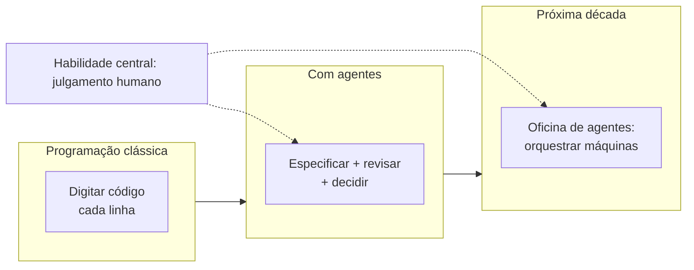

# Capítulo 16: O Ofício do Construtor Assistido: Carreira, Ética e o Futuro

## 1. Introdução

Você chegou ao fim da jornada — e ao começo do ofício. Este capítulo final olha para o horizonte: o que significa ser um construtor de software assistido por IA no mundo real — as habilidades que o mercado procura, a ética de trabalhar com máquinas que geram código e o que o futuro reserva para quem domina essa parceria. Mais do que um resumo, este capítulo é o mapa da sua carreira daqui para frente.

## 2. Explica

### As habilidades que o mercado procura

A chegada dos agentes de código mudou a curva de valor das habilidades de programação. As mais procuradas agora [1]:

1. **Especificação e comunicação**: descrever com precisão o que o software deve fazer — a habilidade de prompts, contratos e requisitos (Capítulos 4 e 11). É o novo portão de entrada.
2. **Revisão e julgamento**: saber separar código bom de código que parece bom — testes, revisão em três ângulos, segurança (Capítulos 11, 13 e 14).
3. **Arquitetura e decomposição**: partir problemas grandes em peças pequenas e testáveis (Capítulos 5 e 9) — a máquina executa; o humano estrutura.
4. **Integração e operação**: fazer o software funcionar no ambiente real — ambiente, deploy, observabilidade (Capítulos 6 e 15).

O padrão é claro: a IA tornou a *produção* de código mais barata e a *curadoria* mais valiosa. Quem especifica, revisa e decide vale mais do que quem apenas digita.

### Ética do construtor assistido

Trabalhar com código gerado por máquina exige princípios claros:

- **Responsabilidade**: você assina o que o agente gera. Código entregue é código seu — revisado, testado e compreendido [2].
- **Transparência**: ser honesto sobre o papel da IA no seu trabalho — com times, clientes e no código (licenças e créditos).
- **Qualidade inegociável**: a régua não muda porque o gerador é uma máquina: testes, revisão e segurança valem para todo código [3].
- **Aprendizado contínuo**: o ofício exige entender o que o agente faz — nunca delegar o entendimento junto com a digitação.

### O futuro do ofício

O futuro imediato é o aumento, não a substituição: programadores assistidos superam os não assistidos na maioria das tarefas — e a lacuna cresce com a complexidade [4]. Os próximos anos trarão agentes mais capazes, mas as habilidades deste livro — especificar, revisar, decidir, integrar — permanecem porque são habilidades humanas. A máquina escreve código; o construtor escreve o futuro.

### O construtor no time: trabalho humano, não só com máquinas

O ofício não se exerce sozinho: o construtor trabalha com outros construtores. E a chegada da IA mudou também a colaboração entre humanos — o operador de caixa-preta e o construtor se comportam de formas opostas:

| Situação | Operador de caixa-preta | Construtor assistido |
|---|---|---|
| Recebe código gerado | Copia e entrega | Revisa, testa e pergunta |
| Não entende um trecho | Esconde | Declara e pede ajuda |
| Erro em produção | "A IA fez assim" | "Eu assinei essa entrega, vou corrigir" |
| Aprendizado | Espera a próxima ferramenta | Registra o padrão e pratica |
| Crédito | Pede sozinho | Reconhece o agente e o time |

A diferença visível: responsabilidade. O mercado paga pela responsabilidade — e ela não se delega, nem a agentes nem a desculpas [5].

### O portfólio do construtor: provas, não promessas

O currículo lista habilidades; o portfólio prova. O portfólio do construtor assistido tem uma forma específica — cada projeto é uma evidência do método:

1. **Três projetos publicados**: um CLI testado (Capítulo 12), um site no ar (Capítulo 10) e um projeto zero documentado (Capítulo 9).
2. **Testes visíveis**: cada projeto com suíte verde e casos de borda.
3. **Documentação honesta**: README que explica decisões — incluindo onde a IA ajudou e onde o construtor decidiu.
4. **Aprendizados registrados**: o caderno de anotações como prova de evolução.
5. **Uma contribuição aberta**: uma issue, um PR ou uma tradução em projeto público.

O portfólio de três projetos pequenos e testados vale mais que o currículo de dez tecnologias sem prova. O entrevistador lê código, roda testes e pergunta "por quê" — e o construtor responde [6].

### Além do código: os caminhos do ofício

O construtor assistido não está preso à tela do editor. As habilidades deste livro abrem três caminhos além do desenvolvimento:

- **Escrita técnica**: quem sabe especificar sabe documentar — manuais, tutoriais, explicações de sistemas.
- **Ensino**: o construtor que registra o aprendizado (Capítulo 15) tem matéria-prima para ensinar — o melhor professor de IA é quem usa IA com método.
- **Consultoria de adoção**: equipes inteiras precisam aprender o que você já sabe — especificar, revisar e integrar agentes.

O ofício é mais amplo que a vaga de programador. Quem domina a parceria com máquinas é procurado em todos os lugares onde código é escrito — e em muitos onde não é [7].

## 3. Ilustra

O mestre de obras dos anos 1950 usava prumo e nível; o de hoje usa nível a laser. O prumo não desapareceu — transformou-se. O construtor assistido vive essa mesma transição: a máquina é o nível a laser; o ofício — medir, decidir, assumir a obra — continua humano.

E há um detalhe que este livro tentou gravar em cada capítulo: o mestre de obras não é substituído pela ferramenta, porque a obra não é a ferramenta — a obra é a decisão. Quem entende isso não teme o futuro; constrói com ele.



Como Construtor Assistido, você não está no fim do livro: está no início do ofício.

## 4. Técnica

### O plano de desenvolvimento pessoal do construtor

O ofício exige prática deliberada. O plano abaixo organiza o crescimento em ciclos de 30 dias — a régua da carreira:

```python
from dataclasses import dataclass
import json
from pathlib import Path


@dataclass
class CicloPratica:
    """Um ciclo de 30 dias de prática deliberada do ofício."""
    foco: str
    meta: str
    entregas: list[str]

    def validar_entregas(self) -> float:
        """Retorna a fração de entregas concluídas (0.0 a 1.0)."""
        if not self.entregas:
            return 0.0
        concluidas = sum(1 for entrega in self.entregas if Path(entrega).exists())
        return concluidas / len(self.entregas)


def plano_anual() -> list[CicloPratica]:
    """Os doze ciclos do ano do construtor assistido."""
    return [
        CicloPratica("Especificação", "prompts e contratos", ["prompts.md", "contratos.md"]),
        CicloPratica("Testes", "cobertura dos projetos", ["projetos/", "testes/"]),
        CicloPratica("Revisão", "3 ângulos por semana", ["revisoes/"]),
        CicloPratica("Segurança", "checkup em tudo", ["checkup/"]),
        CicloPratica("Automação", "3 fluxos em scripts", ["scripts/"]),
        CicloPratica("Arquitetura", "1 sistema de 4 camadas", ["arquitetura/"]),
        CicloPratica("Portfólio", "3 projetos publicados", ["publico/"]),
        CicloPratica("Ensino", "explicar o ofício", ["artigos/"]),
        CicloPratica("Integração", "1 projeto real de ponta a ponta", ["integracao/"]),
        CicloPratica("Legado", "revisar 1 código antigo", ["legado/"]),
        CicloPratica("Comunidade", "contribuir com projetos abertos", ["contribuicoes/"]),
        CicloPratica("Revisão do ano", "lições e próximos passos", ["revisao_ano.md"]),
    ]


def main() -> None:
    ciclos = plano_anual()
    relatorio = []
    for ciclo in ciclos:
        progresso = ciclo.validar_entregas()
        relatorio.append({"foco": ciclo.foco, "meta": ciclo.meta, "progresso": progresso})
        print(f"{ciclo.foco}: {progresso:.0%}")
    Path("plano_construtor.json").write_text(
        json.dumps(relatorio, ensure_ascii=False, indent=2), encoding="utf-8"
    )


if __name__ == "__main__":
    main()
```

### O avaliador de portfólio

O script que mede a régua da carreira: percorre a pasta de projetos e verifica se cada um tem as provas do ofício — README, testes e código-fonte. Nenhum projeto entra no portfólio sem passar na inspeção:

```python
import sys
from dataclasses import dataclass, field
from pathlib import Path


@dataclass
class Projeto:
    """Um projeto do portfólio e suas provas."""
    nome: str
    provas: dict[str, bool] = field(default_factory=dict)

    def completo(self) -> bool:
        return all(self.provas.values())

    def nota(self) -> str:
        total = len(self.provas)
        ok = sum(self.provas.values())
        if ok == total:
            return "PRONTO"
        if ok >= total - 1:
            return "QUASE"
        return "FALTANDO"


def inspecionar(raiz: Path, arvore: Path) -> list[Projeto]:
    """Confere cada subpasta da raiz em busca das provas do ofício."""
    projetos: list[Projeto] = []
    if not raiz.exists():
        print(f"Pasta '{raiz}' não encontrada.")
        return projetos
    for pasta in sorted(raiz.iterdir()):
        if not pasta.is_dir() or pasta.name.startswith("."):
            continue
        projeto = Projeto(nome=pasta.name)
        projeto.provas["README"] = (pasta / "README.md").exists()
        projeto.provas["código"] = any(arquivo.suffix in {".py", ".js", ".ts"} for arquivo in pasta.rglob("*"))
        projeto.provas["testes"] = any(pasta.rglob("test_*.py")) or (pasta / "testes").is_dir()
        projeto.provas["contrato"] = (pasta / "AGENTS.md").exists() or (pasta / "SPEC.md").exists()
        projetos.append(projeto)
    return projetos


def main() -> None:
    raiz = Path(sys.argv[1]) if len(sys.argv) > 1 else Path("portfolio")
    projetos = inspecionar(raiz, raiz)
    if not projetos:
        print("Nenhum projeto encontrado no portfólio.")
        return
    for projeto in projetos:
        status = projeto.nota()
        print(f"{status:<8} {projeto.nome}: {projeto.provas}")
    aprovados = sum(1 for projeto in projetos if projeto.completo())
    print(f"\n{aprovados}/{len(projetos)} projetos prontos para mostrar.")


if __name__ == "__main__":
    main()
```

Uso: `python avaliar_portfolio.py portfolio` — cada projeto recebe PRONTO, QUASE ou FALTANDO. A régua é honesta: portfólio não é pastinha de código baixado, é coleção de provas do método — e o script não perdoa falta de README nem de testes [8].

### O contrato ético do construtor

| Princípio | Compromisso prático |
|---|---|
| Responsabilidade | Nenhum código entrega sem revisão e teste (Capítulos 11 e 14) |
| Transparência | Papel da IA declarado ao time e ao cliente |
| Qualidade | A régua não muda com a origem do código |
| Aprendizado | Entender cada linha antes de assinar |

### O kit de sobrevivência do futuro

- Um AGENTS.md impecável por projeto (Capítulo 7).
- Uma suíte de testes que roda em segundos (Capítulo 11).
- Um harness com política clara (Capítulo 6).
- Um ritual de revisão fixo (Capítulo 14).
- Um plano de prática em ciclos — como o deste capítulo.

## 5. Aplica

### Cena de contraste: o digitador e o construtor

Dois candidatos concorrem à mesma vaga júnior. O primeiro usa IA há meses, mas como caixa-preta: pede, copia, cola — e não sabe explicar o que entregou. O segundo, com o método deste livro, mostra um CLI de tarefas testado (Capítulo 12), um site publicado (Capítulo 10) e um portfólio de projetos pequenos com testes e documentação. Na entrevista, o segundo especifica um contrato no quadro em cinco minutos — e o primeiro trava.

A vaga vai para o construtor. Não porque ele sabe "mais código", mas porque sabe o que o mercado agora valoriza: especificar, provar, revisar e assumir [1]. A máquina escreve; o construtor responde pela obra.

### Armadilhas comuns de carreira

- Virar operador de caixa-preta: pedir sem entender é atalho para o desemprego.
- Negligenciar os fundamentos: a régua (testes, revisão, segurança) não tem piloto automático.
- Esconder o uso de IA: transparência constrói confiança; segredo destrói.
- Parar de estudar: a máquina evolui; o ofício exige atualização contínua.
- Medir produtividade por volume: o valor está na curadoria, não na digitação.
- Acumular cursos sem provas: o portfólio não se enche com certificados — com entregas.
- Deixar o portfólio apodrecer: projeto sem README e sem testes é peça quebrada.
- Rejeitar o legado: o construtor que só quer código novo perde a maior escola do mercado.

### Protocolo de entrevista do construtor

A entrevista mudou com os agentes — mas o protocolo de preparação ficou mais simples, porque agora ele é o próprio método do livro:

1. **Portfólio inspecionado**: rode `python avaliar_portfolio.py portfolio` — só projetos PRONTOS entram na conversa.
2. **História de obra**: escolha um projeto e prepare a narrativa — problema, contrato, decisões, o que a IA fez e o que você decidiu.
3. **Prova viva**: deixe um projeto rodando — testes verdes no laptop valem mais que slides.
4. **Especificação no quadro**: pratique descrever um contrato em cinco minutos (Capítulo 9) — é a pergunta mais provável.
5. **Perguntas honestas**: pergunte sobre o papel da IA no time — demonstrar que sabe separar o que é seu do que é do agente impressiona [6].
6. **Perguntas de volta**: o construtor entrevista o empregador — teste, revisão e política de IA dizem se o canteiro é saudável.

O passo 4 é o divisor: operador de caixa-preta trava no quadro; construtor especifica, divide em peças e sai com o plano — a mesma dança do Capítulo 1, agora na frente do seu futuro [9].

### Exercícios do construtor

1. **Mapa das habilidades**: liste as quatro habilidades do capítulo (especificação, revisão, arquitetura, integração) e pontue-se de 1 a 5 em cada — escolha a menor nota para o próximo ciclo.
2. **Portfólio inspecionado**: rode o avaliador de portfólio do capítulo na sua pasta de projetos e anote quais ficaram PRONTOS, QUASES e FALTANDO — depois complete um QUASE.
3. **Contrato ético escrito**: escreva o seu contrato ético pessoal (responsabilidade, transparência, qualidade, aprendizado) em quatro frases e assine — literalmente.
4. **Entrevista simulada**: peça ao agente que faça o papel de entrevistador e responda à pergunta "explique um projeto seu" usando a história de obra do capítulo (problema, contrato, decisões).
5. **Especificação no quadro**: com um cronômetro, descreva o contrato de um CLI em cinco minutos — o treino do passo 4 do protocolo de entrevista.
6. **Plano de 30 dias**: escolha um foco do plano anual do capítulo e defina a meta do primeiro ciclo com três entregas verificáveis.
7. **Além do código**: escreva um parágrafo sobre qual caminho além do código (escrita, ensino, consultoria) combina com você e por quê.
8. **A prova do método**: rode o `plano_construtor.py` do capítulo e confirme que ele imprime o progresso — a primeira linha do seu relatório anual.

### Glossário do capítulo

| Termo | Significado |
|---|---|
| Ofício | O conjunto de habilidades e ética do construtor |
| Especificação | Descrever com precisão o que deve ser construído |
| Curadoria | Julgar, revisar e decidir sobre o código |
| Portfólio | Coleção de projetos com provas (testes, docs) |
| Contrato ético | Princípios que você assume ao usar agentes |
| Caixa-preta | Uso da IA sem entender o que ela faz |
| Ciclo de prática | Período focado em uma habilidade por vez |
| Aumento | IA que amplia o humano, em vez de substituí-lo |

### Erros comuns do construtor

| Erro | Sintoma | Correção do capítulo |
|---|---|---|
| Operador de caixa-preta | Carreira frágil na primeira pergunta "por quê" | Entenda cada entrega antes de assinar |
| Portfólio sem provas | Currículo de dez tecnologias, zero evidência | Projetos com testes, docs e contrato |
| Esconder a IA | Confiança quebrada no primeiro achado | Transparência constrói o crédito do ofício |
| Parar de praticar | Habilidade enferruja com a ferramenta | Ciclos de 30 dias: uma habilidade por vez |
| Confundir volume com valor | Entregas sem curadoria | O valor está em especificar, revisar e decidir |
| Rejeitar o legado | Perde a maior escola do mercado | Código antigo ensina o que nenhum tutorial ensina |

### O passeio de uma hora

Reserve uma hora e percorra o capítulo em ação:

1. **Pontue-se** nas quatro habilidades do ofício (especificação, revisão, arquitetura, integração).
2. **Rode o avaliador de portfólio** do capítulo na sua pasta de projetos.
3. **Escolha um projeto QUASE** e complete a prova que falta (README, testes ou contrato).
4. **Escreva o seu contrato ético** em quatro frases — responsabilidade, transparência, qualidade, aprendizado.
5. **Rode uma entrevista simulada** com o agente como entrevistador, contando a história de uma obra sua.
6. **Treine a especificação no quadro**: descreva um contrato em cinco minutos, com cronômetro.
7. **Defina o primeiro ciclo de 30 dias**: foco, meta e três entregas verificáveis.
8. **Rode o plano anual** do capítulo e confirme que ele imprime os doze ciclos.
9. **Escreva o parágrafo do caminho além do código**: escrita, ensino ou consultoria?
10. **Registre no caderno** o foco do primeiro ciclo — amanhã começa o dia 1 do seu ano.

### Perguntas e respostas do capítulo

- **A IA vai substituir programadores?** A IA substitui a digitação e aumenta o construtor. As habilidades deste livro — especificar, revisar, decidir, integrar — são humanas e continuam sendo o centro.
- **Como começo a carreira com IA no currículo?** Com provas: portfólio inspecionado, projetos testados e a história de obra contada com transparência sobre o papel da IA.
- **Preciso saber "tudo" sobre modelos?** Precisa saber escolher e medir — o Capítulo 8 dá a régua. Modelo é ferramenta; o ofício é o julgamento.
- **E se eu errar na ética sem querer?** Transparência corrige: declare o papel da IA, corrija a entrega e registre o aprendizado. Ética é prática, não perfeição.
- **Por onde começo amanhã?** Pelo primeiro ciclo do plano: uma habilidade, uma meta, três entregas verificáveis. O capítulo termina com o prumo na sua mão — use-o.

### Você sabe que dominou quando...

1. Explica as quatro habilidades do ofício com exemplos próprios.
2. Apresenta um portfólio com provas, não promessas.
3. Declara o papel da IA no trabalho sem constrangimento.
4. Define um ciclo de 30 dias com entregas verificáveis.
5. Escreve o contrato ético e o defende em uma conversa.
6. Olha para o futuro com o método no lugar do medo.

### Resumo em pontos

- Quatro habilidades do construtor: especificar, revisar, decidir, integrar.
- Portfólio é prova: cada projeto com contrato, teste e história honesta.
- Ética é prática: transparência, respeito aos limites e aprendizado.
- O plano de 30 dias começa amanhã, com uma meta e três entregas.
- A carreira do construtor é feita de obras concluídas, não de intenções.

### Desafio de aprofundamento

Escreva agora, antes de fechar o livro, o seu plano de 30 dias em uma página: a habilidade que você mais precisa treinar, a meta mensurável, as três entregas verificáveis (uma por semana) e o contrato ético em três frases. Coloque a página no lugar onde você começa o dia. Quando os 30 dias terminarem, retorne a este capítulo, leia o Desafio de aprofundamento do Capítulo 1 e compare as duas respostas — a distância entre elas é exatamente o quanto você construiu.

### Conexão com o próximo capítulo

Este é o último capítulo — e a conexão que ele estabelece é com você: o plano de 30 dias que transforma o método em obra. O ciclo do construtor não termina aqui; ele recomeça no Capítulo 1, agora com o prumo da experiência.

## 6. Conclusão

Você fechou a jornada com o mapa do ofício: as habilidades que o mercado valoriza (especificação, revisão, arquitetura, integração), o contrato ético do construtor (responsabilidade, transparência, qualidade, aprendizado) e um plano de prática em doze ciclos. Daqui em diante, a Oficina do Código é sua: cada projeto é uma obra, cada obra um aprendizado, cada aprendizado uma parede do seu ofício. Desafio final: rode o `plano_construtor.py`, escolha o primeiro ciclo e comece hoje — o prumo está na sua mão.

## 7. Referências Bibliográficas

[1] WORLD ECONOMIC FORUM. *Future of Jobs Report 2025*. Disponível em: https://www.weforum.org/publications/the-future-of-jobs-report-2025/. Acesso em: 06 ago. 2026.

[2] OPENAI. *A practical guide to building agents* (2025). Disponível em: https://cdn.openai.com/business-guides-and-resources/a-practical-guide-to-building-agents.pdf. Acesso em: 06 ago. 2026.

[3] OWASP. *Top 10 for LLM Applications — Prompt Injection*. Disponível em: https://owasp.org/www-project-top-10-for-large-language-model-applications/. Acesso em: 06 ago. 2026.

[4] IEEE ACCESS. *Coding Agents in the Wild* (2026). Disponível em: https://ieeexplore.ieee.org/document/10795597. Acesso em: 06 ago. 2026.

[5] KAHNEMAN, Daniel. *Rápido e Devagar: Duas Formas de Pensar*. Rio de Janeiro: Objetiva, 2012.

[6] MCDOWELL, Gayle Laakmann. *Cracking the Coding Interview*. 6. ed. Palo Alto: CareerCup, 2015.

[7] ANTHROPIC. *Prompt engineering overview*. Disponível em: https://docs.anthropic.com/en/docs/build-with-claude/prompt-engineering/overview. Acesso em: 06 ago. 2026.

[8] ERICSSON, Anders; POOL, Robert. *Peak: Secrets from the New Science of Expertise*. Boston: Houghton Mifflin Harcourt, 2016.

[9] WIGGINS, Adam. *The Twelve-Factor App*. Disponível em: https://12factor.net. Acesso em: 06 ago. 2026.

[10] BROOKS, Frederick P. *The Mythical Man-Month*. 2. ed. Boston: Addison-Wesley, 1995.

[11] GOOGLE. *Technical Writing for Developers*. Disponível em: https://developers.google.com/tech-writing. Acesso em: 06 ago. 2026.

[12] EUROPEAN PARLIAMENT. *EU Artificial Intelligence Act*. Disponível em: https://artificialintelligenceact.eu. Acesso em: 06 ago. 2026.

[13] KARPATHY, Andrej. *Software 2.0*. Disponível em: https://karpathy.medium.com/software-2-0-a64152b37c35. Acesso em: 06 ago. 2026.

[14] BRYNJOLFSSON, Erik; MCAFEE, Andrew. *The Second Machine Age*. New York: W. W. Norton, 2014.

[15] ZINSSER, William. *On Writing Well*. 30. ed. New York: HarperCollins, 2016.

[16] KLEON, Austin. *Show Your Work!*. São Paulo: Rocco, 2014.

[17] RAYMOND, Eric S. *The Cathedral and the Bazaar*. Disponível em: https://www.catb.org/~esr/writings/cathedral-bazaar/cathedral-bazaar/. Acesso em: 06 ago. 2026.

[18] EPSTEIN, David. *Range: Why Generalists Triumph in a Specialized World*. New York: Riverhead Books, 2019.

[19] DWECK, Carol S. *Mindset: A Nova Psicologia do Sucesso*. São Paulo: Objetiva, 2017.

[20] HUGGING FACE. *Agents Course*. Disponível em: https://huggingface.co/learn/agents-course. Acesso em: 06 ago. 2026.
