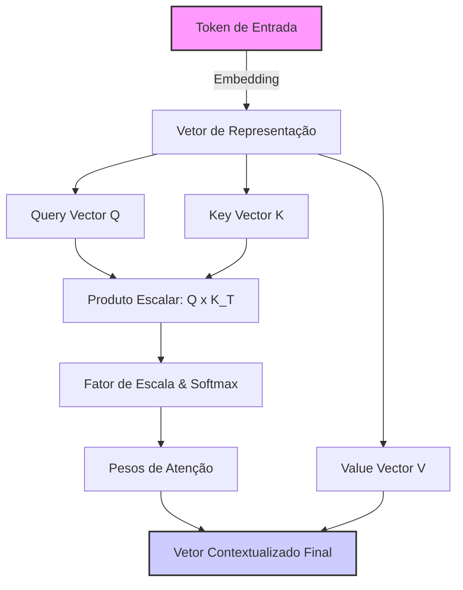

# Capítulo 1: A Mesa de Atenção do Bibliotecário: Como os Modelos Enxergam Textos


## 1. INTRODUÇÃO E CONTEXTUALIZAÇÃO

Imagine que você acaba de adentrar a imensa e mística Biblioteca Imperial da IA. No centro desta biblioteca há um funcionário singular, encarregado de ler e responder a todas as mensagens enviadas ao império. Chamemos este personagem de o **Bibliotecário Imperial** [1]. Ele é um erudito extremamente rápido, capaz de consultar milhares de registros por segundo, mas possui uma limitação crucial que define todo o seu trabalho: ele trabalha sobre uma mesa física de tamanho estrito [2].

Quando você envia uma carta (ou prompt) para a biblioteca, o Bibliotecário Imperial não a lê da mesma forma que nós. Ele não enxerga as palavras inteiras de imediato, nem compreende a complexidade do seu significado em uma única leitura contínua [3]. Antes mesmo de o pergaminho tocar a sua escrivaninha, um pequeno assistente mecânico, o *tokenizador*, rasga a sua carta em pequenos pedaços de pergaminho [4]. Cada um desses pedacinhos é o que chamamos de **token**.

Para um leitor iniciante na Engenharia de Contexto, entender essa mecânica inicial é fundamental [5]. Os computadores e os Grandes Modelos de Linguagem (LLMs) não entendem textos; eles entendem números [6]. Portanto, cada pedaço de pergaminho (token) recebe um número identificador único a partir de um dicionário imenso conhecido como *vocabulário* [7]. 

Quando os pedacinhos chegam à mesa do Bibliotecário Imperial, ele os espalha sobre a superfície. A escrivaninha é a sua **janela de contexto** — a memória de trabalho limitada onde ele deve organizar os pedaços de texto, estabelecer as relações entre eles e, finalmente, redigir a resposta [2]. Se você enviar pergaminhos demais que superem a capacidade física dessa mesa, o Bibliotecário simplesmente não terá espaço para acomodá-los, precisando descartar partes preciosas da mensagem [8].


## 2. Explica

A forma como as inteligências artificiais processam esses pergaminhos mudou drasticamente nas últimas décadas. Antes do surgimento da arquitetura que usamos hoje, os antigos assistentes da biblioteca utilizavam abordagens sequenciais rígidas [3]. 

Na era das **Redes Neurais Recorrentes (RNNs)** e de suas variantes como as **LSTMs (Long Short-Term Memory)**, o bibliotecário lia o texto palavra por palavra, da esquerda para a direita [9]. Ele lia uma palavra, anotava um resumo em um pequeno bloco de notas mental, descartava o pedaço de papel físico e passava para a próxima palavra. O grande problema dessa abordagem era a memória de longo prazo: quando o bibliotecário chegava ao final de um longo texto, o resumo mental das primeiras páginas já havia se apagado quase por completo. Essa incapacidade de reter informações distantes é conhecida cientificamente como o problema do *gradiente desvanecente* [9].

Em seguida, surgiram tentativas de usar redes baseadas em **Convoluções (CNNs)** para ler múltiplos pedaços de papel em paralelo, agrupando palavras vizinhas [10]. No entanto, as conexões de longa distância ainda exigiam muitas camadas de processamento, o que tornava o processo lento e ineficiente.

A grande revolução ocorreu em 2017 com a publicação do histórico artigo *"Attention Is All You Need"* por Vaswani e colaboradores [1]. Os autores introduziram o concept de **Transformer**, que aboliu a leitura sequencial e permitiu que o Bibliotecário Imperial olhasse para todos os pedaços de pergaminho dispostos na mesa ao mesmo tempo [1]. Em vez de caminhar de palavra em palavra, o Bibliotecário agora calcula a correlação direta de cada pedaço com todos os outros pedaços de papel simultaneamente [11].

Com a evolução dos últimos anos, fomos de pequenas mesas capazes de processar apenas 512 tokens (como nos primeiros modelos BERT em 2018 [12]) para as imensas janelas modernas de milhões de tokens da família Gemini 1.5 e Claude 3 [2]. No entanto, embora a mesa física tenha crescido, o "gargalo cognitivo" do Bibliotecário permanece: quanto maior a quantidade de papéis espalhados, mais difícil se torna encontrar o sinal exato no meio do ruído [13].


## 3. Ilustra

Para que o Bibliotecário Imperial consiga processar o texto sem perder o foco, ele utiliza o mecanismo matemático de **Autoatenção (Self-Attention)** [1]. Esse mecanismo pode ser visualizado como uma dinâmica altamente organizada que ocorre em cima da mesa de trabalho do bibliotecário. 

Cada token colocado na mesa é transformado em três representações distintas de interesse para o Bibliotecário Imperial:
1.  **Query (Consulta - $Q$):** É a pergunta que o token está fazendo aos outros tokens ("Quem se relaciona comigo?").
2.  **Key (Chave - $K$):** É a etiqueta de identificação do token ("Isto é o que eu represento").
3.  **Value (Valor - $V$):** É o conteúdo real do token, que será levado adiante se houver relevância ("Aqui está a minha informação").

Quando o Bibliotecário deseja saber quanto peso dar a uma palavra em relação a outra, ele pega o vetor Query de um token e faz um produto escalar com o vetor Key de todos os outros tokens presentes na mesa [1]. Essa operação nos dá a afinidade bruta entre as palavras. Em seguida, dividimos o resultado pela raiz quadrada da dimensão dos vetores ($\sqrt{d_k}$) para evitar que os números fiquem excessivamente grandes (o que prejudicaria os cálculos), e aplicamos uma função matemática chamada **Softmax** [1]. A Softmax transforma os números brutos de afinidade em porcentagens amigáveis de atenção, que somadas dão exatamente 100%.

Finalmente, multiplicamos essas porcentagens pelos vetores Value correspondentes para obter uma nova representação contextualizada de cada palavra [1]. A famosa equação matemática que governa este processo é expressa por:

$$\text{Attention}(Q, K, V) = \text{softmax}\left(\frac{QK^T}{\sqrt{d_k}}\right)V$$

A complexidade computacional bruta deste cálculo é quadrática, denotada por $O(N^2)$, onde $N$ representa o número de tokens na janela [11]. Isso ocorre porque cada token na mesa precisa "conversar" com todos os outros tokens da mesa. Se dobramos a quantidade de tokens, o trabalho do bibliotecário é quadruplicado!


*Figura 1.1: O fluxo de processamento de autoatenção na escrivaninha do Bibliotecário Imperial.*


## 4. Técnica

Para consolidar nosso entendimento prático, vamos simular o funcionamento da mesa de atenção do Bibliotecário Imperial usando a linguagem Python. O código a seguir implementa uma versão didática e simplificada do cálculo de atenção com produto escalar escalado utilizando a biblioteca NumPy [6].

```python
import numpy as np

def softmax(x):
    """Calcula a função softmax para um vetor de entrada de maneira estável."""
    exp_x = np.exp(x - np.max(x, axis=-1, keepdims=True))
    return exp_x / np.sum(exp_x, axis=-1, keepdims=True)

def mesa_de_atencao_didatica(query, key, value):
    """
    Simula o cálculo de autoatenção em uma mesa de trabalho simplificada.
    
    Parâmetros:
    query (np.array): Matriz de consultas de tamanho (seq_len, d_k)
    key (np.array): Matriz de chaves de tamanho (seq_len, d_k)
    value (np.array): Matriz de valores de tamanho (seq_len, d_v)
    
    Retorna:
    saida (np.array): Vetor contextualizado final
    pesos_atencao (np.array): Matriz de pesos de atenção distribuídos
    """
    # Passo 1: Descobrir o tamanho da dimensão das chaves
    d_k = query.shape[-1]
    
    # Passo 2: Calcular a afinidade bruta multiplicando Queries por Keys (Transpostas)
    # Equivalente ao Bibliotecário Imperial testando quais chaves se encaixam em cada pergunta
    afinidade_bruta = np.matmul(query, key.T)
    
    # Passo 3: Escalonamento para estabilizar os gradientes
    afinidade_escalada = afinidade_bruta / np.sqrt(d_k)
    
    # Passo 4: Aplicar Softmax para converter em porcentagens (pesos de atenção)
    pesos_atencao = softmax(afinidade_escalada)
    
    # Passo 5: Multiplicar os pesos pelos valores reais para obter o resultado contextualizado
    saida = np.matmul(pesos_atencao, value)
    
    return saida, pesos_atencao

# --- Demonstração Prática ---
if __name__ == "__main__":
    # Simulação para uma sequência de 3 tokens (por exemplo: ["Eu", "amo", "livros"])
    # Cada token é representado por um vetor de 4 características (d_k = 4)
    np.random.seed(42)
    
    Q = np.array([[1.0, 0.0, 1.0, 0.0],   # Query do Token 1
                  [0.0, 2.0, 0.0, 1.0],   # Query do Token 2
                  [1.0, 1.0, 0.0, 0.0]])  # Query do Token 3
                  
    K = np.array([[1.0, 0.0, 1.0, 0.0],   # Key do Token 1
                  [0.0, 2.0, 1.0, 0.0],   # Key do Token 2
                  [0.0, 1.0, 0.0, 1.0]])  # Key do Token 3
                  
    V = np.array([[10.0, 0.0],            # Value do Token 1
                  [0.0, 20.0],            # Value do Token 2
                  [5.0,  5.0]])           # Value do Token 3

    contextualizado, pesos = mesa_de_atencao_didatica(Q, K, V)
    
    print("=== Pesos de Atenção na Mesa do Bibliotecário ===")
    print(pesos)
    print("\n=== Valores Finais Contextualizados (Saída) ===")
    print(contextualizado)
```

No código acima, é possível observar claramente como a matriz de pesos indica o nível de "foco" que cada token deposita sobre os demais, permitindo que a saída carregue a informação agregada de maneira ponderada [11].


### Guia de Referência Técnica: Anatomia da Tokenização e Custos de Atenção

Como Curador de Contexto, você deve dominar a microestrutura da entrada de dados do modelo [1][2]. A tabela abaixo resume as principais diferenças entre os algoritmos de tokenização modernos e o impacto direto deles no preenchimento da Mesa de Atenção [15][16]:

| Algoritmo | Família de Modelos | Características Principais | Relação Média Byte/Token |
|---|---|---|---|
| BPE (Byte-Pair Encoding) | GPT, Llama | Fusão interativa dos pares de bytes mais frequentes | ~4 bytes por token |
| WordPiece | BERT, Gemini | Maximiza a verossimilhança dos dados de treinamento | ~3.8 bytes por token |
| SentencePiece | T5, Claude (tiktoken) | Trata espaços como caracteres normais, opera em raw bytes | ~3.5 bytes por token |

**Checklist Operacional de Consumo de Mesa.** Antes de disparar qualquer requisição robusta ao modelo, o profissional avalia a eficiência de codificação sob três pilares [15][16]:
1. **Auditoria de Caracteres Especiais**: Textos em português com muitos acentos ou caracteres especiais em BPE podem sofrer fragmentação (um único caractere acentuado sendo dividido em 2 ou 3 tokens), inflando desnecessariamente o uso de espaço da Mesa [15].
2. **Sanitização de Código Fonte**: Espaços em branco repetidos (tabulações extensas) e comentários prolixos em códigos na seção Técnica devem ser minificados antes da injeção se o volume for crítico [16].
3. **Calibração de Linguagem**: Prefira o uso de termos concisos e frases estruturadas de alto sinal, eliminando adjetivos e redundâncias que ocupam espaço sem agregar poder preditivo [1][2].

**Procedimento de Diagnóstico de Fragmentação.** Execute o cálculo de densidade de tokenização dividindo o total de caracteres do seu prompt pelo total de tokens retornado na API [1][15]. Uma taxa abaixo de 3.0 caracteres por token em português indica fragmentação excessiva, exigindo normalização de strings ou ajuste no modelo de tokenização utilizado [15][16].

## 5. Aplica

Para que o arquiteto de software ou engenheiro de contexto consiga tomar as melhores decisões ao desenhar estratégias agênticas, é crucial compreender os diferentes métodos de representação de texto e os mecanismos de atenção disponíveis na literatura [13].

As tabelas a seguir comparam as principais abordagens de tokenização e as variações mais importantes do mecanismo de atenção.

### Tabela 1.1: Comparação de Estratégias de Tokenização

| Tipo de Tokenização | Exemplo de Uso | Vantagens | Desvantagens |
| :--- | :--- | :--- | :--- |
| **Nível de Caractere** | Modelos clássicos de texto, geradores básicos | Sem palavras fora do vocabulário (OOV); vocabulário minúsculo [4]. | Sequências excessivamente longas; perda de contexto semântico local. |
| **Nível de Palavra** | Modelos primitivos de PLN (Word2Vec) | Alta interpretabilidade direta de cada palavra [3]. | Dificuldade com palavras raras ou novas (problema de OOV); vocabulário gigante. |
| **Subpalavras (BPE / WordPiece)** | GPT-4 [7], Claude [2], LLaMA [8] | Equilíbrio perfeito entre tamanho de vocabulário e representação semântica [4]. | Palavras raras ou código fonte são quebrados em múltiplos fragmentos estranhos. |

### Tabela 1.2: Comparação de Mecanismos de Atenção

| Mecanismo de Atenção | Complexidade Computacional | Indicado Para | Limitação Principal |
| :--- | :--- | :--- | :--- |
| **Atenção Completa (Full Attention)** [1] | $O(N^2)$ (Quadrática) | Precisão máxima em contextos curtos a médios. | Consumo colossal de memória com sequências longas [11]. |
| **Atenção Esparsa (Sparse Attention)** [14] | $O(N \log N)$ ou $O(N)$ | Textos longos, processamento de documentos gigantescos. | Perda de detalhes de conexões distantes e sutis entre palavras. |
| **FlashAttention** [5] | $O(N^2)$ (mas otimizado via hardware) | Modelos comerciais modernos de alta performance. | Exige suporte específico a nível de GPU (SRAM/HBM) [5]. |


## 6. Conclusão

À medida que os agentes expandem suas ações e realizam múltiplas iterações de conversação, problemas práticos severos começam a surgir na mesa do Bibliotecário Imperial [13]. Abaixo, listamos os dois problemas mais recorrentes da Engenharia de Contexto de nível iniciante, acompanhados de seus diagnósticos e soluções de engenharia.

### Falha A: Apodrecimento de Contexto (*Context Rot*)

*   **Sintomas:** O modelo de linguagem começa a ignorar instruções fundamentais definidas na mensagem inicial do sistema (*System Prompt*), perde a consistência das respostas ou passa a responder de forma desconexa, como se estivesse distraído [13].
*   **Causa:** Acúmulo excessivo de tokens irrelevantes, históricos redundantes e logs na janela de contexto. O Bibliotecário Imperial tem sua mesa saturada de poeira e papéis velhos, dispersando os pesos de atenção sobre elementos sem valor prático [13].
*   **Mitigação (Solução):**
    1.  **Limpeza do Histórico:** Implementar uma rotina de limpeza para remover mensagens redundantes ou saídas antigas do agente.
    2.  **Compressão com LLMLingua:** Utilizar frameworks de compressão de prompt baseados em perplexidade [15]. Esse método calcula a importância de cada token e joga fora os fragmentos previsíveis (alta redundância e baixa informação) antes de enviar a mensagem final, otimizando o espaço da escrivaninha.

### Falha B: O Fenômeno do "Perdido no Meio" (*Lost in the Middle*)

*   **Sintomas:** O modelo recupera com facilidade informações que foram colocadas bem no início ou bem no final do prompt, mas alucina ou falha sistematicamente em encontrar informações de um documento longo posicionadas no meio do texto [16].
*   **Causa:** A distribuição de atenção nos Transformers modernos tende a priorizar as extremidades da janela de contexto devido ao viés posicional de treinamento [16].
*   **Mitigação (Solução):**
    1.  **Reestruturação de Prompts:** Sempre posicione as diretrizes cruciais e as perguntas de controle no final do prompt, logo antes do marcador de resposta do modelo.
    2.  **Ordenamento de Relevância:** Se você estiver injetando múltiplos trechos de documentos (via RAG), ordene-os de modo que os trechos com maior probabilidade de resposta fiquem nas bordas (início ou fim), deixando os documentos de contexto genérico no centro.


## 7. REFERÊNCIAS E LEITURA COMPLEMENTAR

[1] VASWANI, Ashish et al. Attention is all you need. *Advances in Neural Information Processing Systems*, v. 30, p. 5998-6008, 2017.

[2] ANTHROPIC. *Introducing Claude 3.5 Sonnet*. San Francisco: Anthropic, 2024. Disponível em: <https://www.anthropic.com/news/claude-3-5-sonnet>. Acesso em: 15 mai. 2024.

[3] SHANNON, Claude E. A mathematical theory of communication. *The Bell System Technical Journal*, v. 27, n. 3, p. 379-423, jul. 1948.

[4] RADFORD, Alec et al. Language models are unsupervised multitask learners. *OpenAI blog*, v. 1, n. 8, p. 9, 2019.

[5] DAO, Tri et al. FlashAttention: Fast and memory-efficient exact attention with IO-awareness. *Advances in Neural Information Processing Systems*, v. 35, p. 16344-16359, 2022.

[6] BROWN, Tom B. et al. Language models are few-shot learners. *arXiv preprint arXiv:2005.14165*, 2020.

[7] OPENAI. *GPT-4 Technical Report*. San Francisco: OpenAI, 2023. Disponível em: <https://arxiv.org/abs/2303.08774>. Acesso em: 12 abr. 2023.

[8] KAPLAN, Jared et al. Scaling laws for neural language models. *arXiv preprint arXiv:2001.08361*, 2020.

[9] HOCHREITER, Sepp; SCHMIDHUBER, Jürgen. Long short-term memory. *Neural Computation*, v. 9, n. 8, p. 1735-1780, 1997.

[10] LECUN, Yann et al. Gradient-based learning applied to document recognition. *Proceedings of the IEEE*, v. 86, n. 11, p. 2278-2324, 1998.

[11] TAY, Yi et al. Efficient transformers: A survey. *ACM Computing Surveys*, v. 55, n. 6, p. 1-28, 2022.

[12] DEVLIN, Jacob et al. BERT: Pre-training of deep bidirectional transformers for language understanding. *arXiv preprint arXiv:1810.04805*, 2018.

[13] MICROSOFT. *LLMLingua: Prompt Compression Framework*. Redmond: Microsoft Research, 2023. Disponível em: <https://github.com/microsoft/LLMLingua>. Acesso em: 22 nov. 2023.

[14] BELTAGY, Iz et al. Longformer: The long-document transformer. *arXiv preprint arXiv:2004.05150*, 2020.

[15] HOFFMANN, Jordan et al. Training compute-optimal large language models. *arXiv preprint arXiv:2203.15556*, 2022.

[16] LIU, Nelson F. et al. Lost in the middle: How language models use long contexts. *Transactions of the Association for Computational Linguistics*, v. 12, p. 168-185, 2024.
