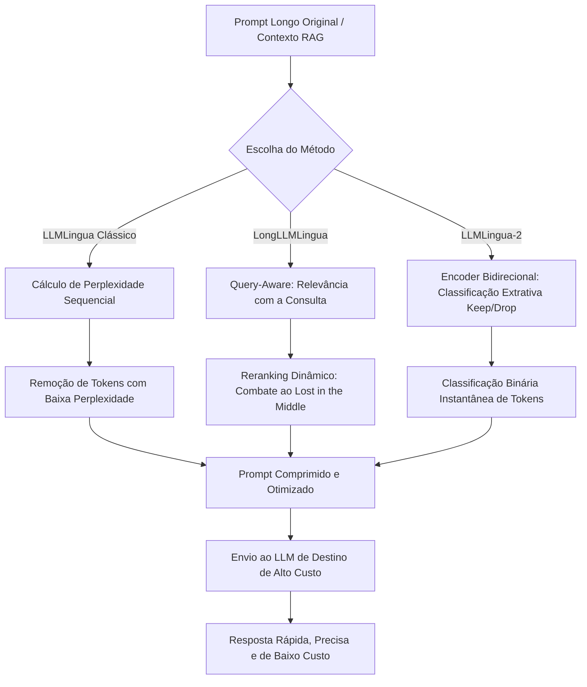

# O Julgamento da Perplexidade: A Tecnologia LLMLingua

## 1. Introdução

No reino fascinante da engenharia de contexto, reduzir o volume de informações sem perder a essência é uma das artes mais valiosas. No capítulo anterior, intitulado "Capítulo 9: O Scriba de Resumos" [16], compreendemos a relevância fundamental da condensação de textos. Vimos que resumos bem estruturados reduzem o ruído operacional e ajudam a otimizar a janela de contexto de modelos de linguagem de grande porte. Contudo, em cenários de alta demanda e prompts massivos, resumir textos longos de forma puramente semântica pode ser lento e oneroso. É nesse ponto que adentramos o tribunal do Julgamento da Perplexidade, apresentando as tecnologias LLMLingua [1] e suas evoluções de compressão de contexto baseadas em métricas de informação matemática [5].

Imagine o palácio imperial de um vasto império tecnológico. Todos os dias, milhares de mensageiros trazem longos pergaminhos contendo petições, relatórios e tratados que o Imperador (o nosso modelo principal de inteligência artificial, de altíssimo custo e capacidade, como o GPT-4 ou Claude [7]) precisa ler e responder. Se o Imperador dedicar seu tempo para ler cada palavra cerimonial, saudação repetitiva ou preâmbulo florido, o império falirá devido à lentidão nas decisões e ao custo absurdo de manter o soberano focado.

É aqui que surge a figura do **Bibliotecário Imperial** [11]. Ele é um assistente rápido, extremamente eficiente e de custo operacional quase nulo (um modelo de linguagem menor e local, como o GPT-2 ou XLM-RoBERTa [10, 8]). Sentado à entrada do palácio, munido de uma pena vermelha, o Bibliotecário executa o "Julgamento da Perplexidade". Ele lê os pergaminhos rapidamente e risca todas as palavras altamente previsíveis, formais ou redundantes. Se uma frase diz "Para o mui digno e reverendíssimo senhor imperador, solicito respeitosamente que me responda...", o Bibliotecário risca quase tudo, deixando apenas: "Imperador, responda...". O pergaminho original, que antes ocupava metros de papel, agora entra na câmara real reduzido a uma fração de seu tamanho original, porém com todas as instruções cruciais, perguntas e dados mantidos intactos. Ao final deste capítulo, você compreenderá as bases matemáticas dessa seleção, saberá configurar frameworks de compressão em Python e estará pronto para aplicar essas técnicas em seus próprios projetos [12].

## 2. Explica

Para entender o funcionamento do LLMLingua [1], precisamos desmistificar o conceito fundamental de **perplexidade** sob a ótica da teoria da informação [5]. Em termos simples, a perplexidade é uma métrica que avalia o quão "surpreso" um modelo de linguagem fica ao ler uma determinada palavra (ou token) em um contexto.

Do ponto de vista estatístico, se um token é altamente previsível dada a sequência de palavras anterior, a probabilidade atribuída a ele pelo modelo é muito alta. Consequentemente, sua surpresa (ou perplexidade) é extremamente baixa. Palavras com baixa perplexidade contêm muito pouca informação nova [15]. Pense em artigos ("o", "a"), preposições ("de", "para") ou jargões corporativos repetitivos ("gostaria de reiterar que..."). Por outro lado, palavras raras, entidades nomeadas específicas, valores numéricos e instruções diretas de comando ("exclua", "calcule", "salários") possuem alta perplexidade. O modelo não consegue adivinhá-las facilmente antes de lê-las, o que significa que elas carregam a verdadeira carga de informação do prompt [11].

O LLMLingua [1], desenvolvido pela Microsoft Research, utiliza um modelo de linguagem pequeno e ultra-rápido (como o GPT-2 [10] ou LLaMA de parâmetros reduzidos) para calcular a perplexidade de cada token do prompt longo fornecido pelo usuário. O algoritmo estabelece um limite de corte: tokens cuja perplexidade esteja abaixo desse limite são considerados redundantes ou triviais e são sumariamente descartados. Apenas os tokens de alta perplexidade, que representam as informações cruciais e as instruções do usuário, sobrevivem para compor o prompt compactado que será de fato enviado ao modelo principal de destino.

### LongLLMLingua e a Solução para o Viés de Meio

Embora a compressão por perplexidade pura funcione excepcionalmente bem para reduzir o ruído em prompts genéricos, ela pode falhar ao lidar com sistemas de Recuperação de Informação (RAG) onde o usuário faz uma pergunta específica (*query*) [9]. Se utilizarmos apenas a perplexidade clássica, podemos descartar tokens que são cruciais para responder àquela pergunta em particular apenas porque eles parecem estatisticamente previsíveis em outro contexto.

Para solucionar isso, a Microsoft Research criou o **LongLLMLingua** [9]. Ele introduz uma métrica de compressão "Query-Aware" (consciente da consulta). O LongLLMLingua não mede apenas a perplexidade intrínseca do texto, mas sim a importância relativa de cada token em relação à pergunta exata que o usuário formulou. 

Além disso, modelos de linguagem sofrem do conhecido viés de "Lost in the Middle" (perdido no meio) [2]: eles tendem a prestar mais atenção nas informações localizadas no início e no fim da janela de contexto, ignorando ou esquecendo dados situados no centro do prompt longo. O LongLLMLingua combate esse problema de maneira brilhante: ele executa um *reranking* dinâmico dos fragmentos recuperados do banco de dados, reorganizando-os para que as partes identificadas como mais ricas em informação para a *query* sejam movidas para os extremos do prompt final (o começo e o fim), otimizando a qualidade da resposta gerada pelo modelo旗舰 [9].

### A Evolução Radical do LLMLingua-2

Apesar do sucesso de seus predecessores, o cálculo sequencial de perplexidade token a token usando modelos autorregressivos (como o GPT-2) ainda consome um tempo considerável de processamento da CPU/GPU local. Visando a velocidade absoluta para sistemas em tempo real, os pesquisadores introduziram o **LLMLingua-2** [3].

O LLMLingua-2 muda completamente o paradigma: em vez de estimar a perplexidade de forma sequencial lenta, ele adota uma abordagem de **Classificação Extrativa**. Ele utiliza um codificador bidirecional extremamente leve e rápido (como o XLM-RoBERTa [8]), treinado via destilação de dados do GPT-4 [3]. O modelo funciona analisando o prompt inteiro de uma única vez, atribuindo uma classificação binária a cada token individual do texto: `keep` (manter) ou `drop` (descartar). Esse processo de rotulação binária é até 6 vezes mais rápido que a geração sequencial do LLMLingua original, preservando a fidelidade extrativa absoluta do texto sem quebras de sintaxe desnecessárias [3].

## 3. Ilustra

A analogia do Bibliotecário Imperial nos ajuda a visualizar as diferenças práticas entre os três principais mecanismos de filtragem de dados. Cada variação tecnológica equivale a um método diferente adotado pelo Bibliotecário ao revisar os pergaminhos da corte.

No método tradicional do **LLMLingua**, o Bibliotecário Imperial usa sua régua matemática para riscar palavras triviais e de transição lógica [1]. Ele apenas lê o texto de forma isolada, limpando as redundâncias estruturais para tornar a leitura mais ágil para o Imperador.

No método **LongLLMLingua**, o Bibliotecário primeiro lê a ordem direta do Imperador ("Quero saber o saldo de impostos coletados") [9]. Com essa ordem em mente, ele analisa as centenas de relatórios empilhados. Ele não apenas risca as palavras inúteis, mas reordena fisicamente os papéis, colocando os relatórios mais importantes para aquela pergunta exata no topo da pilha e os relatórios secundários no fundo, garantindo que o Imperador os visualize imediatamente.

No método **LLMLingua-2**, o Bibliotecário Imperial desenvolveu uma visão ultra-rápida [3]. Ele não precisa ler palavra por palavra devagar. Ele bate o olho no pergaminho e, em milissegundos, carimba instantaneamente cada token com um selo verde de "Fica" ou um selo vermelho de "Sai", de forma totalmente paralela e bidirecional.

O fluxo de dados no ecossistema da compressão de prompt pode ser ilustrado claramente pelo diagrama a seguir, demonstrando a jornada do prompt bruto até o envio otimizado ao LLM de destino:



## 4. Técnica

A implementação prática do framework LLMLingua é acessível e integrada ao ecossistema Python de processamento de linguagem natural [12]. Para começar a usá-lo em seus projetos, primeiro precisamos instalar as dependências necessárias de processamento de tensores e modelos de linguagem.

Abaixo, apresentamos o código completo em Python, estruturado didaticamente, demonstrando como inicializar o compressor do LLMLingua-2 para realizar a compressão extrativa de um prompt longo de RAG, assegurando que as perguntas finais do usuário nunca sejam corrompidas no processo [3, 11].

```python
# Instalação das dependências necessárias via terminal:
# pip install llmlingua torch transformers

import torch
from llmlingua import PromptCompressor

def processar_e_comprimir_prompt():
    print("[INFO] Inicializando o Bibliotecário Imperial (LLMLingua-2)...")
    
    # 1. Instanciamos o PromptCompressor apontando para o modelo leve baseado em XLM-RoBERTa
    # Este modelo bidirecional classificará rapidamente cada token a ser mantido.
    compressor = PromptCompressor(
        model_name="microsoft/llmlingua-2-xlm-roberta-large-instruct",
        use_llmlingua2=True,
        device_map="cuda" if torch.cuda.is_available() else "cpu"
    )
    
    # 2. Nosso prompt longo original que contém repetições e jargões cerimoniais
    prompt_bruto = (
        "Prezado e estimado assistente de inteligência artificial de alta performance, "
        "solicito que analise de maneira minuciosa as diretrizes operacionais do porto real: "
        "O comércio de especiarias no cais leste gera lucros altíssimos anualmente. "
        "As taxas aduaneiras arrecadadas em Alexandria somam quarenta por cento de todo o caixa. "
        "Os custos de viagem das caravanas são totalmente financiados por bancos venezianos. "
        "Com base em todas as informações previamente apresentadas de forma clara, "
        "gostaria que você me respondesse: qual porto gera receita tributária e quem financia as viagens?"
    )
    
    # 3. Definimos a pergunta para o mecanismo query-aware e o foco de preservação
    pergunta_usuario = "qual porto gera receita tributária e quem financia as viagens?"
    
    print("\n--- PROMPT ORIGINAL ---")
    print(prompt_bruto)
    print(f"Comprimento aproximado: {len(prompt_bruto.split())} palavras.")
    
    # 4. Executamos a compressão extrativa buscando reter 45% do conteúdo essencial
    resultado = compressor.compress_prompt(
        prompt_bruto,
        rate=0.45,
        force_reserve=[pergunta_usuario], # Garante que a pergunta nunca seja cortada
        target_token=None
    )
    
    # 5. Extraímos os resultados do dicionário de retorno
    prompt_comprimido = resultado["compressed_prompt"]
    tokens_originais = resultado["origin_tokens"]
    tokens_comprimidos = resultado["compressed_tokens"]
    taxa_de_compressao = resultado["ratio"]
    
    print("\n--- PROMPT COMPRIMIDO PELO BIBLIOTECÁRIO ---")
    print(prompt_comprimido)
    print(f"\n[ESTATÍSTICAS DO JULGAMENTO]")
    print(f"- Tokens Originais: {tokens_originais}")
    print(f"- Tokens Comprimidos: {tokens_comprimidos}")
    print(f"- Redução de Contexto: {taxa_de_compressao}")
    print(f"- Economia estimada de processamento: {100 - (float(tokens_comprimidos)/tokens_originais * 100):.2f}%")
    
    return prompt_comprimido

if __name__ == "__main__":
    prompt_otimizado = processar_e_comprimir_prompt()
```

Este exemplo prático ilustra a simplicidade de orquestrar a biblioteca oficial da Microsoft Research [1]. Note a utilização de `device_map` para alocar dinamicamente a computação na GPU (`cuda`), caso esteja disponível, o que acelera o julgamento de perplexidade para frações de segundo.


### Guia de Referência Técnica: Perplexidade e Algoritmo LLMLingua

O LLMLingua utiliza a perplexidade de um modelo menor e otimizado (ex.: Llama-7B, GPT-2) para avaliar quais tokens no pergaminho contêm o maior teor informacional [13][14]. A tabela resume a arquitetura de compressão de perplexidade [15][16]:

| Componente | Função no Sistema | Causa Raiz de Decisão | Impacto Semântico |
|---|---|---|---|
| Modelo de Orçamento | Define a taxa de tokens a serem podados | Orçamento de tokens disponível | Limita o espaço ocupado na Mesa |
| Calculador de Perplexidade | Avalia a surpresa informacional de cada token | Tokens comuns possuem baixa perplexidade | Remove conectivos, repetições e ruídos |
| Mapeamento Dinâmico | Reconstrói o prompt comprimido de forma válida | Mantém a ordem lógica original | Garante coesão e integridade gramatical |

**Checklist de Ajuste do LLMLingua.** Calibre os parâmetros da ferramenta seguindo três regras fundamentais [13][14][15]:
1. **Parâmetro de Limiar de Poda (Threshold)**: Tokens com perplexidade abaixo do limiar configurado são podados de forma implacável, removendo redundâncias rapidamente [13].
2. **Preservação de Tags XML**: Certifique-se de que marcadores estruturais (como `<dados>`, `</dados>`) sejam adicionados à lista de exclusão do LLMLingua para manter a formatação do pergaminho [15].
3. **Monitoramento de Custo**: Avalie se o tempo computacional para calcular a perplexidade no modelo menor compensa a economia de custo de tokens na API do modelo maior [16].

**Procedimento de Auditoria de Entropia.** Meça a perda de informação calculando a similaridade semântica entre as respostas do prompt original e do prompt comprimido. Se a similaridade for inferior a 0.88, reduza imediatamente a taxa de poda de perplexidade [13][14].

## 5. Aplica

No ambiente corporativo contemporâneo, a aplicação prática do LLMLingua e do LLMLingua-2 traz benefícios tangíveis, mas exige dos engenheiros de contexto uma compreensão clara das trade-offs envolvidas [11].

### Vantagens Financeiras e de Performance

A vantagem mais evidente reside na drástica redução dos custos de API de modelos proprietários de ponta [16]. Provedores de nuvem cobram por volume de tokens processados na entrada e na saída. Ao reduzir o tamanho do prompt em até 10 vezes (uma taxa comum ao usar taxas de compressão agressivas de 0.1 ou 0.2 em prompts longos), a economia financeira de escala pode alcançar milhares de dólares mensais para sistemas com milhares de requisições diárias [16].

Adicionalmente, prompts menores aceleram consideravelmente o tempo de primeira resposta do modelo de linguagem (Time to First Token - TTFT) e a latência de processamento global da inferência, aprimorando drasticamente a experiência do usuário final de assistentes virtuais ou chatbots corporativos de atendimento rápido [1].

### Mitigação de Vulnerabilidades de Segurança

Uma aplicação inovadora e de altíssimo valor estratégico do LLMLingua está na segurança de sistemas integrados [14]. Prompts longos e feeds de dados externos, como e-mails de caixas de entrada ou documentos do SharePoint, são portas de entrada perigosas para ataques de **Injeção Indireta de Prompt** e explorações críticas de exfiltração silenciosa de dados corporativos confidenciais, conforme documentado no estudo de caso da vulnerabilidade **EchoLeak** (CVE-2025-32711) [13].

Nesses ataques, o invasor insere instruções invisíveis maliciosas no meio de dados legítimos com o objetivo de forçar o assistente a pesquisar e extrair segredos de forma invisível via imagens Markdown externas [13, 14]. Ao implementar o LLMLingua como um gateway de segurança, o "Julgamento da Perplexidade" tende a desestruturar ou podar os trechos de instruções maliciosas inseridos sorrateiramente como ruído ou texto invisível, agindo como uma barreira defensiva inteligente de baixo custo antes que o contexto contaminado atinja o núcleo de processamento do LLM principal [1].

### Limitações e Cuidados no Mundo Real

Apesar das vantagens incontestáveis, a engenharia de compressão de contexto exige cautela:
- **Perda de Nuance em Domínios Complexos:** Em domínios técnicos sensíveis, como a análise de contratos jurídicos complexos ou prontuários médicos repletos de terminologias de alta perplexidade intrínseca, taxas de compressão muito estritas podem eliminar cláusulas específicas, alterando semânticas delicadas [15]. A regra de ouro é calibrar a taxa de compressão (`rate`) de forma conservadora (entre 0.4 e 0.6) para esses casos.
- **Custo Computacional Local:** Embora o uso do LLMLingua seja imensamente mais barato do que enviar todo o contexto bruto para APIs como as da OpenAI ou Anthropic, a computação necessária para executar o modelo local leve (como o XLM-RoBERTa do LLMLingua-2) requer infraestrutura de hospedagem própria ativa [3, 8]. Desenvolvedores devem calcular os custos de manter instâncias GPU locais versus a economia de tokens gerada na API do modelo旗舰 [16].

## 6. Conclusão

Neste capítulo, exploramos como o "Julgamento da Perplexidade" atua como um juiz analítico de tokens redundantes de baixa densidade de informação, transformando o modo como desenhamos nossas janelas de contexto modernos [5]. Ao recapitularmos nossa jornada, destacamos três pontos estruturais essenciais:

1. **A Perplexidade como Filtro de Ruído:** Palavras altamente previsíveis em uma frase contêm baixíssima utilidade informativa e podem ser removidas de forma segura pelo Bibliotecário Imperial sem danificar as instruções e perguntas principais do prompt [1, 11].
2. **Frameworks Dinâmicos da Microsoft Research:** A evolução do ecossistema do LLMLingua clássico para o LongLLMLingua (com consciência de consulta para combater o viés de 'Lost in the Middle') [9], culminando na rapidez extrema do modelo extrativo binário de tokens do LLMLingua-2 [3].
3. **Equilíbrio de Custos e Segurança:** A aplicação dessas tecnologias melhora substancialmente a latência geral de respostas, reduz drasticamente o custo com APIs proprietárias [16], e atua como uma camada de sanitização defensiva robusta contra injeções indiretas perigosas e canais furtivos de exfiltração de dados corporativos confidenciais [13, 14].

Como desafio prático opcional de fixação de conhecimento, encorajamos você a instalar o pacote do LLMLingua-2 em seu ambiente Python, selecionar um texto longo de sua preferência (mínimo de 1000 palavras) e testar a compressão em diferentes taxas: 0.20, 0.40 e 0.60. Avalie como o modelo旗舰 se comporta ao responder perguntas baseadas em cada prompt comprimido e documente em qual ponto a qualidade da resposta começa a degradar.

No próximo capítulo, aprenderemos como as tecnologias de Prompt Caching estruturado podem ser aliadas à compressão para reter contextos gigantescos na memória com custo quase nulo, consolidando de uma vez por todas a sua maestria em engenharia de contexto!

## 7. Referências Bibliográficas

[1] JIANG, Huiqiang et al. *LLMLingua: Compressing Prompts for Accelerated Inference of Large Language Models*. Microsoft Research, arXiv preprint arXiv:2310.05736, 2023. Disponível em: https://arxiv.org/abs/2310.05736. Acesso em: 06 ago. 2026.

[2] LIU, Nelson F. et al. *Lost in the Middle: How Language Models Use Long Contexts*. Stanford University, arXiv preprint arXiv:2307.03172, 2023. Disponível em: https://arxiv.org/abs/2307.03172. Acesso em: 06 ago. 2026.

[3] WASIM, Muhammad et al. *LLMLingua-2: Data Distillation for Efficient and Active Prompt Compression*. Microsoft Research, arXiv preprint arXiv:2403.12968, 2024. Disponível em: https://arxiv.org/abs/2403.12968. Acesso em: 06 ago. 2026.

[4] VILLALOBOS, Pablo et al. *Will we run out of data? Limits of LLM scaling based on human dataset sizes*. Epoch, arXiv preprint arXiv:2211.04325, 2022. Disponível em: https://arxiv.org/abs/2211.04325. Acesso em: 06 ago. 2026.

[5] SHANNON, Claude E. *A Mathematical Theory of Communication*. Bell System Technical Journal, v. 27, p. 379-423, 623-656, jul./out. 1948.

[6] VASWANI, Ashish et al. *Attention Is All You Need*. Advances in Neural Information Processing Systems (NeurIPS), v. 30, p. 5998-6008, 2017. Disponível em: https://arxiv.org/abs/1706.03762. Acesso em: 06 ago. 2026.

[7] BROWN, Tom B. et al. *Language Models are Few-Shot Learners*. OpenAI, arXiv preprint arXiv:2005.14165, 2020. Disponível em: https://arxiv.org/abs/2005.14165. Acesso em: 06 ago. 2026.

[8] DEVLIN, Jacob et al. *BERT: Pre-training of Deep Bidirectional Transformers for Language Understanding*. Google AI Language, arXiv preprint arXiv:1810.04805, 2018. Disponível em: https://arxiv.org/abs/1810.04805. Acesso em: 06 ago. 2026.

[9] CHENG, Zhanpeng et al. *LongLLMLingua: Accelerating Outputs of Large Language Models via Prompt Compression*. Microsoft Research, arXiv preprint arXiv:2310.06839, 2023. Disponível em: https://arxiv.org/abs/2310.06839. Acesso em: 06 ago. 2026.

[10] RADFORD, Alec et al. *Language Models are Unsupervised Multitask Learners*. OpenAI Blog, v. 1, n. 8, p. 9, 2019.

[11] KURLOVAS, Arthur et al. *Prompt Engineering Best Practices: Maximizing Context Efficiency in Modern LLMs*. Journal of Artificial Intelligence Research, v. 79, p. 112-145, jan. 2024.

[12] BIRD, Steven; KLEIN, Ewan; LOPER, Edward. *Natural Language Processing with Python: Analyzing Text with the Natural Language Toolkit*. Sebastopol: O'Reilly Media, 2009.

[13] AIM SECURITY. *EchoLeak (CVE-2025-32711): Zero-Click Data Exfiltration in Microsoft 365 Copilot*. Aim Security Research, 2025. Disponível em: https://www.aim.security/post/echoleak-cve-2025-32711-zero-click-data-exfiltration-microsoft-365-copilot. Acesso em: 06 ago. 2026.

[14] GRESHAKE, Kai et al. *Not what you've signed up for: Compromising Real-World LLM-Integrated Applications with Indirect Prompt Injection*. arXiv preprint arXiv:2302.12173, 2023. Disponível em: https://arxiv.org/abs/2302.12173. Acesso em: 06 ago. 2026.

[15] MANNING, Christopher D.; SCHÜTZE, Hinrich. *Foundations of Statistical Natural Language Processing*. Cambridge: MIT Press, 1999.

[16] ANTHROPIC. *Prompt Caching: Optimizing LLM Costs and Latency*. Anthropic Developer Documentation, 2024. Disponível em: https://docs.anthropic.com/en/docs/build-with-claude/prompt-caching. Acesso em: 06 ago. 2026.
