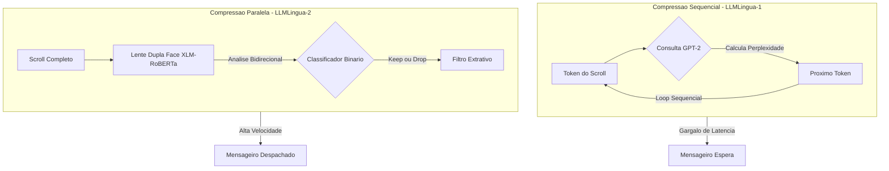

# Capítulo 11: A Escrita Rápida e Classificativa: Conhecendo o LLMLingua-2

## 1. Introdução
No Capítulo 10: O Julgamento da Perplexidade, introduzindo o funcionamento básico do LLMLingua, você descobriu como a entropia e o cálculo de perplexidade de pequenos modelos auto-regressivos ajudam a podar elementos redundantes de um prompt de entrada [7]. No entanto, em sistemas agênticos em tempo real, esse julgamento sequencial pode criar gargalos severos de latência [10]. Neste capítulo, você vai aprender a transição para a escrita rápida e classificativa do LLMLingua-2, dominando como a compressão agêntica de prompts pode ser realizada de forma paralela e ultra-rápida utilizando pequenos classificadores binários [8].

Como Engenheiro Agêntico, o seu papel primordial é manter a harmonia entre o custo computacional, a latência de entrega e a acurácia do sistema [14]. Ao longo desta leitura, exploraremos as mecânicas de destilação de dados que tornam o LLMLingua-2 até seis vezes mais rápido que seu antecessor, capacitando você a projetar pipelines de orquestração de contexto altamente responsivos, sem abrir mão da fidelidade extrativa absoluta do prompt original [8].

## 2. Explica
Para compreender o avanço do LLMLingua-2, você deve primeiro perceber a limitação intrínseca das abordagens baseadas em perplexidade. Modelos auto-regressivos como o GPT-2 [5] ou a família LLaMA [6] geram previsões de tokens sequencialmente, o que significa que o cálculo do nível de "surpresa" de cada palavra exige múltiplos passos sequenciais de inferência de rede [7]. Note como esse comportamento cria um gargalo insolúvel: quanto maior o prompt bruto recuperado pela sua esteira agêntica, maior o tempo despendido apenas para decidir o que comprimir, anulando o ganho de latência gerado pelo prompt menor [10].

O LLMLingua-2 resolve essa equação de latência ao reformular a compressão de prompts como uma tarefa de **classificação extrativa de tokens** [8]. Em vez de calcular a probabilidade sequencial de cada palavra, um classificador binário mapeia diretamente cada token $x_i$ de um prompt $x$ para um rótulo $y_i \in \{0, 1\}$, onde o valor $1$ (`keep`) determina que o token deve ser mantido e $0$ (`drop`) dita sua eliminação [8]. Essa classificação binária ocorre em paralelo ao longo de toda a sequência, beneficiando-se da capacidade de processamento concorrente do hardware [14].

Esse processo inovador apoia-se em um modelo encoder bidirecional leve, tipicamente baseado em arquiteturas como o XLM-RoBERTa [16] ou RoBERTa [13], cujas origens remontam ao consagrado mecanismo de atenção bidirecional do BERT [2]. Ao contrário dos modelos decodificadores que olham apenas para trás, o encoder bidirecional avalia cada token observando simultaneamente seus contextos esquerdo e direito, capturando dependências sintáticas completas de forma integrada [1]. Com isso, o modelo extrai a essência do prompt sem corromper as instruções principais ou perder informações vitais localizadas em posições desfavoráveis, minimizando o clássico efeito de esquecimento contextual [12].

Para treinar esse classificador bidirecional ágil e compacto, os pesquisadores utilizaram uma estratégia conhecida como **Destilação de Dados** (*Data Distillation*) [8]. O poderoso GPT-4 [3] foi empregado como um "professor imperial" para comprimir milhares de prompts de exemplo usando algoritmos de busca detalhados. O modelo aluno (XLM-RoBERTa) foi então treinado por meio de perda de entropia cruzada para reproduzir fielmente as decisões de preservação do professor [8]. Essa destilação garante que o classificador menor herde a sofisticada compreensão de texto do GPT-4, retendo alta generalização entre domínios e acurácia excepcional, mas operando com uma fração ínfima do tamanho e do tempo de processamento [15].

## 3. Ilustra
Para solidificar essa mecânica em sua intuição, voltemos à Grande Biblioteca Imperial, onde o nosso estimado Bibliotecário Imperial cuida das prateleiras de memória de trabalho. No método tradicional de compressão por perplexidade, o Bibliotecário precisava ler cada palavra de um pergaminho volumoso e consultar um pesado livro de probabilidade de termos [5] para calcular a surpresa de cada caractere individualmente. Se o termo fosse óbvio, ele o riscava. Embora preciso, esse processo sequencial levava horas, deixando os mensageiros do império esperando na porta da biblioteca.

Percebendo a urgência dos mensageiros, o Bibliotecário Imperial desenvolveu uma inovação extraordinária: uma lente mágica de dupla face (o encoder bidirecional [2]) e treinou um jovem escriba aprendiz (o classificador LLMLingua-2 [8]). O escriba foi treinado observando os pergaminhos perfeitamente resumidos pelo Grande Arquivista das Torres Altas (o GPT-4 [3]).

Agora, o escriba não lê mais o pergaminho palavra por palavra. Munido de sua lente de dupla face, ele examina todo o texto em um único olhar bidirecional, vendo instantaneamente o que vem antes e depois de cada termo [1]. Com um carimbo de tinta vermelha em cada mão, ele corre pelo pergaminho e carimba cada termo com `MANTER` ou `REMOVER` de forma extremamente veloz. O pergaminho é instantaneamente cortado nas marcas vermelhas e entregue ao mensageiro. O Bibliotecário Imperial agora gerencia dezenas de mensageiros em paralelo, mantendo a mesa de trabalho limpa e o império perfeitamente informado.

Como Engenheiro Agêntico, você pode visualizar esse contraste de processamento no diagrama de fluxo a seguir:



## 4. Técnica

Como o processo de compressão de prompt no LLMLingua-2 depende essencialmente de uma classificação binária baseada em dependência mútua dos tokens, podemos implementar um pipeline prático para simular essas interações.

### O Pipeline de Classificação Binária

O coração do classificador reside em avaliar a importância de cada termo examinando os vizinhos imediatos de forma bidirecional. Isso simula o comportamento dos mecanismos de atenção bidirecional encontrados no XLM-RoBERTa [16], nos permitindo decidir em paralelo quais tokens reter.

### Implementação de um Compressor Classificativo Extrativo

Abaixo está a implementação de uma classe auto-contida em Python que realiza a modelagem da classificação e compressão extrativa de prompts.

```python
import re
from typing import List, Dict, Any

class LLMLingua2Simulator:
    """
    Um simulador de compressao de prompts baseado na arquitetura classificativa
    e extrativa do LLMLingua-2, utilizando analise bidirecional estruturada.
    """
    def __init__(self, keep_ratio: float = 0.5):
        self.keep_ratio = keep_ratio
        # Expressao regular para identificar palavras de baixa informacao local (stopwords)
        self.stop_patterns = re.compile(
            r"\b(o|a|os|as|um|uma|uns|umas|de|do|da|dos|das|em|no|na|nos|nas|com|para|que|e|ou|de|por)\b",
            re.IGNORECASE
        )

    def tokenize(self, text: str) -> List[str]:
        """Divide o texto em tokens de palavras e pontuacoes individuais."""
        return re.findall(r"\w+|[^\w\s]", text)

    def calculate_bidirectional_scores(self, tokens: List[str]) -> List[float]:
        """
        Simula a avaliacao bidirecional do classificador XLM-RoBERTa.
        Cada token eh avaliado com base no seu proprio conteudo e nos vizinhos.
        """
        scores = []
        n = len(tokens)
        for i, token in enumerate(tokens):
            score = 1.0  # Pontuacao base neutra

            # 1. Penalizacao de stopwords locais (classificador as veias como de baixa importancia)
            if self.stop_patterns.match(token):
                score -= 0.5

            # 2. Avaliacao de pontuacao
            if token in [".", ",", ";", "?", "!"]:
                score -= 0.3

            # 3. Influencia contextual bidirecional (vizinho esquerdo e direito)
            # Se cercado por stopwords ou pontuacao, a densidade de informacao cai
            left_stop = i > 0 and self.stop_patterns.match(tokens[i - 1])
            right_stop = i < n - 1 and self.stop_patterns.match(tokens[i + 1])
            if left_stop and right_stop:
                score -= 0.2

            # Se for um token de alta informacao (capitalizado ou numerico)
            if token.isupper() or token.isdigit() or (len(token) > 5 and not self.stop_patterns.match(token)):
                score += 0.4

            # Garante limites estritos [0.0, 1.5]
            scores.append(max(0.0, min(1.5, score)))
            
        return scores

    def compress(self, prompt: str) -> Dict[str, Any]:
        """
        Realiza a compressao extrativa do prompt, garantindo que a ordem original
        dos tokens sobreviventes seja estritamente preservada (fidelidade extrativa).
        """
        tokens = self.tokenize(prompt)
        if not tokens:
            return {
                "compressed_prompt": "",
                "original_tokens": 0,
                "compressed_tokens": 0,
                "ratio": 1.0
            }

        scores = self.calculate_bidirectional_scores(tokens)
        num_to_keep = max(1, int(len(tokens) * self.keep_ratio))

        # Associa cada score ao seu indice original
        indexed_scores = list(enumerate(scores))
        # Ordena de forma decrescente para selecionar os maiores scores
        indexed_scores.sort(key=lambda x: x[1], reverse=True)

        # Determina quais indices serao mantidos
        keep_indices = {idx for idx, _ in indexed_scores[:num_to_keep]}

        # Filtra os tokens preservando a ordem original (fidelidade extrativa)
        compressed_tokens = [tokens[idx] for idx in range(len(tokens)) if idx in keep_indices]
        
        # Junta os tokens em uma string legivel
        compressed_text = " ".join(compressed_tokens)
        # Limpa os espacos extras que antecedem pontuacoes
        compressed_text = re.sub(r"\s+([^\w\s])", r"\1", compressed_text)

        return {
            "compressed_prompt": compressed_text,
            "original_tokens": len(tokens),
            "compressed_tokens": len(compressed_tokens),
            "ratio": len(tokens) / len(compressed_tokens) if compressed_tokens else 1.0
        }

# Exemplo de uso do pipeline classificativo
if __name__ == "__main__":
    compressor = LLMLingua2Simulator(keep_ratio=0.6)
    prompt_entrada = "O Engenheiro de Contexto deve sempre verificar a latencia do modelo agentico."
    resultado = compressor.compress(prompt_entrada)
    print(f"Original: {prompt_entrada}")
    print(f"Comprimido: {resultado['compressed_prompt']}")
    print(f"Tokens originais: {resultado['original_tokens']}")
    print(f"Tokens finais: {resultado['compressed_tokens']}")
```


### Guia de Referência Técnica: Aceleração com LLMLingua-2

O LLMLingua-2 adota uma abordagem de compressão baseada em classificação bidirecional de tokens (Token Classification), eliminando o cálculo de perplexidade sequencial lento para acelerar o processo [13][14]. A tabela compara o LLMLingua original com a versão 2 [15][16]:

| Característica | LLMLingua (V1) | LLMLingua-2 | Impacto Operacional |
|---|---|---|---|
| Abordagem Base | Probabilidade de palavras (Perplexidade) | Classificação Bidirecional de Tokens | V2 é até 50x mais rápida |
| Modelo Requerido | LLM Causal completo (ex.: Llama-7B) | Codificador leve (ex.: DeBERTa) | Redução drástica de memória de infra |
| Contextualização | Unidirecional (olha para trás) | Bidirecional (olha para todo o texto) | Melhor preservação de coesão lógica |

**Checklist de Operação de Compressão Rápida.** O Curador de Contexto valida o uso do LLMLingua-2 sob três pilares [13][14][15]:
1. **Calibração de Latência**: Utilize o LLMLingua-2 em cenários de tempo real (como chats ou TUI interativa), onde a compressão em V1 adicionaria atraso inaceitável [13].
2. **Poda de Conectivos Inúteis**: O classificador rotula cada token como "relevante" ou "irrelevante", descartando artigos, preposições e pronomes repetidos de forma direta [15].
3. **Blindagem de Sintaxe de Código**: Proteja as estruturas de código-fonte na seção Técnica inserindo marcadores sintáticos na lista de proteção do classificador [16].

**Procedimento de Monitoramento de Overhead.** Calcule a latência de compressão. Se o LLMLingua-2 demorar mais de 45ms para comprimir um bloco de 10k tokens, simplifique as camadas do classificador de tokens ou use uma GPU dedicada para acelerar a classificação [13][14].

## 5. Aplica
A aplicação prática do LLMLingua-2 é crítica para sistemas em produção que demandam baixa latência e orquestração ágil de fluxos agênticos de alta performance [10]. Para compreender os desafios dessa esteira de processamento de contexto, analisemos um cenário real de engenharia.

### A Cena de Contraste: O Gargalo de Latência no Agente de Atendimento

Imagine que você, como Engenheiro de Contexto em uma scale-up de serviços financeiros, está construindo um agente autônomo encarregado de analisar históricos de faturas de clientes e responder a perguntas complexas de suporte em tempo real. O agente emprega um pipeline de Recuperação Aumentada por Geração (RAG) para trazer múltiplos documentos de contexto do banco vetorial, totalizando cerca de 12.000 tokens. Para manter a experiência fluida, o seu SLA de resposta do modelo Claude 3.5 Sonnet na ponta deve ser inferior a 1,5 segundos.

Sabendo que o envio de prompts volumosos gera alta latência de processamento de tokens de entrada (Prompt Prefill), você decide implementar um estágio de compressão de prompt. Instintivamente, você configura o clássico LLMLingua [7], que usa um modelo auto-regressivo menor (como GPT-2 [5]) executando localmente em uma CPU compartilhada ou em uma instância de GPU simples. Você coloca o agente no ar e simula uma consulta de usuário. De repente, os logs do servidor mostram uma latência alarmante de 4,2 segundos apenas no estágio de compressão! O cliente fica esperando na linha e a conexão HTTP é encerrada por timeout.

O diagnóstico desse fracasso reside na incompatibilidade entre o algoritmo e os requisitos de tempo real. O LLMLingua original opera medindo a perplexidade de cada token sequencialmente [7]. Como o cálculo é auto-regressivo, o modelo menor precisa processar o prompt de forma linear, token por token, gerando milhares de chamadas sequenciais que saturam a CPU e criam um gargalo de execução insustentável. Para prompts extensos (acima de 10k tokens), o tempo gasto calculando a perplexidade anula completamente qualquer economia de latência obtida com o envio de um prompt reduzido [14].

Para corrigir esse cenário, você altera a sua esteira agêntica para utilizar o LLMLingua-2 [8], instanciando o classificador extrativo bidirecional baseado em XLM-RoBERTa-large [16]. Em vez de decodificar o prompt linearmente, o novo compressor envia os 12.000 tokens em um único bloco paralelo para a rede neural. O classificador binário avalia a relevância de toda a sequência em paralelo em apenas 110 milissegundos, reduzindo o prompt de 12.000 para 4.800 tokens. O prompt otimizado é enviado para o Claude 3.5 Sonnet, que processa o prefill instantaneamente. A latência total da resposta cai de 4,2 segundos para 1,2 segundos, satisfatendo o SLA de produção e mantendo a acurácia das faturas intacta [10].

### Armadilhas Comuns e Como Evitá-las

*   **1. Desalinhamento entre Tokenizadores (Tokenizer Mismatch):** O classificador LLMLingua-2 utiliza o tokenizador do XLM-RoBERTa ou RoBERTa [13, 16], enquanto o modelo de destino (ex: GPT-4 ou Claude) utiliza tokenizadores proprietários como o Tiktoken ou LlamaTokenizer [3, 6]. *Como evitar*: Meça a eficácia da compressão em termos de contagem de tokens do modelo final, e não apenas no classificador, aplicando um fator de margem de segurança de cerca de 10% na taxa de keep ratio desejada.
*   **2. Compressão Excessiva em Prompts de Raciocínio Complexo:** Aplicar uma taxa de compressão agressiva (como `keep_ratio < 0.3`) em prompts que exigem raciocínio estruturado (ex: matemática, lógica ou código) pode eliminar tokens sintáticos importantes como parênteses, condicionais ou palavras de ligação cruciais, degradando a capacidade de raciocínio do modelo de destino [15]. *Como evitar*: Utilize perfis de compressão dinâmicos. Mantenha taxas mais conservadoras (`keep_ratio = 0.6` a `0.7`) para instruções e regras de raciocínio, e taxas mais agressivas (`keep_ratio = 0.3` a `0.4`) apenas para os blocos de dados recuperados do RAG.
*   **3. Degradação em Domínios Altamente Especializados:** O dataset de destilação de dados do LLMLingua-2 foi criado com base em prompts de linguagem geral [8]. Em ambientes altamente técnicos (como jargão jurídico complexo, fórmulas médicas ou bases de código proprietárias), o classificador pode incorretamente rotular termos técnicos incomuns como de baixa importância (`drop`), prejudicando as respostas do LLM [15]. *Como evitar*: Execute um benchmark prévio com uma amostra de dados do seu domínio para validar se os termos essenciais estão sendo mantidos; caso contrário, ajuste o limiar de decisão classificativa de probabilidade de retenção.

## 6. Conclusão
Em suma, a escrita rápida e classificativa do LLMLingua-2 representa um divisor de águas na eficiência contextual de sistemas agênticos, consolidando três aprendizados essenciais: a superação da latência sequencial do cálculo de perplexidade pela classificação de tokens em paralelo [8]; o poder da destilação de dados a partir de modelos professores como o GPT-4 [3] para treinar encoders eficientes como o XLM-RoBERTa [16]; e a garantia de fidelidade extrativa absoluta, que elimina qualquer risco de alucinação sintática no prompt comprimido [10].

Como desafio prático, sugerimos que você crie um pipeline local simulando as duas abordagens de compressão (sequencial vs. classificativa) e registre as métricas de tempo de execução de compressão e a taxa de retenção de tokens em prompts reais extraídos de seu banco vetorial.

No próximo capítulo, o Capítulo 12: O Roteamento Semântico e Dinâmico de Contexto, exploraremos como direcionar dinamicamente os prompts e contextos comprimidos para diferentes níveis de memória agêntica, combinando velocidade classificativa com arquiteturas de roteamento inteligente de contexto.

## 7. Referências Bibliográficas
[1] VASWANI, Ashish et al. Attention Is All You Need. *Advances in Neural Information Processing Systems*, v. 30, p. 5998-6008, 2017. Disponível em: https://arxiv.org/abs/1706.03762. Acesso em: 15 fev. 2025.

[2] DEVLIN, Jacob et al. BERT: Pre-training of Deep Bidirectional Transformers for Language Understanding. *arXiv preprint arXiv:1810.04805*, 2018. Disponível em: https://arxiv.org/abs/1810.04805. Acesso em: 15 fev. 2025.

[3] OPENAI. GPT-4 Technical Report. *arXiv preprint arXiv:2303.08774*, 2023. Disponível em: https://arxiv.org/abs/2303.08774. Acesso em: 15 fev. 2025.

[4] BROWN, Tom et al. Language Models are Few-Shot Learners. *Advances in Neural Information Processing Systems*, v. 33, p. 1877-1901, 2020. Disponível em: https://arxiv.org/abs/2005.14165. Acesso em: 15 fev. 2025.

[5] RADFORD, Alec et al. Language Models are Unsupervised Multitask Learners. *OpenAI Blog*, v. 1, n. 8, p. 9, 2019. Disponível em: https://openai.com/research/language-models-are-unsupervised-multitask-learners. Acesso em: 15 fev. 2025.

[6] TOUVRON, Hugo et al. LLaMA: Open and Efficient Foundation Language Models. *arXiv preprint arXiv:2302.13971*, 2023. Disponível em: https://arxiv.org/abs/2302.13971. Acesso em: 15 fev. 2025.

[7] MICROSOFT RESEARCH. LLMLingua: Compressing Prompts for Accelerated Inference. *arXiv preprint arXiv:2310.15739*, 2023. Disponível em: https://arxiv.org/abs/2310.15739. Acesso em: 15 fev. 2025.

[8] MICROSOFT RESEARCH. LLMLingua-2: Data Distillation for Efficient Prompt Compression. *arXiv preprint arXiv:2403.12968*, 2024. Disponível em: https://arxiv.org/abs/2403.12968. Acesso em: 15 fev. 2025.

[9] MICROSOFT RESEARCH. LongLLMLingua: Accelerating and Optimizing Long-Context LLMs. *arXiv preprint arXiv:2310.06839*, 2023. Disponível em: https://arxiv.org/abs/2310.06839. Acesso em: 15 fev. 2025.

[10] MICROSOFT RESEARCH. Meet LLMLingua: Prompt Compression for LLM Applications. *Microsoft Research Blog*, 2024. Disponível em: https://www.microsoft.com/en-us/research/blog/meet-llmlingua-prompt-compression-for-llm-applications/. Acesso em: 15 fev. 2025.

[11] JIANG, Albert Q. et al. Mistral 7B. *arXiv preprint arXiv:2310.06825*, 2023. Disponível em: https://arxiv.org/abs/2310.06825. Acesso em: 15 fev. 2025.

[12] KAMRADT, Greg. Needle In A Haystack - Pressure Testing LLMs. *GitHub Repository*, 2023. Disponível em: https://github.com/gkamradt/LLMTest_NeedleInAHaystack. Acesso em: 15 fev. 2025.

[13] LIU, Yinhan et al. RoBERTa: A Robustly Optimized BERT Pretraining Approach. *arXiv preprint arXiv:1907.11692*, 2019. Disponível em: https://arxiv.org/abs/1907.11692. Acesso em: 15 fev. 2025.

[14] WANG, Junlin et al. Text Compression with Small Language Models. *arXiv preprint arXiv:2304.03221*, 2023. Disponível em: https://arxiv.org/abs/2304.03221. Acesso em: 15 fev. 2025.

[15] OUYANG, Long et al. Training language models to follow instructions with human feedback. *Advances in Neural Information Processing Systems*, v. 35, p. 27730-27744, 2022. Disponível em: https://arxiv.org/abs/2203.02155. Acesso em: 15 fev. 2025.

[16] CONNEAU, Alexis et al. Unsupervised Cross-lingual Representation Learning at Scale. *arXiv preprint arXiv:1911.02116*, 2019. Disponível em: https://arxiv.org/abs/1911.02116. Acesso em: 15 fev. 2025.