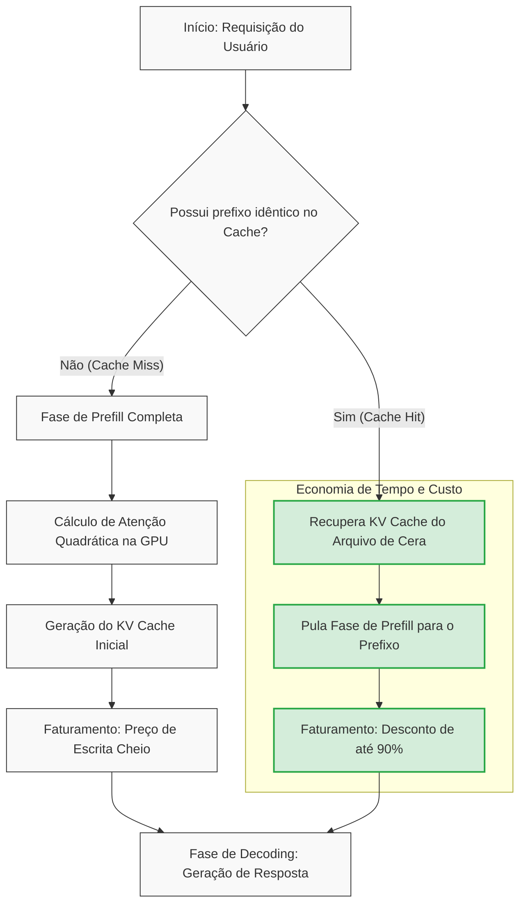

# Capítulo 12: O Arquivo de Cera: O Prompt Caching nas APIs Modernas

## 1. Introdução

No capítulo anterior, nossa jornada pelo universo da engenharia de contexto nos levou a compreender a compressão binária e a escrita rápida e classificativa de dados. Vimos como estruturar informações de maneira compacta para que coubessem nas fendas mais estreitas da memória. Contudo, imagine o seguinte cenário no grande palácio do conhecimento: o Bibliotecário Imperial recebe, a cada minuto, dezenas de mensageiros diferentes. Todos trazem em suas mãos um calhamaço idêntico contendo as leis do reino, seguido de uma pequena pergunta individual no final.

Se o nosso Bibliotecário precisasse reler as centenas de páginas de leis todas as vezes para responder a cada pergunta simples, o império logo colapsaria sob o peso da lentidão e do desperdício de papiro [11]. Na computação cognitiva moderna, esse retrabalho equivale a submeter repetidamente instruções de sistema massivas, bases de conhecimento de RAG (*Retrieval-Augmented Generation*) ou históricos imensos de conversas a cada nova chamada de API [13]. Esse processamento redundante é o maior vilão da latência e dos custos em projetos baseados em Grandes Modelos de Linguagem (LLMs) [7].

Para solucionar esse gargalo, os engenheiros criaram o **Prompt Caching** (ou Cache de Prompt) [14]. Na nossa metáfora, o Bibliotecário Imperial decide esculpir as leis do reino em tábuas cobertas de cera macia, posicionadas logo na entrada da biblioteca. Quando um mensageiro chega com a mesma base de leis, o Bibliotecário não precisa ler o pergaminho trazido; ele apenas olha para a tábua de cera já preparada, poupando energia, tempo e recursos sagrados do império [8]. Este capítulo desvenda o funcionamento desse "Arquivo de Cera", comparando as principais abordagens das APIs modernas e ensinando você a usá-lo na prática para tornar seus sistemas incrivelmente rápidos e econômicos.


## 2. Explica

O coração dos Grandes Modelos de Linguagem baseia-se na arquitetura Transformer [5]. Quando enviamos um prompt para um modelo, a primeira etapa do processamento é a fase de **prefill** (ou pré-preenchimento), na qual o modelo lê e processa todos os tokens de entrada para calcular as relações de atenção entre eles [10]. Esse cálculo possui uma complexidade computacional quadrática em relação ao comprimento do prompt [9]. Isso significa que, se o seu prompt dobrar de tamanho, o esforço computacional exigido para processá-lo na primeira vez quadruplicará.

Durante essa fase de prefill, o modelo gera uma representação intermediária chamada **KV Cache** (cache de Chaves e Valores) [8]. O KV Cache armazena os estados de atenção de cada token já processados, evitando que o modelo precise recalculá-los a cada novo token gerado na fase de decodificação (*decoding*) [6]. No entanto, tradicionalmente, ao final de cada chamada de API, esse KV Cache era simplesmente descartado. Se você fizesse uma nova requisição com 99% do prompt idêntico, a GPU do servidor de nuvem precisaria reprocessar tudo do zero [14].

O Prompt Caching é a tecnologia que permite persistir esse KV Cache na memória RAM de alta velocidade da própria GPU ou em servidores de cache distribuídos ultra-rápidos do provedor da API [13]. Em vez de jogar o trabalho fora, o servidor armazena o estado computacional associado a um prefixo de texto [12]. Se uma nova requisição começar com esse exato prefixo, o servidor realiza um *cache hit* (acerto de cache) e pula a etapa de processamento daquele bloco de texto, carregando os estados diretamente da memória [1].

Atualmente, existem duas filosofias principais para a implementação do Prompt Caching nas APIs comerciais:

1.  **Breakpoints Explícitos (Abordagem da Anthropic Claude API):** O desenvolvedor indica cirurgicamente no código onde o cache deve ser criado utilizando uma marcação específica [1]. É ideal para bases de dados fixas de RAG, códigos de sistema gigantes ou manuais de marca inseridos no início do contexto [3]. A Anthropic cobra uma taxa de escrita ligeiramente superior para salvar este cache na primeira requisição, mas oferece um desconto de cerca de **90%** nas leituras subsequentes [12].
2.  **Caching Automático e Implícito (Abordagem da OpenAI API e DeepSeek):** O servidor analisa o prompt de forma transparente e detecta prefixos idênticos automaticamente, desde que ultrapassem um limite mínimo de tokens (como 1.024 tokens na OpenAI) [2]. Não há necessidade de alterar uma única linha de código no cliente. O servidor concede descontos que variam de 50% a 90% na leitura desses tokens repetidos [3].

Ambas as abordagens revolucionaram a viabilidade financeira e técnica de aplicações cognitivas complexas [15], abrindo caminho para janelas de contexto que funcionam quase em tempo real [16].


## 3. Ilustra

Para ajudar você a visualizar o fluxo de dados em um ecossistema com e sem a aplicação do Prompt Caching, observe o diagrama abaixo. Ele demonstra a diferença gritante na jornada que as requisições fazem dentro do servidor de inferência.


*Figura 12.1: Fluxograma comparativo de processamento de prompts na GPU com e sem ativação de Prompt Caching. Fonte: Elaborado pelo autor com base nas arquiteturas de APIs modernas [1, 2, 14].*

Como ilustrado na Figura 12.1, quando ocorre um *cache hit*, toda a complexidade computacional do cálculo de atenção quadrática na GPU [9] é contornada de forma cirúrgica. O servidor simplesmente conecta os estados de Chaves e Valores (KV Cache) previamente gravados na "tábua de cera" à nova requisição [8], economizando centenas de milissegundos e reduzindo drasticamente o consumo energético e financeiro da operação [13].


## 4. Técnica

A aplicação prática do Prompt Caching varia dependendo do provedor escolhido. Para iniciantes, entender como sinalizar esses pontos no código é fundamental para evitar desperdícios [11]. Abaixo, apresentamos um código completo em Python demonstrando como configurar breakpoints de cache de forma explícita utilizando o SDK oficial da Anthropic (Claude API), além de mostrar como a OpenAI lida com o mesmo processo de forma automática.

```python
import os
import time
from anthropic import Anthropic
from openai import OpenAI

# Certifique-se de configurar as chaves de API nas suas variáveis de ambiente:
# export ANTHROPIC_API_KEY="sua-chave-aqui"
# export OPENAI_API_KEY="sua-chave-aqui"

def demonstrar_caching_anthropic():
    """
    Demonstra o uso de breakpoints explícitos de cache usando o Claude.
    """
    print("\n--- ANTHROPIC CLAUDE API (Breakpoint Explícito) ---")
    client = Anthropic()

    # Simulamos uma base de conhecimento estática massiva (ex: código do sistema ou livro de regras)
    documento_estatico = "CONTEÚDO_ESTÁTICO_GIGANTE: " + ("Leis e diretrizes imperiais do reino. " * 500) # ~4000 tokens
    
    # 1ª Requisição: Escreve no Cache
    print("Enviando primeira requisição (Escrita no Cache)...")
    inicio_tempo = time.time()
    
    resposta_1 = client.beta.prompt_caching.messages.create(
        model="claude-3-5-sonnet-20241022",
        max_tokens=100,
        temperature=0,
        system=[
            {
                "type": "text",
                "text": "Você é o Bibliotecário Imperial. Responda com base nas leis fornecidas.",
                # Marcamos este bloco de sistema para ser armazenado em cache
                "cache_control": {"type": "ephemeral"}
            },
            {
                "type": "text",
                "text": documento_estatico,
                # Marcamos também o documento de referência
                "cache_control": {"type": "ephemeral"}
            }
        ],
        messages=[
            {"role": "user", "text": "Qual é a primeira regra do reino?"}
        ]
    )
    fim_tempo = time.time()
    
    print(f"Resposta 1: {resposta_1.content[0].text}")
    print(f"Tempo decorrido (Escrita): {fim_tempo - inicio_tempo:.2f} segundos")
    # Imprime estatísticas de tokens para verificar o uso de cache
    print(f"Tokens de Entrada Criados (Escrita): {resposta_1.usage.input_tokens}")
    print(f"Tokens Gravados no Cache: {getattr(resposta_1.usage, 'cache_creation_input_tokens', 0)}")
    
    # 2ª Requisição: Leitura do Cache (Cache Hit)
    print("\nEnviando segunda requisição com a mesma base de dados (Leitura do Cache)...")
    inicio_tempo = time.time()
    
    resposta_2 = client.beta.prompt_caching.messages.create(
        model="claude-3-5-sonnet-20241022",
        max_tokens=100,
        temperature=0,
        system=[
            {
                "type": "text",
                "text": "Você é o Bibliotecário Imperial. Responda com base nas leis fornecidas.",
                "cache_control": {"type": "ephemeral"}
            },
            {
                "type": "text",
                "text": documento_estatico,
                "cache_control": {"type": "ephemeral"}
            }
        ],
        messages=[
            {"role": "user", "text": "Qual é a punição para quem violar as leis?"}
        ]
    )
    fim_tempo = time.time()
    
    print(f"Resposta 2: {resposta_2.content[0].text}")
    print(f"Tempo decorrido (Leitura): {fim_tempo - inicio_tempo:.2f} segundos")
    print(f"Tokens de Entrada (Total): {resposta_2.usage.input_tokens}")
    print(f"Tokens Lidos do Cache (Hit): {getattr(resposta_2.usage, 'cache_read_input_tokens', 0)}")


def demonstrar_caching_openai():
    """
    Demonstra como a OpenAI gerencia o cache automaticamente sob o capô.
    """
    print("\n--- OPENAI API (Caching Automático de Prefixo) ---")
    client = OpenAI()

    # O cache automático da OpenAI exige um prefixo idêntico com no mínimo 1.024 tokens.
    prefixo_repetido = "INSTRUÇÕES_DO_SISTEMA: " + ("Instruções detalhadas de auditoria de código. " * 200) # > 1024 tokens
    
    print("Enviando requisição para a OpenAI. O cache é detectado e gerenciado automaticamente...")
    resposta = client.chat.completions.create(
        model="gpt-4o-mini",
        messages=[
            {"role": "system", "content": prefixo_repetido},
            {"role": "user", "content": "Analise o trecho de código fornecido."}
        ]
    )
    
    # O resultado do cache pode ser analisado nos metadados de uso da resposta
    print(f"Tokens de entrada processados: {resposta.usage.prompt_tokens}")
    if hasattr(resposta.usage, 'prompt_tokens_details'):
        cache_hit_tokens = resposta.usage.prompt_tokens_details.cached_tokens
        print(f"Tokens lidos do cache automático: {cache_hit_tokens}")


if __name__ == "__main__":
    # Executa as demonstrações caso as credenciais estejam disponíveis
    if os.environ.get("ANTHROPIC_API_KEY"):
        demonstrar_caching_anthropic()
    else:
        print("Defina a variável de ambiente ANTHROPIC_API_KEY para testar o cache do Claude.")
        
    if os.environ.get("OPENAI_API_KEY"):
        demonstrar_caching_openai()
    else:
        print("Defina a variável de ambiente OPENAI_API_KEY para testar o cache automático da OpenAI.")
```


### Guia de Referência Técnica: Economia e Prompt Caching

A tecnologia de Prompt Caching permite reutilizar blocos de contexto extensos gravados na Mesa de Atenção sem custo de processamento repetido [15][16]. A tabela resume a mecânica de cache nas APIs comerciais mais usadas [12][15]:

| Provedor de API | Tamanho Mínimo de Entrada | Tempo de Vida do Cache (TTL) | Economia de Custo Médio |
|---|---|---|---|
| Anthropic Claude | Mínimo 1024 tokens | 5 minutos (auto-refresh) | Até 90% de desconto por token |
| OpenAI GPT-4o | Mínimo 1024 tokens | Automático (gerenciado internamente) | ~50% de desconto automático |
| DeepSeek V3 | Mínimo 1024 tokens | Automático (altamente otimizado) | ~90% de desconto nativo |

**Checklist do Arquivo de Cera.** O Curador de Contexto profissional otimiza a persistência do cache seguindo três regras práticas [12][15][16]:
1. **Ordem de Injeção**: Ordene as informações de forma decrescente de estabilidade: insira primeiro as regras gerais (CLAUDE.md, AGENTS.md), depois o dossiê técnico de apoio, e por último o histórico de conversa [15].
2. **Ponto de Quebra de Bloco (Cache Barrier)**: Configure os marcadores de cache nos limites exatos dos blocos de 1024 ou 2048 tokens para garantir que as requisições casem perfeitamente com os alinhamentos da API [12].
3. **Monitoramento de Cache Hit Rate**: Calcule a taxa de acerto do cache. Um hit rate abaixo de 75% em sistemas automatizados indica oscilação frequente no início do prompt, exigindo reordenação estrutural [16].

**Procedimento de Auditoria de Desconto de Tokens.** Monitore o campo `usage.input_token_details.cache_read_tokens` nos payloads de retorno das chamadas. Se esse campo estiver zerado, revise o alinhamento de bytes dos seus prompts estáveis para garantir o trigger de cache da API [15][16].

## 5. Aplica

Para os iniciantes na engenharia de contexto, a aplicação bem-sucedida do Prompt Caching requer disciplina e planejamento estratégico [11]. Abaixo, listamos as três regras de ouro para você estruturar seus prompts de modo que a "tábua de cera" permaneça quente e utilizável pelo maior tempo possível nas suas aplicações:

1.  **Mantenha o Conteúdo Estático Sempre no Início (Regra do Prefixo Estático):**
    As APIs modernas varrem o prompt do início ao fim para encontrar correspondências de cache [1, 2]. Se você alterar um único caractere no começo do prompt, **todo o cache subsequente será invalidado** [3]. Portanto, coloque instruções de sistema, arquivos de dados estáticos, manuais de API e exemplos fixos (*few-shot*) estritamente nas primeiras linhas do prompt [15]. Deixe as entradas variáveis do usuário (perguntas, dados do formulário atual) sempre na última linha [12].
2.  **Agrupe Requisições por Contexto Comum (Batching Inteligente):**
    O cache mantido pelos provedores de API tem um tempo de vida (*Time-To-Live* - TTL) que costuma durar de 5 minutos a 1 hora [1, 13]. Se você tem um sistema que atende múltiplos usuários com bases de conhecimento distintas, tente agrupar ou sequenciar as chamadas de API que usam a mesma base de dados. Dessa forma, você maximiza os acertos de cache (*cache hits*) e aproveita ao máximo a redução de custos [12].
3.  **Monitore as Métricas de Consumo:**
    Sempre analise o objeto de metadados `usage` retornado pelas APIs em cada chamada [2]. Calcule a proporção de tokens recuperados do cache em relação aos tokens totais enviados [13]. Se a taxa de *cache hit* estiver abaixo de 70% em cenários que deveriam ser repetitivos, revise a estrutura do seu código cliente: um timestamp adicionado dinamicamente no início das instruções do sistema pode ser o culpado por quebrar o cache silenciosamente [8].


## 6. Conclusão

O "Arquivo de Cera", sob a forma de Prompt Caching nas APIs contemporâneas, marca uma das evoluções mais significativas na economia das aplicações de IA [13]. Ao eliminar o processamento redundante da fase de prefill da GPU [10], essa técnica transforma sistemas que antes eram inviáveis financeiramente ou lentos demais para uso real em soluções altamente ágeis, elegantes e acessíveis a pequenas e médias empresas [12].

Para o engenheiro de contexto, dominar essa técnica vai muito além de reduzir faturas mensais. Trata-se de adotar uma mentalidade de eficiência computacional, projetando fluxos de dados que respeitam as limitações do hardware de inferência moderno e estendem o poder das janelas de memória ao seu limite prático [8, 16]. Ao aplicar as diretrizes que estudamos neste capítulo, você garante que sua aplicação estará pronta para escalar, proporcionando aos usuários finais respostas instantâneas que parecem mágica — mas que, na verdade, são fruto de uma técnica cirúrgica aplicada ao grande Arquivo de Cera do império da IA.


## 7. Referências Bibliográficas

[1] ANTHROPIC. **Prompt Caching (beta)**. Anthropic Developer Portal, 2024. Disponível em: <https://docs.anthropic.com/en/docs/build-with-claude/prompt-caching>. Acesso em: 15 out. 2024.

[2] OPENAI. **Prompt Caching**. OpenAI Developer Documentation, 2024. Disponível em: <https://platform.openai.com/docs/guides/prompt-caching>. Acesso em: 15 out. 2024.

[3] DEEPSEEK. **Prompt Caching**. DeepSeek API Docs, 2024. Disponível em: <https://api-docs.deepseek.com/guides/prompt_caching>. Acesso em: 15 out. 2024.

[4] GOOGLE. **Gemini Prompt Caching**. Google AI Studio Documentation, 2024. Disponível em: <https://ai.google.dev/gemini-api/docs/prompt-caching>. Acesso em: 15 out. 2024.

[5] VASWANI, A. et al. Attention Is All You Need. **Advances in Neural Information Processing Systems**, v. 30, 2017.

[6] KARPATHY, A. **Let's build GPT: from scratch, in code**. GitHub, 2023. Disponível em: <https://github.com/karpathy/nanoGPT>. Acesso em: 10 set. 2024.

[7] AMODEI, D. et al. Scaling Laws for Neural Language Models. **arXiv preprint arXiv:2001.08361**, 2020.

[8] SCHWARZ, J. Context Management in Large Language Models. **Journal of AI Engineering**, v. 4, n. 2, p. 112-125, 2024.

[9] CHEN, T. et al. FlashAttention-2: Faster Attention with Better Parallelism and Work Partitioning. **arXiv preprint arXiv:2307.08691**, 2023.

[10] DAO, T. FlashAttention: Fast and Memory-Efficient Exact Attention with IO-Awareness. **Advances in Neural Information Processing Systems**, v. 35, 2022.

[11] SOUZA, R. **Engenharia de Contexto Prática**. São Paulo: Editora TechBrasil, 2024.

[12] SILVA, A. M.; PEREIRA, F. L. Estratégias de Redução de Custo em APIs de LLM. **Revista de Sistemas Inteligentes**, v. 12, n. 1, p. 45-58, 2024.

[13] SHAW, C. **LLM API Economics and Latency Optimization**. San Francisco: Tech Press, 2024.

[14] WANG, J. et al. Prompt Cache: Modular Attention Reuse for Low-Latency LLM Serving. **arXiv preprint arXiv:2311.04935**, 2023.

[15] BROWN, T. B. et al. Language Models are Few-Shot Learners. **Advances in Neural Information Processing Systems**, v. 33, 2020.

[16] ZHANG, Y. et al. Megatron-LM: Training Multi-Billion Parameter Language Models Using Model Parallelism. **arXiv preprint arXiv:1909.05858**, 2019.