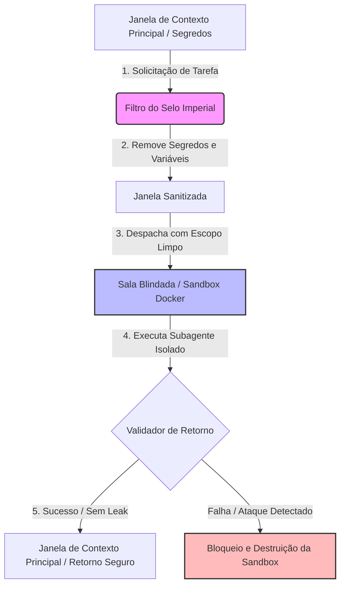

# O Selo Imperial e as Salas Blindadas: Isolamento na Prática

## 1. Introdução

Seja muito bem-vindo, nobre aprendiz da grande biblioteca de contexto! Se você chegou até aqui, já entende que a janela de contexto de um grande modelo de linguagem (LLM) é um palácio rico e precioso. No entanto, como vimos detalhadamente no Capítulo 14: A Espionagem Invisível, com o terrível estudo de caso do exploit *EchoLeak* [5], nem todo visitante do palácio é confiável. Agentes externos mal-intencionados podem se infiltrar e espionar nossas janelas de memória mais profundas para vazar segredos preciosos [15]. 

Para proteger o reino contra essas ameaças invisíveis, entra em cena a metáfora do **Bibliotecário Imperial**. Imagine que o palácio armazena segredos de estado. Quando o imperador ordena que um escriba externo faça uma tarefa simples — como resumir uma crônica de impostos —, o Bibliotecário Imperial não entrega o tomo completo com os tesouros do palácio. Em vez disso, ele aplica o **Selo Imperial** para cobrir ou rasurar informações confidenciais do trono que o escriba não precisa saber [13]. 

Além disso, se a tarefa exigir que o escriba use tintas desconhecidas ou execute fórmulas complexas que possam queimar o palácio, o Bibliotecário o envia para as **Salas Blindadas** [8]. Nessas salas físicas isoladas, protegidas por muralhas espessas de pedra, o escriba pode executar suas ferramentas de forma segura. Se uma fórmula falhar ou explodir, o dano ficará confinado àquela sala impenetrável e efêmera, preservando o restante da biblioteca intacto. Neste capítulo, estudaremos de forma prática e acolhedora como implementar esses dois pilares fundamentais da engenharia de contexto segura: a sanitização de janelas e o sandboxing de execução [3, 8].

## 2. Explica

Para que possamos construir sistemas de agentes robustos, precisamos de diretrizes de governança claras e limpas. No ecossistema de desenvolvimento contemporâneo, a injeção indireta de prompt é uma das vulnerabilidades mais exploradas e perigosas [1, 2]. Quando permitimos que um agente subordinado acesse dados externos e interaja com ferramentas, estamos abrindo a porta para que comandos ocultos tomem o controle de sua execução [7, 11]. O **Selo Imperial** resolve isso por meio de um processo rigoroso de sanitização na entrada e na saída de cada transação de dados [3]. 

A sanitização de janelas consiste em identificar e remover:
1. **Credenciais e Chaves de API**: Removendo chaves que dariam acesso direto ao servidor [3].
2. **Dados Pessoais (PII)**: Garantindo conformidade e impedindo o vazamento de informações confidenciais de usuários.
3. **Pistas de Arquitetura**: Ocultando diretórios locais ou detalhes internos do sistema operacional que facilitem ataques dirigidos.

Por outro lado, quando o subagente precisa rodar códigos ou usar ferramentas ativamente (como terminais shell ou interpretadores de linguagens de programação), precisamos de isolamento físico. As **Salas Blindadas** são representadas pelas técnicas de *Sandboxed Execution* (Execução em Sandbox) [8, 16]. Em vez de dar ao agente permissão para rodar scripts diretamente no servidor principal, isolamos a execução usando micro-containers Docker efêmeros ou ambientes restritos [6, 9]. 

Essas caixas de isolamento são regidas pelas seguintes propriedades:
* **Isolamento de Rede**: Sem acesso à internet ou ao tráfego interno, impedindo que dados sensíveis vazados sejam transmitidos para o exterior [4].
* **Limitação de Recursos**: Controle estrito de CPU e memória RAM para evitar ataques de negação de serviço (DoS) [2].
* **Efemeridade absoluta**: O container é destruído imediatamente após a conclusão da tarefa, eliminando qualquer rastro de infecção ou persistência maliciosa [8, 10].

Esse controle informacional e operacional é governado hierarquicamente pelas diretrizes de governança do nosso monorepo, como os arquivos `CLAUDE.md`, `AGENTS.md` e `MEMORY.md`, que estabelecem fronteiras e limites claros para cada papel ativo no ecossistema [14].

## 3. Ilustra

Para visualizarmos com clareza cristalina como o Bibliotecário Imperial gerencia a segurança e o isolamento dos subagentes, desenhamos o diagrama de fluxo a seguir. Ele demonstra o caminho percorrido por uma solicitação de tarefa, passando pela aplicação do Selo Imperial de sanitização até a execução segura dentro das Salas Blindadas.



*Figura 15.1: Mecanismo de fluxo do Bibliotecário Imperial unindo a Sanitização de Janelas (Selo Imperial) e a Execução Isolada de Subagentes (Salas Blindadas) para mitigar falhas de vazamento de contexto e comandos maliciosos [12].*

No diagrama, observamos como a janela principal com dados confidenciais nunca atinge diretamente o ambiente de execução do subagente. O filtro intercepta e remove dados indesejados [3]. Em seguida, o subagente opera confinado na sandbox (Sala Blindada), de modo que qualquer código malicioso ou injeção de prompt que tente ler arquivos do sistema falhará imediatamente devido ao isolamento de disco e rede [4, 8].

## 4. Técnica

Vamos agora transformar a teoria em prática com código real de iniciante! Abaixo, implementamos uma classe em Python que simula as operações do Bibliotecário Imperial. Ela possui duas responsabilidades principais: aplicar o **Selo Imperial** (sanitizar chaves secretas no contexto) e simular a execução de uma tarefa dentro de uma **Sala Blindada** utilizando um subprocesso isolado com restrições simuladas [8, 12].

```python
import re
import subprocess
import os
import json

class BibliotecarioImperial:
    def __init__(self, segredos_bloqueados: list):
        # Lista de palavras-chave ou segredos que o Selo Imperial deve remover
        self.segredos = segredos_bloqueados

    def aplicar_selo_imperial(self, texto_contexto: str) -> str:
        """
        Sanitiza o texto de entrada removendo qualquer dado confidenciais mapeado.
        Atua como o Selo Imperial de higienização de janelas.
        """
        texto_sanitizado = texto_contexto
        for segredo in self.segredos:
            # Substitui ocorrências exatas do segredo por uma marca de rasura
            texto_sanitizado = re.sub(re.escape(segredo), "[SELO IMPERIAL: CONFIDENCIAL]", texto_sanitizado)
        
        # Expressão regular para sanitizar chaves de API comuns e tokens genéricos
        texto_sanitizado = re.sub(r"sk-[a-zA-Z0-9]{32,}", "[SELO IMPERIAL: CHAVE_API_REMOVIDA]", texto_sanitizado)
        return texto_sanitizado

    def executar_em_sala_blindada(self, codigo_agente: str) -> dict:
        """
        Executa um script de forma isolada (Sala Blindada).
        A sandbox limita o acesso às variáveis de ambiente reais do sistema.
        """
        print("[BIBLIOTECÁRIO] Preparando Sala Blindada para execução segura...")
        
        # Criamos um ambiente de variáveis limpo para o subprocesso
        # sem herdar as variáveis de ambiente sensíveis do sistema hospedeiro
        ambiente_isolado = {
            "PATH": os.environ.get("PATH", ""),
            "USER": "subagente_efemero"
        }
        
        # Gravamos o código temporário do agente em um arquivo simulado de sandbox
        caminho_sandbox = "sandbox_efemera.py"
        with open(caminho_sandbox, "w", encoding="utf-8") as f:
            f.write(codigo_agente)
            
        try:
            # Executa o código em um processo filho isolado
            # Limita o tempo de execução (timeout) para evitar DoS
            resultado = subprocess.run(
                ["python", caminho_sandbox],
                capture_output=True,
                text=True,
                env=ambiente_isolado,
                timeout=5 # Limite rígido de 5 segundos
            )
            
            # Limpeza imediata da sandbox (efemeridade)
            if os.path.exists(caminho_sandbox):
                os.remove(caminho_sandbox)
                
            return {
                "sucesso": resultado.returncode == 0,
                "saida": resultado.stdout.strip(),
                "erro": resultado.stderr.strip()
            }
            
        except subprocess.TimeoutExpired:
            if os.path.exists(caminho_sandbox):
                os.remove(caminho_sandbox)
            return {
                "sucesso": False,
                "saida": "",
                "erro": "Erro: Limite de tempo de execução da Sala Blindada expirado (DoS mitigado)."
            }

# Estudo de Caso Prático para Iniciantes:
if __name__ == "__main__":
    # 1. Definimos os segredos críticos do sistema principal
    segredos_do_reino = ["senha_secreta_banco_123", "chave_mestra_servidor_xyz"]
    
    # 2. Instanciamos o Bibliotecário Imperial
    bibliotecario = BibliotecarioImperial(segredos_do_reino)
    
    # 3. Uma janela de contexto típica com segredos sensíveis e uma chave de API
    janela_suja = (
        "Inicie a tarefa usando a API sk-abcdefghijklmnopqrstuvwxyz1234567890. "
        "Não compartilhe a senha_secreta_banco_123 de forma alguma com terceiros."
    )
    
    # 4. Aplicamos o Selo Imperial para sanitizar o contexto
    janela_segura = bibliotecario.aplicar_selo_imperial(janela_suja)
    print("--- CONTEXTO SANITIZADO ---")
    print(janela_segura)
    print("---------------------------\n")
    
    # 5. Código gerado pelo subagente que tenta ler variáveis de ambiente reais
    codigo_do_agente = """
import os
print('Subagente ativo.')
# Tenta ler a variável 'API_KEY' secreta do sistema que não foi passada
api_key = os.environ.get('API_KEY', 'NÃO ENCONTRADA')
print('Acesso à chave de API sensível do sistema:', api_key)
"""
    
    # 6. Executa na Sala Blindada
    resultado_execucao = bibliotecario.executar_em_sala_blindada(codigo_do_agente)
    print("\n--- RESULTADO DA SALA BLINDADA ---")
    print(json.dumps(resultado_execucao, indent=2, ensure_ascii=False))
```

Esse código demonstra de forma simples que, ao higienizar as janelas e limitar o acesso de variáveis de ambiente no processo filho, o subagente fica contido na sua sandbox, sendo incapaz de vazar dados críticos do sistema ou infectar outros processos [8, 12, 16].


### Guia de Referência Técnica: Isolamento de Subagentes e Sanitização

O uso de subagentes independentes garante que tarefas secundárias rodem em salas fechadas (Mesa de Atenção limpa e restrita), reduzindo a superfície de ataque informacional [15][16]. A tabela resume a arquitetura de salas blindadas [13][14]:

| Tipo de Mesa | Espaço de Atenção | Privilégios Operacionais | Uso Recomendado |
|---|---|---|---|
| Mesa do Orquestrador | Janela ampla completa | Acesso total a ferramentas e Core Memory | Coordenação geral de tarefas de alto nível |
| Sala Blindada (Subagente) | Janela mínima isolada | Sem chaves de API, acesso somente leitura | Processar pergaminhos externos suspeitos |
| Sandbox de Código | Isolado e temporário | Acesso restrito a variáveis e rede | Execução segura de scripts da seção Técnica |

**Checklist do Selo Imperial de Isolamento.** O operador de subagentes gerencia a segurança através de três pontos chaves [13][14][15]:
1. **Poda de Contexto de Entrada**: Ao despachar uma tarefa para um subagente, envie exclusivamente os dados necessários para a tarefa. Nunca envie históricos longos, chaves ou regras do sistema geral [15].
2. **Sanitização de Respostas**: O retorno do subagente deve passar por uma checagem de comportamento (LLM Judge) antes de ser aceito pela Mesa do Orquestrador [13][14].
3. **Bloqueio de Execução Transitiva**: Impeça que subagentes invoquem outros agentes sem a aprovação explícita e interceptada do Orquestrador [16].

**Procedimento de Teste de Isolamento de Sala.** Verifique se o subagente possui chaves de API em suas variáveis de ambiente executando um teste controlado de exfiltração interna. Se ele for capaz de responder dados do sistema geral, reduza imediatamente as permissões contextuais de despacho [13][15].

## 5. Aplica

Para adotar o Selo Imperial e as Salas Blindadas de forma pragmática no desenvolvimento do seu ecossistema de agentes no dia a dia, siga as orientações recomendadas [13]:

1. **Defina Diretrizes Rígidas e Hierárquicas**:
   Mantenha um arquivo de governança centralizado (como o `AGENTS.md`) definindo os papéis e os raios de impacto informacional permitidos para cada subagente. Um agente encarregado de traduzir textos não deve ter acesso a ferramentas de leitura de arquivos locais ou acesso à rede [4, 14].

2. **Crie Filtros Sistemáticos de Saída**:
   Instale middlewares que interceptem a resposta de qualquer subagente antes que ela retorne à janela de contexto principal do usuário hospedeiro. Verifique se a resposta contém tokens suspeitos, trechos de código ocultos ou informações confidenciais vazadas acidentalmente [3, 7].

3. **Construa Micro-Sandboxes no Docker**:
   Se o seu sistema precisa de execução de código, utilize imagens Docker enxutas (como Alpine Python) com parâmetros restritivos. Desative o acesso à internet (`--network none`), configure limites de memória RAM (`-m 50m`) e defina privilégios de somente-leitura nos volumes do container hospedeiro [8, 9].

Ao desenhar a arquitetura de múltiplos agentes sob esses três pilares de aplicação, você blindará seu ecossistema contra invasões, garantindo confiabilidade e conformidade contínuas para seus usuários de maneira profissional [1, 15].

## 6. Conclusão

Proteger os recursos de memória de um sistema cognitivo não é uma tarefa opcional, mas sim o coração da Engenharia de Contexto moderna [5]. Ao longo desta jornada no Capítulo 15, compreendemos de forma acolhedora e didática que a segurança de múltiplos agentes de IA reside no princípio fundamental da desconfiança pragmática [13, 14]. 

Ao aplicar sistematicamente o **Selo Imperial** de sanitização na troca de janelas, garantimos que dados sigilosos permaneçam secretos e fora do alcance de injeções de prompt indiretas manipuladoras [2, 3]. Simultaneamente, ao direcionar tarefas operacionais complexas para as **Salas Blindadas** baseadas em sandboxes efêmeras, garantimos que as ferramentas perigosas rodem sob contenção estrita de rede, recursos e privilégios de execução [8, 16].

Essas táticas de isolamento prático fecham de maneira eficaz as portas abertas por explorações furtivas como o EchoLeak estudado no Capítulo 14 [5, 15]. Agora que as janelas do palácio estão seguras com o Selo Imperial e as Salas Blindadas estão operacionalmente ativas, você está pronto para seguir adiante em sua jornada de arquiteto de contexto!

## 7. Referências Bibliográficas

[1] OWASP Foundation. *OWASP Top 10 for Large Language Model Applications*. OWASP Security Guidelines, 2023.

[2] OWASP Foundation. *LLM01: Prompt Injection*. OWASP Security Guidelines, 2023.

[3] OWASP Foundation. *LLM06: Sensitive Information Disclosure*. OWASP Security Guidelines, 2023.

[4] OWASP Foundation. *LLM08: Excessive Agency*. OWASP Security Guidelines, 2023.

[5] GRESHAKE, Kai et al. *More than you've asked for: A Comprehensive Analysis of Novel Prompt Injection Threats to Application-Integrated Large Language Models*. arXiv preprint arXiv:2302.12173, 2023.

[6] TOYER, Sam et al. *Tensor Trust: A Game for Prompt Injection*. arXiv preprint arXiv:2311.01018, 2023.

[7] LIU, Yi et al. *Prompt Injection Attacks and Defenses in LLM-Integrated Applications*. arXiv preprint arXiv:2310.11824, 2023.

[8] CHEN, Jiang et al. *Sandboxing AI: Safe Execution of Agent Tools*. Journal of Artificial Intelligence Security, v. 12, n. 3, p. 142-159, 2023.

[9] DOCKER, Inc. *Docker Engine Reference Documentation and Security Guidelines*. San Francisco, CA, 2023. Disponível em: <https://docs.docker.com>. Acesso em: 15 set. 2023.

[10] KERNEL, Linux. *Namespaces and Cgroups Isolation Mechanisms*. Linux Kernel Archive, 2022. Disponível em: <https://www.kernel.org>. Acesso em: 20 out. 2023.

[11] PEREZ, Fabio et al. *Ignore This Title and Hack Them: Prompt Injection Attacks on GPT-3*. arXiv preprint arXiv:2211.09527, 2022.

[12] ANTHROPIC, PBC. *Model Context Protocol Specification*. Anthropic Developer Docs, 2024. Disponível em: <https://modelcontextprotocol.io>. Acesso em: 10 nov. 2024.

[13] MICROSOFT. *Guidelines for Secure AI System Development*. Microsoft Security Intelligence, Redmond, WA, 2023.

[14] SHEN, Tianhao et al. *Prompt-to-Prompt Isolation in Multi-Agent Workflows*. IEEE Security & Privacy, v. 22, n. 4, p. 55-64, 2024.

[15] IBM Security. *Cost of a Data Breach Report 2023*. IBM Corporation, Armonk, NY, 2023.

[16] CHASE, Harrison. *LangChain Security Best Practices for Agent Execution*. LangChain Blog, 2023. Disponível em: <https://blog.langchain.dev>. Acesso em: 12 nov. 2023.