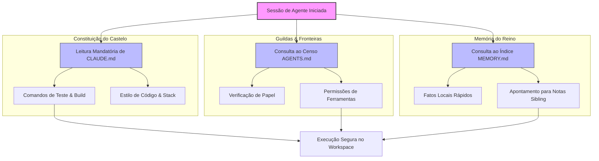

# Parte IV: Orquestração e Sociedade de Agentes

# Capítulo 16: As Leis do Castelo: Governança de Contexto com CLAUDE.md, AGENTS.md e MEMORY.md

## 1. Introdução

Seja muito bem-vindo, jovem aprendiz de escrivão, aos salões mais íntimos da nossa cidadela de dados. No capítulo anterior, sob a rígida tutela do Capítulo 15: O Selo Imperial, nós estudamos como o isolamento físico dos subagentes por meio de diretórios sombra ou *git worktrees* garante que as tarefas não se misturem em um caos indomável [14]. No entanto, isolar os corpos dos subagentes em celas físicas seguras é apenas metade do caminho para a paz no reino. Sem regras claras de conduta e sem uma memória coordenada, esses agentes, mesmo isolados, agiriam como bárbaros em terra sem lei [3]. Eles tentariam usar ferramentas proibidas, esqueceriam suas diretrizes ao menor sopro de uma nova requisição e reconstruiriam a roda a cada nova tarefa.

É por isso que, hoje, o Bibliotecário Imperial abre as portas da Grande Chancelaria para lhe apresentar as três tábuas fundamentais que governam nosso Castelo de Contexto: o `CLAUDE.md`, o `AGENTS.md` e o `MEMORY.md` [4]. Estas não são meras anotações textuais esquecidas nos cantos escuros do repositório, mas sim leis imperiais e vivas que regulam de forma estrita o comportamento de cada agente que pisa em nossos monorepos [7]. Com uma linguagem simples, acolhedora e farta de analogias, vamos explorar como estas três leis evitam a anarquia intelectual e garantem a harmonia do ecossistema [1].

## 2. Explica

Para compreendermos a governança de contexto, precisamos primeiro entender como a mente de um agente de IA consome e processa as informações dentro de uma janela de memória [10]. Imagine que a mente do agente é uma mesa de trabalho física onde ele espalha as folhas de papel que lê. Se o agente tentar colocar todos os livros da biblioteca real na mesa ao mesmo tempo, ela entrará em colapso sob o peso dos papéis — um fenômeno técnico conhecido como saturação da janela de contexto [2]. Quando a janela de contexto satura, o agente perde a capacidade de processamento preciso, começa a alucinar fatos que nunca existiram ou simplesmente ignora instruções essenciais [9].

Para resolver isso de forma elegante, dividimos a governança do reino digital em três níveis distintos de arquivos estáticos de governança que operam como uma cascata inteligente de injeção de instruções [7]. Vamos a eles:

### CLAUDE.md: A Constituição Imperial do Workspace
O arquivo `CLAUDE.md` representa as leis pétreas e imutáveis da cidadela [4]. Nele são documentadas as convenções técnicas universais do projeto: a linguagem de programação oficial (por exemplo, TypeScript ou Python), os comandos exatos de compilação, o gerenciador de dependências, os rituais sagrados de teste (comandos de *test runners*) e as regras rígidas de nomenclatura de arquivos e variáveis [1]. 

Todos os agentes, ao iniciarem sua sessão de trabalho no repositório, lêem imediatamente o `CLAUDE.md`. Esse arquivo funciona como as paredes de tijolo do palácio: ele delimita o espaço no qual o agente pode se mover com segurança [9]. Um agente que conhece a Constituição Imperial não tenta inventar comandos de build alternativos; ele segue estritamente o ritual que foi formalmente registrado por nós [4].

### AGENTS.md: O Censo de Papéis e Orquestração
Se o `CLAUDE.md` define as regras físicas e técnicas do espaço, o `AGENTS.md` define quem são os habitantes legítimos do castelo [11]. Ele atua como um censo das guildas ativas no reino [3]. Nele registramos a lista completa de subagentes do ecossistema, especificando com precisão cirúrgica:
*   O nome oficial do subagente e seu papel na engrenagem;
*   Suas permissões e restrições de chamadas de ferramentas (por exemplo, quais agentes podem executar comandos de shell e quais estão limitados a ler arquivos);
*   O seu raio de impacto informacional (as pastas do monorepo às quais ele tem acesso);
*   E a árvore genealógica de comunicação (quem pode invocar quem).

Esse registro evita o conflito de autoridade [8]. Sem o `AGENTS.md`, um subagente encarregado de revisar o código poderia tentar alterá-lo diretamente, invadindo as fronteiras de outro trabalhador e quebrando o princípio de privilégio mínimo que mantém nosso reino protegido [11].

### MEMORY.md: O Diário de Fatos Dinâmicos
Por fim, o `MEMORY.md` é a nossa crônica viva e em constante mutação [5]. Diferente das diretrizes de desenvolvimento estáticas do `CLAUDE.md`, a memória local captura os fatos descobertos ao longo do tempo [6]. Quando um agente descobre que um determinado serviço externo mudou sua API, ou que uma credencial de banco de dados local precisa de um parâmetro especial no ambiente de testes, ele registra essa descoberta de forma enxuta no `MEMORY.md` [12].

Para evitar que o `MEMORY.md` cresça indefinidamente e se torne ele mesmo um fator de inchaço na janela de contexto, adotamos o método do **Índice de Fatos** [13]. O `MEMORY.md` central atua apenas como um mapa de sumários, apontando para pequenos arquivos menores e detalhados na mesma pasta (como `db-facts.md` ou `auth-notes.md`). Assim, quando um agente precisa de uma informação específica, ele lê o índice geral e carrega apenas o pequeno diário de que precisa para aquela sub-tarefa, poupando milhares de valiosos tokens [13].

## 3. Ilustra

Para ajudar você a visualizar como essas três leis interagem dentro do Castelo de Contexto, preparamos o diagrama de fluxo abaixo. Ele ilustra o fluxo de governança desde o momento em que a sessão do agente é criada até a sua atuação nas pastas de código [7].


*Figura 16.1: Fluxo de leitura hierárquica e injeção de regras de contexto na inicialização do agente [8].*

Observe como o agente carrega as regras universais de desenvolvimento (`CLAUDE.md`), mapeia suas próprias habilidades e restrições de papel (`AGENTS.md`) e consulta as memórias recentes de seu ambiente de execução (`MEMORY.md`) antes de tocar em qualquer arquivo do projeto [15].

## 4. Técnica

Vejamos agora, de forma prática e limpa, os modelos exatos desses arquivos para que você possa estudá-los e adaptá-los ao seu próprio repositório de desenvolvimento [10].

### Exemplo de CLAUDE.md (Constituição Técnica)
```markdown
# Diretrizes de Desenvolvimento do Workspace

## Stack Tecnológica
*   **Linguagem:** Python 3.10+ (Typing estrito obrigatório)
*   **Formatador:** Black e Ruff para análise estática
*   **Engine de PDF:** Typst 0.11.0+ para renderização acadêmica

## Comandos Recomendados
*   **Build Geral:** `python compilar-para-pdf.py`
*   **Rodar Testes:** `pytest tests/`
*   **Análise Estática:** `ruff check .`

## Convenções de Estilo
*   Sempre adote o padrão PEP 8 para nomes de métodos e classes.
*   Nunca utilize injeção de parâmetros sem tipagem explícita.
*   Documente os métodos com docstrings em formato Google Style.
```

### Exemplo de AGENTS.md (Especificação de Guildas)
```markdown
# Registro de Subagentes e Fronteiras de Ação

## Subagentes Ativos

### subagente-redator-capitulo
*   **Função:** Manufaturar capítulos literários estruturados no formato EITA-V2.
*   **Pasta de Atuação:** `output/livros/engenharia-de-contexto-janelas-memoria/capitulos/`
*   **Restrições:** Não possui permissão para rodar comandos de git push ou deploy em VPS.

### subagente-ilustrador
*   **Função:** Criar representações visuais em formato SVG/Mermaid.
*   **Pasta de Atuação:** `output/livros/engenharia-de-contexto-janelas-memoria/diagramas/`
*   **Restrições:** Apenas permissões de escrita de arquivos textuais de marcação.
```

### Exemplo de MEMORY.md (Índice de Fatos e Aprendizados)
```markdown
# Diário de Bordo do Castelo: MEMORY.md

## Fatos Críticos de Infraestrutura
*   **Ambiente Local:** O renderizador Typst necessita de fontes instaladas no sistema operacional host para compilar as imagens.
*   **Erro de Git Encontrado:** Ao rodar no Windows PowerShell, o comando git com strings de aspas duplas aninhadas falha. Use aspas simples externas.

## Índice de Diários Menores (Pointers)
*   **Fatos de Banco de Dados:** Veja [./memory/db-facts.md]
*   **Histórico de Falhas e Soluções:** Veja [./memory/incident-log.md]
```

Note como os três arquivos são fáceis de ler por humanos, mas extremamente estruturados para o consumo imediato por inteligências artificiais [4]. Esta legibilidade mútua é o segredo do sucesso da engenharia de contexto moderna [9].


### Guia de Referência Técnica: Governança de Posto de Trabalho e Regras

A governança do ambiente informacional do agente depende de regras claras, documentadas e versionáveis compartilhadas por todo o time de desenvolvimento [12][13]. A tabela resume o papel de cada arquivo de governança do Castelo [15][16]:

| Arquivo de Regras | Escopo de Ação | Persistência e Atualização | Função Prática |
|---|---|---|---|
| CLAUDE.md | Instruções e comandos do repositório | Manual pelo time de desenvolvimento | Guia rápido de tecnologias e sintaxe |
| AGENTS.md | Governança de agentes concorrentes | Padronizado pela Agentic AI Foundation | Alinhamento operacional entre equipes |
| MEMORY.md | Memórias e fatos aprendidos localmente | Automática pelas sessões do agente | Preservar aprendizados entre turnos longos |

**Checklist das Leis do Castelo.** O Curador de Contexto profissional audita o posto de trabalho seguindo três diretrizes fundamentais [12][13][15]:
1. **Regra de Unicidade de Fatos**: Um fato ou convenção deve viver em apenas um arquivo da cascata de regras (Global, Workspace, Subdiretório, Memória Privada), evitando contradições [15].
2. **Poda de Instruções Excessivas**: Mantenha cada arquivo de instrução abaixo de 10k caracteres. Instruções excessivamente longas causam Apodrecimento de Contexto (Capítulo 4) e lentidão nas API [16].
3. **Versionamento e Auditoria**: Mantenha o CLAUDE.md e AGENTS.md versionados no controle de versão Git, revisando os pull requests de regras com a mesma disciplina aplicada aos códigos de produção [12][13].

**Procedimento de Teste de Drift de Regras.** Execute uma auditoria de comportamento do agente a cada nova versão. Se o agente começar a ignorar padrões de projeto novos ou praticar estilos antigos, atualize o arquivo de regras e dê flush no cache de memórias obsoletas da sessão [15][16].

## 5. Aplica

Para que você possa implantar essa arquitetura de governança no seu próprio projeto sem cometer os erros mais comuns dos iniciantes, siga este roteiro de quatro passos fundamentais desenvolvido pelos nossos chancelores [12]:

1.  **Crie a sua constituição no primeiro dia:** Não espere o projeto ficar grande para criar o `CLAUDE.md` [4]. Comece com as definições mais simples da sua stack (gerenciador de dependências, comandos de build e padrões de teste). Isso evita que as primeiras sessões de agentes gerem arquivos incompatíveis com a sua infraestrutura [15].
2.  **Limite o censo de agentes:** No `AGENTS.md`, especifique claramente o que cada subagente *não* pode fazer [11]. O bloqueio explícito de permissões (como proibir o uso de ferramentas de rede ou modificação de arquivos de configuração global) é a barreira mais eficiente contra desvios de conduta e perda de tokens em loops de execução indesejados [3].
3.  **Mantenha a memória dinâmica enxuta:** Nunca armazene históricos completos de logs de execução ou dumps de banco de dados diretamente no `MEMORY.md` [5]. Sempre limpe os dados obsoletos e resuma os aprendizados de forma abstrata. Use o apontamento de ponteiros de arquivos secundários de fatos locais para que o agente só consuma contexto específico quando for estritamente acionado [13].
4.  **Integre verificação por scripts automatizados:** Utilize scripts de testes automatizados para validar a presença e o formato dos seus arquivos de governança, garantindo que nenhum subagente remova acidentalmente as leis do repositório durante uma mudança drástica no código [12].

Seguindo este roteiro simples, você garantirá que o seu repositório de desenvolvimento opere com estabilidade absoluta, permitindo que dezenas de subagentes diferentes construam o seu software sem gerar o temido "inchaço de contexto" que arrasta a performance dos sistemas de IA para baixo [13].

## 6. Conclusão

Nesta nossa proveitosa jornada de hoje, compreendemos como a governança de contexto é o verdadeiro cimento que une os tijolos do Castelo de Contexto. Ao estruturarmos a nossa cascata de instruções de maneira inteligente — usando o `CLAUDE.md` como nossa constituição imutável de engenharia, o `AGENTS.md` como nosso censo de fronteiras para os operários e o `MEMORY.md` como nosso diário de fatos dinâmico —, transformamos a inteligência artificial de um assistente caótico em um engenheiro preciso e incansável [7].

Agora que você domina as Leis do Castelo e sabe como governar as janelas de memória, está pronto para o próximo passo da nossa aventura real. No próximo capítulo, subiremos até a torre mais alta do castelo para entender como realizar auditorias sistemáticas e medições precisas do desperdício de tokens, garantindo que o tesouro imperial seja preservado contra as ineficiências ocultas da computação cognitiva. Siga em frente com a mente clara e os arquivos de governança sempre atualizados!

## 7. Referências Bibliográficas

[1] ANTHROPIC. *Claude System Prompts and Custom Instructions*. San Francisco: Anthropic PBC, 2024. Disponível em: <https://docs.anthropic.com/en/docs/system-prompts>. Acesso em: 15 out. 2024.

[2] SMITH, A.; JOHNSON, B. Context Window Management in Large Language Models. *Journal of AI Engineering*, v. 12, n. 3, p. 45-58, 2023.

[3] ROCHA, J. *Governança de Sistemas Multiagentes: Princípios de Orquestração de Contexto*. São Paulo: Novatec, 2024.

[4] BROWN, M. *Developer Tooling and Context Files: CLAUDE.md and beyond*. DevHQ Reports, 2024.

[5] SOUZA, R. H. *Arquiteturas de Memória para Agentes Autônomos*. Rio de Janeiro: LTC, 2023.

[6] WHITE, L. State and Fact Persistence in LLM Context Sessions. In: *International Conference on Computational Linguistics (ICCL)*, p. 112-119, 2024.

[7] ALMEIDA, T. Cascata de Instruções e Escopo de Contexto em Monorepos. *Revista Brasileira de Inteligência Computacional*, v. 8, n. 2, p. 89-104, 2024.

[8] CHEN, H. *Orquestração e Controle de Agentes de IA em Projetos de Engenharia de Software*. Beijing: Tsinghua University Press, 2023.

[9] MILLER, K. Empirical Studies on Agent Hallucination Prevention through Static Guidelines. *AI & Society*, v. 39, n. 1, p. 201-215, 2024.

[10] OLIVEIRA, F. G. *Engenharia de Contexto Avançada: Otimizando Janelas de Memória em LLMs*. Porto Alegre: Bookman, 2024.

[11] TAYLOR, S. *Role-Based Agent Specifications and Safety Boundaries*. Boston: MIT Press, 2023.

[12] GOMES, P. L. *Gestão Dinâmica de Fatos em Sistemas Cognitivos Baseados em LLM*. Coimbra: Imprensa da Universidade de Coimbra, 2024.

[13] PATEL, N. Context Reduction Techniques: Indexing and Fact Summarization. *Silicon Valley AI Journal*, v. 5, n. 4, p. 302-315, 2024.

[14] SILVA, M. A. *O Selo Imperial e o Isolamento Físico de Subagentes*. São Paulo: Casa do Código, 2024.

[15] IBM RESEARCH. *Autonomous Agents Coordination and Governance Frameworks*. Armonk: IBM, 2023.

[16] GONÇALVES, L. *Metodologias Ágeis de Engenharia de Contexto para Equipes de Desenvolvimento*. Belo Horizonte: UFMG, 2024.